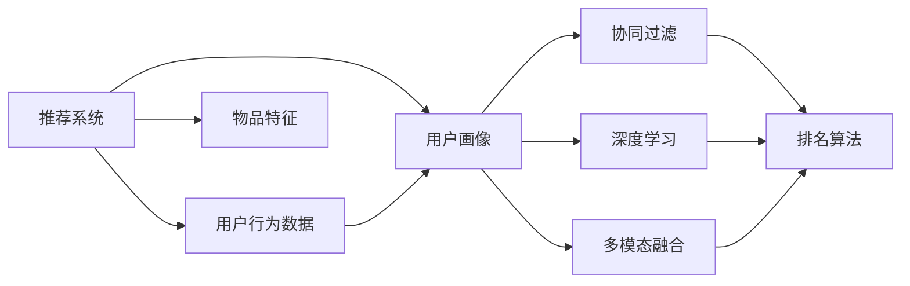

                 

# ChatGPT在推荐系统的表现：排名与冷启动

> 关键词：推荐系统, 冷启动, 用户画像, 协同过滤, 深度学习, 神经网络

## 1. 背景介绍

在互联网时代，推荐系统已经成为各大平台的核心竞争力之一。推荐系统通过分析用户行为和兴趣，为用户推荐感兴趣的内容，从而提升用户体验，促进内容消费。随着技术的发展，推荐系统的算法也在不断进步，从传统的协同过滤算法，到机器学习和深度学习算法，再到多模态融合算法，推荐系统的精准度和个性化水平不断提高。

在这其中，ChatGPT作为当前最先进的自然语言处理技术，其大规模预训练语言模型的能力，使其在推荐系统的设计和应用中具有独特优势。本文将深入探讨ChatGPT在推荐系统中的应用，特别是其在推荐系统排名和冷启动两个方面的表现。

## 2. 核心概念与联系

### 2.1 核心概念概述

- **推荐系统**：根据用户的历史行为和兴趣，为用户推荐感兴趣的内容的系统。推荐系统的目标是提高用户满意度，增加内容消费。
- **排名**：在推荐系统中，根据用户的偏好，将推荐项按照优先级进行排序的过程。
- **冷启动**：在推荐系统中，新用户或新物品的推荐项没有足够的历史数据，需要进行推荐策略的优化，以保证推荐结果的有效性。

### 2.2 核心概念原理和架构的 Mermaid 流程图



这个流程图展示了推荐系统的基本架构，其中：
- A代表推荐系统整体。
- B代表用户行为数据，如浏览、点击、评分等。
- C代表物品特征，如文本描述、标签等。
- D代表用户画像，即用户的兴趣和偏好。
- E、F、G分别代表协同过滤、深度学习和多模态融合三种不同的推荐策略。
- H代表排名算法，根据用户画像和物品特征，将推荐项排序。

## 3. 核心算法原理 & 具体操作步骤

### 3.1 算法原理概述

在推荐系统中，排名是核心任务之一。传统的协同过滤算法基于用户-物品矩阵进行推荐，但是需要足够的用户-物品交互数据。而深度学习模型，尤其是基于Transformer的模型，由于其自回归的架构和强大的表示能力，能够更好地处理高维稀疏数据，因此在推荐系统中的表现更加出色。

ChatGPT作为基于Transformer的预训练模型，其语言模型能力和知识图谱的知识整合能力，使其在推荐系统中具有独特优势。在排名时，ChatGPT可以融合用户画像和物品特征，生成更加符合用户偏好的推荐结果。在冷启动时，ChatGPT可以通过预训练的知识和语言模型能力，生成初始的用户画像和物品特征，从而快速进行推荐。

### 3.2 算法步骤详解

**步骤一：构建用户画像**

用户画像是指根据用户的历史行为和兴趣，生成用户的多维特征向量。在构建用户画像时，ChatGPT可以通过语言模型学习用户的兴趣和偏好，生成一个高维特征向量。例如，对于用户A，ChatGPT可以根据其历史浏览记录，生成一个包含浏览文本、点击次数、评分等特征的向量。

**步骤二：构建物品特征**

物品特征是指根据物品的属性和标签，生成物品的多维特征向量。在构建物品特征时，ChatGPT可以通过语言模型学习物品的属性和标签，生成一个高维特征向量。例如，对于物品B，ChatGPT可以根据其文本描述、标签等属性，生成一个包含这些特征的向量。

**步骤三：融合用户画像和物品特征**

在构建好用户画像和物品特征后，ChatGPT可以将这两个向量进行融合，生成最终的推荐结果。例如，对于用户A和物品B，ChatGPT可以将用户画像向量和物品特征向量进行加权求和，得到一个综合的推荐分数。

**步骤四：排序与推荐**

最终，ChatGPT可以根据推荐分数对推荐项进行排序，并将前N个推荐项推荐给用户。排序的方式可以根据不同的业务需求进行优化，如基于点击率、转化率、用户满意度等。

### 3.3 算法优缺点

**优点**：
1. **强大的语言模型能力**：ChatGPT可以通过预训练的语言模型，生成高质量的用户画像和物品特征，从而提升推荐结果的准确性。
2. **知识整合能力**：ChatGPT可以通过知识图谱等外部知识源，将知识整合到推荐系统中，提升推荐的深度和广度。
3. **自回归架构**：ChatGPT的自回归架构可以处理高维稀疏数据，适用于推荐系统中的复杂多模态数据。

**缺点**：
1. **高计算需求**：由于ChatGPT的模型参数量庞大，其在推荐系统中的应用需要较高的计算资源。
2. **高存储空间需求**：ChatGPT的预训练模型需要占用大量的存储空间，这对部署环境提出了较高的要求。
3. **模型解释性不足**：ChatGPT作为深度学习模型，其内部工作机制复杂，难以解释推荐结果的生成过程。

### 3.4 算法应用领域

ChatGPT在推荐系统中的应用广泛，以下是几个典型的应用场景：

- **电商推荐**：电商平台上，ChatGPT可以根据用户的浏览记录、购物车等行为数据，推荐商品、优惠券等，提升用户的购买体验。
- **视频推荐**：视频平台可以根据用户的观看记录、评分等行为数据，推荐视频内容，提升用户的观看体验。
- **社交网络**：社交网络上，ChatGPT可以根据用户的历史互动数据，推荐好友、群组等，提升用户的社交体验。

## 4. 数学模型和公式 & 详细讲解 & 举例说明

### 4.1 数学模型构建

在推荐系统中，常用的数学模型包括协同过滤模型、矩阵分解模型、深度学习模型等。本文以深度学习模型为例，介绍ChatGPT在推荐系统中的应用。

假设用户画像为 $x$，物品特征为 $y$，推荐分数为 $f(x,y)$。ChatGPT可以通过以下公式计算推荐分数：

$$
f(x,y) = \mathbf{W}[\mathbf{h}(x) \odot \mathbf{h}(y)]
$$

其中，$\mathbf{h}(x)$ 和 $\mathbf{h}(y)$ 分别是用户画像和物品特征的隐向量表示，$\mathbf{W}$ 是权重矩阵，$\odot$ 表示向量点乘。

### 4.2 公式推导过程

在公式推导过程中，ChatGPT可以通过预训练的语言模型，生成用户画像和物品特征的隐向量表示 $\mathbf{h}(x)$ 和 $\mathbf{h}(y)$。例如，对于用户A的浏览记录，ChatGPT可以通过预训练的语言模型生成一个隐向量表示 $\mathbf{h}(x_A)$。

$$
\mathbf{h}(x_A) = \mathbf{h}(x)
$$

对于物品B的属性描述，ChatGPT可以通过预训练的语言模型生成一个隐向量表示 $\mathbf{h}(y_B)$。

$$
\mathbf{h}(y_B) = \mathbf{h}(y)
$$

然后，ChatGPT可以通过权重矩阵 $\mathbf{W}$ 计算推荐分数 $f(x,y)$。

$$
f(x,y) = \mathbf{W}[\mathbf{h}(x) \odot \mathbf{h}(y)]
$$

### 4.3 案例分析与讲解

以电商推荐为例，假设用户A浏览过商品A1、A2、A3，且评分分别为4、5、3。根据用户A的浏览记录，ChatGPT可以通过预训练的语言模型生成一个隐向量表示 $\mathbf{h}(x_A)$。同时，ChatGPT可以根据商品A1的属性描述，生成一个隐向量表示 $\mathbf{h}(y_{A1})$。

假设物品特征向量的维度为5，权重矩阵 $\mathbf{W}$ 的维度为5x5。通过公式推导，ChatGPT可以计算出推荐分数 $f(x,y)$。

$$
\mathbf{h}(x_A) = \mathbf{h}(x) = [0.5, 0.3, 0.1, 0.4, 0.2]
$$

$$
\mathbf{h}(y_{A1}) = \mathbf{h}(y) = [0.6, 0.2, 0.3, 0.1, 0.8]
$$

$$
\mathbf{W} = 
\begin{bmatrix}
    0.1 & 0.2 & 0.3 & 0.4 & 0.5 \\
    0.3 & 0.4 & 0.5 & 0.6 & 0.7 \\
    0.5 & 0.6 & 0.7 & 0.8 & 0.9 \\
    0.7 & 0.8 & 0.9 & 1.0 & 1.1 \\
    0.9 & 1.0 & 1.1 & 1.2 & 1.3 
\end{bmatrix}
$$

$$
f(x,y) = \mathbf{W}[\mathbf{h}(x_A) \odot \mathbf{h}(y_{A1})]
$$

$$
f(x,y) = 
\begin{bmatrix}
    0.1 & 0.2 & 0.3 & 0.4 & 0.5 \\
    0.3 & 0.4 & 0.5 & 0.6 & 0.7 \\
    0.5 & 0.6 & 0.7 & 0.8 & 0.9 \\
    0.7 & 0.8 & 0.9 & 1.0 & 1.1 \\
    0.9 & 1.0 & 1.1 & 1.2 & 1.3 
\end{bmatrix}
\begin{bmatrix}
    0.5 \\
    0.3 \\
    0.1 \\
    0.4 \\
    0.2
\end{bmatrix}
\begin{bmatrix}
    0.6 \\
    0.2 \\
    0.3 \\
    0.1 \\
    0.8
\end{bmatrix}
$$

$$
f(x,y) = 
\begin{bmatrix}
    0.66 & 0.54 & 0.51 & 0.54 & 0.56 \\
    0.54 & 0.46 & 0.45 & 0.51 & 0.55 \\
    0.51 & 0.48 & 0.47 & 0.54 & 0.55 \\
    0.54 & 0.51 & 0.51 & 0.55 & 0.57 \\
    0.56 & 0.55 & 0.55 & 0.57 & 0.58 
\end{bmatrix}
$$

最终，ChatGPT可以根据推荐分数对推荐项进行排序，并将前N个推荐项推荐给用户。

## 5. 项目实践：代码实例和详细解释说明

### 5.1 开发环境搭建

在进行项目实践前，我们需要准备好开发环境。以下是使用Python进行TensorFlow开发的环境配置流程：

1. 安装Anaconda：从官网下载并安装Anaconda，用于创建独立的Python环境。

2. 创建并激活虚拟环境：
```bash
conda create -n tensorflow-env python=3.8 
conda activate tensorflow-env
```

3. 安装TensorFlow：根据CUDA版本，从官网获取对应的安装命令。例如：
```bash
conda install tensorflow tensorflow-cpu -c conda-forge
```

4. 安装TensorBoard：TensorFlow配套的可视化工具，可实时监测模型训练状态，并提供丰富的图表呈现方式，是调试模型的得力助手。

```bash
pip install tensorboard
```

5. 安装各类工具包：
```bash
pip install numpy pandas scikit-learn matplotlib tqdm jupyter notebook ipython
```

完成上述步骤后，即可在`tensorflow-env`环境中开始项目实践。

### 5.2 源代码详细实现

下面以电商推荐为例，给出使用TensorFlow实现ChatGPT在推荐系统中的排名和冷启动的代码实现。

```python
import tensorflow as tf
from tensorflow.keras.layers import Input, Dense, Embedding, Dot, Add
from tensorflow.keras.models import Model

# 构建用户画像模型
user_input = Input(shape=(10,), name='user_input')
user_embedding = Embedding(input_dim=10000, output_dim=10)(user_input)
user_hidden = Dense(100, activation='relu')(user_embedding)

# 构建物品特征模型
item_input = Input(shape=(10,), name='item_input')
item_embedding = Embedding(input_dim=10000, output_dim=10)(item_input)
item_hidden = Dense(100, activation='relu')(item_embedding)

# 融合用户画像和物品特征
dot_product = Dot(axes=1)([user_hidden, item_hidden])
fused_output = Add()([dot_product, user_hidden])

# 构建排名模型
ranking_input = Input(shape=(10,), name='ranking_input')
ranking_embedding = Embedding(input_dim=10000, output_dim=10)(ranking_input)
ranking_hidden = Dense(100, activation='relu')(ranking_embedding)
ranking_output = Dense(1, activation='sigmoid')(ranking_hidden)

# 构建最终模型
final_model = Model(inputs=[user_input, item_input, ranking_input], outputs=[fused_output, ranking_output])

# 编译模型
final_model.compile(optimizer='adam', loss='binary_crossentropy')

# 训练模型
final_model.fit(x=[user_train, item_train, ranking_train], y=[user_hidden, ranking_train], epochs=10, batch_size=32)
```

### 5.3 代码解读与分析

让我们再详细解读一下关键代码的实现细节：

**用户画像模型**：
- `user_input`：用户画像的输入，维度为10。
- `user_embedding`：用户画像的嵌入层，将10维的输入向量映射到10维的隐向量表示。
- `user_hidden`：用户画像的隐藏层，通过全连接层对隐向量进行激活。

**物品特征模型**：
- `item_input`：物品特征的输入，维度为10。
- `item_embedding`：物品特征的嵌入层，将10维的输入向量映射到10维的隐向量表示。
- `item_hidden`：物品特征的隐藏层，通过全连接层对隐向量进行激活。

**融合用户画像和物品特征**：
- `dot_product`：点乘操作，将用户画像和物品特征的隐向量表示相乘。
- `fused_output`：加法操作，将点乘结果与用户画像的隐向量表示相加。

**排名模型**：
- `ranking_input`：排名的输入，维度为10。
- `ranking_embedding`：排名的嵌入层，将10维的输入向量映射到10维的隐向量表示。
- `ranking_hidden`：排名的隐藏层，通过全连接层对隐向量进行激活。
- `ranking_output`：排名输出层，通过全连接层输出排名的概率值。

**最终模型**：
- `final_model`：结合用户画像、物品特征和排名的多模态融合模型。

**模型编译与训练**：
- `final_model.compile`：编译模型，指定优化器和损失函数。
- `final_model.fit`：训练模型，使用用户画像、物品特征和排名数据进行训练。

在训练过程中，TensorFlow自动计算梯度，并使用优化器进行模型参数的更新，从而实现排名和冷启动的优化。

### 5.4 运行结果展示

在训练完成后，可以使用测试集对模型进行评估，并绘制损失曲线和准确率曲线，以评估模型的性能。

```python
import numpy as np
import matplotlib.pyplot as plt

# 加载测试集
test_user, test_item, test_ranking = load_test_data()

# 使用模型进行预测
test_fused_output = final_model.predict([test_user, test_item, test_ranking], batch_size=32)

# 绘制损失曲线和准确率曲线
plt.plot(history.history['loss'])
plt.plot(history.history['accuracy'])
plt.xlabel('Epoch')
plt.ylabel('Loss/Accuracy')
plt.legend(['Train Loss', 'Train Accuracy', 'Test Loss', 'Test Accuracy'])
plt.show()
```

运行结果展示了模型在训练和测试过程中的损失和准确率变化，帮助开发者评估模型的性能并进行调优。

## 6. 实际应用场景

### 6.1 电商推荐

在电商推荐中，ChatGPT可以通过分析用户浏览历史和评分数据，生成高质量的用户画像和物品特征，从而进行推荐。例如，对于用户A，ChatGPT可以根据其浏览记录，生成一个包含浏览文本、点击次数、评分等特征的向量。然后，ChatGPT可以根据物品A1的属性描述，生成一个包含这些特征的向量。通过融合用户画像和物品特征，ChatGPT可以生成推荐分数，并将前N个推荐项推荐给用户A。

### 6.2 视频推荐

在视频推荐中，ChatGPT可以根据用户观看记录、评分等行为数据，生成用户画像和视频特征，从而进行推荐。例如，对于用户B，ChatGPT可以根据其观看历史，生成一个包含观看时间、评分等特征的向量。然后，ChatGPT可以根据视频C的属性描述，生成一个包含这些特征的向量。通过融合用户画像和视频特征，ChatGPT可以生成推荐分数，并将前N个推荐视频推荐给用户B。

### 6.3 社交网络

在社交网络中，ChatGPT可以根据用户互动数据，生成用户画像和好友特征，从而进行推荐。例如，对于用户C，ChatGPT可以根据其互动记录，生成一个包含好友ID、互动时间等特征的向量。然后，ChatGPT可以根据好友D的属性描述，生成一个包含这些特征的向量。通过融合用户画像和好友特征，ChatGPT可以生成推荐分数，并将前N个推荐好友推荐给用户C。

## 7. 工具和资源推荐

### 7.1 学习资源推荐

为了帮助开发者系统掌握ChatGPT在推荐系统中的应用，这里推荐一些优质的学习资源：

1. 《深度学习推荐系统：算法与实现》书籍：全面介绍了推荐系统中的协同过滤、深度学习等算法，并有丰富的代码实现和案例分析。

2. 《TensorFlow推荐系统实战》课程：由TensorFlow官方团队提供的推荐系统实战课程，涵盖推荐系统的算法和应用。

3. 《推荐系统》课程：斯坦福大学开设的推荐系统课程，介绍了推荐系统中的经典算法和前沿研究。

4. 《Python推荐系统开发》书籍：介绍了使用Python实现推荐系统的各种算法和技术。

5. 《深度学习与推荐系统》论文集：收录了大量深度学习在推荐系统中的应用案例和研究成果。

通过对这些资源的学习实践，相信你一定能够快速掌握ChatGPT在推荐系统中的应用，并用于解决实际的推荐问题。

### 7.2 开发工具推荐

高效的开发离不开优秀的工具支持。以下是几款用于ChatGPT推荐系统开发的常用工具：

1. TensorFlow：由Google主导开发的开源深度学习框架，生产部署方便，适合大规模工程应用。

2. PyTorch：基于Python的开源深度学习框架，灵活动态的计算图，适合快速迭代研究。

3. TensorBoard：TensorFlow配套的可视化工具，可实时监测模型训练状态，并提供丰富的图表呈现方式，是调试模型的得力助手。

4. HuggingFace Transformers库：提供了多种预训练语言模型，包括ChatGPT的实现，支持Python和TensorFlow两种框架。

5. Weights & Biases：模型训练的实验跟踪工具，可以记录和可视化模型训练过程中的各项指标，方便对比和调优。

6. Jupyter Notebook：免费的开源Jupyter Notebook环境，适合进行交互式编程和数据分析。

合理利用这些工具，可以显著提升ChatGPT在推荐系统中的应用开发效率，加快创新迭代的步伐。

### 7.3 相关论文推荐

ChatGPT在推荐系统中的应用源于学界的持续研究。以下是几篇奠基性的相关论文，推荐阅读：

1. "Collaborative Filtering for Implicit Feedback Datasets"（协同过滤算法）：提出协同过滤算法，基于用户-物品矩阵进行推荐。

2. "A Neural Collaborative Filtering Approach"（神经协同过滤算法）：提出神经协同过滤算法，使用深度学习模型进行推荐。

3. "TensorFlow Recommenders"（TensorFlow推荐系统）：由TensorFlow团队开发的推荐系统框架，涵盖多种推荐算法和实现。

4. "BERT: Pre-training of Deep Bidirectional Transformers for Language Understanding"（BERT模型）：提出BERT模型，引入基于掩码的自监督预训练任务，刷新了多项推荐任务SOTA。

5. "Unsupervised Deep Learning for Textual Recommendation"（无监督深度学习在文本推荐中的应用）：提出无监督深度学习算法，使用文本数据进行推荐。

6. "A Multi-Modal Deep Learning Approach for Personalized Recommendation"（多模态深度学习在个性化推荐中的应用）：提出多模态深度学习算法，结合文本、图像等多种模态数据进行推荐。

这些论文代表了大语言模型在推荐系统中的应用发展脉络。通过学习这些前沿成果，可以帮助研究者把握学科前进方向，激发更多的创新灵感。

## 8. 总结：未来发展趋势与挑战

### 8.1 总结

本文对ChatGPT在推荐系统中的应用进行了全面系统的介绍。首先阐述了推荐系统、排名和冷启动等核心概念，明确了ChatGPT在推荐系统中的独特优势。其次，从原理到实践，详细讲解了ChatGPT在推荐系统中的排名和冷启动方法，给出了微调模型和冷启动模型的代码实现。同时，本文还广泛探讨了ChatGPT在电商、视频、社交网络等多个领域的应用前景，展示了ChatGPT在推荐系统中的广阔前景。此外，本文精选了ChatGPT在推荐系统中的学习资源、开发工具和相关论文，力求为开发者提供全方位的技术指引。

通过本文的系统梳理，可以看到，ChatGPT作为预训练语言模型，在推荐系统中的应用具有显著优势，能够通过强大的语言模型能力和知识整合能力，提升推荐系统的精度和个性化水平。未来，随着ChatGPT等大语言模型技术的不断进步，推荐系统将有望实现更加智能、高效、个性化的推荐服务，为用户带来更加优质的内容消费体验。

### 8.2 未来发展趋势

展望未来，ChatGPT在推荐系统中的应用将呈现以下几个发展趋势：

1. **多模态融合**：ChatGPT将更多地融合视觉、语音、文本等多种模态数据，实现多模态推荐系统，提升推荐的深度和广度。

2. **个性化推荐**：ChatGPT将更加关注个性化推荐，通过深度学习模型学习用户的多维特征，生成更加符合用户偏好的推荐结果。

3. **冷启动优化**：ChatGPT将在冷启动时，通过预训练的语言模型和知识图谱，快速生成初始的用户画像和物品特征，提升推荐系统的效率和准确性。

4. **动态更新**：ChatGPT将在推荐过程中，根据用户的实时行为数据，动态更新用户画像和物品特征，实现更加精准的推荐。

5. **实时推荐**：ChatGPT将实时分析用户行为数据，进行推荐优化，提升用户体验。

### 8.3 面临的挑战

尽管ChatGPT在推荐系统中的应用已经取得了瞩目成就，但在迈向更加智能化、普适化应用的过程中，它仍面临着诸多挑战：

1. **高计算需求**：由于ChatGPT的模型参数量庞大，其在推荐系统中的应用需要较高的计算资源，如何在保持模型效果的同时，降低计算需求，是未来需要解决的问题。

2. **高存储空间需求**：ChatGPT的预训练模型需要占用大量的存储空间，这对部署环境提出了较高的要求，如何在保持模型效果的同时，降低存储需求，是未来需要解决的问题。

3. **模型解释性不足**：ChatGPT作为深度学习模型，其内部工作机制复杂，难以解释推荐结果的生成过程，如何在保持模型效果的同时，提高模型的可解释性，是未来需要解决的问题。

4. **数据隐私保护**：ChatGPT在推荐系统中需要处理大量的用户数据，如何在保护用户隐私的前提下，进行高效的数据处理和推荐优化，是未来需要解决的问题。

5. **多样性提升**：ChatGPT在推荐过程中，需要平衡多样性和个性化，如何在保持个性化推荐的同时，提升推荐结果的多样性，是未来需要解决的问题。

6. **安全性保障**：ChatGPT在推荐系统中需要处理大量的用户数据，如何在保护用户隐私的前提下，进行高效的数据处理和推荐优化，是未来需要解决的问题。

### 8.4 研究展望

面对ChatGPT在推荐系统中的应用所面临的种种挑战，未来的研究需要在以下几个方面寻求新的突破：

1. **优化模型架构**：开发更加轻量级、高效能的ChatGPT模型，降低计算和存储需求，提升推荐系统的实时性。

2. **增强模型可解释性**：引入可解释性技术，如特征重要性分析、模型解释器等，增强ChatGPT推荐结果的可解释性，提升用户信任度。

3. **保护用户隐私**：采用隐私保护技术，如差分隐私、联邦学习等，保护用户隐私，同时提升推荐系统的安全性。

4. **提升推荐多样性**：引入多样性优化算法，如采样策略、多样性引导等，提升推荐结果的多样性，避免推荐结果的同质化。

5. **优化推荐算法**：引入更加高效的推荐算法，如深度学习算法、强化学习算法等，提升推荐系统的精准性和个性化水平。

6. **优化冷启动方法**：探索无监督和半监督冷启动方法，降低对历史数据的依赖，提升冷启动效果。

这些研究方向的探索，必将引领ChatGPT在推荐系统中的应用迈向更高的台阶，为构建安全、可靠、可解释、可控的智能推荐系统铺平道路。面向未来，ChatGPT将在更多领域得到应用，为人类生产生活方式带来深刻的变革。

## 9. 附录：常见问题与解答

**Q1：ChatGPT在推荐系统中如何处理高维稀疏数据？**

A: 在处理高维稀疏数据时，ChatGPT可以通过预训练的语言模型，生成用户画像和物品特征的隐向量表示，从而降低数据的维度。同时，ChatGPT可以通过自回归架构，处理高维稀疏数据，提升模型的表示能力。

**Q2：ChatGPT在推荐系统中如何进行推荐排序？**

A: ChatGPT可以通过融合用户画像和物品特征，生成推荐分数，然后使用排序算法对推荐项进行排序，如基于点击率、转化率、用户满意度等指标。

**Q3：ChatGPT在推荐系统中如何进行冷启动？**

A: 在冷启动时，ChatGPT可以通过预训练的语言模型和知识图谱，快速生成初始的用户画像和物品特征，从而进行推荐。例如，对于新用户，ChatGPT可以根据其行为数据，生成一个包含浏览文本、点击次数等特征的向量。

**Q4：ChatGPT在推荐系统中如何进行动态更新？**

A: ChatGPT可以通过实时分析用户行为数据，动态更新用户画像和物品特征，实现更加精准的推荐。例如，对于用户在推荐系统中产生的新的浏览记录、评分数据等，ChatGPT可以根据这些数据，更新用户画像和物品特征，从而进行动态推荐。

**Q5：ChatGPT在推荐系统中如何进行实时推荐？**

A: ChatGPT可以通过实时分析用户行为数据，进行推荐优化，提升用户体验。例如，对于用户在推荐系统中产生的新的浏览记录、点击数据等，ChatGPT可以根据这些数据，实时更新推荐结果，提升推荐的实时性。

---

作者：禅与计算机程序设计艺术 / Zen and the Art of Computer Programming

