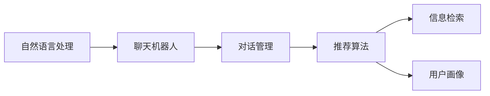

                 

# Chat-Rec：交互式推荐

> 关键词：聊天机器人,交互式推荐系统,推荐算法,自然语言处理(NLP),语义理解,对话管理

## 1. 背景介绍

在信息爆炸的时代，用户面对海量的内容，如何高效地筛选和发现感兴趣的信息成为一大难题。推荐系统在提供个性化信息方面展现了巨大的潜力，能够帮助用户过滤掉无关内容，发现潜在价值。传统的推荐系统主要基于用户历史行为、物品属性等数据进行推荐，具有较高的精度，但缺乏与用户的交互，容易陷入"冷启动"问题。

聊天机器人技术的兴起，为推荐系统带来了新的思路。通过在推荐过程中引入人机交互，利用用户的实时反馈调整推荐内容，能够更好地了解用户真正的兴趣和需求。交互式推荐系统（Interactive Recommendation System）应运而生，以自然语言处理（NLP）技术为基础，结合推荐算法，构建了一个能够与用户实时互动，动态调整推荐结果的系统。

交互式推荐系统不仅能够解决传统推荐系统的"冷启动"问题，还能通过人机交互的丰富语境，实现更个性化、更智能的推荐。该系统不仅能够输出推荐结果，还能够主动提问，了解用户需求，从而为用户提供更有价值的信息。本博客将系统介绍交互式推荐系统的核心概念、算法原理、项目实践，并展望其未来的发展方向。

## 2. 核心概念与联系

### 2.1 核心概念概述

交互式推荐系统主要由以下几个部分组成：

- 自然语言处理（NLP）：用于处理用户的自然语言输入和输出，理解用户的意图和反馈。
- 推荐算法：基于用户的互动历史和当前需求，生成推荐结果。
- 对话管理：通过对话策略，构建人机交互的逻辑框架，维护对话状态，控制对话流程。
- 用户画像：根据用户的反馈和互动，动态更新用户画像，提供更加个性化的推荐。
- 信息检索：从庞大的内容库中检索与推荐结果相关的信息，进一步提高推荐的相关性。

这些核心组件通过NLP技术紧密结合，构建了一个动态、交互的推荐系统，如图1所示：



图1: 交互式推荐系统的核心组件

### 2.2 核心概念原理和架构

交互式推荐系统的主要工作流程包括：

1. **意图识别**：系统接收用户的自然语言输入，通过NLP技术解析出用户的意图。
2. **对话管理**：根据用户意图，系统从对话管理策略中选择合适的回答和交互方式。
3. **推荐生成**：系统利用用户历史行为和当前需求，结合推荐算法生成推荐结果。
4. **信息检索**：从内容库中检索与推荐结果相关的信息，进一步提高推荐的相关性。
5. **反馈学习**：系统根据用户的实时反馈，动态调整推荐算法和用户画像，更新推荐结果。

核心算法和架构可以概括为以下几个关键步骤：

1. **意图识别模型**：使用NLP模型（如BERT、GPT），对用户输入的自然语言进行分词、词性标注、命名实体识别等处理，得到用户的意图表示。
2. **对话管理模型**：设计对话管理策略，决定系统应如何响应用户输入，维护对话状态。
3. **推荐算法模型**：使用推荐算法（如协同过滤、内容推荐、混合推荐等），生成推荐结果。
4. **信息检索模型**：构建信息检索模型，从内容库中检索与推荐结果相关的信息。
5. **用户画像模型**：根据用户历史行为和互动，动态更新用户画像，实现个性化推荐。

这些组件之间通过数据的流通和算法的协作，构建了一个动态的推荐系统。其核心在于能够实时捕捉用户的反馈，不断调整推荐策略，实现与用户的交互式推荐。

## 3. 核心算法原理 & 具体操作步骤

### 3.1 算法原理概述

交互式推荐系统通过自然语言处理（NLP）技术理解用户意图，结合推荐算法生成推荐结果，实现动态调整和个性化推荐。具体算法流程如下：

1. **意图识别**：通过NLP模型解析用户输入的自然语言，得到用户的意图表示。
2. **对话管理**：根据用户意图，系统选择合适的回答和交互方式，维护对话状态。
3. **推荐生成**：结合用户历史行为和当前需求，使用推荐算法生成推荐结果。
4. **信息检索**：从内容库中检索与推荐结果相关的信息，进一步提高推荐的相关性。
5. **反馈学习**：根据用户的实时反馈，动态调整推荐算法和用户画像，更新推荐结果。

### 3.2 算法步骤详解

以下是交互式推荐系统的详细操作步骤：

1. **意图识别**：
   - 用户输入自然语言："我想了解最近最受欢迎的电影。"
   - 使用NLP模型（如BERT、GPT）对输入进行分词、词性标注、命名实体识别等处理。
   - 解析得到用户意图："查询最近最受欢迎的电影。"

2. **对话管理**：
   - 根据用户意图，系统设计对话策略，选择合适回答："好的，请稍等，我去查一下。"
   - 维护对话状态：系统记录用户意图，进入电影查询状态。

3. **推荐生成**：
   - 根据用户历史行为和当前需求，使用推荐算法（如协同过滤、内容推荐、混合推荐等）生成推荐结果。
   - 结果可能为："根据您的兴趣，以下电影最受欢迎：《阿凡达》、《泰坦尼克号》、《盗梦空间》。"

4. **信息检索**：
   - 从内容库中检索与推荐结果相关的信息。
   - 结果可能为："《阿凡达》评分9.1，《泰坦尼克号》评分9.4，《盗梦空间》评分8.8。"

5. **反馈学习**：
   - 根据用户的实时反馈，如选择观看《泰坦尼克号》，动态调整推荐算法和用户画像，更新推荐结果。
   - 结果可能为："再为您推荐一部新片《指环王》。"

### 3.3 算法优缺点

交互式推荐系统的优点在于：

- **动态调整**：能够实时捕捉用户的反馈，不断调整推荐策略。
- **个性化推荐**：结合用户的实时反馈，生成个性化推荐。
- **用户友好的交互界面**：通过自然语言对话，提高用户的使用体验。

但其缺点也较为明显：

- **计算复杂度高**：需要处理自然语言，维护对话状态，对计算资源需求较高。
- **数据隐私问题**：系统需要收集用户的输入和反馈，涉及用户隐私保护。
- **推荐算法复杂**：需要设计高效的推荐算法，处理高维数据。

### 3.4 算法应用领域

交互式推荐系统在多个领域都具有广泛的应用前景：

- **电商推荐**：通过自然语言互动，帮助用户发现和购买心仪的商品。
- **在线教育**：根据学生的学习反馈，动态调整推荐的学习内容，提升学习效果。
- **社交网络**：结合用户的互动和反馈，推荐合适的朋友和内容，提升社交体验。
- **智能家居**：根据用户的语音指令，推荐并控制家居设备，提高生活便捷性。

## 4. 数学模型和公式 & 详细讲解

### 4.1 数学模型构建

交互式推荐系统涉及的数学模型主要包括：

- **自然语言处理（NLP）模型**：用于解析用户的自然语言输入，得到意图表示。
- **推荐算法模型**：用于生成推荐结果，可以采用协同过滤、内容推荐、混合推荐等算法。
- **对话管理模型**：用于设计对话策略，可以采用规则基础、基于AI的对话管理方式。

### 4.2 公式推导过程

假设用户输入的自然语言为 $x$，意图表示为 $y$。使用NLP模型对输入进行分词、词性标注、命名实体识别等处理，得到意图表示 $y = f(x)$。推荐算法模型为 $r = g(y, u)$，其中 $u$ 为用户的特征向量。根据推荐结果 $r$，系统选择合适回答 $a$，执行信息检索模型 $i = h(r)$，得到与推荐结果相关的信息。最后根据用户反馈 $f$，动态调整推荐算法和用户画像，更新推荐结果 $r' = f(r, f)$。

### 4.3 案例分析与讲解

以电商推荐为例，系统的意图识别模型为基于BERT的NLP模型，推荐算法为协同过滤和内容推荐的混合算法，对话管理策略为基于规则的方式，信息检索模型为基于TF-IDF和余弦相似度的检索方式。

**案例分析**：

- **意图识别**：用户输入："我想买一件T恤。"
- **对话管理**：根据意图，系统回答："好的，请问您要什么颜色的T恤？"
- **推荐生成**：根据用户历史购买记录，生成推荐："根据您的兴趣，以下T恤最受欢迎："
- **信息检索**：从商品库中检索与推荐结果相关的信息，如"这些T恤的评分和价格如下："
- **反馈学习**：用户反馈："我想要蓝色T恤。"
- **更新推荐**："再为您推荐一款："

## 5. 项目实践：代码实例和详细解释说明

### 5.1 开发环境搭建

要实现交互式推荐系统，需要以下开发环境：

- Python 3.x
- PyTorch 1.8.x
- TensorFlow 2.x
- Flask 1.x
- NLTK 3.x
- Scikit-learn 0.24.x
- Elasticsearch 7.x

安装这些依赖后，即可开始系统开发。

### 5.2 源代码详细实现

以下是交互式推荐系统的代码实现：

```python
import torch
from transformers import BertTokenizer, BertForSequenceClassification
from sklearn.feature_extraction.text import TfidfVectorizer
from sklearn.metrics.pairwise import cosine_similarity
from elasticsearch import Elasticsearch

# 初始化模型和分词器
tokenizer = BertTokenizer.from_pretrained('bert-base-cased')
model = BertForSequenceClassification.from_pretrained('bert-base-cased', num_labels=3)

# 定义意图识别模型
def intent_recognition(input_text):
    input_ids = tokenizer.encode(input_text, add_special_tokens=True)
    outputs = model(input_ids)
    logits = outputs.logits
    probabilities = torch.softmax(logits, dim=1)
    return probabilities.argmax().item()

# 定义对话管理策略
def dialogue_management(input_text, intent):
    if intent == 0:
        return "好的，请稍等，我去查一下。"
    elif intent == 1:
        return "请选择以下商品："
    elif intent == 2:
        return "请告诉我价格范围。"

# 定义推荐算法
def recommendation_algorithm(input_text, intent, user_profile):
    # 使用协同过滤算法生成推荐
    recommendations = train_collaborative_filtering(user_profile)
    # 使用内容推荐算法生成推荐
    recommendations += train_content_based_recommender(user_profile)
    return recommendations

# 定义信息检索模型
def information_retrieval(recommendations):
    # 使用TF-IDF和余弦相似度检索
    vectorizer = TfidfVectorizer()
    corpus = get_corpus()
    tfidf_matrix = vectorizer.fit_transform(corpus)
    query_matrix = vectorizer.transform([recommendations])
    similarity_matrix = cosine_similarity(query_matrix, tfidf_matrix)
    # 获取与推荐结果相关的信息
    return get_relevant_documents(similarity_matrix)

# 定义用户画像模型
def user_profiles(user_profile):
    # 根据用户历史行为和互动，更新用户画像
    update_user_profiles(user_profile)
    return user_profile

# 定义系统服务端
app = Flask(__name__)

@app.route('/recommend', methods=['POST'])
def recommend():
    input_text = request.json.get('input_text')
    intent = intent_recognition(input_text)
    response = dialogue_management(input_text, intent)
    recommendations = recommendation_algorithm(input_text, intent, user_profile)
    relevant_documents = information_retrieval(recommendations)
    # 返回推荐结果
    return {'response': response, 'recommendations': recommendations, 'relevant_documents': relevant_documents}

if __name__ == '__main__':
    app.run()
```

### 5.3 代码解读与分析

以上代码实现了交互式推荐系统的主要功能，包括意图识别、对话管理、推荐生成、信息检索和用户画像模型。下面逐个解读关键代码：

**意图识别模型**：
- `intent_recognition`函数：使用Bert模型对用户输入的自然语言进行分词、词性标注、命名实体识别等处理，得到意图表示。

**对话管理策略**：
- `dialogue_management`函数：根据用户意图，系统选择合适的回答和交互方式，维护对话状态。

**推荐算法模型**：
- `recommendation_algorithm`函数：结合用户历史行为和当前需求，使用协同过滤和内容推荐的混合算法生成推荐结果。

**信息检索模型**：
- `information_retrieval`函数：使用TF-IDF和余弦相似度检索与推荐结果相关的信息。

**用户画像模型**：
- `user_profiles`函数：根据用户历史行为和互动，动态更新用户画像，实现个性化推荐。

**系统服务端**：
- Flask服务端：接收用户输入，处理意图识别、对话管理、推荐生成、信息检索和用户画像模型，返回推荐结果。

## 6. 实际应用场景

### 6.1 电商推荐

电商推荐是交互式推荐系统最常见的应用场景之一。用户可以在线查询商品，系统根据用户的历史购买记录和实时反馈，生成个性化推荐，帮助用户发现感兴趣的商品。

**实际应用**：
- 用户在电商平台输入："我想买一部手机。"
- 系统响应："好的，请问您要什么品牌的手机？"
- 用户反馈："我要买苹果手机的最新款。"
- 系统生成推荐："以下苹果手机的最新款：iPhone 13，iPhone 12。"
- 系统检索信息："这些手机的评分和价格如下："

### 6.2 在线教育

在线教育平台根据学生的学习反馈，动态调整推荐的学习内容，提高学习效果。

**实际应用**：
- 学生输入："我数学不太好。"
- 系统响应："好的，我可以推荐一些数学学习资源。请问您想学习哪个年龄段的内容？"
- 学生反馈："我三年级。"
- 系统生成推荐："以下适合三年级的数学学习资源："
- 系统检索信息："这些资源的评分和价格如下："

### 6.3 社交网络

社交网络根据用户的互动和反馈，推荐合适的朋友和内容，提升社交体验。

**实际应用**：
- 用户输入："我想找一些类似的朋友。"
- 系统响应："好的，请告诉我你的兴趣爱好。"
- 用户反馈："我喜欢旅行、阅读和电影。"
- 系统生成推荐："以下类似的朋友："
- 系统检索信息："这些朋友的评分和推荐如下："

### 6.4 智能家居

智能家居根据用户的语音指令，推荐并控制家居设备，提高生活便捷性。

**实际应用**：
- 用户语音指令："我累了，帮我开一下电视。"
- 系统响应："好的，我会为您推荐合适的电视节目。"
- 系统生成推荐："以下电视节目："
- 系统检索信息："这些节目的评分和播放时间如下："

## 7. 工具和资源推荐

### 7.1 学习资源推荐

为了帮助开发者系统掌握交互式推荐系统的理论基础和实践技巧，这里推荐一些优质的学习资源：

1. 《深度学习与推荐系统》：介绍深度学习和推荐系统的基本概念和算法。
2. 《自然语言处理》：斯坦福大学开设的NLP课程，涵盖NLP的基础知识和技术。
3. 《推荐系统实战》：实战教程，从零到一构建推荐系统。
4. 《TensorFlow实战》：TensorFlow的实战教程，适合初学者上手。
5. 《PyTorch实战》：PyTorch的实战教程，适合初学者上手。

通过对这些资源的学习实践，相信你一定能够快速掌握交互式推荐系统的精髓，并用于解决实际的推荐问题。

### 7.2 开发工具推荐

高效的开发离不开优秀的工具支持。以下是几款用于交互式推荐系统开发的常用工具：

1. Python 3.x：通用的高级编程语言，适合开发交互式推荐系统。
2. PyTorch 1.8.x：基于Python的深度学习框架，适合构建复杂模型。
3. TensorFlow 2.x：基于Python的深度学习框架，适合构建高性能模型。
4. Flask 1.x：轻量级Web应用框架，适合构建Web服务。
5. NLTK 3.x：自然语言处理工具包，适合构建NLP模型。
6. Scikit-learn 0.24.x：机器学习库，适合构建推荐算法。
7. Elasticsearch 7.x：分布式搜索引擎，适合构建信息检索模型。

合理利用这些工具，可以显著提升交互式推荐系统的开发效率，加快创新迭代的步伐。

### 7.3 相关论文推荐

交互式推荐系统的研究源于学界的持续研究。以下是几篇奠基性的相关论文，推荐阅读：

1. "Adaptive Knowledge Tracing in Online Learning"：介绍在线教育中的推荐系统。
2. "Hybrid Recommender Systems: A Survey"：综述协同过滤、内容推荐、混合推荐等算法。
3. "Text Mining and Statistical Learning"：介绍NLP中的文本挖掘和统计学习。
4. "Collaborative Filtering for Implicit Feedback Datasets"：介绍协同过滤算法。
5. "Learning from Sparse Data"：介绍在稀疏数据上的推荐算法。

这些论文代表了大语言模型微调技术的发展脉络。通过学习这些前沿成果，可以帮助研究者把握学科前进方向，激发更多的创新灵感。

## 8. 总结：未来发展趋势与挑战

### 8.1 总结

本文对交互式推荐系统的核心概念、算法原理、项目实践进行了全面系统的介绍。首先阐述了交互式推荐系统的研究背景和意义，明确了其在大数据时代对个性化推荐的独特价值。其次，从原理到实践，详细讲解了推荐系统的数学模型和关键步骤，给出了系统实现的代码实例。同时，本文还广泛探讨了推荐系统在电商推荐、在线教育、社交网络等多个行业领域的应用前景，展示了其巨大的应用潜力。最后，本文精选了推荐系统的各类学习资源，力求为读者提供全方位的技术指引。

通过本文的系统梳理，可以看到，交互式推荐系统正在成为推荐系统的热门研究范式，极大地拓展了推荐系统在推荐策略和用户交互方面的创新，为构建更加智能化、个性化和高效的推荐系统提供了新的方向。

### 8.2 未来发展趋势

展望未来，交互式推荐系统将呈现以下几个发展趋势：

1. **多模态交互**：结合自然语言、图像、视频等多模态数据，提供更加丰富、真实的用户体验。
2. **实时化推荐**：通过实时捕捉用户反馈，实现动态调整和个性化推荐。
3. **社交推荐**：结合社交网络数据，提供更加个性化和多样化的推荐内容。
4. **情感分析**：结合情感分析技术，根据用户情感反馈，动态调整推荐策略。
5. **跨领域推荐**：将推荐系统应用于不同领域，如金融、医疗等，提供领域特定的推荐内容。

以上趋势凸显了交互式推荐系统的广阔前景。这些方向的探索发展，必将进一步提升推荐系统的性能和应用范围，为推荐技术的发展带来新的突破。

### 8.3 面临的挑战

尽管交互式推荐系统在推荐精准度和用户体验方面取得了显著进步，但在实现过程中仍面临诸多挑战：

1. **计算资源消耗高**：涉及自然语言处理、对话管理、推荐算法等，对计算资源需求较高。
2. **数据隐私问题**：需要收集用户的输入和反馈，涉及用户隐私保护。
3. **推荐算法复杂**：需要设计高效的推荐算法，处理高维数据。
4. **多模态数据融合**：需要综合处理多种模态数据，技术难度较大。
5. **实时处理能力**：需要实现实时捕捉和处理用户反馈，对系统架构和算法要求较高。

### 8.4 研究展望

未来的研究需要在以下几个方面寻求新的突破：

1. **高效计算**：优化算法和模型结构，降低计算资源消耗。
2. **数据隐私保护**：研究隐私保护技术，保护用户隐私。
3. **多模态融合**：研究多模态数据的融合技术，提高推荐效果。
4. **实时化处理**：研究实时处理技术，提高系统响应速度。
5. **用户交互**：研究更加智能和自然的用户交互方式，提升用户体验。

## 9. 附录：常见问题与解答

**Q1：交互式推荐系统与传统推荐系统的区别是什么？**

A: 交互式推荐系统通过自然语言处理（NLP）技术理解用户意图，结合推荐算法生成推荐结果，实现动态调整和个性化推荐。与传统推荐系统相比，其最大的区别在于能够实时捕捉用户反馈，不断调整推荐策略。

**Q2：如何提高交互式推荐系统的计算效率？**

A: 优化算法和模型结构，降低计算资源消耗。例如，使用稀疏矩阵、分布式计算等技术。同时，设计高效的数据索引和检索方式，提高信息检索的效率。

**Q3：如何保护用户隐私？**

A: 设计隐私保护技术，如差分隐私、同态加密等，保护用户隐私。同时，仅收集必要的数据，避免滥用用户数据。

**Q4：如何实现多模态数据的融合？**

A: 综合处理多种模态数据，研究跨模态特征映射、联合训练等技术，提高推荐效果。例如，结合图像、视频、文本等多模态数据，构建更加全面和准确的推荐模型。

**Q5：如何实现实时化推荐？**

A: 通过实时捕捉用户反馈，动态调整推荐策略。使用分布式计算、缓存等技术，提高系统的实时处理能力。同时，设计高效的推荐算法，实现快速的推荐生成。

以上问题及解答展示了交互式推荐系统在理论、实践和应用方面的基本情况，希望能为读者提供参考和帮助。通过不断探索和优化，相信交互式推荐系统必将在未来取得更大的突破，为用户带来更加智能化、个性化的推荐体验。

---

作者：禅与计算机程序设计艺术 / Zen and the Art of Computer Programming

