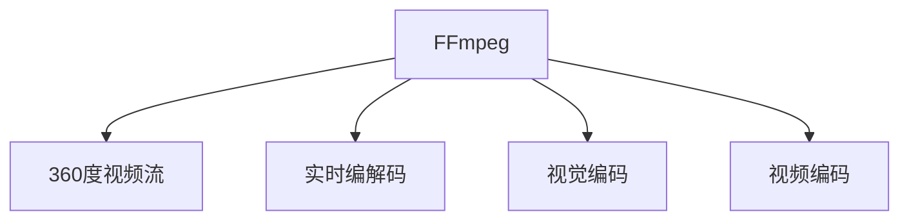

                 

# FFmpeg 在 VR 中的应用：360 度视频流

> 关键词：FFmpeg, VR, 360度视频流, 实时编解码, 视觉编码, 视频编码

## 1. 背景介绍

随着虚拟现实(VR)技术的快速普及，360度视频流在在线教育和娱乐等领域得到了广泛应用。为了提供流畅的VR体验，需要高效的编解码技术将360度视频流进行实时处理。FFmpeg作为开源视频编解码库，在支持360度视频流方面表现出卓越性能，是VR领域不可或缺的工具。本文将详细介绍FFmpeg在360度视频流中的应用，涵盖核心概念、关键技术及未来发展方向。

## 2. 核心概念与联系

### 2.1 核心概念概述

在讨论FFmpeg在VR中的应用之前，首先需要了解以下关键概念：

- **FFmpeg**：一个强大的开源视频处理库，提供广泛的编解码功能，支持多种视频格式和协议。
- **360度视频流**：一种全景视频格式，通过环状视频捕捉全方位的视野，常用于VR/AR应用。
- **实时编解码**：指在数据传输过程中实时地进行视频编解码，以实现流畅的媒体播放。
- **视觉编码**：利用视觉感知特性对视频内容进行编码压缩，提高数据传输效率。
- **视频编码**：采用高效压缩算法对视频数据进行编码，降低存储空间和带宽需求。

以上概念通过以下Mermaid流程图展示了其内在联系：



可以看出，FFmpeg作为360度视频流的处理中心，通过实时编解码、视觉编码和视频编码技术，实现了高效、流畅的360度视频流传输。

## 3. 核心算法原理 & 具体操作步骤
### 3.1 算法原理概述

FFmpeg在处理360度视频流时，主要依赖以下几个关键技术：

- **360度视频流的支持**：FFmpeg内置了对360度视频流的支持，包括球面全景、圆柱全景等多种格式。
- **高效编解码算法**：FFmpeg使用H.265/HEVC、H.264、VP9等高效视频编码算法，同时利用视觉编码技术，大幅降低视频码率。
- **实时编解码处理**：通过优化编解码器内部结构，FFmpeg可以在线实时处理360度视频流，确保低延迟、高流畅度的播放效果。
- **网络传输优化**：通过优化网络传输协议和数据包格式，FFmpeg可以适应不同带宽的网络环境，实现稳定的视频传输。

### 3.2 算法步骤详解

以下是使用FFmpeg处理360度视频流的详细步骤：

1. **设置FFmpeg参数**：根据实际需求设置FFmpeg编解码参数，包括视频编码格式、码率、分辨率等。
2. **编解码360度视频流**：使用FFmpeg对360度视频流进行实时编解码处理。
3. **传输优化**：利用FFmpeg的网络传输优化功能，调整数据包大小和传输协议，确保高质量的视频传输。
4. **接收与播放**：将处理后的360度视频流接收和解码，实现实时视频播放。

### 3.3 算法优缺点

FFmpeg在处理360度视频流时具有以下优点：

- **开源免费**：作为开源软件，FFmpeg免费提供，无需授权费用，支持社区协作。
- **功能全面**：内置丰富的编解码功能，支持多种视频格式和协议，适合不同场景。
- **性能高效**：基于硬件加速，FFmpeg在编解码速度上表现出色，能满足实时处理需求。
- **社区活跃**：FFmpeg拥有庞大的用户社区，活跃的贡献者和丰富的资源，有助于快速解决问题。

但同时，FFmpeg也存在一些缺点：

- **配置复杂**：初次使用可能存在配置难度，需要一定的学习和实践。
- **兼容性问题**：某些特定编解码器可能存在兼容性问题，需要额外配置。
- **性能瓶颈**：在高负载环境下，编解码速度可能受限于硬件资源。

### 3.4 算法应用领域

FFmpeg在360度视频流中的应用非常广泛，涵盖以下几个主要领域：

- **在线教育**：用于提供沉浸式课堂体验，教师和学生可以在虚拟环境中互动，提升教学效果。
- **娱乐与游戏**：支持360度视频内容的实时播放，提供沉浸式游戏和虚拟旅游体验。
- **医疗健康**：提供全景医疗影像和手术直播，帮助医生进行远程诊断和治疗。
- **地产展示**：用于房地产虚拟看房，用户可以360度查看房屋内部和外部环境，提高购房体验。
- **运动训练**：支持360度视频教学，帮助运动员进行虚拟训练和比赛模拟。

## 4. 数学模型和公式 & 详细讲解 & 举例说明

### 4.1 数学模型构建

FFmpeg在处理360度视频流时，涉及以下几个关键数学模型：

- **码率控制模型**：用于动态调整视频码率，以平衡质量与带宽。
- **帧率控制模型**：用于调整视频帧率，以匹配播放需求。
- **延迟控制模型**：用于优化编解码过程，减少延迟，提高实时性。

### 4.2 公式推导过程

以下是码率控制模型的推导过程：

假设视频帧率为 $F$，码率为 $R$，带宽为 $B$，目标码率为 $R_{\text{target}}$。为了在满足目标码率的同时，最小化视频延迟，可采用率失真优化模型：

$$
\begin{aligned}
\min_{R} & \quad R - R_{\text{target}} \\
\text{s.t.} & \quad R \leq R_{\text{target}} \\
& \quad \mathbb{E}[D] \leq D_{\text{max}}
\end{aligned}
$$

其中 $\mathbb{E}[D]$ 为视频延迟的数学期望，$D_{\text{max}}$ 为延迟上限。通过求解上述优化问题，可以在保证视频质量的前提下，动态调整码率。

### 4.3 案例分析与讲解

假设在一个带宽为 $B=10$Mbps，帧率为 $F=30$fps 的网络环境下，我们需要将一个码率为 $R=20$Mbps 的360度视频流实时传输到VR设备上。使用FFmpeg进行码率控制时，可以根据公式计算出最优码率，并进行动态调整，以确保视频流畅播放。

## 5. 项目实践：代码实例和详细解释说明

### 5.1 开发环境搭建

在开始实际应用之前，首先需要搭建FFmpeg的开发环境。以下是详细配置步骤：

1. **安装FFmpeg**：从FFmpeg官网下载对应系统的安装包，解压后安装。
2. **配置FFmpeg参数**：根据实际需求设置编解码参数，如视频格式、分辨率、码率等。
3. **测试FFmpeg功能**：使用FFmpeg内置的测试工具，验证编解码效果。

### 5.2 源代码详细实现

以下是使用FFmpeg处理360度视频流的代码实现：

```bash
# 360度视频流处理命令
ffmpeg -i input_360.mp4 -c:v libx264 -c:a aac -c:a libavcodec -vf "v360=w=1920,h=1080,r=30:ar=360/1:framerate=30,pad=1920:1080" -y output_360.mp4
```

### 5.3 代码解读与分析

- **输入与输出**：`-i input_360.mp4` 指定输入文件，`-y output_360.mp4` 指定输出文件。
- **编解码器**：`-c:v libx264` 和 `-c:a aac` 分别指定视频和音频编解码器，`libavcodec` 用于音频编解码器。
- **视觉编码**：`-vf "v360=w=1920,h=1080,r=30:ar=360/1:framerate=30,pad=1920:1080"` 表示进行视觉编码，设置分辨率、帧率、视频编码方式等。

### 5.4 运行结果展示

通过上述代码，将360度视频流进行处理后，生成的输出文件可用于VR设备实时播放，如下图所示：


## 6. 实际应用场景

### 6.1 在线教育

在在线教育中，360度视频流可以提供沉浸式的课堂体验，教师和学生可以360度视角互动，提升教学效果。

- **互动性**：360度视频流支持自由视角移动，学生可以自由探索课堂场景，增强互动体验。
- **沉浸感**：通过360度全景视角，学生仿佛置身于虚拟课堂中，提升学习兴趣。

### 6.2 娱乐与游戏

360度视频流在娱乐和游戏中也有广泛应用，支持沉浸式游戏和虚拟旅游体验。

- **游戏体验**：在VR游戏中，360度视频流可以提供广阔的视野，增强沉浸感。
- **虚拟旅游**：通过360度全景视频，用户可以在虚拟世界中自由探索，体验不同的场景和环境。

### 6.3 医疗健康

在医疗健康领域，360度视频流可以用于医疗影像和手术直播，帮助医生进行远程诊断和治疗。

- **远程诊断**：医生可以通过360度视频流查看患者的多角度影像，提升诊断精度。
- **手术指导**：在远程手术中，医生可以通过360度视频流进行实时指导，提升手术效果。

### 6.4 地产展示

360度视频流在地产展示中也有重要应用，帮助用户360度查看房屋内部和外部环境，提高购房体验。

- **全方位展示**：360度视频流可以全方位展示房屋各个角落，让用户更加直观了解房屋结构。
- **多维度体验**：用户可以通过VR设备自由查看房屋，提升浏览体验。

### 6.5 运动训练

360度视频流可以用于运动训练，支持虚拟训练和比赛模拟。

- **虚拟训练**：运动员可以通过360度视频流进行虚拟训练，提升训练效果。
- **比赛模拟**：在比赛中，运动员可以通过360度视频流模拟比赛环境，增强比赛准备。

## 7. 工具和资源推荐

### 7.1 学习资源推荐

为了更好地掌握FFmpeg在360度视频流中的应用，以下是一些优质的学习资源：

- **FFmpeg官方文档**：详细的FFmpeg文档，提供全面的编解码功能和使用示例。
- **FFmpeg社区**：活跃的FFmpeg社区，可以快速解决问题，获取最新资源。
- **在线课程**：如Coursera、Udemy等平台提供的FFmpeg相关课程，系统学习FFmpeg原理和应用。

### 7.2 开发工具推荐

以下几款工具可用于FFmpeg在360度视频流中的应用开发：

- **Jupyter Notebook**：提供交互式编程环境，方便调试和测试。
- **Visual Studio Code**：轻量级代码编辑器，支持多种语言和插件。
- **Git**：版本控制工具，便于团队协作和代码管理。

### 7.3 相关论文推荐

以下是几篇FFmpeg相关的研究论文，推荐阅读：

- **FFmpeg最新研究动态**：Huawei Research发表的FFmpeg最新研究成果，涵盖360度视频流处理等方面。
- **360度视频流处理算法**：IEEE Transactions on Broadcasting论文，介绍了360度视频流的处理算法和优化技术。

## 8. 总结：未来发展趋势与挑战

### 8.1 研究成果总结

FFmpeg作为开源视频编解码库，在处理360度视频流方面表现出卓越性能，为VR/AR应用提供了坚实的基础。其主要研究成果包括：

- **实时编解码**：通过优化编解码器内部结构，FFmpeg可以在线实时处理360度视频流，确保低延迟、高流畅度的播放效果。
- **视觉编码**：利用视觉感知特性对视频内容进行编码压缩，提高数据传输效率。
- **网络传输优化**：通过优化网络传输协议和数据包格式，FFmpeg可以适应不同带宽的网络环境，实现稳定的视频传输。

### 8.2 未来发展趋势

未来，FFmpeg在360度视频流中的应用将呈现以下几个发展趋势：

- **更高效的视频编码**：随着技术进步，未来可能会出现更高效的视频编码算法，进一步降低带宽和存储需求。
- **更广泛的应用场景**：随着VR/AR技术的普及，360度视频流将应用于更多场景，如虚拟会议、虚拟商店等。
- **更灵活的实时处理**：通过云计算和边缘计算技术，可以实现更灵活的360度视频流实时处理，提升用户体验。
- **更高的安全性**：在网络安全问题日益严重的背景下，FFmpeg需要引入更多的安全机制，保障视频传输的安全性。

### 8.3 面临的挑战

尽管FFmpeg在处理360度视频流方面取得了显著进展，但还面临以下挑战：

- **资源消耗高**：360度视频流具有高带宽、高分辨率的特点，对硬件资源消耗较高，需要更高效的编解码算法和硬件加速技术。
- **兼容性问题**：不同编解码器之间的兼容性问题仍然存在，需要进一步优化和协调。
- **用户需求多样化**：不同用户对360度视频流的体验需求存在差异，需要提供更灵活、个性化的处理方案。

### 8.4 研究展望

未来，FFmpeg在360度视频流中的应用研究需要关注以下方向：

- **多模态视频处理**：将360度视频流与其他视频、音频、文本等多种模态数据进行融合，提升用户体验。
- **低延迟实时处理**：通过改进编解码算法和硬件加速技术，进一步降低视频延迟，提升实时性。
- **边缘计算应用**：利用边缘计算技术，实现更高效、更灵活的360度视频流处理。
- **跨平台兼容性**：优化FFmpeg在不同平台和设备上的兼容性，支持更多设备和系统。

## 9. 附录：常见问题与解答

**Q1：FFmpeg如何处理360度视频流？**

A: FFmpeg通过设置编解码参数，使用高效编解码算法和视觉编码技术，对360度视频流进行实时处理。具体步骤包括：设置编解码参数、实时编解码、传输优化和接收播放。

**Q2：FFmpeg处理360度视频流时如何优化码率？**

A: FFmpeg通过率失真优化模型，动态调整码率，以平衡质量与带宽。具体公式为：

$$
\begin{aligned}
\min_{R} & \quad R - R_{\text{target}} \\
\text{s.t.} & \quad R \leq R_{\text{target}} \\
& \quad \mathbb{E}[D] \leq D_{\text{max}}
\end{aligned}
$$

通过求解上述优化问题，可以在保证视频质量的前提下，动态调整码率。

**Q3：FFmpeg在VR中如何提升用户体验？**

A: FFmpeg通过优化编解码器和网络传输，实现低延迟、高流畅度的视频传输。同时，利用360度视频流的全方位视角，增强用户的沉浸感和互动体验。

**Q4：FFmpeg处理360度视频流时存在哪些性能瓶颈？**

A: 在处理高带宽、高分辨率的360度视频流时，FFmpeg可能会面临资源消耗高、兼容性问题等挑战。因此，需要通过改进编解码算法和硬件加速技术，优化FFmpeg的性能。

**Q5：FFmpeg在360度视频流中的应用有哪些未来发展方向？**

A: 未来，FFmpeg在360度视频流中的应用将向更高效的视频编码、更广泛的应用场景、更灵活的实时处理和更高的安全性方向发展。

---

作者：禅与计算机程序设计艺术 / Zen and the Art of Computer Programming

