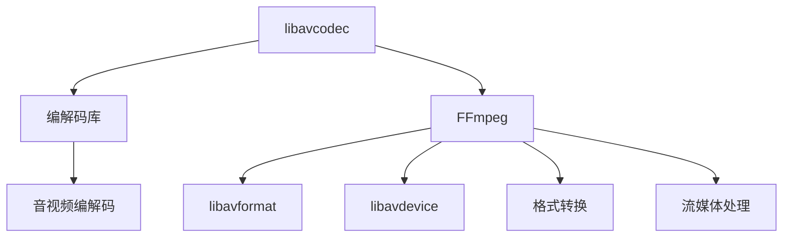

                 

# FFmpeg音视频处理入门

> 关键词：FFmpeg, 音视频处理, 媒体编解码, 音视频格式转换, 实时流媒体, 音视频编码, 音视频解码

## 1. 背景介绍

### 1.1 问题由来
在当今数字化时代，音视频处理已成为信息传递、娱乐、教育等领域不可或缺的技术。然而，由于不同平台和设备支持的多样性，音视频格式众多且复杂，给开发者带来了巨大的挑战。FFmpeg作为一款开源、跨平台的音视频处理工具，以其强大的功能、高效性能和灵活性在音视频处理领域得到了广泛应用。

### 1.2 问题核心关键点
本节将介绍FFmpeg的基本概念、工作原理及其在音视频处理中的应用。重点聚焦于以下几个关键问题：

1. 什么是FFmpeg？
2. FFmpeg支持哪些音视频格式？
3. FFmpeg的主要工作流程是什么？
4. 如何利用FFmpeg进行音视频格式转换？
5. 如何利用FFmpeg进行实时音视频处理？

### 1.3 问题研究意义
了解FFmpeg的原理与应用，可以帮助开发者更好地进行音视频格式转换、编码解码、实时流媒体处理等任务，提升音视频处理效率，降低开发成本，加速项目进度。

## 2. 核心概念与联系

### 2.1 核心概念概述

FFmpeg是一款开源、跨平台的音视频处理工具，支持多种音视频格式的编解码、格式转换、流媒体处理等功能。其核心组件包括libavcodec、libavformat、libavdevice等，分别负责音视频编解码、格式识别和I/O设备管理。FFmpeg利用这些组件，通过标准化的接口，提供了丰富的音视频处理功能。

### 2.2 核心概念原理和架构的 Mermaid 流程图


### 2.3 核心概念联系

FFmpeg通过其核心组件libavcodec、libavformat和libavdevice，实现了音视频编解码、格式转换和流媒体处理的功能。这些组件通过标准化的接口进行调用，确保了FFmpeg的高效性能和灵活性。

## 3. 核心算法原理 & 具体操作步骤
### 3.1 算法原理概述

FFmpeg的音视频处理主要基于编解码库libavcodec实现。libavcodec提供了丰富的音视频编解码算法，包括MP3、AAC、AV1、H264等常见音视频格式的编解码。FFmpeg通过调用libavcodec提供的编解码函数，实现对音视频数据的处理。

### 3.2 算法步骤详解

#### 3.2.1 音视频编解码
FFmpeg支持多种音视频编解码算法，如MP3、AAC、AV1、H264等。开发者可以根据具体需求选择合适的编解码器，进行音视频的编码和解码。

#### 3.2.2 音视频格式转换
FFmpeg支持多种音视频格式之间的转换，如将MP4格式转换为MKV格式，将AVI格式转换为MP3格式等。开发者可以通过调用FFmpeg提供的格式转换命令，实现不同格式之间的转换。

#### 3.2.3 实时音视频处理
FFmpeg支持实时音视频处理，如实时音视频采集、实时音视频编码和解码、实时音视频流传输等。开发者可以使用FFmpeg的实时流媒体处理功能，实现音视频的实时处理和传输。

### 3.3 算法优缺点

FFmpeg的优点包括：

1. 功能强大：支持多种音视频格式和编解码算法，满足不同应用场景的需求。
2. 高效性能：经过多年优化，FFmpeg具有高效性能，适合处理大规模音视频数据。
3. 开源跨平台：FFmpeg是开源软件，支持多种操作系统和设备，方便开发者使用。

FFmpeg的缺点包括：

1. 学习曲线陡峭：由于其功能强大，API复杂，初学者难以掌握。
2. 性能依赖硬件：FFmpeg的性能很大程度上依赖于硬件设备，如CPU、GPU等，硬件配置不足时性能可能不佳。
3. 缺乏商业支持：作为开源软件，FFmpeg缺乏商业支持，可能存在一些未修复的Bug。

### 3.4 算法应用领域

FFmpeg在音视频处理领域有广泛的应用，包括：

1. 音视频格式转换：将不同格式的音视频文件互相转换，方便不同平台和设备之间的兼容。
2. 音视频编解码：对音视频数据进行编码和解码，满足不同设备和网络传输的需求。
3. 实时流媒体：实现音视频的实时采集、编码、解码和传输，支持实时视频会议、直播等应用。
4. 音视频编辑：对音视频文件进行剪辑、编辑和特效处理，提高音视频的质量和创意性。

## 4. 数学模型和公式 & 详细讲解 & 举例说明

### 4.1 数学模型构建

FFmpeg的音视频处理基于编解码库libavcodec实现。libavcodec提供了多种编解码算法，如H264、AAC、MP3等，开发者可根据具体需求选择合适的算法。

### 4.2 公式推导过程

以H264编解码算法为例，推导编解码过程的数学模型。

#### 4.2.1 编码过程
H264编解码算法的核心是帧内预测、变换编码和熵编码等步骤。以下是对其编解码过程的数学模型推导：

- 帧内预测：
$$
\text{Prediction} = \sum_i \alpha_i x_i
$$
其中 $\alpha_i$ 是预测系数，$x_i$ 是预测样本。

- 变换编码：
$$
\text{Transform} = \sum_i \beta_i \text{Transform Function}(x_i)
$$
其中 $\beta_i$ 是变换系数，$\text{Transform Function}$ 是变换函数。

- 熵编码：
$$
\text{Entropy Code} = \sum_i \gamma_i \text{Entropy Code Function}(\beta_i)
$$
其中 $\gamma_i$ 是熵编码系数，$\text{Entropy Code Function}$ 是熵编码函数。

#### 4.2.2 解码过程
解码过程是编码过程的逆过程，即对编码后的数据进行反变换、反量化和反预测等操作，得到原始的音视频数据。

### 4.3 案例分析与讲解

以将MP3音频文件转换为WAV格式为例，分析FFmpeg的音视频格式转换过程。

1. 安装FFmpeg：
```bash
sudo apt-get install ffmpeg
```

2. 使用FFmpeg进行格式转换：
```bash
ffmpeg -i input.mp3 output.wav
```

3. 解释代码：
- `-i input.mp3` 指定输入文件为MP3格式。
- `output.wav` 指定输出文件为WAV格式。

通过以上步骤，可以实现将MP3音频文件转换为WAV格式。

## 5. 项目实践：代码实例和详细解释说明

### 5.1 开发环境搭建

#### 5.1.1 安装FFmpeg
在Linux系统下，可以使用以下命令安装FFmpeg：
```bash
sudo apt-get install ffmpeg
```

#### 5.1.2 环境配置
在安装FFmpeg后，需要在代码中配置FFmpeg的路径，以便调用FFmpeg的命令。

### 5.2 源代码详细实现

以将MP4视频文件转换为AVI格式为例，编写FFmpeg的源代码。

#### 5.2.1 代码实现

```python
import subprocess

# 输入文件路径
input_file = 'input.mp4'

# 输出文件路径
output_file = 'output.avi'

# 调用FFmpeg命令
cmd = f'ffmpeg -i {input_file} -c:v libx264 -c:a aac {output_file}'

# 执行命令
subprocess.run(cmd, shell=True)
```

#### 5.2.2 代码解释

1. `subprocess.run`：使用Python内置的`subprocess`模块，调用FFmpeg命令。
2. `ffmpeg -i {input_file}`：FFmpeg的输入命令，指定输入文件路径。
3. `-c:v libx264 -c:a aac`：FFmpeg的编解码命令，指定使用H264编解码器。
4. `{output_file}`：FFmpeg的输出命令，指定输出文件路径。

通过以上代码，可以实现将MP4视频文件转换为AVI格式。

### 5.3 代码解读与分析

#### 5.3.1 代码流程
1. 定义输入文件和输出文件路径。
2. 使用`subprocess.run`函数调用FFmpeg命令。
3. 命令中指定输入文件路径、编解码器和输出文件路径。

#### 5.3.2 注意事项
1. 在使用FFmpeg时，需要注意输入和输出文件的路径。
2. 编解码器需要根据具体需求选择，支持H264、AAC等常见编解码器。
3. 在调用FFmpeg命令时，需要注意命令的格式和参数。

### 5.4 运行结果展示

使用以上代码，可以将MP4视频文件成功转换为AVI格式。可以通过以下命令查看输出文件：

```bash
ffmpeg -i output.avi
```

## 6. 实际应用场景

### 6.1 视频编辑

FFmpeg在视频编辑领域有广泛应用。可以使用FFmpeg对视频进行剪辑、合并、特效处理等操作。

#### 6.1.1 视频剪辑

使用FFmpeg对视频进行剪辑，可以方便地截取视频片段。

```python
import subprocess

# 输入文件路径
input_file = 'input.mp4'

# 输出文件路径
output_file = 'output.mp4'

# 剪辑开始时间
start_time = '00:00:00'

# 剪辑结束时间
end_time = '00:01:00'

# 调用FFmpeg命令
cmd = f'ffmpeg -i {input_file} -ss {start_time} -t {(end_time - start_time)} {output_file}'

# 执行命令
subprocess.run(cmd, shell=True)
```

#### 6.1.2 视频合并

使用FFmpeg对多个视频文件进行合并，可以方便地将多个视频片段拼接成一个完整的视频文件。

```python
import subprocess

# 输入文件路径
input_files = ['input1.mp4', 'input2.mp4']

# 输出文件路径
output_file = 'output.mp4'

# 调用FFmpeg命令
cmd = f'ffmpeg -f concat -safe 0 -i <(echo "{', '.join(input_files)}") {output_file}'

# 执行命令
subprocess.run(cmd, shell=True)
```

### 6.2 音视频直播

FFmpeg可以实现音视频的实时采集和传输，支持音视频直播。

#### 6.2.1 音视频采集

使用FFmpeg对音视频数据进行实时采集，可以将摄像头和麦克风的数据转换为音视频文件。

```python
import subprocess

# 摄像头设备编号
camera_id = '0'

# 音频设备编号
audio_id = 'default'

# 输出文件路径
output_file = 'output.avi'

# 调用FFmpeg命令
cmd = f'ffmpeg -f video4linux2 -framerate 30 -i /dev/video{camera_id} -c:a libswresample -i default -c:v libx264 -c:a libmp3lame {output_file}'

# 执行命令
subprocess.run(cmd, shell=True)
```

#### 6.2.2 音视频直播

使用FFmpeg实现音视频直播，可以将音视频数据实时传输到网络平台。

```python
import subprocess

# 输入文件路径
input_file = 'input.mp4'

# 输出文件路径
output_file = 'output.avi'

# 调用FFmpeg命令
cmd = f'ffmpeg -i {input_file} -c:v libx264 -c:a libmp3lame -f flv -rtsp_transport auto -rtsp_prefix rtsp://localhost:1935 {output_file}'

# 执行命令
subprocess.run(cmd, shell=True)
```

### 6.3 音视频格式转换

FFmpeg支持多种音视频格式之间的转换，可以实现不同格式之间的互操作。

#### 6.3.1 视频格式转换

使用FFmpeg将MP4视频文件转换为MKV格式，方便不同设备和平台的兼容。

```python
import subprocess

# 输入文件路径
input_file = 'input.mp4'

# 输出文件路径
output_file = 'output.mkv'

# 调用FFmpeg命令
cmd = f'ffmpeg -i {input_file} {output_file}'

# 执行命令
subprocess.run(cmd, shell=True)
```

#### 6.3.2 音频格式转换

使用FFmpeg将MP3音频文件转换为WAV格式，方便音频数据的处理和分析。

```python
import subprocess

# 输入文件路径
input_file = 'input.mp3'

# 输出文件路径
output_file = 'output.wav'

# 调用FFmpeg命令
cmd = f'ffmpeg -i {input_file} {output_file}'

# 执行命令
subprocess.run(cmd, shell=True)
```

## 7. 工具和资源推荐

### 7.1 学习资源推荐

1. FFmpeg官方文档：提供了FFmpeg的详细使用说明和API文档。
2. FFmpeg教程：通过视频教程，帮助开发者快速上手FFmpeg的使用。
3. FFmpeg开发手册：提供了FFmpeg的开发流程和API接口。
4. FFmpeg社区：提供了丰富的资源和讨论区，方便开发者交流和学习。

### 7.2 开发工具推荐

1. PyTorch：用于音视频处理的深度学习框架，支持多种音视频格式和编解码算法。
2. OpenCV：用于音视频处理的计算机视觉库，支持图像和视频处理、特征提取等。
3. VLC：用于音视频处理的播放器和流媒体服务器，支持多种音视频格式和编解码器。

### 7.3 相关论文推荐

1. H.264/AVC编解码器研究进展：介绍了H264编解码器的原理和实现。
2. AVC格式规范：详细描述了H264编解码器的格式规范。
3. FFmpeg源代码分析：对FFmpeg的源代码进行了分析和总结。

## 8. 总结：未来发展趋势与挑战

### 8.1 研究成果总结

FFmpeg作为一款开源、跨平台的音视频处理工具，广泛应用于音视频格式转换、编解码、流媒体处理等领域。其强大的功能、高效性能和灵活性，使得开发者能够轻松处理各种音视频数据。

### 8.2 未来发展趋势

1. 多模态处理：FFmpeg未来的发展方向之一是多模态音视频处理，支持同时处理音频和视频数据的编解码和格式转换。
2. 实时处理：FFmpeg将进一步提升实时处理能力，支持音视频的实时采集、编码、解码和传输。
3. 跨平台优化：FFmpeg将优化跨平台性能，支持更多操作系统和设备，方便开发者使用。
4. 高效编解码：FFmpeg将优化编解码算法，提升音视频数据的压缩率和传输速度。

### 8.3 面临的挑战

1. 跨平台兼容性：FFmpeg在不同操作系统和设备上的兼容性仍需进一步提升。
2. 实时处理性能：在实时处理场景下，FFmpeg的性能和稳定性仍需优化。
3. 功能扩展：FFmpeg需要不断扩展新的音视频格式和编解码算法，以适应新的应用需求。

### 8.4 研究展望

1. 多模态音视频处理：研究多模态音视频处理的算法和实现，提升音视频处理的智能化水平。
2. 实时音视频流媒体：研究实时音视频流媒体的处理算法和实现，提升音视频流的传输质量和稳定性。
3. 跨平台优化：研究FFmpeg的跨平台优化技术，提升在不同操作系统和设备上的性能。

## 9. 附录：常见问题与解答

**Q1: 什么是FFmpeg？**

A: FFmpeg是一款开源、跨平台的音视频处理工具，支持多种音视频格式的编解码、格式转换、流媒体处理等功能。

**Q2: 如何安装FFmpeg？**

A: 在Linux系统下，可以使用以下命令安装FFmpeg：
```bash
sudo apt-get install ffmpeg
```

**Q3: 如何使用FFmpeg进行音视频格式转换？**

A: 使用FFmpeg进行音视频格式转换，可以使用以下命令：
```bash
ffmpeg -i input.mp4 output.avi
```

**Q4: 如何使用FFmpeg进行音视频实时处理？**

A: 使用FFmpeg进行音视频实时处理，可以使用以下命令：
```bash
ffmpeg -i input.mp4 -c:v libx264 -c:a libmp3lame -f flv -rtsp_transport auto -rtsp_prefix rtsp://localhost:1935 output.avi
```

**Q5: 如何使用FFmpeg进行音视频剪辑？**

A: 使用FFmpeg进行音视频剪辑，可以使用以下命令：
```bash
ffmpeg -i input.mp4 -ss 00:00:00 -t 00:01:00 output.mp4
```

通过以上问题的解答，相信读者对FFmpeg有了更深入的了解，能够更好地进行音视频格式转换、编解码和实时处理等任务。

---

作者：禅与计算机程序设计艺术 / Zen and the Art of Computer Programming

