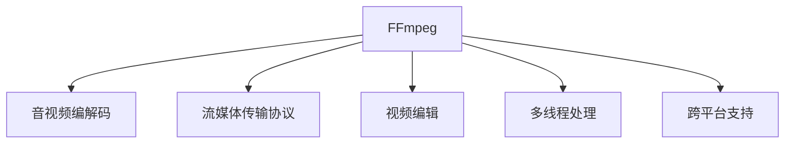

                 

# FFmpeg音视频处理：编解码与流媒体

> 关键词：FFmpeg,音视频编解码,流媒体,音频,视频,多媒体,跨平台

## 1. 背景介绍

### 1.1 问题由来
FFmpeg作为一款开源、跨平台的音视频处理工具，在音视频编码、解码、流媒体传输等各个方面都表现出色。它的使用覆盖了从媒体制作到网络传输的各个环节，广泛用于数字电视、互联网流媒体、移动互联网、游戏开发等领域。了解FFmpeg的音视频处理原理，掌握其编解码与流媒体技术，对于开发者、媒体工作者和系统集成商等专业人士来说，都具有重要的应用价值。

### 1.2 问题核心关键点
FFmpeg的核心功能模块包括音视频编解码器、流媒体传输协议、视频编辑工具等。其关键技术点包括：
- 音视频编解码：FFmpeg提供了多种编解码器，支持高效、低延迟的音视频编解码。
- 流媒体传输：通过RTP/UDP、RTMP/TCP、HTTP/REST等多种协议，实现音视频数据的可靠、高效传输。
- 视频编辑：利用FFmpeg的剪辑、特效、字幕等功能，对原始音视频素材进行加工处理。

通过深入理解FFmpeg的核心概念和原理，我们可以更好地应用于实际音视频处理场景，解决常见问题，提升开发效率。

## 2. 核心概念与联系

### 2.1 核心概念概述

为更好地理解FFmpeg的工作原理和应用场景，本节将介绍几个密切相关的核心概念：

- FFmpeg：是一款开源、跨平台的音视频处理工具，支持多种音视频编解码、流媒体协议等。
- 音视频编解码器：FFmpeg提供了丰富的编解码器，包括H.264、HEVC、VP9、AV1、MP3、AAC等，支持高效、低延迟的音视频编解码。
- 流媒体传输协议：如RTP/UDP、RTMP/TCP、HTTP/REST等，通过这些协议实现音视频数据的可靠、高效传输。
- 视频编辑：FFmpeg提供了剪辑、特效、字幕等功能，对原始音视频素材进行加工处理。
- 多线程处理：FFmpeg在编解码和流媒体处理过程中，采用多线程技术，提升处理速度。
- 跨平台支持：FFmpeg支持Windows、Linux、macOS等多个平台，便于在不同环境下使用。

这些核心概念之间的逻辑关系可以通过以下Mermaid流程图来展示：



这个流程图展示FFmpeg的核心概念及其之间的关系：

1. FFmpeg是一款通用的音视频处理工具，集成多种音视频处理功能。
2. 音视频编解码是FFmpeg的核心功能之一，通过不同的编解码器实现高效、低延迟的音视频转换。
3. 流媒体传输协议使得音视频数据可以在网络环境下稳定传输。
4. 视频编辑通过剪辑、特效、字幕等功能，进一步加工原始素材，提升作品质量。
5. 多线程处理提高FFmpeg的处理效率，使其能够同时处理多个音视频流。
6. 跨平台支持使得FFmpeg能够应用到各种不同的操作系统环境中。

这些概念共同构成了FFmpeg的完整应用框架，使其能够处理音视频相关的各种任务。

## 3. 核心算法原理 & 具体操作步骤
### 3.1 算法原理概述

FFmpeg音视频编解码的核心算法是基于编码器与解码器实现的数据压缩与解压缩。编解码器通过预测、变换、熵编码等技术，将原始数据压缩成比特流，在解码时再将比特流还原为原始数据。这种压缩与解压缩过程，可以显著降低数据传输带宽，提高音视频编码效率。

FFmpeg的编解码器主要包括以下几个步骤：
1. **预测**：通过对音视频数据的预测，消除冗余信息，减少编解码过程中的数据量。
2. **变换**：将预测后的数据进行离散余弦变换（DCT）等数学变换，进一步去除冗余信息。
3. **熵编码**：使用Huffman编码、算术编码等算法，将变换后的数据进行压缩。
4. **量化**：将压缩后的数据进行量化，将数值范围缩小，降低存储和传输的复杂度。
5. **反量化与反变换**：将量化后的数据进行逆量化和逆变换，还原成原始数据。
6. **反预测**：将解码后的数据进行反预测，得到最终的解码结果。

通过上述步骤，FFmpeg能够实现高效、低延迟的音视频编解码。同时，FFmpeg还支持多种编解码格式，如H.264、HEVC、VP9、AV1、MP3、AAC等，以及不同编码率的控制，满足不同应用场景的需求。

### 3.2 算法步骤详解

FFmpeg的音视频编解码主要分为编码和解码两个部分。以下是FFmpeg编解码的基本流程：

**编码过程：**
1. **输入数据准备**：将原始音视频数据读取到内存中。
2. **帧分割**：将音视频数据分割成多个单帧，进行独立处理。
3. **预测与变换**：对每个单帧进行预测与变换，生成压缩后的比特流数据。
4. **量化与熵编码**：对压缩后的数据进行量化和熵编码，生成最终的编解码输出。

**解码过程：**
1. **输入数据准备**：将编解码后的比特流数据读取到内存中。
2. **反量化与反变换**：对比特流数据进行反量化和反变换，还原为原始数据。
3. **反预测**：对解码后的数据进行反预测，得到最终的解码结果。
4. **帧合并**：将解码后的单帧数据合并成完整的音视频数据流。

### 3.3 算法优缺点

FFmpeg的音视频编解码具有以下优点：
1. 高效：FFmpeg的编解码器支持多种格式和多种编码率，能够根据不同的应用场景进行优化。
2. 低延迟：通过高效的编解码算法，FFmpeg能够在实时应用中实现低延迟的音视频处理。
3. 开源：FFmpeg的代码完全开源，开发者可以自由修改和优化编解码器，满足特定需求。
4. 跨平台：FFmpeg支持多种操作系统，便于在不同平台上使用。

同时，FFmpeg的编解码也存在一些缺点：
1. 处理复杂度较高：编解码过程涉及多种算法，对硬件性能要求较高。
2. 编码质量不稳定：不同编解码器在处理不同数据类型时，可能会出现编码质量不稳定的情况。
3. 内存占用较大：编解码过程中需要大量的内存空间，特别是在处理大型音视频文件时。

### 3.4 算法应用领域

FFmpeg的音视频编解码技术广泛应用于各种音视频处理场景，包括：

- 数字电视：通过FFmpeg的编解码器，将高清视频信号压缩成适合网络传输的码流。
- 互联网流媒体：利用FFmpeg的流媒体传输协议，实现音视频数据的可靠传输。
- 移动互联网：在智能手机和平板电脑上，通过FFmpeg进行音视频数据的实时处理和传输。
- 游戏开发：在视频游戏中，FFmpeg用于处理游戏场景中的音视频素材，提高渲染效率。
- 视频编辑：FFmpeg的视频编辑工具，能够进行剪辑、特效、字幕等功能，提升视频制作质量。

除了以上应用场景，FFmpeg还被广泛应用于音视频存储、音视频压缩、音视频格式转换等领域，成为音视频处理的重要工具。

## 4. 数学模型和公式 & 详细讲解  
### 4.1 数学模型构建

FFmpeg的音视频编解码过程中，涉及多种数学模型和算法。以下简要介绍其中几个关键模型：

1. **DCT（离散余弦变换）**：DCT是一种基于正弦和余弦函数的数学变换，用于将图像数据从空间域转换到频域，减少冗余信息。DCT的数学公式如下：

$$
X_k = \sum_{n=0}^{N-1} x_n \cdot \cos \left( \frac{\pi k n}{N} \right)
$$

其中，$x_n$ 为原始数据，$X_k$ 为变换后的频域数据，$k$ 和 $n$ 分别表示频域和空间域的索引。

2. **Huffman编码**：Huffman编码是一种无损数据压缩算法，通过构建Huffman树，将数据中的低频符号压缩成较短的编码，高频符号压缩成较长的编码。Huffman编码的数学公式如下：

$$
C_i = \sum_{j=1}^i p_j \cdot c_j
$$

其中，$p_j$ 为第 $j$ 个符号的概率，$c_j$ 为第 $j$ 个符号的编码长度。

3. **预测算法**：FFmpeg支持多种预测算法，如直接编码（DC）、差分编码（DPCM）、自适应差分脉冲编码（ADPCM）等。预测算法的核心思想是对音视频数据进行预测，减少冗余信息。预测算法的公式如下：

$$
y_n = \hat{y}_n + e_n
$$

其中，$\hat{y}_n$ 为预测值，$e_n$ 为预测误差，$y_n$ 为实际值。

### 4.2 公式推导过程

以DCT为例，以下是DCT的数学推导过程：

**DCT变换矩阵**：DCT变换矩阵 $A$ 定义为：

$$
A = \begin{bmatrix}
\frac{1}{\sqrt{N}} & \frac{1}{\sqrt{2}} & \frac{1}{\sqrt{3}} & \ldots & \frac{1}{\sqrt{N}}
\end{bmatrix}
$$

**DCT变换公式**：DCT变换的数学公式为：

$$
X_k = \sum_{n=0}^{N-1} x_n \cdot A_{n,k}
$$

其中，$x_n$ 为原始数据，$X_k$ 为变换后的频域数据，$A_{n,k}$ 为DCT变换矩阵的元素。

### 4.3 案例分析与讲解

以一个简单的音频编解码案例为例，解释FFmpeg的编解码流程。

假设原始音频文件为16位PCM格式，采样率为44.1kHz，量化深度为16位。FFmpeg将其编码为MP3格式。编解码过程如下：

1. **输入数据准备**：读取原始音频文件，将其转换为16位PCM格式。
2. **帧分割**：将音频数据分割成多个单帧，每帧长度为20ms。
3. **预测与变换**：对每个单帧进行预测与变换，生成压缩后的比特流数据。
4. **量化与熵编码**：对压缩后的数据进行量化和熵编码，生成最终的编解码输出。
5. **输出数据生成**：将编解码后的比特流数据写入MP3文件中。

## 5. 项目实践：代码实例和详细解释说明
### 5.1 开发环境搭建

在进行FFmpeg的音视频处理开发前，我们需要准备好开发环境。以下是使用Linux搭建FFmpeg开发环境的步骤：

1. **安装依赖包**：安装编译器（如gcc）、IDE（如Code::Blocks）等工具。
2. **配置FFmpeg**：从FFmpeg官网下载源码，解压后进入目录，运行以下命令进行编译：

```bash
./configure --prefix=/usr/local/ffmpeg --enable-swscale --enable-swsanh --enable-gpl
make -j$(nproc) && make install
```

3. **测试FFmpeg**：在终端运行以下命令，测试FFmpeg是否安装成功：

```bash
ffmpeg -version
```

4. **配置环境变量**：将FFmpeg的bin目录添加到系统环境变量中，方便在各种环境下调用FFmpeg工具。

完成上述步骤后，即可在开发环境中使用FFmpeg进行音视频处理实践。

### 5.2 源代码详细实现

以下是一个简单的音视频编码和解压缩的Python代码示例：

```python
import subprocess

def encode_audio(input_file, output_file, codec='libmp3lame'):
    cmd = f"ffmpeg -i {input_file} -c:a {codec} {output_file}"
    subprocess.run(cmd, shell=True)

def decode_audio(input_file, output_file):
    cmd = f"ffmpeg -i {input_file} -c:a pcm_s16le -f wav {output_file}"
    subprocess.run(cmd, shell=True)

# 测试音频编解码
input_file = "test.wav"
output_file = "test.mp3"

encode_audio(input_file, output_file)
decode_audio(output_file, "test_decoded.wav")
```

在上述代码中，我们使用subprocess模块调用了FFmpeg的命令行工具，对音频文件进行了编解码处理。

### 5.3 代码解读与分析

让我们再详细解读一下关键代码的实现细节：

**encode_audio函数**：
- 使用FFmpeg的命令行工具，将PCM格式的音频文件编码为指定格式的音频文件。
- `ffmpeg -i` 表示输入文件，`-c:a` 表示音频编码器，`{codec}` 为指定的音频编码格式，`{output_file}` 为输出文件。

**decode_audio函数**：
- 使用FFmpeg的命令行工具，将指定格式的音频文件解码为PCM格式的音频文件。
- `ffmpeg -i` 表示输入文件，`-c:a` 表示音频编码器，`pcm_s16le` 表示PCM编码格式，`-f` 表示输出文件格式，`wav` 表示WAV格式。

**FFmpeg命令行工具的使用**：
- 使用FFmpeg命令行工具进行音视频处理时，可以灵活指定输入输出文件、编解码器、编码率等参数。
- 命令行工具的使用使得FFmpeg的使用更加灵活，便于进行各种音视频处理任务。

### 5.4 运行结果展示

运行上述代码后，生成的输出文件应该包含与原始文件格式相同但编码率不同的音频文件。

## 6. 实际应用场景
### 6.1 智能电视
智能电视需要实时处理各种音视频信号，并将其显示在屏幕上。利用FFmpeg的高效编解码和流媒体传输能力，智能电视可以处理高清、超高清视频，实现流畅的视频播放和直播功能。同时，FFmpeg还可以对音视频进行剪辑、特效、字幕等处理，提升用户观看体验。

### 6.2 视频会议
视频会议需要实时传输高清视频和音频数据，对编解码和流媒体传输的要求很高。利用FFmpeg的编解码器和流媒体传输协议，视频会议系统可以保证音视频数据的稳定传输，实现高质量的实时通信。同时，FFmpeg还可以对视频进行背景模糊、面部识别等处理，提高视频会议的安全性。

### 6.3 在线教育
在线教育需要处理大量的音视频数据，进行实时传输和存储。利用FFmpeg的编解码器和视频编辑功能，在线教育平台可以实现高质量的视频教学和回放，提升教学效果。同时，FFmpeg还可以对视频进行剪辑、特效、字幕等处理，提升教学内容的吸引力。

### 6.4 未来应用展望

随着音视频技术的不断发展，FFmpeg将在更多领域得到应用，为音视频处理带来新的突破。

- **增强现实**：利用FFmpeg的视频编辑和特效处理能力，增强现实系统可以生成高质量的虚拟图像，提升用户体验。
- **物联网**：在物联网设备中，FFmpeg可以处理各种音视频数据，实现设备间的实时通信和数据共享。
- **智能家居**：在智能家居系统中，FFmpeg可以处理各种音视频数据，实现设备间的互联互通，提升用户体验。

FFmpeg的跨平台支持和高效编解码能力，使其在未来音视频处理领域将发挥越来越重要的作用。

## 7. 工具和资源推荐
### 7.1 学习资源推荐

为了帮助开发者系统掌握FFmpeg的音视频处理技术，这里推荐一些优质的学习资源：

1. **FFmpeg官方文档**：FFmpeg的官方文档详细介绍了FFmpeg的使用方法、命令行参数和编解码器配置。
2. **FFmpeg用户手册**：FFmpeg的用户手册提供了丰富的音视频处理案例和示例代码。
3. **YouTube视频教程**：在YouTube上有很多FFmpeg的使用教程，适合初学者快速上手。
4. **FFmpeg编程实践**：这本书详细介绍了FFmpeg的编程接口和应用案例。

通过对这些资源的学习实践，相信你一定能够快速掌握FFmpeg的音视频处理技术，并用于解决实际的音视频问题。

### 7.2 开发工具推荐

高效的开发离不开优秀的工具支持。以下是几款用于FFmpeg音视频处理开发的常用工具：

1. **Code::Blocks**：一款跨平台的IDE，支持FFmpeg的开发和编译。
2. **Visual Studio**：一款强大的IDE，支持FFmpeg的开发和调试。
3. **Sublime Text**：一款轻量级的文本编辑器，适合编写FFmpeg的脚本和配置文件。
4. **Jupyter Notebook**：一款开源的交互式编程环境，适合编写FFmpeg的Python脚本和测试代码。

合理利用这些工具，可以显著提升FFmpeg音视频处理任务的开发效率，加快创新迭代的步伐。

### 7.3 相关论文推荐

FFmpeg的音视频处理技术源于学界的持续研究。以下是几篇奠基性的相关论文，推荐阅读：

1. **H.264视频编解码算法**：介绍H.264视频编解码算法的核心原理和实现方法。
2. **FFmpeg的跨平台支持**：讨论FFmpeg跨平台开发的策略和实现方法。
3. **FFmpeg的流媒体传输协议**：分析FFmpeg支持的RTP/UDP、RTMP/TCP、HTTP/REST等流媒体传输协议的原理和应用。
4. **FFmpeg的视频编辑工具**：介绍FFmpeg的视频剪辑、特效、字幕等功能的实现方法。

这些论文代表FFmpeg音视频处理技术的发展脉络。通过学习这些前沿成果，可以帮助研究者把握学科前进方向，激发更多的创新灵感。

## 8. 总结：未来发展趋势与挑战
### 8.1 研究成果总结

FFmpeg作为一款开源、跨平台的音视频处理工具，在音视频编解码、流媒体传输等方面表现出色，广泛应用于数字电视、互联网流媒体、移动互联网、游戏开发等领域。FFmpeg的音视频处理技术包括高效的编解码算法、跨平台支持、流媒体传输协议、视频编辑等功能，能够满足不同应用场景的需求。

### 8.2 未来发展趋势

FFmpeg的音视频处理技术将在未来呈现以下几个发展趋势：

1. **高效编解码**：随着硬件性能的提升和算法技术的进步，FFmpeg的编解码速度和效率将进一步提升，支持更多高码率、高分辨率的音视频格式。
2. **跨平台支持**：FFmpeg将继续支持更多操作系统和硬件平台，提供更加灵活的开发环境和应用场景。
3. **流媒体传输**：随着5G技术的普及，FFmpeg的流媒体传输协议将更加高效、稳定，支持更多的实时通信应用。
4. **视频编辑**：FFmpeg的视频编辑功能将不断丰富，支持更多的剪辑、特效、字幕等处理功能，提升视频制作质量。

以上趋势凸显FFmpeg音视频处理技术的广阔前景。这些方向的探索发展，必将进一步提升音视频处理的效率和质量，为多媒体应用带来新的突破。

### 8.3 面临的挑战

尽管FFmpeg的音视频处理技术已经取得了瞩目成就，但在迈向更加智能化、普适化应用的过程中，它仍面临诸多挑战：

1. **处理复杂度**：FFmpeg的编解码过程涉及多种算法，对硬件性能要求较高，处理复杂度较高。
2. **编码质量不稳定**：不同编解码器在处理不同数据类型时，可能会出现编码质量不稳定的情况。
3. **内存占用**：FFmpeg在编解码过程中需要大量的内存空间，特别是在处理大型音视频文件时。
4. **兼容性问题**：FFmpeg的兼容性问题可能会影响在不同平台上的应用。
5. **性能优化**：FFmpeg的性能优化需要持续改进，以应对音视频处理的高性能需求。

这些挑战凸显FFmpeg在音视频处理领域仍需不断优化和提升。唯有不断改进技术，提升性能，才能满足日益增长的音视频处理需求。

### 8.4 研究展望

面对FFmpeg音视频处理所面临的挑战，未来的研究需要在以下几个方面寻求新的突破：

1. **算法优化**：优化FFmpeg的编解码算法，提升编解码速度和质量，支持更多高码率、高分辨率的音视频格式。
2. **硬件加速**：利用GPU、NPU等硬件资源，加速FFmpeg的编解码过程，提升处理效率。
3. **内存管理**：优化FFmpeg的内存管理策略，减少内存占用，提高处理大型音视频文件的效率。
4. **兼容性改进**：改进FFmpeg的兼容性问题，使其能够更好地在不同平台和硬件上应用。
5. **跨平台优化**：优化FFmpeg的跨平台支持，提升在不同操作系统和硬件平台上的性能。

这些研究方向将推动FFmpeg音视频处理技术的不断进步，使其能够更好地满足未来多媒体应用的需求。

## 9. 附录：常见问题与解答

**Q1：FFmpeg支持哪些音视频格式？**

A: FFmpeg支持多种音视频格式，包括但不限于：

- 音频格式：MP3、WAV、AAC、FLAC、OGG等。
- 视频格式：H.264、HEVC、VP9、AV1、MKV、MP4、WebM等。

**Q2：FFmpeg如何进行音视频编解码？**

A: FFmpeg的音视频编解码主要通过命令行工具实现。用户可以根据不同的应用场景，灵活指定输入输出文件、编解码器、编码率等参数。同时，FFmpeg还提供了丰富的编解码器库，支持多种音视频格式的编解码。

**Q3：FFmpeg如何进行流媒体传输？**

A: FFmpeg支持多种流媒体传输协议，如RTP/UDP、RTMP/TCP、HTTP/REST等。用户可以根据不同的应用场景，灵活指定传输协议、编解码器、码率等参数。

**Q4：FFmpeg如何进行视频编辑？**

A: FFmpeg的视频编辑功能包括剪辑、特效、字幕等，可以通过命令行工具或脚本实现。用户可以根据不同的应用场景，灵活指定编辑参数，实现所需的视频效果。

**Q5：FFmpeg的跨平台支持如何实现？**

A: FFmpeg的跨平台支持主要通过配置不同的编译参数和库文件实现。用户可以根据不同的操作系统和硬件平台，选择合适的编译参数和库文件，实现FFmpeg的跨平台支持。

通过深入理解FFmpeg的核心概念和原理，我们可以更好地应用于实际音视频处理场景，解决常见问题，提升开发效率。希望本文的介绍能帮助您更好地掌握FFmpeg的音视频处理技术，为多媒体应用的发展贡献力量。

---

作者：禅与计算机程序设计艺术 / Zen and the Art of Computer Programming

