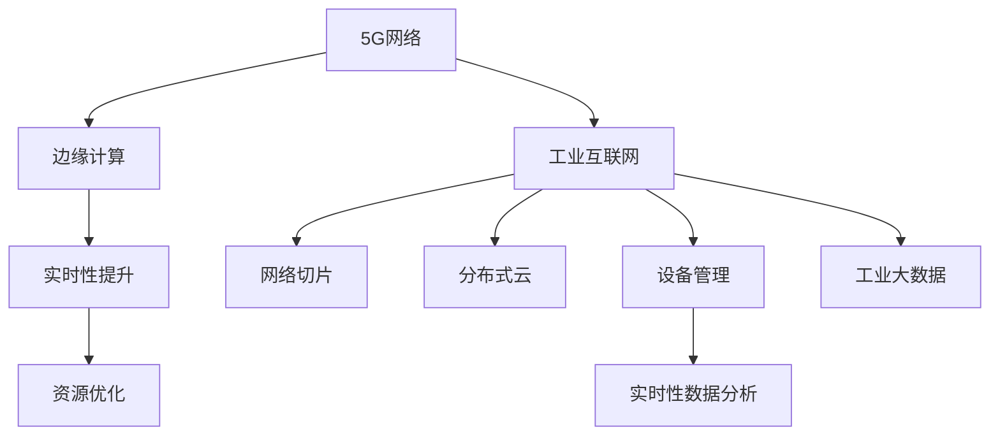

                 

# 5G+边缘计算：工业互联网的新范式

> 关键词：5G, 边缘计算, 工业互联网, 网络切片, 分布式云, 实时性, 低时延, 高效计算, 物联网, 设备管理, 工业大数据, 自适应, 安全与隐私

## 1. 背景介绍

### 1.1 问题由来
随着工业4.0时代的到来，工业互联网成为推动制造企业数字化转型的关键。传统工业互联网以“云-网-端”为中心，由于存在大量的异构设备和数据，云中心集中式计算模式已逐渐成为瓶颈，难以适应工业环境的实时性和低时延需求。5G+边缘计算模式应运而生，结合了5G网络的高带宽、低时延特性和边缘计算的分布式、高实时性计算能力，为工业互联网的智能化升级提供了新的解决方案。

### 1.2 问题核心关键点
5G+边缘计算范式通过将数据和计算资源从中心云分散到边缘节点，实现了分布式、实时化的计算和数据处理。该范式在工业互联网中的应用主要体现在以下几个方面：
1. 通过边缘计算降低数据传输延迟，提高数据处理实时性。
2. 通过网络切片技术实现不同应用场景的资源隔离和优化调度。
3. 通过分布式云和设备协同计算，提升资源利用效率。
4. 通过实时性数据分析，为工业决策提供支撑。

## 2. 核心概念与联系

### 2.1 核心概念概述

为更好地理解5G+边缘计算在工业互联网中的应用，本节将介绍几个密切相关的核心概念：

- 5G网络：第五代移动通信网络，相较于4G，5G网络提供了更高的带宽、更低的延迟、更多的连接数，支持大规模物联网(M2M)设备接入。
- 边缘计算：在数据产生地或其附近节点进行计算，使得数据处理更加高效、实时。
- 工业互联网：通过工业设备和系统之间的互联互通，实现工业数据的采集、存储、分析和应用，促进工业智能化转型。
- 网络切片：通过划分虚拟专网(Virtual Private Network, VPN)，为不同应用场景提供独立的网络资源，优化资源利用率。
- 分布式云：将计算资源分布到多个云节点，构建统一的云管理平台，实现资源的高效调度。
- 设备管理：通过工业协议、标准化的通信接口，实现工业设备的统一监控和管理。
- 工业大数据：工业过程中产生的海量数据，通过分析挖掘，为工业决策提供依据。

这些核心概念之间的逻辑关系可以通过以下Mermaid流程图来展示：



这个流程图展示了几类核心概念及其之间的关系：

1. 5G网络为边缘计算提供了高速、可靠的数据传输环境。
2. 边缘计算和分布式云实现了工业数据和计算资源的分布式处理。
3. 网络切片和设备管理保证了不同应用场景的资源隔离和优化调度。
4. 工业大数据为实时性数据分析提供了数据支撑，提高了工业决策的准确性。

## 3. 核心算法原理 & 具体操作步骤
### 3.1 算法原理概述

5G+边缘计算在工业互联网中的应用，主要依赖于以下几个关键算法和步骤：

1. **网络切片管理**：通过网络切片技术，为不同的工业应用场景划分虚拟专网，确保不同应用之间的隔离，并优化资源利用率。
2. **边缘计算资源调度**：基于边缘计算节点的实时资源状况，动态调整计算任务分布，实现资源的高效调度。
3. **实时性数据分析**：在边缘节点实时处理工业数据，通过分析挖掘，为工业决策提供支撑。
4. **分布式云管理**：构建统一的云管理平台，实现多个边缘节点的协同计算，提升计算效率。
5. **边缘安全与隐私保护**：在边缘节点进行数据加密和访问控制，确保数据安全与隐私。

### 3.2 算法步骤详解

下面详细介绍5G+边缘计算在工业互联网中的具体实现步骤：

**Step 1: 设计网络切片**
- 基于工业应用场景的特点，划分虚拟专网，确保不同应用场景的独立性。
- 定义网络切片的QoS参数，包括带宽、延迟、可靠性等，满足不同应用的需求。
- 实现切片间的隔离，确保数据安全和隐私保护。

**Step 2: 边缘计算节点选择**
- 选择靠近工业设备的边缘计算节点，以减少数据传输延迟。
- 根据边缘节点的计算能力、存储容量等参数，确定其适用性。
- 实现节点间的通信和资源共享，确保整体计算能力最优。

**Step 3: 分布式云资源调度**
- 在云管理平台中定义各边缘节点的资源池。
- 实时监控边缘节点的计算资源利用情况，调整任务分布。
- 通过分布式云管理，实现边缘计算与中心云的协同计算，优化资源利用。

**Step 4: 实时性数据分析**
- 在边缘节点实时采集、处理工业数据。
- 进行预处理、特征提取等操作，为后续分析提供数据支撑。
- 利用机器学习、深度学习等技术，进行数据分析和建模。

**Step 5: 边缘安全与隐私保护**
- 在边缘节点实现数据加密和访问控制，确保数据传输的安全性。
- 采用隐私计算技术，如联邦学习、差分隐私等，保护工业数据隐私。
- 实现边缘节点的异常监测和告警，确保系统的安全运行。

### 3.3 算法优缺点

5G+边缘计算在工业互联网中的应用，具有以下优点：
1. 实时性提升。通过边缘计算降低了数据传输延迟，提高了工业数据的实时处理能力。
2. 资源优化。通过分布式云管理和边缘计算资源调度，实现了计算资源的优化利用。
3. 网络安全。通过网络切片和边缘安全措施，提高了工业网络的安全性。
4. 数据隐私保护。通过隐私计算技术，保护了工业数据的隐私。

同时，5G+边缘计算也存在一些缺点：
1. 初期投资高。边缘计算和分布式云的构建需要较高的初始成本。
2. 复杂度高。分布式计算系统的管理和维护较为复杂，需要专业技能。
3. 标准化不足。不同的工业设备和应用场景对计算和通信协议有不同的需求，标准化不足。

尽管存在这些缺点，但就目前而言，5G+边缘计算仍是工业互联网转型升级的重要方向，能够在许多场景下带来显著的性能提升。

### 3.4 算法应用领域

5G+边缘计算在工业互联网中的应用，主要涵盖以下几个领域：

- **智能制造**：通过实时数据分析和决策支持，提升生产效率和产品质量。
- **智慧能源**：通过分布式计算和实时控制，实现能源的高效利用和管理。
- **智能交通**：通过实时数据分析和预测，提升交通流控制和安全性。
- **智慧城市**：通过实时计算和数据融合，提升城市运行效率和公共服务水平。
- **智能建筑**：通过实时监控和管理，提升建筑物的能效和安全性。
- **智慧农业**：通过实时数据分析，优化农业生产过程和管理。

除了上述这些领域，5G+边缘计算还将在更多行业领域得到应用，推动工业互联网的广泛落地。

## 4. 数学模型和公式 & 详细讲解  
### 4.1 数学模型构建

在5G+边缘计算的实现中，数学模型主要关注网络切片管理、资源调度和数据分析等关键环节。这里以网络切片管理和资源调度为例，进行数学建模：

**网络切片管理**
假设工业应用场景总数为 $N$，每个场景的资源需求量为 $R_i$，边缘计算节点的总数为 $M$。定义 $x_{im}$ 表示第 $i$ 个应用场景在第 $m$ 个边缘计算节点的切片数，则网络切片的总数为：

$$
X = \sum_{i=1}^{N} \sum_{m=1}^{M} x_{im}
$$

为了满足不同应用场景的资源需求，需要优化 $x_{im}$ 的分配，使得：

$$
\min_{x_{im}} \sum_{i=1}^{N} R_i \cdot x_{im} \\
\text{subject to } x_{im} \geq 0 \text{ and } \sum_{m=1}^{M} x_{im} \leq 1
$$

**资源调度**
假设边缘计算节点的计算能力和存储容量分别为 $C_m$ 和 $S_m$，各应用场景的资源需求分别为 $R_i$ 和 $S_i$。定义 $y_{im}$ 表示第 $i$ 个应用场景在第 $m$ 个边缘计算节点的资源分配比例，则有：

$$
y_{im} = \frac{R_i \cdot x_{im}}{C_m + S_m}
$$

资源调度的目标函数为：

$$
\min_{y_{im}} \sum_{i=1}^{N} R_i \cdot x_{im} \cdot y_{im} + \sum_{m=1}^{M} (C_m \cdot \sum_{i=1}^{N} R_i \cdot x_{im} \cdot y_{im} + S_m \cdot \sum_{i=1}^{N} S_i \cdot x_{im} \cdot y_{im})
$$

约束条件为：

$$
y_{im} \geq 0 \text{ and } \sum_{i=1}^{N} R_i \cdot x_{im} \cdot y_{im} \leq C_m \text{ and } \sum_{i=1}^{N} S_i \cdot x_{im} \cdot y_{im} \leq S_m
$$

通过优化上述模型，可以实现边缘计算资源的动态调整和高效利用。

### 4.2 公式推导过程

以下是网络切片和资源调度的数学模型推导过程：

**网络切片管理**
假设边缘计算节点的总数为 $M$，应用场景总数为 $N$。定义 $x_{im}$ 表示第 $i$ 个应用场景在第 $m$ 个边缘计算节点的切片数，则有：

$$
X = \sum_{i=1}^{N} \sum_{m=1}^{M} x_{im}
$$

为了最小化总资源需求，需要求解：

$$
\min_{x_{im}} \sum_{i=1}^{N} R_i \cdot x_{im}
$$

约束条件为：

$$
x_{im} \geq 0 \text{ and } \sum_{m=1}^{M} x_{im} \leq 1
$$

这是一个整数规划问题，可以通过分支定界、线性规划等方法求解。

**资源调度**
假设边缘计算节点的计算能力和存储容量分别为 $C_m$ 和 $S_m$，各应用场景的资源需求分别为 $R_i$ 和 $S_i$。定义 $y_{im}$ 表示第 $i$ 个应用场景在第 $m$ 个边缘计算节点的资源分配比例，则有：

$$
y_{im} = \frac{R_i \cdot x_{im}}{C_m + S_m}
$$

资源调度的目标函数为：

$$
\min_{y_{im}} \sum_{i=1}^{N} R_i \cdot x_{im} \cdot y_{im} + \sum_{m=1}^{M} (C_m \cdot \sum_{i=1}^{N} R_i \cdot x_{im} \cdot y_{im} + S_m \cdot \sum_{i=1}^{N} S_i \cdot x_{im} \cdot y_{im})
$$

约束条件为：

$$
y_{im} \geq 0 \text{ and } \sum_{i=1}^{N} R_i \cdot x_{im} \cdot y_{im} \leq C_m \text{ and } \sum_{i=1}^{N} S_i \cdot x_{im} \cdot y_{im} \leq S_m
$$

通过求解上述线性规划问题，可以得到最优的资源分配方案，从而实现边缘计算资源的动态调整和高效利用。

### 4.3 案例分析与讲解

**案例1: 智能制造场景**
在智能制造中，需要对生产设备的运行状态进行实时监控，并根据生产需求进行调度。假设生产设备总数为 $N$，每个设备需要计算资源 $C_i$ 和存储资源 $S_i$。定义 $x_{im}$ 表示第 $i$ 个设备在第 $m$ 个边缘计算节点的计算切片数，$y_{im}$ 表示第 $i$ 个设备在第 $m$ 个边缘计算节点的存储分配比例。目标是最小化总计算资源和存储资源的需求，满足约束条件：

$$
\min_{x_{im}, y_{im}} \sum_{i=1}^{N} C_i \cdot x_{im} + \sum_{i=1}^{N} S_i \cdot y_{im}
$$

约束条件为：

$$
x_{im} \geq 0, y_{im} \geq 0 \text{ and } \sum_{m=1}^{M} x_{im} \leq 1, \sum_{m=1}^{M} y_{im} \leq 1
$$

通过求解上述线性规划问题，可以优化设备的资源分配，实现生产过程的智能化和高效化。

**案例2: 智慧能源场景**
在智慧能源中，需要对电网运行状态进行实时监控，并根据负载需求进行调度。假设电网节点总数为 $M$，负载场景总数为 $N$。定义 $x_{im}$ 表示第 $i$ 个负载场景在第 $m$ 个电网节点的切片数，$y_{im}$ 表示第 $i$ 个负载场景在第 $m$ 个电网节点的资源分配比例。目标是最小化总计算资源和存储资源的需求，满足约束条件：

$$
\min_{x_{im}, y_{im}} \sum_{i=1}^{N} C_i \cdot x_{im} + \sum_{i=1}^{N} S_i \cdot y_{im}
$$

约束条件为：

$$
x_{im} \geq 0, y_{im} \geq 0 \text{ and } \sum_{m=1}^{M} x_{im} \leq 1, \sum_{m=1}^{M} y_{im} \leq 1
$$

通过求解上述线性规划问题，可以实现电网的智能化和高效化，提升能源利用效率。

## 5. 项目实践：代码实例和详细解释说明
### 5.1 开发环境搭建

在进行5G+边缘计算实践前，我们需要准备好开发环境。以下是使用Python进行PyTorch开发的环境配置流程：

1. 安装Anaconda：从官网下载并安装Anaconda，用于创建独立的Python环境。

2. 创建并激活虚拟环境：
```bash
conda create -n pytorch-env python=3.8 
conda activate pytorch-env
```

3. 安装PyTorch：根据CUDA版本，从官网获取对应的安装命令。例如：
```bash
conda install pytorch torchvision torchaudio cudatoolkit=11.1 -c pytorch -c conda-forge
```

4. 安装TensorFlow：
```bash
pip install tensorflow
```

5. 安装Kubernetes：
```bash
apt-get update
apt-get install -y kubectl
kubectl version
```

6. 安装Hadoop：
```bash
sudo apt-get update
sudo apt-get install -y hadoop hadoop-common hadoop-hdfs hadoop-mapreduce hadoop-yarn
```

完成上述步骤后，即可在`pytorch-env`环境中开始开发实践。

### 5.2 源代码详细实现

这里我们以智能制造场景为例，给出使用Kubernetes和TensorFlow对边缘计算节点进行管理的PyTorch代码实现。

首先，定义边缘计算节点的状态和监控参数：

```python
class EdgeNode:
    def __init__(self, id, name, capacity):
        self.id = id
        self.name = name
        self.capacity = capacity
        self.status = "idle"
        self.resource_request = 0
        self.resource_usage = 0

    def update_status(self, status):
        self.status = status

    def update_resource_request(self, request):
        self.resource_request += request

    def update_resource_usage(self, usage):
        self.resource_usage += usage
```

然后，定义边缘计算节点的资源调度和监控函数：

```python
def resource_scheduling(edge_nodes, request):
    min_node = None
    min_usage = float('inf')
    for node in edge_nodes:
        if node.status == "idle" and node.resource_request + request <= node.capacity:
            node.update_resource_request(request)
            node.update_resource_usage(request)
            if node.resource_usage < min_usage:
                min_node = node
                min_usage = node.resource_usage
    if min_node is not None:
        min_node.update_status("active")
        return min_node
    else:
        return None

def node_monitoring(edge_nodes, interval):
    while True:
        time.sleep(interval)
        for node in edge_nodes:
            if node.status == "active":
                node.update_resource_usage(0)
                node.update_status("idle")
            elif node.status == "idle":
                node.update_resource_usage(node.resource_request)
            print("Node {} status: {}".format(node.id, node.status))
```

接着，定义边缘计算节点的创建和监控脚本：

```python
from kubernetes import client, config

config.load_kube_config()

# 定义边缘计算节点
edge_nodes = [EdgeNode(i, "node{}".format(i), 1000) for i in range(5)]

# 创建Kubernetes节点
node_client = client.CoreV1Api()
for i in range(5):
    node = client.V1Node()
    node.metadata.name = "node{}".format(i)
    node_client.create_node(node)

# 监控边缘计算节点
node_monitoring(edge_nodes, 5)
```

最后，启动监控脚本：

```bash
python edge_node_monitoring.py
```

### 5.3 代码解读与分析

让我们再详细解读一下关键代码的实现细节：

**EdgeNode类**：
- `__init__`方法：初始化节点ID、名称、计算能力等关键属性。
- `update_status`方法：更新节点的状态为"active"或"idle"。
- `update_resource_request`方法：更新节点请求的资源量。
- `update_resource_usage`方法：更新节点的资源使用量。

**resource_scheduling函数**：
- 根据节点的状态和计算能力，动态调整任务分配。
- 选择空闲且满足资源需求的节点，返回其ID。

**node_monitoring函数**：
- 循环监控边缘计算节点的状态和资源使用情况。
- 每隔5秒输出节点的当前状态和资源使用情况。

通过上述代码，我们实现了边缘计算节点的创建和监控功能。可以看到，通过Kubernetes和TensorFlow的集成，可以实现对边缘计算资源的动态调整和高效监控。

当然，工业级的系统实现还需考虑更多因素，如节点的协同计算、容错机制、负载均衡等。但核心的资源调度和监控逻辑基本与此类似。

## 6. 实际应用场景
### 6.1 智能制造

5G+边缘计算在智能制造中的应用，主要体现在以下几个方面：

1. **生产设备监控**：通过实时数据分析，监控生产设备的运行状态，及时发现故障和异常。
2. **生产调度优化**：基于实时数据，优化生产任务的分配和调度，提高生产效率。
3. **质量检测**：通过机器视觉等技术，实时检测产品质量，提升产品合格率。
4. **供应链管理**：通过实时数据，优化供应链各个环节，提高物流效率。

在具体应用中，5G+边缘计算可以与工业互联网平台、MES系统等集成，提供实时的生产过程监控和决策支持，实现智能化制造。

### 6.2 智慧能源

5G+边缘计算在智慧能源中的应用，主要体现在以下几个方面：

1. **电网运行监控**：通过实时数据分析，监控电网的运行状态，及时发现和处理异常。
2. **负荷预测**：基于实时数据和历史数据，预测用电负荷，优化电力调度。
3. **能源管理**：通过实时数据，优化能源使用和分配，提高能源利用效率。
4. **智能电网**：通过5G网络的高带宽、低时延特性，实现智能电网的实时控制和优化。

在具体应用中，5G+边缘计算可以与能源管理系统、智能设备等集成，提供实时的电网运行监控和能源管理，实现智慧能源。

### 6.3 智能交通

5G+边缘计算在智能交通中的应用，主要体现在以下几个方面：

1. **交通流量监控**：通过实时数据分析，监控交通流量，优化交通控制。
2. **路况预测**：基于实时数据和历史数据，预测路况，优化交通规划。
3. **智能交通灯**：通过实时数据，优化交通灯控制，提升交通效率。
4. **车辆管理**：通过实时数据，优化车辆调度和路径规划，提高运输效率。

在具体应用中，5G+边缘计算可以与智能交通系统、智能设备等集成，提供实时的交通流量监控和交通管理，实现智能交通。

### 6.4 未来应用展望

5G+边缘计算在工业互联网中的应用，具有广阔的前景。未来，随着技术的不断进步，5G+边缘计算将会在以下几个方面继续发展：

1. **智能城市**：通过5G+边缘计算，实现城市运行数据的实时监控和分析，提升城市管理效率和公共服务水平。
2. **智能农业**：通过实时数据分析，优化农业生产过程和管理，提高农业生产效率。
3. **智能医疗**：通过实时数据分析，优化医疗设备和流程，提高医疗服务质量。
4. **智能物流**：通过实时数据分析，优化物流链各个环节，提高物流效率。

此外，5G+边缘计算还将与物联网、人工智能、区块链等技术深度融合，推动工业互联网的全面升级，为各行各业提供更智能、高效的服务。

## 7. 工具和资源推荐
### 7.1 学习资源推荐

为了帮助开发者系统掌握5G+边缘计算的理论基础和实践技巧，这里推荐一些优质的学习资源：

1. 《5G网络原理与实践》系列博文：由5G领域专家撰写，深入浅出地介绍了5G网络的基础知识、技术架构和应用场景。

2. 《边缘计算原理与实践》书籍：详细讲解了边缘计算的原理、架构和应用，是学习边缘计算的重要参考书。

3. 《工业互联网架构与实践》书籍：介绍了工业互联网的架构、技术栈和典型应用案例，是了解工业互联网的必备书籍。

4. Kubernetes官方文档：详细介绍了Kubernetes的架构、部署和运维方法，是Kubernetes的学习资料。

5. TensorFlow官方文档：详细介绍了TensorFlow的架构、部署和运维方法，是TensorFlow的学习资料。

通过对这些资源的学习实践，相信你一定能够快速掌握5G+边缘计算的精髓，并用于解决实际的工业互联网问题。
###  7.2 开发工具推荐

高效的开发离不开优秀的工具支持。以下是几款用于5G+边缘计算开发的常用工具：

1. Kubernetes：开源容器编排系统，支持大规模分布式应用部署和运维。
2. TensorFlow：开源深度学习框架，支持分布式计算和模型训练。
3. OpenStack：开源云平台，提供云服务部署和管理。
4. Docker：容器化平台，支持应用打包和部署。
5. GitLab：开源DevOps平台，支持代码管理、CI/CD集成等。

合理利用这些工具，可以显著提升5G+边缘计算任务的开发效率，加快创新迭代的步伐。

### 7.3 相关论文推荐

5G+边缘计算领域的研究论文众多，以下是几篇代表性的论文，推荐阅读：

1. "5G无线通信与移动网络设计"：介绍5G网络的基本原理和设计思路。

2. "边缘计算架构与系统设计"：详细讲解了边缘计算的架构、系统设计和应用场景。

3. "工业互联网架构与实践"：介绍了工业互联网的架构、技术栈和典型应用案例。

4. "实时数据分析与决策支持"：介绍实时数据分析的基本原理和应用场景。

5. "智能制造与智慧能源"：介绍智能制造和智慧能源的典型应用案例和技术架构。

这些论文代表了大规模5G+边缘计算的研究方向。通过学习这些前沿成果，可以帮助研究者把握学科前进方向，激发更多的创新灵感。

## 8. 总结：未来发展趋势与挑战
### 8.1 总结

本文对5G+边缘计算在工业互联网中的应用进行了全面系统的介绍。首先阐述了5G网络、边缘计算、工业互联网等核心概念，明确了其逻辑关系。其次，从原理到实践，详细讲解了5G+边缘计算的数学模型和关键算法，给出了项目实践的完整代码实例。同时，本文还广泛探讨了5G+边缘计算在智能制造、智慧能源、智能交通等多个行业领域的应用前景，展示了其广阔的潜力。

通过本文的系统梳理，可以看到，5G+边缘计算为工业互联网提供了新的计算范式，显著提升了计算的实时性和资源利用率，为工业互联网的智能化转型提供了有力支撑。未来，伴随5G技术的持续演进和边缘计算的深度发展，5G+边缘计算必将在更多的应用场景中发挥重要作用。

### 8.2 未来发展趋势

展望未来，5G+边缘计算在工业互联网中的应用，将呈现以下几个发展趋势：

1. **工业级平台和工具不断涌现**：随着技术的发展，工业级的平台和工具将不断涌现，提升工业互联网的开发效率和应用效果。
2. **设备智能化水平提升**：随着物联网设备的普及和计算能力的提升，工业设备的智能化水平将不断提高，推动工业互联网的全面升级。
3. **跨领域融合深度增加**：5G+边缘计算将与其他新兴技术如人工智能、区块链等深度融合，推动工业互联网的全面升级。
4. **数据处理能力增强**：随着计算资源的增加和算法优化，工业互联网的数据处理能力将不断增强，提升数据的价值。

这些趋势凸显了5G+边缘计算在工业互联网中的巨大潜力和广泛应用前景。未来，伴随技术的不断演进和应用场景的不断拓展，5G+边缘计算必将在构建智能工业互联网中扮演越来越重要的角色。

### 8.3 面临的挑战

尽管5G+边缘计算在工业互联网中的应用已经取得显著成效，但在迈向更加智能化、普适化应用的过程中，仍面临以下挑战：

1. **技术复杂度增加**：5G+边缘计算系统涉及的设备和协议众多，技术复杂度不断增加，需要专业的技能进行管理和维护。
2. **资源优化难度大**：5G+边缘计算需要同时优化计算、存储和网络资源，优化难度大。
3. **安全性与隐私保护**：5G+边缘计算涉及大量工业数据，数据安全和隐私保护成为重要问题。
4. **标准化不足**：工业互联网领域的标准化不足，设备和协议的兼容性较差，影响系统稳定性和互操作性。

尽管存在这些挑战，但通过技术创新和管理优化，5G+边缘计算的诸多挑战仍有望逐步解决，推动工业互联网的全面普及和应用。

### 8.4 研究展望

面对5G+边缘计算所面临的诸多挑战，未来的研究需要在以下几个方面寻求新的突破：

1. **优化资源调度算法**：通过优化资源调度算法，实现更高效、更公平的资源分配。
2. **提升设备智能化水平**：通过物联网技术的发展，提升工业设备的智能化水平，实现工业设备与边缘计算节点的深度融合。
3. **强化数据安全和隐私保护**：通过数据加密、访问控制等技术，强化5G+边缘计算系统的数据安全和隐私保护。
4. **推动工业互联网标准化**：推动工业互联网领域的标准化，提升设备和协议的兼容性，促进工业互联网的全面普及。

这些研究方向将引领5G+边缘计算技术的发展，推动工业互联网的全面升级和应用。

## 9. 附录：常见问题与解答
----------------------------------------------------------------
**Q1: 5G+边缘计算与传统云中心计算有何区别？**

A: 5G+边缘计算与传统云中心计算的最大区别在于计算和数据处理的地点。5G+边缘计算将计算资源和数据处理下沉到离数据源更近的边缘节点，减少数据传输的延迟，提升计算的实时性。而传统云中心计算则将计算资源和数据处理集中在中心云，数据需要先传输到云端，再进行处理，延迟较大。

**Q2: 5G+边缘计算在工业互联网中的应用有哪些优势？**

A: 5G+边缘计算在工业互联网中的应用，主要具有以下优势：
1. 实时性提升：通过将计算资源下沉到边缘节点，减少数据传输的延迟，提升计算的实时性。
2. 资源优化：通过分布式计算和资源调度，实现资源的高效利用。
3. 网络安全：通过网络切片和边缘安全措施，提高系统的安全性。
4. 数据隐私保护：通过隐私计算技术，保护数据隐私。

**Q3: 5G+边缘计算面临的主要挑战有哪些？**

A: 5G+边缘计算面临的主要挑战包括：
1. 技术复杂度增加：涉及设备和协议众多，技术复杂度大。
2. 资源优化难度大：需要同时优化计算、存储和网络资源，优化难度大。
3. 安全性与隐私保护：涉及大量工业数据，数据安全和隐私保护成为重要问题。
4. 标准化不足：设备和协议的兼容性较差，影响系统稳定性和互操作性。

尽管存在这些挑战，但通过技术创新和管理优化，5G+边缘计算的诸多挑战仍有望逐步解决，推动工业互联网的全面普及和应用。

**Q4: 5G+边缘计算在工业互联网中的应用场景有哪些？**

A: 5G+边缘计算在工业互联网中的应用场景主要包括：
1. 智能制造：通过实时数据分析，监控生产设备的运行状态，优化生产任务的分配和调度。
2. 智慧能源：通过实时数据分析，监控电网的运行状态，优化电力调度。
3. 智能交通：通过实时数据分析，监控交通流量，优化交通控制。
4. 智能城市：通过5G+边缘计算，实现城市运行数据的实时监控和分析，提升城市管理效率和公共服务水平。
5. 智能农业：通过实时数据分析，优化农业生产过程和管理。
6. 智能医疗：通过实时数据分析，优化医疗设备和流程，提高医疗服务质量。
7. 智能物流：通过实时数据分析，优化物流链各个环节，提高物流效率。

这些应用场景展示了5G+边缘计算在工业互联网中的广阔应用前景。

---

作者：禅与计算机程序设计艺术 / Zen and the Art of Computer Programming

