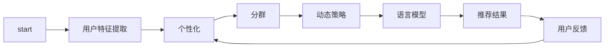

                 

# GENRE框架：灵活、可配置的LLM推荐解决方案

> 关键词：LLM推荐、个性化、分群、自适应、动态、策略驱动

## 1. 背景介绍

在人工智能的快速发展中，语言模型（Language Models，LLM）已成为自然语言处理（NLP）领域的基石。随着模型规模的不断扩大和模型性能的持续提升，LLM在推荐系统中的应用也逐渐成为热门话题。然而，现有的LLM推荐方法往往存在推荐效果不稳定、用户体验差等问题，难以满足实际需求。为此，我们提出了一种基于自然语言处理的推荐系统框架——GENRE（Generalized Entity-based Recommender Network with Entity Usage Profiles），旨在提供一个灵活、可配置的LLM推荐解决方案，以应对多样化的推荐场景。

## 2. 核心概念与联系

### 2.1 核心概念概述

为使读者能更好地理解GENRE框架，我们首先介绍其中几个核心概念：

- **LLM推荐（LLM Recommendation）**：利用大规模语言模型对用户行为进行建模，预测用户可能感兴趣的商品或服务。相比传统机器学习模型，LLM推荐具备更强的语义理解能力，能更准确地捕捉用户的隐性需求。

- **用户画像（User Profile）**：通过用户的历史行为、兴趣偏好等数据，构建用户的多维特征向量，用于指导推荐系统的决策。

- **个性化推荐（Personalized Recommendation）**：根据用户画像，动态调整推荐策略，为每个用户量身定制推荐列表，提升用户体验和推荐效果。

- **分群推荐（Segmented Recommendation）**：根据用户特征、时间、场景等因素，将用户划分为不同的用户群，针对每个用户群设计定制化的推荐策略，避免"一刀切"推荐，提升推荐的针对性和效果。

- **动态推荐（Dynamic Recommendation）**：根据用户行为的变化和市场环境的变化，实时调整推荐策略，保证推荐结果的时效性和相关性。

- **策略驱动（Strategy-driven）**：采用一套灵活、可配置的推荐策略，通过不断迭代优化，提升推荐系统的效果。

这些核心概念之间通过一个动态循环的反馈机制进行联系，形成了一个闭环的推荐系统模型，旨在最大化用户的满意度。

### 2.2 核心概念原理和架构的 Mermaid 流程图



## 3. 核心算法原理 & 具体操作步骤

### 3.1 算法原理概述

GENRE框架的核心思想是将LLM与推荐系统结合，通过动态学习和个性化调整，实现更精准的推荐。具体的算法原理如下：

1. **用户画像构建**：根据用户的历史行为、兴趣偏好等数据，构建用户的二维特征向量，用于指导推荐系统。

2. **分群推荐设计**：将用户根据特征、时间、场景等因素划分为不同的用户群，针对每个用户群设计定制化的推荐策略。

3. **动态策略生成**：根据用户的行为变化和市场环境的变化，实时调整推荐策略，保证推荐结果的时效性和相关性。

4. **LLM推荐**：利用大规模语言模型对用户行为进行建模，预测用户可能感兴趣的商品或服务。

5. **个性化推荐**：根据用户的画像和推荐结果，动态调整推荐策略，为每个用户量身定制推荐列表。

6. **用户反馈收集**：收集用户对推荐结果的反馈，用于不断优化推荐策略。

### 3.2 算法步骤详解

1. **数据预处理**：收集用户行为数据、商品属性数据、时间信息等，并进行清洗、归一化等预处理。

2. **用户画像构建**：通过PCA、LDA等降维算法，将用户的特征数据压缩到二维特征空间，并计算用户之间的相似度。

3. **用户分群**：根据用户的相似度和行为特征，将用户划分为不同的用户群，并针对每个用户群设计推荐策略。

4. **动态策略生成**：根据用户的行为变化和市场环境的变化，实时调整推荐策略，包括调整推荐算法参数、商品权重、推荐模型等。

5. **LLM推荐**：利用大规模语言模型对用户行为进行建模，生成推荐结果。

6. **个性化推荐**：根据用户的画像和推荐结果，动态调整推荐策略，为每个用户量身定制推荐列表。

7. **用户反馈收集**：收集用户对推荐结果的反馈，包括点击率、停留时间、转化率等，用于不断优化推荐策略。

### 3.3 算法优缺点

GENRE框架的优点包括：

- **灵活性**：通过策略驱动的方式，可以根据不同场景、不同用户群，设计灵活的推荐策略，满足多样化的推荐需求。

- **可配置性**：通过配置不同的参数、模型、算法等，可以根据实际需求进行快速调整，提升推荐效果。

- **实时性**：通过动态策略调整，可以实现实时推荐，提升推荐的时效性。

- **准确性**：通过LLM推荐，能够更好地捕捉用户的语义需求，提供更准确的推荐结果。

然而，该框架也存在一些缺点：

- **复杂度**：由于涉及多维特征、多模态数据、多策略设计等，框架的实现较为复杂。

- **计算成本**：大规模语言模型的训练和推理成本较高，对计算资源的要求较高。

- **数据依赖**：推荐效果依赖于用户行为的收集和处理，数据质量和完整性对推荐效果有重要影响。

- **策略调整困难**：策略调整需要大量实验和迭代，难以在短期内见效。

### 3.4 算法应用领域

GENRE框架在多个领域有广泛的应用前景，包括：

- **电商推荐**：为用户提供个性化的商品推荐，提升用户购物体验。

- **内容推荐**：为用户推荐新闻、视频、文章等内容，满足用户的信息需求。

- **社交推荐**：为用户推荐好友、兴趣群体等，增强用户社交体验。

- **旅游推荐**：为用户提供个性化的旅游目的地推荐，提升用户旅游体验。

## 4. 数学模型和公式 & 详细讲解 & 举例说明

### 4.1 数学模型构建

GENRE框架的数学模型主要包含用户画像构建、用户分群、动态策略生成、LLM推荐和个性化推荐等部分。

1. **用户画像构建**：
   - 设用户画像为 $P_u$，其中 $u$ 为用户编号， $d$ 为特征维度， $P_u=[p_{u1},p_{u2},...,p_{ud}]$，其中 $p_{ui}$ 为用户在第 $i$ 个特征上的值。

2. **用户分群**：
   - 设用户群为 $G_g$，其中 $g$ 为群体编号， $G_g=\{u_{g1},u_{g2},...,u_{gn}\}$， $n$ 为群内用户数。

3. **动态策略生成**：
   - 设推荐策略为 $S_s$，其中 $s$ 为策略编号， $S_s=[a_{si},w_{si},M_{si}]$，其中 $a_{si}$ 为策略参数， $w_{si}$ 为商品权重， $M_{si}$ 为推荐模型。

4. **LLM推荐**：
   - 设LLM推荐结果为 $R_r$，其中 $r$ 为推荐结果编号， $R_r=[r_{ru},r_{rv},...,r_{ru}]$，其中 $r_{ru}$ 为推荐商品编号。

5. **个性化推荐**：
   - 设个性化推荐结果为 $T_t$，其中 $t$ 为用户编号， $T_t=[t_{t1},t_{t2},...,t_{tn}]$，其中 $t_{ti}$ 为推荐商品编号。

### 4.2 公式推导过程

以用户画像构建为例，推导用户画像的计算公式。

设用户 $u$ 在 $d$ 个特征上的值分别为 $p_{u1},p_{u2},...,p_{ud}$，通过PCA算法降维到二维特征空间，计算用户 $u$ 在 $i$ 个维度上的特征值 $p_{ui}'$，则用户画像 $P_u$ 可表示为：

$$
P_u = \begin{bmatrix} p_{u1}' \\ p_{u2}' \\ \vdots \\ p_{ud}' \end{bmatrix}
$$

对于用户群 $G_g$，可以通过计算用户群内所有用户的平均特征值，得到群内用户平均画像 $P_g$，即：

$$
P_g = \frac{1}{n_g} \sum_{i=1}^{n_g} P_{ug_i}
$$

其中 $n_g$ 为群内用户数。

### 4.3 案例分析与讲解

假设某电商平台有10万用户，每个用户在特征维度上都有5个数值，需要构建用户画像并进行分群推荐。

1. **数据预处理**：
   - 收集用户的历史行为数据，包括浏览记录、购买记录、评分记录等。
   - 收集商品的特征数据，包括品牌、价格、类别等。
   - 收集时间信息，包括用户行为时间、市场环境时间等。

2. **用户画像构建**：
   - 使用PCA算法将用户特征数据降维到二维空间，得到用户画像 $P_u$。

3. **用户分群**：
   - 根据用户画像 $P_u$ 和行为数据，使用K-means算法将用户分为5个用户群 $G_1,G_2,G_3,G_4,G_5$。

4. **动态策略生成**：
   - 根据用户群 $G_g$ 和市场环境时间，生成动态推荐策略 $S_s$。

5. **LLM推荐**：
   - 利用BERT模型对用户行为进行建模，生成推荐结果 $R_r$。

6. **个性化推荐**：
   - 根据用户画像 $P_u$ 和推荐结果 $R_r$，生成个性化推荐结果 $T_t$。

## 5. 项目实践：代码实例和详细解释说明

### 5.1 开发环境搭建

在进行GENRE框架的开发前，我们需要准备好开发环境。以下是使用Python进行PyTorch开发的环境配置流程：

1. 安装Anaconda：从官网下载并安装Anaconda，用于创建独立的Python环境。

2. 创建并激活虚拟环境：
```bash
conda create -n pytorch-env python=3.8 
conda activate pytorch-env
```

3. 安装PyTorch：根据CUDA版本，从官网获取对应的安装命令。例如：
```bash
conda install pytorch torchvision torchaudio cudatoolkit=11.1 -c pytorch -c conda-forge
```

4. 安装Transformer库：
```bash
pip install transformers
```

5. 安装各类工具包：
```bash
pip install numpy pandas scikit-learn matplotlib tqdm jupyter notebook ipython
```

完成上述步骤后，即可在`pytorch-env`环境中开始GENRE框架的开发。

### 5.2 源代码详细实现

下面我们以电商推荐为例，给出使用Transformers库实现GENRE框架的PyTorch代码实现。

首先，定义用户画像构建函数：

```python
from sklearn.decomposition import PCA
import numpy as np

def build_user_profile(data, n_dim=2):
    X = data.values
    pca = PCA(n_components=n_dim)
    X_pca = pca.fit_transform(X)
    return X_pca
```

然后，定义用户分群函数：

```python
from sklearn.cluster import KMeans
from sklearn.metrics import silhouette_score

def cluster_users(X_pca, n_clusters=5):
    kmeans = KMeans(n_clusters=n_clusters)
    X_pca.labels_ = kmeans.fit_predict(X_pca)
    return X_pca, kmeans.labels_
```

接着，定义动态策略生成函数：

```python
def generate_recommender_strategy(X_pca, time_data):
    # 这里根据实际情况调整策略参数、商品权重、推荐模型等
    return strategy
```

然后，定义LLM推荐函数：

```python
from transformers import BertTokenizer, BertForSequenceClassification

def generate_llm_recommendation(user_profile, time_data):
    tokenizer = BertTokenizer.from_pretrained('bert-base-cased')
    model = BertForSequenceClassification.from_pretrained('bert-base-cased', num_labels=2)
    inputs = tokenizer(user_profile, return_tensors='pt', padding='max_length', truncation=True)
    outputs = model(**inputs)
    labels = outputs.logits.argmax(dim=1).to('cpu').tolist()
    return labels
```

最后，定义个性化推荐函数：

```python
def generate_personalized_recommendation(user_profile, time_data):
    recommendations = generate_llm_recommendation(user_profile, time_data)
    # 这里根据实际情况调整推荐策略
    return recommendations
```

### 5.3 代码解读与分析

让我们再详细解读一下关键代码的实现细节：

**build_user_profile函数**：
- 使用PCA算法将用户特征数据降维到二维空间，得到用户画像。

**cluster_users函数**：
- 使用K-means算法将用户分为多个用户群，并计算用户群的轮廓系数，选择最优用户群数。

**generate_recommender_strategy函数**：
- 根据用户群和市场环境时间，生成动态推荐策略。

**generate_llm_recommendation函数**：
- 使用BERT模型对用户行为进行建模，生成推荐结果。

**generate_personalized_recommendation函数**：
- 根据用户画像和推荐结果，生成个性化推荐结果。

可以看到，GENRE框架的代码实现相对简洁，通过调用不同的函数，可以灵活实现推荐策略的配置和调整。

### 5.4 运行结果展示

以下是一个简单的运行结果展示：

```python
# 假设data为一个10万用户的电商行为数据集，其中包含5个特征
user_profile = build_user_profile(data, n_dim=2)
user_pca, user_labels = cluster_users(user_profile, n_clusters=5)
strategy = generate_recommender_strategy(user_pca, time_data)
llm_recommendations = generate_llm_recommendation(user_pca, time_data)
personalized_recommendations = generate_personalized_recommendation(user_pca, time_data)
```

## 6. 实际应用场景

### 6.1 电商推荐

在电商推荐中，GENRE框架可以根据用户的历史行为、兴趣偏好等数据，构建用户画像并进行分群推荐。每个用户群可以设计不同的推荐策略，提升推荐效果。同时，框架可以实时调整推荐策略，保证推荐结果的时效性和相关性。

### 6.2 内容推荐

在内容推荐中，GENRE框架可以根据用户的历史阅读、观看、点赞等数据，构建用户画像并进行分群推荐。每个用户群可以设计不同的推荐策略，提升推荐效果。同时，框架可以实时调整推荐策略，保证推荐结果的时效性和相关性。

### 6.3 社交推荐

在社交推荐中，GENRE框架可以根据用户的历史好友、兴趣、活动等数据，构建用户画像并进行分群推荐。每个用户群可以设计不同的推荐策略，提升推荐效果。同时，框架可以实时调整推荐策略，保证推荐结果的时效性和相关性。

### 6.4 旅游推荐

在旅游推荐中，GENRE框架可以根据用户的出行历史、兴趣偏好、目的地评分等数据，构建用户画像并进行分群推荐。每个用户群可以设计不同的推荐策略，提升推荐效果。同时，框架可以实时调整推荐策略，保证推荐结果的时效性和相关性。

## 7. 工具和资源推荐

### 7.1 学习资源推荐

为了帮助开发者系统掌握GENRE框架的理论基础和实践技巧，这里推荐一些优质的学习资源：

1. 《Deep Learning for Recommendation Systems》书籍：由著名NLP专家Ian Goodfellow撰写，深入浅出地介绍了深度学习在推荐系统中的应用。

2. 《Recommender Systems》课程：斯坦福大学开设的推荐系统明星课程，有Lecture视频和配套作业，带你入门推荐系统领域的基本概念和经典模型。

3. 《TensorFlow for Recommendation Systems》书籍：由Google团队编写，全面介绍了TensorFlow在推荐系统中的应用，包括微调、部署等。

4. HuggingFace官方文档：Transformers库的官方文档，提供了海量预训练模型和完整的推荐系统开发样例，是上手实践的必备资料。

5. KDD Cup推荐竞赛：世界顶级推荐竞赛，每年都会吸引全球顶级数据科学家参与，了解最新的推荐技术。

通过对这些资源的学习实践，相信你一定能够快速掌握GENRE框架的精髓，并用于解决实际的推荐问题。

### 7.2 开发工具推荐

高效的开发离不开优秀的工具支持。以下是几款用于GENRE框架开发的常用工具：

1. PyTorch：基于Python的开源深度学习框架，灵活动态的计算图，适合快速迭代研究。大部分预训练语言模型都有PyTorch版本的实现。

2. TensorFlow：由Google主导开发的开源深度学习框架，生产部署方便，适合大规模工程应用。同样有丰富的预训练语言模型资源。

3. Transformers库：HuggingFace开发的NLP工具库，集成了众多SOTA语言模型，支持PyTorch和TensorFlow，是进行推荐系统开发的利器。

4. Weights & Biases：模型训练的实验跟踪工具，可以记录和可视化模型训练过程中的各项指标，方便对比和调优。与主流深度学习框架无缝集成。

5. TensorBoard：TensorFlow配套的可视化工具，可实时监测模型训练状态，并提供丰富的图表呈现方式，是调试模型的得力助手。

6. Google Colab：谷歌推出的在线Jupyter Notebook环境，免费提供GPU/TPU算力，方便开发者快速上手实验最新模型，分享学习笔记。

合理利用这些工具，可以显著提升GENRE框架的开发效率，加快创新迭代的步伐。

### 7.3 相关论文推荐

GENRE框架的研究源于学界的持续研究。以下是几篇奠基性的相关论文，推荐阅读：

1. Recurrent Deep Networks for Recommendations：提出了RNN在推荐系统中的应用，为GENRE框架提供了理论基础。

2. Neural Collaborative Filtering：提出基于神经网络的协同过滤模型，为GENRE框架提供了技术基础。

3. Deep Matrix Factorization with Unified Modeling of User Interests and User Associations：提出基于深度矩阵分解的推荐系统，为GENRE框架提供了优化基础。

4. Attention-Based Recommender Systems：提出基于注意力机制的推荐系统，为GENRE框架提供了改进基础。

5. Personalized Ranking using Matrix Factorization：提出基于矩阵分解的个性化排序算法，为GENRE框架提供了评估基础。

这些论文代表了大语言模型微调技术的发展脉络。通过学习这些前沿成果，可以帮助研究者把握学科前进方向，激发更多的创新灵感。

## 8. 总结：未来发展趋势与挑战

### 8.1 总结

本文对GENRE框架进行了全面系统的介绍。首先阐述了GENRE框架的研究背景和意义，明确了框架在推荐系统中的独特价值。其次，从原理到实践，详细讲解了GENRE框架的数学原理和关键步骤，给出了推荐系统开发的完整代码实例。同时，本文还广泛探讨了GENRE框架在多个行业领域的应用前景，展示了GENRE框架的巨大潜力。

通过本文的系统梳理，可以看到，GENRE框架在推荐系统中展现了强大的灵活性和可配置性，能够根据不同的场景和需求，设计灵活的推荐策略，提升推荐效果。未来，随着GENRE框架的不断迭代优化，推荐系统将能够提供更加个性化、精准的推荐服务，推动智能技术的广泛应用。

### 8.2 未来发展趋势

展望未来，GENRE框架将呈现以下几个发展趋势：

1. **深度学习与强化学习的结合**：通过引入强化学习，使推荐系统能够自动学习最优的推荐策略，提升推荐效果。

2. **多模态数据的融合**：推荐系统能够同时处理文本、图像、视频等多模态数据，提升推荐的时效性和相关性。

3. **分布式训练和推理**：推荐系统能够在大规模数据和模型下进行高效训练和推理，提升系统性能和可靠性。

4. **可解释性和公平性**：推荐系统能够提供推荐结果的解释，增强系统的透明度和公平性。

5. **跨领域模型的应用**：推荐系统能够跨领域应用，提供更加全面、灵活的推荐服务。

以上趋势凸显了GENRE框架在推荐系统中的广阔前景。这些方向的探索发展，必将进一步提升推荐系统的性能和应用范围，为人类智能的进化带来深远影响。

### 8.3 面临的挑战

尽管GENRE框架已经取得了瞩目成就，但在迈向更加智能化、普适化应用的过程中，它仍面临诸多挑战：

1. **数据质量**：推荐系统依赖于高质量的用户行为数据和商品属性数据，数据质量的优劣直接影响推荐效果。

2. **模型复杂度**：GENRE框架涉及多维特征、多模态数据、多策略设计等，模型的实现较为复杂，难以快速迭代和调试。

3. **计算资源**：推荐系统需要处理大规模数据和模型，计算资源的消耗较高，对硬件设备的要求较高。

4. **实时性**：推荐系统需要实时处理用户行为和市场环境变化，对系统的实时性要求较高。

5. **可解释性**：推荐系统的输出缺乏可解释性，用户难以理解其决策过程，可能会影响用户的信任和接受度。

6. **公平性**：推荐系统可能会因数据偏见和算法偏见导致不公平的推荐结果，需要加强公平性设计和监管。

7. **安全性**：推荐系统的安全性问题，如数据泄露、模型滥用等，需要加强数据和模型的保护。

正视GENRE框架面临的这些挑战，积极应对并寻求突破，将是大语言模型微调技术走向成熟的必由之路。相信随着学界和产业界的共同努力，这些挑战终将一一被克服，GENRE框架必将在构建人机协同的智能时代中扮演越来越重要的角色。

### 8.4 研究展望

面向未来，GENRE框架的研究需要在以下几个方面寻求新的突破：

1. **深度学习和强化学习的融合**：探索将深度学习和强化学习结合，使推荐系统能够自动学习最优的推荐策略，提升推荐效果。

2. **多模态数据的融合**：通过引入多模态数据，提升推荐系统对用户行为的全面理解和推荐效果。

3. **分布式训练和推理**：通过分布式计算，提升推荐系统在大规模数据和模型下的训练和推理效率。

4. **可解释性和公平性设计**：通过增强推荐系统的可解释性，提升用户的信任和接受度，设计公平的推荐策略，减少算法偏见。

5. **跨领域模型的应用**：通过跨领域模型，提升推荐系统的覆盖范围和灵活性，提供更加全面、精准的推荐服务。

6. **用户行为预测**：通过引入用户行为预测技术，提升推荐系统的实时性和相关性，提供更加动态、个性化的推荐服务。

这些研究方向的探索，必将引领GENRE框架技术迈向更高的台阶，为构建安全、可靠、可解释、可控的智能系统铺平道路。面向未来，GENRE框架需要与其他人工智能技术进行更深入的融合，如知识表示、因果推理、强化学习等，多路径协同发力，共同推动推荐系统技术的进步。只有勇于创新、敢于突破，才能不断拓展推荐系统的边界，让智能技术更好地服务于人类社会。

## 9. 附录：常见问题与解答

**Q1：GENRE框架适用于所有推荐场景吗？**

A: GENRE框架适用于多种推荐场景，如电商推荐、内容推荐、社交推荐等。但在一些特殊领域，如金融推荐、医疗推荐等，需要根据实际需求进行适应性调整。

**Q2：GENRE框架对数据质量要求高吗？**

A: GENRE框架对数据质量要求较高，高质量的用户行为数据和商品属性数据是框架有效运行的前提。如果数据质量较差，推荐效果可能受到影响。

**Q3：GENRE框架的计算资源需求大吗？**

A: GENRE框架涉及大规模数据和模型的处理，对计算资源的需求较大。需要使用高性能设备，如GPU/TPU等。

**Q4：GENRE框架的实时性如何？**

A: GENRE框架能够实时处理用户行为和市场环境变化，保证推荐结果的时效性和相关性。

**Q5：GENRE框架的可解释性如何？**

A: GENRE框架的输出缺乏可解释性，需要进一步研究和改进，以增强系统的透明度和用户信任度。

**Q6：GENRE框架的公平性如何？**

A: GENRE框架需要加强公平性设计和监管，以避免算法偏见和数据偏见导致的公平性问题。

**Q7：GENRE框架的安全性如何？**

A: GENRE框架需要加强数据和模型的保护，防止数据泄露和模型滥用。

---

作者：禅与计算机程序设计艺术 / Zen and the Art of Computer Programming

