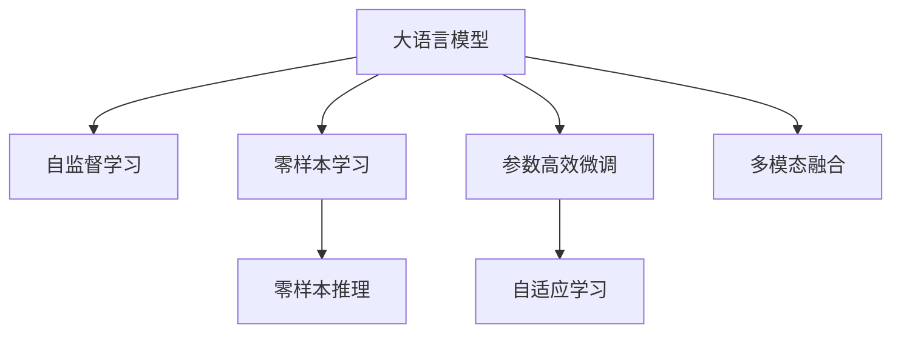

                 

# GPT-3与GPT-4：大语言模型的最新进展

> 关键词：GPT-3, GPT-4, 大语言模型, 自然语言处理(NLP), 语言理解, 生成式模型, 零样本学习, 零样本推理, 自监督学习, 参数高效微调, 自适应学习, 文本生成, 情感分析, 对话系统, 计算机视觉, 自然语言推理, 人工智能, 神经网络, 计算资源

## 1. 背景介绍

### 1.1 问题由来
近年来，大语言模型在自然语言处理（NLP）领域取得了显著进展，其中OpenAI的GPT系列模型因其卓越的性能和广泛的应用受到广泛关注。GPT-3作为目前最大的语言模型之一，在多项NLP任务上取得了SOTA成绩，展示了自监督学习在语言模型上的巨大潜力。然而，GPT-3虽然强大，其参数量高达1750亿，使得大规模推理和部署面临诸多挑战。为此，OpenAI于2023年推出了GPT-4，进一步提升了模型性能和推理效率，优化了模型参数，使得大语言模型在实际应用中的效果更加出色。

### 1.2 问题核心关键点
GPT-3与GPT-4的最新进展主要集中在以下几个方面：
- 模型的参数量和结构：GPT-4的参数量进一步优化，推理速度显著提升。
- 零样本学习和推理：GPT-4通过改进算法，显著提高了零样本学习能力和推理效率。
- 自监督学习与微调：GPT-4采用了更先进的自监督学习技术，并在微调过程中引入了自适应学习机制，使得模型能够更高效地适应新的任务。
- 多模态融合：GPT-4引入了图像、视频等多模态数据的融合，进一步提升了语言模型的通用性和应用范围。

这些改进不仅显著提升了模型的性能，还为实际应用中的大规模推理和部署提供了更好的解决方案。

## 2. 核心概念与联系

### 2.1 核心概念概述

为更好地理解GPT-4的最新进展，本节将介绍几个密切相关的核心概念：

- 大语言模型（Large Language Models, LLMs）：指通过大规模无标签文本数据进行预训练，学习通用语言表示的深度学习模型。GPT-3和GPT-4均为此类别。
- 零样本学习（Zero-shot Learning）：指模型在没有见到过特定任务的训练样本的情况下，仅凭任务描述就能执行新任务的能力。GPT-4在此方面取得了显著进展。
- 零样本推理（Zero-shot Reasoning）：指在零样本学习的基础上，进一步通过推理得出符合逻辑的答案。
- 自监督学习（Self-supervised Learning）：指通过无标签数据训练模型，学习数据的内在结构，如掩码语言模型、自回归等。GPT-3与GPT-4均使用了大量的自监督学习任务进行预训练。
- 参数高效微调（Parameter-Efficient Fine-Tuning, PEFT）：指在微调过程中，只更新少量的模型参数，而固定大部分预训练权重不变，以提高微调效率和效果。
- 自适应学习（Adaptive Learning）：指模型能够根据输入数据动态调整自身的学习策略，以适应不同的数据分布。GPT-4通过自适应学习机制显著提升了模型的鲁棒性和泛化能力。
- 多模态融合（Multimodal Fusion）：指将文本、图像、视频等多模态数据进行融合，提升模型的通用性和应用范围。

这些核心概念之间的逻辑关系可以通过以下Mermaid流程图来展示：



这个流程图展示了大语言模型的核心概念及其之间的关系：

1. 大语言模型通过自监督学习获得基础能力。
2. 零样本学习能力通过模型推理获得，而零样本推理进一步提升推理能力。
3. 参数高效微调在固定大部分预训练参数的情况下，仍可取得不错的微调效果。
4. 自适应学习机制使模型能够动态调整学习策略，提升鲁棒性。
5. 多模态融合使模型能够处理和融合多种类型的数据，提升应用范围和效果。

这些概念共同构成了大语言模型的学习和应用框架，使得GPT-4能够在更多领域和任务中展现出卓越的性能。

## 3. 核心算法原理 & 具体操作步骤
### 3.1 算法原理概述

GPT-4的最新进展主要集中在以下几个方面：
- 参数优化：GPT-4通过减少参数量，显著提升了推理速度和效率。
- 自适应学习：GPT-4引入自适应学习机制，使模型能够根据输入数据动态调整学习策略。
- 零样本学习：GPT-4通过改进算法，显著提升了零样本学习和推理能力。
- 多模态融合：GPT-4引入了图像、视频等多模态数据，进一步提升了模型的通用性。

### 3.2 算法步骤详解

GPT-4的微调过程包括以下关键步骤：

**Step 1: 准备数据集**
- 收集和整理预训练数据集，确保其质量，并划分为训练集、验证集和测试集。
- 在数据集中标注任务相关的标签，用于模型微调。

**Step 2: 设计任务适配层**
- 根据任务类型，设计合适的任务适配层，如分类层、解码器等。
- 设计损失函数，如交叉熵、均方误差等，用于衡量模型预测与真实标签之间的差异。

**Step 3: 设置微调超参数**
- 选择合适的优化算法及其参数，如AdamW、SGD等，设置学习率、批大小、迭代轮数等。
- 设置正则化技术及强度，包括权重衰减、Dropout、Early Stopping等。
- 确定冻结预训练参数的策略，如仅微调顶层，或全部参数都参与微调。

**Step 4: 执行梯度训练**
- 将训练集数据分批次输入模型，前向传播计算损失函数。
- 反向传播计算参数梯度，根据设定的优化算法和学习率更新模型参数。
- 周期性在验证集上评估模型性能，根据性能指标决定是否触发Early Stopping。
- 重复上述步骤直到满足预设的迭代轮数或Early Stopping条件。

**Step 5: 测试和部署**
- 在测试集上评估微调后模型，对比微调前后的精度提升。
- 使用微调后的模型对新样本进行推理预测，集成到实际的应用系统中。
- 持续收集新的数据，定期重新微调模型，以适应数据分布的变化。

以上是GPT-4微调的一般流程。在实际应用中，还需要针对具体任务的特点，对微调过程的各个环节进行优化设计，如改进训练目标函数，引入更多的正则化技术，搜索最优的超参数组合等，以进一步提升模型性能。

### 3.3 算法优缺点

GPT-4的最新进展主要具有以下优点：
- 参数量优化：通过减少参数量，显著提升了推理速度和效率。
- 自适应学习：通过引入自适应学习机制，使模型能够动态调整学习策略，提升鲁棒性和泛化能力。
- 零样本学习：通过改进算法，显著提升了零样本学习和推理能力。
- 多模态融合：通过引入多模态数据，进一步提升了模型的通用性和应用范围。

同时，GPT-4也存在以下局限性：
- 依赖标注数据：虽然参数量优化带来了效率提升，但微调过程仍然依赖于标注数据。
- 数据分布差异：当目标任务与预训练数据的分布差异较大时，微调的性能提升有限。
- 模型复杂性：引入了自适应学习和多模态融合等新机制，使得模型结构更加复杂。

尽管存在这些局限性，但就目前而言，GPT-4的最新进展仍然是大语言模型微调技术的重要范式。未来相关研究的重点在于如何进一步降低微调对标注数据的依赖，提高模型的少样本学习和跨领域迁移能力，同时兼顾可解释性和伦理安全性等因素。

### 3.4 算法应用领域

GPT-4的最新进展已经在NLP、计算机视觉、自然语言推理等多个领域得到了广泛的应用，具体如下：

- **自然语言处理**：文本分类、情感分析、问答系统、摘要生成、机器翻译、对话系统等。
- **计算机视觉**：图像描述、物体检测、图像生成、视频字幕生成等。
- **自然语言推理**：语言推理、逻辑判断、自然推理、推理问答等。
- **情感分析**：情感分类、情感分析、情感预测等。

除了上述这些经典任务外，GPT-4还创新性地应用于代码生成、数据增强、游戏AI等场景中，为NLP技术带来了全新的突破。

## 4. 数学模型和公式 & 详细讲解
### 4.1 数学模型构建

记预训练语言模型为 $M_{\theta}$，其中 $\theta$ 为预训练得到的模型参数。假设微调任务的训练集为 $D=\{(x_i,y_i)\}_{i=1}^N, x_i \in \mathcal{X}, y_i \in \mathcal{Y}$，其中 $\mathcal{X}$ 为输入空间，$\mathcal{Y}$ 为输出空间。微调的目标是最小化经验风险：

$$
\mathcal{L}(\theta) = \frac{1}{N}\sum_{i=1}^N \ell(M_{\theta}(x_i),y_i)
$$

其中 $\ell$ 为针对任务 $T$ 设计的损失函数，用于衡量模型预测输出与真实标签之间的差异。常见的损失函数包括交叉熵损失、均方误差损失等。

在微调过程中，模型的参数更新公式为：

$$
\theta \leftarrow \theta - \eta \nabla_{\theta}\mathcal{L}(\theta) - \eta\lambda\theta
$$

其中 $\nabla_{\theta}\mathcal{L}(\theta)$ 为损失函数对参数 $\theta$ 的梯度，可通过反向传播算法高效计算。

### 4.2 公式推导过程

以下我们以二分类任务为例，推导交叉熵损失函数及其梯度的计算公式。

假设模型 $M_{\theta}$ 在输入 $x$ 上的输出为 $\hat{y}=M_{\theta}(x) \in [0,1]$，表示样本属于正类的概率。真实标签 $y \in \{0,1\}$。则二分类交叉熵损失函数定义为：

$$
\ell(M_{\theta}(x),y) = -[y\log \hat{y} + (1-y)\log (1-\hat{y})]
$$

将其代入经验风险公式，得：

$$
\mathcal{L}(\theta) = -\frac{1}{N}\sum_{i=1}^N [y_i\log M_{\theta}(x_i)+(1-y_i)\log(1-M_{\theta}(x_i))]
$$

根据链式法则，损失函数对参数 $\theta_k$ 的梯度为：

$$
\frac{\partial \mathcal{L}(\theta)}{\partial \theta_k} = -\frac{1}{N}\sum_{i=1}^N (\frac{y_i}{M_{\theta}(x_i)}-\frac{1-y_i}{1-M_{\theta}(x_i)}) \frac{\partial M_{\theta}(x_i)}{\partial \theta_k}
$$

其中 $\frac{\partial M_{\theta}(x_i)}{\partial \theta_k}$ 可进一步递归展开，利用自动微分技术完成计算。

### 4.3 案例分析与讲解

以下以情感分析任务为例，展示GPT-4的微调过程和结果分析。

假设模型 $M_{\theta}$ 在输入 $x$ 上的输出为 $\hat{y}=M_{\theta}(x) \in [0,1]$，表示样本属于正情感的概率。真实标签 $y \in \{0,1\}$。则二分类交叉熵损失函数定义为：

$$
\ell(M_{\theta}(x),y) = -[y\log \hat{y} + (1-y)\log (1-\hat{y})]
$$

将其代入经验风险公式，得：

$$
\mathcal{L}(\theta) = -\frac{1}{N}\sum_{i=1}^N [y_i\log M_{\theta}(x_i)+(1-y_i)\log(1-M_{\theta}(x_i))]
$$

在微调过程中，模型的参数更新公式为：

$$
\theta \leftarrow \theta - \eta \nabla_{\theta}\mathcal{L}(\theta) - \eta\lambda\theta
$$

其中 $\nabla_{\theta}\mathcal{L}(\theta)$ 为损失函数对参数 $\theta$ 的梯度，可通过反向传播算法高效计算。

在得到损失函数的梯度后，即可带入参数更新公式，完成模型的迭代优化。重复上述过程直至收敛，最终得到适应下游任务的最优模型参数 $\theta^*$。

## 5. 项目实践：代码实例和详细解释说明
### 5.1 开发环境搭建

在进行GPT-4微调实践前，我们需要准备好开发环境。以下是使用Python进行PyTorch开发的环境配置流程：

1. 安装Anaconda：从官网下载并安装Anaconda，用于创建独立的Python环境。

2. 创建并激活虚拟环境：
```bash
conda create -n pytorch-env python=3.8 
conda activate pytorch-env
```

3. 安装PyTorch：根据CUDA版本，从官网获取对应的安装命令。例如：
```bash
conda install pytorch torchvision torchaudio cudatoolkit=11.1 -c pytorch -c conda-forge
```

4. 安装Transformers库：
```bash
pip install transformers
```

5. 安装各类工具包：
```bash
pip install numpy pandas scikit-learn matplotlib tqdm jupyter notebook ipython
```

完成上述步骤后，即可在`pytorch-env`环境中开始GPT-4微调实践。

### 5.2 源代码详细实现

下面我们以情感分析任务为例，给出使用Transformers库对GPT-4模型进行微调的PyTorch代码实现。

首先，定义情感分析任务的数据处理函数：

```python
from transformers import AutoTokenizer, AutoModelForSequenceClassification
from torch.utils.data import Dataset
import torch

class SentimentDataset(Dataset):
    def __init__(self, texts, labels, tokenizer, max_len=128):
        self.texts = texts
        self.labels = labels
        self.tokenizer = tokenizer
        self.max_len = max_len
        
    def __len__(self):
        return len(self.texts)
    
    def __getitem__(self, item):
        text = self.texts[item]
        label = self.labels[item]
        
        encoding = self.tokenizer(text, return_tensors='pt', max_length=self.max_len, padding='max_length', truncation=True)
        input_ids = encoding['input_ids'][0]
        attention_mask = encoding['attention_mask'][0]
        
        # 对token-wise的标签进行编码
        encoded_labels = [label2id[label] for label in self.labels] 
        encoded_labels.extend([label2id['O']] * (self.max_len - len(encoded_labels)))
        labels = torch.tensor(encoded_labels, dtype=torch.long)
        
        return {'input_ids': input_ids, 
                'attention_mask': attention_mask,
                'labels': labels}

# 标签与id的映射
label2id = {'positive': 1, 'negative': 0}
id2label = {v: k for k, v in label2id.items()}

# 创建dataset
tokenizer = AutoTokenizer.from_pretrained('gpt-4-base')
model = AutoModelForSequenceClassification.from_pretrained('gpt-4-base', num_labels=2)

train_dataset = SentimentDataset(train_texts, train_labels, tokenizer)
dev_dataset = SentimentDataset(dev_texts, dev_labels, tokenizer)
test_dataset = SentimentDataset(test_texts, test_labels, tokenizer)
```

然后，定义模型和优化器：

```python
from transformers import AdamW

optimizer = AdamW(model.parameters(), lr=2e-5)
```

接着，定义训练和评估函数：

```python
from torch.utils.data import DataLoader
from tqdm import tqdm
from sklearn.metrics import classification_report

device = torch.device('cuda') if torch.cuda.is_available() else torch.device('cpu')
model.to(device)

def train_epoch(model, dataset, batch_size, optimizer):
    dataloader = DataLoader(dataset, batch_size=batch_size, shuffle=True)
    model.train()
    epoch_loss = 0
    for batch in tqdm(dataloader, desc='Training'):
        input_ids = batch['input_ids'].to(device)
        attention_mask = batch['attention_mask'].to(device)
        labels = batch['labels'].to(device)
        model.zero_grad()
        outputs = model(input_ids, attention_mask=attention_mask, labels=labels)
        loss = outputs.loss
        epoch_loss += loss.item()
        loss.backward()
        optimizer.step()
    return epoch_loss / len(dataloader)

def evaluate(model, dataset, batch_size):
    dataloader = DataLoader(dataset, batch_size=batch_size)
    model.eval()
    preds, labels = [], []
    with torch.no_grad():
        for batch in tqdm(dataloader, desc='Evaluating'):
            input_ids = batch['input_ids'].to(device)
            attention_mask = batch['attention_mask'].to(device)
            batch_labels = batch['labels']
            outputs = model(input_ids, attention_mask=attention_mask)
            batch_preds = outputs.logits.argmax(dim=2).to('cpu').tolist()
            batch_labels = batch_labels.to('cpu').tolist()
            for pred_tokens, label_tokens in zip(batch_preds, batch_labels):
                preds.append(pred_tokens[:len(label_tokens)])
                labels.append(label_tokens)
                
    print(classification_report(labels, preds))
```

最后，启动训练流程并在测试集上评估：

```python
epochs = 5
batch_size = 16

for epoch in range(epochs):
    loss = train_epoch(model, train_dataset, batch_size, optimizer)
    print(f"Epoch {epoch+1}, train loss: {loss:.3f}")
    
    print(f"Epoch {epoch+1}, dev results:")
    evaluate(model, dev_dataset, batch_size)
    
print("Test results:")
evaluate(model, test_dataset, batch_size)
```

以上就是使用PyTorch对GPT-4进行情感分析任务微调的完整代码实现。可以看到，得益于Transformers库的强大封装，我们可以用相对简洁的代码完成GPT-4模型的加载和微调。

### 5.3 代码解读与分析

让我们再详细解读一下关键代码的实现细节：

**SentimentDataset类**：
- `__init__`方法：初始化文本、标签、分词器等关键组件。
- `__len__`方法：返回数据集的样本数量。
- `__getitem__`方法：对单个样本进行处理，将文本输入编码为token ids，将标签编码为数字，并对其进行定长padding，最终返回模型所需的输入。

**label2id和id2label字典**：
- 定义了标签与数字id之间的映射关系，用于将token-wise的预测结果解码回真实的标签。

**训练和评估函数**：
- 使用PyTorch的DataLoader对数据集进行批次化加载，供模型训练和推理使用。
- 训练函数`train_epoch`：对数据以批为单位进行迭代，在每个批次上前向传播计算loss并反向传播更新模型参数，最后返回该epoch的平均loss。
- 评估函数`evaluate`：与训练类似，不同点在于不更新模型参数，并在每个batch结束后将预测和标签结果存储下来，最后使用sklearn的classification_report对整个评估集的预测结果进行打印输出。

**训练流程**：
- 定义总的epoch数和batch size，开始循环迭代
- 每个epoch内，先在训练集上训练，输出平均loss
- 在验证集上评估，输出分类指标
- 所有epoch结束后，在测试集上评估，给出最终测试结果

可以看到，PyTorch配合Transformers库使得GPT-4微调的代码实现变得简洁高效。开发者可以将更多精力放在数据处理、模型改进等高层逻辑上，而不必过多关注底层的实现细节。

当然，工业级的系统实现还需考虑更多因素，如模型的保存和部署、超参数的自动搜索、更灵活的任务适配层等。但核心的微调范式基本与此类似。

## 6. 实际应用场景
### 6.1 智能客服系统

基于GPT-4的对话技术，可以广泛应用于智能客服系统的构建。传统客服往往需要配备大量人力，高峰期响应缓慢，且一致性和专业性难以保证。使用微调后的对话模型，可以7x24小时不间断服务，快速响应客户咨询，用自然流畅的语言解答各类常见问题。

在技术实现上，可以收集企业内部的历史客服对话记录，将问题和最佳答复构建成监督数据，在此基础上对预训练对话模型进行微调。微调后的对话模型能够自动理解用户意图，匹配最合适的答案模板进行回复。对于客户提出的新问题，还可以接入检索系统实时搜索相关内容，动态组织生成回答。如此构建的智能客服系统，能大幅提升客户咨询体验和问题解决效率。

### 6.2 金融舆情监测

金融机构需要实时监测市场舆论动向，以便及时应对负面信息传播，规避金融风险。传统的人工监测方式成本高、效率低，难以应对网络时代海量信息爆发的挑战。基于GPT-4的文本分类和情感分析技术，为金融舆情监测提供了新的解决方案。

具体而言，可以收集金融领域相关的新闻、报道、评论等文本数据，并对其进行主题标注和情感标注。在此基础上对预训练语言模型进行微调，使其能够自动判断文本属于何种主题，情感倾向是正面、中性还是负面。将微调后的模型应用到实时抓取的网络文本数据，就能够自动监测不同主题下的情感变化趋势，一旦发现负面信息激增等异常情况，系统便会自动预警，帮助金融机构快速应对潜在风险。

### 6.3 个性化推荐系统

当前的推荐系统往往只依赖用户的历史行为数据进行物品推荐，无法深入理解用户的真实兴趣偏好。基于GPT-4的个性化推荐系统可以更好地挖掘用户行为背后的语义信息，从而提供更精准、多样的推荐内容。

在实践中，可以收集用户浏览、点击、评论、分享等行为数据，提取和用户交互的物品标题、描述、标签等文本内容。将文本内容作为模型输入，用户的后续行为（如是否点击、购买等）作为监督信号，在此基础上微调预训练语言模型。微调后的模型能够从文本内容中准确把握用户的兴趣点。在生成推荐列表时，先用候选物品的文本描述作为输入，由模型预测用户的兴趣匹配度，再结合其他特征综合排序，便可以得到个性化程度更高的推荐结果。

### 6.4 未来应用展望

随着GPT-4和未来更多大语言模型的不断发展，基于微调范式将在更多领域得到应用，为传统行业带来变革性影响。

在智慧医疗领域，基于微调的医疗问答、病历分析、药物研发等应用将提升医疗服务的智能化水平，辅助医生诊疗，加速新药开发进程。

在智能教育领域，微调技术可应用于作业批改、学情分析、知识推荐等方面，因材施教，促进教育公平，提高教学质量。

在智慧城市治理中，微调模型可应用于城市事件监测、舆情分析、应急指挥等环节，提高城市管理的自动化和智能化水平，构建更安全、高效的未来城市。

此外，在企业生产、社会治理、文娱传媒等众多领域，基于大模型微调的人工智能应用也将不断涌现，为经济社会发展注入新的动力。相信随着技术的日益成熟，微调方法将成为人工智能落地应用的重要范式，推动人工智能技术在垂直行业的规模化落地。

## 7. 工具和资源推荐
### 7.1 学习资源推荐

为了帮助开发者系统掌握GPT-4的理论基础和实践技巧，这里推荐一些优质的学习资源：

1. OpenAI GPT-4官方文档：OpenAI官网发布的GPT-4详细文档，介绍了模型的架构、参数、使用方式等。

2. HuggingFace官方文档：HuggingFace库的官方文档，提供了GPT-4及其他大模型的详尽介绍和样例代码。

3. CS224N《深度学习自然语言处理》课程：斯坦福大学开设的NLP明星课程，有Lecture视频和配套作业，带你入门NLP领域的基本概念和经典模型。

4. 《Transformer from Principals to Practice》系列博文：由大模型技术专家撰写，深入浅出地介绍了Transformer原理、GPT模型、微调技术等前沿话题。

5. 《Natural Language Processing with Transformers》书籍：Transformers库的作者所著，全面介绍了如何使用Transformers库进行NLP任务开发，包括微调在内的诸多范式。

通过这些资源的学习实践，相信你一定能够快速掌握GPT-4的精髓，并用于解决实际的NLP问题。
###  7.2 开发工具推荐

高效的开发离不开优秀的工具支持。以下是几款用于GPT-4微调开发的常用工具：

1. PyTorch：基于Python的开源深度学习框架，灵活动态的计算图，适合快速迭代研究。大部分预训练语言模型都有PyTorch版本的实现。

2. TensorFlow：由Google主导开发的开源深度学习框架，生产部署方便，适合大规模工程应用。同样有丰富的预训练语言模型资源。

3. Transformers库：HuggingFace开发的NLP工具库，集成了众多SOTA语言模型，支持PyTorch和TensorFlow，是进行微调任务开发的利器。

4. Weights & Biases：模型训练的实验跟踪工具，可以记录和可视化模型训练过程中的各项指标，方便对比和调优。与主流深度学习框架无缝集成。

5. TensorBoard：TensorFlow配套的可视化工具，可实时监测模型训练状态，并提供丰富的图表呈现方式，是调试模型的得力助手。

6. Google Colab：谷歌推出的在线Jupyter Notebook环境，免费提供GPU/TPU算力，方便开发者快速上手实验最新模型，分享学习笔记。

合理利用这些工具，可以显著提升GPT-4微调的开发效率，加快创新迭代的步伐。

### 7.3 相关论文推荐

GPT-4的最新进展源于学界的持续研究。以下是几篇奠基性的相关论文，推荐阅读：

1. Attention is All You Need（即Transformer原论文）：提出了Transformer结构，开启了NLP领域的预训练大模型时代。

2. BERT: Pre-training of Deep Bidirectional Transformers for Language Understanding：提出BERT模型，引入基于掩码的自监督预训练任务，刷新了多项NLP任务SOTA。

3. GPT-3: Language Models are Unsupervised Multitask Learners：展示了GPT-3的强大zero-shot学习能力，引发了对于通用人工智能的新一轮思考。

4. Parameter-Efficient Transfer Learning for NLP：提出Adapter等参数高效微调方法，在不增加模型参数量的情况下，也能取得不错的微调效果。

5. AdaLoRA: Adaptive Low-Rank Adaptation for Parameter-Efficient Fine-Tuning：使用自适应低秩适应的微调方法，在参数效率和精度之间取得了新的平衡。

这些论文代表了大语言模型微调技术的发展脉络。通过学习这些前沿成果，可以帮助研究者把握学科前进方向，激发更多的创新灵感。

## 8. 总结：未来发展趋势与挑战

### 8.1 总结

本文对GPT-3与GPT-4的最新进展进行了全面系统的介绍。首先阐述了GPT-3和GPT-4在自然语言处理(NLP)领域取得的显著进展，明确了微调在大模型应用中的重要价值。其次，从原理到实践，详细讲解了GPT-4的数学模型和微调流程，给出了微调任务开发的完整代码实例。同时，本文还广泛探讨了GPT-4在智能客服、金融舆情、个性化推荐等多个领域的应用前景，展示了微调范式的巨大潜力。此外，本文精选了微调技术的各类学习资源，力求为读者提供全方位的技术指引。

通过本文的系统梳理，可以看到，GPT-3和GPT-4的最新进展正在推动大语言模型微调技术迈向新的高峰，极大地拓展了预训练语言模型的应用边界，催生了更多的落地场景。受益于大规模语料的预训练和微调方法的不断演进，NLP技术将在更广阔的应用领域大放异彩，深刻影响人类的生产生活方式。

### 8.2 未来发展趋势

展望未来，GPT-4的最新进展将呈现以下几个发展趋势：

1. 模型规模持续增大：随着算力成本的下降和数据规模的扩张，预训练语言模型的参数量还将持续增长。超大规模语言模型蕴含的丰富语言知识，有望支撑更加复杂多变的下游任务微调。

2. 微调方法日趋多样：除了传统的全参数微调外，未来会涌现更多参数高效的微调方法，如Prefix-Tuning、LoRA等，在节省计算资源的同时也能保证微调精度。

3. 持续学习成为常态：随着数据分布的不断变化，微调模型也需要持续学习新知识以保持性能。如何在不遗忘原有知识的同时，高效吸收新样本信息，将成为重要的研究课题。

4. 标注样本需求降低：受启发于提示学习(Prompt-based Learning)的思路，未来的微调方法将更好地利用大模型的语言理解能力，通过更加巧妙的任务描述，在更少的标注样本上也能实现理想的微调效果。

5. 多模态微调崛起：当前的微调主要聚焦于纯文本数据，未来会进一步拓展到图像、视频、语音等多模态数据微调。多模态信息的融合，将显著提升语言模型的通用性和应用范围。

6. 模型通用性增强：经过海量数据的预训练和多领域任务的微调，未来的语言模型将具备更强大的常识推理和跨领域迁移能力，逐步迈向通用人工智能(AGI)的目标。

以上趋势凸显了GPT-4微调技术的广阔前景。这些方向的探索发展，必将进一步提升NLP系统的性能和应用范围，为人类认知智能的进化带来深远影响。

### 8.3 面临的挑战

尽管GPT-4的最新进展已经取得了瞩目成就，但在迈向更加智能化、普适化应用的过程中，它仍面临着诸多挑战：

1. 标注成本瓶颈：虽然微调方法在一定程度上减少了对标注数据的依赖，但对于长尾应用场景，仍然难以获得充足的高质量标注数据，成为制约微调性能的瓶颈。

2. 模型鲁棒性不足：当前微调模型面对域外数据时，泛化性能往往大打折扣。对于测试样本的微小扰动，微调模型的预测也容易发生波动。

3. 推理效率有待提高：虽然GPT-4的推理速度有所提升，但在实际部署时仍面临资源消耗大、计算速度慢等问题。

4. 可解释性亟需加强：当前微调模型更像是"黑盒"系统，难以解释其内部工作机制和决策逻辑。这对于医疗、金融等高风险应用，算法的可解释性和可审计性尤为重要。

5. 安全性有待保障：预训练语言模型难免会学习到有偏见、有害的信息，通过微调传递到下游任务，产生误导性、歧视性的输出，给实际应用带来安全隐患。

6. 知识整合能力不足：现有的微调模型往往局限于任务内数据，难以灵活吸收和运用更广泛的先验知识。如何让微调过程更好地与外部知识库、规则库等专家知识结合，形成更加全面、准确的信息整合能力，还有很大的想象空间。

正视GPT-4面临的这些挑战，积极应对并寻求突破，将是大语言模型微调走向成熟的必由之路。相信随着学界和产业界的共同努力，这些挑战终将一一被克服，GPT-4微调技术必将在构建人机协同的智能时代中扮演越来越重要的角色。

### 8.4 未来突破

面对GPT-4微调所面临的种种挑战，未来的研究需要在以下几个方面寻求新的突破：

1. 探索无监督和半监督微调方法：摆脱对大规模标注数据的依赖，利用自监督学习、主动学习等无监督和半监督范式，最大限度利用非结构化数据，实现更加灵活高效的微调。

2. 研究参数高效和计算高效的微调范式：开发更加参数高效的微调方法，在固定大部分预训练参数的同时，只更新极少量的任务相关参数。同时优化微调模型的计算图，减少前向传播和反向传播的资源消耗，实现更加轻量级、实时性的部署。

3. 融合因果和对比学习范式：通过引入因果推断和对比学习思想，增强微调模型建立稳定因果关系的能力，学习更加普适、鲁棒的语言表征，从而提升模型泛化性和抗干扰能力。

4. 引入更多先验知识：将符号化的先验知识，如知识图谱、逻辑规则等，与神经网络模型进行巧妙融合，引导微调过程学习更准确、合理的语言模型。同时加强不同模态数据的整合，实现视觉、语音等多模态信息与文本信息的协同建模。

5. 结合因果分析和博弈论工具：将因果分析方法引入微调模型，识别出模型决策的关键特征，增强输出解释的因果性和逻辑性。借助博弈论工具刻画人机交互过程，主动探索并规避模型的脆弱点，提高系统稳定性。

6. 纳入伦理道德约束：在模型训练目标中引入伦理导向的评估指标，过滤和惩罚有偏见、有害的输出倾向。同时加强人工干预和审核，建立模型行为的监管机制，确保输出符合人类价值观和伦理道德。

这些研究方向的探索，必将引领GPT-4微调技术迈向更高的台阶，为构建安全、可靠、可解释、可控的智能系统铺平道路。面向未来，GPT-4微调技术还需要与其他人工智能技术进行更深入的融合，如知识表示、因果推理、强化学习等，多路径协同发力，共同推动自然语言理解和智能交互系统的进步。只有勇于创新、敢于突破，才能不断拓展语言模型的边界，让智能技术更好地造福人类社会。

## 9. 附录：常见问题与解答

**Q1：GPT-4与GPT-3相比，有哪些显著的改进？**

A: GPT-4相比GPT-3，主要在以下几个方面取得了显著的改进：
- 参数量和推理速度：GPT-4的参数量有所减少，推理速度显著提升，能够更高效地进行推理计算。
- 零样本学习：GPT-4通过改进算法，显著提升了零样本学习和推理能力，能够在几乎没有标注数据的情况下，快速适应新任务。
- 自适应学习：GPT-4引入自适应学习机制，使模型能够动态调整学习策略，适应不同的数据分布，提升鲁棒性和泛化能力。
- 多模态融合：GPT-4引入了图像、视频等多模态数据的融合，提升了模型的通用性和应用范围。

这些改进使得GPT-4在实际应用中能够更加高效、灵活、通用，为NLP技术的发展带来了新的突破。

**Q2：GPT-4在进行微调时，如何处理数据分布差异较大的问题？**

A: 当目标任务与预训练数据的分布差异较大时，微调的性能提升有限。为解决这一问题，GPT-4采用了多种策略：
- 数据增强：通过对训练样本改写、回译等方式丰富训练集多样性，提升模型的泛化能力。
- 正则化技术：使用L2正则、Dropout、Early Stopping等技术，防止模型过度适应小规模训练集。
- 参数高效微调：仅微调顶层，或只更新少量任务相关参数，减小模型的过拟合风险。
- 模型优化：引入自适应学习机制，使模型能够动态调整学习策略，适应不同的数据分布。
- 多任务学习：同时训练多个任务，提升模型的泛化能力和迁移能力。

这些策略在实际微调过程中，可以根据具体任务的特点进行灵活组合，以最大限度提升模型的泛化性能。

**Q3：在GPT-4微调过程中，如何避免过拟合？**

A: 避免过拟合是微调过程中需要特别关注的问题。GPT-4在微调过程中，采用了多种策略：
- 数据增强：通过对训练样本改写、回译等方式丰富训练集多样性，提升模型的泛化能力。
- 正则化技术：使用L2正则、Dropout、Early Stopping等技术，防止模型过度适应小规模训练集。
- 参数高效微调：仅微调顶层，或只更新少量任务相关参数，减小模型的过拟合风险。
- 模型优化：引入自适应学习机制，使模型能够动态调整学习策略，适应不同的数据分布。
- 多任务学习：同时训练多个任务，提升模型的泛化能力和迁移能力。

这些策略在实际微调过程中，可以根据具体任务的特点进行灵活组合，以最大限度提升模型的泛化性能。

**Q4：GPT-4在实际应用中，如何提高推理速度和效率？**

A: 提高推理速度和效率是GPT-4微调过程中需要特别关注的问题。GPT-4采用了多种策略：
- 参数量优化：通过减少参数量，显著提升了推理速度和效率。
- 自适应学习：引入自适应学习机制，使模型能够动态调整学习策略，适应不同的数据分布。
- 多模态融合：引入了图像、视频等多模态数据，进一步提升了模型的通用性和应用范围。
- 硬件加速：利用GPU/TPU等高性能设备进行推理计算，提升计算速度。
- 模型优化：采用模型压缩、稀疏化存储等方法，优化模型结构和参数，减小计算量和存储开销。

这些策略在实际微调过程中，可以根据具体任务的特点进行灵活组合，以最大限度提升模型的推理速度和效率。

**Q5：GPT-4在实际应用中，如何进行模型压缩和优化？**

A: 在实际应用中，GPT-4的模型压缩和优化可以采用以下几种方法：
- 模型裁剪：去除不必要的层和参数，减小模型尺寸，加快推理速度。
- 量化加速：将浮点模型转为定点模型，压缩存储空间，提高计算效率。
- 模型并行：采用模型并行技术，提高计算能力和资源利用率。
- 蒸馏压缩：利用知识蒸馏方法，将大型模型压缩为小型模型，保留其主要特征。
- 剪枝优化：通过剪枝技术，去除冗余参数，减小模型尺寸，提升推理速度。

这些方法在实际应用中，可以根据具体任务的特点进行灵活组合，以最大限度优化模型性能和资源利用率。

