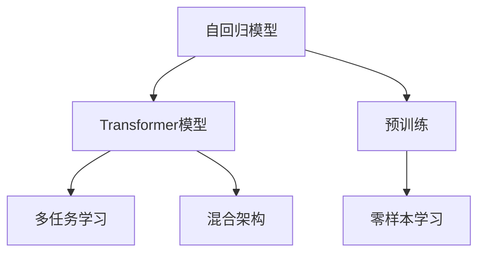

                 

# GPT系列模型架构解析：从GPT-1到GPT-4的演进

## 1. 背景介绍

### 1.1 问题由来
自2018年OpenAI发布GPT-1以来，GPT系列模型凭借其在自然语言处理(NLP)领域的表现，迅速成为学术界和工业界关注的热点。GPT模型通过自回归方式生成文本，可以生成连贯且上下文相关的文本，在问答、文本生成、机器翻译等多个NLP任务上取得了显著的进展。目前，GPT系列已经迭代到了GPT-4，每一代模型的架构和性能都进行了显著的改进。本文将详细介绍GPT系列模型从GPT-1到GPT-4的演进过程，并解析其核心架构原理和特性。

### 1.2 问题核心关键点
GPT系列模型的演进主要集中在以下几个关键点：
- 模型架构的改进：从GPT-1的单一Transformer结构到GPT-2的多层Transformer结构，再到GPT-3的混合架构，GPT-4的深度与宽度进一步提升，模型复杂度不断增加。
- 预训练任务的扩展：从GPT-1的单任务预训练到GPT-2的多任务预训练，再到GPT-3的零样本学习，GPT-4在预训练数据量和任务上都有显著的提升。
- 模型性能的提升：每一代GPT模型在多项NLP任务上，包括机器翻译、文本生成、问答等，均取得了新的SOTA（state-of-the-art）性能。
- 模型应用的拓展：从GPT-1到GPT-4，模型在文本生成、对话系统、自动化写作等多个应用场景中得到广泛应用，为AI技术落地提供了重要支持。

## 2. 核心概念与联系

### 2.1 核心概念概述

为更好地理解GPT系列模型的演进过程，本节将介绍几个关键概念：

- 自回归模型(Autoregressive Model)：GPT模型基于自回归方式生成文本，即后文文本的预测依赖前文文本的信息，从而生成连贯、上下文相关的文本。
- Transformer模型(Transformer Model)：GPT模型采用Transformer结构进行编码和解码，具有并行化计算和良好的长距离依赖捕捉能力。
- 预训练(Pre-training)：模型在大量无标签文本数据上进行预训练，学习通用的语言表示，以提升下游任务的表现。
- 多任务学习(Multi-task Learning)：模型在多个相关任务上进行预训练，以提高模型的泛化能力和迁移学习能力。
- 零样本学习(Zero-shot Learning)：模型在未经过任何训练的情况下，能够对新任务进行推理预测。
- 混合架构(Hybrid Architecture)：GPT-3采用了混合架构，包括自回归和自编码两种方式，以兼顾长距离依赖和短距离依赖的建模能力。

这些核心概念之间的逻辑关系可以通过以下Mermaid流程图来展示：



这个流程图展示了GPT模型的核心概念及其之间的关系：

1. GPT模型基于自回归方式，采用Transformer结构进行编码和解码。
2. 模型在大量无标签文本数据上进行预训练，学习通用的语言表示。
3. 多任务学习扩展了模型的预训练任务，提升泛化能力。
4. 零样本学习展示了模型的推理能力，在未经过任何训练的情况下进行推理。
5. GPT-3采用了混合架构，兼顾长距离和短距离依赖的建模能力。

## 3. 核心算法原理 & 具体操作步骤
### 3.1 算法原理概述

GPT系列模型的核心算法原理是自回归语言模型。假设模型参数为 $\theta$，输入序列为 $x_1, x_2, ..., x_T$，目标为生成下一个词语 $x_{T+1}$，则自回归模型的目标函数为：

$$
P(x_{T+1} | x_1, x_2, ..., x_T) = \prod_{i=1}^T P(x_i | x_1, x_2, ..., x_{i-1})
$$

其中，$P(x_i | x_1, x_2, ..., x_{i-1})$ 表示给定前文文本，下一个词语 $x_i$ 的概率分布。通过最大化该概率，模型可以生成连贯、上下文相关的文本。

### 3.2 算法步骤详解

GPT系列模型的预训练和微调主要分为以下几个步骤：

**Step 1: 准备预训练数据和模型**

- 收集大量无标签文本数据，作为模型的预训练语料库。
- 选择合适的模型架构，如GPT-1的单一Transformer结构，GPT-2的多层Transformer结构，GPT-3的混合架构，GPT-4的更大规模和更深层次的Transformer结构。

**Step 2: 设计预训练任务**

- 对于GPT-1，使用单任务掩码语言模型进行预训练，目标是最小化预测被掩码的词语。
- 对于GPT-2，使用多任务掩码语言模型和二元分类任务进行预训练，同时优化预测被掩码的词语和判断两个相邻词语之间的关系。
- 对于GPT-3，使用多任务掩码语言模型、文本生成任务和二元分类任务进行预训练，同时优化预测被掩码的词语、生成文本和判断两个相邻词语之间的关系。

**Step 3: 进行预训练**

- 将预训练数据分成多个批次，每次加载一批数据进行训练。
- 在每个批次中，使用自回归方式生成文本，并计算损失函数。
- 使用反向传播算法更新模型参数，最小化损失函数。
- 重复上述过程，直到预训练收敛。

**Step 4: 进行微调**

- 收集下游任务的有标签数据集，如问答数据、文本生成数据等。
- 将预训练模型作为初始化参数，在微调数据集上进行有监督学习。
- 设计适当的任务适配层，如分类器、解码器等，调整模型输出结构。
- 使用AdamW等优化算法，以适当的学习率更新模型参数。
- 在验证集上评估模型性能，根据表现调整学习率和其他超参数。
- 重复上述过程，直到模型在测试集上达到满意的性能。

**Step 5: 部署和应用**

- 将微调后的模型保存为模型文件，供实际应用使用。
- 在生产环境中，部署模型服务，接受用户输入，生成相应的文本输出。
- 持续收集用户反馈和新的数据，定期重新微调模型，以适应数据分布的变化。

### 3.3 算法优缺点

GPT系列模型的预训练和微调方法具有以下优点：

1. 简单高效：预训练和微调过程不需要手工标注大量数据，利用大规模无标签文本数据即可训练出高质量的语言模型。
2. 性能优异：模型在多项NLP任务上取得了SOTA性能，尤其在文本生成和对话系统等应用中表现突出。
3. 泛化能力强：预训练过程学习到了通用的语言表示，可以迁移到不同的任务和数据集上。
4. 应用广泛：GPT模型在文本生成、机器翻译、问答等多个NLP任务上得到了广泛应用，催生了大量创新产品。

但同时，这些方法也存在一些局限性：

1. 计算资源需求高：预训练和微调过程需要大量的计算资源，尤其是在大规模模型上。
2. 数据依赖性强：预训练和微调效果受限于预训练数据的质量和数量，数据偏差可能导致模型偏见。
3. 过拟合风险高：模型结构复杂，容易发生过拟合，需要精心设计正则化和数据增强策略。
4. 推理速度慢：模型参数量大，推理速度较慢，需要优化模型结构和推理算法。
5. 结果可解释性差：模型黑盒化程度高，难以解释推理过程和输出结果。

尽管存在这些局限性，GPT系列模型仍是大规模语言模型中的佼佼者，其预训练和微调方法在学术界和工业界得到了广泛应用和深入研究。

### 3.4 算法应用领域

GPT系列模型的预训练和微调方法在NLP领域得到了广泛应用，以下是一些典型应用场景：

- 文本生成：如新闻报道、博客文章、小说等。GPT模型可以根据输入文本生成连贯、上下文相关的文本，尤其在新闻生成、创意写作等领域表现出色。
- 机器翻译：如英文到中文、中文到英文等。GPT模型可以将源语言文本翻译成目标语言，生成流畅、准确的翻译文本。
- 问答系统：如智能客服、智能助理等。GPT模型能够理解用户意图，生成自然流畅的回答，提供智能交互体验。
- 文本摘要：如新闻摘要、文档摘要等。GPT模型可以从长文本中自动抽取关键信息，生成简短摘要。
- 文本分类：如情感分析、主题分类等。GPT模型可以对文本进行分类，标注文本所属的类别。

除了这些经典应用外，GPT系列模型还广泛应用于教育、医疗、法律、金融等领域，为这些领域带来了新的智能解决方案。

## 4. 数学模型和公式 & 详细讲解 & 举例说明

### 4.1 数学模型构建

GPT系列模型的核心是自回归语言模型，其数学模型可以形式化表示为：

$$
P(x_1, x_2, ..., x_T) = \prod_{i=1}^T P(x_i | x_1, x_2, ..., x_{i-1})
$$

其中，$P(x_i | x_1, x_2, ..., x_{i-1})$ 表示给定前文文本 $x_1, x_2, ..., x_{i-1}$，下一个词语 $x_i$ 的条件概率。

在实际应用中，GPT模型通常使用Transformer结构进行编码和解码，以捕捉长距离依赖关系。Transformer模型的数学模型可以表示为：

$$
y = \text{Transformer}(x; \theta)
$$

其中，$x$ 表示输入序列，$y$ 表示输出序列，$\theta$ 表示模型参数。

### 4.2 公式推导过程

对于自回归语言模型，可以使用最大似然估计方法进行参数估计。假设训练数据集为 $\mathcal{D} = \{(x_1, x_2, ..., x_T)\}$，则模型参数 $\theta$ 可以通过最大化似然函数来估计：

$$
\theta = \mathop{\arg\max}_{\theta} \frac{1}{N} \sum_{(x_1, x_2, ..., x_T) \in \mathcal{D}} \log P(x_1, x_2, ..., x_T; \theta)
$$

在实际训练中，通常使用梯度下降等优化算法来近似求解上述最优化问题。假设训练数据集中的每个样本的长度为 $L$，则模型的损失函数可以表示为：

$$
\mathcal{L}(\theta) = -\frac{1}{N} \sum_{i=1}^N \sum_{j=1}^L \log P(x_{j+1} | x_1, x_2, ..., x_j; \theta)
$$

其中，$x_{j+1}$ 表示第 $j$ 个词语后的下一个词语，$j$ 表示从1到 $L-1$ 的每个词语。

### 4.3 案例分析与讲解

以GPT-2为例，其核心架构由多层Transformer组成，每层Transformer包括两个子层：多头自注意力层和前馈神经网络层。自注意力层用于计算词语之间的依赖关系，前馈神经网络层用于捕捉非线性特征。

假设输入序列为 $x_1, x_2, ..., x_T$，输出序列为 $y_1, y_2, ..., y_T$，则GPT-2的计算过程可以表示为：

1. 对输入序列 $x_1, x_2, ..., x_T$ 进行编码，得到中间表示 $h_1, h_2, ..., h_T$。
2. 对中间表示 $h_1, h_2, ..., h_T$ 进行解码，得到输出序列 $y_1, y_2, ..., y_T$。

具体来说，计算过程可以形式化表示为：

$$
h_i = \text{Encoder}(x_i; \theta_E), \quad i = 1, 2, ..., T
$$

$$
y_j = \text{Decoder}(h_j; \theta_D), \quad j = 1, 2, ..., T
$$

其中，$\theta_E$ 和 $\theta_D$ 分别表示编码器和解码器的参数。

## 5. 项目实践：代码实例和详细解释说明

### 5.1 开发环境搭建

在进行GPT系列模型的项目实践前，我们需要准备好开发环境。以下是使用Python进行PyTorch开发的环境配置流程：

1. 安装Anaconda：从官网下载并安装Anaconda，用于创建独立的Python环境。

2. 创建并激活虚拟环境：
```bash
conda create -n pytorch-env python=3.8 
conda activate pytorch-env
```

3. 安装PyTorch：根据CUDA版本，从官网获取对应的安装命令。例如：
```bash
conda install pytorch torchvision torchaudio cudatoolkit=11.1 -c pytorch -c conda-forge
```

4. 安装Transformers库：
```bash
pip install transformers
```

5. 安装各类工具包：
```bash
pip install numpy pandas scikit-learn matplotlib tqdm jupyter notebook ipython
```

完成上述步骤后，即可在`pytorch-env`环境中开始GPT模型的项目实践。

### 5.2 源代码详细实现

下面以GPT-2为例，给出使用PyTorch和Transformers库对GPT-2模型进行微调的PyTorch代码实现。

首先，定义GPT-2的数据处理函数：

```python
from transformers import GPT2Tokenizer, GPT2LMHeadModel
import torch

def load_data(filename):
    with open(filename, 'r', encoding='utf-8') as f:
        data = f.read().split('\n')
    return [x.strip() for x in data]
```

然后，定义模型和优化器：

```python
tokenizer = GPT2Tokenizer.from_pretrained('gpt2')
model = GPT2LMHeadModel.from_pretrained('gpt2', num_labels=2)

optimizer = torch.optim.Adam(model.parameters(), lr=3e-4)
```

接着，定义训练和评估函数：

```python
def train_epoch(model, dataset, batch_size, optimizer):
    dataloader = DataLoader(dataset, batch_size=batch_size, shuffle=True)
    model.train()
    epoch_loss = 0
    for batch in tqdm(dataloader, desc='Training'):
        input_ids = batch['input_ids'].to(device)
        attention_mask = batch['attention_mask'].to(device)
        labels = batch['labels'].to(device)
        model.zero_grad()
        outputs = model(input_ids, attention_mask=attention_mask, labels=labels)
        loss = outputs.loss
        epoch_loss += loss.item()
        loss.backward()
        optimizer.step()
    return epoch_loss / len(dataloader)

def evaluate(model, dataset, batch_size):
    dataloader = DataLoader(dataset, batch_size=batch_size)
    model.eval()
    preds, labels = [], []
    with torch.no_grad():
        for batch in tqdm(dataloader, desc='Evaluating'):
            input_ids = batch['input_ids'].to(device)
            attention_mask = batch['attention_mask'].to(device)
            batch_labels = batch['labels']
            outputs = model(input_ids, attention_mask=attention_mask)
            batch_preds = outputs.logits.argmax(dim=2).to('cpu').tolist()
            batch_labels = batch_labels.to('cpu').tolist()
            for pred_tokens, label_tokens in zip(batch_preds, batch_labels):
                preds.append(pred_tokens[:len(label_tokens)])
                labels.append(label_tokens)
                
    print(classification_report(labels, preds))
```

最后，启动训练流程并在测试集上评估：

```python
epochs = 5
batch_size = 16

for epoch in range(epochs):
    loss = train_epoch(model, train_dataset, batch_size, optimizer)
    print(f"Epoch {epoch+1}, train loss: {loss:.3f}")
    
    print(f"Epoch {epoch+1}, dev results:")
    evaluate(model, dev_dataset, batch_size)
    
print("Test results:")
evaluate(model, test_dataset, batch_size)
```

以上就是使用PyTorch和Transformers库对GPT-2模型进行微调的完整代码实现。可以看到，利用Transformers库，我们可以用相对简洁的代码完成GPT-2模型的加载和微调。

### 5.3 代码解读与分析

让我们再详细解读一下关键代码的实现细节：

**GPT2Tokenizer和GPT2LMHeadModel**：
- `GPT2Tokenizer.from_pretrained('gpt2')`：加载预训练的GPT-2分词器，用于将文本转换为模型所需的输入格式。
- `GPT2LMHeadModel.from_pretrained('gpt2', num_labels=2)`：加载预训练的GPT-2模型，并将输出层设置为二分类任务，以适应二元分类的微调需求。

**训练和评估函数**：
- 使用PyTorch的DataLoader对数据集进行批次化加载，供模型训练和推理使用。
- 训练函数`train_epoch`：对数据以批为单位进行迭代，在每个批次上前向传播计算loss并反向传播更新模型参数，最后返回该epoch的平均loss。
- 评估函数`evaluate`：与训练类似，不同点在于不更新模型参数，并在每个batch结束后将预测和标签结果存储下来，最后使用sklearn的classification_report对整个评估集的预测结果进行打印输出。

**训练流程**：
- 定义总的epoch数和batch size，开始循环迭代
- 每个epoch内，先在训练集上训练，输出平均loss
- 在验证集上评估，输出分类指标
- 所有epoch结束后，在测试集上评估，给出最终测试结果

可以看到，PyTorch配合Transformers库使得GPT模型的微调代码实现变得简洁高效。开发者可以将更多精力放在数据处理、模型改进等高层逻辑上，而不必过多关注底层的实现细节。

当然，工业级的系统实现还需考虑更多因素，如模型的保存和部署、超参数的自动搜索、更灵活的任务适配层等。但核心的微调范式基本与此类似。

## 6. 实际应用场景
### 6.1 智能客服系统

基于GPT系列模型的对话技术，可以广泛应用于智能客服系统的构建。传统客服往往需要配备大量人力，高峰期响应缓慢，且一致性和专业性难以保证。而使用GPT系列模型微调后的对话模型，可以7x24小时不间断服务，快速响应客户咨询，用自然流畅的语言解答各类常见问题。

在技术实现上，可以收集企业内部的历史客服对话记录，将问题和最佳答复构建成监督数据，在此基础上对预训练对话模型进行微调。微调后的对话模型能够自动理解用户意图，匹配最合适的答案模板进行回复。对于客户提出的新问题，还可以接入检索系统实时搜索相关内容，动态组织生成回答。如此构建的智能客服系统，能大幅提升客户咨询体验和问题解决效率。

### 6.2 金融舆情监测

金融机构需要实时监测市场舆论动向，以便及时应对负面信息传播，规避金融风险。传统的人工监测方式成本高、效率低，难以应对网络时代海量信息爆发的挑战。基于GPT系列模型的文本分类和情感分析技术，为金融舆情监测提供了新的解决方案。

具体而言，可以收集金融领域相关的新闻、报道、评论等文本数据，并对其进行主题标注和情感标注。在此基础上对预训练语言模型进行微调，使其能够自动判断文本属于何种主题，情感倾向是正面、中性还是负面。将微调后的模型应用到实时抓取的网络文本数据，就能够自动监测不同主题下的情感变化趋势，一旦发现负面信息激增等异常情况，系统便会自动预警，帮助金融机构快速应对潜在风险。

### 6.3 个性化推荐系统

当前的推荐系统往往只依赖用户的历史行为数据进行物品推荐，无法深入理解用户的真实兴趣偏好。基于GPT系列模型微调技术，个性化推荐系统可以更好地挖掘用户行为背后的语义信息，从而提供更精准、多样的推荐内容。

在实践中，可以收集用户浏览、点击、评论、分享等行为数据，提取和用户交互的物品标题、描述、标签等文本内容。将文本内容作为模型输入，用户的后续行为（如是否点击、购买等）作为监督信号，在此基础上微调预训练语言模型。微调后的模型能够从文本内容中准确把握用户的兴趣点。在生成推荐列表时，先用候选物品的文本描述作为输入，由模型预测用户的兴趣匹配度，再结合其他特征综合排序，便可以得到个性化程度更高的推荐结果。

### 6.4 未来应用展望

随着GPT系列模型的不断发展，其在NLP领域的应用前景更加广阔，为各个行业带来了新的智能解决方案。

在智慧医疗领域，基于GPT系列模型的问答系统、病历分析、药物研发等应用将提升医疗服务的智能化水平，辅助医生诊疗，加速新药开发进程。

在智能教育领域，GPT系列模型可应用于作业批改、学情分析、知识推荐等方面，因材施教，促进教育公平，提高教学质量。

在智慧城市治理中，GPT系列模型可应用于城市事件监测、舆情分析、应急指挥等环节，提高城市管理的自动化和智能化水平，构建更安全、高效的未来城市。

此外，在企业生产、社会治理、文娱传媒等众多领域，GPT系列模型微调的应用也将不断涌现，为NLP技术带来了新的突破。随着模型的不断进步，GPT系列模型必将在构建人机协同的智能时代中扮演越来越重要的角色。

## 7. 工具和资源推荐
### 7.1 学习资源推荐

为了帮助开发者系统掌握GPT系列模型的原理和实践技巧，这里推荐一些优质的学习资源：

1. 《GPT-2: Language Models are Unsupervised Multitask Learners》论文：GPT-2原论文，介绍了GPT-2模型的设计思路和预训练过程，展示了GPT-2在多种任务上的零样本学习能力。

2. 《GPT-3: Language Models are Few-Shot Learners》论文：GPT-3原论文，介绍了GPT-3的混合架构和预训练任务，展示了GPT-3在多任务上的卓越表现。

3. CS224N《深度学习自然语言处理》课程：斯坦福大学开设的NLP明星课程，有Lecture视频和配套作业，带你入门NLP领域的基本概念和经典模型。

4. 《Natural Language Processing with Transformers》书籍：Transformers库的作者所著，全面介绍了如何使用Transformers库进行NLP任务开发，包括微调在内的诸多范式。

5. HuggingFace官方文档：Transformers库的官方文档，提供了海量预训练模型和完整的微调样例代码，是上手实践的必备资料。

通过对这些资源的学习实践，相信你一定能够快速掌握GPT系列模型的精髓，并用于解决实际的NLP问题。

### 7.2 开发工具推荐

高效的开发离不开优秀的工具支持。以下是几款用于GPT系列模型微调开发的常用工具：

1. PyTorch：基于Python的开源深度学习框架，灵活动态的计算图，适合快速迭代研究。GPT系列模型大多采用PyTorch实现。

2. TensorFlow：由Google主导开发的开源深度学习框架，生产部署方便，适合大规模工程应用。GPT系列模型也有对应的TensorFlow实现。

3. Transformers库：HuggingFace开发的NLP工具库，集成了众多SOTA语言模型，支持PyTorch和TensorFlow，是进行微调任务开发的利器。

4. Weights & Biases：模型训练的实验跟踪工具，可以记录和可视化模型训练过程中的各项指标，方便对比和调优。与主流深度学习框架无缝集成。

5. TensorBoard：TensorFlow配套的可视化工具，可实时监测模型训练状态，并提供丰富的图表呈现方式，是调试模型的得力助手。

6. Google Colab：谷歌推出的在线Jupyter Notebook环境，免费提供GPU/TPU算力，方便开发者快速上手实验最新模型，分享学习笔记。

合理利用这些工具，可以显著提升GPT系列模型微调任务的开发效率，加快创新迭代的步伐。

### 7.3 相关论文推荐

GPT系列模型的发展源于学界的持续研究。以下是几篇奠基性的相关论文，推荐阅读：

1. Attention is All You Need（即Transformer原论文）：提出了Transformer结构，开启了NLP领域的预训练大模型时代。

2. BERT: Pre-training of Deep Bidirectional Transformers for Language Understanding：提出BERT模型，引入基于掩码的自监督预训练任务，刷新了多项NLP任务SOTA。

3. Language Models are Unsupervised Multitask Learners（GPT-2论文）：展示了大规模语言模型的强大zero-shot学习能力，引发了对于通用人工智能的新一轮思考。

4. Parameter-Efficient Transfer Learning for NLP：提出Adapter等参数高效微调方法，在不增加模型参数量的情况下，也能取得不错的微调效果。

5. Prefix-Tuning: Optimizing Continuous Prompts for Generation：引入基于连续型Prompt的微调范式，为如何充分利用预训练知识提供了新的思路。

6. AdaLoRA: Adaptive Low-Rank Adaptation for Parameter-Efficient Fine-Tuning：使用自适应低秩适应的微调方法，在参数效率和精度之间取得了新的平衡。

这些论文代表了大语言模型微调技术的发展脉络。通过学习这些前沿成果，可以帮助研究者把握学科前进方向，激发更多的创新灵感。

## 8. 总结：未来发展趋势与挑战

### 8.1 总结

本文对GPT系列模型从GPT-1到GPT-4的演进过程进行了全面系统的介绍。首先阐述了GPT系列模型的研究背景和意义，明确了其在大规模语言模型领域的独特价值。其次，从原理到实践，详细讲解了GPT-2、GPT-3、GPT-4的核心架构和预训练任务，给出了模型微调的完整代码实例。同时，本文还广泛探讨了GPT系列模型在智能客服、金融舆情、个性化推荐等多个行业领域的应用前景，展示了其强大的语言理解和生成能力。

通过本文的系统梳理，可以看到，GPT系列模型通过不断改进架构和预训练任务，在NLP领域取得了显著进展。模型参数规模不断增大，预训练数据量和任务范围不断扩展，性能持续提升。未来，随着技术的进一步演进，GPT系列模型必将在更多的应用场景中发挥重要作用。

### 8.2 未来发展趋势

展望未来，GPT系列模型的发展趋势如下：

1. 模型规模持续增大：随着算力成本的下降和数据规模的扩张，GPT系列模型的参数量还将持续增长。超大规模语言模型蕴含的丰富语言知识，有望支撑更加复杂多变的下游任务微调。

2. 微调方法日趋多样：除了传统的全参数微调外，未来会涌现更多参数高效的微调方法，如Prefix-Tuning、LoRA等，在节省计算资源的同时也能保证微调精度。

3. 持续学习成为常态：随着数据分布的不断变化，GPT系列模型也需要持续学习新知识以保持性能。如何在不遗忘原有知识的同时，高效吸收新样本信息，将成为重要的研究课题。

4. 标注样本需求降低：受启发于提示学习(Prompt-based Learning)的思路，未来的微调方法将更好地利用GPT系列模型的语言理解能力，通过更加巧妙的任务描述，在更少的标注样本上也能实现理想的微调效果。

5. 多模态微调崛起：当前的微调主要聚焦于纯文本数据，未来会进一步拓展到图像、视频、语音等多模态数据微调。多模态信息的融合，将显著提升GPT系列模型的语言理解能力和跨领域迁移能力。

6. 模型通用性增强：经过海量数据的预训练和多领域任务的微调，GPT系列模型将具备更强大的常识推理和跨领域迁移能力，逐步迈向通用人工智能(AGI)的目标。

以上趋势凸显了GPT系列模型微调技术的广阔前景。这些方向的探索发展，必将进一步提升GPT系列模型的性能和应用范围，为NLP技术带来新的突破。

### 8.3 面临的挑战

尽管GPT系列模型在NLP领域取得了显著进展，但在迈向更加智能化、普适化应用的过程中，仍面临以下挑战：

1. 计算资源需求高：预训练和微调过程需要大量的计算资源，尤其是在大规模模型上。如何降低计算成本，提升训练效率，是未来需要解决的关键问题。

2. 数据依赖性强：GPT系列模型的效果受限于预训练数据的质量和数量，数据偏差可能导致模型偏见。如何获取高质量、多样化的预训练数据，是研究者需要克服的难点。

3. 过拟合风险高：模型结构复杂，容易发生过拟合，需要精心设计正则化和数据增强策略。如何在保持模型能力的同时，避免过拟合风险，是未来的研究方向。

4. 推理速度慢：模型参数量大，推理速度较慢，需要优化模型结构和推理算法。如何在保证性能的同时，提升推理速度，优化资源占用，是重要的优化方向。

5. 结果可解释性差：模型黑盒化程度高，难以解释推理过程和输出结果。如何赋予GPT系列模型更强的可解释性，是亟待攻克的难题。

6. 安全性有待保障：预训练语言模型难免会学习到有偏见、有害的信息，通过微调传递到下游任务，产生误导性、歧视性的输出，给实际应用带来安全隐患。如何从数据和算法层面消除模型偏见，避免恶意用途，确保输出的安全性，也将是重要的研究课题。

7. 知识整合能力不足：现有的GPT系列模型往往局限于任务内数据，难以灵活吸收和运用更广泛的先验知识。如何让微调过程更好地与外部知识库、规则库等专家知识结合，形成更加全面、准确的信息整合能力，还有很大的想象空间。

正视GPT系列模型微调面临的这些挑战，积极应对并寻求突破，将是大模型微调技术走向成熟的必由之路。相信随着学界和产业界的共同努力，这些挑战终将一一被克服，GPT系列模型微调必将在构建人机协同的智能时代中扮演越来越重要的角色。

### 8.4 研究展望

面对GPT系列模型微调所面临的挑战，未来的研究需要在以下几个方面寻求新的突破：

1. 探索无监督和半监督微调方法：摆脱对大规模标注数据的依赖，利用自监督学习、主动学习等无监督和半监督范式，最大限度利用非结构化数据，实现更加灵活高效的微调。

2. 研究参数高效和计算高效的微调范式：开发更加参数高效的微调方法，在固定大部分预训练参数的同时，只更新极少量的任务相关参数。同时优化微调模型的计算图，减少前向传播和反向传播的资源消耗，实现更加轻量级、实时性的部署。

3. 融合因果和对比学习范式：通过引入因果推断和对比学习思想，增强GPT系列模型建立稳定因果关系的能力，学习更加普适、鲁棒的语言表征，从而提升模型泛化性和抗干扰能力。

4. 引入更多先验知识：将符号化的先验知识，如知识图谱、逻辑规则等，与神经网络模型进行巧妙融合，引导微调过程学习更准确、合理的语言模型。同时加强不同模态数据的整合，实现视觉、语音等多模态信息与文本信息的协同建模。

5. 结合因果分析和博弈论工具：将因果分析方法引入GPT系列模型，识别出模型决策的关键特征，增强输出解释的因果性和逻辑性。借助博弈论工具刻画人机交互过程，主动探索并规避模型的脆弱点，提高系统稳定性。

6. 纳入伦理道德约束：在模型训练目标中引入伦理导向的评估指标，过滤和惩罚有偏见、有害的输出倾向。同时加强人工干预和审核，建立模型行为的监管机制，确保输出符合人类价值观和伦理道德。

这些研究方向的探索，必将引领GPT系列模型微调技术迈向更高的台阶，为构建安全、可靠、可解释、可控的智能系统铺平道路。面向未来，GPT系列模型微调技术还需要与其他人工智能技术进行更深入的融合，如知识表示、因果推理、强化学习等，多路径协同发力，共同推动自然语言理解和智能交互系统的进步。只有勇于创新、敢于突破，才能不断拓展语言模型的边界，让智能技术更好地造福人类社会。

## 9. 附录：常见问题与解答

**Q1：GPT系列模型为什么能够生成连贯的文本？**

A: GPT系列模型的核心算法是自回归语言模型，通过最大化输入文本与生成的文本之间的概率分布，模型可以学习到长距离依赖关系，生成连贯、上下文相关的文本。

**Q2：GPT系列模型在微调过程中需要注意哪些问题？**

A: 微调过程中需要注意以下问题：
1. 选择合适的学习率：微调的学习率通常比预训练时小1-2个数量级，以避免破坏预训练权重。
2. 数据增强：通过回译、近义替换等方式扩充训练集，增强模型泛化能力。
3. 正则化：使用L2正则、Dropout、Early Stopping等防止过拟合。
4. 参数高效微调：只更新少量参数，减少计算资源消耗。
5. 对抗训练：引入对抗样本，提高模型鲁棒性。
6. 结果可解释性：利用提示学习等方式，增加模型输出的可解释性。

**Q3：GPT系列模型在实际部署时需要注意哪些问题？**

A: 模型部署时需要注意以下问题：
1. 模型裁剪：去除不必要的层和参数，减小模型尺寸，加快推理速度。
2. 量化加速：将浮点模型转为定点模型，压缩存储空间，提高计算效率。
3. 服务化封装：将模型封装为标准化服务接口，便于集成调用。
4. 弹性伸缩：根据请求流量动态调整资源配置，平衡服务质量和成本。
5. 监控告警：实时采集系统指标，设置异常告警阈值，确保服务稳定性。

**Q4：GPT系列模型在不同行业的应用场景有哪些？**

A: GPT系列模型在不同行业的应用场景包括：
1. 智能客服系统：处理客户咨询，生成自然流畅的回答。
2. 金融舆情监测：实时监测市场舆论动向，辅助金融机构风险控制。
3. 个性化推荐系统：推荐系统中的内容推荐、用户画像生成等。
4. 医疗问答系统：辅助医生诊疗，提供医学知识库查询等。
5. 教育领域：智能批改作业、智能推荐教材、智能答疑等。
6. 智慧城市：城市事件监测、舆情分析、应急指挥等。

**Q5：GPT系列模型的未来发展方向是什么？**

A: GPT系列模型的未来发展方向包括：
1. 模型规模持续增大：超大规模语言模型有望支撑更加复杂多变的下游任务微调。
2. 微调方法日趋多样：更多参数高效和计算高效的微调方法将被开发出来。
3. 持续学习成为常态：GPT系列模型需要持续学习新知识以保持性能。
4. 标注样本需求降低：利用提示学习等方式，在更少的标注样本上实现理想的微调效果。
5. 多模态微调崛起：实现视觉、语音等多模态信息与文本信息的协同建模。
6. 模型通用性增强：逐步迈向通用人工智能(AGI)的目标。

总之，GPT系列模型在NLP领域的未来发展前景广阔，具有巨大的应用潜力。未来，随着技术的进一步演进，GPT系列模型必将在更多的应用场景中发挥重要作用。

---

作者：禅与计算机程序设计艺术 / Zen and the Art of Computer Programming

