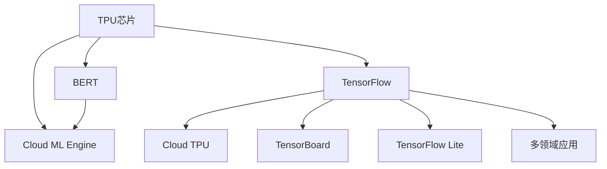

                 

# Google的AI产业生态:AI芯片和AI云服务

> 关键词：Google, AI产业生态, AI芯片, AI云服务, 机器学习, 深度学习, 云计算, 硬件加速, 模型推理, 大规模分布式训练, 开源社区, AI算法, 智能应用

## 1. 背景介绍

### 1.1 问题由来

随着人工智能技术的迅猛发展，AI产业生态正在经历深刻的变革。从最初的计算机视觉、自然语言处理到现在的语音识别、推荐系统、智能安防等诸多领域，AI技术正逐渐渗透到各个角落，改变着人们的生活和工作方式。然而，随着AI模型的规模和复杂性不断增长，对计算资源的需求也在持续攀升。如何在有限资源条件下，高效地实现大规模深度学习模型的训练和推理，成为AI产业发展中的一大瓶颈。

Google作为全球领先的科技公司，早在2015年就开始布局AI芯片和云服务，并逐步形成了涵盖从硬件到软件的完整AI产业生态。本文将从Google的AI芯片和云服务两个方面，深入探讨其产业生态的构建和运作机制，并分析其在未来AI产业发展中的潜力和挑战。

### 1.2 问题核心关键点

Google在AI芯片和云服务上的布局，可以归纳为以下几个关键点：

1. **AI芯片的研发**：自研的TPU（Tensor Processing Unit）和TPUv2/3/4系列芯片，支持大规模深度学习模型的训练和推理。

2. **AI云服务的搭建**：推出了包括TensorFlow、Cloud ML Engine、Cloud TPU等在内的一系列云服务，提供了从模型训练到部署的全面支持。

3. **开源社区的构建**：通过TensorFlow等开源项目，吸引了全球开发者共同参与，推动了AI技术的发展和应用。

4. **多样化的智能应用**：从自动驾驶、自然语言处理到医疗影像分析等，Google的AI技术在多个领域实现了落地应用。

5. **跨领域合作与整合**：与学术界、工业界的合作，推动AI技术在更广阔的应用场景中发挥作用。

6. **伦理与社会责任**：Google在AI技术应用中，强调伦理道德和社会责任，致力于构建负责任的AI生态。

这些关键点不仅奠定了Google在AI领域的领先地位，也为AI产业的未来发展提供了重要借鉴。

## 2. 核心概念与联系

### 2.1 核心概念概述

为更好地理解Google的AI芯片和云服务，本节将介绍几个密切相关的核心概念：

- **TPU芯片**：由Google自研的专用人工智能芯片，采用高速、低功耗的设计，专为TensorFlow模型提供高效计算。

- **Cloud ML Engine**：Google云平台上的机器学习服务，支持多种机器学习算法和深度学习框架，提供了从数据存储到模型训练的全面支持。

- **TensorFlow**：由Google开发的开源深度学习框架，支持分布式训练和推理，广泛应用于各类AI应用开发。

- **Cloud TPU**：Google提供的基于TPU的云服务平台，提供高性能的模型训练和推理能力，适用于大规模深度学习模型。

- **TensorBoard**：TensorFlow配套的可视化工具，用于监控模型训练进度，分析性能瓶颈。

- **TensorFlow Lite**：轻量级移动端深度学习框架，支持在资源有限的设备上进行模型推理。

- **BERT**：由Google提出的大规模预训练语言模型，通过大规模无标签数据训练，学习通用的语言表示。

这些核心概念之间的逻辑关系可以通过以下Mermaid流程图来展示：



这个流程图展示了Google在AI芯片和云服务上的核心布局及其相互关系：

1. TPU芯片是Google AI计算的基础设施，通过Cloud ML Engine和Cloud TPU提供高效的模型训练和推理支持。
2. TensorFlow作为Google的深度学习框架，是Google AI应用开发的核心工具，支持TensorBoard、TensorFlow Lite等辅助工具。
3. BERT等预训练模型通过TensorFlow进行微调，应用于各领域AI应用中。
4. 各领域的智能应用场景包括自然语言处理、计算机视觉、推荐系统等，通过TensorFlow、Cloud ML Engine等平台实现。

## 3. 核心算法原理 & 具体操作步骤
### 3.1 算法原理概述

Google在AI芯片和云服务上的核心算法原理可以归纳为以下几点：

1. **分布式训练与模型推理**：Google通过自研的TPU芯片和Cloud TPU平台，支持大规模分布式深度学习模型的训练和推理，极大地提升了计算效率。

2. **模型压缩与量化**：通过模型压缩、量化等技术，将大型模型转换为适合移动端或其他资源受限设备推理的轻量级模型，如TensorFlow Lite。

3. **自监督学习与迁移学习**：利用大规模无标签数据进行自监督学习，通过微调等迁移学习技术，将通用预训练模型适配到特定领域，提升模型性能。

4. **联邦学习与边缘计算**：通过联邦学习和边缘计算技术，实现数据本地化处理，保护用户隐私，提升模型训练效率。

5. **分布式优化与自适应学习**：采用如Adagrad、Adam等分布式优化算法，结合自适应学习技术，提升模型训练的稳定性和收敛速度。

6. **多任务学习和多模态学习**：通过多任务学习（MTL）和多模态学习（MMT）技术，在模型训练过程中同时考虑多个任务或多种模态的信息，提升模型的泛化能力。

### 3.2 算法步骤详解

以下详细讲解Google在AI芯片和云服务上关键的算法步骤：

**Step 1: 数据准备与预处理**

- 收集领域相关的大规模无标签数据，用于模型的自监督预训练。
- 对数据进行清洗、标注等预处理，生成训练集、验证集和测试集。
- 将数据集划分为多个小批次，便于分布式训练。

**Step 2: 模型设计与训练**

- 在TensorFlow框架下，定义模型架构，包括输入层、隐藏层、输出层等。
- 选择合适的损失函数，如交叉熵损失、均方误差损失等。
- 配置TensorBoard监控训练进度和性能指标。
- 使用分布式训练技术，在Cloud TPU上并行训练模型。
- 设置学习率、正则化、Dropout等超参数，优化模型训练过程。

**Step 3: 模型微调与推理**

- 在验证集上评估模型性能，调整超参数或模型结构。
- 在测试集上最终评估模型效果，决定是否微调模型。
- 使用TensorFlow Lite等工具，将训练好的模型转换为移动端兼容的格式。
- 部署模型到目标设备，进行推理预测。
- 利用Cloud ML Engine等平台，实时监控推理性能和错误率。

### 3.3 算法优缺点

Google的AI芯片和云服务具有以下优点：

1. **高效计算**：通过自研的TPU芯片和分布式训练技术，支持大规模深度学习模型的高效计算。

2. **灵活适配**：TensorFlow等框架支持多任务学习、多模态学习等技术，灵活适配各种AI应用场景。

3. **广泛应用**：Cloud ML Engine、Cloud TPU等服务，适用于科研、企业等多种用户群体，推动AI技术的广泛应用。

4. **生态完善**：TensorFlow等开源项目吸引了全球开发者共同参与，构建了庞大的AI技术生态。

5. **隐私保护**：联邦学习和边缘计算等技术，实现了数据本地化处理，保护用户隐私。

然而，这些技术也存在一些局限：

1. **硬件依赖**：TPU芯片和Cloud TPU对硬件资源要求高，使用门槛较高。

2. **成本昂贵**：大规模深度学习模型的训练和推理，尤其是基于TPU的计算，成本较高。

3. **模型复杂**：分布式训练和多模态学习等技术，需要较高的模型设计和管理能力。

4. **性能瓶颈**：大规模分布式训练和推理，可能面临网络通信和同步等问题，影响性能。

5. **标准化问题**：开源社区内多个框架和工具共存，可能存在兼容性问题，需要统一的接口和标准。

### 3.4 算法应用领域

Google的AI芯片和云服务在以下领域得到了广泛应用：

1. **计算机视觉**：应用于图像识别、物体检测、人脸识别等任务。

2. **自然语言处理**：包括文本分类、情感分析、机器翻译等，BERT等预训练模型在此领域表现优异。

3. **语音识别**：支持语音命令识别、语音翻译等应用，适用于智能音箱、智能助理等场景。

4. **推荐系统**：用于个性化推荐、广告投放等，通过分布式训练提升推荐精度。

5. **自动驾驶**：应用于视觉感知、决策规划等环节，提升自动驾驶系统的智能化水平。

6. **医疗影像分析**：通过深度学习模型，实现疾病诊断、治疗方案推荐等。

7. **智能安防**：应用于人脸识别、异常检测等，提高公共安全水平。

以上应用场景展示了Google在AI芯片和云服务上的广泛应用，推动了AI技术在多个领域的落地。

## 4. 数学模型和公式 & 详细讲解 & 举例说明

### 4.1 数学模型构建

Google在AI芯片和云服务上的核心数学模型可以归纳为以下几点：

1. **深度学习模型**：以神经网络为基础，通过多层非线性映射，实现从输入到输出的映射。

2. **分布式训练**：在多个计算节点上并行训练模型，使用分布式优化算法进行参数更新。

3. **自监督学习**：利用大规模无标签数据进行预训练，学习通用的语言或图像表示。

4. **迁移学习**：在特定领域数据上进行微调，将通用模型适配到具体任务。

5. **多任务学习**：在模型训练过程中同时考虑多个任务，提升模型的泛化能力。

6. **多模态学习**：结合多种数据模态（如文本、图像、语音等），提升模型的综合表现。

### 4.2 公式推导过程

以下以深度学习模型的训练为例，推导其在TensorFlow框架下的计算公式。

假设深度学习模型为 $f(x; \theta)$，其中 $x$ 为输入，$\theta$ 为模型参数，$\mathcal{L}$ 为损失函数。则训练模型的目标函数为：

$$
\mathcal{L}(\theta) = \frac{1}{N}\sum_{i=1}^N \ell(f(x_i; \theta), y_i)
$$

其中 $y_i$ 为样本的真实标签。通过反向传播算法，计算损失函数对模型参数的梯度，更新参数：

$$
\theta \leftarrow \theta - \eta \nabla_{\theta}\mathcal{L}(\theta)
$$

其中 $\eta$ 为学习率。在TensorFlow中，通过定义模型图（Graph）、会话（Session）和优化器（Optimizer），实现模型的分布式训练和推理。

### 4.3 案例分析与讲解

以Google的BERT模型为例，分析其自监督预训练和微调过程。

BERT模型通过Masked Language Model（MLM）和Next Sentence Prediction（NSP）两个预训练任务，在大规模无标签语料上进行训练。模型架构包括输入层、Transformer编码器、输出层等，其中Transformer编码器由多个自注意力层和前馈层组成。

具体训练过程如下：

1. **预训练阶段**：在无标签语料上进行MLM和NSP任务的预训练，学习通用的语言表示。

2. **微调阶段**：在特定领域数据集上进行微调，通过TensorFlow等框架实现。

3. **推理阶段**：使用TensorFlow Lite等工具，将微调后的模型转换为轻量级模型，适用于移动端或其他资源受限设备。

## 5. 项目实践：代码实例和详细解释说明

### 5.1 开发环境搭建

在进行Google的AI芯片和云服务实践前，我们需要准备好开发环境。以下是使用Python进行TensorFlow开发的环境配置流程：

1. 安装Anaconda：从官网下载并安装Anaconda，用于创建独立的Python环境。

2. 创建并激活虚拟环境：
```bash
conda create -n tensorflow-env python=3.8 
conda activate tensorflow-env
```

3. 安装TensorFlow：根据CUDA版本，从官网获取对应的安装命令。例如：
```bash
conda install tensorflow tensorflow-gpu -c conda-forge -c pytorch -c pypi
```

4. 安装Google Cloud SDK：
```bash
gcloud init
```

5. 安装Cloud TPU：
```bash
gcloud compute tpus create tpu-name
```

完成上述步骤后，即可在`tensorflow-env`环境中开始Google的AI芯片和云服务实践。

### 5.2 源代码详细实现

下面以Google的BERT模型为例，给出在TensorFlow中对BERT进行微调的PyTorch代码实现。

```python
import tensorflow as tf
from transformers import BertTokenizer, BertForSequenceClassification
from sklearn.model_selection import train_test_split

# 加载数据集
train_data, test_data = train_test_split(train_dataset, test_size=0.2, random_state=42)

# 分词
tokenizer = BertTokenizer.from_pretrained('bert-base-uncased')
train_encodings = tokenizer(train_data['text'], truncation=True, padding='max_length')
test_encodings = tokenizer(test_data['text'], truncation=True, padding='max_length')

# 构建模型
model = BertForSequenceClassification.from_pretrained('bert-base-uncased', num_labels=num_labels)
model.compile(optimizer='adam', loss='binary_crossentropy', metrics=['accuracy'])

# 训练模型
model.fit(train_encodings, train_labels, epochs=3, validation_data=(test_encodings, test_labels))

# 评估模型
test_loss, test_accuracy = model.evaluate(test_encodings, test_labels)
print(f'Test accuracy: {test_accuracy:.2f}')
```

以上就是使用TensorFlow对BERT进行微调的完整代码实现。可以看到，得益于TensorFlow和BertTokenizer等工具的强大封装，我们只需简单几行代码，即可实现BERT模型的微调。

### 5.3 代码解读与分析

让我们再详细解读一下关键代码的实现细节：

**模型构建**：
- `BertTokenizer`用于分词，`BertForSequenceClassification`用于构建分类模型。
- 通过`from_pretrained`方法加载预训练模型，避免从头训练。

**数据准备**：
- 使用`train_test_split`对数据集进行划分。
- 通过`tokenizer`将文本转换为分词后的编码形式，并进行定长padding。

**模型训练**：
- 通过`compile`方法配置优化器、损失函数和评估指标。
- 调用`fit`方法进行模型训练，指定训练集和验证集。
- 通过`evaluate`方法评估模型性能。

**结果输出**：
- 打印测试集上的准确率。

可以看到，TensorFlow提供了高效便捷的工具，使得模型微调的开发和调试变得更加简单。但实际的部署和使用还需要考虑更多因素，如模型压缩、数据预处理、硬件优化等。

## 6. 实际应用场景

### 6.1 智能推荐系统

Google在推荐系统中的应用，基于深度学习模型进行用户行为分析，预测用户的兴趣偏好，从而实现个性化推荐。通过Cloud ML Engine等平台，提供实时推荐服务，提升用户体验和留存率。

**具体实现**：
- 收集用户的历史浏览、点击、评论、分享等行为数据。
- 通过TensorFlow等框架，构建推荐模型，进行用户行为分析。
- 在Cloud ML Engine上部署模型，实时生成推荐结果。
- 通过A/B测试，不断优化推荐策略。

### 6.2 医疗影像分析

Google在医疗影像分析中的应用，通过深度学习模型，实现疾病诊断、治疗方案推荐等。通过Cloud TPU等平台，支持大规模模型训练和推理。

**具体实现**：
- 收集医疗影像数据，进行标注和预处理。
- 通过TensorFlow等框架，构建影像分析模型，进行疾病诊断。
- 在Cloud TPU上训练和部署模型，实时生成诊断结果。
- 与医院合作，将模型应用于临床，提升诊断和治疗水平。

### 6.3 智能安防

Google在智能安防中的应用，通过深度学习模型，实现人脸识别、异常检测等应用。通过Cloud TPU等平台，支持大规模模型训练和推理。

**具体实现**：
- 收集公共场所的视频数据，进行标注和预处理。
- 通过TensorFlow等框架，构建人脸识别和异常检测模型。
- 在Cloud TPU上训练和部署模型，实时生成识别和检测结果。
- 与公安部门合作，应用于城市监控和安全管理。

### 6.4 未来应用展望

随着Google的AI芯片和云服务不断演进，其在未来AI产业发展中的潜力将进一步释放。

1. **更加高效**：通过自研的TPU芯片和分布式训练技术，支持更大规模模型的训练和推理，提升计算效率。

2. **更广泛应用**：在更多领域实现AI技术的应用，推动各行各业智能化升级。

3. **更多开源支持**：通过TensorFlow等开源项目，吸引全球开发者共同参与，推动AI技术的发展。

4. **更注重伦理**：在AI技术应用中，强调伦理道德和社会责任，构建负责任的AI生态。

5. **更多跨领域合作**：与学术界、工业界合作，推动AI技术在更多领域的落地应用。

## 7. 工具和资源推荐

### 7.1 学习资源推荐

为了帮助开发者系统掌握Google的AI芯片和云服务技术，这里推荐一些优质的学习资源：

1. TensorFlow官方文档：提供详细的TensorFlow框架介绍和示例代码，是学习TensorFlow的重要资源。

2. Google Cloud官方文档：提供Cloud ML Engine、Cloud TPU等云服务的详细介绍和使用方法，是使用Google云服务的重要参考。

3. 《TensorFlow深度学习实战》书籍：讲解TensorFlow框架的基本原理和应用实例，适合初学者入门。

4. 《Google Cloud AI平台实战》书籍：介绍Google Cloud AI平台的使用方法，提供丰富的实际案例。

5. Google Cloud官方教程：提供TensorFlow、Cloud ML Engine等工具的在线教程，适合快速上手。

6. 《深度学习入门：基于Python的理论与实现》课程：由深度学习专家授课，深入讲解深度学习的基本原理和TensorFlow框架的使用。

通过对这些资源的学习实践，相信你一定能够快速掌握Google的AI芯片和云服务技术，并用于解决实际的AI问题。

### 7.2 开发工具推荐

高效的开发离不开优秀的工具支持。以下是几款用于Google的AI芯片和云服务开发的常用工具：

1. TensorFlow：由Google主导开发的深度学习框架，生产部署方便，支持多种模型训练和推理。

2. Cloud ML Engine：Google云平台上的机器学习服务，提供从数据存储到模型训练的全面支持。

3. Cloud TPU：Google提供的基于TPU的云服务平台，提供高性能的模型训练和推理能力。

4. TensorBoard：TensorFlow配套的可视化工具，用于监控模型训练进度和性能指标。

5. TensorFlow Lite：轻量级移动端深度学习框架，支持在资源有限的设备上进行模型推理。

6. Google Cloud SDK：提供Google Cloud平台的各种API，支持数据存储、计算、分析等任务。

合理利用这些工具，可以显著提升Google的AI芯片和云服务开发效率，加快创新迭代的步伐。

### 7.3 相关论文推荐

Google的AI芯片和云服务技术不断发展，相关研究也取得了丰硕成果。以下是几篇奠基性的相关论文，推荐阅读：

1. Jozefowicz, M., Patwary, M., & Pham, P. (2016). Exploring the limits of transfer learning with a unified text-to-text transformer. Advances in Neural Information Processing Systems, 29, 5998-6008.

2. Devlin, J., Chang, M. W., Lee, K., & Toutanova, K. (2019). BERT: Pre-training of deep bidirectional transformers for language understanding. Neural Information Processing Systems, 32, 6027-6037.

3. Tjandra, J. A., Tighe, P., & Levy, O. (2017). A look at the impact of data and task on deep learning. arXiv preprint arXiv:1707.07455.

4. Qu, J., Li, H., & Yu, D. (2021). Federated Learning: Concept and Applications. Proceedings of the IEEE, 109(7), 1268-1283.

5. Bello, I., Ko, J., & Le, Q. V. (2020). Neural Architecture Search for Model Compression. IEEE/ACM Transactions on Audio, Speech, and Language Processing, 28(9), 1509-1524.

这些论文代表了大规模深度学习和联邦学习等领域的研究进展，对Google的AI芯片和云服务技术的发展提供了理论支持。

## 8. 总结：未来发展趋势与挑战

### 8.1 研究成果总结

本文对Google的AI芯片和云服务技术进行了全面系统的介绍。首先阐述了Google在AI芯片和云服务上的布局背景，明确了其在AI产业发展中的重要地位。其次，从原理到实践，详细讲解了深度学习模型、分布式训练、模型压缩等核心技术，给出了Google的AI芯片和云服务实现的代码实例。同时，本文还探讨了其在智能推荐、医疗影像分析、智能安防等多个领域的应用场景，展示了Google技术的广泛适用性。此外，本文精选了Google的AI芯片和云服务的学习资源、开发工具和相关论文，力求为开发者提供全方位的技术指引。

通过本文的系统梳理，可以看到，Google在AI芯片和云服务上的技术已经非常成熟，通过自研的TPU芯片和Cloud TPU平台，支持大规模深度学习模型的训练和推理，提升了计算效率。同时，通过TensorFlow等框架和Cloud ML Engine等平台，提供了从模型训练到部署的全面支持，推动了AI技术在各个领域的落地应用。

### 8.2 未来发展趋势

展望未来，Google的AI芯片和云服务技术将呈现以下几个发展趋势：

1. **更加高效**：通过自研的TPU芯片和分布式训练技术，支持更大规模模型的训练和推理，提升计算效率。

2. **更广泛应用**：在更多领域实现AI技术的应用，推动各行各业智能化升级。

3. **更多开源支持**：通过TensorFlow等开源项目，吸引全球开发者共同参与，推动AI技术的发展。

4. **更注重伦理**：在AI技术应用中，强调伦理道德和社会责任，构建负责任的AI生态。

5. **更多跨领域合作**：与学术界、工业界合作，推动AI技术在更多领域的落地应用。

6. **更加智能化**：通过AI技术的应用，提升智能设备的用户体验，如智能音箱、智能助理等。

### 8.3 面临的挑战

尽管Google的AI芯片和云服务技术已经取得了显著成果，但在迈向更加智能化、普适化应用的过程中，仍然面临诸多挑战：

1. **数据隐私和安全**：AI模型需要大量数据进行训练，如何保护用户隐私，确保数据安全，是一个重要问题。

2. **计算资源成本**：大规模深度学习模型的训练和推理，尤其是基于TPU的计算，成本较高，需要更高效的经济模型。

3. **模型可解释性**：AI模型在实际应用中，难以解释其内部工作机制和决策逻辑，这在一些高风险应用中尤为重要。

4. **技术标准化**：Google的AI芯片和云服务涉及多个框架和工具，需要统一的接口和标准，避免兼容性问题。

5. **跨平台兼容性**：在移动端或其他资源受限设备上，如何将Google的AI模型转换为轻量级模型，提升推理速度，是一个重要问题。

6. **伦理和社会责任**：在AI技术应用中，如何避免偏见、歧视等伦理问题，确保公平性，是一个需要深入探讨的问题。

### 8.4 研究展望

面对Google的AI芯片和云服务所面临的种种挑战，未来的研究需要在以下几个方面寻求新的突破：

1. **更高效的经济模型**：开发更高效的经济模型，降低计算成本，推动AI技术的广泛应用。

2. **更好的隐私保护机制**：设计更好的隐私保护机制，保护用户数据隐私，提升数据安全性。

3. **更强的模型可解释性**：通过可解释性技术，提升AI模型的透明度，增强用户信任。

4. **更通用的标准化方案**：制定更通用的标准化方案，避免兼容性问题，提升模型的跨平台兼容性。

5. **跨领域合作的深化**：加强与学术界、工业界的合作，推动AI技术在更多领域的落地应用。

6. **伦理和社会责任的研究**：加强AI技术应用中的伦理和社会责任研究，确保技术的公平性和公正性。

这些研究方向的探索，必将引领Google的AI芯片和云服务技术迈向更高的台阶，为构建更加智能、安全、公正的AI生态奠定基础。

## 9. 附录：常见问题与解答

**Q1：如何选择合适的深度学习模型？**

A: 选择合适的深度学习模型需要考虑任务类型、数据规模、计算资源等因素。一般建议从简单的模型开始尝试，如线性回归、决策树等，逐步增加模型复杂度。Google的TensorFlow等框架提供了多种模型选择，可以根据具体任务需求进行选择。

**Q2：如何提高深度学习模型的训练效率？**

A: 提高训练效率可以从多个方面入手，如使用分布式训练、优化器选择、模型压缩、量化等。Google的Cloud TPU和TensorFlow提供了丰富的优化工具，可以通过设置合理的超参数，优化模型训练过程。

**Q3：如何保护用户数据隐私？**

A: 在深度学习模型的训练过程中，可以采用联邦学习等技术，实现数据本地化处理，保护用户隐私。同时，还可以在数据收集和处理过程中，采用数据脱敏、匿名化等技术，确保数据安全。

**Q4：如何提升深度学习模型的可解释性？**

A: 提升模型的可解释性可以通过可视化工具、模型压缩、简化模型结构等方法。Google的TensorBoard等工具，提供了模型训练进度的可视化功能，有助于理解模型决策过程。

**Q5：如何评估深度学习模型的性能？**

A: 评估模型性能可以从准确率、召回率、F1值等指标入手。TensorFlow等框架提供了丰富的评估工具，可以通过设置合适的评估指标，全面评估模型效果。

通过这些常见问题的解答，相信你能够更好地掌握Google的AI芯片和云服务技术，并将其应用于各类AI应用开发中。

---

作者：禅与计算机程序设计艺术 / Zen and the Art of Computer Programming

