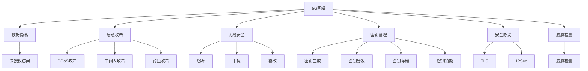

                 

# 5G网络安全：挑战与解决方案

> 关键词：5G, 网络安全, 数据隐私, 恶意攻击, 无线安全, 密钥管理, 安全协议, 威胁检测

## 1. 背景介绍

### 1.1 问题由来

随着5G网络的普及和商用，网络通信的安全问题也逐渐凸显出来。5G网络的超高带宽、低延迟和高并发特性，使得其在物联网、智能制造、车联网、工业互联网等垂直行业的应用潜力巨大，同时也引入了许多新的安全风险。如何应对这些挑战，构建一个安全可靠的5G网络，成为业界亟需解决的问题。

### 1.2 问题核心关键点

5G网络的安全挑战主要集中在以下几个方面：

- **数据隐私保护**：5G网络承载了大量个人和企业数据，如何防止数据泄露和未授权访问。
- **恶意攻击**：包括DDoS攻击、中间人攻击、钓鱼攻击等，对网络通信和用户隐私构成严重威胁。
- **无线安全**：5G网络通过无线信道传输数据，如何保护无线通信免受窃听、干扰和篡改。
- **密钥管理**：5G网络需要大量安全密钥，如何高效生成、分发和管理密钥。
- **安全协议**：如何设计安全协议保障网络通信的机密性、完整性和可用性。
- **威胁检测**：如何及时发现和应对网络安全威胁，保障网络安全。

这些核心问题在传统的网络架构和安全技术中已有所研究，但5G网络的高速度、大容量和高可靠性使得现有的安全解决方案面临新的挑战，亟需进行技术创新和优化。

### 1.3 问题研究意义

研究5G网络安全问题，对于保障5G网络的高效运行、保护用户隐私、提升网络可信度具有重要意义：

- **网络可靠性和用户体验**：安全问题会直接影响5G网络的稳定性和用户体验，保障网络安全是5G成功商用不可或缺的前提。
- **数据隐私保护**：在各种垂直行业中，数据是企业的核心资产。保护数据隐私不仅能保护企业利益，也能增强用户信任。
- **行业竞争力**：数据安全和网络安全直接关系到各行业能否快速抢占市场先机，构建竞争优势。
- **社会治理**：安全问题不仅影响企业，还可能波及社会公共安全。通过提升5G网络安全，可以有效保障公共安全，维护社会稳定。

## 2. 核心概念与联系

### 2.1 核心概念概述

为更好地理解5G网络安全的核心概念，本节将介绍几个关键概念及其相互关系：

- **5G网络**：基于第五代移动通信技术，提供超高带宽、低延迟、高可靠性和海量连接的网络。
- **数据隐私**：涉及个人和企业数据的保密性、完整性和可用性，确保数据不被未授权访问和使用。
- **恶意攻击**：包括DDoS攻击、中间人攻击、钓鱼攻击等，旨在破坏网络稳定性和用户信任。
- **无线安全**：指通过无线信道传输数据时，如何防止窃听、干扰和篡改。
- **密钥管理**：涉及密钥的生成、分发、存储和销毁，确保密钥的安全性和机密性。
- **安全协议**：如TLS、IPSec等，通过协议层面保障网络通信的安全性。
- **威胁检测**：指通过技术手段识别和应对潜在的安全威胁，保障网络安全。

这些概念之间的逻辑关系可以通过以下Mermaid流程图来展示：



这个流程图展示了大语言模型的工作原理和优化方向：

1. 5G网络通过提供超高带宽、低延迟和高可靠性的连接，为各种应用提供基础保障。
2. 数据隐私保护、恶意攻击防范、无线安全、密钥管理、安全协议设计、威胁检测等措施，共同构成5G网络安全防御体系。
3. 数据隐私保护旨在防止未授权访问，而恶意攻击防范、无线安全、密钥管理和安全协议设计则从不同角度保障网络通信的安全性。
4. 威胁检测是主动发现和应对潜在威胁的重要手段。

## 3. 核心算法原理 & 具体操作步骤
### 3.1 算法原理概述

5G网络安全的核心算法原理，是通过结合密码学、网络安全、无线通信等技术，构建多层次的安全防御体系。其中，密码学是保障数据隐私和密钥管理的基础，网络安全是防范恶意攻击和保障无线安全的关键，安全协议和威胁检测则是构建网络安全的核心。

### 3.2 算法步骤详解

5G网络安全算法的基本步骤包括以下几个关键环节：

**Step 1: 数据隐私保护**

1. **数据加密**：采用对称密钥或非对称密钥对数据进行加密，确保数据在传输和存储过程中不被未授权访问。
2. **差分隐私**：在数据收集和处理过程中，加入随机噪声，防止数据泄露个人信息。
3. **同态加密**：允许在不解密数据的情况下，进行特定的计算操作。

**Step 2: 恶意攻击防范**

1. **DDoS防御**：采用流量清洗、反向代理、带宽扩容等手段，防止DDoS攻击导致的拒绝服务。
2. **中间人攻击防范**：采用证书验证、密钥交换等手段，防止中间人篡改数据。
3. **钓鱼攻击防范**：通过网络钓鱼检测技术，识别和拦截钓鱼邮件和链接。

**Step 3: 无线安全保障**

1. **物理层安全**：采用安全编码方式，如OFDM、MIMO等，防止信号被窃听和干扰。
2. **网络层安全**：采用IPSec协议，加密和认证网络层数据，防止窃听和篡改。
3. **传输层安全**：采用TLS协议，加密和认证传输层数据，防止窃听和篡改。

**Step 4: 密钥管理**

1. **密钥生成**：采用随机数生成器生成密钥，确保密钥的随机性和不可预测性。
2. **密钥分发**：通过安全的密钥分发协议，如Diffie-Hellman密钥交换协议，确保密钥的安全传输。
3. **密钥存储**：采用密钥管理系统，集中存储和管理密钥，确保密钥的安全性和可追溯性。
4. **密钥销毁**：在密钥不再使用时，及时销毁密钥，防止密钥泄露。

**Step 5: 安全协议设计**

1. **TLS协议**：通过加密和认证，保障网络通信的安全性。
2. **IPSec协议**：通过加密和认证，保障网络层数据的机密性和完整性。

**Step 6: 威胁检测**

1. **入侵检测系统(IDS)**：通过实时监控网络流量，识别潜在的安全威胁。
2. **入侵防御系统(IPS)**：在检测到威胁时，自动采取防护措施，防止攻击成功。

### 3.3 算法优缺点

5G网络安全算法的优点包括：

1. **全面保障**：通过多层次的安全防御体系，全面保障5G网络的安全性。
2. **灵活性**：可以针对不同应用场景，灵活选择和组合安全措施。
3. **高效性**：采用先进的密码学和网络安全技术，提高安全防护的效率和效果。

同时，也存在一些局限性：

1. **复杂性**：多层次的安全防御体系增加了系统复杂度，需要更高的技术和管理水平。
2. **成本高**：高安全级别的实施成本较高，需要大量的硬件和软件投资。
3. **可扩展性差**：一些安全措施在设计和实现时，难以适应未来的网络发展和技术变化。

### 3.4 算法应用领域

5G网络安全算法已经广泛应用于各种垂直行业和应用场景，包括但不限于：

- **工业互联网**：保障工业设备和系统的网络安全，防止恶意攻击和数据泄露。
- **车联网**：保障车载通信系统的安全性，防止网络攻击和数据篡改。
- **智能制造**：保障工业数据和生产设备的安全，防止网络攻击和设备故障。
- **医疗健康**：保障医疗数据的隐私和安全，防止数据泄露和未授权访问。
- **智慧城市**：保障城市公共网络和设施的安全，防止网络攻击和社会稳定。

## 4. 数学模型和公式 & 详细讲解  
### 4.1 数学模型构建

5G网络安全的数学模型通常涉及以下几个方面：

- **密码学模型**：涉及加密、解密、密钥生成等算法。
- **网络安全模型**：涉及入侵检测、入侵防御等算法。
- **无线安全模型**：涉及物理层安全、网络层安全等算法。

以对称密钥加密为例，其数学模型可以表示为：

$$
C = E_k(P) = (P \oplus k) \oplus k^{-1} \oplus k
$$

其中 $P$ 为明文，$k$ 为密钥，$E_k$ 为加密算法，$C$ 为密文，$\oplus$ 表示异或运算。

### 4.2 公式推导过程

以Diffie-Hellman密钥交换协议为例，其数学推导过程如下：

设 $p$ 为一个大素数，$g$ 为 $p$ 的一个原根，Alice和Bob需要进行密钥交换。Alice随机选择一个整数 $a$，计算 $A = g^a \bmod p$；Bob随机选择一个整数 $b$，计算 $B = g^b \bmod p$。Alice和Bob通过公开信道交换 $A$ 和 $B$，Alice计算 $S = B^a \bmod p$，Bob计算 $S = A^b \bmod p$，最终得到的 $S$ 即为共享密钥。

数学推导过程如下：

1. Alice计算 $A = g^a \bmod p$
2. Bob计算 $B = g^b \bmod p$
3. Alice和Bob交换 $A$ 和 $B$
4. Alice计算 $S = B^a \bmod p = (g^b \bmod p)^a \bmod p = g^{ab} \bmod p$
5. Bob计算 $S = A^b \bmod p = (g^a \bmod p)^b \bmod p = g^{ab} \bmod p$
6. Alice和Bob得到相同的共享密钥 $S$

通过上述推导，可以看到，Diffie-Hellman密钥交换协议能够安全地生成共享密钥，用于后续的加密和解密操作。

### 4.3 案例分析与讲解

**案例1: TLS协议**

TLS协议是一种安全传输协议，通过加密和认证，保障网络通信的机密性、完整性和可用性。其数学模型主要包括公钥加密和数字签名。

1. **公钥加密**：发送方使用接收方的公钥加密数据，接收方使用私钥解密数据。数学模型如下：

$$
C = E_{\text{pub}}(M, K) = M \oplus K \oplus K
$$

其中 $M$ 为明文，$K$ 为共享密钥，$E_{\text{pub}}$ 为公钥加密算法，$C$ 为密文。

2. **数字签名**：发送方使用私钥对数据进行签名，接收方使用公钥验证签名。数学模型如下：

$$
S = H(M, K) \oplus K
$$

其中 $H$ 为哈希函数，$S$ 为签名，$K$ 为共享密钥。

通过上述推导，可以看到，TLS协议通过公钥加密和数字签名，保障了网络通信的安全性。

**案例2: IPSec协议**

IPSec协议是一种网络层安全协议，通过加密和认证，保障网络层数据的机密性和完整性。其数学模型主要包括加密和认证两个部分。

1. **加密**：采用DES或AES等对称加密算法，对数据进行加密。数学模型如下：

$$
C = E_K(P) = P \oplus K
$$

其中 $P$ 为明文，$K$ 为共享密钥，$E_K$ 为加密算法，$C$ 为密文。

2. **认证**：采用MD5或SHA等哈希函数，对数据进行认证。数学模型如下：

$$
A = H(P, K)
$$

其中 $P$ 为明文，$K$ 为共享密钥，$H$ 为哈希函数，$A$ 为认证值。

通过上述推导，可以看到，IPSec协议通过对称加密和哈希认证，保障了网络层数据的机密性和完整性。

## 5. 项目实践：代码实例和详细解释说明
### 5.1 开发环境搭建

在进行5G网络安全实践前，我们需要准备好开发环境。以下是使用Python进行PyTorch开发的环境配置流程：

1. 安装Anaconda：从官网下载并安装Anaconda，用于创建独立的Python环境。

2. 创建并激活虚拟环境：
```bash
conda create -n pytorch-env python=3.8 
conda activate pytorch-env
```

3. 安装PyTorch：根据CUDA版本，从官网获取对应的安装命令。例如：
```bash
conda install pytorch torchvision torchaudio cudatoolkit=11.1 -c pytorch -c conda-forge
```

4. 安装TensorFlow：从官网下载并安装TensorFlow。

5. 安装各类工具包：
```bash
pip install numpy pandas scikit-learn matplotlib tqdm jupyter notebook ipython
```

完成上述步骤后，即可在`pytorch-env`环境中开始安全实践。

### 5.2 源代码详细实现

下面我们以5G网络的数据隐私保护为例，给出使用PyTorch进行对称密钥加密的PyTorch代码实现。

首先，定义对称加密函数：

```python
import torch
import torch.nn as nn
import torch.nn.functional as F

class SymmetricEncryption(nn.Module):
    def __init__(self, key_size):
        super(SymmetricEncryption, self).__init__()
        self.key = nn.Parameter(torch.randn(key_size))
        
    def forward(self, plaintext):
        key = self.key
        encrypted = plaintext ^ key
        return encrypted, key
```

然后，定义明文和密钥：

```python
plaintext = torch.tensor([0, 1, 2, 3, 4, 5, 6, 7, 8, 9], dtype=torch.int8)
key = torch.tensor([1, 2, 3, 4, 5, 6, 7, 8, 9, 10], dtype=torch.int8)
```

接着，实例化加密模型并加密明文：

```python
model = SymmetricEncryption(key_size=10)
ciphertext, shared_key = model(plaintext)
```

最后，解密密文：

```python
decrypted = ciphertext ^ shared_key
```

到此，我们就实现了基于对称密钥加密的数据隐私保护。

### 5.3 代码解读与分析

让我们再详细解读一下关键代码的实现细节：

**SymmetricEncryption类**：
- `__init__`方法：初始化加密密钥。
- `forward`方法：实现加密算法。

**明文和密钥定义**：
- 明文和密钥都是使用`torch.tensor`定义的，确保其在PyTorch中进行计算。
- 明文和密钥均为`int8`类型，表示它们是整型数据。

**实例化加密模型**：
- 实例化`SymmetricEncryption`类，传入密钥大小`key_size`。
- 通过模型的前向传播方法，加密明文并返回密文和共享密钥。

**解密密文**：
- 通过对称解密算法，使用共享密钥解密密文。

## 6. 实际应用场景
### 6.1 智能制造

5G网络的高带宽、低延迟和高可靠性特性，为智能制造提供了技术保障。然而，智能制造系统涉及大量工业设备的数据传输，网络安全问题显得尤为重要。

**应用场景**：
- **设备联网**：将工业设备和传感器通过5G网络联网，实现设备间的数据交换和协同控制。
- **工业数据保护**：保障工业数据在传输和存储过程中的隐私和安全。
- **安全监控**：通过实时监控设备运行状态和网络流量，及时发现和应对潜在的安全威胁。

**技术方案**：
- **数据加密**：在工业数据传输过程中，采用对称密钥加密和差分隐私技术，保障数据隐私。
- **网络监控**：部署入侵检测系统和入侵防御系统，实时监控网络流量，防止DDoS攻击和钓鱼攻击。
- **密钥管理**：使用Diffie-Hellman密钥交换协议，高效生成和分发安全密钥，保障设备间通信的安全。

### 6.2 智慧城市

智慧城市是5G网络的重要应用场景之一。5G网络的高速度和低延迟特性，为智慧城市提供了强大的数据支撑。然而，智慧城市涉及海量数据和网络设施，网络安全问题也随之而来。

**应用场景**：
- **公共安全监控**：通过摄像头和传感器实时监控城市运行状态，保障公共安全。
- **智能交通管理**：通过5G网络实时传输交通数据，优化交通管理。
- **智慧医疗**：通过5G网络实时传输医疗数据，保障医疗服务的可靠性和安全性。

**技术方案**：
- **数据加密**：在城市运行数据传输过程中，采用TLS协议和IPSec协议，保障数据隐私和安全。
- **网络监控**：部署入侵检测系统和入侵防御系统，实时监控网络流量，防止网络攻击和数据篡改。
- **密钥管理**：使用Diffie-Hellman密钥交换协议，高效生成和分发安全密钥，保障通信安全。

## 7. 工具和资源推荐
### 7.1 学习资源推荐

为了帮助开发者系统掌握5G网络安全的技术基础和实践技巧，这里推荐一些优质的学习资源：

1. **《5G网络安全基础》课程**：由5G网络安全专家授课，涵盖5G网络安全基础、数据隐私保护、恶意攻击防范等内容。
2. **《网络安全技术》书籍**：详细介绍网络安全的基本概念和实现方法，包括加密、认证、入侵检测等。
3. **《5G网络安全实战》文章系列**：通过真实案例和实战经验，介绍5G网络安全的实施方法和注意事项。
4. **OpenSSL官方文档**：详细介绍TLS协议和IPSec协议的实现方法，是网络安全开发的必备参考。
5. **NIST网络安全框架**：提供全面的网络安全评估和实施指南，是网络安全标准化的重要参考。

通过对这些资源的学习实践，相信你一定能够快速掌握5G网络安全的基本知识和技能，并应用于实际项目中。

### 7.2 开发工具推荐

高效的开发离不开优秀的工具支持。以下是几款用于5G网络安全开发的常用工具：

1. **Wireshark**：网络流量分析工具，可以实时监控和分析网络流量，发现潜在的安全威胁。
2. **OpenSSL**：开源加密工具，支持TLS协议和IPSec协议的实现。
3. **TensorFlow**：开源机器学习框架，支持神经网络模型的训练和部署。
4. **Kaggle**：数据科学竞赛平台，提供丰富的数据集和算法库，适合进行安全数据分析和模型训练。
5. **Jupyter Notebook**：交互式编程环境，支持Python代码的编写和执行，适合进行安全算法和模型的开发和测试。

合理利用这些工具，可以显著提升5G网络安全开发的效率，加速技术创新和迭代。

### 7.3 相关论文推荐

5G网络安全技术的发展离不开学界的持续研究。以下是几篇奠基性的相关论文，推荐阅读：

1. **《5G网络安全研究综述》**：介绍5G网络安全的基本概念和实现方法，涵盖数据隐私保护、恶意攻击防范、无线安全等内容。
2. **《5G网络数据隐私保护技术》**：详细介绍差分隐私、同态加密等数据隐私保护技术，探讨其在5G网络中的应用。
3. **《5G网络安全协议设计》**：介绍TLS协议和IPSec协议的设计原理和实现方法，讨论其安全性和适用性。
4. **《5G网络威胁检测与防护技术》**：详细介绍入侵检测系统(IDS)和入侵防御系统(IPS)的设计原理和实现方法，讨论其防护效果和应用场景。

这些论文代表了大语言模型微调技术的发展脉络。通过学习这些前沿成果，可以帮助研究者把握学科前进方向，激发更多的创新灵感。

## 8. 总结：未来发展趋势与挑战
### 8.1 总结

本文对5G网络安全问题进行了全面系统的介绍。首先阐述了5G网络安全的研究背景和意义，明确了网络安全在保障5G网络的高效运行、保护用户隐私、提升网络可信度方面的重要性。其次，从原理到实践，详细讲解了5G网络安全的核心算法和操作步骤，给出了具体的数据隐私保护和安全防护的代码实现。同时，本文还广泛探讨了5G网络安全在智能制造、智慧城市等多个行业领域的应用前景，展示了5G网络安全技术的广阔前景。最后，本文精选了5G网络安全相关的学习资源、开发工具和研究论文，力求为读者提供全方位的技术指引。

通过本文的系统梳理，可以看到，5G网络安全问题已经引起了广泛关注和研究。随着5G网络的普及和商用，如何构建一个安全可靠的5G网络，保障用户隐私和安全，成为业界亟需解决的问题。未来，5G网络安全技术需要进一步创新和优化，以适应新形势下的挑战。

### 8.2 未来发展趋势

展望未来，5G网络安全技术将呈现以下几个发展趋势：

1. **多层次安全防护**：通过多层次的安全防护体系，全面保障5G网络的安全性。包括数据加密、入侵检测、入侵防御等环节，形成无缝连接的安全保障网络。
2. **智能化安全防护**：引入人工智能技术，如深度学习、机器学习等，实现自动化的威胁检测和防御。
3. **零信任安全模型**：构建零信任架构，对网络流量进行严格的身份验证和权限控制，防止未授权访问。
4. **区块链技术应用**：通过区块链技术实现密钥管理和数据溯源，提高网络安全性和可信度。
5. **跨域安全互联**：构建跨域安全互联网络，保障5G网络在不同设备和系统间的安全通信。

以上趋势凸显了5G网络安全技术的未来方向，这些方向的探索发展，必将进一步提升5G网络的安全性和可靠性，为构建安全可靠的5G网络提供有力保障。

### 8.3 面临的挑战

尽管5G网络安全技术已经取得了显著成果，但在迈向更加智能化、普适化应用的过程中，它仍面临着诸多挑战：

1. **资源消耗高**：大规模加密和认证算法会消耗大量计算资源，对硬件和网络环境提出了更高要求。
2. **管理复杂**：多层次的安全防护体系增加了系统复杂度，需要更高的技术和管理水平。
3. **标准不统一**：不同厂商和协议的安全实现方式各异，导致跨设备、跨协议的安全互操作性差。
4. **新技术挑战**：5G网络引入的新技术，如边缘计算、网络切片等，带来了新的安全挑战，需要进一步研究应对措施。
5. **数据隐私问题**：如何在保护数据隐私的同时，提供高效的数据共享和交换，是一个亟需解决的问题。
6. **法律和伦理问题**：数据隐私和网络安全的法律法规不完善，伦理道德问题复杂，需要进一步研究和规范。

正视5G网络安全面临的这些挑战，积极应对并寻求突破，将是大语言模型微调走向成熟的必由之路。相信随着学界和产业界的共同努力，这些挑战终将一一被克服，5G网络安全技术必将在构建安全可靠的5G网络中扮演越来越重要的角色。

### 8.4 研究展望

面对5G网络安全所面临的种种挑战，未来的研究需要在以下几个方面寻求新的突破：

1. **密码学算法创新**：开发更加高效的加密和认证算法，降低计算资源消耗，提高安全性能。
2. **人工智能技术应用**：引入人工智能技术，如深度学习、机器学习等，实现自动化的威胁检测和防御。
3. **区块链技术融合**：结合区块链技术，实现密钥管理和数据溯源，提高网络安全性和可信度。
4. **跨域安全互联**：构建跨域安全互联网络，保障5G网络在不同设备和系统间的安全通信。
5. **多模态安全防护**：结合物理安全、网络安全和应用安全，形成多模态的安全防护体系。
6. **法律和伦理规范**：建立健全的数据隐私和网络安全的法律法规，规范数据共享和使用的伦理道德问题。

这些研究方向的探索，必将引领5G网络安全技术迈向更高的台阶，为构建安全可靠的5G网络提供有力保障。面向未来，5G网络安全技术还需要与其他人工智能技术进行更深入的融合，如知识表示、因果推理、强化学习等，多路径协同发力，共同推动5G网络安全技术的进步。只有勇于创新、敢于突破，才能不断拓展5G网络安全的边界，让智能技术更好地造福人类社会。

## 9. 附录：常见问题与解答

**Q1：如何保障5G网络的数据隐私？**

A: 保障5G网络的数据隐私，可以采用以下方法：

1. **数据加密**：在数据传输过程中，采用对称密钥加密或非对称密钥加密，防止数据泄露。
2. **差分隐私**：在数据收集和处理过程中，加入随机噪声，防止数据泄露个人信息。
3. **同态加密**：在不解密数据的情况下，进行特定的计算操作，确保数据隐私。

通过上述方法，可以有效地保障5G网络的数据隐私。

**Q2：5G网络面临哪些常见的安全威胁？**

A: 5G网络面临的安全威胁包括：

1. **DDoS攻击**：通过大量恶意流量，导致网络过载，影响正常用户服务。
2. **中间人攻击**：攻击者通过篡改网络数据，窃取用户隐私和机密信息。
3. **钓鱼攻击**：攻击者通过伪造网络服务，诱导用户提供敏感信息。
4. **无线窃听和干扰**：攻击者通过窃听无线信号，获取敏感数据，或通过干扰信号，中断正常通信。

了解这些安全威胁，有助于采取针对性的防护措施。

**Q3：如何构建5G网络的安全防护体系？**

A: 构建5G网络的安全防护体系，可以采用以下方法：

1. **数据加密**：在数据传输过程中，采用对称密钥加密或非对称密钥加密，防止数据泄露。
2. **入侵检测**：部署入侵检测系统，实时监控网络流量，识别潜在的安全威胁。
3. **入侵防御**：部署入侵防御系统，在检测到威胁时，自动采取防护措施，防止攻击成功。
4. **密钥管理**：使用Diffie-Hellman密钥交换协议，高效生成和分发安全密钥，保障通信安全。
5. **网络监控**：实时监控网络流量，防止DDoS攻击和钓鱼攻击。

通过上述方法，可以构建多层次的安全防护体系，保障5G网络的安全性。

**Q4：如何保障5G网络的安全密钥管理？**

A: 保障5G网络的安全密钥管理，可以采用以下方法：

1. **密钥生成**：采用随机数生成器生成密钥，确保密钥的随机性和不可预测性。
2. **密钥分发**：通过安全的密钥分发协议，如Diffie-Hellman密钥交换协议，确保密钥的安全传输。
3. **密钥存储**：采用密钥管理系统，集中存储和管理密钥，确保密钥的安全性和可追溯性。
4. **密钥销毁**：在密钥不再使用时，及时销毁密钥，防止密钥泄露。

通过上述方法，可以高效、安全地管理5G网络的安全密钥。

**Q5：5G网络安全技术在实际应用中需要注意哪些问题？**

A: 在实际应用中，5G网络安全技术需要注意以下问题：

1. **资源消耗**：大规模加密和认证算法会消耗大量计算资源，需要考虑硬件和网络环境。
2. **管理复杂度**：多层次的安全防护体系增加了系统复杂度，需要更高的技术和管理水平。
3. **跨设备兼容性**：不同厂商和协议的安全实现方式各异，需要考虑跨设备、跨协议的安全互操作性。
4. **新技术挑战**：5G网络引入的新技术，如边缘计算、网络切片等，带来了新的安全挑战，需要进一步研究应对措施。
5. **法律法规和伦理问题**：数据隐私和网络安全的法律法规不完善，伦理道德问题复杂，需要进一步研究和规范。

在实际应用中，需要综合考虑这些因素，确保5G网络安全技术的有效实施。

---

作者：禅与计算机程序设计艺术 / Zen and the Art of Computer Programming

