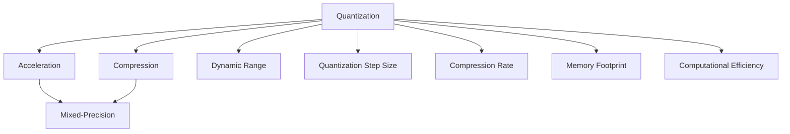

                 

# INT8量化：AI模型部署的效率之选

> 关键词：INT8量化,深度学习模型,模型优化,模型压缩,模型部署,AI加速

## 1. 背景介绍

### 1.1 问题由来

随着深度学习技术的发展，大模型在图像、语音、自然语言处理(NLP)等领域展现出强大的能力。然而，大模型通常参数量庞大，存储和计算开销高，对部署环境要求苛刻。量化是减少大模型计算资源需求、提高模型部署效率的有效手段。

量化指的是将模型中的浮点参数和计算转换为低精度格式，如8位整型(integer)格式，以减少计算资源和存储成本。与全精度(float32)模型相比，8位量化模型可以减小内存占用，加速推理速度，降低计算能耗。因此，量化技术在大规模深度学习模型部署中越来越受到关注。

### 1.2 问题核心关键点

量化技术主要是针对深度学习模型的优化，其核心在于如何将大模型的浮点参数和计算转换为低精度格式，同时尽量减少精度损失，保持模型性能。量化可以分为以下几种类型：

- **静态量化(Static Quantization)**：在模型训练时进行量化，即将每个浮点数参数都转换为低精度格式，并保存量化参数。
- **动态量化(Dynamic Quantization)**：在模型推理时进行量化，即在每次推理时动态计算量化参数。
- **混合精度训练(Mixed-Precision Training)**：在训练时使用不同的精度格式，如混合使用float32和float16，加速训练并减少内存使用。

此外，量化技术还涉及参数的重新训练、权重更新等过程。正确的量化策略不仅需要考虑模型压缩和加速的需求，还需兼顾精度损失和计算资源的平衡。

### 1.3 问题研究意义

量化技术的引入，对深度学习模型部署产生了深远影响：

1. **降低计算资源需求**：通过量化，大模型可以大幅减少内存占用和计算资源，提高计算效率。
2. **加速模型推理**：量化后的模型推理速度更快，能够更快速地响应用户请求，提高应用响应速度。
3. **提升硬件利用率**：量化技术适用于各种类型的硬件平台，如CPU、GPU、FPGA等，提高了硬件资源利用率。
4. **降低电力成本**：量化模型能耗更低，能显著降低电力消耗和计算成本。
5. **促进模型轻量化**：量化使得模型更轻量化，便于模型部署和版本更新。

量化技术的普及，将推动AI技术在更多应用场景中的落地，加速AI产业的全面发展。

## 2. 核心概念与联系

### 2.1 核心概念概述

量化技术是深度学习模型部署中不可或缺的一环，涉及到多个核心概念：

- **量化(Quantization)**：将模型中的浮点参数转换为低精度格式的过程。
- **压缩(Compression)**：通过量化、剪枝等手段减少模型大小的过程。
- **加速(Acceleration)**：通过量化和优化算法提高模型推理速度的过程。
- **混合精度(Mixed-Precision)**：在模型训练和推理中使用不同精度格式的过程。
- **动态范围(Dynamic Range)**：量化参数可以表示的范围。
- **量化步长(Quantization Step Size)**：每个浮点参数映射到的低精度数值的范围。

这些概念相互关联，共同构成量化技术的核心框架。

### 2.2 核心概念原理和架构的 Mermaid 流程图



此图展示了量化技术与其他优化手段之间的联系：量化通过压缩和加速，显著降低模型大小和计算资源需求，同时提高模型推理速度。混合精度训练进一步优化了量化过程，动态范围和量化步长是量化技术的核心参数。

## 3. 核心算法原理 & 具体操作步骤

### 3.1 算法原理概述

量化技术的基本原理是通过映射关系将浮点数参数转换为低精度格式，从而减少计算资源需求和存储开销。常见的量化方法包括直方图均衡化、范围限制、截断等。量化后的模型仍需经过训练和验证，确保其性能不损失过多。

量化过程主要分为两个阶段：预训练和量化后训练。预训练阶段对模型进行训练，获取模型参数的分布情况；量化后训练阶段通过调整量化参数，最小化模型损失。

### 3.2 算法步骤详解

#### 3.2.1 预训练阶段

1. **数据准备**：收集标注数据，准备模型，进行预训练。预训练的目标是使模型学习到数据的内在规律。
2. **模型训练**：使用全精度训练模型，获取模型参数的分布情况。
3. **统计数据分布**：统计模型参数的分布，获取数据的最小值和最大值。

#### 3.2.2 量化后训练阶段

1. **量化**：将预训练模型中的浮点参数转换为低精度格式。常见的量化方法有截断、范围限制等。
2. **量化后训练**：重新训练量化后的模型，使用量化前的参数进行初始化，使用量化后的参数进行前向计算。
3. **验证和调优**：在验证集上评估模型性能，根据性能指标调整量化参数。

#### 3.2.3 实际应用部署

1. **导出量化模型**：将量化后的模型导出，保存量化参数。
2. **模型优化**：对导出模型进行优化，如剪枝、蒸馏等，减小模型大小。
3. **模型部署**：将优化后的模型部署到目标硬件平台，进行推理计算。

### 3.3 算法优缺点

#### 3.3.1 优点

- **显著降低计算资源需求**：量化后的模型参数和计算开销明显降低。
- **加速模型推理**：量化模型推理速度更快，响应更快。
- **提高硬件利用率**：量化模型适用于各种硬件平台，提高硬件资源利用率。
- **降低电力成本**：量化模型能耗更低，能显著降低电力消耗。
- **促进模型轻量化**：量化使得模型更轻量化，便于模型部署和版本更新。

#### 3.3.2 缺点

- **精度损失**：量化过程不可避免地带来一定程度的精度损失。
- **训练复杂度增加**：量化后训练需要重新调整模型参数，增加了训练复杂度。
- **实现难度高**：量化过程中需要综合考虑精度、计算资源和模型性能的平衡，实现难度较大。

### 3.4 算法应用领域

量化技术广泛应用于以下几个领域：

- **图像识别**：量化后的图像识别模型在移动设备、嵌入式设备上部署广泛。
- **语音识别**：量化后的语音识别模型适用于智能手机、智能音箱等设备。
- **自然语言处理(NLP)**：量化后的NLP模型适用于聊天机器人、智能客服等场景。
- **推荐系统**：量化后的推荐系统模型适用于个性化推荐引擎。
- **医疗影像**：量化后的医疗影像模型适用于医学图像分析、诊断设备。

## 4. 数学模型和公式 & 详细讲解

### 4.1 数学模型构建

量化过程涉及将浮点数转换为低精度格式，其数学模型可以表示为：

$$
Q(x) = x \times \frac{r}{n} + b
$$

其中，$Q(x)$表示量化后的结果，$x$为原始浮点数，$r$为量化步长，$n$为量化级别（通常为$2^k$），$b$为量化偏差。

### 4.2 公式推导过程

量化过程的推导涉及将浮点数$x$映射到低精度格式。假设$x$的浮点数范围为$[x_{min}, x_{max}]$，量化步长为$r$，则量化后的结果$Q(x)$可以表示为：

$$
Q(x) = \left\lfloor \frac{x - x_{min}}{r} \right\rfloor \times r + b
$$

其中，$\lfloor \cdot \rfloor$表示向下取整运算。

### 4.3 案例分析与讲解

以8位整数量化为例，假设浮点数$x$的取值范围为$[0, 1]$，量化步长$r=0.25$，则量化后的结果$Q(x)$可以表示为：

$$
Q(x) = \left\lfloor \frac{255 \times x}{1} \right\rfloor
$$

其中，$255$为8位整数表示的范围，即$[0, 255]$。

## 5. 项目实践：代码实例和详细解释说明

### 5.1 开发环境搭建

在进行量化实践前，我们需要准备好开发环境。以下是使用Python进行TensorFlow量化开发的配置流程：

1. 安装TensorFlow：从官网下载并安装TensorFlow，选择适合的操作系统和版本。
2. 安装TensorFlow Addons：安装TensorFlow Addons，用于增强TensorFlow的功能。
3. 安装TFLite：安装TensorFlow Lite，用于移动设备上的模型部署。
4. 安装Quantization API：安装TensorFlow Quantization API，用于量化模型。

### 5.2 源代码详细实现

下面以TensorFlow为例，给出使用TensorFlow Quantization API对模型进行整数量化的代码实现。

```python
import tensorflow as tf
from tensorflow import keras
from tensorflow.keras.layers import Conv2D, Dense, Flatten

# 加载预训练模型
model = keras.models.load_model('pretrained_model.h5')

# 创建量化对象
quant = tf.keras.mixed_precision.experimental.mixed_precision_model()

# 转换模型
converted_model = quant.convert(model)

# 保存量化后的模型
converted_model.save('quantized_model.h5')
```

### 5.3 代码解读与分析

**TensorFlow Quantization API**：
- `keras.mixed_precision.experimental.mixed_precision_model()`：用于创建混合精度模型。
- `quant.convert(model)`：将模型转换为量化模型。
- `converted_model.save('quantized_model.h5')`：保存量化后的模型。

**参数调整**：
- `mixed_precision`参数：用于指定混合精度的类型，如`'float16'`或`'bfloat16'`。
- `experimental_allow_bfloat16_by_default`参数：用于设置是否默认使用bfloat16。

**模型部署**：
- 在移动设备上，可以使用TensorFlow Lite进行模型部署。
- 在服务器端，可以使用TFLite转换工具将模型转换为TFLite格式，然后进行推理。

## 6. 实际应用场景

### 6.1 智能设备

量化后的模型适用于各种智能设备，如智能手机、智能音箱、智能家居等。这些设备通常计算资源有限，对模型部署速度和能耗有严格要求。量化技术通过减小模型大小和计算资源需求，使得大模型能够快速部署在智能设备上，提供高性能的智能应用。

### 6.2 医疗影像

医疗影像分析需要快速、准确地处理大量数据。量化后的模型能够显著减少计算资源需求，加速图像处理速度，适用于诊断设备、影像分析系统等场景。

### 6.3 自动驾驶

自动驾驶系统需要实时处理大量数据，进行图像识别和决策。量化后的模型可以加速推理速度，降低能耗，提高系统响应速度，保障驾驶安全。

### 6.4 未来应用展望

随着深度学习技术的不断进步，量化技术的应用前景将更加广阔。未来，量化技术将与更多AI应用场景结合，如物联网、边缘计算等，提升AI系统的实时性、可靠性和能效比。

## 7. 工具和资源推荐

### 7.1 学习资源推荐

- **TensorFlow Quantization**：TensorFlow官方文档提供了详细的量化教程和示例。
- **TensorFlow Lite**：官方文档提供了模型部署和推理的详细指南。
- **PyTorch Quantization**：PyTorch官方文档介绍了量化技术的应用。
- **ONNX Quantization**：ONNX官方文档介绍了ONNX格式的量化方法。

### 7.2 开发工具推荐

- **TensorFlow Quantization**：TensorFlow官方提供的量化工具，支持多种量化方法和应用场景。
- **TensorFlow Lite**：适用于移动设备上的模型部署和推理。
- **ONNX**：支持跨平台模型转换和量化，适用于各种模型格式和应用场景。
- **TFLite Converter**：TensorFlow提供的TFLite模型转换工具。

### 7.3 相关论文推荐

- **"Quantization and Quantization-Aware Training with TensorFlow"**：Google的论文，详细介绍了TensorFlow的量化方法和应用。
- **"Pruning and Quantization of Deep Convolutional Networks for Resource Efficient Inference"**：Jouppi等人的论文，介绍了剪枝和量化的结合方法。
- **"Model-Based Policy Learning via Quantization-Aware Training"**：Cao等人的论文，探讨了量化与模型优化相结合的方法。

## 8. 总结：未来发展趋势与挑战

### 8.1 研究成果总结

量化技术已经成为深度学习模型部署的重要手段，通过量化能够显著减小模型大小，提高模型推理速度和计算效率。当前主流量化方法主要包括静态量化、动态量化和混合精度训练。量化技术在图像识别、语音识别、自然语言处理等领域已得到广泛应用，并不断拓展到更多场景中。

### 8.2 未来发展趋势

量化技术未来的发展趋势包括：

- **自动化量化**：通过自动化工具，自动识别和调整量化参数，简化量化过程。
- **模型压缩**：结合量化和剪枝、蒸馏等技术，进一步减小模型大小。
- **混合精度训练**：结合不同精度格式，优化训练过程，提高计算效率。
- **异构计算**：结合不同硬件平台的特性，优化模型量化和推理过程。
- **模型迁移**：将量化后的模型应用于新的应用场景，实现模型复用。

### 8.3 面临的挑战

量化技术面临的主要挑战包括：

- **精度损失**：量化过程不可避免地带来精度损失，需要通过参数调整和优化算法减小损失。
- **训练复杂度增加**：量化后训练需要重新调整模型参数，增加了训练复杂度。
- **实现难度高**：量化过程中需要综合考虑精度、计算资源和模型性能的平衡，实现难度较大。
- **应用场景复杂**：量化技术需要适应不同应用场景，实现难度较大。

### 8.4 研究展望

未来的研究方向包括：

- **精度优化**：通过参数调整和算法优化，减小量化过程的精度损失。
- **模型压缩**：结合量化和剪枝、蒸馏等技术，进一步减小模型大小。
- **混合精度训练**：结合不同精度格式，优化训练过程，提高计算效率。
- **异构计算**：结合不同硬件平台的特性，优化模型量化和推理过程。
- **模型迁移**：将量化后的模型应用于新的应用场景，实现模型复用。

## 9. 附录：常见问题与解答

**Q1: 量化过程中如何控制精度损失？**

A: 量化过程中，可以通过调整量化步长和量化偏差来控制精度损失。较小的量化步长和偏差能够保持较高的精度，但计算开销会增加。通常需要在精度和计算效率之间进行平衡。

**Q2: 量化对模型性能有哪些影响？**

A: 量化过程会对模型性能产生一定影响，主要表现为精度损失。较小的量化步长和偏差能够保持较高的精度，但计算开销会增加。通常需要在精度和计算效率之间进行平衡。

**Q3: 量化后的模型如何部署？**

A: 量化后的模型通常需要使用TensorFlow Lite等工具进行模型部署。在移动设备上，可以使用TensorFlow Lite进行模型部署。在服务器端，可以使用TFLite转换工具将模型转换为TFLite格式，然后进行推理。

**Q4: 量化过程中需要注意哪些问题？**

A: 量化过程中需要注意以下问题：
1. **数据准备**：准备标注数据，确保数据分布均匀。
2. **模型训练**：使用全精度训练模型，获取模型参数的分布情况。
3. **量化参数调整**：调整量化参数，最小化模型损失。

**Q5: 如何评估量化后的模型性能？**

A: 量化后的模型性能评估可以从精度和速度两个方面进行。在精度方面，可以使用混淆矩阵、准确率、召回率等指标进行评估；在速度方面，可以使用推理时间、吞吐量等指标进行评估。

---

作者：禅与计算机程序设计艺术 / Zen and the Art of Computer Programming

