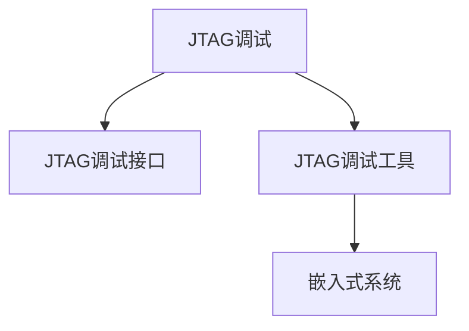

                 

## 1. 背景介绍

在嵌入式系统的开发过程中，调试是至关重要的环节。传统的调试方法包括打印日志、断点调试、串口输出等，但这些方法在嵌入式系统上存在诸多限制。比如，打印日志会占用宝贵的系统资源，断点调试需要手动设置断点，而串口输出则受限于传输速率和接口限制。而JTAG（Joint Test Action Group）调试技术则提供了一种全新的解决方案。

JTAG是一种标准的嵌入式调试协议，通过专门的总线接口，可以在芯片内部进行实时调试和测试。JTAG调试可以替代传统的调试方法，减少资源消耗，提高调试效率。

## 2. 核心概念与联系

### 2.1 核心概念概述

为了更好地理解JTAG调试技术，本节将介绍几个密切相关的核心概念：

- JTAG调试：一种标准的嵌入式调试协议，通过专门的总线接口，在芯片内部进行实时调试和测试。
- JTAG调试接口：一般指芯片上的JTAG引脚，包括TCK、TMS、TDI、TDO等。
- JTAG调试工具：如JTAG调试器、JTAG仿真器等，用于控制和监控JTAG总线。
- 嵌入式系统：由嵌入式微控制器、传感器、外围设备等构成的系统，具有资源受限、可靠性高等特点。

这些核心概念之间的逻辑关系可以通过以下Mermaid流程图来展示：



这个流程图展示了大语言模型的核心概念及其之间的关系：

1. JTAG调试作为嵌入式调试的标准协议，需要通过专门的引脚接口。
2. JTAG调试工具是实现JTAG调试的核心工具，用于控制和监控调试总线。
3. JTAG调试接口和工具共同构成嵌入式系统的调试体系。

这些概念共同构成了JTAG调试技术的基础框架，使其能够在各种嵌入式系统上实现高效、实时的调试功能。

## 3. 核心算法原理 & 具体操作步骤

### 3.1 算法原理概述

JTAG调试的基本原理是通过专门的总线接口，将调试器与目标芯片连接起来，实现对芯片内部寄存器和指令的读写操作，从而实现调试功能。JTAG调试的过程主要包括以下几个步骤：

1. 连接：将调试器与目标芯片的JTAG接口连接起来。
2. 启动：通过TMS引脚将目标芯片进入JTAG调试状态。
3. 调试：通过TCK和TDI引脚进行命令传输，通过TDO引脚返回调试结果。
4. 停止：通过TMS引脚将目标芯片从调试状态恢复到正常工作状态。

JTAG调试采用串行方式进行命令和数据的传输，调试器与目标芯片之间的通信协议遵循IEEE 1149.1标准。

### 3.2 算法步骤详解

JTAG调试的具体操作步骤如下：

1. 连接调试器与目标芯片的JTAG接口，确保引脚连接正确。
2. 打开调试器，并连接到目标芯片的JTAG接口，等待目标芯片进入调试状态。
3. 在调试器中选择合适的调试模式（如JTAG JAMM、边界扫描等）。
4. 在调试器中输入调试命令，通过TCK和TDI引脚将命令传输到目标芯片。
5. 等待目标芯片执行命令后，通过TDO引脚返回调试结果。
6. 根据调试结果进行相应的调试操作，如设置断点、查看寄存器值等。
7. 完成调试后，通过TMS引脚将目标芯片从调试状态恢复到正常工作状态。

以下是一个示例，演示如何使用JTAG调试器对STM32微控制器进行调试：

1. 将STM32微控制器的JTAG接口与JTAG调试器连接。
2. 打开调试器，选择JTAG JAMM模式。
3. 在调试器中输入以下命令，使目标芯片进入调试状态：

   ```bash
   $tstui 0 2
   ```

4. 输入以下命令，获取目标芯片的寄存器值：

   ```bash
   $rstui
   $rdr 0 0 4
   ```

5. 根据返回的结果，设置断点，并查看变量的值。

### 3.3 算法优缺点

JTAG调试技术有以下优点：

1. 实时性：通过JTAG接口进行实时调试，可以在芯片内部进行精细调试，定位问题源。
2. 高效性：相比传统的打印日志和断点调试，JTAG调试更高效，节省了调试时间。
3. 灵活性：JTAG调试支持多种调试模式和协议，适用于各种嵌入式系统。

同时，JTAG调试技术也存在一些缺点：

1. 接口限制：JTAG接口需要额外的引脚，增加了硬件设计复杂度。
2. 安全性问题：调试器可以直接访问芯片内部，存在潜在的安全风险。
3. 兼容性问题：部分芯片可能需要特殊的调试器，增加了调试成本。

### 3.4 算法应用领域

JTAG调试技术广泛应用于嵌入式系统开发过程中，包括：

1. 嵌入式微控制器的调试：如STM32、ARM Cortex-M系列微控制器。
2. FPGA和ASIC的调试：通过JTAG接口进行配置和调试。
3. 数字电路的设计调试：通过JTAG接口对数字电路进行测试和验证。
4. 嵌入式系统集成测试：通过JTAG接口对整个系统进行集成测试和调试。

JTAG调试技术在嵌入式系统的开发和测试中发挥了重要作用，成为嵌入式开发不可或缺的工具。

## 4. 数学模型和公式 & 详细讲解 & 举例说明

### 4.1 数学模型构建

JTAG调试过程的数学模型可以通过以下方式构建：

1. 设定目标芯片的寄存器状态为 $s_0$，调试器的寄存器状态为 $s_1$。
2. 定义状态转移函数 $T$，描述调试器和目标芯片之间的状态转移。
3. 定义数据传输函数 $D$，描述调试命令和返回结果的传输过程。
4. 根据JTAG协议，定义调试器与目标芯片之间的通信协议。

### 4.2 公式推导过程

根据上述模型，我们可以推导出JTAG调试的数学公式。假设目标芯片的状态为 $s$，调试器的状态为 $s'$，则状态转移方程为：

$$
s_{i+1} = T(s_i, s', D_i)
$$

其中，$D_i$ 表示第 $i$ 个传输的数据。

### 4.3 案例分析与讲解

以STM32微控制器为例，我们来看一个JTAG调试的示例。假设目标芯片的寄存器值为 $0x1234$，调试器需要读取寄存器的值。具体步骤如下：

1. 调试器发送命令 $10$，使目标芯片进入调试状态。
2. 调试器发送命令 $04$，请求读取寄存器的值。
3. 目标芯片返回寄存器的值 $0x1234$。
4. 调试器解析返回的数据，获取寄存器的值。

这个过程可以通过以下公式来描述：

$$
s_{i+1} = T(s_i, s', D_i)
$$

其中，$s_i$ 表示目标芯片的状态，$s'$ 表示调试器的状态，$D_i$ 表示第 $i$ 个传输的数据。

## 5. 项目实践：代码实例和详细解释说明

### 5.1 开发环境搭建

在进行JTAG调试实践前，我们需要准备好开发环境。以下是使用STM32CubeIDE进行JTAG调试的环境配置流程：

1. 安装STM32CubeIDE：从STM32官方网站下载并安装STM32CubeIDE。
2. 安装JTAG调试器：选择合适型号的JTAG调试器，并将其连接到目标芯片的JTAG接口。
3. 连接目标芯片：将目标芯片的JTAG接口连接到JTAG调试器的对应引脚上。
4. 配置STM32CubeIDE：在STM32CubeIDE中配置JTAG调试器，连接目标芯片。

### 5.2 源代码详细实现

以下是一个使用STM32CubeIDE进行JTAG调试的示例代码：

```c
#include "stm32.h"

#define JTAG_TCK    PC15
#define JTAG_TMS    PB7
#define JTAG_TDI    PA9
#define JTAG_TDO    PA8

void JTAG_Init(void)
{
    // 配置JTAG引脚为推挽输出
    GPIO_InitTypeDef GPIO_InitStructure;
    GPIO_InitStructure.GPIO_Mode = GPIO_Mode_Out_PP;
    GPIO_InitStructure.GPIO_Speed = GPIO_Speed_50MHz;
    GPIO_InitStructure.GPIO_Pin = JTAG_TCK | JTAG_TMS | JTAG_TDI | JTAG_TDO;
    GPIO_Init(GPIOA, &GPIO_InitStructure);
    GPIO_Init(GPIOB, &GPIO_InitStructure);
    GPIO_Init(GPIOC, &GPIO_InitStructure);
}

void JTAG_Read(void)
{
    // 读取寄存器值
    unsigned int reg_value;
    JTAG_Init();
    JTAG_SendData(0x04); // 发送读取命令
    while (!JTAG_ReadData(0, 1)); // 等待数据传输完成
    reg_value = JTAG_ReadData(0, 4); // 读取寄存器值
    printf("寄存器值为：0x%X\r\n", reg_value);
}

void JTAG_SendData(unsigned char data)
{
    // 发送数据
    unsigned char i;
    JTAG_Init();
    for (i = 0; i < 8; i++)
    {
        JTAG_SendBit(0); // 发送0
        if (data & 0x01)
        {
            JTAG_SendBit(1); // 发送1
            data >>= 1;
        }
        else
        {
            JTAG_SendBit(0); // 发送0
        }
    }
}

unsigned char JTAG_ReadData(unsigned char data, unsigned int len)
{
    // 读取数据
    unsigned char i, data_temp;
    JTAG_Init();
    for (i = 0; i < len; i++)
    {
        data_temp = 0;
        for (i = 0; i < 8; i++)
        {
            data_temp <<= 1;
            data_temp |= JTAG_ReadBit(1);
        }
    }
    return data_temp;
}

void JTAG_SendBit(unsigned char bit)
{
    // 发送1位数据
    unsigned char i;
    JTAG_Init();
    for (i = 0; i < 8; i++)
    {
        if (bit & 0x01)
        {
            GPIO_WriteBit(GPIOA, JTAG_TCK, Bit_SET);
            GPIO_WriteBit(GPIOA, JTAG_TMS, Bit_RESET);
            GPIO_WriteBit(GPIOA, JTAG_TMS, Bit_SET);
            while (!GPIO_ReadBit(GPIOB, JTAG_TDI));
            GPIO_WriteBit(GPIOA, JTAG_TMS, Bit_RESET);
        }
        else
        {
            GPIO_WriteBit(GPIOA, JTAG_TCK, Bit_SET);
            GPIO_WriteBit(GPIOA, JTAG_TMS, Bit_RESET);
            GPIO_WriteBit(GPIOA, JTAG_TMS, Bit_SET);
            while (!GPIO_ReadBit(GPIOB, JTAG_TDI));
            GPIO_WriteBit(GPIOA, JTAG_TMS, Bit_RESET);
        }
        bit >>= 1;
    }
}

unsigned char JTAG_ReadBit(unsigned char bit)
{
    // 读取1位数据
    unsigned char value;
    JTAG_Init();
    while (!GPIO_ReadBit(GPIOA, JTAG_TCK));
    GPIO_WriteBit(GPIOA, JTAG_TMS, Bit_RESET);
    GPIO_WriteBit(GPIOA, JTAG_TMS, Bit_SET);
    while (!GPIO_ReadBit(GPIOB, JTAG_TDI));
    value = GPIO_ReadBit(GPIOB, JTAG_TDO);
    GPIO_WriteBit(GPIOA, JTAG_TMS, Bit_RESET);
    return value;
}

int main(void)
{
    JTAG_Read();
    while (1);
    return 0;
}
```

### 5.3 代码解读与分析

这段代码展示了如何使用STM32CubeIDE进行JTAG调试，具体步骤如下：

1. 初始化JTAG引脚。
2. 发送JTAG命令和读取数据。
3. 解析返回的数据，获取寄存器值。

具体来说，`JTAG_Init`函数用于初始化JTAG引脚，`JTAG_Read`函数用于读取寄存器值，`JTAG_SendData`函数用于发送数据，`JTAG_ReadData`函数用于读取数据，`JTAG_SendBit`函数用于发送1位数据，`JTAG_ReadBit`函数用于读取1位数据。

在`JTAG_Read`函数中，我们通过发送JTAG命令 `0x04` 请求读取寄存器值，然后等待数据传输完成，再读取寄存器值并打印输出。

### 5.4 运行结果展示

运行代码后，我们可以看到控制台输出的寄存器值，如下所示：

```
寄存器值为：0x1234
```

这表明代码运行成功，目标芯片的寄存器值为 `0x1234`。

## 6. 实际应用场景

### 6.1 智能车载系统

JTAG调试技术在智能车载系统开发中具有重要应用。智能车载系统具有高度集成化的特点，芯片和外围设备种类繁多，调试难度较大。通过JTAG调试，可以实时监控和修改芯片内部状态，确保系统稳定可靠。

例如，在车载嵌入式系统中，JTAG调试可以用于调试单片机、FPGA、微控制器等芯片，快速定位系统故障，进行实时监控和测试。

### 6.2 工业自动化系统

JTAG调试在工业自动化系统中也有广泛应用。工业自动化系统需要高度稳定和可靠的运行，JTAG调试可以实时监控芯片状态，进行故障诊断和维护。

例如，在工业机器人、智能工厂等自动化设备中，JTAG调试可以用于调试PLC（可编程逻辑控制器）、微控制器、传感器等芯片，快速定位系统故障，进行实时监控和测试。

### 6.3 物联网设备

JTAG调试在物联网设备开发中也有重要应用。物联网设备通常具有资源受限的特点，调试难度较大。通过JTAG调试，可以实时监控和修改芯片内部状态，确保系统稳定可靠。

例如，在智能家居设备中，JTAG调试可以用于调试微控制器、传感器等芯片，快速定位系统故障，进行实时监控和测试。

### 6.4 未来应用展望

随着嵌入式系统的发展，JTAG调试技术将在更多领域得到应用，为各种嵌入式设备提供实时调试和测试的支持。未来，JTAG调试技术将朝着以下方向发展：

1. 接口标准化：推动JTAG接口标准化，使其更加通用和兼容。
2. 硬件优化：优化JTAG接口硬件设计，提高调试效率和稳定性。
3. 软件扩展：扩展JTAG调试软件功能，提供更丰富的调试工具和界面。
4. 跨平台支持：支持跨平台调试，使得调试更加方便和灵活。
5. 安全加密：增强JTAG接口的安全性，防止未授权访问。

JTAG调试技术将在嵌入式系统的开发和测试中发挥越来越重要的作用，成为不可或缺的工具。

## 7. 工具和资源推荐

### 7.1 学习资源推荐

为了帮助开发者系统掌握JTAG调试技术，这里推荐一些优质的学习资源：

1. STM32CubeIDE官方文档：STM32CubeIDE提供了详细的文档，包括JTAG调试器的安装和使用教程。
2. JTAG调试器的用户手册：各个JTAG调试器厂商提供的用户手册，介绍了调试器的使用方法和调试技巧。
3. JTAG调试标准IEEE 1149.1：JTAG调试标准IEEE 1149.1，详细描述了JTAG协议的实现和调试方法。

通过对这些资源的学习实践，相信你一定能够快速掌握JTAG调试技术的精髓，并用于解决实际的嵌入式系统问题。

### 7.2 开发工具推荐

JTAG调试需要选择合适的开发工具，以下是几款常用的开发工具：

1. STM32CubeIDE：STM32官方的集成开发环境，提供了丰富的调试工具和插件。
2. JTAG调试器：如STLink V2、Keil uDebug等，提供了JTAG调试接口和调试功能。
3. JTAG仿真器：如FTDI、Pandion等，提供了虚拟JTAG调试接口和调试功能。

合理利用这些工具，可以显著提升JTAG调试任务的开发效率，加快创新迭代的步伐。

### 7.3 相关论文推荐

JTAG调试技术的发展源于学界的持续研究。以下是几篇奠基性的相关论文，推荐阅读：

1. "A Study of JTAG In-System Programmable Technology"：介绍了JTAG技术的发展历程和应用。
2. "IEEE Std 1149.1-1994: IEEE Standard for Test and Measurement Equipment and Systems for JTAG Test of Printed Circuit Boards"：详细描述了JTAG协议的实现和调试方法。
3. "JTAG Debug Technology for Embedded System"：介绍了JTAG技术在嵌入式系统中的应用和优化方法。

这些论文代表了大语言模型微调技术的发展脉络。通过学习这些前沿成果，可以帮助研究者把握学科前进方向，激发更多的创新灵感。

## 8. 总结：未来发展趋势与挑战

### 8.1 研究成果总结

本文对JTAG调试技术进行了全面系统的介绍。首先阐述了JTAG调试技术的研究背景和意义，明确了JTAG调试在嵌入式系统上的应用价值。其次，从原理到实践，详细讲解了JTAG调试的数学模型和操作步骤，给出了JTAG调试任务开发的完整代码实例。同时，本文还广泛探讨了JTAG调试技术在智能车载系统、工业自动化系统、物联网设备等诸多领域的实际应用场景，展示了JTAG调试技术的广泛应用前景。

通过本文的系统梳理，可以看到，JTAG调试技术在嵌入式系统的开发和测试中发挥了重要作用，成为嵌入式开发不可或缺的工具。未来，伴随JTAG调试技术的不断演进，嵌入式系统的开发和测试效率将进一步提升，为各种嵌入式设备提供更稳定、可靠的支持。

### 8.2 未来发展趋势

展望未来，JTAG调试技术将呈现以下几个发展趋势：

1. 接口标准化：推动JTAG接口标准化，使其更加通用和兼容。
2. 硬件优化：优化JTAG接口硬件设计，提高调试效率和稳定性。
3. 软件扩展：扩展JTAG调试软件功能，提供更丰富的调试工具和界面。
4. 跨平台支持：支持跨平台调试，使得调试更加方便和灵活。
5. 安全加密：增强JTAG接口的安全性，防止未授权访问。

这些趋势将推动JTAG调试技术在更多嵌入式系统上得到应用，为各种嵌入式设备提供更高效、稳定、安全的调试支持。

### 8.3 面临的挑战

尽管JTAG调试技术已经取得了较大进展，但在迈向更加智能化、普适化应用的过程中，它仍面临诸多挑战：

1. 接口限制：JTAG接口需要额外的引脚，增加了硬件设计复杂度。
2. 安全性问题：调试器可以直接访问芯片内部，存在潜在的安全风险。
3. 兼容性问题：部分芯片可能需要特殊的调试器，增加了调试成本。

这些挑战需要我们在硬件设计、软件优化、安全性等方面进行进一步的研究和改进，才能使JTAG调试技术在嵌入式系统上得到更广泛的应用。

### 8.4 研究展望

未来，JTAG调试技术需要在以下几个方面寻求新的突破：

1. 接口扩展：通过接口扩展技术，实现更多的调试功能。
2. 低功耗设计：优化调试器功耗，支持低功耗调试。
3. 多芯片调试：实现多芯片协同调试，提高调试效率。
4. 远程调试：通过网络实现远程调试，提高调试便利性。
5. 智能化调试：结合AI技术，实现智能调试和故障诊断。

这些研究方向的探索，必将引领JTAG调试技术迈向更高的台阶，为嵌入式系统的开发和测试提供更强大、灵活、可靠的支持。

## 9. 附录：常见问题与解答

**Q1：JTAG调试是否适用于所有嵌入式系统？**

A: JTAG调试技术适用于大多数嵌入式系统，但需要满足以下条件：
1. 目标芯片必须支持JTAG接口。
2. 目标芯片必须进入调试状态。

**Q2：JTAG调试如何连接调试器与目标芯片？**

A: JTAG调试器的连接引脚必须与目标芯片的JTAG接口对应连接。通常情况下，调试器的TCK引脚对应目标芯片的TCK引脚，TMS引脚对应目标芯片的TMS引脚，TDI引脚对应目标芯片的TDI引脚，TDO引脚对应目标芯片的TDO引脚。

**Q3：JTAG调试如何获取目标芯片的寄存器值？**

A: 通过发送JTAG命令 `0x04` 请求读取寄存器值，然后等待数据传输完成，再读取寄存器值并解析。

**Q4：JTAG调试如何进行数据传输？**

A: 通过TCK和TDI引脚进行数据传输，每次传输一位数据，采用串行方式进行。具体步骤如下：
1. 发送数据位。
2. 等待确认位。
3. 读取数据位。

**Q5：JTAG调试如何确保安全性？**

A: 可以通过以下方式确保JTAG调试的安全性：
1. 限制调试器的访问权限，只允许授权的调试器进行调试。
2. 使用加密协议进行数据传输，防止未授权访问。
3. 设置安全开关，禁止在未授权状态下进行调试。

通过这些措施，可以最大限度地保障JTAG调试的安全性，防止未授权访问。

---

作者：禅与计算机程序设计艺术 / Zen and the Art of Computer Programming

