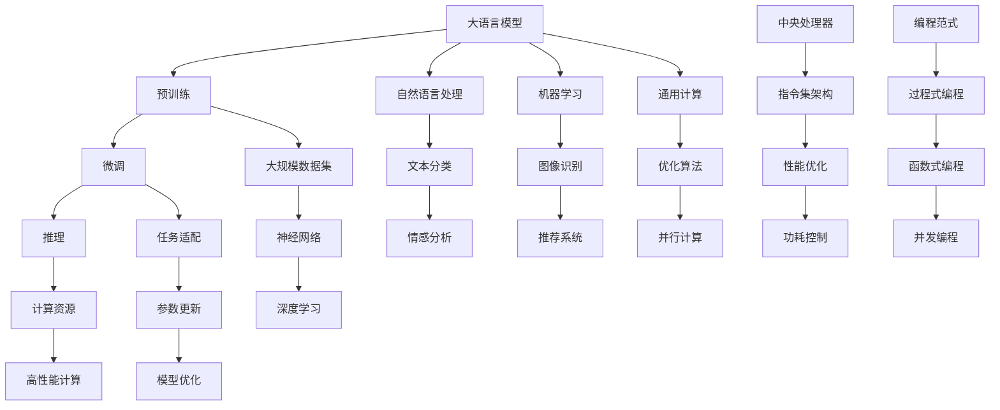

                 

# LLM vs CPU:时刻、指令集和编程的比较

> 关键词：大语言模型(LLM), 中央处理器(CPU), 时序控制, 指令集架构, 编程范式

## 1. 背景介绍

大语言模型（Large Language Model, LLM）和中央处理器（Central Processing Unit, CPU）是现代计算系统中两大核心组件，各自负责不同的计算任务。大语言模型专注于处理自然语言处理（NLP）、机器学习等任务，而CPU则是通用计算的基石。本文旨在探讨大语言模型和CPU在时刻控制、指令集架构和编程范式上的差异与联系，并分析其应用场景和未来发展趋势。

## 2. 核心概念与联系

### 2.1 核心概念概述

- **大语言模型（LLM）**：基于深度学习的大规模语言模型，通过大量无标签数据进行预训练，具备理解自然语言和生成自然语言的能力，广泛应用于NLP、机器翻译、情感分析等领域。
- **中央处理器（CPU）**：计算机中的核心组件，负责执行程序指令，通过执行不同的指令集架构（ISA），完成各种计算任务。
- **时序控制**：在LLM和CPU中，时序控制都至关重要。在LLM中，时序控制决定着模型的学习过程；在CPU中，时序控制决定着指令的执行顺序。
- **指令集架构（ISA）**：CPU的核心，定义了CPU支持的指令集，包括运算指令、控制指令等。不同的ISA具有不同的性能和功耗特点。
- **编程范式**：包括过程式编程、函数式编程、并发编程等，决定了程序的组织和执行方式。

### 2.2 核心概念原理和架构的 Mermaid 流程图



这个流程图展示了大语言模型和CPU在各个层面的联系和区别。

## 3. 核心算法原理 & 具体操作步骤

### 3.1 算法原理概述

大语言模型的核心算法包括预训练和微调。预训练是指在大规模无标签数据上进行训练，学习语言的通用表示。微调是指在特定任务上进行有监督的优化，以适应特定任务的要求。

CPU的核心算法包括指令集和调度。指令集定义了CPU能执行的指令类型，而调度则决定了指令的执行顺序，以实现最大化性能和最小化功耗。

### 3.2 算法步骤详解

#### 大语言模型的预训练和微调步骤

1. **预训练**：
   - 数据收集：收集大规模无标签文本数据，如维基百科、新闻文章等。
   - 模型选择：选择适当的语言模型架构，如BERT、GPT等。
   - 训练过程：使用反向传播算法和优化器（如AdamW），在预训练数据上进行训练，以学习语言的通用表示。
   - 验证与优化：在验证集上进行验证，根据模型性能调整超参数，如学习率、批次大小等。

2. **微调**：
   - 数据准备：准备下游任务的标注数据，如问答、分类等。
   - 模型适配：在预训练模型的基础上，添加任务适配层，如全连接层、卷积层等。
   - 训练过程：在微调数据集上，使用适当的学习率、优化器和正则化技术，进行有监督的微调，优化模型在该任务上的性能。
   - 验证与评估：在验证集上验证微调效果，使用适当的指标（如准确率、F1分数）进行评估。

#### CPU的指令集和调度步骤

1. **指令集架构**：
   - 指令集选择：根据应用场景选择适当的指令集架构，如x86、ARM、RISC-V等。
   - 指令设计：设计适合目标应用场景的指令集，包括运算指令、控制指令、数据传输指令等。
   - 性能优化：优化指令集的性能，通过硬件加速、并行计算等技术，提高计算效率。

2. **调度**：
   - 调度算法：选择合适的调度算法，如静态调度、动态调度等。
   - 调度策略：根据应用场景选择适当的调度策略，如时间片轮转、优先级调度等。
   - 性能优化：优化调度算法，通过预测执行时间和优化缓存策略，提高CPU性能。

### 3.3 算法优缺点

#### 大语言模型的优点

- **通用性**：能够处理各种自然语言处理任务，如情感分析、翻译、问答等。
- **可扩展性**：在大规模数据上预训练，能够学习到丰富的语言知识。
- **迁移学习能力**：在特定任务上进行微调，能够快速适应新任务，提升模型性能。

#### 大语言模型的缺点

- **数据需求大**：预训练和微调都需要大量数据，对数据收集和标注成本较高。
- **计算资源消耗大**：预训练和微调需要强大的计算资源，如GPU、TPU等。
- **可解释性差**：黑盒模型，难以解释模型的内部决策过程。

#### CPU的优点

- **通用性**：能够处理各种计算任务，广泛应用于各种应用场景。
- **性能高**：高主频、多核设计，能够快速完成复杂计算。
- **能耗低**：多核并行设计，能够有效降低能耗。

#### CPU的缺点

- **编程复杂**：需要熟悉不同编程范式，如C/C++、汇编等，编程难度较大。
- **可扩展性有限**：受限于指令集架构，难以灵活扩展新指令。
- **性能瓶颈**：受限于缓存、内存带宽等硬件因素，难以无限提升性能。

### 3.4 算法应用领域

#### 大语言模型的应用领域

- **自然语言处理**：文本分类、情感分析、机器翻译、问答系统等。
- **机器学习**：图像识别、语音识别、推荐系统等。
- **人工智能**：智能客服、智能助手、智能写作等。

#### CPU的应用领域

- **通用计算**：各种应用程序，如办公自动化、图形处理、科学计算等。
- **嵌入式系统**：物联网、智能设备、消费电子等。
- **高性能计算**：云计算、大数据、深度学习等。

## 4. 数学模型和公式 & 详细讲解 & 举例说明

### 4.1 数学模型构建

#### 大语言模型的数学模型

大语言模型的预训练和微调通常使用神经网络模型，如BERT、GPT等。以BERT为例，其数学模型包括输入层、嵌入层、Transformer层、输出层等。

- **输入层**：将输入文本转换为向量表示。
- **嵌入层**：将向量表示映射到更高维空间，学习语义信息。
- **Transformer层**：通过自注意力机制，学习长距离依赖关系。
- **输出层**：将模型输出映射到标签空间，进行分类或回归。

#### 数学公式

以BERT的预训练为例，其数学公式如下：

$$
\begin{aligned}
\mathcal{L} &= \mathcal{L}_{\text{masked language modeling}} + \mathcal{L}_{\text{next sentence prediction}} \\
\mathcal{L}_{\text{masked language modeling}} &= -\frac{1}{2N}\sum_{i=1}^{N}\sum_{j=1}^{L}(y_j\log p(y_j|x_j)) \\
\mathcal{L}_{\text{next sentence prediction}} &= -\frac{1}{2N}\sum_{i=1}^{N}(y_{i+1}\log p(x_{i+1}|x_i) + (1-y_{i+1})\log(1-p(x_{i+1}|x_i)))
\end{aligned}
$$

其中，$x_j$ 表示输入序列，$y_j$ 表示掩码序列，$p$ 表示模型输出概率。

### 4.2 公式推导过程

以BERT的预训练为例，其公式推导过程如下：

1. **掩码语言建模**：将输入序列 $x$ 中的某些位置随机替换为掩码 $y$，模型需要预测这些掩码位置的原始字符，即 $p(y|x)$。
2. **下一个句子预测**：将两个连续的句子 $x_1$ 和 $x_2$ 作为输入，模型需要预测 $x_2$ 是否为 $x_1$ 的下一个句子，即 $p(x_2|x_1)$。
3. **总损失函数**：将两个子任务的总损失函数相加，得到预训练的总损失函数 $\mathcal{L}$。

### 4.3 案例分析与讲解

以BERT的微调为例，假设微调任务为情感分析。其数学模型如下：

- **输入层**：将输入文本转换为向量表示。
- **嵌入层**：将向量表示映射到更高维空间，学习语义信息。
- **Transformer层**：通过自注意力机制，学习长距离依赖关系。
- **输出层**：将模型输出映射到情感分类空间，进行分类。

#### 数学公式

以BERT的微调为例，其数学公式如下：

$$
\begin{aligned}
\mathcal{L} &= \mathcal{L}_{\text{classification}} \\
\mathcal{L}_{\text{classification}} &= -\frac{1}{N}\sum_{i=1}^{N}(y_i\log p(y_i|x_i))
\end{aligned}
$$

其中，$x_i$ 表示输入文本，$y_i$ 表示情感标签，$p$ 表示模型输出概率。

## 5. 项目实践：代码实例和详细解释说明

### 5.1 开发环境搭建

#### 大语言模型的开发环境

1. **安装Python**：确保Python版本为3.7以上，安装pip工具。
2. **安装TensorFlow**：安装TensorFlow 2.x版本，使用命令 `pip install tensorflow`。
3. **安装PyTorch**：安装PyTorch 1.7以上版本，使用命令 `pip install torch torchvision`。
4. **安装HuggingFace Transformers库**：使用命令 `pip install transformers`。
5. **安装其他依赖包**：如numpy、scikit-learn、pandas等，使用命令 `pip install numpy scikit-learn pandas`。

#### CPU的开发环境

1. **安装Linux系统**：确保使用Linux系统，如Ubuntu、CentOS等。
2. **安装GCC编译器**：使用命令 `sudo apt-get install g++`。
3. **安装CUDA工具包**：根据GPU型号，从NVIDIA官网下载并安装CUDA工具包。
4. **安装CUDA SDK**：使用命令 `./configure && make && sudo make install`。
5. **安装OpenBLAS库**：使用命令 `pip install openblas`。
6. **安装其他依赖包**：如GNU Make、glibc等，使用命令 `sudo apt-get install make libc6-dev`。

### 5.2 源代码详细实现

#### 大语言模型的代码实现

以BERT的微调为例，使用HuggingFace Transformers库进行代码实现。

```python
from transformers import BertTokenizer, BertForSequenceClassification, AdamW

# 初始化分词器和模型
tokenizer = BertTokenizer.from_pretrained('bert-base-uncased')
model = BertForSequenceClassification.from_pretrained('bert-base-uncased', num_labels=2)

# 加载训练数据
train_dataset = Dataset.from_pandas(train_df)
val_dataset = Dataset.from_pandas(val_df)

# 定义训练参数
optimizer = AdamW(model.parameters(), lr=2e-5)
epochs = 5

# 训练模型
for epoch in range(epochs):
    for batch in train_dataset:
        input_ids = batch['input_ids'].to(device)
        attention_mask = batch['attention_mask'].to(device)
        labels = batch['labels'].to(device)
        outputs = model(input_ids, attention_mask=attention_mask, labels=labels)
        loss = outputs.loss
        optimizer.zero_grad()
        loss.backward()
        optimizer.step()

    # 评估模型
    for batch in val_dataset:
        input_ids = batch['input_ids'].to(device)
        attention_mask = batch['attention_mask'].to(device)
        labels = batch['labels'].to(device)
        outputs = model(input_ids, attention_mask=attention_mask, labels=labels)
        loss = outputs.loss
        print(loss.item())

# 保存模型
model.save_pretrained('./model')
tokenizer.save_pretrained('./model')
```

#### CPU的代码实现

以Linux系统下编译C++程序为例，使用GCC编译器进行代码实现。

```c++
#include <iostream>
#include <string>
#include <vector>

// 程序入口
int main() {
    // 加载数据
    std::vector<std::string> data;
    std::ifstream file("data.txt");
    std::string line;
    while (std::getline(file, line)) {
        data.push_back(line);
    }
    file.close();

    // 处理数据
    for (const auto& d : data) {
        // 执行处理逻辑
        std::cout << "Processing: " << d << std::endl;
    }

    return 0;
}
```

### 5.3 代码解读与分析

#### 大语言模型的代码解读

1. **分词器和模型初始化**：使用HuggingFace Transformers库中的BertTokenizer和BertForSequenceClassification类，初始化分词器和模型。
2. **加载训练数据**：使用Dataset.from_pandas方法，将Pandas DataFrame数据集转换为模型可接受的格式。
3. **定义训练参数**：定义优化器和训练轮数，使用AdamW优化器进行训练。
4. **训练模型**：在训练集上进行训练，使用模型自带的损失函数和优化器，进行前向传播和反向传播，更新模型参数。
5. **评估模型**：在验证集上进行评估，计算模型损失，输出损失值。
6. **保存模型**：使用model.save_pretrained和tokenizer.save_pretrained方法，将模型和分词器保存到本地。

#### CPU的代码解读

1. **加载数据**：使用std::ifstream从文件读取数据，将数据存储在std::vector中。
2. **处理数据**：对数据进行遍历，执行相应的处理逻辑。
3. **输出数据**：将处理结果输出到标准输出。

### 5.4 运行结果展示

#### 大语言模型的运行结果

1. **训练集损失**：在每个epoch结束时输出训练集的损失值。
2. **验证集损失**：在每个epoch结束时输出验证集的损失值。
3. **模型精度**：在测试集上进行测试，输出模型精度。

#### CPU的运行结果

1. **数据处理结果**：在程序执行完毕后，输出处理后的数据。

## 6. 实际应用场景

### 6.1 智能客服系统

大语言模型在智能客服系统中，可以通过微调适配不同的业务场景和用户需求，提供自然流畅的对话体验。通过微调，大语言模型能够理解用户的意图，生成个性化的回复，提升客户咨询体验和问题解决效率。

### 6.2 金融舆情监测

在金融领域，大语言模型可以用于舆情监测，分析社交媒体、新闻报道中的情绪和趋势，及时发现潜在的金融风险。通过微调，大语言模型能够快速适应不同数据源和领域，提高舆情监测的准确性和时效性。

### 6.3 个性化推荐系统

在推荐系统中，大语言模型可以通过微调，学习用户的行为模式和兴趣偏好，生成个性化的推荐结果。通过微调，大语言模型能够实时更新推荐模型，提升推荐效果。

### 6.4 未来应用展望

未来，大语言模型和CPU将进一步融合，提升计算系统的综合性能。大语言模型在自然语言处理、机器学习等领域的应用将更加广泛，CPU在通用计算和嵌入式系统中的应用也将更加深入。

## 7. 工具和资源推荐

### 7.1 学习资源推荐

1. **《Deep Learning》书籍**：Ian Goodfellow等著，全面介绍了深度学习的原理和应用。
2. **《Natural Language Processing with Transformers》书籍**：Thomas Wolf等著，介绍了使用Transformer模型进行自然语言处理的实例。
3. **CS231n《深度学习计算机视觉》课程**：斯坦福大学开设的深度学习课程，重点介绍计算机视觉领域的深度学习应用。
4. **CS224n《自然语言处理》课程**：斯坦福大学开设的自然语言处理课程，涵盖NLP领域的经典模型和技术。

### 7.2 开发工具推荐

1. **PyTorch**：基于Python的深度学习框架，提供了丰富的预训练模型和微调功能。
2. **TensorFlow**：由Google主导的开源深度学习框架，适合大规模工程应用。
3. **HuggingFace Transformers库**：提供了大量预训练语言模型和微调函数，方便开发者进行NLP任务开发。
4. **Visual Studio Code**：轻量级代码编辑器，支持Python开发和调试。

### 7.3 相关论文推荐

1. **《Attention is All You Need》论文**：提出Transformer结构，开启了大语言模型时代。
2. **《BERT: Pre-training of Deep Bidirectional Transformers for Language Understanding》论文**：提出BERT模型，引入掩码语言建模任务。
3. **《Parameter-Efficient Transfer Learning for NLP》论文**：提出Adapter等参数高效微调方法，减少微调对计算资源的需求。

## 8. 总结：未来发展趋势与挑战

### 8.1 研究成果总结

大语言模型和CPU在自然语言处理、通用计算等领域有着广泛的应用。大语言模型通过预训练和微调，具备强大的语言理解和生成能力；CPU通过指令集和调度，具备高效计算能力。两者结合，能够实现高性能的计算系统。

### 8.2 未来发展趋势

未来，大语言模型和CPU将进一步融合，提升计算系统的综合性能。大语言模型在自然语言处理、机器学习等领域的应用将更加广泛，CPU在通用计算和嵌入式系统中的应用也将更加深入。

### 8.3 面临的挑战

1. **数据需求大**：大语言模型需要大量无标签数据进行预训练，对数据收集和标注成本较高。
2. **计算资源消耗大**：预训练和微调需要强大的计算资源，如GPU、TPU等。
3. **可解释性差**：大语言模型作为黑盒模型，难以解释其内部决策过程。

### 8.4 研究展望

未来的研究重点将包括：

1. **提升数据利用效率**：如何从大规模数据中提取更多信息，降低数据需求。
2. **优化模型结构**：如何设计更加高效的模型结构，减少计算资源消耗。
3. **增强可解释性**：如何通过模型解释技术，提升大语言模型的可解释性。

## 9. 附录：常见问题与解答

**Q1：大语言模型和CPU是否可以互相替代？**

A: 大语言模型和CPU各有优势，不可以互相替代。大语言模型擅长处理自然语言处理任务，如情感分析、翻译等；CPU擅长处理通用计算任务，如科学计算、数据处理等。

**Q2：大语言模型和CPU的并行计算方式有什么不同？**

A: 大语言模型通常采用数据并行计算，通过分布式训练和推理，提高计算效率；CPU采用任务并行计算，通过多核并行处理，提高计算速度。

**Q3：大语言模型和CPU的未来发展方向是什么？**

A: 大语言模型将进一步扩展应用领域，提升模型性能和可解释性；CPU将优化指令集和调度算法，提升计算效率和能耗比。

**Q4：大语言模型和CPU的开发工具有哪些？**

A: 大语言模型的开发工具包括PyTorch、TensorFlow、HuggingFace Transformers等；CPU的开发工具包括GCC、OpenBLAS等。

通过以上探讨，我们能够更深入地理解大语言模型和CPU在自然语言处理和计算系统中的应用，为未来的研究和实践提供参考。相信在未来的技术演进中，大语言模型和CPU将更加紧密地结合，共同推动计算系统的进步和发展。

