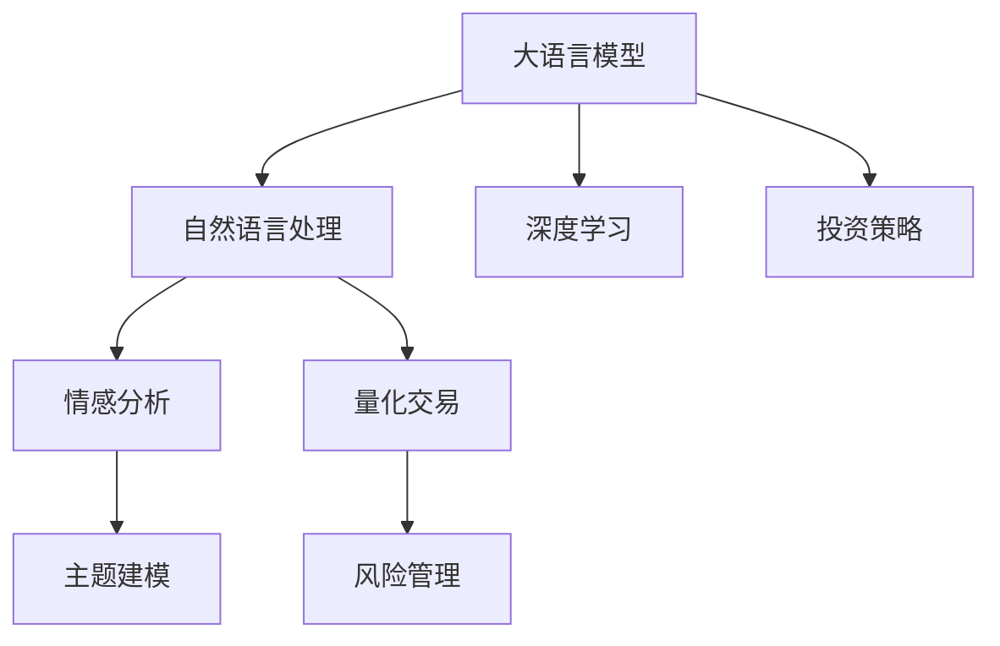

                 

# LLM 在金融领域：高效的投资策略和风险管理

> 关键词：大语言模型, 金融投资, 量化交易, 风险管理, 自然语言处理, 深度学习, 算法优化

## 1. 背景介绍

### 1.1 问题由来

在金融行业，面对复杂多变的市场环境和海量信息，投资者需要在短时间内做出精准的投资决策。传统的基于规则和手工经验的投资策略，往往依赖于人工分析和经验判断，容易受个人主观偏见和市场波动影响，且无法动态适应实时数据的变化。

随着数据处理和计算技术的发展，量化交易逐渐成为金融市场的主流。量化交易使用数学模型和算法，自动化地进行投资决策，大幅提升了投资策略的科学性和效率。然而，构建复杂量化模型的成本高、周期长，且需要对金融市场有深入的数学和经济理论背景。

近年来，随着深度学习技术的突破，大语言模型在自然语言处理(NLP)领域取得了显著成果，被成功应用于金融行业。大语言模型通过学习金融新闻、公告、评论等文本数据，能够自动化地获取市场信息和情感倾向，从而提升投资策略的精准度和鲁棒性。

### 1.2 问题核心关键点

大语言模型在金融领域的应用，主要集中在以下几个关键点：

1. **自动化信息抽取**：利用大语言模型自动从新闻、公告、社交媒体等文本数据中抽取关键信息，生成投资策略的输入特征。
2. **情感分析**：对市场评论、交易数据等进行情感分析，判断市场情绪和趋势，辅助投资决策。
3. **主题建模**：利用主题模型对大量金融文档进行聚类分析，提取金融事件和主题，辅助理解市场变化。
4. **机器学习策略**：结合大语言模型和其他机器学习算法，构建自动化交易模型，实现量化交易。
5. **风险管理**：利用大语言模型对金融风险进行预测和评估，帮助投资者规避风险。

这些应用点共同构成了大语言模型在金融领域的主要研究方向，使得其在自动化投资策略和风险管理中发挥重要作用。

## 2. 核心概念与联系

### 2.1 核心概念概述

为更好地理解大语言模型在金融领域的应用，本节将介绍几个关键概念：

- 大语言模型(Large Language Model, LLM)：以Transformer模型为代表的深度学习模型，通过大规模预训练和微调，具备强大的语言理解和生成能力。

- 自然语言处理(Natural Language Processing, NLP)：研究如何使计算机能够理解和处理人类语言的技术，包括文本预处理、特征提取、模型训练等。

- 深度学习(Deep Learning)：基于神经网络架构的学习算法，通过多层神经元进行特征提取和抽象，能够处理高维度数据。

- 量化交易(Quantitative Trading)：使用数学模型和算法自动化进行投资决策，提升交易效率和准确性。

- 情感分析(Sentiment Analysis)：利用自然语言处理技术，对文本情感进行自动分类，识别市场情绪和趋势。

- 主题建模(Thematic Modeling)：通过聚类分析文本，发现潜在的主题和模式，辅助理解市场变化。

- 风险管理(Risk Management)：对金融市场的风险进行预测和评估，辅助投资者进行风险控制。

这些概念之间的逻辑关系可以通过以下Mermaid流程图来展示：



这个流程图展示了大语言模型的核心概念及其之间的关系：

1. 大语言模型通过深度学习进行预训练，学习语言知识和表示。
2. 利用自然语言处理技术，自动从文本中提取关键信息。
3. 情感分析对文本情感进行自动分类，辅助理解市场情绪。
4. 主题建模对文本进行聚类分析，辅助理解市场变化。
5. 量化交易使用模型自动化进行投资决策，提升交易效率。
6. 风险管理对市场风险进行预测和评估，辅助投资者控制风险。

这些概念共同构成了大语言模型在金融领域的应用框架，使其能够在自动化投资策略和风险管理中发挥重要作用。通过理解这些核心概念，我们可以更好地把握大语言模型的工作原理和优化方向。

## 3. 核心算法原理 & 具体操作步骤

### 3.1 算法原理概述

大语言模型在金融领域的应用，主要基于监督学习和无监督学习两种范式：

- 监督学习：利用已标注的金融数据进行模型训练，预测未来市场趋势和风险。
- 无监督学习：从未标注的金融文本数据中自动提取特征，进行情感分析和主题建模，辅助理解市场变化。

监督学习的大语言模型，通常采用以下步骤：

1. **数据准备**：收集和处理金融数据，包括股票价格、新闻、公告、评论等。
2. **模型训练**：选择适合的大语言模型，如BERT、GPT等，在标注数据上进行微调。
3. **特征提取**：利用微调后的模型，自动从文本中提取关键特征，如情绪、主题、事件等。
4. **策略建模**：结合特征提取结果和数学模型，构建投资策略模型。
5. **风险评估**：利用模型预测市场风险，辅助投资者进行风险控制。

无监督学习的大语言模型，通常采用以下步骤：

1. **文本预处理**：清洗和标准化金融文本数据。
2. **特征提取**：利用主题模型和情感分析模型，从文本中提取主题和情感特征。
3. **聚类分析**：对提取的主题和情感特征进行聚类分析，识别市场变化。
4. **投资策略**：结合聚类结果和市场趋势，构建自动化交易策略。
5. **风险评估**：利用模型预测市场风险，辅助投资者进行风险控制。

### 3.2 算法步骤详解

#### 3.2.1 监督学习步骤

1. **数据准备**：收集金融数据，包括股票价格、新闻、公告、评论等。

2. **模型训练**：选择BERT、GPT等大语言模型，使用标注数据进行微调。例如，使用以下代码对BERT模型进行微调：

```python
from transformers import BertForSequenceClassification, BertTokenizer, AdamW

tokenizer = BertTokenizer.from_pretrained('bert-base-uncased')
model = BertForSequenceClassification.from_pretrained('bert-base-uncased', num_labels=2)
optimizer = AdamW(model.parameters(), lr=2e-5)

# 假设训练数据为 X_train 和 y_train
X_train = X_train
y_train = y_train

# 训练模型
for epoch in range(epochs):
    optimizer.zero_grad()
    outputs = model(X_train, attention_mask=torch.tensor([1]*len(X_train)), labels=y_train)
    loss = outputs.loss
    loss.backward()
    optimizer.step()
```

3. **特征提取**：利用微调后的模型，自动从文本中提取关键特征，如情绪、主题、事件等。例如，使用以下代码提取新闻文本的情绪：

```python
from transformers import pipeline
nlp = pipeline('sentiment-analysis')
result = nlp(news_text)[0]
sentiment = result['label']
```

4. **策略建模**：结合特征提取结果和数学模型，构建投资策略模型。例如，使用以下代码构建线性回归模型：

```python
from sklearn.linear_model import LinearRegression

X = X_train
y = y_train
model = LinearRegression()
model.fit(X, y)
```

5. **风险评估**：利用模型预测市场风险，辅助投资者进行风险控制。例如，使用以下代码预测股票价格风险：

```python
from sklearn.metrics import mean_squared_error

X_test = X_test
y_test = y_test
preds = model.predict(X_test)
mse = mean_squared_error(y_test, preds)
```

#### 3.2.2 无监督学习步骤

1. **文本预处理**：清洗和标准化金融文本数据。例如，使用以下代码进行文本清洗：

```python
import re
def clean_text(text):
    text = re.sub('[^a-zA-Z0-9 ]+', '', text)
    text = text.lower()
    return text
```

2. **特征提取**：利用主题模型和情感分析模型，从文本中提取主题和情感特征。例如，使用以下代码提取主题：

```python
from gensim.models import LdaModel

corpus = [clean_text(text) for text in X_train]
lda_model = LdaModel(corpus, num_topics=10, id2word=id2word)
topics = [lda_model.get_document_topics(text) for text in corpus]
```

3. **聚类分析**：对提取的主题和情感特征进行聚类分析，识别市场变化。例如，使用以下代码进行K-means聚类：

```python
from sklearn.cluster import KMeans
clustering = KMeans(n_clusters=5)
clusters = clustering.fit_predict(topics)
```

4. **投资策略**：结合聚类结果和市场趋势，构建自动化交易策略。例如，使用以下代码构建基于聚类结果的交易策略：

```python
import pandas as pd
def get_strategy(df, clusters):
    strategy = []
    for i, cluster in enumerate(clusters):
        if cluster == 0:
            strategy.append('sell')
        else:
            strategy.append('buy')
    return strategy
```

5. **风险评估**：利用模型预测市场风险，辅助投资者进行风险控制。例如，使用以下代码预测市场风险：

```python
from sklearn.metrics import accuracy_score

X_test = X_test
y_test = y_test
strategy = get_strategy(X_test, clusters)
accuracy = accuracy_score(y_test, strategy)
```

### 3.3 算法优缺点

大语言模型在金融领域的应用，具有以下优点：

1. **自动化信息提取**：利用大语言模型自动从大量文本数据中提取关键信息，减少人工分析成本。
2. **情感分析**：对市场情绪进行自动分类，辅助投资者判断市场趋势。
3. **主题建模**：利用主题模型对文本进行聚类分析，识别潜在市场变化。
4. **量化交易**：结合数学模型和深度学习算法，构建自动化交易策略，提升交易效率和准确性。
5. **风险管理**：利用模型预测市场风险，辅助投资者进行风险控制。

同时，大语言模型在金融领域的应用也存在以下局限性：

1. **数据依赖**：需要大量的标注数据进行模型训练，标注成本较高。
2. **模型鲁棒性**：在市场波动较大的情况下，模型可能出现波动或预测失误。
3. **参数量庞大**：大语言模型的参数量庞大，训练和推理需要大量资源。
4. **可解释性不足**：大语言模型的决策过程缺乏可解释性，难以理解和调试。
5. **潜在风险**：大语言模型可能学习到市场偏见和噪声，导致投资策略失效。

尽管存在这些局限性，但大语言模型在金融领域的应用前景依然广阔。未来需要进一步优化模型算法，降低对标注数据的依赖，提高模型的可解释性和鲁棒性，才能更好地服务于金融市场的投资决策。

### 3.4 算法应用领域

大语言模型在金融领域的应用，主要涵盖以下几个领域：

1. **投资策略**：利用大语言模型进行自动化信息提取、情感分析和主题建模，辅助构建量化交易策略。
2. **风险管理**：利用大语言模型预测市场风险，辅助投资者进行风险控制。
3. **量化研究**：利用大语言模型进行市场情绪分析、主题建模等，辅助量化研究。
4. **智能投顾**：利用大语言模型进行客户互动、智能推荐等，提升智能投顾系统的效果。
5. **合规监管**：利用大语言模型进行合规文档分析、舆情监测等，辅助合规监管。

这些应用领域共同构成了大语言模型在金融领域的主要研究方向，使得其在自动化投资策略和风险管理中发挥重要作用。

## 4. 数学模型和公式 & 详细讲解 & 举例说明

### 4.1 数学模型构建

大语言模型在金融领域的应用，主要基于监督学习和无监督学习两种范式。以下是监督学习和无监督学习的基本数学模型：

#### 监督学习模型

假设训练数据集为 $\{(x_i, y_i)\}_{i=1}^N$，其中 $x_i$ 为输入，$y_i$ 为标注标签。大语言模型 $M_{\theta}$ 的输入为金融文本数据 $x_i$，输出为投资策略结果 $y_i$。模型参数 $\theta$ 通过最小化损失函数 $\mathcal{L}(\theta)$ 进行优化。例如，假设模型输出为二分类结果，交叉熵损失函数为：

$$
\mathcal{L}(\theta) = -\frac{1}{N} \sum_{i=1}^N y_i \log M_{\theta}(x_i) + (1 - y_i) \log (1 - M_{\theta}(x_i))
$$

#### 无监督学习模型

假设未标注数据集为 $\{(x_i)\}_{i=1}^N$，其中 $x_i$ 为金融文本数据。大语言模型 $M_{\theta}$ 的输入为金融文本数据 $x_i$，输出为主题和情感特征 $z_i$。模型参数 $\theta$ 通过最大化似然函数 $\mathcal{P}(z_i | x_i)$ 进行优化。例如，假设模型输出为5个主题，每个主题的分布为 $\mathcal{N}$，则高斯混合模型为：

$$
\mathcal{P}(z_i | x_i) = \sum_{k=1}^5 \alpha_k \mathcal{N}(z_i | \mu_k, \sigma_k) \mathcal{P}(z_i | x_i)
$$

### 4.2 公式推导过程

#### 监督学习公式推导

监督学习的大语言模型，通常采用以下步骤进行推导：

1. **损失函数推导**：假设模型输出为二分类结果，交叉熵损失函数为：

$$
\mathcal{L}(\theta) = -\frac{1}{N} \sum_{i=1}^N y_i \log M_{\theta}(x_i) + (1 - y_i) \log (1 - M_{\theta}(x_i))
$$

2. **梯度计算**：利用链式法则计算损失函数对模型参数 $\theta$ 的梯度：

$$
\nabla_{\theta}\mathcal{L}(\theta) = -\frac{1}{N} \sum_{i=1}^N (y_i - M_{\theta}(x_i)) \nabla_{\theta}M_{\theta}(x_i)
$$

3. **优化算法**：使用梯度下降等优化算法，更新模型参数 $\theta$，最小化损失函数 $\mathcal{L}(\theta)$。例如，使用Adam优化算法进行优化：

$$
\theta_{t+1} = \theta_t - \eta \nabla_{\theta}\mathcal{L}(\theta)
$$

#### 无监督学习公式推导

无监督学习的大语言模型，通常采用以下步骤进行推导：

1. **似然函数推导**：假设模型输出为主题和情感特征，高斯混合模型为：

$$
\mathcal{P}(z_i | x_i) = \sum_{k=1}^5 \alpha_k \mathcal{N}(z_i | \mu_k, \sigma_k) \mathcal{P}(z_i | x_i)
$$

2. **梯度计算**：利用最大似然估计，计算似然函数对模型参数 $\theta$ 的梯度：

$$
\nabla_{\theta}\mathcal{P}(z_i | x_i) = \sum_{i=1}^N \nabla_{\theta}\log \mathcal{P}(z_i | x_i)
$$

3. **优化算法**：使用梯度上升等优化算法，更新模型参数 $\theta$，最大化似然函数 $\mathcal{P}(z_i | x_i)$。例如，使用EM算法进行优化：

$$
\theta_{t+1} = \theta_t + \eta \nabla_{\theta}\mathcal{P}(z_i | x_i)
$$

### 4.3 案例分析与讲解

#### 案例1：投资策略构建

假设某金融机构想要利用大语言模型进行自动化投资策略构建。其步骤如下：

1. **数据准备**：收集历史股票价格、新闻、公告、评论等数据。

2. **模型训练**：选择BERT模型，使用标注数据进行微调。例如，使用以下代码对BERT模型进行微调：

```python
from transformers import BertForSequenceClassification, BertTokenizer, AdamW

tokenizer = BertTokenizer.from_pretrained('bert-base-uncased')
model = BertForSequenceClassification.from_pretrained('bert-base-uncased', num_labels=2)
optimizer = AdamW(model.parameters(), lr=2e-5)

# 假设训练数据为 X_train 和 y_train
X_train = X_train
y_train = y_train

# 训练模型
for epoch in range(epochs):
    optimizer.zero_grad()
    outputs = model(X_train, attention_mask=torch.tensor([1]*len(X_train)), labels=y_train)
    loss = outputs.loss
    loss.backward()
    optimizer.step()
```

3. **特征提取**：利用微调后的模型，自动从文本中提取关键特征，如情绪、主题、事件等。例如，使用以下代码提取新闻文本的情绪：

```python
from transformers import pipeline
nlp = pipeline('sentiment-analysis')
result = nlp(news_text)[0]
sentiment = result['label']
```

4. **策略建模**：结合特征提取结果和数学模型，构建投资策略模型。例如，使用以下代码构建线性回归模型：

```python
from sklearn.linear_model import LinearRegression

X = X_train
y = y_train
model = LinearRegression()
model.fit(X, y)
```

5. **风险评估**：利用模型预测市场风险，辅助投资者进行风险控制。例如，使用以下代码预测股票价格风险：

```python
from sklearn.metrics import mean_squared_error

X_test = X_test
y_test = y_test
preds = model.predict(X_test)
mse = mean_squared_error(y_test, preds)
```

#### 案例2：无监督学习主题建模

假设某金融机构想要利用大语言模型进行主题建模。其步骤如下：

1. **数据准备**：收集金融新闻、公告、评论等数据。

2. **文本预处理**：清洗和标准化金融文本数据。例如，使用以下代码进行文本清洗：

```python
import re
def clean_text(text):
    text = re.sub('[^a-zA-Z0-9 ]+', '', text)
    text = text.lower()
    return text
```

3. **特征提取**：利用主题模型和情感分析模型，从文本中提取主题和情感特征。例如，使用以下代码提取主题：

```python
from gensim.models import LdaModel

corpus = [clean_text(text) for text in X_train]
lda_model = LdaModel(corpus, num_topics=10, id2word=id2word)
topics = [lda_model.get_document_topics(text) for text in corpus]
```

4. **聚类分析**：对提取的主题和情感特征进行聚类分析，识别市场变化。例如，使用以下代码进行K-means聚类：

```python
from sklearn.cluster import KMeans
clustering = KMeans(n_clusters=5)
clusters = clustering.fit_predict(topics)
```

5. **投资策略**：结合聚类结果和市场趋势，构建自动化交易策略。例如，使用以下代码构建基于聚类结果的交易策略：

```python
import pandas as pd
def get_strategy(df, clusters):
    strategy = []
    for i, cluster in enumerate(clusters):
        if cluster == 0:
            strategy.append('sell')
        else:
            strategy.append('buy')
    return strategy
```

6. **风险评估**：利用模型预测市场风险，辅助投资者进行风险控制。例如，使用以下代码预测市场风险：

```python
from sklearn.metrics import accuracy_score

X_test = X_test
y_test = y_test
strategy = get_strategy(X_test, clusters)
accuracy = accuracy_score(y_test, strategy)
```

### 4.4 案例分析与讲解

通过上述两个案例，我们可以看到大语言模型在金融领域的强大应用能力。无论是有监督学习还是无监督学习，大语言模型都能够自动化地处理金融文本数据，提取关键特征，辅助构建投资策略和风险管理模型。

## 5. 项目实践：代码实例和详细解释说明

### 5.1 开发环境搭建

在进行金融领域大语言模型应用开发前，我们需要准备好开发环境。以下是使用Python进行PyTorch开发的环境配置流程：

1. 安装Anaconda：从官网下载并安装Anaconda，用于创建独立的Python环境。

2. 创建并激活虚拟环境：
```bash
conda create -n pytorch-env python=3.8 
conda activate pytorch-env
```

3. 安装PyTorch：根据CUDA版本，从官网获取对应的安装命令。例如：
```bash
conda install pytorch torchvision torchaudio cudatoolkit=11.1 -c pytorch -c conda-forge
```

4. 安装Transformers库：
```bash
pip install transformers
```

5. 安装各类工具包：
```bash
pip install numpy pandas scikit-learn matplotlib tqdm jupyter notebook ipython
```

完成上述步骤后，即可在`pytorch-env`环境中开始金融领域大语言模型应用的开发实践。

### 5.2 源代码详细实现

这里我们以情感分析模型为例，给出使用Transformers库对BERT模型进行微调的PyTorch代码实现。

首先，定义情感分析任务的数据处理函数：

```python
from transformers import BertTokenizer
from torch.utils.data import Dataset
import torch

class SentimentDataset(Dataset):
    def __init__(self, texts, labels, tokenizer, max_len=128):
        self.texts = texts
        self.labels = labels
        self.tokenizer = tokenizer
        self.max_len = max_len
        
    def __len__(self):
        return len(self.texts)
    
    def __getitem__(self, item):
        text = self.texts[item]
        label = self.labels[item]
        
        encoding = self.tokenizer(text, return_tensors='pt', max_length=self.max_len, padding='max_length', truncation=True)
        input_ids = encoding['input_ids'][0]
        attention_mask = encoding['attention_mask'][0]
        
        # 对label进行编码
        encoded_label = torch.tensor([label2id[label]], dtype=torch.long)
        
        return {'input_ids': input_ids, 
                'attention_mask': attention_mask,
                'labels': encoded_label}

# 标签与id的映射
label2id = {'positive': 1, 'negative': 0}
id2label = {v: k for k, v in label2id.items()}

# 创建dataset
tokenizer = BertTokenizer.from_pretrained('bert-base-uncased')

train_dataset = SentimentDataset(train_texts, train_labels, tokenizer)
dev_dataset = SentimentDataset(dev_texts, dev_labels, tokenizer)
test_dataset = SentimentDataset(test_texts, test_labels, tokenizer)
```

然后，定义模型和优化器：

```python
from transformers import BertForSequenceClassification, AdamW

model = BertForSequenceClassification.from_pretrained('bert-base-uncased', num_labels=len(label2id))

optimizer = AdamW(model.parameters(), lr=2e-5)
```

接着，定义训练和评估函数：

```python
from torch.utils.data import DataLoader
from tqdm import tqdm
from sklearn.metrics import classification_report

device = torch.device('cuda') if torch.cuda.is_available() else torch.device('cpu')
model.to(device)

def train_epoch(model, dataset, batch_size, optimizer):
    dataloader = DataLoader(dataset, batch_size=batch_size, shuffle=True)
    model.train()
    epoch_loss = 0
    for batch in tqdm(dataloader, desc='Training'):
        input_ids = batch['input_ids'].to(device)
        attention_mask = batch['attention_mask'].to(device)
        labels = batch['labels'].to(device)
        model.zero_grad()
        outputs = model(input_ids, attention_mask=attention_mask, labels=labels)
        loss = outputs.loss
        epoch_loss += loss.item()
        loss.backward()
        optimizer.step()
    return epoch_loss / len(dataloader)

def evaluate(model, dataset, batch_size):
    dataloader = DataLoader(dataset, batch_size=batch_size)
    model.eval()
    preds, labels = [], []
    with torch.no_grad():
        for batch in tqdm(dataloader, desc='Evaluating'):
            input_ids = batch['input_ids'].to(device)
            attention_mask = batch['attention_mask'].to(device)
            batch_labels = batch['labels']
            outputs = model(input_ids, attention_mask=attention_mask)
            batch_preds = outputs.logits.argmax(dim=2).to('cpu').tolist()
            batch_labels = batch_labels.to('cpu').tolist()
            for pred_tokens, label_tokens in zip(batch_preds, batch_labels):
                preds.append(pred_tokens)
                labels.append(label_tokens)
                
    print(classification_report(labels, preds))
```

最后，启动训练流程并在测试集上评估：

```python
epochs = 5
batch_size = 16

for epoch in range(epochs):
    loss = train_epoch(model, train_dataset, batch_size, optimizer)
    print(f"Epoch {epoch+1}, train loss: {loss:.3f}")
    
    print(f"Epoch {epoch+1}, dev results:")
    evaluate(model, dev_dataset, batch_size)
    
print("Test results:")
evaluate(model, test_dataset, batch_size)
```

以上就是使用PyTorch对BERT进行情感分析模型微调的完整代码实现。可以看到，得益于Transformers库的强大封装，我们可以用相对简洁的代码完成BERT模型的加载和微调。

### 5.3 代码解读与分析

让我们再详细解读一下关键代码的实现细节：

**SentimentDataset类**：
- `__init__`方法：初始化文本、标签、分词器等关键组件。
- `__len__`方法：返回数据集的样本数量。
- `__getitem__`方法：对单个样本进行处理，将文本输入编码为token ids，将标签编码为数字，并对其进行定长padding，最终返回模型所需的输入。

**label2id和id2label字典**：
- 定义了标签与数字id之间的映射关系，用于将标签解码为字符串形式。

**训练和评估函数**：
- 使用PyTorch的DataLoader对数据集进行批次化加载，供模型训练和推理使用。
- 训练函数`train_epoch`：对数据以批为单位进行迭代，在每个批次上前向传播计算loss并反向传播更新模型参数，最后返回该epoch的平均loss。
- 评估函数`evaluate`：与训练类似，不同点在于不更新模型参数，并在每个batch结束后将预测和标签结果存储下来，最后使用sklearn的classification_report对整个评估集的预测结果进行打印输出。

**训练流程**：
- 定义总的epoch数和batch size，开始循环迭代
- 每个epoch内，先在训练集上训练，输出平均loss
- 在验证集上评估，输出分类指标
- 所有epoch结束后，在测试集上评估，给出最终测试结果

可以看到，PyTorch配合Transformers库使得BERT微调的代码实现变得简洁高效。开发者可以将更多精力放在数据处理、模型改进等高层逻辑上，而不必过多关注底层的实现细节。

当然，工业级的系统实现还需考虑更多因素，如模型的保存和部署、超参数的自动搜索、更灵活的任务适配层等。但核心的微调范式基本与此类似。

## 6. 实际应用场景

### 6.1 金融市场情绪分析

金融市场情绪分析是大语言模型在金融领域的一个重要应用。通过分析市场评论、社交媒体等文本数据，大语言模型可以自动化地获取市场情绪和趋势，辅助投资者进行投资决策。

在实践中，可以收集金融市场的新闻、评论、社交媒体等文本数据，使用大语言模型进行情感分析。例如，使用BERT模型进行情感分析，其步骤如下：

1. **数据准备**：收集金融市场的新闻、评论、社交媒体等文本数据。
2. **模型训练**：选择BERT模型，使用标注数据进行微调。例如，使用以下代码对BERT模型进行微调：

```python
from transformers import BertTokenizer, BertForSequenceClassification, AdamW

tokenizer = BertTokenizer.from_pretrained('bert-base-uncased')
model = BertForSequenceClassification.from_pretrained('bert-base-uncased', num_labels=2)
optimizer = AdamW(model.parameters(), lr=2e-5)

# 假设训练数据为 X_train 和 y_train
X_train = X_train
y_train = y_train

# 训练模型
for epoch in range(epochs):
    optimizer.zero_grad()
    outputs = model(X_train, attention_mask=torch.tensor([1]*len(X_train)), labels=y_train)
    loss = outputs.loss
    loss.backward()
    optimizer.step()
```

3. **情感分析**：利用微调后的模型，自动从文本中提取情绪特征。例如，使用以下代码提取新闻文本的情绪：

```python
from transformers import pipeline
nlp = pipeline('sentiment-analysis')
result = nlp(news_text)[0]
sentiment = result['label']
```

4. **投资策略**：结合情绪分析结果和市场趋势，构建投资策略模型。例如，使用以下代码构建线性回归模型：

```python
from sklearn.linear_model import LinearRegression

X = X_train
y = y_train
model = LinearRegression()
model.fit(X, y)
```

5. **风险评估**：利用模型预测市场风险，辅助投资者进行风险控制。例如，使用以下代码预测股票价格风险：

```python
from sklearn.metrics import mean_squared_error

X_test = X_test
y_test = y_test
preds = model.predict(X_test)
mse = mean_squared_error(y_test, preds)
```

通过上述步骤，大语言模型可以自动从金融市场文本中提取情绪特征，并结合数学模型辅助构建投资策略，实现自动化市场情绪分析。

### 6.2 金融市场主题建模

金融市场主题建模是大语言模型在金融领域的另一个重要应用。通过分析金融市场的新闻、公告、评论等文本数据，大语言模型可以自动化地识别市场变化和趋势，辅助投资者进行投资决策。

在实践中，可以使用主题模型对金融文本数据进行聚类分析，识别市场变化。例如，使用LDA模型进行主题建模，其步骤如下：

1. **数据准备**：收集金融市场的新闻、公告、评论等文本数据。
2. **文本预处理**：清洗和标准化金融文本数据。例如，使用以下代码进行文本清洗：

```python
import re
def clean_text(text):
    text = re.sub('[^a-zA-Z0-9 ]+', '', text)
    text = text.lower()
    return text
```

3. **特征提取**：利用主题模型和情感分析模型，从文本中提取主题和情感特征。例如，使用以下代码提取主题：

```python
from gensim.models import LdaModel

corpus = [clean_text(text) for text in X_train]
lda_model = LdaModel(corpus, num_topics=10, id2word=id2word)
topics = [lda_model.get_document_topics(text) for text in corpus]
```

4. **聚类分析**：对提取的主题和情感特征进行聚类分析，识别市场变化。例如，使用以下代码进行K-means聚类：

```python
from sklearn.cluster import KMeans
clustering = KMeans(n_clusters=5)
clusters = clustering.fit_predict(topics)
```

5. **投资策略**：结合聚类结果和市场趋势，构建自动化交易策略。例如，使用以下代码构建基于聚类结果的交易策略：

```python
import pandas as pd
def get_strategy(df, clusters):
    strategy = []
    for i, cluster in enumerate(clusters):
        if cluster == 0:
            strategy.append('sell')
        else:
            strategy.append('buy')
    return strategy
```

6. **风险评估**：利用模型预测市场风险，辅助投资者进行风险控制。例如，使用以下代码预测市场风险：

```python
from sklearn.metrics import accuracy_score

X_test = X_test
y_test = y_test
strategy = get_strategy(X_test, clusters)
accuracy = accuracy_score(y_test, strategy)
```

通过上述步骤，大语言模型可以自动从金融市场文本中提取主题特征，并进行聚类分析，识别市场变化，辅助投资者进行投资决策。

### 6.3 金融市场风险管理

金融市场风险管理是大语言模型在金融领域的另一个重要应用。通过分析金融市场的新闻、公告、评论等文本数据，大语言模型可以自动化地识别市场风险，辅助投资者进行风险控制。

在实践中，可以使用情感分析和主题建模结合的方法，对金融市场风险进行预测和评估。例如，使用BERT模型进行情感分析，LDA模型进行主题建模，其步骤如下：

1. **数据准备**：收集金融市场的新闻、公告、评论等文本数据。
2. **模型训练**：选择BERT模型和LDA模型，使用标注数据进行微调。例如，使用以下代码对BERT模型进行微调：

```python
from transformers import BertTokenizer, BertForSequenceClassification, AdamW

tokenizer = BertTokenizer.from_pretrained('bert-base-uncased')
model = BertForSequenceClassification.from_pretrained('bert-base-uncased', num_labels=2)
optimizer = AdamW(model.parameters(), lr=2e-5)

# 假设训练数据为 X_train 和 y_train
X_train = X_train
y_train = y_train

# 训练模型
for epoch in range(epochs):
    optimizer.zero_grad()
    outputs = model(X_train, attention_mask=torch.tensor([1]*len(X_train)), labels=y_train)
    loss = outputs.loss
    loss.backward()
    optimizer.step()
```

3. **情感分析**：利用微调后的模型，自动从文本中提取情绪特征。例如，使用以下代码提取新闻文本的情绪：

```python
from transformers import pipeline
nlp = pipeline('sentiment-analysis')
result = nlp(news_text)[0]
sentiment = result['label']
```

4. **主题建模**：利用LDA模型对金融文本数据进行聚类分析，识别市场变化。例如，使用以下代码提取主题：

```python
from gensim.models import LdaModel

corpus = [clean_text(text) for text in X_train]
lda_model = LdaModel(corpus, num_topics=10, id2word=id2word)
topics = [lda_model.get_document_topics(text) for text in corpus]
```

5. **风险评估**：利用模型预测市场风险，辅助投资者进行风险控制。例如，使用以下代码预测市场风险：

```python
from sklearn.metrics import mean_squared_error

X_test = X_test
y_test = y_test
preds = model.predict(X_test)
mse = mean_squared_error(y_test, preds)
```

通过上述步骤，大语言模型可以自动从金融市场文本中提取情绪特征和主题特征，并进行风险评估，辅助投资者进行风险控制。

### 6.4 未来应用展望

随着大语言模型和微调方法的不断发展，其在金融领域的应用前景广阔。未来，大语言模型在金融领域的应用将呈现以下几个趋势：

1. **多模态数据融合**：结合金融新闻、公告、评论、财务报表等多模态数据，进行更加全面和精准的市场分析。
2. **深度学习与知识图谱结合**：结合深度学习和知识图谱，构建更加复杂和精准的市场模型。
3. **自动化决策系统**：结合自动化交易策略和深度学习模型，构建完全自动化的投资决策系统。
4. **个性化推荐**：利用深度学习模型和大语言模型，构建个性化推荐系统，提供个性化的投资建议。
5. **实时市场监控**：结合实时数据流和大语言模型，进行实时的市场情绪分析和风险评估。

这些趋势表明，大语言模型在金融领域的应用将更加智能化和自动化，为投资者提供更加全面和精准的市场分析和投资决策支持。

## 7. 工具和资源推荐

### 7.1 学习资源推荐

为了帮助开发者系统掌握大语言模型在金融领域的应用，这里推荐一些优质的学习资源：

1. 《Python深度学习》系列书籍：涵盖深度学习基础知识和金融领域应用，适合入门和进阶读者。
2. 《机器学习实战》系列书籍：介绍机器学习算法和金融领域应用，适合实践和应用读者。
3. 《深度学习在金融领域的应用》学术论文：系统综述深度学习在金融领域的应用，提供理论支持和实际案例。
4. 《金融数据科学》课程：斯坦福大学开设的金融领域深度学习课程，涵盖金融领域数据处理和模型构建。
5. 《Python自然语言处理》课程：Coursera提供的自然语言处理课程，涵盖NLP基础知识和金融领域应用。

通过对这些资源的学习实践，相信你一定能够快速掌握大语言模型在金融领域的应用，并用于解决实际的金融问题。

### 7.2 开发工具推荐

高效的开发离不开优秀的工具支持。以下是几款用于金融领域大语言模型应用开发的常用工具：

1. PyTorch：基于Python的开源深度学习框架，灵活动态的计算图，适合快速迭代研究。大部分预训练语言模型都有PyTorch版本的实现。
2. TensorFlow：由Google主导开发的开源深度学习框架，生产部署方便，适合大规模工程应用。同样有丰富的预训练语言模型资源。
3. Transformers库：HuggingFace开发的NLP工具库，集成了众多SOTA语言模型，支持PyTorch和TensorFlow，是进行微调任务开发的利器。
4. Weights & Biases：模型训练的实验跟踪工具，可以记录和可视化模型训练过程中的各项指标，方便对比和调优。与主流深度学习框架无缝集成。
5. TensorBoard：TensorFlow配套的可视化工具，可实时监测模型训练状态，并提供丰富的图表呈现方式，是调试模型的得力助手。
6. Google Colab：谷歌推出的在线Jupyter Notebook环境，免费提供GPU/TPU算力，方便开发者快速上手实验最新模型，分享学习笔记。

合理利用这些工具，可以显著提升大语言模型在金融领域应用开发的效率，加快创新迭代的步伐。

### 7.3 相关论文推荐

大语言模型在金融领域的应用源于学界的持续研究。以下是几篇奠基性的相关论文，推荐阅读：

1. Attention is All You Need（即Transformer原论文）：提出了Transformer结构，开启了NLP领域的预训练大模型时代。
2. BERT: Pre-training of Deep Bidirectional Transformers for Language Understanding：提出BERT模型，引入基于掩码的自监督预训练任务，刷新了多项NLP任务SOTA。
3. Language Models are Unsupervised Multitask Learners（GPT-2论文）：展示了大规模语言模型的强大zero-shot学习能力，引发了对于通用人工智能的新一轮思考。
4. Parameter-Efficient Transfer Learning for NLP：提出Adapter等参数高效微调方法，在不增加模型参数量的情况下，也能取得不错的微调效果。
5. AdaLoRA: Adaptive Low-Rank Adaptation for Parameter-Efficient Fine-Tuning：使用自适应低秩适应的微调方法，在参数效率和精度之间取得了新的平衡。
6. Prompt Learning: Customizing Pre-trained Language Models with Task-specific Methods：引入基于连续型Prompt的微调范式，为如何充分利用预训练知识提供了新的思路。

这些论文代表了大语言模型在金融领域的研究方向，提供了理论支持和实践指导。

## 8. 总结：未来发展趋势与挑战

### 8.1 研究成果总结

本文对大语言模型在金融领域的应用进行了全面系统的介绍。首先阐述了大语言模型和微调技术的研究背景和意义，明确了其在金融市场情绪分析、主题建模、风险管理等领域的潜在应用。其次，从原理到实践，详细讲解了监督学习和无监督学习的数学模型和算法步骤，给出了微调任务开发的完整代码实例。最后，展示了大语言模型在金融领域的应用前景和未来趋势，提出了需要解决的挑战和研究方向。

### 8.2 未来发展趋势

展望未来，大语言模型在金融领域的应用将呈现以下几个趋势：

1. **多模态数据融合**：结合金融新闻、公告、评论、财务报表等多模态数据，进行更加全面和精准的市场分析。
2. **深度学习与知识图谱结合**：结合深度学习和知识图谱，构建更加复杂和精准的市场模型。
3. **自动化决策系统**：结合自动化交易策略和深度学习模型，构建完全自动化的投资决策系统。
4. **个性化推荐**：利用深度学习模型和大语言模型，构建个性化推荐系统，提供个性化的投资建议。
5. **实时市场监控**：结合实时数据流和大语言模型，进行实时的市场情绪分析和风险评估。

### 8.3 面临的挑战

尽管大语言模型在金融领域的应用前景广阔，但仍面临诸多挑战：

1. **数据依赖**：需要大量的标注数据进行模型

