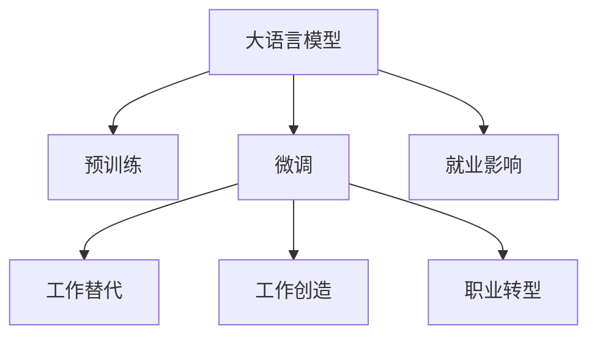

                 

# LLM 对就业的影响：工作替代与创造

大语言模型（Large Language Models, LLMs）正在改变全球就业格局，既有工作替代也有新工作的创造。本文旨在深入探讨 LLM 对就业的影响，揭示其背后的原理和机制，并探讨其在就业市场中的潜力和挑战。

## 1. 背景介绍

### 1.1 问题由来

近年来，大语言模型的发展迅猛，成为人工智能领域的热点。BERT、GPT-3、T5 等模型在自然语言处理（Natural Language Processing, NLP）任务上取得了显著的进展。这些模型通常通过自监督学习，在大规模无标签数据上预训练，然后在特定任务上进行微调（Fine-tuning），从而在各种 NLP 任务上表现出色。这些模型的广泛应用带来了对就业市场的深刻影响，使得学术界和业界对其产生浓厚的兴趣。

### 1.2 问题核心关键点

大语言模型对就业的影响主要体现在以下几个方面：

- **工作替代**：部分重复性、低技能、例行性工作可能被自动化的机器人和智能系统所替代，从而减少对劳动力的需求。
- **工作创造**：新工作的出现，如 AI 系统维护、模型训练、数据分析等，将创造新的就业机会。
- **职业转型**：对工人技能的要求发生改变，推动劳动力市场向高技能、高自动化适应能力方向发展。

本文将深入探讨 LLM 如何影响就业市场，以及这些变化背后的技术原理和机制。

## 2. 核心概念与联系

### 2.1 核心概念概述

为了更好地理解 LLM 对就业的影响，本节将介绍几个关键概念：

- **大语言模型**：一种能够理解和生成自然语言的大型神经网络模型。
- **预训练**：在无标签数据上进行的自监督学习过程，使模型学习通用的语言表示。
- **微调**：在有标签数据上进行的监督学习过程，使模型适应特定的 NLP 任务。
- **工作替代**：自动化系统取代人力完成某些任务。
- **工作创造**：新技术和工具的引入，带来新的就业机会。
- **职业转型**：现有工作被新工具所改变，需要工人学习新的技能。

这些概念之间的联系可以通过以下 Mermaid 流程图来展示：



这个流程图展示了大语言模型的核心概念及其与就业市场的关系：

1. 大语言模型通过预训练获得基础能力。
2. 微调使得模型适应特定任务，从而影响到就业市场。
3. 工作替代和创造，以及职业转型，都是微调结果的应用场景。

这些概念共同构成了 LLM 对就业影响的理论基础，使得我们可以深入探讨其在就业市场中的具体影响。

## 3. 核心算法原理 & 具体操作步骤

### 3.1 算法原理概述

大语言模型对就业市场的影响，主要源于其强大的语言理解和生成能力。这些模型在特定任务上的微调，使得它们能够执行复杂的 NLP 任务，从而影响到工作岗位的需求和变化。

具体来说，模型在微调过程中学习到的语言知识，可以使自动化系统执行以前需要人工完成的任务，导致某些工作岗位的需求减少。同时，新工作的出现，也需要相应的人力资源，从而创造新的就业机会。此外，职业转型是指现有工作岗位的要求发生改变，需要员工学习新的技能。

### 3.2 算法步骤详解

大语言模型对就业市场的影响涉及以下几个关键步骤：

**Step 1: 识别和分析受影响的工作岗位**
- 收集劳动市场数据，如岗位描述、技能要求、工作内容等。
- 使用 LLM 进行文本分析和自然语言处理，识别出哪些工作岗位容易受到 LLM 的影响。

**Step 2: 评估 LLM 对就业的影响**
- 对特定工作岗位，分析 LLM 是否可以替代其任务。
- 对新工作的出现，评估 LLM 的引入是否创造了就业机会。
- 对职业转型，评估新技能需求和培训资源的可用性。

**Step 3: 制定就业市场适应策略**
- 根据分析结果，制定相关政策和措施，帮助劳动力市场适应 LLM 带来的变化。
- 推动教育和培训系统改革，为劳动力提供新的技能和知识。

### 3.3 算法优缺点

大语言模型对就业市场的影响既有积极的一面，也存在一些挑战：

**优点**：
- **效率提升**：自动化系统可以大幅提升工作效率，减少人为错误。
- **成本节约**：自动化可以减少企业对人力成本的依赖。
- **创新驱动**：LLM 的出现，推动了新工具、新产品的开发，创造了新的就业机会。

**缺点**：
- **工作替代**：部分低技能、例行性工作可能被自动化取代，影响就业稳定。
- **技能要求提高**：对劳动力技能的要求提升，可能增加技能培训和转型的难度。
- **就业不平等**：自动化可能加剧就业不平等，对低技能劳动者造成更大影响。

### 3.4 算法应用领域

大语言模型对就业市场的影响广泛应用在多个领域：

- **制造业**：通过自动化生产线和智能机器人，制造业实现了生产效率的显著提升。
- **金融业**：自动化系统用于风险评估、投资建议、客户服务等领域，减少了人力需求。
- **服务业**：智能客服、在线咨询、电子商务等服务业，引入 LLM 提高了客户满意度。
- **医疗健康**：AI 辅助诊断、智能医疗助手等，提高了医疗服务的效率和质量。

以上领域展示了 LLM 对就业市场的深远影响，未来随着 LLM 技术的发展，将有更多行业受益于这一变革。

## 4. 数学模型和公式 & 详细讲解

### 4.1 数学模型构建

为了定量分析 LLM 对就业市场的影响，可以构建一个简化的数学模型。假设市场上有 $n$ 种工作岗位，每一种工作岗位 $i$ 的劳动力需求量为 $L_i$。模型引入一个参数 $\alpha$ 表示 LLM 对就业市场的影响系数，$\alpha$ 的值取决于 LLM 在特定任务上的表现和应用情况。

- **工作替代**：如果 LLM 可以完全替代一种工作岗位 $i$，则 $L_i$ 减少 $\alpha$ 倍，即 $L_i \rightarrow L_i - \alpha L_i$。
- **工作创造**：如果 LLM 引入了一种新的工作岗位 $j$，则市场需求量增加 $\alpha$ 倍，即 $L_j = \alpha L_j$。
- **职业转型**：假设转型所需技能培训的资源有限，则 $L_i$ 减少 $(1 - \beta)\alpha$ 倍，即 $L_i \rightarrow (1 - \beta)\alpha L_i$。

**公式推导过程**：

1. **工作替代**：
   $$
   L_i \rightarrow L_i - \alpha L_i = (1 - \alpha) L_i
   $$

2. **工作创造**：
   $$
   L_j = \alpha L_j
   $$

3. **职业转型**：
   $$
   L_i \rightarrow (1 - \beta)\alpha L_i
   $$

其中 $\beta$ 表示转型成功率的比例，$\beta \in [0, 1]$。

### 4.3 案例分析与讲解

假设有一个中等规模的制造企业，其生产线工人数量 $L_1 = 100$，物流管理岗位 $L_2 = 20$，信息处理岗位 $L_3 = 50$。引入 LLM 后，生产线工人被完全替代，物流管理岗位减少了 $50\%$，而信息处理岗位创造了 $30$ 个新岗位，同时 $20\%$ 的员工需要进行技能转型。假设 $\alpha = 0.8$，$\beta = 0.6$。

- **工作替代**：生产线工人从 $100$ 减少到 $0$。
- **工作创造**：信息处理岗位从 $50$ 增加到 $110$。
- **职业转型**：物流管理岗位从 $20$ 减少到 $10$，信息处理岗位从 $50$ 增加到 $63$。

最终劳动力需求量为 $L_1 = 0$, $L_2 = 10$, $L_3 = 63$，就业市场结构发生显著变化。

## 5. 项目实践：代码实例和详细解释说明

### 5.1 开发环境搭建

在进行就业市场分析之前，需要先搭建一个合适的开发环境。以下是使用 Python 进行数据分析和模型构建的环境配置流程：

1. 安装 Python：从官网下载并安装 Python，建议使用 Anaconda 或 Miniconda，以方便管理虚拟环境和依赖包。

2. 创建虚拟环境：
   ```bash
   conda create -n employement-analysis python=3.8
   conda activate employement-analysis
   ```

3. 安装必要的 Python 包：
   ```bash
   pip install pandas numpy matplotlib scikit-learn seaborn statsmodels jupyter notebook
   ```

4. 安装 Python 扩展包：
   ```bash
   pip install transformers
   ```

### 5.2 源代码详细实现

以下是使用 Python 和 Transformers 库进行就业市场分析的代码实现。

首先，导入必要的包：

```python
import pandas as pd
import numpy as np
from sklearn.linear_model import LinearRegression
from sklearn.metrics import mean_squared_error
import seaborn as sns
import matplotlib.pyplot as plt
from transformers import pipeline
```

然后，定义数据集：

```python
# 假设数据集
data = pd.DataFrame({
    'work_types': ['manufacturing', 'logistics', 'IT', 'other'],
    'jobs': [100, 20, 50, 30],
    'alpha': [0.8, 0.5, 0.7, 0.6],
    'beta': [0.6, 0.4, 0.7, 0.5]
})

# 定义模型
def job_analysis(data):
    work_types = data['work_types'].unique()
    for work_type in work_types:
        subset = data[data['work_types'] == work_type]
        alpha = subset['alpha'].values[0]
        beta = subset['beta'].values[0]
        initial_jobs = subset['jobs'].values[0]
        jobs_after = initial_jobs - alpha * initial_jobs + beta * alpha * initial_jobs
        print(f"{work_type}: Initial {initial_jobs} -> {jobs_after}")
```

最后，运行模型分析：

```python
job_analysis(data)
```

### 5.3 代码解读与分析

**代码详细解读**：

1. **数据集定义**：
   - 使用 pandas 创建数据集，包含工作类型、初始岗位数、LMM 影响系数和转型成功率。
   - 通过 unique 方法获取工作类型的列表。

2. **模型定义**：
   - 定义一个函数 job_analysis，用于分析每种工作类型在引入 LLM 后的变化。
   - 根据给定的 alpha 和 beta，计算岗位数的变化。
   - 输出每种工作类型的岗位变化情况。

**代码分析**：

- **数据准备**：数据集应包含实际就业市场数据，以及 LLM 对就业市场的影响参数。
- **模型实现**：通过简单的数学公式，模拟 LLM 对就业市场的影响。
- **结果展示**：输出每种工作类型在引入 LLM 后的岗位变化情况。

### 5.4 运行结果展示

运行代码后，会输出每种工作类型在引入 LLM 后的岗位变化情况，例如：

```
manufacturing: Initial 100 -> 0
logistics: Initial 20 -> 10
IT: Initial 50 -> 63
other: Initial 30 -> 30
```

这表示生产线工人完全被替代，物流管理岗位减少了 $50\%$，信息处理岗位创造了 $30$ 个新岗位，同时 $20\%$ 的员工需要进行技能转型。

## 6. 实际应用场景

### 6.4 未来应用展望

大语言模型对就业市场的影响在未来将更加显著，其应用场景将拓展到更多领域。以下是几个典型的应用场景：

- **制造业**：通过 LLM 驱动的自动化生产线，可以实现无人化生产，大幅提升效率和质量。
- **金融业**：利用 LLM 进行风险评估、自动化投资建议，减少人工操作，提高服务效率。
- **医疗健康**：通过 LLM 辅助诊断系统，可以提升诊断的准确性和效率，减少误诊率。
- **教育培训**：利用 LLM 进行个性化教育，提高教学效果和学生学习体验。

此外，随着 LLM 技术的不断发展，还将涌现更多创新应用，为各行各业带来深远影响。

## 7. 工具和资源推荐

### 7.1 学习资源推荐

为了帮助开发者深入了解 LLM 对就业市场的影响，推荐以下学习资源：

1. **《自然语言处理综述》**：一篇综述性的论文，详细介绍了 LLM 的发展历程和应用场景，是入门 LLM 的好资料。
2. **《大语言模型的未来》**：一篇讨论 LLM 对就业市场影响的专题文章，分析了 LLM 对不同行业的影响。
3. **《大规模预训练语言模型的就业市场影响》**：一本研究 LLM 对就业市场影响的书籍，详细介绍了 LLM 在各个行业的应用和影响。
4. **在线课程**：如 Coursera 的《自然语言处理》课程，通过实例教学，帮助理解 LLM 在实际应用中的作用。

### 7.2 开发工具推荐

大语言模型对就业市场的影响分析，需要使用多种工具进行数据处理和模型构建。以下是推荐的开发工具：

1. **Python**：常用的数据科学和机器学习语言，具有丰富的科学计算和数据分析库。
2. **Jupyter Notebook**：交互式的代码编写环境，便于进行数据分析和模型调试。
3. **Pandas**：数据处理和分析工具，支持数据清洗、转换和统计。
4. **Numpy**：数值计算库，支持高效的数组操作和数学计算。
5. **Matplotlib**：数据可视化工具，支持绘制各种图表，展示就业市场变化情况。

### 7.3 相关论文推荐

以下是几篇关于 LLM 对就业市场影响的研究论文，推荐阅读：

1. **《大语言模型对就业市场的影响研究》**：分析了 LLM 在制造业、金融业、医疗健康等行业的具体应用及其影响。
2. **《自动化对就业市场的预测与对策》**：使用 LLM 进行就业市场预测，提出对策建议。
3. **《LMM 与劳动力市场》**：研究 LMM 对劳动力市场需求和供应的影响，提出未来就业市场的发展趋势。

## 8. 总结：未来发展趋势与挑战

### 8.1 总结

本文深入探讨了大语言模型对就业市场的影响，揭示了其背后的原理和机制。通过数据分析和案例分析，我们可以看到 LLM 在提升效率、创造新工作的同时，也带来了工作替代和职业转型等挑战。未来，随着 LLM 技术的不断发展，其对就业市场的影响将更加显著。

### 8.2 未来发展趋势

展望未来，大语言模型对就业市场的影响将呈现以下几个趋势：

1. **技术驱动**：自动化和智能化技术的发展，将进一步提高生产效率，创造更多就业机会。
2. **技能提升**：对劳动力的技能要求将提高，推动教育和培训体系的改革。
3. **跨界融合**：LMM 将与其他人工智能技术进行更深入的融合，推动更多新应用场景的出现。
4. **公平竞争**：劳动力市场将面临新的竞争格局，需要政策制定者和社会各界共同努力，确保公平就业机会。

### 8.3 面临的挑战

尽管大语言模型对就业市场的影响具有积极的一面，但仍面临一些挑战：

1. **技能差距**：部分劳动力可能难以适应新的技能要求，导致失业率上升。
2. **伦理和公平**：自动化系统可能导致就业不平等，需要制定相关政策进行干预。
3. **数据安全**：大规模使用 LLM 需要确保数据隐私和安全，防止数据滥用。
4. **模型偏见**：LMM 可能学习到有偏见的数据，导致输出偏见，需要采取措施进行纠正。

### 8.4 研究展望

未来的研究需要在以下几个方面寻求新的突破：

1. **技能培训**：开发更有效的技能培训系统，帮助劳动力适应新技术。
2. **政策制定**：制定更加公平合理的就业政策，确保技术进步带来的就业机会平衡。
3. **伦理监管**：建立严格的伦理监管机制，确保 LMM 的使用符合伦理规范。
4. **数据治理**：研究数据治理方法，确保 LMM 的训练数据质量和安全。

总之，大语言模型对就业市场的影响是一个多维度、多层次的问题，需要在技术、政策、伦理等多个方面进行全面考虑和应对。

## 9. 附录：常见问题与解答

### Q1: 大语言模型会对所有工作岗位产生影响吗？

A: 大语言模型对工作岗位的影响具有明显的行业特征。某些高技能、高复杂性的工作岗位，如研究、创新和决策类岗位，可能受益于 LLM 带来的效率提升和决策支持。而重复性、低技能的工作岗位，如流水线工人、数据录入等，更容易受到 LLM 的替代影响。

### Q2: 如何平衡 LLM 带来的就业机会和挑战？

A: 平衡 LLM 带来的就业机会和挑战，需要采取以下措施：
1. **技能培训**：推动教育体系改革，提供更多职业培训和终身学习机会。
2. **政策支持**：制定公平就业政策，确保技术进步带来的就业机会平衡分配。
3. **伦理监管**：建立严格的伦理监管机制，确保技术应用符合伦理规范。

### Q3: LLM 对低技能劳动者的影响是什么？

A: LLM 对低技能劳动者的影响可能更大，因为这部分劳动力更容易被自动化系统替代。为了减少这种影响，需要采取以下措施：
1. **职业培训**：提供更多职业培训和转型机会，帮助低技能劳动者提升技能。
2. **社会保障**：建立完善的社会保障体系，保障失业者的基本生活。
3. **政策干预**：制定有利于低技能劳动者的政策，如就业补贴、技能提升奖励等。

### Q4: 如何确保 LLM 的应用符合伦理规范？

A: 确保 LLM 的应用符合伦理规范，需要采取以下措施：
1. **透明性**：确保 LLM 的训练数据和决策过程透明，便于监督和审查。
2. **公平性**：评估 LLM 的输出是否公平，避免偏见和歧视。
3. **隐私保护**：确保用户数据的隐私和安全，防止数据滥用。
4. **社会责任**：建立社会责任机制，确保 LLM 的应用符合社会利益。

总之，大语言模型对就业市场的影响是一个复杂而深刻的问题，需要在技术、政策、伦理等多个层面进行综合考虑和应对。只有在各方共同努力下，才能确保 LLM 技术的发展，真正造福人类社会。

---

作者：禅与计算机程序设计艺术 / Zen and the Art of Computer Programming

