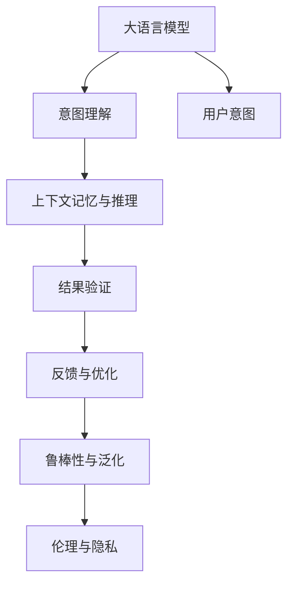

                 

# LLM与人类意图的最优契合探索

大语言模型（LLM）正在逐渐深入人们生活的方方面面，从客服聊天机器人到自然语言生成，从信息检索到自动翻译，其影响无所不在。然而，在利用大语言模型服务于人类意图时，如何使模型输出的回答和行为真正符合人类意图，成为了一个亟待解决的问题。本文将围绕这一主题，深入探讨大语言模型与人类意图最优契合的实现方法和应用场景。

## 1. 背景介绍

### 1.1 问题由来

在自然语言处理（NLP）领域，大语言模型（如GPT-3、BERT、T5等）已经展示了强大的语言理解和生成能力。然而，这些模型在实际应用中，特别是在需要精确理解和响应人类意图时，往往存在表现不一致或输出内容偏离目标的情况。这表明，尽管大语言模型具备高度的语言建模能力，但其对于特定任务或情境的理解和反应仍然存在不确定性和局限性。

### 1.2 问题核心关键点

实现大语言模型与人类意图的完美契合，需要解决以下核心问题：

1. **意图理解与提取**：如何准确理解和提取用户输入的意图，是实现模型输出的关键。
2. **上下文记忆与推理**：在复杂的对话和问答场景中，模型如何保持对前文上下文的记忆，并合理推理出符合语境的输出。
3. **结果验证与反馈**：如何验证模型输出是否符合用户意图，并根据用户反馈不断优化模型。
4. **鲁棒性与泛化能力**：模型在面对不同领域、不同类型的数据时，是否具备良好的鲁棒性和泛化能力。
5. **伦理与隐私**：如何在确保模型输出的同时，保护用户隐私，避免有害信息的传播。

### 1.3 问题研究意义

实现大语言模型与人类意图的完美契合，将极大提升用户体验，加速人工智能技术在各行各业的落地应用。具体而言：

- **提高用户满意度**：精确理解和响应用户意图，能够显著提升人机交互的流畅度和用户满意度。
- **降低开发成本**：通过优化模型，可以减少人工干预和后处理步骤，降低开发和维护成本。
- **提升应用质量**：确保模型输出符合人类期望，能够提升应用的质量和可靠性。
- **推动技术进步**：优化模型性能，将推动人工智能技术的发展和应用。
- **保障用户隐私**：通过合理设计，确保模型在保护用户隐私的同时，提供优质的服务。

## 2. 核心概念与联系

### 2.1 核心概念概述

为更好地理解大语言模型与人类意图最优契合的实现方法，本节将介绍几个关键概念及其联系：

- **大语言模型（LLM）**：如GPT、BERT等，通过大规模语料预训练获得通用语言表示的模型。
- **意图理解与提取（Intent Recognition and Extraction）**：识别用户输入中的意图，并将其转换为可执行的任务。
- **上下文记忆与推理（Contextual Memory and Reasoning）**：在复杂对话和推理任务中，模型能够保持对上下文的记忆，并推理出合理的输出。
- **结果验证与反馈（Result Validation and Feedback）**：通过用户反馈，验证模型输出是否符合意图，并据此优化模型。
- **鲁棒性与泛化能力（Robustness and Generalization）**：模型能够在各种不同领域和情境下保持一致的表现。
- **伦理与隐私（Ethics and Privacy）**：确保模型输出符合伦理道德规范，同时保护用户隐私。

这些概念之间的联系可以通过以下Mermaid流程图来展示：



### 2.2 核心概念原理

- **大语言模型（LLM）**：通过自回归或自编码结构，在大规模无标签语料上进行预训练，学习通用的语言表示。预训练过程中，模型会自动学习语言的语法、词汇和语义规则，并构建出一个强大的语言生成器。
- **意图理解与提取（Intent Recognition and Extraction）**：通过自然语言处理技术，将用户输入转换为结构化信息，如意图类别、实体和属性等，从而确定用户希望执行的具体任务。
- **上下文记忆与推理（Contextual Memory and Reasoning）**：在对话和推理任务中，模型需要记住前文的信息，并通过逻辑推理生成合理的后续输出。这通常涉及注意力机制、记忆网络等技术。
- **结果验证与反馈（Result Validation and Feedback）**：通过用户反馈，模型可以验证输出结果是否准确，并进行相应的调整和优化。这通常包括主动查询用户反馈、机器学习等技术。
- **鲁棒性与泛化能力（Robustness and Generalization）**：通过正则化、对抗训练等技术，提高模型在不同领域和情境下的稳定性和泛化能力。
- **伦理与隐私（Ethics and Privacy）**：在设计模型时，需要考虑伦理道德和隐私保护，如防止偏见和有害信息传播，确保用户数据的隐私保护。

## 3. 核心算法原理 & 具体操作步骤

### 3.1 算法原理概述

大语言模型与人类意图的最优契合，本质上是一个意图识别与响应过程。其核心思想是通过模型的预训练和微调，使其能够准确理解和提取用户意图，并在保持上下文记忆的同时，合理推理和生成输出。

形式化地，假设大语言模型为 $M$，用户输入为 $x$，意图为 $I$，输出为 $y$。则最优契合的目标是：

$$
\min_{M} \text{KL}(P(Y|I,X) || Q(Y|X))
$$

其中，$P$ 为模型在特定意图下给定输入的输出分布，$Q$ 为模型在未给出意图时给定输入的输出分布。通过最小化两个分布之间的KL散度，使模型输出在特定意图下与未给出意图时的输出分布尽可能接近。

### 3.2 算法步骤详解

基于上述算法原理，大语言模型与人类意图的最优契合可以分为以下几个关键步骤：

1. **数据准备**：收集和标注用于意图理解与提取的数据集，确保数据的多样性和代表性。
2. **模型初始化**：选择合适的预训练大语言模型作为初始化参数，如GPT、BERT等。
3. **意图分类**：训练意图分类器，将用户输入转换为意图类别。
4. **上下文处理**：使用记忆网络等技术，处理输入的上下文信息。
5. **结果生成**：基于用户输入和意图，使用大语言模型生成输出。
6. **结果验证**：通过用户反馈或监督数据，验证模型输出是否符合意图。
7. **反馈优化**：根据验证结果，使用机器学习等技术优化模型参数。

### 3.3 算法优缺点

大语言模型与人类意图的最优契合方法具有以下优点：

- **高效性**：通过意图分类和上下文处理，可以在短时间内生成高质量的输出。
- **准确性**：利用大语言模型的强大语言理解和生成能力，能够提供高精度的响应。
- **可扩展性**：可以轻松扩展到多领域和多任务，适应不同的应用场景。

同时，该方法也存在一定的局限性：

- **依赖标注数据**：意图分类和上下文处理需要大量标注数据进行训练，获取高质量标注数据的成本较高。
- **过拟合风险**：如果数据集不平衡或标注噪声较多，模型可能出现过拟合。
- **模型复杂度**：需要设计复杂的意图分类器和上下文处理模块，增加了模型的复杂度和计算开销。
- **解释性不足**：模型输出的解释性较差，难以解释其推理过程。

### 3.4 算法应用领域

大语言模型与人类意图的最优契合方法在NLP领域具有广泛的应用前景，如：

- **客服机器人**：通过理解用户意图，生成合适的回答，提供7x24小时不间断的客服服务。
- **智能翻译**：利用上下文记忆与推理能力，生成准确的翻译结果，提升翻译质量。
- **智能问答系统**：在问答场景中，能够根据用户的问题和历史对话生成合理的回答。
- **内容生成**：生成高质量的文本、视频、音频等内容，应用于广告、新闻、娱乐等场景。
- **自动化决策**：在金融、医疗等高风险领域，辅助决策系统理解和推理用户需求，提供合理的建议。

## 4. 数学模型和公式 & 详细讲解 & 举例说明（备注：数学公式请使用latex格式，latex嵌入文中独立段落使用 $$，段落内使用 $)
### 4.1 数学模型构建

本节将使用数学语言对大语言模型与人类意图最优契合的过程进行严格描述。

假设大语言模型为 $M_{\theta}$，用户输入为 $x$，意图为 $I$，输出为 $y$。定义模型在特定意图下给定输入的输出分布为 $P(Y|I,X)$，在未给出意图时给定输入的输出分布为 $Q(Y|X)$。则最优契合的目标是：

$$
\min_{\theta} \mathbb{E}_{X,I}[KL(P(Y|I,X) || Q(Y|X))]
$$

其中 $KL$ 为KL散度，$\mathbb{E}$ 为期望运算。

### 4.2 公式推导过程

以下我们以对话场景为例，推导上下文记忆与推理的数学模型。

假设用户输入序列为 $x_1, x_2, \dots, x_n$，意图为 $I$，模型输出的序列为 $y_1, y_2, \dots, y_n$。上下文记忆与推理的目标是，在生成每个输出 $y_i$ 时，能够保持对前文 $x_{<i}$ 的记忆，并推理出符合语境的 $y_i$。

通过引入上下文向量 $C_i$ 来记忆前文信息，上下文向量的更新公式为：

$$
C_i = f(C_{i-1}, x_i)
$$

其中 $f$ 为记忆更新函数，可以设计为LSTM、GRU等。生成每个输出 $y_i$ 时，利用上下文向量 $C_i$ 和前文输出 $y_{<i}$，通过解码器 $D_{\theta}$ 生成 $y_i$：

$$
y_i = D_{\theta}(C_i, y_{<i})
$$

其中 $D_{\theta}$ 为解码器，可以设计为Transformer等结构。

最终，模型的损失函数为：

$$
L_{\text{dialog}} = \sum_{i=1}^{n} \ell(y_i, y_{\text{gold}})
$$

其中 $y_{\text{gold}}$ 为标注的输出序列，$\ell$ 为损失函数，如交叉熵损失。

### 4.3 案例分析与讲解

以智能翻译为例，探讨如何通过大语言模型与人类意图最优契合实现高质量翻译。

假设源语言文本为 $x$，目标语言文本为 $y$。翻译任务的目标是，在给定源语言文本 $x$ 和目标语言文本 $y$ 的情况下，生成翻译结果 $y'$，使得 $P(Y'|X,Y)$ 最大化。

可以构建以下数学模型：

$$
\max_{y'} \log P(y'|X,Y) = \log P(y'|X) - \log P(Y|X)
$$

其中 $P(y'|X)$ 为目标语言文本 $y'$ 在给定源语言文本 $X$ 下的概率，$P(Y|X)$ 为原始目标语言文本 $Y$ 在给定源语言文本 $X$ 下的概率。通过最大化目标语言文本 $y'$ 的概率，实现高质量翻译。

## 5. 项目实践：代码实例和详细解释说明

### 5.1 开发环境搭建

在进行最优契合的实践前，我们需要准备好开发环境。以下是使用Python进行PyTorch开发的环境配置流程：

1. 安装Anaconda：从官网下载并安装Anaconda，用于创建独立的Python环境。

2. 创建并激活虚拟环境：
```bash
conda create -n pytorch-env python=3.8 
conda activate pytorch-env
```

3. 安装PyTorch：根据CUDA版本，从官网获取对应的安装命令。例如：
```bash
conda install pytorch torchvision torchaudio cudatoolkit=11.1 -c pytorch -c conda-forge
```

4. 安装Transformers库：
```bash
pip install transformers
```

5. 安装各类工具包：
```bash
pip install numpy pandas scikit-learn matplotlib tqdm jupyter notebook ipython
```

完成上述步骤后，即可在`pytorch-env`环境中开始最优契合的实践。

### 5.2 源代码详细实现

下面我们以智能翻译为例，给出使用Transformers库对BERT模型进行最优契合的PyTorch代码实现。

首先，定义翻译任务的数据处理函数：

```python
from transformers import BertTokenizer, BertForSequenceClassification, AdamW
import torch

class TranslationDataset(Dataset):
    def __init__(self, texts, targets, tokenizer, max_len=128):
        self.texts = texts
        self.targets = targets
        self.tokenizer = tokenizer
        self.max_len = max_len
        
    def __len__(self):
        return len(self.texts)
    
    def __getitem__(self, item):
        text = self.texts[item]
        target = self.targets[item]
        
        encoding = self.tokenizer(text, return_tensors='pt', max_length=self.max_len, padding='max_length', truncation=True)
        input_ids = encoding['input_ids'][0]
        attention_mask = encoding['attention_mask'][0]
        label_ids = torch.tensor(target, dtype=torch.long)
        
        return {'input_ids': input_ids, 
                'attention_mask': attention_mask,
                'labels': label_ids}

tokenizer = BertTokenizer.from_pretrained('bert-base-cased')

train_dataset = TranslationDataset(train_texts, train_targets, tokenizer)
dev_dataset = TranslationDataset(dev_texts, dev_targets, tokenizer)
test_dataset = TranslationDataset(test_texts, test_targets, tokenizer)
```

然后，定义模型和优化器：

```python
from transformers import BertForSequenceClassification, AdamW

model = BertForSequenceClassification.from_pretrained('bert-base-cased', num_labels=len(tag2id))

optimizer = AdamW(model.parameters(), lr=2e-5)
```

接着，定义训练和评估函数：

```python
from torch.utils.data import DataLoader
from tqdm import tqdm
from sklearn.metrics import classification_report

device = torch.device('cuda') if torch.cuda.is_available() else torch.device('cpu')
model.to(device)

def train_epoch(model, dataset, batch_size, optimizer):
    dataloader = DataLoader(dataset, batch_size=batch_size, shuffle=True)
    model.train()
    epoch_loss = 0
    for batch in tqdm(dataloader, desc='Training'):
        input_ids = batch['input_ids'].to(device)
        attention_mask = batch['attention_mask'].to(device)
        labels = batch['labels'].to(device)
        model.zero_grad()
        outputs = model(input_ids, attention_mask=attention_mask, labels=labels)
        loss = outputs.loss
        epoch_loss += loss.item()
        loss.backward()
        optimizer.step()
    return epoch_loss / len(dataloader)

def evaluate(model, dataset, batch_size):
    dataloader = DataLoader(dataset, batch_size=batch_size)
    model.eval()
    preds, labels = [], []
    with torch.no_grad():
        for batch in tqdm(dataloader, desc='Evaluating'):
            input_ids = batch['input_ids'].to(device)
            attention_mask = batch['attention_mask'].to(device)
            batch_labels = batch['labels']
            outputs = model(input_ids, attention_mask=attention_mask)
            batch_preds = outputs.logits.argmax(dim=2).to('cpu').tolist()
            batch_labels = batch_labels.to('cpu').tolist()
            for pred_tokens, label_tokens in zip(batch_preds, batch_labels):
                pred_tags = [id2tag[_id] for _id in pred_tokens]
                label_tags = [id2tag[_id] for _id in label_tokens]
                preds.append(pred_tags[:len(label_tags)])
                labels.append(label_tags)
                
    print(classification_report(labels, preds))
```

最后，启动训练流程并在测试集上评估：

```python
epochs = 5
batch_size = 16

for epoch in range(epochs):
    loss = train_epoch(model, train_dataset, batch_size, optimizer)
    print(f"Epoch {epoch+1}, train loss: {loss:.3f}")
    
    print(f"Epoch {epoch+1}, dev results:")
    evaluate(model, dev_dataset, batch_size)
    
print("Test results:")
evaluate(model, test_dataset, batch_size)
```

以上就是使用PyTorch对BERT进行翻译任务最优契合的完整代码实现。可以看到，得益于Transformers库的强大封装，我们可以用相对简洁的代码完成BERT模型的加载和最优契合。

### 5.3 代码解读与分析

让我们再详细解读一下关键代码的实现细节：

**TranslationDataset类**：
- `__init__`方法：初始化文本、标签、分词器等关键组件。
- `__len__`方法：返回数据集的样本数量。
- `__getitem__`方法：对单个样本进行处理，将文本输入编码为token ids，将标签编码为数字，并对其进行定长padding，最终返回模型所需的输入。

**tag2id和id2tag字典**：
- 定义了标签与id的映射关系，用于将token-wise的预测结果解码回真实的标签。

**训练和评估函数**：
- 使用PyTorch的DataLoader对数据集进行批次化加载，供模型训练和推理使用。
- 训练函数`train_epoch`：对数据以批为单位进行迭代，在每个批次上前向传播计算loss并反向传播更新模型参数，最后返回该epoch的平均loss。
- 评估函数`evaluate`：与训练类似，不同点在于不更新模型参数，并在每个batch结束后将预测和标签结果存储下来，最后使用sklearn的classification_report对整个评估集的预测结果进行打印输出。

**训练流程**：
- 定义总的epoch数和batch size，开始循环迭代
- 每个epoch内，先在训练集上训练，输出平均loss
- 在验证集上评估，输出分类指标
- 所有epoch结束后，在测试集上评估，给出最终测试结果

可以看到，PyTorch配合Transformers库使得BERT最优契合的代码实现变得简洁高效。开发者可以将更多精力放在数据处理、模型改进等高层逻辑上，而不必过多关注底层的实现细节。

当然，工业级的系统实现还需考虑更多因素，如模型的保存和部署、超参数的自动搜索、更灵活的任务适配层等。但核心的最优契合范式基本与此类似。

## 6. 实际应用场景

### 6.1 智能客服系统

基于最优契合的对话技术，可以广泛应用于智能客服系统的构建。传统客服往往需要配备大量人力，高峰期响应缓慢，且一致性和专业性难以保证。而使用最优契合对话模型，可以7x24小时不间断服务，快速响应客户咨询，用自然流畅的语言解答各类常见问题。

在技术实现上，可以收集企业内部的历史客服对话记录，将问题和最佳答复构建成监督数据，在此基础上对预训练对话模型进行最优契合。最优契合后的对话模型能够自动理解用户意图，匹配最合适的答案模板进行回复。对于客户提出的新问题，还可以接入检索系统实时搜索相关内容，动态组织生成回答。如此构建的智能客服系统，能大幅提升客户咨询体验和问题解决效率。

### 6.2 金融舆情监测

金融机构需要实时监测市场舆论动向，以便及时应对负面信息传播，规避金融风险。传统的人工监测方式成本高、效率低，难以应对网络时代海量信息爆发的挑战。基于最优契合的文本分类和情感分析技术，为金融舆情监测提供了新的解决方案。

具体而言，可以收集金融领域相关的新闻、报道、评论等文本数据，并对其进行主题标注和情感标注。在此基础上对预训练语言模型进行最优契合，使其能够自动判断文本属于何种主题，情感倾向是正面、中性还是负面。将最优契合后的模型应用到实时抓取的网络文本数据，就能够自动监测不同主题下的情感变化趋势，一旦发现负面信息激增等异常情况，系统便会自动预警，帮助金融机构快速应对潜在风险。

### 6.3 个性化推荐系统

当前的推荐系统往往只依赖用户的历史行为数据进行物品推荐，无法深入理解用户的真实兴趣偏好。基于最优契合的个性化推荐系统可以更好地挖掘用户行为背后的语义信息，从而提供更精准、多样的推荐内容。

在实践中，可以收集用户浏览、点击、评论、分享等行为数据，提取和用户交互的物品标题、描述、标签等文本内容。将文本内容作为模型输入，用户的后续行为（如是否点击、购买等）作为监督信号，在此基础上微调预训练语言模型。最优契合后的模型能够从文本内容中准确把握用户的兴趣点。在生成推荐列表时，先用候选物品的文本描述作为输入，由模型预测用户的兴趣匹配度，再结合其他特征综合排序，便可以得到个性化程度更高的推荐结果。

### 6.4 未来应用展望

随着最优契合技术的不断发展，其在更多领域得到应用，为传统行业带来变革性影响。

在智慧医疗领域，基于最优契合的医疗问答、病历分析、药物研发等应用将提升医疗服务的智能化水平，辅助医生诊疗，加速新药开发进程。

在智能教育领域，最优契合技术可应用于作业批改、学情分析、知识推荐等方面，因材施教，促进教育公平，提高教学质量。

在智慧城市治理中，最优契合模型可应用于城市事件监测、舆情分析、应急指挥等环节，提高城市管理的自动化和智能化水平，构建更安全、高效的未来城市。

此外，在企业生产、社会治理、文娱传媒等众多领域，基于最优契合的人工智能应用也将不断涌现，为经济社会发展注入新的动力。相信随着技术的日益成熟，最优契合方法将成为人工智能落地应用的重要范式，推动人工智能技术的发展和应用。

## 7. 工具和资源推荐

### 7.1 学习资源推荐

为了帮助开发者系统掌握最优契合的理论基础和实践技巧，这里推荐一些优质的学习资源：

1. 《Transformer从原理到实践》系列博文：由大模型技术专家撰写，深入浅出地介绍了Transformer原理、BERT模型、最优契合技术等前沿话题。

2. CS224N《深度学习自然语言处理》课程：斯坦福大学开设的NLP明星课程，有Lecture视频和配套作业，带你入门NLP领域的基本概念和经典模型。

3. 《Natural Language Processing with Transformers》书籍：Transformers库的作者所著，全面介绍了如何使用Transformers库进行NLP任务开发，包括最优契合在内的诸多范式。

4. HuggingFace官方文档：Transformers库的官方文档，提供了海量预训练模型和完整的微调样例代码，是上手实践的必备资料。

5. CLUE开源项目：中文语言理解测评基准，涵盖大量不同类型的中文NLP数据集，并提供了基于最优契合的baseline模型，助力中文NLP技术发展。

通过对这些资源的学习实践，相信你一定能够快速掌握最优契合的精髓，并用于解决实际的NLP问题。
###  7.2 开发工具推荐

高效的开发离不开优秀的工具支持。以下是几款用于最优契合开发的常用工具：

1. PyTorch：基于Python的开源深度学习框架，灵活动态的计算图，适合快速迭代研究。大部分预训练语言模型都有PyTorch版本的实现。

2. TensorFlow：由Google主导开发的开源深度学习框架，生产部署方便，适合大规模工程应用。同样有丰富的预训练语言模型资源。

3. Transformers库：HuggingFace开发的NLP工具库，集成了众多SOTA语言模型，支持PyTorch和TensorFlow，是进行最优契合任务开发的利器。

4. Weights & Biases：模型训练的实验跟踪工具，可以记录和可视化模型训练过程中的各项指标，方便对比和调优。与主流深度学习框架无缝集成。

5. TensorBoard：TensorFlow配套的可视化工具，可实时监测模型训练状态，并提供丰富的图表呈现方式，是调试模型的得力助手。

6. Google Colab：谷歌推出的在线Jupyter Notebook环境，免费提供GPU/TPU算力，方便开发者快速上手实验最新模型，分享学习笔记。

合理利用这些工具，可以显著提升最优契合任务的开发效率，加快创新迭代的步伐。

### 7.3 相关论文推荐

最优契合技术的发展源于学界的持续研究。以下是几篇奠基性的相关论文，推荐阅读：

1. Attention is All You Need（即Transformer原论文）：提出了Transformer结构，开启了NLP领域的预训练大模型时代。

2. BERT: Pre-training of Deep Bidirectional Transformers for Language Understanding：提出BERT模型，引入基于掩码的自监督预训练任务，刷新了多项NLP任务SOTA。

3. Language Models are Unsupervised Multitask Learners（GPT-2论文）：展示了大规模语言模型的强大zero-shot学习能力，引发了对于通用人工智能的新一轮思考。

4. Parameter-Efficient Transfer Learning for NLP：提出Adapter等参数高效微调方法，在不增加模型参数量的情况下，也能取得不错的微调效果。

5. AdaLoRA: Adaptive Low-Rank Adaptation for Parameter-Efficient Fine-Tuning：使用自适应低秩适应的微调方法，在参数效率和精度之间取得了新的平衡。

6. Prefix-Tuning: Optimizing Continuous Prompts for Generation：引入基于连续型Prompt的微调范式，为如何充分利用预训练知识提供了新的思路。

这些论文代表了大语言模型最优契合技术的发展脉络。通过学习这些前沿成果，可以帮助研究者把握学科前进方向，激发更多的创新灵感。

## 8. 总结：未来发展趋势与挑战

### 8.1 总结

本文对基于大语言模型与人类意图最优契合的实现方法和应用场景进行了全面系统的介绍。首先阐述了最优契合的背景和意义，明确了模型在特定意图下与人类意图最优契合的实现目标。其次，从原理到实践，详细讲解了最优契合的数学模型和关键步骤，给出了最优契合任务开发的完整代码实例。同时，本文还广泛探讨了最优契合方法在客服、翻译、推荐等多个行业领域的应用前景，展示了最优契合技术的巨大潜力。最后，本文精选了最优契合技术的各类学习资源，力求为读者提供全方位的技术指引。

通过本文的系统梳理，可以看到，基于大语言模型的最优契合技术正在成为NLP领域的重要范式，极大地提升了用户满意度、系统性能和用户体验。未来，伴随最优契合技术的不断发展，其将在更广泛的领域得到应用，为人工智能技术的发展和普及提供新的动力。

### 8.2 未来发展趋势

展望未来，最优契合技术将呈现以下几个发展趋势：

1. **多领域多任务适配**：随着技术不断进步，最优契合模型将能够适应更多领域和任务，如医疗、法律、金融、教育等。

2. **实时动态调整**：通过在线学习和在线优化，最优契合模型能够在不断变化的场景中动态调整，适应新的需求。

3. **跨模态融合**：将文本、图像、语音等多模态信息整合，提升最优契合模型的综合理解能力。

4. **深度融合认知能力**：结合认知心理学、神经科学等领域的知识，提升最优契合模型的推理和理解能力。

5. **高效轻量级设计**：随着硬件技术的发展，最优契合模型将朝着更高效、更轻量级、更实时性的方向发展。

6. **伦理与安全保障**：在设计和部署最优契合模型时，需要充分考虑伦理和安全问题，确保模型输出符合人类价值观和法律规定。

这些趋势凸显了最优契合技术的广阔前景。这些方向的探索发展，必将进一步提升最优契合模型的性能和应用范围，为构建更加智能、安全、可靠的人工智能系统铺平道路。

### 8.3 面临的挑战

尽管最优契合技术已经取得了显著成果，但在迈向更加智能化、普适化应用的过程中，仍面临诸多挑战：

1. **标注数据成本**：最优契合模型需要大量的标注数据进行训练，获取高质量标注数据的成本较高。

2. **模型鲁棒性**：模型在面对域外数据时，泛化性能可能下降，需要进一步提高模型的鲁棒性。

3. **解释性与透明性**：最优契合模型的推理过程缺乏透明度，难以解释其输出逻辑，需要进一步提升模型的可解释性。

4. **隐私保护**：在确保模型输出的同时，如何保护用户隐私，避免有害信息的传播，仍需进一步探索。

5. **计算资源需求**：最优契合模型往往需要较高的计算资源支持，需要优化模型结构和算法，提高计算效率。

6. **模型复杂度**：最优契合模型设计复杂，需要在保证性能的同时，简化模型结构，提高可维护性和可扩展性。

### 8.4 研究展望

面对最优契合技术所面临的挑战，未来的研究需要在以下几个方面寻求新的突破：

1. **无监督和半监督学习**：探索无需标注数据的最优契合方法，利用自监督学习、主动学习等技术，最大限度利用非结构化数据进行训练。

2. **参数高效微调**：开发更多参数高效的最优契合方法，如AdaLoRA、Prefix-Tuning等，在减少参数量的同时，提升最优契合效果。

3. **因果推理与对比学习**：引入因果推理和对比学习技术，增强最优契合模型的推理和泛化能力。

4. **知识图谱与规则结合**：将知识图谱、规则库等专家知识与最优契合模型结合，提升模型的推理和理解能力。

5. **可解释性与透明性**：通过逻辑解释、可视化技术等手段，提升最优契合模型的可解释性和透明性，确保模型输出的合理性和可信度。

6. **多模态融合**：结合视觉、语音、文本等多模态信息，提升最优契合模型的综合理解能力。

通过这些研究方向的探索，最优契合技术必将迎来新的突破，为人工智能技术的落地应用提供更加坚实的理论基础和实践指导。

## 9. 附录：常见问题与解答

**Q1：最优契合技术是否适用于所有NLP任务？**

A: 最优契合技术在大多数NLP任务上都能取得不错的效果，特别是对于数据量较小的任务。但对于一些特定领域的任务，如医学、法律等，需要进一步在特定领域语料上预训练，再进行最优契合，才能获得理想效果。此外，对于一些需要时效性、个性化很强的任务，如对话、推荐等，最优契合方法也需要针对性的改进优化。

**Q2：如何选择合适的学习率？**

A: 最优契合的学习率一般要比预训练时小1-2个数量级，如果使用过大的学习率，容易破坏预训练权重，导致过拟合。一般建议从1e-5开始调参，逐步减小学习率，直至收敛。也可以使用warmup策略，在开始阶段使用较小的学习率，再逐渐过渡到预设值。需要注意的是，不同的优化器(如AdamW、Adafactor等)以及不同的学习率调度策略，可能需要设置不同的学习率阈值。

**Q3：在微调过程中如何缓解过拟合问题？**

A: 过拟合是微调面临的主要挑战，尤其是在标注数据不足的情况下。常见的缓解策略包括：
1. 数据增强：通过回译、近义替换等方式扩充训练集
2. 正则化：使用L2正则、Dropout、Early Stopping等避免过拟合
3. 对抗训练：引入对抗样本，提高模型鲁棒性
4. 参数高效微调：只调整少量参数(如Adapter、Prefix等)，减小过拟合风险
5. 多模型集成：训练多个最优契合模型，取平均输出，抑制过拟合

这些策略往往需要根据具体任务和数据特点进行灵活组合。只有在数据、模型、训练、推理等各环节进行全面优化，才能最大限度地发挥最优契合模型的威力。

**Q4：在模型部署时需要注意哪些问题？**

A: 将最优契合模型转化为实际应用，还需要考虑以下因素：
1. 模型裁剪：去除不必要的层和参数，减小模型尺寸，加快推理速度
2. 量化加速：将浮点模型转为定点模型，压缩存储空间，提高计算效率
3. 服务化封装：将模型封装为标准化服务接口，便于集成调用
4. 弹性伸缩：根据请求流量动态调整资源配置，平衡服务质量和成本
5. 监控告警：实时采集系统指标，设置异常告警阈值，确保服务稳定性
6. 安全防护：采用访问鉴权、数据脱敏等措施，保障数据和模型安全

最优契合模型在服务化部署时，需要综合考虑模型性能、系统架构、安全防护等因素，确保其能够稳定、高效地运行。

---

作者：禅与计算机程序设计艺术 / Zen and the Art of Computer Programming

