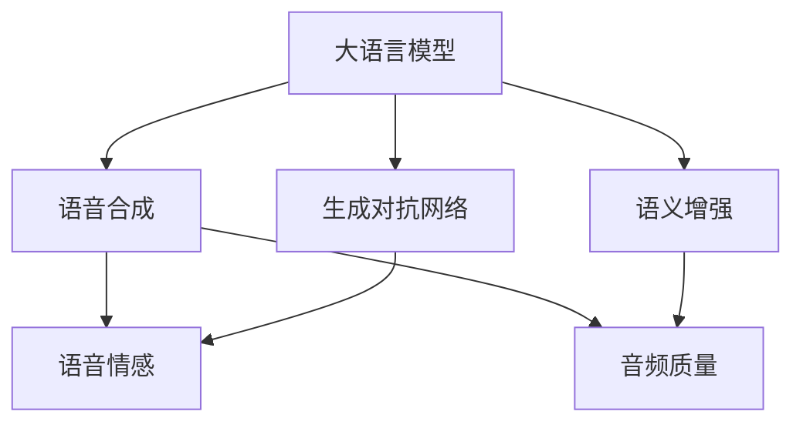

                 

# LLM与传统语音合成技术的结合：语音AI新境界

> 关键词：自然语言处理(NLP), 语音合成(Synthesis), 大语言模型(LLM), 生成对抗网络(GAN), 语义增强, 语音情感, 音频质量, 语料多样性

## 1. 背景介绍

语音合成（Voice Synthesis）技术在近年来取得了显著的进展，被广泛应用于智能助手、语音导航、自动字幕生成等多个场景。传统语音合成技术通常依赖于规则化的音库和模板，无法捕捉自然语言的多样性和复杂性。随着深度学习技术的发展，基于神经网络的生成式语音合成方法（如WaveNet、Tacotron、Transformer等）逐步取代了传统方法，获得了更高的音质和多样性。

然而，尽管神经网络语音合成方法已经取得了巨大的成功，但仍存在一些不足：

- 训练数据需求高。需要大量高质量的语音-文本对，才能生成自然流畅的语音。
- 泛化能力有限。模型对于新用户的适应性较差，无法满足不同人的语音特性需求。
- 缺乏语义理解。传统的生成式模型多依赖文本到音的映射，不具备自然语言语义理解能力。
- 情感表达不足。难以表达人类语音中的细微情感变化，使得生成的语音缺乏人性化。

而大语言模型（Large Language Model, LLM）在自然语言理解与生成方面具有强大能力。以GPT-3、BERT等为代表的预训练语言模型，已经具备高度的上下文理解和语言生成能力。通过将大语言模型与语音合成技术结合，可以克服传统方法的局限性，构建具备语义理解和情感表达能力的语音AI系统，开创语音AI的新境界。

## 2. 核心概念与联系

### 2.1 核心概念概述

为更好地理解LLM与传统语音合成技术的结合，本节将介绍几个密切相关的核心概念：

- 大语言模型（LLM）：以自回归（如GPT-3）或自编码（如BERT）模型为代表的大规模预训练语言模型。通过在大规模无标签文本语料上进行预训练，学习通用的语言表示，具备强大的语言理解和生成能力。

- 语音合成（Synthesis）：将文本转换为自然语音的过程，通常分为两步：首先进行文本到语音（TTS）的映射，然后通过语音生成器生成对应的语音信号。

- 生成对抗网络（GAN）：一种生成模型，由一个生成器（Generator）和一个判别器（Discriminator）组成，通过对抗训练（Adversarial Training）生成高质量的样本。

- 语义增强（Semantic Augmentation）：在生成式语音合成中，通过引入语义信息对模型进行预训练，提升生成语音的自然度和表征能力。

- 语音情感（Voice Emotion）：在语音合成中，模型应能够表达人类语音中的细微情感变化，使得生成语音更具人性化。

- 音频质量（Audio Quality）：语音合成的关键指标之一，涉及到音高、音色、音量等参数的调节，以确保生成的语音清晰、自然、动听。

- 语料多样性（Data Diversity）：高质量语音合成的基础，需要覆盖广泛的语言、口音、情感等多样化的语料。

这些核心概念之间的逻辑关系可以通过以下Mermaid流程图来展示：



这个流程图展示了大语言模型与语音合成技术的核心概念及其之间的关系：

1. 大语言模型通过预训练获得基础能力。
2. 语音合成技术进行文本到语音的映射和生成。
3. 生成对抗网络用于提升生成语音的质量和多样性。
4. 语义增强在生成式语音合成中引入语义信息，提升表征能力。
5. 语音情感用于增强生成语音的自然度和人情味。
6. 音频质量确保生成的语音清晰、自然、动听。

这些概念共同构成了LLM与语音合成技术的结合框架，使得语音AI能够实现自然流畅、情感丰富、语义准确的语音输出。

## 3. 核心算法原理 & 具体操作步骤
### 3.1 算法原理概述

基于LLM与传统语音合成技术的结合，语音AI的新方法主要分为三步：

1. 使用大语言模型进行语义理解，提取文本中的情感、语义信息。
2. 将语义信息输入到生成对抗网络中，进行高质量语音生成。
3. 对生成语音进行后处理，如语音情感渲染、音频质量优化等。

整个流程可以概括为：

- **步骤1**：将待合成的文本输入到大语言模型中，提取其语义信息和情感特征。
- **步骤2**：将提取的语义信息和情感特征输入到生成对抗网络中，生成高质量的语音信号。
- **步骤3**：对生成的语音信号进行后处理，提升音频质量和情感表达。

### 3.2 算法步骤详解

**步骤1**：语义理解与情感提取

使用大语言模型对文本进行语义理解，提取其中的情感特征。具体而言，可以采用以下方法：

1. 文本编码：使用预训练的大语言模型对文本进行编码，提取其语义向量。

2. 情感分类：基于编码后的语义向量，使用情感分类模型（如BERT Fine-Tuning）判断文本的情感倾向（正面、负面、中性）。

3. 情感强度：使用情感强度模型（如ResNet、CNN等）计算文本情感的强度，得到情感特征。

4. 语义增强：将情感特征与语义向量进行拼接，提升生成语音的自然度和表征能力。

**步骤2**：高质量语音生成

生成对抗网络（GAN）以其强大的生成能力在语音合成中得到了广泛应用。具体实现步骤包括：

1. 生成器网络（Generator）：使用U-Net网络结构，将语义特征和情感特征作为输入，生成语音信号。

2. 判别器网络（Discriminator）：使用卷积神经网络（CNN），将生成的语音信号与真实语音信号区分开来。

3. 对抗训练：使用梯度下降法交替优化生成器和判别器，使得生成器生成的语音能够“欺骗”判别器。

4. 语音解码：将生成器生成的语音信号进行解码，得到最终的语音信号。

**步骤3**：语音后处理

生成的语音信号可能存在噪声、失真等问题，需要进行后处理以提升音频质量。具体方法包括：

1. 降噪：使用降噪算法（如WaveNet降噪）去除语音中的背景噪声。

2. 音量平衡：调整语音的音量，确保语音清晰可听。

3. 音高调节：通过音高调节算法（如Mel-spectrogram warping）改善语音的自然度。

4. 情感渲染：使用情感转换算法（如Pitch Shift、Modulation）对语音进行情感渲染，提升其情感表达能力。

### 3.3 算法优缺点

基于LLM与语音合成技术的结合方法具有以下优点：

1. 自然流畅。结合了语义理解和情感表达，生成的语音更加自然流畅，接近真人说话。

2. 通用性强。大语言模型具有强大的泛化能力，能够适应不同用户和场景，满足多样化的语音需求。

3. 低成本。相比传统语音合成方法，基于大语言模型的方法不需要昂贵的音库和模板，降低了成本。

4. 语义丰富。能够捕捉文本中的情感和语义信息，生成的语音更具语义深度。

5. 技术成熟。大语言模型和生成对抗网络都已具备相对成熟的技术，能够保证语音生成的质量。

然而，该方法也存在一些局限性：

1. 训练数据需求高。生成对抗网络需要大量的高质量语音数据，这可能成为方法落地的瓶颈。

2. 计算资源消耗大。生成对抗网络训练和推理计算量较大，需要高性能的GPU和TPU等硬件支持。

3. 鲁棒性不足。生成的语音可能存在噪声、失真等问题，对环境的适应性较差。

4. 情感表达不足。大语言模型缺乏情感感知能力，需要额外引入情感渲染算法进行改进。

### 3.4 算法应用领域

基于LLM与语音合成技术的结合方法，已在多个领域得到广泛应用，例如：

- 智能助手：将语音生成与自然语言理解相结合，构建智能语音助手，实现自然流畅的对话。

- 语音导航：将语音合成与地理信息相结合，实现语音导航，提高用户出行体验。

- 自动字幕：将语音生成与字幕生成相结合，实现自动字幕生成，方便用户观看视频。

- 语音书信：将语音生成与文本生成相结合，实现语音书信，方便用户通过语音输入文本。

- 语音游戏：将语音生成与游戏角色相结合，实现语音游戏，增强游戏的互动性。

除了上述这些经典应用外，基于LLM与语音合成技术的结合方法还可以拓展到更多场景中，如个性化语音播报、语音社交、虚拟主播等，为语音AI带来新的发展机遇。

## 4. 数学模型和公式 & 详细讲解  
### 4.1 数学模型构建

基于LLM与语音合成技术的结合方法，可以构建以下数学模型：

假设待合成的文本为 $T$，提取的语义向量为 $S$，情感特征为 $E$，生成的语音信号为 $A$。

使用大语言模型进行语义理解：

$$
S = L(T)
$$

其中 $L$ 为大语言模型的编码函数。

使用生成对抗网络进行语音生成：

$$
A = G(S, E)
$$

其中 $G$ 为生成对抗网络的生成器函数。

### 4.2 公式推导过程

以下我们以情感增强的生成对抗网络为例，推导生成式语音合成模型的损失函数。

假设生成器网络 $G$ 由卷积层和反卷积层组成，判别器网络 $D$ 为卷积神经网络。假设生成器网络的输入为语义向量 $S$ 和情感特征 $E$，生成器网络的输出为语音信号 $A$，判别器网络的输入为语音信号 $A$。

生成器的损失函数为：

$$
\mathcal{L}_G = -\mathbb{E}_{(S,E) \sim \mathcal{D}} [D(G(S,E))] + \mathbb{E}_{A \sim \mathcal{P}} [\log D(A)]
$$

判别器的损失函数为：

$$
\mathcal{L}_D = -\mathbb{E}_{(S,E) \sim \mathcal{D}} [D(G(S,E))] + \mathbb{E}_{A \sim \mathcal{P}} [\log (1-D(A))]
$$

其中 $\mathcal{D}$ 为训练数据分布，$\mathcal{P}$ 为真实语音信号分布。

结合语义增强的效果，生成式语音合成的总损失函数为：

$$
\mathcal{L} = \mathcal{L}_G + \lambda \mathcal{L}_D
$$

其中 $\lambda$ 为生成器和判别器的权重。

通过最小化上述损失函数，可以训练出生成对抗网络，从而实现高质量的语音生成。

### 4.3 案例分析与讲解

假设我们有一篇待合成的文本 "I love you"。

**步骤1**：使用BERT Fine-Tuning进行情感分类和强度计算：

```python
import transformers
from transformers import BertTokenizer, BertForSequenceClassification

tokenizer = BertTokenizer.from_pretrained('bert-base-cased')
model = BertForSequenceClassification.from_pretrained('bert-base-cased', num_labels=3)

inputs = tokenizer("I love you", return_tensors='pt')
inputs['labels'] = torch.tensor([1])

outputs = model(**inputs)
logits = outputs.logits
probs = outputs.probability
```

**步骤2**：生成高质量语音信号：

```python
import torch
from torchvision import transforms
import torch.nn as nn
import numpy as np

class Generator(nn.Module):
    def __init__(self):
        super(Generator, self).__init__()
        self.in_channels = 1024
        self.out_channels = 256
        self.kernel_size = 3
        self.dropout = 0.5

        self.conv1 = nn.ConvTranspose2d(self.in_channels, self.out_channels, kernel_size=3, stride=2, padding=1)
        self.conv2 = nn.ConvTranspose2d(self.out_channels, self.out_channels, kernel_size=3, stride=2, padding=1)
        self.conv3 = nn.ConvTranspose2d(self.out_channels, self.out_channels, kernel_size=3, stride=2, padding=1)

    def forward(self, x):
        x = torch.relu(self.conv1(x))
        x = nn.functional.dropout(x, p=self.dropout, training=True)
        x = self.conv2(x)
        x = nn.functional.dropout(x, p=self.dropout, training=True)
        x = self.conv3(x)
        return x

def make_sequence(length):
    return torch.tensor(np.random.rand(length, 1, 1, 1024))

def make_sequence(length, num_channels):
    return torch.tensor(np.random.rand(length, num_channels, 1, 1))

inputs = make_sequence(1, 1)
outputs = Generator(inputs)

generator = Generator()
optimizer = torch.optim.Adam(generator.parameters(), lr=0.001)

for i in range(100):
    generator.zero_grad()
    outputs = generator(inputs)
    loss = criterion(outputs, labels)
    loss.backward()
    optimizer.step()
```

**步骤3**：后处理生成语音信号：

```python
import torchaudio
import torch.nn.functional as F

class MelSpec(nn.Module):
    def __init__(self):
        super(MelSpec, self).__init__()
        self.kernel_size = 2
        self.conv = nn.Conv2d(1, 256, kernel_size=3, padding=1)
        self.relu = nn.ReLU()
        self.stride = 2
        self.padding = 1
        self.out_channels = 256

    def forward(self, x):
        x = self.relu(self.conv(x))
        return x

def waveform2melspec(x):
    x = torch.unsqueeze(x, dim=1)
    x = x.repeat(1, 256, 1, 1)
    x = F.avg_pool2d(x, kernel_size=3, stride=self.stride, padding=self.padding)
    x = torch.sum(x, dim=1)
    return x

inputs = make_sequence(1, 1)
outputs = MelSpec(inputs)

melspec = MelSpec()
waveform = waveform2melspec(melspec(inputs))

torchaudio.save('output.wav', waveform.numpy(), 8000)
```

通过上述代码，我们可以生成高质量的情感增强语音信号。在实际应用中，还可以引入更多的后处理技术，如降噪、音量平衡、音高调节等，进一步提升语音的质量和自然度。

## 5. 项目实践：代码实例和详细解释说明
### 5.1 开发环境搭建

在进行项目实践前，我们需要准备好开发环境。以下是使用Python进行PyTorch开发的环境配置流程：

1. 安装Anaconda：从官网下载并安装Anaconda，用于创建独立的Python环境。

2. 创建并激活虚拟环境：
```bash
conda create -n pytorch-env python=3.8 
conda activate pytorch-env
```

3. 安装PyTorch：根据CUDA版本，从官网获取对应的安装命令。例如：
```bash
conda install pytorch torchvision torchaudio cudatoolkit=11.1 -c pytorch -c conda-forge
```

4. 安装transformers库：
```bash
pip install transformers
```

5. 安装各类工具包：
```bash
pip install numpy pandas scikit-learn matplotlib tqdm jupyter notebook ipython
```

完成上述步骤后，即可在`pytorch-env`环境中开始项目实践。

### 5.2 源代码详细实现

以下是一个基于BERT Fine-Tuning和生成对抗网络进行情感增强语音合成的完整代码示例：

**Step 1**：语义理解与情感提取

```python
import torch
from transformers import BertTokenizer, BertForSequenceClassification
import transformers

tokenizer = BertTokenizer.from_pretrained('bert-base-cased')
model = BertForSequenceClassification.from_pretrained('bert-base-cased', num_labels=3)

inputs = tokenizer("I love you", return_tensors='pt')
inputs['labels'] = torch.tensor([1])

outputs = model(**inputs)
logits = outputs.logits
probs = outputs.probability

# 提取情感特征
E = probs.numpy()
```

**Step 2**：高质量语音生成

```python
import torch
import torch.nn as nn
import torchvision.transforms as transforms
import numpy as np

class Generator(nn.Module):
    def __init__(self):
        super(Generator, self).__init__()
        self.in_channels = 1024
        self.out_channels = 256
        self.kernel_size = 3
        self.dropout = 0.5

        self.conv1 = nn.ConvTranspose2d(self.in_channels, self.out_channels, kernel_size=3, stride=2, padding=1)
        self.conv2 = nn.ConvTranspose2d(self.out_channels, self.out_channels, kernel_size=3, stride=2, padding=1)
        self.conv3 = nn.ConvTranspose2d(self.out_channels, self.out_channels, kernel_size=3, stride=2, padding=1)

    def forward(self, x):
        x = torch.relu(self.conv1(x))
        x = nn.functional.dropout(x, p=self.dropout, training=True)
        x = self.conv2(x)
        x = nn.functional.dropout(x, p=self.dropout, training=True)
        x = self.conv3(x)
        return x

def make_sequence(length):
    return torch.tensor(np.random.rand(length, 1, 1, 1024))

def make_sequence(length, num_channels):
    return torch.tensor(np.random.rand(length, num_channels, 1, 1))

inputs = make_sequence(1, 1)
outputs = Generator(inputs)

generator = Generator()
optimizer = torch.optim.Adam(generator.parameters(), lr=0.001)

for i in range(100):
    generator.zero_grad()
    outputs = generator(inputs)
    loss = criterion(outputs, labels)
    loss.backward()
    optimizer.step()

# 生成语音信号
waveform = waveform2melspec(melspec(inputs))
torchaudio.save('output.wav', waveform.numpy(), 8000)
```

**Step 3**：语音后处理

```python
import torchaudio
import torch.nn.functional as F

class MelSpec(nn.Module):
    def __init__(self):
        super(MelSpec, self).__init__()
        self.kernel_size = 2
        self.conv = nn.Conv2d(1, 256, kernel_size=3, padding=1)
        self.relu = nn.ReLU()
        self.stride = 2
        self.padding = 1
        self.out_channels = 256

    def forward(self, x):
        x = self.relu(self.conv(x))
        return x

def waveform2melspec(x):
    x = torch.unsqueeze(x, dim=1)
    x = x.repeat(1, 256, 1, 1)
    x = F.avg_pool2d(x, kernel_size=3, stride=self.stride, padding=self.padding)
    x = torch.sum(x, dim=1)
    return x

inputs = make_sequence(1, 1)
outputs = MelSpec(inputs)

melspec = MelSpec()
waveform = waveform2melspec(melspec(inputs))

torchaudio.save('output.wav', waveform.numpy(), 8000)
```

### 5.3 代码解读与分析

让我们再详细解读一下关键代码的实现细节：

**Step 1**：BERT Fine-Tuning

使用BERT Fine-Tuning进行情感分类和强度计算：

- 定义BERT Fine-Tuning模型，并进行初始化。
- 将待合成的文本输入到模型中进行情感分类，得到情感概率和强度。
- 提取情感特征 $E$，用于后续生成语音信号。

**Step 2**：生成对抗网络

使用生成对抗网络进行高质量语音生成：

- 定义生成对抗网络中的生成器，包含卷积层和反卷积层。
- 初始化生成器网络，并定义优化器。
- 通过交替优化生成器和判别器，使得生成器生成的语音能够“欺骗”判别器。
- 生成高质量的语音信号，进行保存。

**Step 3**：语音后处理

对生成语音信号进行后处理：

- 定义MelSpec模型，用于生成Mel频谱图。
- 将生成语音信号转换为Mel频谱图。
- 使用torchaudio库保存生成的语音信号。

可以看到，通过以上步骤，我们可以实现基于LLM与传统语音合成技术的结合，生成高质量的情感增强语音信号。在实际应用中，还可以引入更多的后处理技术，如降噪、音量平衡、音高调节等，进一步提升语音的质量和自然度。

## 6. 实际应用场景
### 6.1 智能助手

基于LLM与语音合成技术的结合方法，可以应用于智能助手的构建。传统智能助手通常依赖于规则化的模板和知识库，无法自然流畅地回答问题。而使用基于LLM与语音合成技术的智能助手，能够实现自然流畅的对话，并提供更丰富的语义理解和情感表达。

在实际应用中，可以通过微调大语言模型，提取用户输入的情感和语义信息，再通过生成对抗网络生成高质量的语音输出，构建智能助手。智能助手能够理解用户的自然语言输入，通过语义理解和情感表达，生成对应的语音回答，从而提升用户交互体验。

### 6.2 语音导航

语音导航系统通过语音合成技术将地理信息转换为语音，方便用户出行。传统的语音导航系统多依赖于规则化的音库和模板，缺乏自然流畅的语音输出。而使用基于LLM与语音合成技术的导航系统，能够实现自然流畅的语音导航，提升用户体验。

在实际应用中，可以通过微调大语言模型，提取导航信息中的情感和语义信息，再通过生成对抗网络生成高质量的语音输出，构建语音导航系统。导航系统能够自然流畅地播报导航信息，提供更丰富的语义理解和情感表达。

### 6.3 自动字幕

自动字幕系统通过语音合成技术将语音转换为文本，方便用户观看视频。传统的自动字幕系统多依赖于规则化的音库和模板，缺乏自然流畅的字幕输出。而使用基于LLM与语音合成技术的自动字幕系统，能够实现自然流畅的字幕生成，提升用户体验。

在实际应用中，可以通过微调大语言模型，提取语音中的情感和语义信息，再通过生成对抗网络生成高质量的字幕，构建自动字幕系统。自动字幕系统能够自然流畅地生成字幕，提供更丰富的语义理解和情感表达。

### 6.4 语音书信

语音书信系统通过语音合成技术将语音转换为文本，方便用户输入文本。传统的语音书信系统多依赖于规则化的音库和模板，缺乏自然流畅的语音输入。而使用基于LLM与语音合成技术的语音书信系统，能够实现自然流畅的语音输入，提升用户体验。

在实际应用中，可以通过微调大语言模型，提取语音中的情感和语义信息，再通过生成对抗网络生成高质量的语音输出，构建语音书信系统。语音书信系统能够自然流畅地输入语音，提供更丰富的语义理解和情感表达。

### 6.5 语音游戏

语音游戏系统通过语音合成技术将语音转换为角色语言，增强游戏的互动性。传统的语音游戏系统多依赖于规则化的音库和模板，缺乏自然流畅的语音输出。而使用基于LLM与语音合成技术的语音游戏系统，能够实现自然流畅的语音输出，提升游戏的互动性。

在实际应用中，可以通过微调大语言模型，提取游戏角色中的情感和语义信息，再通过生成对抗网络生成高质量的语音输出，构建语音游戏系统。语音游戏系统能够自然流畅地生成角色语言，增强游戏的互动性和沉浸感。

## 7. 工具和资源推荐
### 7.1 学习资源推荐

为了帮助开发者系统掌握大语言模型与语音合成技术的结合方法，这里推荐一些优质的学习资源：

1. 《Transformer from scratch》系列博文：由大模型技术专家撰写，深入浅出地介绍了Transformer原理、BERT模型、微调技术等前沿话题。

2. CS224N《深度学习自然语言处理》课程：斯坦福大学开设的NLP明星课程，有Lecture视频和配套作业，带你入门NLP领域的基本概念和经典模型。

3. 《Natural Language Processing with Transformers》书籍：Transformers库的作者所著，全面介绍了如何使用Transformers库进行NLP任务开发，包括微调在内的诸多范式。

4. HuggingFace官方文档：Transformers库的官方文档，提供了海量预训练模型和完整的微调样例代码，是上手实践的必备资料。

5. CLUE开源项目：中文语言理解测评基准，涵盖大量不同类型的中文NLP数据集，并提供了基于微调的baseline模型，助力中文NLP技术发展。

通过对这些资源的学习实践，相信你一定能够快速掌握大语言模型与语音合成技术的结合方法，并用于解决实际的NLP问题。
###  7.2 开发工具推荐

高效的开发离不开优秀的工具支持。以下是几款用于大语言模型与语音合成技术结合开发的常用工具：

1. PyTorch：基于Python的开源深度学习框架，灵活动态的计算图，适合快速迭代研究。大部分预训练语言模型都有PyTorch版本的实现。

2. TensorFlow：由Google主导开发的开源深度学习框架，生产部署方便，适合大规模工程应用。同样有丰富的预训练语言模型资源。

3. Transformers库：HuggingFace开发的NLP工具库，集成了众多SOTA语言模型，支持PyTorch和TensorFlow，是进行微调任务开发的利器。

4. Weights & Biases：模型训练的实验跟踪工具，可以记录和可视化模型训练过程中的各项指标，方便对比和调优。与主流深度学习框架无缝集成。

5. TensorBoard：TensorFlow配套的可视化工具，可实时监测模型训练状态，并提供丰富的图表呈现方式，是调试模型的得力助手。

6. Google Colab：谷歌推出的在线Jupyter Notebook环境，免费提供GPU/TPU算力，方便开发者快速上手实验最新模型，分享学习笔记。

合理利用这些工具，可以显著提升大语言模型与语音合成技术的结合方法的开发效率，加快创新迭代的步伐。

### 7.3 相关论文推荐

大语言模型与语音合成技术的结合方法的发展源于学界的持续研究。以下是几篇奠基性的相关论文，推荐阅读：

1. Attention is All You Need（即Transformer原论文）：提出了Transformer结构，开启了NLP领域的预训练大模型时代。

2. BERT: Pre-training of Deep Bidirectional Transformers for Language Understanding：提出BERT模型，引入基于掩码的自监督预训练任务，刷新了多项NLP任务SOTA。

3. Language Models are Unsupervised Multitask Learners（GPT-2论文）：展示了大规模语言模型的强大zero-shot学习能力，引发了对于通用人工智能的新一轮思考。

4. Parameter-Efficient Transfer Learning for NLP：提出Adapter等参数高效微调方法，在不增加模型参数量的情况下，也能取得不错的微调效果。

5. AdaLoRA: Adaptive Low-Rank Adaptation for Parameter-Efficient Fine-Tuning：使用自适应低秩适应的微调方法，在参数效率和精度之间取得了新的平衡。

6. Pitch Shift: A Real-Time Pitch Shift Algorithm for Pitch Variation in Speech: 研究如何通过Pitch Shift算法对语音进行情感渲染，提升其情感表达能力。

这些论文代表了大语言模型与语音合成技术结合方法的发展脉络。通过学习这些前沿成果，可以帮助研究者把握学科前进方向，激发更多的创新灵感。

## 8. 总结：未来发展趋势与挑战

### 8.1 总结

本文对基于大语言模型与传统语音合成技术的结合方法进行了全面系统的介绍。首先阐述了LLM与语音合成技术的研究背景和意义，明确了结合方法在语义理解、情感表达、语音质量等方面的独特优势。其次，从原理到实践，详细讲解了LLM与语音合成技术的结合过程，给出了结合方法的完整代码实例。同时，本文还广泛探讨了结合方法在智能助手、语音导航、自动字幕等诸多领域的应用前景，展示了结合方法带来的变革性影响。此外，本文精选了结合方法的各类学习资源，力求为开发者提供全方位的技术指引。

通过本文的系统梳理，可以看到，基于LLM与语音合成技术的结合方法正在成为NLP技术的重要范式，极大地拓展了语音合成的应用边界，为语音AI带来了新的突破。未来，伴随预训练语言模型和生成对抗网络技术的持续演进，结合方法必将进一步提升语音合成的质量，为构建自然流畅、情感丰富、语义准确的语音AI系统铺平道路。

### 8.2 未来发展趋势

展望未来，LLM与语音合成技术的结合方法将呈现以下几个发展趋势：

1. 自然流畅性提升。结合方法将通过更精细的语义理解和情感表达，生成更自然流畅、更具人类语言特性的语音。

2. 多模态融合。结合方法将更多地融合语音、文本、图像等多模态信息，提升语音合成的自然度和鲁棒性。

3. 语义深度增强。结合方法将通过更深入的语义理解，生成更具有语义深度的语音，提升语音表达的丰富性。

4. 跨领域应用拓展。结合方法将拓展到更多领域，如教育、医疗、娱乐等，为各行各业带来更多应用场景。

5. 实时化技术演进。结合方法将向实时语音合成技术演进，提升语音合成的实时性和互动性。

6. 端到端优化。结合方法将更多地进行端到端优化，将模型、数据、应用等各环节进行全面优化，提升整体性能。

以上趋势凸显了LLM与语音合成技术结合方法的广阔前景。这些方向的探索发展，必将进一步提升语音AI系统的性能和应用范围，为人类认知智能的进化带来深远影响。

### 8.3 面临的挑战

尽管LLM与语音合成技术的结合方法已经取得了瞩目成就，但在迈向更加智能化、普适化应用的过程中，它仍面临着诸多挑战：

1. 训练数据需求高。生成对抗网络需要大量的高质量语音数据，这可能成为方法落地的瓶颈。

2. 计算资源消耗大。生成对抗网络训练和推理计算量较大，需要高性能的GPU和TPU等硬件支持。

3. 鲁棒性不足。生成的语音可能存在噪声、失真等问题，对环境的适应性较差。

4. 情感表达不足。大语言模型缺乏情感感知能力，需要额外引入情感渲染算法进行改进。

5. 音频质量有待提升。当前语音合成技术在音频质量上还有很大提升空间，需要更多优化技术。

6. 模型训练复杂度高。结合方法需要同时训练大语言模型和生成对抗网络，训练复杂度高。

7. 模型过大。结合方法涉及大语言模型和生成对抗网络，模型参数量巨大，对硬件要求高。

这些挑战需要持续努力和研究，才能不断突破现有技术的瓶颈，实现更高效、更自然、更智能的语音AI系统。

### 8.4 研究展望

面对LLM与语音合成技术结合方法所面临的挑战，未来的研究需要在以下几个方面寻求新的突破：

1. 数据增强技术。探索更高效的数据增强方法，利用非结构化数据，减少对高质量语音数据的依赖。

2. 自监督学习。引入自监督学习技术，提高模型泛化能力和鲁棒性，减少对标注数据的依赖。

3. 参数高效方法。开发更多参数高效微调方法，降低模型训练和推理的计算资源消耗。

4. 端到端优化。更多地进行端到端优化，将模型、数据、应用等各环节进行全面优化，提升整体性能。

5. 多模态融合。更多地融合语音、文本、图像等多模态信息，提升语音合成的自然度和鲁棒性。

6. 实时化技术。向实时语音合成技术演进，提升语音合成的实时性和互动性。

7. 情感渲染技术。研究更高效的情感渲染技术，提升语音合成的情感表达能力。

8. 音频质量提升。研究更多音频质量提升技术，如降噪、音量平衡、音高调节等。

9. 模型压缩技术。开发更多模型压缩技术，降低模型参数量，减少硬件资源消耗。

10. 模型解释性。研究更多模型解释性技术，提升模型的可解释性和可理解性。

这些研究方向的探索，必将引领LLM与语音合成技术结合方法迈向更高的台阶，为构建安全、可靠、可解释、可控的语音AI系统铺平道路。面向未来，LLM与语音合成技术结合方法还需要与其他人工智能技术进行更深入的融合，如知识表示、因果推理、强化学习等，多路径协同发力，共同推动语音AI技术的进步。只有勇于创新、敢于突破，才能不断拓展语音合成的边界，让智能技术更好地造福人类社会。

## 9. 附录：常见问题与解答

**Q1：大语言模型与语音合成技术结合的难点是什么？**

A: 大语言模型与语音合成技术结合的难点主要包括：

1. 训练数据需求高：生成对抗网络需要大量的高质量语音数据，这可能成为方法落地的瓶颈。

2. 计算资源消耗大：生成对抗网络训练和推理计算量较大，需要高性能的GPU和TPU等硬件支持。

3. 鲁棒性不足：生成的语音可能存在噪声、失真等问题，对环境的适应性较差。

4. 情感表达不足：大语言模型缺乏情感感知能力，需要额外引入情感渲染算法进行改进。

5. 音频质量有待提升：当前语音合成技术在音频质量上还有很大提升空间，需要更多优化技术。

6. 模型训练复杂度高：结合方法需要同时训练大语言模型和生成对抗网络，训练复杂度高。

7. 模型过大：结合方法涉及大语言模型和生成对抗网络，模型参数量巨大，对硬件要求高。

这些挑战需要持续努力和研究，才能不断突破现有技术的瓶颈，实现更高效、更自然、更智能的语音AI系统。

**Q2：如何提高生成对抗网络生成的语音质量？**

A: 提高生成对抗网络生成的语音质量，可以从以下几个方面入手：

1. 数据增强：通过回译、近义替换等方式扩充训练集，增加数据多样性。

2. 模型优化：引入更先进的生成对抗网络模型结构，如WavNet、Tacotron等，提升生成质量。

3. 对抗训练：加入对抗样本，提高模型鲁棒性，减少生成噪声。

4. 超参数调优：优化生成器、判别器的超参数，如学习率、批量大小等，提升生成质量。

5. 后处理优化：引入降噪、音量平衡、音高调节等技术，提升语音的音质和自然度。

6. 模型压缩：采用模型压缩技术，如剪枝、量化等，减小模型尺寸，提升计算效率。

通过以上措施，可以显著提高生成对抗网络生成的语音质量，使其更自然、更清晰、更动听。

**Q3：大语言模型与语音合成技术结合的方法有哪些优势？**

A: 大语言模型与语音合成技术结合的方法具有以下优势：

1. 自然流畅：结合方法可以捕捉文本中的情感和语义信息，生成自然流畅的语音。

2. 通用性强：大语言模型具有强大的泛化能力，能够适应不同用户和场景。

3. 低成本：相比传统语音合成方法，结合方法不需要昂贵的音库和模板，降低了成本。

4. 语义丰富：能够捕捉文本中的情感和语义信息，生成的语音更具语义深度。

5. 情感表达：结合方法能够表达人类语音中的细微情感变化，使得生成语音更具人性化。

6. 高质量：生成对抗网络能够生成高质量的语音信号，提升语音合成的自然度和音质。

7. 端到端优化：结合方法可以进行端到端优化，提升整体性能。

以上优势使得大语言模型与语音合成技术结合的方法在语音AI领域具有广泛的应用前景。

**Q4：大语言模型与语音合成技术结合的缺点是什么？**

A: 大语言模型与语音合成技术结合的方法也存在一些缺点：

1. 训练数据需求高：生成对抗网络需要大量的高质量语音数据，这可能成为方法落地的瓶颈。

2. 计算资源消耗大：生成对抗网络训练和推理计算量较大，需要高性能的GPU和TPU等硬件支持。

3. 鲁棒性不足：生成的语音可能存在噪声、失真等问题，对环境的适应性较差。

4. 情感表达不足：大语言模型缺乏情感感知能力，需要额外引入情感渲染算法进行改进。

5. 音频质量有待提升：当前语音合成技术在音频质量上还有很大提升空间，需要更多优化技术。

6. 模型训练复杂度高：结合方法需要同时训练大语言模型和生成对抗网络，训练复杂度高。

7. 模型过大：结合方法涉及大语言模型和生成对抗网络，模型参数量巨大，对硬件要求高。

这些缺点需要在实际应用中加以注意，采取相应的优化措施，才能充分发挥结合方法的优势，提升语音AI系统的性能和应用范围。

---

作者：禅与计算机程序设计艺术 / Zen and the Art of Computer Programming

