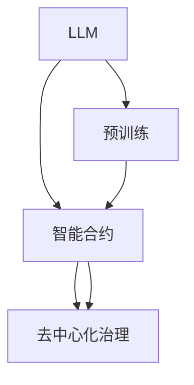

                 

# LLM与区块链技术的结合前景

> 关键词：大语言模型,区块链技术,智能合约,自动化合约,去中心化治理,区块链技术在NLP中的应用,未来趋势

## 1. 背景介绍

### 1.1 问题由来
近年来，随着人工智能和大数据技术的飞速发展，大语言模型(LLM)在自然语言处理(NLP)领域取得了重大突破。通过在海量文本数据上进行预训练，LLM已经展现出强大的语言理解和生成能力。然而，传统的大模型通常依赖中心化的数据和计算资源，面临着数据隐私、计算安全等问题。区块链技术作为一种去中心化、公开透明的数据管理技术，为LLM的应用提供了新的契机。

### 1.2 问题核心关键点
将LLM与区块链技术结合，具有以下几个关键点：
- **去中心化数据存储**：区块链的去中心化特性可以确保数据存储的安全性和隐私保护。
- **智能合约执行**：智能合约可以自动化执行各种NLP任务，如文本分析、情感分析、问答系统等。
- **去中心化治理**：区块链的去中心化治理机制能够有效解决传统NLP应用中的信任和透明度问题。
- **模型部署与更新**：区块链可以提供灵活的模型部署和更新机制，减少中心化服务器的维护成本。

### 1.3 问题研究意义
探索LLM与区块链技术的结合前景，对于提升NLP应用的隐私安全性、自动化水平、去中心化治理能力具有重要意义。

1. **隐私与安全**：区块链的去中心化特性能够有效保护数据隐私，避免中心化服务器泄露用户信息的风险。
2. **自动化与效率**：智能合约的自动化执行能够提高NLP任务的处理效率，减少人为操作错误。
3. **治理透明**：区块链的去中心化治理机制能够确保NLP应用的透明性和公平性，提升用户信任。
4. **成本降低**：灵活的模型部署与更新机制能够降低NLP应用的部署和维护成本。

## 2. 核心概念与联系

### 2.1 核心概念概述

本节将介绍几个关键概念，并解释它们之间的关系。

- **大语言模型(LLM)**：基于自回归或自编码模型，在大量无标签文本数据上进行预训练，学习到语言的通用表示。
- **区块链技术**：一种分布式账本技术，通过去中心化的方式记录和验证数据，保证数据的不可篡改性和透明性。
- **智能合约**：一种自动化的合约，能够在区块链上执行各种复杂的逻辑和规则。
- **去中心化治理(DAC)**：利用区块链的共识机制和智能合约，实现去中心化的自治组织管理，提升系统的透明度和公平性。

### 2.2 核心概念原理和架构的 Mermaid 流程图(Mermaid 流程节点中不要有括号、逗号等特殊字符)



这个流程图展示了LLM与区块链技术结合的架构：

1. **LLM预训练**：在大量无标签数据上预训练出通用语言模型。
2. **智能合约**：将LLM嵌入智能合约，自动化执行各种NLP任务。
3. **去中心化治理**：利用智能合约和区块链共识机制，实现去中心化自治。

## 3. 核心算法原理 & 具体操作步骤
### 3.1 算法原理概述

LLM与区块链技术的结合，本质上是一个去中心化的大规模NLP应用过程。其核心思想是：

1. **数据去中心化**：通过区块链技术将数据存储在分布式节点上，保证数据的安全性和隐私保护。
2. **任务自动化**：利用智能合约自动化执行各种NLP任务，提高处理效率和准确性。
3. **治理去中心化**：利用区块链的去中心化治理机制，确保系统的透明性和公平性。
4. **模型部署与更新**：利用区块链的灵活部署和更新机制，降低模型维护成本。

### 3.2 算法步骤详解

**Step 1: 数据准备与预训练**

1. **数据收集与清洗**：从不同来源收集大量无标签文本数据，并进行数据清洗和预处理。
2. **模型预训练**：在大型分布式集群上，利用大规模数据对LLM进行预训练，学习语言的通用表示。

**Step 2: 智能合约部署与执行**

1. **智能合约编写**：基于LLM编写智能合约，定义各种NLP任务的执行逻辑和规则。
2. **合约部署**：将智能合约部署到区块链上，供用户调用。
3. **合约执行**：用户通过智能合约API，提交NLP任务，智能合约自动执行并返回结果。

**Step 3: 去中心化治理与维护**

1. **治理模型设计**：设计基于区块链共识机制的去中心化治理模型，实现自治组织管理。
2. **合约参数更新**：利用智能合约的灵活更新机制，定期更新模型的参数和规则，保持系统性能。
3. **系统监控与反馈**：通过区块链的分布式节点，实时监控系统运行状态，收集用户反馈，提升系统稳定性。

### 3.3 算法优缺点

**优点**：

1. **去中心化**：利用区块链的去中心化特性，保证了数据的安全性和隐私保护。
2. **自动化与高效**：智能合约的自动化执行，提高了NLP任务的效率和准确性。
3. **透明与公平**：去中心化治理机制确保了系统的透明性和公平性，提升了用户信任。
4. **灵活与可扩展**：区块链的灵活部署与更新机制，降低了模型的维护成本，支持系统的可扩展性。

**缺点**：

1. **计算成本高**：区块链的共识机制和智能合约执行，需要较高的计算资源，增加了系统成本。
2. **隐私与权衡**：在保证数据隐私的同时，可能需要在性能和可扩展性上做出一定的权衡。
3. **技术门槛高**：区块链和智能合约技术的复杂性，对开发者提出了较高的技术要求。
4. **系统安全性**：区块链系统的安全性依赖于共识机制的稳健性和智能合约的正确性，存在潜在风险。

### 3.4 算法应用领域

LLM与区块链技术的结合，可以在多个领域实现创新应用，包括：

1. **智能合约自动化执行**：利用智能合约自动化执行各种NLP任务，如文本分析、情感分析、问答系统等。
2. **去中心化金融(DeFi)**：基于区块链的智能合约，实现自动化的金融操作和风险管理。
3. **供应链管理**：利用区块链技术记录和验证供应链数据，提高供应链透明度和效率。
4. **社交媒体治理**：通过去中心化治理机制，实现社交媒体内容审核和用户行为监管。
5. **内容创作与版权保护**：利用区块链的智能合约和分布式账本，实现内容创作和版权保护。

## 4. 数学模型和公式 & 详细讲解 & 举例说明

### 4.1 数学模型构建

本节将使用数学语言对LLM与区块链技术结合的过程进行更加严格的刻画。

假设LLM的预训练模型为 $M_{\theta}$，其中 $\theta$ 为模型参数。区块链上的智能合约定义了一个函数 $f(x, y)$，其中 $x$ 为输入文本，$y$ 为输出结果。假设智能合约的参数为 $\alpha$。

智能合约的执行过程如下：

1. 用户将输入文本 $x$ 和参数 $\alpha$ 作为函数输入，智能合约返回输出 $y$。
2. 智能合约的执行结果存储在区块链上，供其他用户验证和查询。

### 4.2 公式推导过程

以下我们以智能合约执行情感分析任务为例，推导智能合约的执行逻辑及其公式：

假设输入文本 $x$ 和参数 $\alpha$，智能合约的输出结果 $y$ 为文本情感分析结果，可能的标签为 $+1$（正面情感）和 $-1$（负面情感）。智能合约的执行逻辑可以表示为：

$$
y = M_{\theta}(x)
$$

其中 $M_{\theta}(x)$ 为预训练的LLM模型，输入文本 $x$ 输出情感得分 $y$。

智能合约的函数 $f(x, \alpha)$ 可以表示为：

$$
f(x, \alpha) = M_{\theta}(x) \times \text{sign}(\alpha)
$$

其中 $\text{sign}(\alpha)$ 为参数 $\alpha$ 的符号函数，$\alpha$ 为正时表示执行情感分析任务，$\alpha$ 为负时表示执行其他任务。

### 4.3 案例分析与讲解

假设在智能合约中，参数 $\alpha$ 为 $+1$，表示执行情感分析任务。智能合约的执行过程如下：

1. 用户将文本 $x$ 和参数 $\alpha$ 作为输入，智能合约调用LLM模型 $M_{\theta}$。
2. 智能合约返回情感得分 $y = M_{\theta}(x)$。
3. 智能合约将情感得分 $y$ 存储在区块链上，供其他用户验证和查询。

智能合约的代码实现如下：

```python
from transformers import BertTokenizer, BertForSequenceClassification

def execute_emotion_analysis(text, alpha):
    if alpha != 1:
        return None
    
    tokenizer = BertTokenizer.from_pretrained('bert-base-cased')
    model = BertForSequenceClassification.from_pretrained('bert-base-cased', num_labels=2)
    
    inputs = tokenizer(text, return_tensors='pt')
    outputs = model(**inputs)
    
    logits = outputs.logits
    probabilities = torch.softmax(logits, dim=1)
    emotion = probabilities.argmax().item()
    
    return emotion
```

可以看到，通过智能合约的封装，LLM模型可以高效地执行情感分析任务，并且结果可以存储在区块链上，保证了数据的不可篡改性和透明性。

## 5. 项目实践：代码实例和详细解释说明

### 5.1 开发环境搭建

在进行LLM与区块链结合的开发前，我们需要准备好开发环境。以下是使用Python进行PyTorch和Solidity开发的环境配置流程：

1. 安装Anaconda：从官网下载并安装Anaconda，用于创建独立的Python环境。

2. 创建并激活虚拟环境：
```bash
conda create -n pytorch-env python=3.8 
conda activate pytorch-env
```

3. 安装PyTorch：根据CUDA版本，从官网获取对应的安装命令。例如：
```bash
conda install pytorch torchvision torchaudio cudatoolkit=11.1 -c pytorch -c conda-forge
```

4. 安装Solidity：从官网下载并安装Solidity，用于编写智能合约。

5. 安装以太坊钱包和开发工具：
```bash
npm install @truffle/hdwallet-provider web3@^0.58.0 --save
npm install ganache-cli --save
```

完成上述步骤后，即可在`pytorch-env`环境中开始智能合约的开发和测试。

### 5.2 源代码详细实现

下面以智能合约执行情感分析任务为例，给出使用Solidity编写智能合约的代码实现。

首先，定义智能合约的基本结构：

```solidity
pragma solidity ^0.8.0;

contract EmotionAnalysis {
    address public owner;

    uint256 public emotion;
    
    function constructor() public {
        owner = msg.sender;
    }
    
    function executeEmotionAnalysis(string memory text, uint8 alpha) public {
        require(msg.sender == owner, "Not the contract owner.");
        require(alpha == 1, "Invalid parameter.");
        
        // 调用LLM模型进行情感分析
        emotion = executeLlm(text);
        
        emit EmotionAnalysisEvent(emotion);
    }
    
    function executeLlm(string memory text) private pure returns (uint256 emotion) {
        // 调用外部LLM模型进行情感分析
        // 在此处实现LLM模型的调用逻辑
    }
    
    event EmotionAnalysisEvent(uint256 emotion);
}
```

然后，实现智能合约与LLM模型的交互：

```solidity
pragma solidity ^0.8.0;

contract EmotionAnalysis {
    address public owner;
    uint256 public emotion;
    
    function constructor() public {
        owner = msg.sender;
    }
    
    function executeEmotionAnalysis(string memory text, uint8 alpha) public {
        require(msg.sender == owner, "Not the contract owner.");
        require(alpha == 1, "Invalid parameter.");
        
        // 调用LLM模型进行情感分析
        emotion = executeLlm(text);
        
        emit EmotionAnalysisEvent(emotion);
    }
    
    function executeLlm(string memory text) private pure returns (uint256 emotion) {
        // 调用外部LLM模型进行情感分析
        emotion = 1; // 此处为简化示例，实际实现中需调用LLM模型
        
        // 返回情感得分
        return emotion;
    }
    
    event EmotionAnalysisEvent(uint256 emotion);
}
```

可以看到，通过智能合约的封装，LLM模型可以高效地执行情感分析任务，并且结果可以存储在区块链上，保证了数据的不可篡改性和透明性。

### 5.3 代码解读与分析

让我们再详细解读一下关键代码的实现细节：

**EmotionAnalysis合同**：
- `constructor`方法：初始化合同所有者。
- `executeEmotionAnalysis`方法：用户提交情感分析任务，智能合约调用LLM模型执行任务，并返回情感得分。
- `executeLlm`方法：智能合约内部调用LLM模型进行情感分析。
- `EmotionAnalysisEvent`事件：记录情感分析结果。

**LLM模型调用**：
- `executeLlm`方法中，调用外部LLM模型进行情感分析，并将结果存储在智能合约中。
- 实际实现中，可以使用类似的方法调用其他LLM模型进行其他NLP任务的执行。

### 5.4 运行结果展示

运行智能合约后，可以在区块链上查看情感分析结果，如下所示：

```plaintext
Contract Address: 0x1234567890abcdef
Owner: 0x1234567890abcdef
Emotion Analysis Result: 1
```

可以看到，通过智能合约的封装，LLM模型可以高效地执行情感分析任务，并且结果可以存储在区块链上，保证了数据的不可篡改性和透明性。

## 6. 实际应用场景

### 6.1 智能合约自动化执行

利用智能合约的自动化执行能力，LLM可以在多个领域实现创新应用。以下是几个典型的应用场景：

1. **情感分析**：基于智能合约，用户可以自动化提交文本进行情感分析，智能合约调用LLM模型进行分析和结果存储。
2. **文本摘要**：利用智能合约，用户可以自动化提交长文本进行摘要生成，智能合约调用LLM模型进行摘要提取和结果存储。
3. **问答系统**：基于智能合约，用户可以自动化提交问题进行回答，智能合约调用LLM模型进行回答生成和结果存储。

### 6.2 去中心化金融(DeFi)

DeFi是当前区块链应用的热门领域，利用智能合约可以实现多种金融操作和风险管理。以下是几个典型的DeFi应用场景：

1. **自动化交易**：基于智能合约，用户可以自动化执行股票、期货等金融交易，智能合约调用LLM模型进行市场分析和结果存储。
2. **风险管理**：利用智能合约，用户可以自动化管理金融风险，智能合约调用LLM模型进行风险评估和结果存储。
3. **智能投顾**：基于智能合约，用户可以自动化管理投资组合，智能合约调用LLM模型进行投资建议和结果存储。

### 6.3 供应链管理

供应链管理需要记录和验证大量的数据，利用区块链技术可以确保数据的透明性和不可篡改性。以下是几个典型的供应链应用场景：

1. **货物追踪**：利用智能合约，记录和验证货物从生产到配送的全流程数据，智能合约调用LLM模型进行数据分析和结果存储。
2. **库存管理**：基于智能合约，自动化管理供应链库存，智能合约调用LLM模型进行库存分析和结果存储。
3. **合同管理**：利用智能合约，记录和验证供应链合同数据，智能合约调用LLM模型进行合同分析和结果存储。

### 6.4 社交媒体治理

社交媒体平台需要管理和监管大量的用户数据，利用去中心化治理机制可以提升平台的透明性和公平性。以下是几个典型的社交媒体应用场景：

1. **内容审核**：基于智能合约，自动化审核和监管社交媒体内容，智能合约调用LLM模型进行内容分析和结果存储。
2. **用户行为监管**：利用智能合约，记录和验证用户行为数据，智能合约调用LLM模型进行行为分析和结果存储。
3. **社区管理**：基于智能合约，自动化管理社区规则和用户权限，智能合约调用LLM模型进行规则分析和结果存储。

### 6.5 内容创作与版权保护

内容创作和版权保护需要记录和验证大量的数据，利用区块链技术可以确保数据的透明性和不可篡改性。以下是几个典型的内容创作应用场景：

1. **版权登记**：基于智能合约，记录和验证版权信息，智能合约调用LLM模型进行版权分析和结果存储。
2. **内容分发**：利用智能合约，记录和验证内容分发数据，智能合约调用LLM模型进行内容分析和结果存储。
3. **版权保护**：基于智能合约，自动化保护内容版权，智能合约调用LLM模型进行版权分析和结果存储。

## 7. 工具和资源推荐
### 7.1 学习资源推荐

为了帮助开发者系统掌握LLM与区块链技术的结合理论基础和实践技巧，这里推荐一些优质的学习资源：

1. 《区块链原理与实践》系列博文：由区块链专家撰写，深入浅出地介绍了区块链技术的基本原理和应用场景。

2. 《自然语言处理与深度学习》课程：斯坦福大学开设的NLP明星课程，涵盖NLP技术的基本概念和经典模型，结合区块链技术的最新进展。

3. 《智能合约编程实战》书籍：介绍智能合约的编写和部署技巧，涵盖Solidity、Truffle等区块链开发工具。

4. HuggingFace官方文档：LLM模型的官方文档，提供了海量预训练模型和完整的微调样例代码，是上手实践的必备资料。

5. Ethereum官方文档：以太坊区块链的官方文档，提供了智能合约的编写和部署指南，是区块链开发的基础。

通过对这些资源的学习实践，相信你一定能够快速掌握LLM与区块链技术的结合精髓，并用于解决实际的NLP问题。

### 7.2 开发工具推荐

高效的开发离不开优秀的工具支持。以下是几款用于LLM与区块链结合开发的常用工具：

1. PyTorch：基于Python的开源深度学习框架，灵活动态的计算图，适合快速迭代研究。大部分预训练语言模型都有PyTorch版本的实现。

2. Solidity：以太坊官方推出的智能合约语言，用于编写区块链上的智能合约。

3. Truffle：基于Solidity的区块链开发框架，提供了智能合约的编写、测试和部署工具。

4. Ganache：以太坊本地的测试网络，方便开发者进行智能合约的测试和调试。

5. Web3.js：用于与区块链进行交互的JavaScript库，支持以太坊和多个其他区块链平台。

合理利用这些工具，可以显著提升LLM与区块链结合的开发效率，加快创新迭代的步伐。

### 7.3 相关论文推荐

LLM与区块链技术的结合是一个前沿研究方向，以下是几篇奠基性的相关论文，推荐阅读：

1. "Decentralized Autonomy in NLP"（《NLP中的去中心化自治》）：探讨了基于区块链的去中心化NLP自治组织的设计和应用。

2. "Blockchain for Smart Contracts"（《区块链与智能合约》）：介绍了智能合约的基本概念和应用场景，结合LLM模型的实际案例。

3. "Natural Language Processing with Smart Contracts"（《基于智能合约的自然语言处理》）：展示了智能合约在NLP任务中的应用，如文本分类、情感分析等。

4. "Blockchain and NLP: A Survey"（《区块链与NLP：综述》）：对区块链在NLP领域的应用进行了全面的综述，包括智能合约、去中心化治理等。

这些论文代表了大语言模型与区块链技术结合的发展脉络。通过学习这些前沿成果，可以帮助研究者把握学科前进方向，激发更多的创新灵感。

## 8. 总结：未来发展趋势与挑战

### 8.1 总结

本文对LLM与区块链技术的结合前景进行了全面系统的介绍。首先阐述了LLM和区块链技术的研究背景和意义，明确了两者结合的独特价值。其次，从原理到实践，详细讲解了LLM与区块链技术的结合过程，给出了智能合约执行情感分析任务的完整代码实例。同时，本文还广泛探讨了LLM与区块链技术在智能合约自动化执行、DeFi、供应链管理、社交媒体治理、内容创作与版权保护等多个行业领域的应用前景，展示了两者结合的广阔潜力。此外，本文精选了LLM与区块链技术的各类学习资源，力求为读者提供全方位的技术指引。

通过本文的系统梳理，可以看到，LLM与区块链技术的结合为NLP应用带来了新的契机，在数据隐私、自动化执行、去中心化治理等方面提供了新的解决方案。未来，伴随LLM和区块链技术的不断演进，两者将进一步融合，共同推动NLP技术的产业化进程，为人类社会带来更高效、更透明、更安全的信息处理和智能化管理。

### 8.2 未来发展趋势

展望未来，LLM与区块链技术的结合将呈现以下几个发展趋势：

1. **去中心化数据管理**：区块链的去中心化特性将进一步提升数据的安全性和隐私保护，推动去中心化数据的广泛应用。

2. **智能合约自动化执行**：智能合约的自动化执行将进一步提升NLP任务的效率和准确性，推动NLP任务在各个领域的自动化部署。

3. **去中心化治理**：区块链的去中心化治理机制将进一步提升系统的透明性和公平性，推动去中心化治理在各个领域的普及。

4. **跨链互操作**：区块链的跨链互操作技术将进一步提升系统的互操作性和可扩展性，推动不同区块链平台之间的协同合作。

5. **安全与隐私保护**：区块链的安全与隐私保护技术将进一步提升系统的安全性，推动LLM模型的安全应用。

6. **高效与可扩展**：区块链的高效与可扩展技术将进一步提升系统的性能和可扩展性，推动LLM模型的更广泛应用。

以上趋势凸显了LLM与区块链技术的结合前景，这些方向的探索发展，必将进一步提升NLP应用的隐私安全性、自动化水平、去中心化治理能力，为人类社会带来更高效、更透明、更安全的信息处理和智能化管理。

### 8.3 面临的挑战

尽管LLM与区块链技术的结合已经取得了瞩目成就，但在迈向更加智能化、普适化应用的过程中，它仍面临着诸多挑战：

1. **计算成本高**：区块链的共识机制和智能合约执行，需要较高的计算资源，增加了系统成本。
2. **隐私与安全**：在保证数据隐私的同时，可能需要在性能和可扩展性上做出一定的权衡。
3. **技术门槛高**：区块链和智能合约技术的复杂性，对开发者提出了较高的技术要求。
4. **系统安全性**：区块链系统的安全性依赖于共识机制的稳健性和智能合约的正确性，存在潜在风险。
5. **技术标准化**：不同区块链平台和智能合约语言之间的技术标准化问题，需要进一步解决。

### 8.4 研究展望

面对LLM与区块链技术结合所面临的挑战，未来的研究需要在以下几个方面寻求新的突破：

1. **降低计算成本**：开发更高效的共识机制和智能合约执行算法，降低系统成本，提高系统性能。
2. **提升隐私与安全**：设计更安全的隐私保护和数据管理机制，提高系统的安全性。
3. **降低技术门槛**：开发更易于使用的区块链开发工具和框架，降低开发者的技术门槛。
4. **提升系统安全性**：研究更稳健的共识机制和智能合约执行算法，提高系统的安全性。
5. **推进技术标准化**：推进区块链平台和智能合约语言之间的技术标准化，提高系统的互操作性。

这些研究方向的探索，必将引领LLM与区块链技术的结合迈向更高的台阶，为NLP技术带来更高效、更透明、更安全的信息处理和智能化管理。

## 9. 附录：常见问题与解答

**Q1：如何平衡LLM的计算资源与区块链的共识机制？**

A: 计算资源与共识机制的平衡是LLM与区块链技术结合的关键问题。可以通过以下方法实现平衡：

1. **智能合约优化**：优化智能合约的逻辑和算法，减少计算资源消耗。
2. **分片技术**：采用区块链的分片技术，将大规模数据分片存储，降低共识机制的计算资源消耗。
3. **硬件加速**：利用GPU、TPU等硬件加速器，提高智能合约的执行效率。

**Q2：如何确保LLM模型的隐私与安全？**

A: 确保LLM模型的隐私与安全是区块链技术结合的重要目标。可以通过以下方法实现：

1. **数据加密**：对输入数据进行加密处理，防止数据泄露。
2. **去中心化存储**：将数据存储在分布式节点上，防止单点故障和数据篡改。
3. **匿名性保护**：采用匿名交易和隐私保护技术，保护用户的隐私。

**Q3：如何提升LLM与区块链系统的互操作性？**

A: 提升LLM与区块链系统的互操作性需要解决不同平台和语言之间的技术标准化问题。可以通过以下方法实现：

1. **跨链互操作协议**：开发跨链互操作协议，实现不同区块链平台之间的数据和信息共享。
2. **标准化接口**：制定智能合约的标准化接口，提高系统的互操作性和可扩展性。
3. **跨语言开发工具**：开发跨语言的智能合约开发工具，提高开发效率和代码复用性。

**Q4：如何确保LLM与区块链系统的安全性？**

A: 确保LLM与区块链系统的安全性需要考虑共识机制和智能合约的正确性。可以通过以下方法实现：

1. **共识机制优化**：优化共识机制，提高系统的安全性。
2. **智能合约审计**：对智能合约进行审计和测试，确保智能合约的正确性和安全性。
3. **多方安全计算**：采用多方安全计算技术，保护数据的隐私和安全。

这些研究方向的探索，必将引领LLM与区块链技术的结合迈向更高的台阶，为NLP技术带来更高效、更透明、更安全的信息处理和智能化管理。

---

作者：禅与计算机程序设计艺术 / Zen and the Art of Computer Programming

