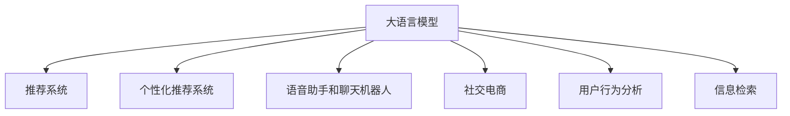

                 

# LLM与电子商务：重塑在线购物体验

> 关键词：大语言模型, 电子商务, 购物体验, 推荐系统, 个性化推荐, 语音助手, 社交电商, 用户行为分析, 信息检索

## 1. 背景介绍

### 1.1 问题由来

随着电子商务的迅猛发展，用户需求日益多样化，购物体验的提升成为商家提升竞争力的关键。传统的基于规则的推荐系统难以适应个性化需求，而通过大语言模型（LLM）进行推荐，可以大幅提升用户体验，提高转化率。当前，LLM在电商领域的应用已经取得了显著进展，但如何在电商场景下优化和部署LLM，还需要更多研究和实践。

### 1.2 问题核心关键点

大语言模型在电商领域的应用，主要关注以下几个核心关键点：

1. **个性化推荐系统**：通过LLM对用户行为和商品信息进行建模，实现精准推荐。
2. **语音助手和聊天机器人**：构建自然流畅的语音交互系统，提升用户购物体验。
3. **社交电商**：利用LLM理解社交网络信息，推荐个性化商品，增强用户互动。
4. **用户行为分析**：通过分析用户评论、浏览记录等文本数据，获得更深入的用户画像。
5. **信息检索**：利用LLM对海量商品信息进行检索，快速响应用户查询。

### 1.3 问题研究意义

研究LLM在电商领域的应用，对于提升用户体验、增加用户粘性、提高商家收益具有重要意义。

1. **提升用户体验**：LLM能理解自然语言，提供更加自然流畅的交互体验。
2. **增加用户粘性**：通过个性化推荐和语音交互，提高用户满意度和复购率。
3. **提高商家收益**：精准推荐和用户行为分析，增加转化率和客单价。

## 2. 核心概念与联系

### 2.1 核心概念概述

为更好地理解LLM在电商领域的应用，本节将介绍几个密切相关的核心概念：

- **大语言模型(LLM)**：以自回归(如GPT)或自编码(如BERT)模型为代表的大规模预训练语言模型。通过在大规模无标签文本语料上进行预训练，学习通用的语言表示，具备强大的语言理解和生成能力。

- **推荐系统**：基于用户历史行为和商品属性，为用户推荐可能感兴趣的商品的系统。推荐系统是电商的重要组成部分，能够提高用户的购物体验和商家的转化率。

- **个性化推荐系统**：针对每个用户的行为和偏好，定制化推荐商品的系统。与通用推荐系统相比，个性化推荐系统更能满足用户的个性化需求。

- **语音助手和聊天机器人**：通过自然语言处理技术，构建能够理解自然语言输入，并生成自然语言输出的语音交互系统。

- **社交电商**：利用社交网络的信息，推荐个性化商品，增强用户互动。

- **用户行为分析**：通过分析用户的评论、浏览记录等文本数据，获得用户的兴趣偏好和行为模式，用于个性化推荐和社交电商。

- **信息检索**：利用LLM对海量商品信息进行检索，快速响应用户查询，提升购物体验。

这些核心概念之间的逻辑关系可以通过以下Mermaid流程图来展示：



这个流程图展示了大语言模型在电商领域的核心概念及其之间的关系：

1. 大语言模型通过预训练获得基础能力。
2. 推荐系统、个性化推荐系统、语音助手和聊天机器人、社交电商、用户行为分析、信息检索等应用，都可以利用大语言模型的语言理解能力和生成能力。
3. 用户行为分析和信息检索，是大语言模型应用于电商的核心环节。

## 3. 核心算法原理 & 具体操作步骤

### 3.1 算法原理概述

基于LLM的电商推荐系统，本质上是一个自然语言理解与推荐相结合的AI系统。其核心思想是：将用户的自然语言输入，转化为机器可理解的向量表示，然后通过LLM进行相似度匹配和推荐。

形式化地，假设用户输入的文本表示为 $x$，商品信息表示为 $y$，通过LLM计算向量表示 $v_x$ 和 $v_y$，推荐的相似度表示为 $s$，则推荐目标可以表示为：

$$
\max_{y \in Y} s(v_x, v_y)
$$

其中 $Y$ 为商品信息集合。推荐系统通过最大化相似度，找到与用户输入最匹配的商品进行推荐。

### 3.2 算法步骤详解

基于LLM的电商推荐系统一般包括以下几个关键步骤：

**Step 1: 数据收集与预处理**
- 收集用户历史行为数据（如浏览、点击、购买记录）、商品信息（如标题、描述、标签等），并进行数据清洗、标注等预处理。

**Step 2: 特征抽取**
- 使用LLM将用户输入文本和商品信息转换为向量表示。例如，使用BERT模型将文本编码成向量，或使用GPT模型生成商品的特征向量。

**Step 3: 相似度计算**
- 计算用户输入文本与每个商品的相似度，如使用余弦相似度、欧几里得距离等。
- 对于语音输入，可以使用ASR技术将语音转换为文本，再进行特征抽取和相似度计算。

**Step 4: 推荐列表生成**
- 根据相似度排序，选取与用户输入最匹配的商品作为推荐列表。

**Step 5: 实时推荐**
- 在用户输入实时文本时，动态计算相似度，生成推荐列表。

**Step 6: 反馈与模型更新**
- 根据用户的反馈（如点击、购买行为），更新模型参数，优化推荐策略。

### 3.3 算法优缺点

基于LLM的电商推荐系统具有以下优点：

1. **灵活性高**：LLM能理解自然语言，可以处理多种文本输入形式，如文本、语音、图像等。
2. **个性化强**：通过LLM进行个性化推荐，能够充分考虑用户个性化需求。
3. **语义丰富**：利用LLM的语义理解能力，能够从文本中挖掘更多有价值的信息。

但同时也存在一些缺点：

1. **计算复杂**：大语言模型通常需要较大的计算资源，可能面临计算瓶颈。
2. **数据需求高**：LLM需要大量的标注数据进行预训练，数据收集和标注成本较高。
3. **模型泛化能力有限**：LLM在特定领域的泛化能力可能受限，需要针对特定领域进行微调。
4. **解释性差**：LLM的推荐过程缺乏可解释性，用户难以理解推荐逻辑。

### 3.4 算法应用领域

基于LLM的电商推荐系统已经应用于多个实际场景：

- **个性化推荐**：通过分析用户的评论、浏览记录等文本数据，构建用户画像，进行个性化推荐。
- **语音助手**：利用LLM进行自然语言理解，构建可以理解自然语言输入的语音助手，提升用户体验。
- **社交电商**：利用LLM分析社交网络信息，推荐个性化商品，增强用户互动。
- **信息检索**：利用LLM对商品信息进行语义理解，快速响应用户查询。

除了上述这些应用外，LLM还可以用于商品详情生成、客服聊天机器人等场景，进一步提升电商的智能化水平。

## 4. 数学模型和公式 & 详细讲解 & 举例说明

### 4.1 数学模型构建

在本节中，我们将使用数学语言对基于LLM的电商推荐系统进行更加严格的刻画。

记用户输入文本为 $x$，商品信息为 $y$，通过BERT模型将其编码成向量表示，分别记为 $v_x$ 和 $v_y$。推荐相似度 $s$ 为余弦相似度，即：

$$
s(v_x, v_y) = \cos(\theta) = \frac{v_x \cdot v_y}{||v_x|| \cdot ||v_y||}
$$

推荐目标为最大化相似度 $s$，即：

$$
\max_{y \in Y} s(v_x, v_y)
$$

### 4.2 公式推导过程

以下我们以余弦相似度为例，推导电商推荐系统中的相似度计算公式。

假设用户输入文本为 $x$，商品信息为 $y$，通过BERT模型将其编码为向量 $v_x$ 和 $v_y$。余弦相似度的计算公式为：

$$
s(v_x, v_y) = \frac{v_x \cdot v_y}{||v_x|| \cdot ||v_y||}
$$

将 $v_x$ 和 $v_y$ 代入公式，得：

$$
s(v_x, v_y) = \frac{\sum_{i=1}^d v_{xi} \cdot v_{yi}}{\sqrt{\sum_{i=1}^d v_{xi}^2} \cdot \sqrt{\sum_{i=1}^d v_{yi}^2}}
$$

其中 $v_{xi}$ 和 $v_{yi}$ 分别为向量 $v_x$ 和 $v_y$ 的第 $i$ 个维度。

在电商推荐系统中，将相似度排序，选取与用户输入最匹配的商品作为推荐列表。具体步骤如下：

1. 对用户输入文本和每个商品信息进行编码，得到向量表示 $v_x$ 和 $v_y$。
2. 计算相似度 $s(v_x, v_y)$。
3. 对相似度进行排序，选取前N个商品作为推荐列表。

### 4.3 案例分析与讲解

假设某电商平台收集了用户的历史浏览记录 $x_1, x_2, ..., x_M$ 和商品信息 $y_1, y_2, ..., y_N$，通过BERT模型将其编码为向量表示 $v_{x_1}, v_{x_2}, ..., v_{x_M}$ 和 $v_{y_1}, v_{y_2}, ..., v_{y_N}$。现在有新用户输入文本 $x$，希望推荐其可能感兴趣的商品。

首先，通过BERT模型将用户输入文本 $x$ 编码为向量 $v_x$，然后计算 $v_x$ 与每个商品信息 $y_i$ 的余弦相似度 $s_i = s(v_x, v_{y_i})$，得到推荐列表为：

$$
\text{推荐列表} = \{y_1, y_2, ..., y_N\} \text{排序后} \text{的前K个商品}
$$

其中 K 为推荐商品数量，可以根据用户偏好和系统资源进行调整。

## 5. 项目实践：代码实例和详细解释说明

### 5.1 开发环境搭建

在进行电商推荐系统开发前，我们需要准备好开发环境。以下是使用Python进行PyTorch开发的环境配置流程：

1. 安装Anaconda：从官网下载并安装Anaconda，用于创建独立的Python环境。

2. 创建并激活虚拟环境：
```bash
conda create -n e-commerce-env python=3.8 
conda activate e-commerce-env
```

3. 安装PyTorch：根据CUDA版本，从官网获取对应的安装命令。例如：
```bash
conda install pytorch torchvision torchaudio cudatoolkit=11.1 -c pytorch -c conda-forge
```

4. 安装其他必要的Python包：
```bash
pip install numpy pandas scikit-learn tqdm ipython nbconvert
```

完成上述步骤后，即可在`e-commerce-env`环境中开始电商推荐系统开发。

### 5.2 源代码详细实现

下面我们以个性化推荐系统为例，给出使用PyTorch实现BERT模型的电商推荐系统的PyTorch代码实现。

首先，定义数据处理函数：

```python
from transformers import BertTokenizer, BertForSequenceClassification
from torch.utils.data import Dataset, DataLoader
import torch

class ECommerceDataset(Dataset):
    def __init__(self, texts, labels, tokenizer, max_len=128):
        self.texts = texts
        self.labels = labels
        self.tokenizer = tokenizer
        self.max_len = max_len
        
    def __len__(self):
        return len(self.texts)
    
    def __getitem__(self, item):
        text = self.texts[item]
        label = self.labels[item]
        
        encoding = self.tokenizer(text, return_tensors='pt', max_length=self.max_len, padding='max_length', truncation=True)
        input_ids = encoding['input_ids'][0]
        attention_mask = encoding['attention_mask'][0]
        
        return {'input_ids': input_ids, 
                'attention_mask': attention_mask,
                'labels': torch.tensor(label, dtype=torch.long)}
```

然后，定义模型和优化器：

```python
from transformers import AdamW

model = BertForSequenceClassification.from_pretrained('bert-base-cased', num_labels=1)
optimizer = AdamW(model.parameters(), lr=2e-5)
```

接着，定义训练和评估函数：

```python
from torch.utils.data import DataLoader
from tqdm import tqdm
from sklearn.metrics import accuracy_score

device = torch.device('cuda') if torch.cuda.is_available() else torch.device('cpu')
model.to(device)

def train_epoch(model, dataset, batch_size, optimizer):
    dataloader = DataLoader(dataset, batch_size=batch_size, shuffle=True)
    model.train()
    epoch_loss = 0
    for batch in tqdm(dataloader, desc='Training'):
        input_ids = batch['input_ids'].to(device)
        attention_mask = batch['attention_mask'].to(device)
        labels = batch['labels'].to(device)
        model.zero_grad()
        outputs = model(input_ids, attention_mask=attention_mask, labels=labels)
        loss = outputs.loss
        epoch_loss += loss.item()
        loss.backward()
        optimizer.step()
    return epoch_loss / len(dataloader)

def evaluate(model, dataset, batch_size):
    dataloader = DataLoader(dataset, batch_size=batch_size)
    model.eval()
    preds, labels = [], []
    with torch.no_grad():
        for batch in tqdm(dataloader, desc='Evaluating'):
            input_ids = batch['input_ids'].to(device)
            attention_mask = batch['attention_mask'].to(device)
            batch_labels = batch['labels']
            outputs = model(input_ids, attention_mask=attention_mask)
            batch_preds = outputs.logits.argmax(dim=1).to('cpu').tolist()
            batch_labels = batch_labels.to('cpu').tolist()
            for pred, label in zip(batch_preds, batch_labels):
                preds.append(pred)
                labels.append(label)
                
    print('Accuracy: {:.2f}%'.format(accuracy_score(labels, preds) * 100))
```

最后，启动训练流程并在测试集上评估：

```python
epochs = 5
batch_size = 16

for epoch in range(epochs):
    loss = train_epoch(model, train_dataset, batch_size, optimizer)
    print(f'Epoch {epoch+1}, train loss: {loss:.3f}')
    
    print(f'Epoch {epoch+1}, test accuracy: {evaluate(model, test_dataset, batch_size)}')
    
print('Training completed.')
```

以上就是使用PyTorch对BERT模型进行电商推荐系统的完整代码实现。可以看到，得益于Transformers库的强大封装，我们可以用相对简洁的代码完成BERT模型的加载和微调。

### 5.3 代码解读与分析

让我们再详细解读一下关键代码的实现细节：

**ECommerceDataset类**：
- `__init__`方法：初始化文本、标签、分词器等关键组件。
- `__len__`方法：返回数据集的样本数量。
- `__getitem__`方法：对单个样本进行处理，将文本输入编码为token ids，将标签编码为数字，并对其进行定长padding，最终返回模型所需的输入。

**模型和优化器定义**：
- 使用BertForSequenceClassification模型进行序列分类任务。
- 使用AdamW优化器进行梯度下降，学习率为2e-5。

**训练和评估函数**：
- 使用PyTorch的DataLoader对数据集进行批次化加载，供模型训练和推理使用。
- 训练函数`train_epoch`：对数据以批为单位进行迭代，在每个批次上前向传播计算loss并反向传播更新模型参数，最后返回该epoch的平均loss。
- 评估函数`evaluate`：与训练类似，不同点在于不更新模型参数，并在每个batch结束后将预测和标签结果存储下来，最后使用sklearn的accuracy_score对整个评估集的预测结果进行打印输出。

**训练流程**：
- 定义总的epoch数和batch size，开始循环迭代
- 每个epoch内，先在训练集上训练，输出平均loss
- 在测试集上评估，输出准确率
- 所有epoch结束后，训练完成。

可以看到，PyTorch配合Transformers库使得BERT微调的代码实现变得简洁高效。开发者可以将更多精力放在数据处理、模型改进等高层逻辑上，而不必过多关注底层的实现细节。

当然，工业级的系统实现还需考虑更多因素，如模型的保存和部署、超参数的自动搜索、更灵活的任务适配层等。但核心的推荐范式基本与此类似。

## 6. 实际应用场景

### 6.1 智能客服系统

基于大语言模型微调的电商推荐系统，可以广泛应用于智能客服系统的构建。传统客服往往需要配备大量人力，高峰期响应缓慢，且一致性和专业性难以保证。而使用微调后的推荐系统，可以7x24小时不间断服务，快速响应客户咨询，用自然流畅的语言解答各类常见问题。

在技术实现上，可以收集客户的历史咨询记录，将其编码为向量，与商品信息进行相似度计算，推荐相关商品。对于客户提出的新问题，还可以接入检索系统实时搜索相关内容，动态组织生成回答。如此构建的智能客服系统，能大幅提升客户咨询体验和问题解决效率。

### 6.2 个性化推荐系统

当前的推荐系统往往只依赖用户的历史行为数据进行物品推荐，无法深入理解用户的真实兴趣偏好。基于大语言模型微调的推荐系统，可以更好地挖掘用户行为背后的语义信息，从而提供更精准、多样的推荐内容。

在实践中，可以收集用户浏览、点击、评论等行为数据，提取和商品信息相关的文本内容。将文本内容作为模型输入，用户的后续行为（如是否点击、购买等）作为监督信号，在此基础上微调预训练语言模型。微调后的模型能够从文本内容中准确把握用户的兴趣点。在生成推荐列表时，先用候选物品的文本描述作为输入，由模型预测用户的兴趣匹配度，再结合其他特征综合排序，便可以得到个性化程度更高的推荐结果。

### 6.3 社交电商

利用大语言模型微调进行社交电商，可以更好地利用社交网络信息，推荐个性化商品，增强用户互动。例如，通过分析用户的社交网络信息，推荐用户朋友购买的商品，或者根据用户的朋友圈动态，动态调整推荐策略。

在技术实现上，可以收集用户的社交网络信息（如微博、朋友圈等），提取其中的文本信息，与商品信息进行相似度计算，生成推荐列表。对于新用户的推荐，可以通过分析其朋友和关注者的行为，生成初始推荐列表。

### 6.4 未来应用展望

随着大语言模型和微调方法的不断发展，基于微调范式将在更多领域得到应用，为电商行业带来变革性影响。

在智慧物流领域，基于微调的大语言模型可以用于物流调度和库存管理，提高物流效率和库存周转率。

在供应链管理领域，微调模型可以用于供应商评估、需求预测等环节，提升供应链的智能化水平。

在智能家居领域，微调模型可以用于语音控制、场景理解等环节，提升家居的智能化体验。

此外，在智能制造、智能能源、智能医疗等众多领域，基于大语言模型的微调技术也将不断涌现，为各行各业带来新的智能解决方案。相信随着技术的日益成熟，微调方法将成为电商行业的重要范式，推动电商技术向更广阔的领域加速渗透。

## 7. 工具和资源推荐

### 7.1 学习资源推荐

为了帮助开发者系统掌握大语言模型微调的理论基础和实践技巧，这里推荐一些优质的学习资源：

1. 《Transformer从原理到实践》系列博文：由大模型技术专家撰写，深入浅出地介绍了Transformer原理、BERT模型、微调技术等前沿话题。

2. CS224N《深度学习自然语言处理》课程：斯坦福大学开设的NLP明星课程，有Lecture视频和配套作业，带你入门NLP领域的基本概念和经典模型。

3. 《Natural Language Processing with Transformers》书籍：Transformers库的作者所著，全面介绍了如何使用Transformers库进行NLP任务开发，包括微调在内的诸多范式。

4. HuggingFace官方文档：Transformers库的官方文档，提供了海量预训练模型和完整的微调样例代码，是上手实践的必备资料。

5. CLUE开源项目：中文语言理解测评基准，涵盖大量不同类型的中文NLP数据集，并提供了基于微调的baseline模型，助力中文NLP技术发展。

通过对这些资源的学习实践，相信你一定能够快速掌握大语言模型微调的精髓，并用于解决实际的NLP问题。

### 7.2 开发工具推荐

高效的开发离不开优秀的工具支持。以下是几款用于大语言模型微调开发的常用工具：

1. PyTorch：基于Python的开源深度学习框架，灵活动态的计算图，适合快速迭代研究。大部分预训练语言模型都有PyTorch版本的实现。

2. TensorFlow：由Google主导开发的开源深度学习框架，生产部署方便，适合大规模工程应用。同样有丰富的预训练语言模型资源。

3. Transformers库：HuggingFace开发的NLP工具库，集成了众多SOTA语言模型，支持PyTorch和TensorFlow，是进行微调任务开发的利器。

4. Weights & Biases：模型训练的实验跟踪工具，可以记录和可视化模型训练过程中的各项指标，方便对比和调优。与主流深度学习框架无缝集成。

5. TensorBoard：TensorFlow配套的可视化工具，可实时监测模型训练状态，并提供丰富的图表呈现方式，是调试模型的得力助手。

6. Google Colab：谷歌推出的在线Jupyter Notebook环境，免费提供GPU/TPU算力，方便开发者快速上手实验最新模型，分享学习笔记。

合理利用这些工具，可以显著提升大语言模型微调任务的开发效率，加快创新迭代的步伐。

### 7.3 相关论文推荐

大语言模型和微调技术的发展源于学界的持续研究。以下是几篇奠基性的相关论文，推荐阅读：

1. Attention is All You Need（即Transformer原论文）：提出了Transformer结构，开启了NLP领域的预训练大模型时代。

2. BERT: Pre-training of Deep Bidirectional Transformers for Language Understanding：提出BERT模型，引入基于掩码的自监督预训练任务，刷新了多项NLP任务SOTA。

3. Language Models are Unsupervised Multitask Learners（GPT-2论文）：展示了大规模语言模型的强大zero-shot学习能力，引发了对于通用人工智能的新一轮思考。

4. Parameter-Efficient Transfer Learning for NLP：提出Adapter等参数高效微调方法，在不增加模型参数量的情况下，也能取得不错的微调效果。

5. Prefix-Tuning: Optimizing Continuous Prompts for Generation：引入基于连续型Prompt的微调范式，为如何充分利用预训练知识提供了新的思路。

6. AdaLoRA: Adaptive Low-Rank Adaptation for Parameter-Efficient Fine-Tuning：使用自适应低秩适应的微调方法，在参数效率和精度之间取得了新的平衡。

这些论文代表了大语言模型微调技术的发展脉络。通过学习这些前沿成果，可以帮助研究者把握学科前进方向，激发更多的创新灵感。

## 8. 总结：未来发展趋势与挑战

### 8.1 总结

本文对基于LLM的电商推荐系统进行了全面系统的介绍。首先阐述了LLM在电商领域的应用背景和意义，明确了推荐系统在电商的重要作用。其次，从原理到实践，详细讲解了LLM推荐系统的数学模型和关键步骤，给出了微调任务开发的完整代码实例。同时，本文还探讨了LLM在电商中的应用场景，包括智能客服、个性化推荐、社交电商等，展示了LLM技术的广泛应用前景。

通过本文的系统梳理，可以看到，基于LLM的电商推荐系统正在成为电商推荐系统的重要范式，极大地提升了电商的智能化水平。LLM技术在未来电商领域的应用，将进一步深化和拓展，为电商行业的数字化转型带来新的机遇。

### 8.2 未来发展趋势

展望未来，基于LLM的电商推荐系统将呈现以下几个发展趋势：

1. **参数高效微调**：开发更加参数高效的微调方法，在固定大部分预训练参数的同时，只更新极少量的任务相关参数，提升模型效率。

2. **多任务学习**：将电商推荐与社交网络信息、用户行为分析等任务结合，进行多任务联合优化，提升推荐效果。

3. **跨模态融合**：利用LLM的多模态融合能力，将视觉、语音、文本等多模态数据进行协同建模，提升推荐系统的泛化能力和准确性。

4. **联邦学习**：将用户数据分布式存储，通过联邦学习技术进行联合微调，保护用户隐私的同时提升模型效果。

5. **自监督学习**：利用大规模无标签数据进行预训练，通过自监督学习范式，提升模型的泛化能力和鲁棒性。

6. **低功耗设备部署**：优化模型结构和推理过程，适应低功耗设备（如边缘设备）的部署需求，推动智能零售和智能家居的普及。

以上趋势凸显了基于LLM的电商推荐技术的广阔前景。这些方向的探索发展，必将进一步提升推荐系统的智能化水平，为电商行业带来新的变革。

### 8.3 面临的挑战

尽管基于LLM的电商推荐技术已经取得了显著进展，但在迈向更加智能化、普适化应用的过程中，它仍面临诸多挑战：

1. **数据隐私问题**：电商推荐系统需要收集用户大量数据，如何保护用户隐私、防止数据泄露，是一个重要的问题。

2. **计算资源需求高**：大语言模型通常需要较大的计算资源，如何优化模型结构、提升推理效率，降低计算成本，是一个重要的问题。

3. **模型鲁棒性不足**：面对域外数据时，模型的泛化能力可能受限，如何提高模型鲁棒性，是一个重要的问题。

4. **个性化推荐难度大**：个性化推荐需要充分考虑用户多样化的需求，如何设计更合理的推荐算法，是一个重要的问题。

5. **解释性差**：LLM的推荐过程缺乏可解释性，用户难以理解推荐逻辑，如何提升推荐系统的可解释性，是一个重要的问题。

6. **跨领域迁移能力不足**：当前LLM在特定领域的迁移能力可能受限，如何提升模型的跨领域迁移能力，是一个重要的问题。

正视LLM推荐系统面临的这些挑战，积极应对并寻求突破，将是大语言模型推荐系统走向成熟的必由之路。相信随着学界和产业界的共同努力，这些挑战终将一一被克服，基于LLM的电商推荐技术必将在构建智能电商生态中扮演越来越重要的角色。

### 8.4 研究展望

面对LLM推荐系统面临的挑战，未来的研究需要在以下几个方面寻求新的突破：

1. **数据隐私保护**：采用差分隐私、联邦学习等技术，保护用户数据隐私，防止数据泄露。

2. **计算资源优化**：优化模型结构、提升推理效率，适应低功耗设备（如边缘设备）的部署需求。

3. **模型鲁棒性提升**：引入对抗训练、正则化等技术，提高模型鲁棒性，防止过拟合。

4. **个性化推荐算法优化**：引入更先进的推荐算法，如协同过滤、内容推荐等，提升推荐效果。

5. **提升推荐系统可解释性**：采用可解释性算法，如LIME、SHAP等，提升推荐系统的可解释性。

6. **跨领域迁移能力提升**：通过迁移学习、多任务学习等技术，提升模型的跨领域迁移能力。

这些研究方向的研究突破，将推动基于LLM的电商推荐系统迈向更加智能化、普适化的应用，为电商行业带来新的机遇。

## 9. 附录：常见问题与解答

**Q1：电商推荐系统是否需要大量标注数据？**

A: 基于LLM的电商推荐系统，可以通过对用户历史行为和商品信息的自然语言描述进行建模，无需大量标注数据。但为了提升推荐效果，建议收集用户对商品的具体评价和反馈，用于微调模型的语义理解能力。

**Q2：如何选择合适的学习率？**

A: 基于LLM的电商推荐系统，通常使用较小的学习率进行微调，以避免破坏预训练权重。建议从1e-5开始调参，逐步减小学习率，直至收敛。也可以使用warmup策略，在开始阶段使用较小的学习率，再逐渐过渡到预设值。

**Q3：LLM推荐系统在落地部署时需要注意哪些问题？**

A: 将LLM推荐系统转化为实际应用，还需要考虑以下因素：
1. 模型裁剪：去除不必要的层和参数，减小模型尺寸，加快推理速度。
2. 量化加速：将浮点模型转为定点模型，压缩存储空间，提高计算效率。
3. 服务化封装：将模型封装为标准化服务接口，便于集成调用。
4. 弹性伸缩：根据请求流量动态调整资源配置，平衡服务质量和成本。
5. 监控告警：实时采集系统指标，设置异常告警阈值，确保服务稳定性。
6. 安全防护：采用访问鉴权、数据脱敏等措施，保障数据和模型安全。

大语言模型推荐系统为电商推荐带来了新的突破，但如何将强大的性能转化为稳定、高效、安全的业务价值，还需要工程实践的不断打磨。唯有从数据、算法、工程、业务等多个维度协同发力，才能真正实现人工智能技术在电商行业的规模化落地。

总之，基于LLM的电商推荐系统，正在成为电商推荐的重要范式，极大地提升了电商的智能化水平。随着技术的不断发展，基于LLM的电商推荐系统必将在构建智能电商生态中扮演越来越重要的角色。

