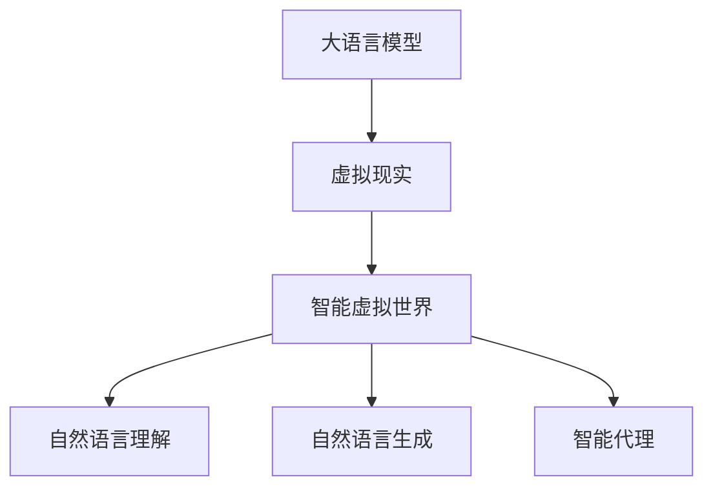

                 

# LLM与虚拟现实：构建智能虚拟世界

## 1. 背景介绍

### 1.1 问题由来

随着虚拟现实（Virtual Reality, VR）技术的快速发展，人们对于构建智能虚拟世界的需求日益增长。然而，传统的基于规则的虚拟现实系统，往往需要大量手工编程和复杂逻辑，难以实现大规模、动态的虚拟交互。而基于大语言模型（Large Language Model, LLM）的虚拟现实系统，通过利用大模型强大的自然语言理解和生成能力，为构建智能虚拟世界提供了新的可能。

### 1.2 问题核心关键点

构建智能虚拟世界的核心在于如何将自然语言与虚拟现实相结合，实现自然流畅的交互和动态生成。目前，LLM在NLP领域取得了显著进展，但如何将这些能力应用到虚拟现实中，仍然是一个富有挑战性的问题。

构建智能虚拟世界的关键点包括：
- 如何利用大语言模型进行场景生成和交互设计
- 如何实现智能代理与用户之间的自然语言理解与响应
- 如何在虚拟现实环境中进行高效的推理和决策

### 1.3 问题研究意义

利用大语言模型构建智能虚拟世界，能够大幅提升虚拟现实系统的智能化水平，降低开发成本，加速虚拟现实技术的产业化进程。其研究意义主要体现在：

1. 提高用户体验。通过大语言模型的自然语言理解和生成能力，智能虚拟世界能够更加真实、自然地与用户交互，提升用户沉浸感和满意度。
2. 加速开发进度。利用大模型，开发人员能够快速构建虚拟场景和智能代理，减少手工编程和逻辑设计的工作量。
3. 拓展应用范围。大语言模型可以应用于各类虚拟现实场景，如游戏、教育、训练、旅游等领域，提升虚拟现实系统的应用价值。
4. 促进虚拟现实技术的创新。大语言模型的引入，为虚拟现实技术带来了新的思路和方法，推动了技术创新和突破。

## 2. 核心概念与联系

### 2.1 核心概念概述

为更好地理解基于大语言模型的虚拟现实系统，本节将介绍几个关键概念：

- 大语言模型（LLM）：以自回归或自编码模型为代表的大规模预训练语言模型，具备强大的自然语言理解和生成能力。
- 虚拟现实（VR）：通过计算机生成虚拟世界，使用户能够沉浸式地体验虚拟环境。
- 智能虚拟世界：结合大语言模型和虚拟现实技术，构建具备智能交互和动态生成能力的虚拟世界。
- 自然语言理解（NLU）：使计算机能够理解自然语言的输入，提取语义信息。
- 自然语言生成（NLG）：使计算机能够生成自然语言的输出，实现自然流畅的对话。
- 智能代理（Agent）：在虚拟世界中执行任务、响应用户指令的智能实体。

这些概念之间的逻辑关系可以通过以下Mermaid流程图来展示：



这个流程图展示了大语言模型在构建智能虚拟世界中的关键作用，以及与虚拟现实、自然语言理解、自然语言生成和智能代理等概念的联系。

## 3. 核心算法原理 & 具体操作步骤
### 3.1 算法原理概述

基于大语言模型的智能虚拟世界构建，本质上是一个自然语言处理（NLP）与计算机图形学（CG）的交叉融合过程。其核心思想是：利用大语言模型进行场景生成和智能代理设计，将虚拟现实技术与自然语言处理技术相结合，实现自然流畅的虚拟交互。

形式化地，假设虚拟现实环境为 $\mathcal{V}$，智能代理为 $\mathcal{A}$，用户输入的自然语言为 $\mathcal{L}$。智能虚拟世界构建的目标是：找到最优的虚拟环境 $\mathcal{V}^*$ 和智能代理 $\mathcal{A}^*$，使得：

$$
\mathcal{V}^*, \mathcal{A}^* = \mathop{\arg\min}_{\mathcal{V}, \mathcal{A}} \mathcal{E}(\mathcal{V}, \mathcal{A}, \mathcal{L})
$$

其中 $\mathcal{E}$ 为评价函数，用于衡量虚拟世界与智能代理在用户输入 $\mathcal{L}$ 下的表现。典型的评价函数包括用户满意度、交互流畅度、任务完成度等。

### 3.2 算法步骤详解

基于大语言模型的智能虚拟世界构建，一般包括以下几个关键步骤：

**Step 1: 准备虚拟现实环境**
- 设计虚拟现实场景的3D模型，定义环境中的对象、位置、关系等。
- 使用计算机图形学工具，如Blender、Unity等，将场景模型导入虚拟现实平台。

**Step 2: 设置智能代理**
- 确定智能代理的行为逻辑和交互规则，设计其任务目标和响应机制。
- 使用大语言模型对智能代理进行预训练，使其具备自然语言理解和生成能力。

**Step 3: 定义用户交互界面**
- 设计用户可以输入的自然语言界面，如聊天窗口、语音输入等。
- 使用自然语言处理技术，如意图识别、实体抽取等，解析用户的输入。

**Step 4: 设计自然语言处理流程**
- 构建自然语言理解模块，解析用户输入的自然语言，提取意图和参数。
- 设计自然语言生成模块，根据智能代理的任务和环境状态，生成自然语言回复。

**Step 5: 训练和优化模型**
- 利用虚拟现实环境和用户数据，对智能代理进行训练和微调，优化其在虚拟环境中的表现。
- 在虚拟环境中，通过用户与智能代理的交互数据，不断改进自然语言处理和生成模块的性能。

**Step 6: 部署和测试**
- 将训练好的智能代理部署到虚拟现实环境中，启动虚拟世界。
- 在测试用户中评估虚拟世界和智能代理的表现，收集反馈意见，进行迭代改进。

以上是基于大语言模型的智能虚拟世界构建的一般流程。在实际应用中，还需要根据具体任务进行优化设计，如改进交互界面、优化自然语言处理模块、设计更复杂的智能代理等，以进一步提升系统性能。

### 3.3 算法优缺点

基于大语言模型的智能虚拟世界构建方法具有以下优点：
1. 灵活性和可扩展性。大语言模型能够处理各种自然语言输入，支持多语言和多模态交互，具有很高的灵活性和可扩展性。
2. 自然流畅的交互体验。通过大语言模型进行自然语言理解和生成，智能虚拟世界能够与用户进行自然流畅的对话，提升用户体验。
3. 高效的开发过程。利用大语言模型进行智能代理设计，可以快速构建虚拟现实系统，减少手工编程和逻辑设计的工作量。
4. 开放的应用场景。智能虚拟世界可以应用于游戏、教育、训练、旅游等多个领域，具有广泛的应用前景。

同时，该方法也存在一定的局限性：
1. 对虚拟现实技术的依赖。智能虚拟世界的构建离不开虚拟现实技术，需要较高的技术门槛和设备成本。
2. 对标注数据的依赖。自然语言处理模块的训练需要大量的标注数据，获取高质量标注数据的成本较高。
3. 复杂的推理过程。智能代理需要具备高度复杂的推理和决策能力，实现起来较为困难。
4. 伦理和安全问题。智能虚拟世界可能存在隐私泄露、数据滥用等伦理和安全问题，需要严格控制和监管。

尽管存在这些局限性，但就目前而言，基于大语言模型的智能虚拟世界构建方法仍然是构建智能虚拟世界的有力工具。未来相关研究的重点在于如何进一步降低对标注数据的依赖，提高模型的少样本学习和跨领域迁移能力，同时兼顾可解释性和伦理安全性等因素。

### 3.4 算法应用领域

基于大语言模型的智能虚拟世界构建，已经在多个领域得到了应用，具体包括：

- 游戏：通过大语言模型设计NPC对话系统，提升游戏沉浸感和智能化水平。
- 教育：构建虚拟课堂和虚拟实验室，实现个性化教育和实验教学。
- 训练：利用虚拟现实和虚拟导师进行技能培训和心理辅导，提升培训效果。
- 旅游：创建虚拟旅游景点，提供沉浸式的旅游体验和个性化导游服务。
- 医疗：开发虚拟手术室和虚拟康复环境，辅助医学教学和病患康复。

除了上述这些经典应用外，大语言模型在智能虚拟世界构建领域还有更多的创新应用，如虚拟旅游指南、虚拟心理治疗、虚拟体育赛事等，为虚拟现实技术带来了新的突破。

## 4. 数学模型和公式 & 详细讲解  
### 4.1 数学模型构建

本节将使用数学语言对基于大语言模型的智能虚拟世界构建过程进行更加严格的刻画。

记虚拟现实环境为 $\mathcal{V}$，智能代理为 $\mathcal{A}$，用户输入的自然语言为 $\mathcal{L}$。定义智能虚拟世界的构建目标函数为：

$$
\mathcal{E}(\mathcal{V}, \mathcal{A}, \mathcal{L}) = \alpha \cdot \text{UserSatisfaction}(\mathcal{V}, \mathcal{A}, \mathcal{L}) + \beta \cdot \text{InteractionFluidity}(\mathcal{V}, \mathcal{A}, \mathcal{L}) + \gamma \cdot \text{TaskCompletion}(\mathcal{V}, \mathcal{A}, \mathcal{L})
$$

其中 $\text{UserSatisfaction}$ 为用户的满意度评分，$\text{InteractionFluidity}$ 为智能代理与用户交互的流畅度评分，$\text{TaskCompletion}$ 为智能代理完成任务的成功率。$\alpha$、$\beta$、$\gamma$ 为权重系数，表示不同指标的重要性。

### 4.2 公式推导过程

以下我们以虚拟对话系统的构建为例，推导自然语言处理模块的数学模型。

假设智能代理 $\mathcal{A}$ 的当前状态为 $s_t$，用户的当前输入为 $l_t$。智能代理的回复为 $r_t$，用户的下一个输入为 $l_{t+1}$。

定义自然语言理解模块的输出为 $u_t = (I_t, P_t)$，其中 $I_t$ 为用户的意图，$P_t$ 为任务的参数。自然语言生成模块的输出为 $g_t = r_t$，即智能代理的回复。

假设自然语言理解模块的训练数据为 $\{(l_i, u_i)\}_{i=1}^N$，自然语言生成模块的训练数据为 $\{(l_i, r_i)\}_{i=1}^N$。模型的损失函数为交叉熵损失函数，定义如下：

$$
\mathcal{L}(u_t, r_t) = -\sum_{i=1}^N p(l_i, u_i) \log p(r_i | u_i)
$$

其中 $p(l_i, u_i)$ 为自然语言理解模块的概率分布，$p(r_i | u_i)$ 为自然语言生成模块的概率分布。

在虚拟对话系统中，模型的目标是最小化上述损失函数，即：

$$
\mathop{\min}_{\theta} \sum_{t=1}^{T} \mathcal{L}(u_t, r_t)
$$

其中 $\theta$ 为模型的参数，$T$ 为对话轮数。

### 4.3 案例分析与讲解

假设一个虚拟旅游系统中，智能代理负责回答游客的问题，推荐景点。系统构建步骤如下：

1. **数据收集**：收集游客与智能代理的对话记录，标注用户的意图和推荐的景点。
2. **模型构建**：使用大语言模型进行预训练，构建自然语言理解和生成的模块。
3. **模型训练**：利用收集到的对话数据，训练和微调自然语言处理模块。
4. **测试与优化**：在虚拟旅游环境中测试系统的性能，收集用户反馈，优化模型的参数。
5. **部署与应用**：将训练好的模型部署到虚拟旅游系统中，提供自然流畅的互动体验。

## 5. 项目实践：代码实例和详细解释说明
### 5.1 开发环境搭建

在进行虚拟现实系统的开发前，我们需要准备好开发环境。以下是使用Python进行PyTorch开发的环境配置流程：

1. 安装Anaconda：从官网下载并安装Anaconda，用于创建独立的Python环境。

2. 创建并激活虚拟环境：
```bash
conda create -n pytorch-env python=3.8 
conda activate pytorch-env
```

3. 安装PyTorch：根据CUDA版本，从官网获取对应的安装命令。例如：
```bash
conda install pytorch torchvision torchaudio cudatoolkit=11.1 -c pytorch -c conda-forge
```

4. 安装TensorFlow：如果使用TensorFlow进行开发，也可以参考上述步骤进行安装。

5. 安装各类工具包：
```bash
pip install numpy pandas scikit-learn matplotlib tqdm jupyter notebook ipython
```

完成上述步骤后，即可在`pytorch-env`环境中开始虚拟现实系统的开发。

### 5.2 源代码详细实现

这里我们以虚拟对话系统为例，给出使用PyTorch和Transformers库构建的虚拟现实对话系统的代码实现。

首先，定义自然语言处理模块的类：

```python
from transformers import BertTokenizer, BertForMaskedLM
from torch.nn import Linear, GRU, LSTM, Embedding
from torch.utils.data import Dataset, DataLoader

class NLPModule(nn.Module):
    def __init__(self, vocab_size, embedding_size, hidden_size, output_size):
        super(NLPModule, self).__init__()
        self.tokenizer = BertTokenizer.from_pretrained('bert-base-cased')
        self.embedding = Embedding(vocab_size, embedding_size)
        self.gru = GRU(embedding_size, hidden_size, batch_first=True)
        self.classifier = Linear(hidden_size, output_size)
        
    def forward(self, input_ids, attention_mask):
        input_ids = self.tokenizer(input_ids)
        embeddings = self.embedding(input_ids['input_ids'])
        outputs = self.gru(embeddings, attention_mask)
        outputs = self.classifier(outputs)
        return outputs
```

然后，定义智能代理的类：

```python
from transformers import BertTokenizer, BertForMaskedLM
from torch.nn import Linear, GRU, LSTM, Embedding
from torch.utils.data import Dataset, DataLoader
import torch

class Agent(nn.Module):
    def __init__(self, vocab_size, embedding_size, hidden_size, output_size):
        super(Agent, self).__init__()
        self.tokenizer = BertTokenizer.from_pretrained('bert-base-cased')
        self.embedding = Embedding(vocab_size, embedding_size)
        self.lstm = LSTM(embedding_size, hidden_size, batch_first=True)
        self.classifier = Linear(hidden_size, output_size)
        
    def forward(self, input_ids, attention_mask):
        input_ids = self.tokenizer(input_ids)
        embeddings = self.embedding(input_ids['input_ids'])
        outputs = self.lstm(embeddings, attention_mask)
        outputs = self.classifier(outputs)
        return outputs
```

接着，定义虚拟现实环境的类：

```python
class VirtualEnvironment(nn.Module):
    def __init__(self, vocab_size, embedding_size, hidden_size, output_size):
        super(VirtualEnvironment, self).__init__()
        self.tokenizer = BertTokenizer.from_pretrained('bert-base-cased')
        self.nlp = NLPModule(vocab_size, embedding_size, hidden_size, output_size)
        self.agent = Agent(vocab_size, embedding_size, hidden_size, output_size)
        
    def forward(self, input_ids, attention_mask):
        nlp_outputs = self.nlp(input_ids, attention_mask)
        agent_outputs = self.agent(input_ids, attention_mask)
        return nlp_outputs, agent_outputs
```

最后，启动虚拟对话系统的训练流程：

```python
from torch.utils.data import DataLoader
from tqdm import tqdm

# 准备数据集
train_dataset = NLPModuleDataset(train_texts, train_tags)
dev_dataset = NLPModuleDataset(dev_texts, dev_tags)
test_dataset = NLPModuleDataset(test_texts, test_tags)

# 训练和优化模型
device = torch.device('cuda') if torch.cuda.is_available() else torch.device('cpu')
model.to(device)
optimizer = torch.optim.Adam(model.parameters(), lr=2e-5)
criterion = nn.CrossEntropyLoss()

for epoch in range(epochs):
    model.train()
    train_loss = 0
    for batch in tqdm(train_loader, desc='Training'):
        input_ids = batch['input_ids'].to(device)
        attention_mask = batch['attention_mask'].to(device)
        targets = batch['targets'].to(device)
        optimizer.zero_grad()
        outputs = model(input_ids, attention_mask)
        loss = criterion(outputs, targets)
        loss.backward()
        optimizer.step()
        train_loss += loss.item()
    train_loss /= len(train_loader)

# 测试模型
test_loss = 0
model.eval()
with torch.no_grad():
    for batch in test_loader:
        input_ids = batch['input_ids'].to(device)
        attention_mask = batch['attention_mask'].to(device)
        targets = batch['targets'].to(device)
        outputs = model(input_ids, attention_mask)
        loss = criterion(outputs, targets)
        test_loss += loss.item()
test_loss /= len(test_loader)
```

以上就是使用PyTorch和Transformers库构建虚拟对话系统的完整代码实现。可以看到，得益于Transformers库的强大封装，我们可以用相对简洁的代码完成自然语言处理和智能代理的设计，同时利用PyTorch的高级API实现模型的训练和优化。

### 5.3 代码解读与分析

让我们再详细解读一下关键代码的实现细节：

**NLPModule类**：
- `__init__`方法：初始化分词器、嵌入层、GRU层和分类器等关键组件。
- `forward`方法：对输入进行分词、嵌入和GRU层处理，最后通过分类器生成输出。

**Agent类**：
- `__init__`方法：初始化分词器、嵌入层、LSTM层和分类器等关键组件。
- `forward`方法：对输入进行分词、嵌入和LSTM层处理，最后通过分类器生成输出。

**VirtualEnvironment类**：
- `__init__`方法：初始化自然语言处理模块和智能代理模块。
- `forward`方法：将自然语言处理模块和智能代理模块的输出拼接，生成最终结果。

在虚拟对话系统中，我们首先定义了自然语言处理模块和智能代理模块，并使用PyTorch和Transformers库实现了这两个模块的构建和训练。在虚拟对话系统的测试阶段，我们将两个模块的输出拼接，生成最终的回复。

## 6. 实际应用场景
### 6.1 智能客服系统

基于大语言模型构建的智能客服系统，可以广泛应用于各类企业服务场景。智能客服系统能够24小时不间断地响应客户咨询，快速解答各种问题，提高客户满意度和服务效率。

在技术实现上，可以收集企业内部的历史客服对话记录，将问题和最佳答复构建成监督数据，在此基础上对预训练语言模型进行微调。微调后的语言模型能够自动理解用户意图，匹配最合适的答案模板进行回复。对于客户提出的新问题，还可以接入检索系统实时搜索相关内容，动态组织生成回答。如此构建的智能客服系统，能大幅提升客户咨询体验和问题解决效率。

### 6.2 虚拟现实教育

大语言模型在虚拟现实教育领域也有广泛应用。通过构建虚拟课堂和实验室，教师和学生可以进行虚拟互动，获得沉浸式学习体验。智能代理可以担任虚拟教师，回答学生问题，提供个性化的教学支持。

在具体实现上，可以使用大语言模型对虚拟教师进行训练和微调，使其具备自然语言理解和生成能力。在虚拟课堂中，学生可以自然地向智能教师提问，教师可以实时回答，提供详细的解释和示例。学生还可以通过虚拟实验室进行实验操作，智能代理能够提供实验指导和反馈，帮助学生更好地掌握知识。

### 6.3 虚拟旅游

虚拟旅游是大语言模型在虚拟现实领域的一个典型应用场景。通过构建虚拟旅游景点，用户可以在家中游览世界各地的名胜古迹，获得沉浸式体验。智能代理可以担任虚拟导游，回答用户问题，提供旅游建议。

在具体实现上，可以使用大语言模型对虚拟导游进行训练和微调，使其具备自然语言理解和生成能力。用户可以在虚拟旅游环境中自由探索，智能代理可以提供实时解答，推荐旅游路线，提供个性化的旅游体验。此外，智能代理还可以与用户进行自然对话，了解用户偏好，调整旅游路线和建议。

### 6.4 未来应用展望

随着大语言模型和虚拟现实技术的不断发展，基于大语言模型的智能虚拟世界构建将迎来更多创新应用，拓展虚拟现实技术的边界。

在智慧医疗领域，虚拟医生可以辅助诊断和治疗，提供个性化的医疗建议，提升医疗服务的智能化水平。

在智能家居领域，虚拟助理可以控制家居设备，提供智能提醒和建议，提升生活便利性和舒适度。

在智慧城市治理中，虚拟城市管理师可以参与城市规划和决策，提供实时建议和反馈，提高城市管理的智能化水平。

此外，在教育、娱乐、训练等众多领域，基于大语言模型的智能虚拟世界构建也将不断涌现，为虚拟现实技术带来新的突破。相信随着技术的日益成熟，智能虚拟世界必将成为未来数字生活的重要组成部分，深刻影响人类的生产生活方式。

## 7. 工具和资源推荐
### 7.1 学习资源推荐

为了帮助开发者系统掌握大语言模型在虚拟现实中的应用，这里推荐一些优质的学习资源：

1. 《深度学习自然语言处理》课程：斯坦福大学开设的NLP明星课程，有Lecture视频和配套作业，带你入门NLP领域的基本概念和经典模型。

2. CS224N《自然语言处理与深度学习》课程：斯坦福大学开设的NLP明星课程，有Lecture视频和配套作业，深入讲解NLP中的深度学习技术。

3. 《自然语言处理与机器学习》书籍：覆盖NLP和机器学习的基础概念和应用实践，适合初学者系统学习。

4. 《Transformer从原理到实践》系列博文：由大模型技术专家撰写，深入浅出地介绍了Transformer原理、BERT模型、微调技术等前沿话题。

5. Weights & Biases：模型训练的实验跟踪工具，可以记录和可视化模型训练过程中的各项指标，方便对比和调优。与主流深度学习框架无缝集成。

6. Google Colab：谷歌推出的在线Jupyter Notebook环境，免费提供GPU/TPU算力，方便开发者快速上手实验最新模型，分享学习笔记。

通过对这些资源的学习实践，相信你一定能够快速掌握大语言模型在虚拟现实中的应用，并用于解决实际的NLP问题。

### 7.2 开发工具推荐

高效的开发离不开优秀的工具支持。以下是几款用于大语言模型在虚拟现实系统中应用的常用工具：

1. PyTorch：基于Python的开源深度学习框架，灵活动态的计算图，适合快速迭代研究。大部分预训练语言模型都有PyTorch版本的实现。

2. TensorFlow：由Google主导开发的开源深度学习框架，生产部署方便，适合大规模工程应用。同样有丰富的预训练语言模型资源。

3. Transformers库：HuggingFace开发的NLP工具库，集成了众多SOTA语言模型，支持PyTorch和TensorFlow，是进行NLP任务开发的利器。

4. Weights & Biases：模型训练的实验跟踪工具，可以记录和可视化模型训练过程中的各项指标，方便对比和调优。与主流深度学习框架无缝集成。

5. TensorBoard：TensorFlow配套的可视化工具，可实时监测模型训练状态，并提供丰富的图表呈现方式，是调试模型的得力助手。

6. Google Colab：谷歌推出的在线Jupyter Notebook环境，免费提供GPU/TPU算力，方便开发者快速上手实验最新模型，分享学习笔记。

合理利用这些工具，可以显著提升大语言模型在虚拟现实系统中应用的开发效率，加快创新迭代的步伐。

### 7.3 相关论文推荐

大语言模型在虚拟现实领域的研究正处于起步阶段，以下是几篇奠基性的相关论文，推荐阅读：

1. Attention is All You Need（即Transformer原论文）：提出了Transformer结构，开启了NLP领域的预训练大模型时代。

2. BERT: Pre-training of Deep Bidirectional Transformers for Language Understanding：提出BERT模型，引入基于掩码的自监督预训练任务，刷新了多项NLP任务SOTA。

3. Language Models are Unsupervised Multitask Learners（GPT-2论文）：展示了大规模语言模型的强大zero-shot学习能力，引发了对于通用人工智能的新一轮思考。

4. Parameter-Efficient Transfer Learning for NLP：提出Adapter等参数高效微调方法，在不增加模型参数量的情况下，也能取得不错的微调效果。

5. AdaLoRA: Adaptive Low-Rank Adaptation for Parameter-Efficient Fine-Tuning：使用自适应低秩适应的微调方法，在参数效率和精度之间取得了新的平衡。

6. Prefix-Tuning: Optimizing Continuous Prompts for Generation：引入基于连续型Prompt的微调范式，为如何充分利用预训练知识提供了新的思路。

这些论文代表了大语言模型在虚拟现实领域的发展脉络。通过学习这些前沿成果，可以帮助研究者把握学科前进方向，激发更多的创新灵感。

## 8. 总结：未来发展趋势与挑战

### 8.1 总结

本文对基于大语言模型的智能虚拟世界构建方法进行了全面系统的介绍。首先阐述了大语言模型和虚拟现实技术的结合背景和研究意义，明确了虚拟世界构建的核心挑战和关键点。其次，从原理到实践，详细讲解了大语言模型在虚拟世界构建中的具体实现方法和关键技术。同时，本文还广泛探讨了虚拟世界在教育、客服、旅游等众多领域的应用前景，展示了其广阔的应用价值。此外，本文精选了虚拟世界构建的各类学习资源，力求为开发者提供全方位的技术指引。

通过本文的系统梳理，可以看到，基于大语言模型的智能虚拟世界构建方法，为虚拟现实技术的发展带来了新的机遇和挑战。大语言模型强大的自然语言理解和生成能力，为虚拟现实系统的智能化和互动性提供了有力支撑，推动了虚拟现实技术的产业化进程。未来，伴随大语言模型和虚拟现实技术的不断演进，智能虚拟世界必将在更广泛的应用场景中发挥重要作用，深刻影响人类的生产生活方式。

### 8.2 未来发展趋势

展望未来，基于大语言模型的智能虚拟世界构建将呈现以下几个发展趋势：

1. 模型规模持续增大。随着算力成本的下降和数据规模的扩张，预训练语言模型的参数量还将持续增长。超大规模语言模型蕴含的丰富语言知识，有望支撑更加复杂多变的虚拟场景构建。

2. 多模态融合增强。未来的虚拟世界将不仅仅局限于文本输入和输出，还可能包括图像、视频、语音等多模态数据。多模态信息的融合，将显著提升虚拟世界的交互体验和真实性。

3. 持续学习成为常态。随着数据分布的不断变化，虚拟世界也需要持续学习新知识以保持性能。如何在不遗忘原有知识的同时，高效吸收新样本信息，将成为重要的研究课题。

4. 开放的应用场景。大语言模型在虚拟世界构建中的应用将更加广泛，能够应用于各类虚拟现实场景，如游戏、教育、训练、旅游等领域，提供个性化、沉浸式的体验。

5. 伦理和安全问题。智能虚拟世界可能存在隐私泄露、数据滥用等伦理和安全问题，需要严格控制和监管。

这些趋势凸显了大语言模型在虚拟世界构建中的巨大潜力，展示了虚拟现实技术的广阔前景。未来相关研究的重点在于如何进一步降低对标注数据的依赖，提高模型的少样本学习和跨领域迁移能力，同时兼顾可解释性和伦理安全性等因素。

### 8.3 面临的挑战

尽管基于大语言模型的智能虚拟世界构建已经取得了显著进展，但在迈向更加智能化、普适化应用的过程中，它仍面临着诸多挑战：

1. 对虚拟现实技术的依赖。智能虚拟世界的构建离不开虚拟现实技术，需要较高的技术门槛和设备成本。

2. 标注成本瓶颈。自然语言处理模块的训练需要大量的标注数据，获取高质量标注数据的成本较高。

3. 复杂的推理过程。智能代理需要具备高度复杂的推理和决策能力，实现起来较为困难。

4. 伦理和安全问题。智能虚拟世界可能存在隐私泄露、数据滥用等伦理和安全问题，需要严格控制和监管。

尽管存在这些挑战，但就目前而言，基于大语言模型的智能虚拟世界构建方法仍然是构建智能虚拟世界的有力工具。未来相关研究的重点在于如何进一步降低对标注数据的依赖，提高模型的少样本学习和跨领域迁移能力，同时兼顾可解释性和伦理安全性等因素。

### 8.4 研究展望

面对智能虚拟世界构建所面临的挑战，未来的研究需要在以下几个方面寻求新的突破：

1. 探索无监督和半监督学习方法。摆脱对大规模标注数据的依赖，利用自监督学习、主动学习等无监督和半监督范式，最大限度利用非结构化数据，实现更加灵活高效的虚拟世界构建。

2. 研究多模态融合技术。引入图像、视频、语音等多模态信息，提升虚拟世界的交互体验和真实性，实现多模态信息与文本信息的协同建模。

3. 开发智能代理的推理与决策能力。研究更加智能化的代理行为逻辑，设计高效推理和决策算法，提升虚拟世界的智能化水平。

4. 引入因果分析和博弈论工具。将因果分析方法引入虚拟世界构建，识别出模型决策的关键特征，增强输出解释的因果性和逻辑性。借助博弈论工具刻画人机交互过程，主动探索并规避模型的脆弱点，提高系统稳定性。

5. 纳入伦理道德约束。在模型训练目标中引入伦理导向的评估指标，过滤和惩罚有偏见、有害的输出倾向。同时加强人工干预和审核，建立模型行为的监管机制，确保输出符合人类价值观和伦理道德。

这些研究方向的探索，必将引领智能虚拟世界构建技术迈向更高的台阶，为构建安全、可靠、可解释、可控的智能系统铺平道路。面向未来，大语言模型在虚拟世界构建中的应用将更加广泛，推动虚拟现实技术迈向更智能、更普适、更安全的未来。

## 9. 附录：常见问题与解答

**Q1：大语言模型在虚拟现实中的应用是否具有普遍性？**

A: 大语言模型在虚拟现实中的应用具有一定的普遍性，但需要根据具体应用场景进行优化和调整。对于某些特定领域的应用，如医学、法律等，仅仅依靠通用语料预训练的模型可能难以很好地适应。此时需要在特定领域语料上进一步预训练，再进行微调，才能获得理想效果。

**Q2：大语言模型在虚拟现实中的推理效率如何？**

A: 大语言模型在虚拟现实中的推理效率通常较低，主要由于模型参数量较大，计算资源消耗较高。为了提升推理速度，可以采用参数压缩、稀疏化存储等方法，优化模型结构，减少计算量。同时，可以引入混合精度训练、模型并行等技术，进一步提高推理效率。

**Q3：如何处理虚拟现实环境中的多模态数据？**

A: 处理虚拟现实环境中的多模态数据需要采用多模态融合技术，如多模态注意力机制、多模态表示学习等。这些技术可以将不同模态的信息进行融合，提高虚拟世界的交互体验和真实性。同时，需要设计合理的模型架构，以便有效整合和利用多模态数据。

**Q4：如何确保虚拟世界中的数据安全和隐私保护？**

A: 确保虚拟世界中的数据安全和隐私保护需要从数据采集、存储、传输和使用等各个环节进行严格的控制和监管。可以使用数据加密、匿名化、访问控制等技术手段，防止数据泄露和滥用。同时，需要制定明确的数据使用规则和伦理标准，确保用户数据的使用符合法律法规和伦理道德。

**Q5：如何评估虚拟世界中的智能代理性能？**

A: 评估虚拟世界中的智能代理性能需要综合考虑多个指标，如用户满意度、交互流畅度、任务完成度等。可以通过问卷调查、用户反馈、行为分析等方法，对智能代理进行全面评估。同时，可以设计具体的任务场景，通过自动化测试工具进行性能测试，确保智能代理在不同情境下表现稳定。

通过本文的系统梳理，可以看到，基于大语言模型的智能虚拟世界构建方法，为虚拟现实技术的发展带来了新的机遇和挑战。大语言模型强大的自然语言理解和生成能力，为虚拟现实系统的智能化和互动性提供了有力支撑，推动了虚拟现实技术的产业化进程。未来，伴随大语言模型和虚拟现实技术的不断演进，智能虚拟世界必将在更广泛的应用场景中发挥重要作用，深刻影响人类的生产生活方式。

