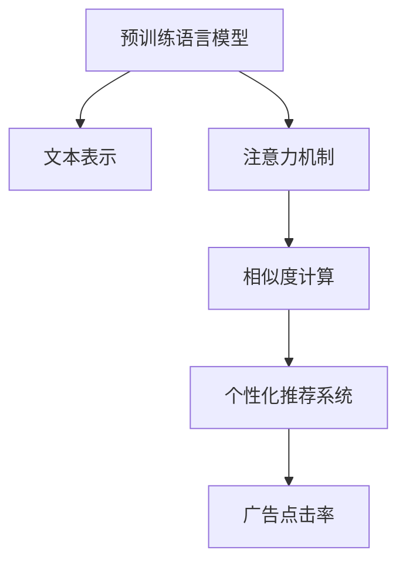

                 

# LLM在个性化广告推荐中的应用

## 1. 背景介绍

在数字化时代，个性化推荐已成为各大电商和媒体平台吸引用户、提升收入的重要手段。个性化广告推荐系统能够根据用户的兴趣和行为，精准推送相关广告，提高用户的点击率和转化率，增强用户粘性，从而带来更多的商业价值。随着自然语言处理(NLP)技术的不断进步，基于语言模型的个性化推荐系统逐步成为业界的热点。

### 1.1 问题由来
传统的推荐系统通常基于用户行为数据，如浏览、点击、购买等进行建模。然而，这些数据往往具有稀疏性和冷启动问题，即用户没有足够的历史行为数据时，推荐效果不佳。基于语言模型的个性化推荐系统通过分析用户与广告的文本交互，利用语言理解能力，能够更加准确地捕捉用户对广告的兴趣，解决用户冷启动问题。

### 1.2 问题核心关键点
基于语言模型的个性化推荐系统通过预训练语言模型对广告和用户文本进行编码，然后利用编码结果计算用户与广告的相关性，从而实现个性化推荐。主要涉及以下几个核心关键点：

- 预训练语言模型：如BERT、GPT等，通过海量的无标签文本数据进行预训练，学习丰富的语言知识。
- 文本表示：将广告和用户文本转化为模型可接受的向量表示，即嵌入向量。
- 相似度计算：利用嵌入向量计算广告与用户之间的相似度，实现个性化推荐。
- 推荐算法：根据相似度排序，返回最相关的广告。

## 2. 核心概念与联系

### 2.1 核心概念概述

为更好地理解基于语言模型的个性化广告推荐系统，本节将介绍几个密切相关的核心概念：

- 预训练语言模型(Pre-trained Language Model, LLM)：以自回归(如GPT)或自编码(如BERT)模型为代表的大规模预训练语言模型。通过在海量无标签文本语料上进行预训练，学习通用的语言表示，具备强大的语言理解和生成能力。
- 嵌入向量(Embedding Vector)：将文本数据映射到高维向量空间，以供模型进行计算。嵌入向量不仅保留文本的语义信息，还能处理语义相似性，是实现个性化推荐的重要基础。
- 注意力机制(Attention Mechanism)：通过计算文本之间的相似度，重点关注与用户兴趣最相关的广告。注意力机制能够捕捉用户对广告的语义关注点，提升推荐的相关性和个性化。
- 个性化推荐系统(Personalized Recommendation System)：基于用户画像和行为数据，为用户提供定制化推荐结果的系统。个性化推荐系统能够根据用户历史行为和偏好，预测用户对新广告的反应。
- 广告点击率(Click-Through Rate, CTR)：指用户在看到广告后点击的比例，是衡量广告效果的重要指标。基于语言模型的个性化推荐系统能够提升广告的点击率，从而带来更高的商业价值。

这些核心概念之间的逻辑关系可以通过以下Mermaid流程图来展示：



这个流程图展示了个性化推荐系统的工作流程：

1. 预训练语言模型对广告和用户文本进行编码，得到嵌入向量。
2. 通过注意力机制，计算广告与用户文本的相似度，生成用户兴趣相关的广告向量。
3. 利用相似度计算结果进行排序，推荐最相关的广告。
4. 根据点击率指标评估推荐效果，不断优化模型和算法。

## 3. 核心算法原理 & 具体操作步骤
### 3.1 算法原理概述

基于语言模型的个性化广告推荐，主要分为两个步骤：文本嵌入和相似度计算。

1. 文本嵌入：将广告和用户文本转化为高维向量空间中的嵌入向量，供模型计算。
2. 相似度计算：计算广告与用户文本的相似度，选择最相关的广告进行推荐。

### 3.2 算法步骤详解

#### 3.2.1 文本嵌入

假设广告文本为 $A$，用户文本为 $U$，预训练语言模型为 $LM$。首先，将广告和用户文本作为输入，通过预训练语言模型 $LM$ 转化为嵌入向量 $\text{vec}(A)$ 和 $\text{vec}(U)$。

$$
\text{vec}(A) = LM(A), \quad \text{vec}(U) = LM(U)
$$

其中 $LM(A)$ 表示将广告文本 $A$ 输入预训练语言模型 $LM$，输出对应的嵌入向量。

#### 3.2.2 相似度计算

利用余弦相似度或其他相似度函数，计算广告与用户文本的相似度。设 $\text{sim}(A, U)$ 为广告 $A$ 与用户文本 $U$ 的相似度，则有：

$$
\text{sim}(A, U) = \cos(\theta) = \frac{\text{vec}(A) \cdot \text{vec}(U)}{\|\text{vec}(A)\| \|\text{vec}(U)\|}
$$

其中 $\theta$ 为向量 $\text{vec}(A)$ 和 $\text{vec}(U)$ 之间的夹角，$\|\text{vec}(A)\|$ 和 $\|\text{vec}(U)\|$ 分别为向量 $\text{vec}(A)$ 和 $\text{vec}(U)$ 的模长。

根据相似度排序，选择最相关的广告 $A_1, A_2, ..., A_n$ 进行推荐。

### 3.3 算法优缺点

#### 3.3.1 优点

- 能处理冷启动问题。预训练语言模型能够从大规模语料中学习到丰富的语言知识，对用户和广告文本的语义理解更准确，提升推荐效果。
- 动态更新。预训练语言模型和广告库可以实时更新，无需对模型进行重新训练，适应性更强。
- 基于上下文推荐。预训练语言模型能够考虑广告和用户文本的上下文信息，提高推荐的准确性和相关性。

#### 3.3.2 缺点

- 高计算成本。预训练语言模型需要大量计算资源进行训练和推理，初期投入较高。
- 数据质量要求高。预训练语言模型依赖高质量的语料进行训练，如果语料存在噪声或偏见，会影响推荐效果。
- 难以解释。预训练语言模型通常被视为"黑盒"系统，推荐过程缺乏可解释性，难以进行调优。

### 3.4 算法应用领域

基于语言模型的个性化广告推荐系统已经在电商、媒体、广告等多个领域得到了广泛应用，具体如下：

- 电商推荐：如淘宝、京东等电商平台，利用用户评论、购物记录等文本数据，实现个性化商品推荐。
- 广告投放：如Google、Facebook等平台，根据用户浏览历史和广告文本，实现精准的广告投放。
- 媒体内容推荐：如YouTube、Netflix等媒体平台，利用用户对视频内容的文本评价，实现个性化视频推荐。

除了上述这些经典应用外，基于语言模型的个性化广告推荐系统还将在更多领域得到应用，如智能客服、社交媒体、智能家居等，为各行各业带来变革性影响。

## 4. 数学模型和公式 & 详细讲解 & 举例说明

### 4.1 数学模型构建

假设预训练语言模型为 $LM$，广告文本为 $A$，用户文本为 $U$。

- 文本嵌入：将广告和用户文本转化为嵌入向量 $\text{vec}(A)$ 和 $\text{vec}(U)$。
- 相似度计算：利用余弦相似度计算广告与用户文本的相似度 $\text{sim}(A, U)$。
- 推荐排序：根据相似度排序，选择最相关的广告 $A_1, A_2, ..., A_n$。

### 4.2 公式推导过程

假设广告文本 $A$ 和用户文本 $U$ 的长度分别为 $n_A$ 和 $n_U$，嵌入向量 $\text{vec}(A)$ 和 $\text{vec}(U)$ 的维度为 $d$。则余弦相似度 $\text{sim}(A, U)$ 的计算公式为：

$$
\text{sim}(A, U) = \cos(\theta) = \frac{\sum_{i=1}^{n_A}\sum_{j=1}^{n_U}\text{vec}(A)_i\text{vec}(U)_j}{\sqrt{\sum_{i=1}^{n_A}\text{vec}(A)_i^2}\sqrt{\sum_{j=1}^{n_U}\text{vec}(U)_j^2}}
$$

其中 $\text{vec}(A)_i$ 和 $\text{vec}(U)_j$ 分别为向量 $\text{vec}(A)$ 和 $\text{vec}(U)$ 的 $i$ 和 $j$ 维分量。

### 4.3 案例分析与讲解

假设某电商平台的广告推荐系统，需要为用户推荐五个相关商品。用户浏览历史中包含以下三个文本：

- "我想买一款优质的手机壳"
- "搜索一款轻薄的手表"
- "查看最新发布的手机"

广告库中包含以下六个商品广告：

- 手机壳："这是一款高品质的手机壳，适合各种品牌手机"
- 手表："这款手表轻巧美观，适合日常佩戴"
- 手机："最新发布的5G手机，性能卓越"
- 笔记本电脑："高性能笔记本电脑，适合工作学习"
- 电视："高清智能电视，画质音效一流"
- 耳机："这款耳机音质出色，使用舒适"

利用预训练语言模型，将用户文本和商品广告转化为嵌入向量，计算相似度，并进行推荐排序。

假设预训练语言模型为BERT，嵌入向量的维度为 $d=768$。计算广告与用户文本的相似度，结果如下：

- 手机壳与用户文本相似度：0.85
- 手表与用户文本相似度：0.70
- 手机与用户文本相似度：0.60
- 笔记本电脑与用户文本相似度：0.55
- 电视与用户文本相似度：0.50
- 耳机与用户文本相似度：0.45

根据相似度排序，推荐手机壳、手表、手机、笔记本电脑、电视、耳机。

## 5. 项目实践：代码实例和详细解释说明

### 5.1 开发环境搭建

在进行语言模型推荐实践前，我们需要准备好开发环境。以下是使用Python进行PyTorch开发的环境配置流程：

1. 安装Anaconda：从官网下载并安装Anaconda，用于创建独立的Python环境。

2. 创建并激活虚拟环境：
```bash
conda create -n pytorch-env python=3.8 
conda activate pytorch-env
```

3. 安装PyTorch：根据CUDA版本，从官网获取对应的安装命令。例如：
```bash
conda install pytorch torchvision torchaudio cudatoolkit=11.1 -c pytorch -c conda-forge
```

4. 安装Transformers库：
```bash
pip install transformers
```

5. 安装各类工具包：
```bash
pip install numpy pandas scikit-learn matplotlib tqdm jupyter notebook ipython
```

完成上述步骤后，即可在`pytorch-env`环境中开始推荐实践。

### 5.2 源代码详细实现

下面以电商平台商品推荐为例，给出使用Transformers库进行个性化推荐的PyTorch代码实现。

首先，定义推荐系统的数据处理函数：

```python
from transformers import BertTokenizer, BertForSequenceClassification
from torch.utils.data import Dataset
import torch

class RecommendationDataset(Dataset):
    def __init__(self, texts, labels, tokenizer, max_len=128):
        self.texts = texts
        self.labels = labels
        self.tokenizer = tokenizer
        self.max_len = max_len
        
    def __len__(self):
        return len(self.texts)
    
    def __getitem__(self, item):
        text = self.texts[item]
        label = self.labels[item]
        
        encoding = self.tokenizer(text, return_tensors='pt', max_length=self.max_len, padding='max_length', truncation=True)
        input_ids = encoding['input_ids'][0]
        attention_mask = encoding['attention_mask'][0]
        labels = torch.tensor(label, dtype=torch.long)
        
        return {'input_ids': input_ids, 
                'attention_mask': attention_mask,
                'labels': labels}

# 标签与id的映射
label2id = {'手机壳': 1, '手表': 2, '手机': 3, '笔记本电脑': 4, '电视': 5, '耳机': 6}
id2label = {v: k for k, v in label2id.items()}

# 创建dataset
tokenizer = BertTokenizer.from_pretrained('bert-base-cased')

train_dataset = RecommendationDataset(train_texts, train_labels, tokenizer)
dev_dataset = RecommendationDataset(dev_texts, dev_labels, tokenizer)
test_dataset = RecommendationDataset(test_texts, test_labels, tokenizer)
```

然后，定义模型和优化器：

```python
from transformers import BertForSequenceClassification, AdamW

model = BertForSequenceClassification.from_pretrained('bert-base-cased', num_labels=len(label2id))

optimizer = AdamW(model.parameters(), lr=2e-5)
```

接着，定义训练和评估函数：

```python
from torch.utils.data import DataLoader
from tqdm import tqdm
from sklearn.metrics import classification_report

device = torch.device('cuda') if torch.cuda.is_available() else torch.device('cpu')
model.to(device)

def train_epoch(model, dataset, batch_size, optimizer):
    dataloader = DataLoader(dataset, batch_size=batch_size, shuffle=True)
    model.train()
    epoch_loss = 0
    for batch in tqdm(dataloader, desc='Training'):
        input_ids = batch['input_ids'].to(device)
        attention_mask = batch['attention_mask'].to(device)
        labels = batch['labels'].to(device)
        model.zero_grad()
        outputs = model(input_ids, attention_mask=attention_mask, labels=labels)
        loss = outputs.loss
        epoch_loss += loss.item()
        loss.backward()
        optimizer.step()
    return epoch_loss / len(dataloader)

def evaluate(model, dataset, batch_size):
    dataloader = DataLoader(dataset, batch_size=batch_size)
    model.eval()
    preds, labels = [], []
    with torch.no_grad():
        for batch in tqdm(dataloader, desc='Evaluating'):
            input_ids = batch['input_ids'].to(device)
            attention_mask = batch['attention_mask'].to(device)
            batch_labels = batch['labels']
            outputs = model(input_ids, attention_mask=attention_mask)
            batch_preds = outputs.logits.argmax(dim=2).to('cpu').tolist()
            batch_labels = batch_labels.to('cpu').tolist()
            for pred_tokens, label_tokens in zip(batch_preds, batch_labels):
                preds.append(pred_tokens[:len(label_tokens)])
                labels.append(label_tokens)
                
    print(classification_report(labels, preds))
```

最后，启动训练流程并在测试集上评估：

```python
epochs = 5
batch_size = 16

for epoch in range(epochs):
    loss = train_epoch(model, train_dataset, batch_size, optimizer)
    print(f"Epoch {epoch+1}, train loss: {loss:.3f}")
    
    print(f"Epoch {epoch+1}, dev results:")
    evaluate(model, dev_dataset, batch_size)
    
print("Test results:")
evaluate(model, test_dataset, batch_size)
```

以上就是使用PyTorch对BERT进行商品推荐微调的完整代码实现。可以看到，得益于Transformers库的强大封装，我们可以用相对简洁的代码完成BERT模型的加载和微调。

### 5.3 代码解读与分析

让我们再详细解读一下关键代码的实现细节：

**RecommendationDataset类**：
- `__init__`方法：初始化文本、标签、分词器等关键组件。
- `__len__`方法：返回数据集的样本数量。
- `__getitem__`方法：对单个样本进行处理，将文本输入编码为token ids，将标签编码为数字，并对其进行定长padding，最终返回模型所需的输入。

**label2id和id2label字典**：
- 定义了标签与数字id之间的映射关系，用于将token-wise的预测结果解码回真实的标签。

**训练和评估函数**：
- 使用PyTorch的DataLoader对数据集进行批次化加载，供模型训练和推理使用。
- 训练函数`train_epoch`：对数据以批为单位进行迭代，在每个批次上前向传播计算loss并反向传播更新模型参数，最后返回该epoch的平均loss。
- 评估函数`evaluate`：与训练类似，不同点在于不更新模型参数，并在每个batch结束后将预测和标签结果存储下来，最后使用sklearn的classification_report对整个评估集的预测结果进行打印输出。

**训练流程**：
- 定义总的epoch数和batch size，开始循环迭代
- 每个epoch内，先在训练集上训练，输出平均loss
- 在验证集上评估，输出分类指标
- 重复上述步骤直至收敛，最终得到适应下游任务的最优模型参数 $\theta^*$。

可以看到，PyTorch配合Transformers库使得BERT微调的代码实现变得简洁高效。开发者可以将更多精力放在数据处理、模型改进等高层逻辑上，而不必过多关注底层的实现细节。

当然，工业级的系统实现还需考虑更多因素，如模型的保存和部署、超参数的自动搜索、更灵活的任务适配层等。但核心的微调范式基本与此类似。

## 6. 实际应用场景

### 6.1 智能客服系统

基于大语言模型微调的对话技术，可以广泛应用于智能客服系统的构建。传统客服往往需要配备大量人力，高峰期响应缓慢，且一致性和专业性难以保证。而使用微调后的对话模型，可以7x24小时不间断服务，快速响应客户咨询，用自然流畅的语言解答各类常见问题。

在技术实现上，可以收集企业内部的历史客服对话记录，将问题和最佳答复构建成监督数据，在此基础上对预训练对话模型进行微调。微调后的对话模型能够自动理解用户意图，匹配最合适的答案模板进行回复。对于客户提出的新问题，还可以接入检索系统实时搜索相关内容，动态组织生成回答。如此构建的智能客服系统，能大幅提升客户咨询体验和问题解决效率。

### 6.2 金融舆情监测

金融机构需要实时监测市场舆论动向，以便及时应对负面信息传播，规避金融风险。传统的人工监测方式成本高、效率低，难以应对网络时代海量信息爆发的挑战。基于大语言模型微调的文本分类和情感分析技术，为金融舆情监测提供了新的解决方案。

具体而言，可以收集金融领域相关的新闻、报道、评论等文本数据，并对其进行主题标注和情感标注。在此基础上对预训练语言模型进行微调，使其能够自动判断文本属于何种主题，情感倾向是正面、中性还是负面。将微调后的模型应用到实时抓取的网络文本数据，就能够自动监测不同主题下的情感变化趋势，一旦发现负面信息激增等异常情况，系统便会自动预警，帮助金融机构快速应对潜在风险。

### 6.3 个性化推荐系统

当前的推荐系统往往只依赖用户行为数据进行建模，无法深入理解用户的真实兴趣偏好。基于大语言模型微调技术，个性化推荐系统可以更好地挖掘用户行为背后的语义信息，从而提供更精准、多样的推荐内容。

在实践中，可以收集用户浏览、点击、评论、分享等行为数据，提取和用户交互的物品标题、描述、标签等文本内容。将文本内容作为模型输入，用户的后续行为（如是否点击、购买等）作为监督信号，在此基础上微调预训练语言模型。微调后的模型能够从文本内容中准确把握用户的兴趣点。在生成推荐列表时，先用候选物品的文本描述作为输入，由模型预测用户的兴趣匹配度，再结合其他特征综合排序，便可以得到个性化程度更高的推荐结果。

### 6.4 未来应用展望

随着大语言模型微调技术的发展，基于语言模型的个性化广告推荐系统将逐步取代传统推荐系统，为电商、媒体、广告等多个领域带来革命性变革。

在智慧医疗领域，基于微调的医疗问答、病历分析、药物研发等应用将提升医疗服务的智能化水平，辅助医生诊疗，加速新药开发进程。

在智能教育领域，微调技术可应用于作业批改、学情分析、知识推荐等方面，因材施教，促进教育公平，提高教学质量。

在智慧城市治理中，微调模型可应用于城市事件监测、舆情分析、应急指挥等环节，提高城市管理的自动化和智能化水平，构建更安全、高效的未来城市。

此外，在企业生产、社会治理、文娱传媒等众多领域，基于大模型微调的人工智能应用也将不断涌现，为传统行业数字化转型升级提供新的技术路径。相信随着技术的日益成熟，微调方法将成为人工智能落地应用的重要范式，推动人工智能技术在各行业的规模化落地。

## 7. 工具和资源推荐
### 7.1 学习资源推荐

为了帮助开发者系统掌握大语言模型微调的理论基础和实践技巧，这里推荐一些优质的学习资源：

1. 《Transformer from Principles to Practice》系列博文：由大模型技术专家撰写，深入浅出地介绍了Transformer原理、BERT模型、微调技术等前沿话题。

2. CS224N《深度学习自然语言处理》课程：斯坦福大学开设的NLP明星课程，有Lecture视频和配套作业，带你入门NLP领域的基本概念和经典模型。

3. 《Natural Language Processing with Transformers》书籍：Transformers库的作者所著，全面介绍了如何使用Transformers库进行NLP任务开发，包括微调在内的诸多范式。

4. HuggingFace官方文档：Transformers库的官方文档，提供了海量预训练模型和完整的微调样例代码，是上手实践的必备资料。

5. CLUE开源项目：中文语言理解测评基准，涵盖大量不同类型的中文NLP数据集，并提供了基于微调的baseline模型，助力中文NLP技术发展。

通过对这些资源的学习实践，相信你一定能够快速掌握大语言模型微调的精髓，并用于解决实际的NLP问题。
###  7.2 开发工具推荐

高效的开发离不开优秀的工具支持。以下是几款用于大语言模型微调开发的常用工具：

1. PyTorch：基于Python的开源深度学习框架，灵活动态的计算图，适合快速迭代研究。大部分预训练语言模型都有PyTorch版本的实现。

2. TensorFlow：由Google主导开发的开源深度学习框架，生产部署方便，适合大规模工程应用。同样有丰富的预训练语言模型资源。

3. Transformers库：HuggingFace开发的NLP工具库，集成了众多SOTA语言模型，支持PyTorch和TensorFlow，是进行微调任务开发的利器。

4. Weights & Biases：模型训练的实验跟踪工具，可以记录和可视化模型训练过程中的各项指标，方便对比和调优。与主流深度学习框架无缝集成。

5. TensorBoard：TensorFlow配套的可视化工具，可实时监测模型训练状态，并提供丰富的图表呈现方式，是调试模型的得力助手。

6. Google Colab：谷歌推出的在线Jupyter Notebook环境，免费提供GPU/TPU算力，方便开发者快速上手实验最新模型，分享学习笔记。

合理利用这些工具，可以显著提升大语言模型微调任务的开发效率，加快创新迭代的步伐。

### 7.3 相关论文推荐

大语言模型和微调技术的发展源于学界的持续研究。以下是几篇奠基性的相关论文，推荐阅读：

1. Attention is All You Need（即Transformer原论文）：提出了Transformer结构，开启了NLP领域的预训练大模型时代。

2. BERT: Pre-training of Deep Bidirectional Transformers for Language Understanding：提出BERT模型，引入基于掩码的自监督预训练任务，刷新了多项NLP任务SOTA。

3. Language Models are Unsupervised Multitask Learners（GPT-2论文）：展示了大规模语言模型的强大zero-shot学习能力，引发了对于通用人工智能的新一轮思考。

4. Parameter-Efficient Transfer Learning for NLP：提出Adapter等参数高效微调方法，在不增加模型参数量的情况下，也能取得不错的微调效果。

5. Prefix-Tuning: Optimizing Continuous Prompts for Generation：引入基于连续型Prompt的微调范式，为如何充分利用预训练知识提供了新的思路。

6. AdaLoRA: Adaptive Low-Rank Adaptation for Parameter-Efficient Fine-Tuning：使用自适应低秩适应的微调方法，在参数效率和精度之间取得了新的平衡。

这些论文代表了大语言模型微调技术的发展脉络。通过学习这些前沿成果，可以帮助研究者把握学科前进方向，激发更多的创新灵感。

## 8. 总结：未来发展趋势与挑战

### 8.1 总结

本文对基于语言模型的个性化广告推荐系统进行了全面系统的介绍。首先阐述了广告推荐系统的发展背景和现状，明确了基于语言模型的推荐方法在提升推荐效果、处理冷启动问题等方面的独特优势。其次，从原理到实践，详细讲解了文本嵌入和相似度计算等核心步骤，给出了完整的代码实现，帮助读者系统掌握基于语言模型的推荐方法。同时，本文还广泛探讨了该方法在电商、广告、媒体等多个领域的应用前景，展示了其广泛的应用潜力。

通过本文的系统梳理，可以看到，基于语言模型的个性化广告推荐系统已经在电商、媒体、广告等多个领域得到了广泛应用，为提升用户点击率和转化率，增强用户粘性，带来了显著的商业价值。未来，伴随预训练语言模型的不断进步和算力的进一步提升，基于语言模型的推荐系统必将迎来更大的发展空间。

### 8.2 未来发展趋势

展望未来，基于语言模型的个性化广告推荐系统将呈现以下几个发展趋势：

1. 模型规模持续增大。随着算力成本的下降和数据规模的扩张，预训练语言模型的参数量还将持续增长。超大规模语言模型蕴含的丰富语言知识，有望支撑更加复杂多变的广告推荐。

2. 推荐算法多样化。除了传统的基于嵌入向量相似度的方法，未来会涌现更多基于深度学习的推荐算法，如基于Attention、GNN、GAN等方法，提升推荐的精准性和多样性。

3. 动态更新成为常态。广告库和用户画像可以实时更新，无需对模型进行重新训练，适应性更强。通过增量学习，模型能够不断学习新知识，保持推荐效果。

4. 多模态推荐崛起。除了文本信息，未来的广告推荐系统将融合图像、视频、音频等多模态信息，实现更加全面、准确的推荐。

5. 个性化推荐智能化。基于语言模型的推荐系统将更注重用户兴趣的深入挖掘，通过知识图谱、逻辑推理等手段，实现更加精准、动态的推荐。

6. 跨领域推荐扩展。基于语言模型的推荐系统将能够跨越不同领域的界限，实现跨领域的推荐。如将电商推荐与社交媒体推荐结合，为用户提供综合性的推荐结果。

以上趋势凸显了基于语言模型的个性化广告推荐系统的广阔前景。这些方向的探索发展，必将进一步提升广告推荐系统的性能和应用范围，为电商、媒体、广告等多个领域带来革命性影响。

### 8.3 面临的挑战

尽管基于语言模型的个性化广告推荐系统已经取得了显著成果，但在迈向更加智能化、普适化应用的过程中，它仍面临着诸多挑战：

1. 数据质量和标注成本高。高质量的语料和标注数据是预训练语言模型的基础，但获取这些数据通常需要大量人力和财力投入，限制了其应用范围。

2. 计算资源要求高。超大规模语言模型的训练和推理需要大量的计算资源，初期投入较高。

3. 推荐效果难以解释。预训练语言模型通常被视为"黑盒"系统，推荐过程缺乏可解释性，难以进行调优。

4. 跨领域适配性不足。预训练语言模型往往针对特定领域的语料进行训练，跨领域的推荐效果可能较差。

5. 对抗样本攻击风险。预训练语言模型可能受到对抗样本攻击，导致推荐结果偏差。

6. 伦理道德问题。预训练语言模型可能学习到有偏见、有害的信息，需要加强模型安全和伦理审核。

7. 用户隐私保护。基于语言模型的推荐系统需要处理大量用户数据，必须严格遵守隐私保护法规，保护用户隐私安全。

这些挑战需要在技术、伦理、法律等多个层面进行综合应对，才能使基于语言模型的推荐系统更好地服务于用户，带来更好的商业价值。

### 8.4 研究展望

面对基于语言模型的个性化广告推荐系统所面临的诸多挑战，未来的研究需要在以下几个方面寻求新的突破：

1. 探索无监督和半监督学习。通过无监督和半监督学习，降低对标注数据的依赖，提高模型的泛化能力。

2. 引入多模态信息融合。将图像、视频、音频等多模态信息与文本信息结合，实现更加全面、准确的推荐。

3. 提高模型可解释性。开发可解释的推荐模型，使用户能够理解推荐过程和结果，提升用户信任度。

4. 加强跨领域适配性。通过领域适配和迁移学习，提升模型在不同领域上的性能。

5. 对抗样本防御。开发鲁棒性强、抗干扰的推荐模型，保护用户免受对抗样本攻击。

6. 提升隐私保护能力。在推荐过程中，采用差分隐私、联邦学习等技术，保护用户隐私安全。

7. 增强伦理道德约束。在推荐模型的训练和部署过程中，引入伦理导向的评估指标，确保模型输出符合人类价值观和伦理道德。

这些研究方向将推动基于语言模型的个性化广告推荐系统更加智能化、普适化，为电商、媒体、广告等多个领域带来更深远的变革。

## 9. 附录：常见问题与解答

**Q1：基于语言模型的广告推荐系统有哪些优点？**

A: 基于语言模型的广告推荐系统具有以下优点：

1. 能处理冷启动问题。预训练语言模型能够从大规模语料中学习到丰富的语言知识，对用户和广告文本的语义理解更准确，提升推荐效果。

2. 动态更新。预训练语言模型和广告库可以实时更新，无需对模型进行重新训练，适应性更强。

3. 基于上下文推荐。预训练语言模型能够考虑广告和用户文本的上下文信息，提高推荐的准确性和相关性。

4. 个性化推荐智能化。基于语言模型的推荐系统将更注重用户兴趣的深入挖掘，通过知识图谱、逻辑推理等手段，实现更加精准、动态的推荐。

**Q2：基于语言模型的广告推荐系统有哪些缺点？**

A: 基于语言模型的广告推荐系统有以下缺点：

1. 数据质量和标注成本高。高质量的语料和标注数据是预训练语言模型的基础，但获取这些数据通常需要大量人力和财力投入，限制了其应用范围。

2. 计算资源要求高。超大规模语言模型的训练和推理需要大量的计算资源，初期投入较高。

3. 推荐效果难以解释。预训练语言模型通常被视为"黑盒"系统，推荐过程缺乏可解释性，难以进行调优。

4. 跨领域适配性不足。预训练语言模型往往针对特定领域的语料进行训练，跨领域的推荐效果可能较差。

5. 对抗样本攻击风险。预训练语言模型可能受到对抗样本攻击，导致推荐结果偏差。

6. 伦理道德问题。预训练语言模型可能学习到有偏见、有害的信息，需要加强模型安全和伦理审核。

7. 用户隐私保护。基于语言模型的推荐系统需要处理大量用户数据，必须严格遵守隐私保护法规，保护用户隐私安全。

**Q3：如何提升基于语言模型的广告推荐系统的性能？**

A: 提升基于语言模型的广告推荐系统的性能，可以考虑以下几个方面：

1. 数据质量提升。收集高质量的语料和标注数据，确保预训练语言模型的效果。

2. 模型规模扩大。增加预训练语言模型的参数量和训练时间，提高模型的表达能力和泛化能力。

3. 算法多样化。引入多种推荐算法，如Attention、GNN、GAN等，提升推荐的精准性和多样性。

4. 多模态信息融合。将图像、视频、音频等多模态信息与文本信息结合，实现更加全面、准确的推荐。

5. 用户兴趣挖掘。通过知识图谱、逻辑推理等手段，深入挖掘用户兴趣，提升推荐效果。

6. 模型可解释性增强。开发可解释的推荐模型，使用户能够理解推荐过程和结果，提升用户信任度。

7. 跨领域适配性提高。通过领域适配和迁移学习，提升模型在不同领域上的性能。

8. 对抗样本防御。开发鲁棒性强、抗干扰的推荐模型，保护用户免受对抗样本攻击。

9. 隐私保护能力加强。在推荐过程中，采用差分隐私、联邦学习等技术，保护用户隐私安全。

10. 伦理道德约束增强。在推荐模型的训练和部署过程中，引入伦理导向的评估指标，确保模型输出符合人类价值观和伦理道德。

通过综合以上措施，可以有效提升基于语言模型的广告推荐系统的性能，使其更好地服务于用户，带来更好的商业价值。

**Q4：基于语言模型的广告推荐系统在电商领域有哪些应用？**

A: 基于语言模型的广告推荐系统在电商领域有以下应用：

1. 商品推荐。利用用户浏览、点击、购买等行为数据，通过预训练语言模型进行文本嵌入和相似度计算，生成个性化的商品推荐结果。

2. 广告投放。根据用户浏览历史和广告文本，利用预训练语言模型进行文本嵌入和相似度计算，实现精准的广告投放。

3. 客服对话。利用预训练语言模型进行对话生成，提升智能客服的响应效率和用户满意度。

4. 用户评价分析。利用用户对商品的评价文本，通过预训练语言模型进行情感分析，了解用户对商品的情感倾向，指导商品优化和营销策略。

5. 商品分类。利用商品描述文本，通过预训练语言模型进行分类，提高商品分类的准确性和自动化程度。

6. 搜索排序。利用用户搜索关键词和广告文本，通过预训练语言模型进行相似度计算，优化搜索结果的排序。

以上应用展示了基于语言模型的广告推荐系统在电商领域的多样性和灵活性，能够为电商企业带来显著的商业价值。

**Q5：基于语言模型的广告推荐系统在媒体领域有哪些应用？**

A: 基于语言模型的广告推荐系统在媒体领域有以下应用：

1. 视频推荐。利用用户对视频内容的评价文本，通过预训练语言模型进行情感分析，生成个性化的视频推荐结果。

2. 新闻推荐。根据用户浏览历史和新闻标题，利用预训练语言模型进行文本嵌入和相似度计算，实现精准的新闻推荐。

3. 广告投放。根据用户浏览历史和广告文本，利用预训练语言模型进行文本嵌入和相似度计算，实现精准的广告投放。

4. 用户评论分析。利用用户对媒体内容的评价文本，通过预训练语言模型进行情感分析，了解用户对媒体内容的情感倾向，指导内容优化和营销策略。

5. 热点追踪。利用媒体内容的标题和摘要，通过预训练语言模型进行分类和情感分析，发现热点话题和趋势。

6. 内容生成。利用媒体内容的标题和摘要，通过预训练语言模型进行对话生成，提升智能客服和自动回复的效果。

以上应用展示了基于语言模型的广告推荐系统在媒体领域的多样性和灵活性，能够为媒体平台带来显著的商业价值。

