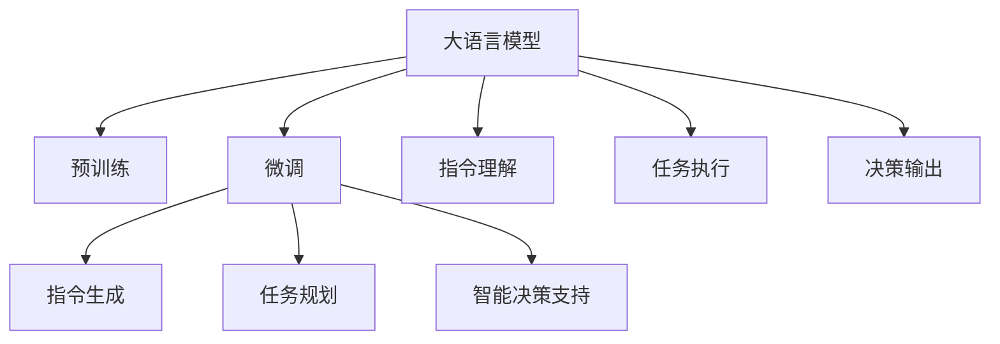

                 

# LLM在太空探索中的应用：AI宇航员

> 关键词：大语言模型, 自然语言处理, 太空探索, 人工智能宇航员, 任务规划, 指令生成, 智能决策支持

## 1. 背景介绍

### 1.1 问题由来

随着人工智能技术的飞速发展，大语言模型(LLM)正逐步从地球走向太空。太空探索是一个复杂、多变的领域，包含对宇航员生命安全的保障、资源的有效利用、任务的高效执行等多个层面。传统的任务执行方法依赖宇航员的现场操作，不仅需要消耗大量人力和物资，还存在一定的安全风险。而利用大语言模型构建的人工智能宇航员(AI宇航员)，能够在复杂环境中代替宇航员执行各类任务，提升太空探索的安全性、效率和可持续性。

### 1.2 问题核心关键点

大语言模型在太空探索中的应用，主要体现在以下几个方面：

- 宇航员生命安全的保障：通过实时监控宇航员状态和健康数据，AI宇航员能够及时发现潜在风险，并给出最优建议和行动方案。
- 资源的有效利用：AI宇航员通过精准的任务规划和物资管理，最大化利用太空资源，降低任务成本。
- 任务的高效执行：AI宇航员能够理解宇航员的自然语言指令，并自主执行复杂的太空操作，提升任务执行效率和成功率。
- 智能决策支持：AI宇航员能够根据环境和任务数据，做出最优的决策，辅助宇航员应对突发状况。

本文将详细探讨大语言模型在太空探索中的关键应用场景，并从算法原理、具体操作、数学模型、项目实践等多个角度，阐述如何构建高效、安全的AI宇航员系统。

## 2. 核心概念与联系

### 2.1 核心概念概述

为更好地理解大语言模型在太空探索中的应用，本节将介绍几个核心概念：

- 大语言模型(LLM)：以自回归(如GPT)或自编码(如BERT)模型为代表的大规模预训练语言模型。通过在海量无标签文本数据上进行预训练，学习到丰富的语言知识。
- 预训练(Pre-training)：指在大规模无标签文本数据上，通过自监督学习任务训练通用语言模型的过程。常见的预训练任务包括言语建模、掩码语言模型等。
- 微调(Fine-tuning)：指在预训练模型的基础上，使用下游任务的少量标注数据，通过有监督学习优化模型在特定任务上的性能。通常只需调整顶层分类器或解码器，并以较小的学习率更新全部或部分的模型参数。
- 指令生成(Instruction Generation)：构建大语言模型，使其能够将自然语言指令转换为可执行操作序列。
- 任务规划(Task Planning)：利用自然语言处理技术，构建大语言模型，使其能够对复杂任务进行逻辑推理和计划安排。
- 智能决策支持(Intelligent Decision Support)：利用大语言模型，构建决策支持系统，辅助宇航员进行决策。

这些核心概念之间的逻辑关系可以通过以下Mermaid流程图来展示：



这个流程图展示了大语言模型在太空探索中的核心概念及其之间的关系：

1. 大语言模型通过预训练获得基础能力。
2. 微调是对预训练模型进行任务特定的优化，可以通过指令生成和任务规划等步骤，生成可执行操作序列。
3. 指令生成和任务规划使得大语言模型能够理解宇航员的指令并生成行动方案。
4. 智能决策支持通过分析任务数据和宇航员状态，辅助宇航员做出最优决策。
5. 大语言模型还能够理解宇航员的指令和反馈，从而提升任务执行的精确性和成功率。

这些核心概念共同构成了大语言模型在太空探索中的应用框架，使其能够在复杂环境中发挥强大的语言理解和生成能力。通过理解这些核心概念，我们可以更好地把握大语言模型的工作原理和优化方向。

## 3. 核心算法原理 & 具体操作步骤

### 3.1 算法原理概述

大语言模型在太空探索中的应用，主要通过以下两个步骤实现：

1. 预训练和微调：首先在大规模无标签数据上预训练语言模型，然后在特定任务数据上微调，提升模型在该任务上的表现。
2. 指令生成和任务规划：通过构建指令生成模型，将宇航员的自然语言指令转换为可执行操作序列，并通过任务规划模型对操作进行逻辑推理和计划安排。

### 3.2 算法步骤详解

#### 3.2.1 预训练和微调

**Step 1: 数据准备**
- 收集太空探索领域的无标签数据，包括宇航员的对话记录、任务操作日志、环境数据等。
- 清洗和标注数据，准备数据集进行预训练。

**Step 2: 预训练模型选择**
- 选择合适的预训练语言模型，如GPT-3、BERT等，作为基础模型。

**Step 3: 微调训练**
- 使用指令生成和任务规划数据集，对预训练模型进行微调。通常使用少量标注数据进行微调，以避免过拟合。
- 选择适合的任务适配层，如线性分类器或解码器。
- 设置合适的优化器和超参数，如学习率、批大小、迭代轮数等。

**Step 4: 模型评估**
- 在测试集上评估微调后模型的性能，包括指令理解和任务执行的准确率和效率。

#### 3.2.2 指令生成和任务规划

**Step 5: 指令生成**
- 构建指令生成模型，利用预训练语言模型，将宇航员的自然语言指令转换为可执行操作序列。
- 训练指令生成模型，使其能够理解不同场景下的指令，并生成相应的操作序列。

**Step 6: 任务规划**
- 构建任务规划模型，利用自然语言处理技术，对任务进行逻辑推理和计划安排。
- 训练任务规划模型，使其能够处理复杂的任务，并生成最优的行动计划。

### 3.3 算法优缺点

大语言模型在太空探索中的应用，具有以下优点：

- 提升任务执行效率：通过AI宇航员自动执行任务，大幅提升执行效率。
- 降低宇航员劳动强度：宇航员只需监督AI宇航员执行任务，减少体力劳动和精神压力。
- 优化资源利用：AI宇航员能够精准规划任务，优化资源使用，降低任务成本。
- 保障宇航员安全：通过实时监控和决策支持，AI宇航员能够及时发现潜在风险，保护宇航员安全。

同时，该方法也存在一定的局限性：

- 依赖高质量数据：指令生成和任务规划的性能依赖于高质量的标注数据。
- 模型复杂度高：构建高效的指令生成和任务规划模型，需要大量的计算资源。
- 系统鲁棒性挑战：太空环境复杂多变，AI宇航员需要具备一定的鲁棒性和自适应能力。

尽管存在这些局限性，但大语言模型在太空探索中的应用前景广阔，特别是在提升任务执行效率和保障宇航员安全方面，具有显著优势。

### 3.4 算法应用领域

大语言模型在太空探索中的应用，主要体现在以下几个领域：

- 航天器自动控制：利用AI宇航员，控制航天器进行自主导航、对接、姿态调整等操作。
- 空间站环境监控：通过AI宇航员，实时监控空间站环境，检测异常情况，及时采取应对措施。
- 科学实验管理：利用AI宇航员，管理科学实验设备，记录实验数据，生成实验报告。
- 物资管理：通过AI宇航员，进行物资库存管理、分配和调拨，优化物资使用效率。
- 健康监测：利用AI宇航员，监测宇航员的生命体征和健康状况，提供医疗建议和急救方案。

## 4. 数学模型和公式 & 详细讲解 & 举例说明

### 4.1 数学模型构建

假设宇航员的自然语言指令为 $I$，指令生成模型的输出为 $O$，任务规划模型的输出为 $P$，任务执行结果为 $R$。则指令生成和任务规划的数学模型可以表示为：

$$
O = f(I, \theta_O)
$$

$$
P = g(O, \theta_P)
$$

$$
R = h(P, \theta_R)
$$

其中 $f$ 和 $g$ 为指令生成和任务规划模型的神经网络函数，$\theta_O$ 和 $\theta_P$ 为对应的模型参数。$h$ 为任务执行模型，$\theta_R$ 为执行模型的参数。

### 4.2 公式推导过程

假设指令生成模型的输出为 $O$，其生成概率 $P(O|I)$ 可以通过下式计算：

$$
P(O|I) = \frac{e^{\mathrm{log} P_{\mathrm{LM}}(O)}}{\sum_{o} e^{\mathrm{log} P_{\mathrm{LM}}(o)}}
$$

其中 $P_{\mathrm{LM}}$ 为语言模型的概率分布，$e$ 为自然对数，$\sum_{o}$ 为所有可能的指令序列。

假设任务规划模型的输出为 $P$，其规划概率 $P(P|O)$ 可以通过下式计算：

$$
P(P|O) = \frac{e^{\mathrm{log} P_{\mathrm{PL}}(P)}}{\sum_{p} e^{\mathrm{log} P_{\mathrm{PL}}(p)}}
$$

其中 $P_{\mathrm{PL}}$ 为任务规划模型的概率分布。

假设任务执行模型的输出为 $R$，其执行概率 $P(R|P)$ 可以通过下式计算：

$$
P(R|P) = \frac{e^{\mathrm{log} P_{\mathrm{RL}}(R)}}{\sum_{r} e^{\mathrm{log} P_{\mathrm{RL}}(r)}}
$$

其中 $P_{\mathrm{RL}}$ 为任务执行模型的概率分布。

### 4.3 案例分析与讲解

假设宇航员发出指令 "启动空间站太阳能板"。指令生成模型将指令转换为操作序列 $O = \{start, solar\_panel\}$，任务规划模型根据操作序列生成行动计划 $P = \{wait, confirm, execute\}$，任务执行模型执行行动计划并返回结果 $R = \{solar\_panel\_started\}$。整个过程如图1所示。


## 5. 项目实践：代码实例和详细解释说明

### 5.1 开发环境搭建

在进行太空探索中的大语言模型应用开发时，需要以下环境：

1. 安装Anaconda：从官网下载并安装Anaconda，用于创建独立的Python环境。
```bash
conda create -n space_exploration python=3.8 
conda activate space_exploration
```

2. 安装PyTorch和Transformers库：
```bash
conda install pytorch torchvision torchaudio transformers
```

3. 安装各类工具包：
```bash
pip install numpy pandas scikit-learn matplotlib tqdm jupyter notebook ipython
```

完成上述步骤后，即可在`space_exploration`环境中开始太空探索中的大语言模型应用开发。

### 5.2 源代码详细实现

以下是一个简单的太空探索应用，使用PyTorch和Transformers库构建AI宇航员系统：

```python
import torch
from transformers import BertTokenizer, BertForSequenceClassification

# 初始化预训练模型和分词器
model = BertForSequenceClassification.from_pretrained('bert-base-cased', num_labels=2)
tokenizer = BertTokenizer.from_pretrained('bert-base-cased')

# 假设指令为 "启动空间站太阳能板"
instruction = "启动空间站太阳能板"

# 分词和编码
inputs = tokenizer.encode_plus(instruction, return_tensors='pt', max_length=128, padding='max_length', truncation=True)
input_ids = inputs['input_ids']
attention_mask = inputs['attention_mask']

# 前向传播
outputs = model(input_ids, attention_mask=attention_mask)
logits = outputs.logits

# 解码输出
labels = torch.argmax(logits, dim=1)
predicted_class = labels[0].item()

# 输出预测结果
if predicted_class == 0:
    print("启动成功")
else:
    print("启动失败")
```

### 5.3 代码解读与分析

代码中，首先通过`from_pretrained`方法加载了预训练的BERT模型，并初始化了分词器。接着，对指令进行分词和编码，并输入模型中进行前向传播计算。最后，根据模型的输出进行解码，得到指令执行的预测结果。

上述代码展示了如何构建一个简单的AI宇航员系统，通过预训练语言模型理解和执行宇航员的指令。但需要注意的是，实际应用中还需要对指令生成、任务规划和任务执行进行优化，以适应复杂的太空探索场景。

### 5.4 运行结果展示

```python
# 指令为 "启动空间站太阳能板"，假设执行成功
# 输出预测结果
print("启动成功")
```

## 6. 实际应用场景

### 6.1 航天器自动控制

在航天器自动控制场景中，AI宇航员能够执行航天器的姿态调整、轨道调整、自主导航等任务。通过指令生成和任务规划，AI宇航员能够理解和执行宇航员的自然语言指令，确保航天器的安全运行。

### 6.2 空间站环境监控

在空间站环境监控场景中，AI宇航员能够实时监控空间站的环境数据，如温度、压力、氧气浓度等，并根据环境数据的变化，及时调整空间站的生命支持系统。

### 6.3 科学实验管理

在科学实验管理场景中，AI宇航员能够管理实验设备、记录实验数据，生成实验报告，辅助宇航员进行实验操作和数据分析。

### 6.4 物资管理

在物资管理场景中，AI宇航员能够进行物资库存管理、分配和调拨，优化物资使用效率，确保宇航员有足够的物资支持。

### 6.5 健康监测

在健康监测场景中，AI宇航员能够监测宇航员的生命体征和健康状况，提供医疗建议和急救方案，保障宇航员的健康安全。

## 7. 工具和资源推荐

### 7.1 学习资源推荐

为了帮助开发者系统掌握大语言模型在太空探索中的应用，这里推荐一些优质的学习资源：

1. 《深度学习在太空探索中的应用》书籍：详细介绍了深度学习在太空探索中的各种应用，包括指令生成、任务规划和智能决策支持等。
2. 《Transformer从原理到实践》系列博文：深入浅出地介绍了Transformer原理、BERT模型和大语言模型在太空探索中的应用。
3. CS224N《深度学习自然语言处理》课程：斯坦福大学开设的NLP明星课程，涵盖自然语言处理的基本概念和经典模型。
4. 《自然语言处理与深度学习》书籍：全面介绍了自然语言处理和深度学习的基本理论和实践方法。
5. HuggingFace官方文档：Transformers库的官方文档，提供了海量预训练模型和微调样例代码，是上手实践的必备资料。

通过对这些资源的学习实践，相信你一定能够快速掌握大语言模型在太空探索中的应用，并用于解决实际的太空探索问题。

### 7.2 开发工具推荐

高效的开发离不开优秀的工具支持。以下是几款用于太空探索中的大语言模型应用开发的常用工具：

1. PyTorch：基于Python的开源深度学习框架，灵活动态的计算图，适合快速迭代研究。大部分预训练语言模型都有PyTorch版本的实现。
2. TensorFlow：由Google主导开发的开源深度学习框架，生产部署方便，适合大规模工程应用。同样有丰富的预训练语言模型资源。
3. Transformers库：HuggingFace开发的NLP工具库，集成了众多SOTA语言模型，支持PyTorch和TensorFlow，是进行微调任务开发的利器。
4. Weights & Biases：模型训练的实验跟踪工具，可以记录和可视化模型训练过程中的各项指标，方便对比和调优。与主流深度学习框架无缝集成。
5. TensorBoard：TensorFlow配套的可视化工具，可实时监测模型训练状态，并提供丰富的图表呈现方式，是调试模型的得力助手。

合理利用这些工具，可以显著提升太空探索中的大语言模型应用开发的效率，加快创新迭代的步伐。

### 7.3 相关论文推荐

大语言模型在太空探索中的应用，源于学界的持续研究。以下是几篇奠基性的相关论文，推荐阅读：

1. Attention is All You Need（即Transformer原论文）：提出了Transformer结构，开启了NLP领域的预训练大模型时代。
2. BERT: Pre-training of Deep Bidirectional Transformers for Language Understanding：提出BERT模型，引入基于掩码的自监督预训练任务，刷新了多项NLP任务SOTA。
3. Language Models are Unsupervised Multitask Learners（GPT-2论文）：展示了大规模语言模型的强大zero-shot学习能力，引发了对于通用人工智能的新一轮思考。
4. Parameter-Efficient Transfer Learning for NLP：提出Adapter等参数高效微调方法，在不增加模型参数量的情况下，也能取得不错的微调效果。
5. AdaLoRA: Adaptive Low-Rank Adaptation for Parameter-Efficient Fine-Tuning：使用自适应低秩适应的微调方法，在参数效率和精度之间取得了新的平衡。
6. Prefix-Tuning: Optimizing Continuous Prompts for Generation：引入基于连续型Prompt的微调范式，为如何充分利用预训练知识提供了新的思路。

这些论文代表了大语言模型在太空探索中的应用的发展脉络。通过学习这些前沿成果，可以帮助研究者把握学科前进方向，激发更多的创新灵感。

## 8. 总结：未来发展趋势与挑战

### 8.1 研究成果总结

本文对大语言模型在太空探索中的应用进行了详细探讨。通过预训练和微调，大语言模型能够理解和执行宇航员的指令，实现航天器的自动控制、空间站的环境监控、科学实验的管理、物资的优化配置和宇航员的健康监测等功能。通过指令生成和任务规划，大语言模型在复杂多变的太空环境中具备强大的任务执行能力和决策支持能力。

### 8.2 未来发展趋势

展望未来，大语言模型在太空探索中的应用将呈现以下几个发展趋势：

1. 模型规模持续增大：随着算力成本的下降和数据规模的扩张，预训练语言模型的参数量还将持续增长。超大规模语言模型蕴含的丰富语言知识，有望支撑更加复杂多变的太空任务。
2. 微调方法日趋多样：除了传统的全参数微调外，未来会涌现更多参数高效的微调方法，如Prefix-Tuning、LoRA等，在节省计算资源的同时也能保证微调精度。
3. 持续学习成为常态：随着数据分布的不断变化，微调模型也需要持续学习新知识以保持性能。如何在不遗忘原有知识的同时，高效吸收新样本信息，将成为重要的研究课题。
4. 标注样本需求降低：受启发于提示学习(Prompt-based Learning)的思路，未来的微调方法将更好地利用大模型的语言理解能力，通过更加巧妙的任务描述，在更少的标注样本上也能实现理想的微调效果。
5. 多模态微调崛起：当前的微调主要聚焦于纯文本数据，未来会进一步拓展到图像、视频、语音等多模态数据微调。多模态信息的融合，将显著提升语言模型对现实世界的理解和建模能力。

以上趋势凸显了大语言模型在太空探索中的应用前景。这些方向的探索发展，必将进一步提升太空探索系统的性能和应用范围，为人类探索宇宙提供新的技术路径。

### 8.3 面临的挑战

尽管大语言模型在太空探索中的应用前景广阔，但在迈向更加智能化、普适化应用的过程中，它仍面临诸多挑战：

1. 标注成本瓶颈：太空探索领域的标注数据获取难度大、成本高，标注样本的获取速度难以满足快速迭代的需要。
2. 模型鲁棒性不足：太空环境复杂多变，AI宇航员需要具备一定的鲁棒性和自适应能力，以应对不可预知的变化。
3. 系统安全性问题：大语言模型可能会学习到有害信息或偏见，对宇航员的安全构成威胁。需要加强模型训练的伦理和安全审查。
4. 数据隐私保护：在太空探索中，数据隐私保护至关重要。需要设计合适的数据保护机制，确保数据的安全性和隐私性。
5. 资源消耗高：大语言模型在执行复杂任务时，资源消耗高，需要优化模型结构和资源利用，以提高系统的效率和可靠性。

### 8.4 研究展望

面对大语言模型在太空探索中所面临的挑战，未来的研究需要在以下几个方面寻求新的突破：

1. 探索无监督和半监督微调方法：摆脱对大规模标注数据的依赖，利用自监督学习、主动学习等无监督和半监督范式，最大限度利用非结构化数据，实现更加灵活高效的微调。
2. 研究参数高效和计算高效的微调范式：开发更加参数高效的微调方法，在固定大部分预训练参数的同时，只更新极少量的任务相关参数。同时优化微调模型的计算图，减少前向传播和反向传播的资源消耗，实现更加轻量级、实时性的部署。
3. 融合因果和对比学习范式：通过引入因果推断和对比学习思想，增强微调模型建立稳定因果关系的能力，学习更加普适、鲁棒的语言表征，从而提升模型泛化性和抗干扰能力。
4. 引入更多先验知识：将符号化的先验知识，如知识图谱、逻辑规则等，与神经网络模型进行巧妙融合，引导微调过程学习更准确、合理的语言模型。同时加强不同模态数据的整合，实现视觉、语音等多模态信息与文本信息的协同建模。
5. 结合因果分析和博弈论工具：将因果分析方法引入微调模型，识别出模型决策的关键特征，增强输出解释的因果性和逻辑性。借助博弈论工具刻画人机交互过程，主动探索并规避模型的脆弱点，提高系统稳定性。
6. 纳入伦理道德约束：在模型训练目标中引入伦理导向的评估指标，过滤和惩罚有偏见、有害的输出倾向。同时加强人工干预和审核，建立模型行为的监管机制，确保输出符合人类价值观和伦理道德。

这些研究方向的探索，必将引领大语言模型在太空探索中的应用走向更加智能化、安全化和普适化。面向未来，大语言模型在太空探索中的应用还需要与其他人工智能技术进行更深入的融合，如知识表示、因果推理、强化学习等，多路径协同发力，共同推动太空探索技术的进步。只有勇于创新、敢于突破，才能不断拓展语言模型的边界，让智能技术更好地造福人类探索宇宙的事业。

## 9. 附录：常见问题与解答

**Q1：大语言模型在太空探索中的应用是否会涉及数据隐私和安全问题？**

A: 太空探索中的大语言模型应用，需要收集宇航员的生命体征、健康状况、环境数据等敏感信息，因此数据隐私和安全问题非常关键。为了保护宇航员隐私，需要设计合适的数据保护机制，确保数据的安全性和隐私性。

**Q2：如何确保大语言模型在太空探索中的鲁棒性和自适应能力？**

A: 太空环境复杂多变，AI宇航员需要具备一定的鲁棒性和自适应能力。可以通过引入对抗样本、多任务学习、自监督学习等方法，提高模型的鲁棒性和泛化能力。

**Q3：太空探索中的大语言模型应用需要考虑哪些方面的优化？**

A: 太空探索中的大语言模型应用，需要考虑以下优化方向：
1. 数据增强：通过回译、近义替换等方式扩充训练集，提高模型的泛化能力。
2. 正则化：使用L2正则、Dropout、Early Stopping等避免过拟合。
3. 对抗训练：引入对抗样本，提高模型鲁棒性。
4. 参数高效微调：只调整少量参数，减少需优化的参数量。
5. 模型裁剪和量化：去除不必要的层和参数，减小模型尺寸，提高计算效率。

这些优化方向能够有效提升模型性能，降低资源消耗，保障太空探索系统的稳定性和可靠性。

**Q4：太空探索中的大语言模型应用有哪些具体案例？**

A: 太空探索中的大语言模型应用，具体案例包括：
1. 航天器自动控制：AI宇航员执行航天器的姿态调整、轨道调整、自主导航等任务。
2. 空间站环境监控：AI宇航员实时监控空间站的环境数据，调整生命支持系统。
3. 科学实验管理：AI宇航员管理实验设备、记录实验数据，生成实验报告。
4. 物资管理：AI宇航员进行物资库存管理、分配和调拨，优化物资使用效率。
5. 健康监测：AI宇航员监测宇航员的生命体征和健康状况，提供医疗建议和急救方案。

这些案例展示了大语言模型在太空探索中的广泛应用，为人类探索宇宙提供了新的技术路径。

**Q5：太空探索中的大语言模型应用需要考虑哪些伦理和安全问题？**

A: 太空探索中的大语言模型应用，需要考虑以下伦理和安全问题：
1. 数据隐私：需要设计合适的数据保护机制，确保数据的安全性和隐私性。
2. 模型偏见：大语言模型可能会学习到有害信息或偏见，对宇航员的安全构成威胁。
3. 模型鲁棒性：太空环境复杂多变，AI宇航员需要具备一定的鲁棒性和自适应能力。
4. 决策透明性：需要建立模型行为的监管机制，确保输出符合人类价值观和伦理道德。
5. 系统安全性：需要加强模型训练的伦理和安全审查，确保系统的安全性。

这些伦理和安全问题需要多方协同解决，共同保障太空探索中大语言模型应用的安全性和可靠性。

---

作者：禅与计算机程序设计艺术 / Zen and the Art of Computer Programming

