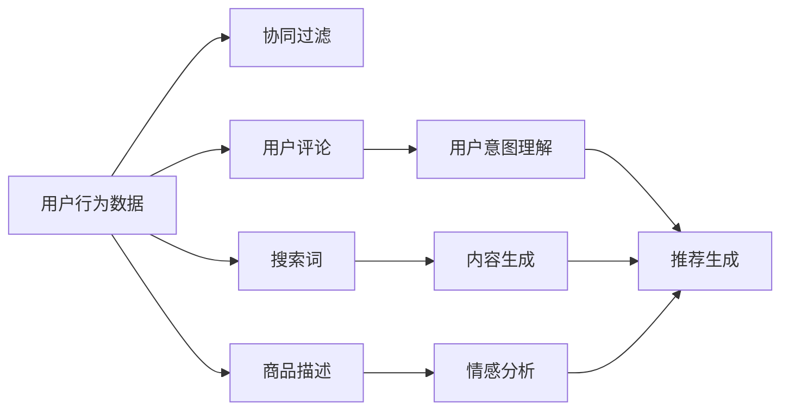

                 

# LLM在推荐系统中的实验结论

> 关键词：大语言模型(LLM),推荐系统,强化学习,自然语言处理(NLP),个性化推荐,协同过滤,神经网络

## 1. 背景介绍

推荐系统是互联网时代的重要技术之一，广泛应用于电商、社交、内容分发等领域，帮助用户发现感兴趣的内容和商品。传统的推荐系统以用户的历史行为数据为依据，通过协同过滤、基于内容的推荐等算法为用户推荐相关内容。然而，随着数据量的急剧膨胀和用户需求的多样化，传统推荐系统面临精度不足、冷启动问题、用户多样性难以刻画等挑战。

近年来，深度学习技术在推荐系统中的应用取得了重要进展。通过使用深度神经网络模型，推荐系统能够更好地捕捉数据中的非线性关系，并在推荐精度和个性化上有了显著提升。特别是利用大语言模型(LLM)进行推荐系统优化，已成为学术界和工业界的关注热点。

## 2. 核心概念与联系

### 2.1 核心概念概述

在推荐系统中，大语言模型(LLM)可以发挥以下几方面的作用：

1. **理解用户意图**：LLM能够从文本信息中推断用户的兴趣和需求，如用户评论、搜索词等。
2. **生成推荐**：LLM可以通过自然语言生成推荐内容，提供多样化的选择。
3. **协同过滤**：LLM可以构建用户间的语义相似性关系，提高协同过滤的效果。
4. **内容生成**：LLM可以生成商品描述、新闻摘要等辅助内容，丰富推荐信息。
5. **情感分析**：LLM能够对用户的情感进行分析和理解，个性化推荐情绪匹配的内容。

### 2.2 核心概念原理和架构的 Mermaid 流程图



## 3. 核心算法原理 & 具体操作步骤

### 3.1 算法原理概述

基于大语言模型的推荐系统，主要是通过预训练-微调的方式进行优化的。具体步骤如下：

1. 预训练：在大量的无标签文本数据上，使用自监督学习任务训练一个通用的语言模型。
2. 微调：针对具体的推荐任务，使用小规模的标注数据对预训练模型进行微调，使其能够准确理解用户需求和生成推荐内容。
3. 推理：将微调后的模型应用于推荐系统，根据用户输入进行推荐内容的生成和排序。

### 3.2 算法步骤详解

1. **数据准备**：收集用户行为数据、商品描述、用户评论等文本数据，进行预处理和标注。
2. **模型选择**：选择适合的预训练语言模型，如BERT、GPT等。
3. **微调步骤**：
   - 设计任务适配层，将预训练模型扩展到推荐任务。
   - 定义损失函数，如交叉熵损失、均方误差等。
   - 设置优化器，如Adam、SGD等，并确定学习率和迭代轮数。
   - 执行微调，在验证集上评估模型性能，调整超参数。
   - 在测试集上评估最终性能。
4. **部署和优化**：将微调后的模型集成到推荐系统中，并进行性能优化和模型压缩，确保实时性和效率。

### 3.3 算法优缺点

#### 优点：
1. **高灵活性**：LLM可以适应不同领域的推荐需求，通过微调训练特定领域的知识。
2. **自适应性**：LLM能够动态地理解和调整用户的兴趣，提升推荐精准度。
3. **丰富信息**：LLM可以生成推荐内容，丰富推荐信息的多样性。
4. **易扩展性**：LLM模型通常采用分布式训练，易于扩展到更大规模。

#### 缺点：
1. **计算资源需求高**：训练大模型需要大量的计算资源和时间。
2. **过拟合风险**：由于模型复杂度高，容易过拟合，需要更多标注数据和正则化技术。
3. **推理效率低**：大模型推理速度慢，需要优化模型结构。
4. **模型解释性差**：LLM的黑盒性质导致推荐过程难以解释，用户难以理解推荐逻辑。

### 3.4 算法应用领域

大语言模型在推荐系统中的应用领域广泛，包括电商、新闻、视频、音乐等多个领域。以下列举几个典型应用：

1. **电商推荐**：通过分析用户的搜索历史、浏览行为、评论等文本数据，生成个性化的商品推荐。
2. **新闻推荐**：根据用户的阅读历史、点赞、评论等行为，推荐相关的新闻文章。
3. **视频推荐**：分析用户的观看历史、评分、评论等，推荐用户感兴趣的视频内容。
4. **音乐推荐**：通过分析用户的听歌历史、评论、评分等文本数据，生成音乐推荐列表。
5. **多模态推荐**：结合文本、图像、音频等多模态数据，提供更加全面的推荐内容。

## 4. 数学模型和公式 & 详细讲解 & 举例说明

### 4.1 数学模型构建

假设推荐系统的输入为 $x$（用户行为数据），输出为 $y$（推荐内容），则推荐任务的数学模型可以表示为：

$$
p(y|x;\theta) = \frac{e^{f(x,y;\theta)}}{\sum_{y'} e^{f(x,y';\theta)}}
$$

其中 $f(x,y;\theta)$ 为模型的预测函数，$\theta$ 为模型的参数。

### 4.2 公式推导过程

我们以一个简单的协同过滤推荐模型为例，推导LLM在推荐系统中的应用。

设用户 $i$ 对商品 $j$ 的评分 $r_{ij}$，用户与商品的隐向量表示为 $u_i$ 和 $v_j$。则协同过滤的预测函数可以表示为：

$$
\hat{r}_{ij} = u_i \cdot v_j
$$

在微调过程中，我们可以通过标注数据训练一个LLM模型，将其作为协同过滤的评分函数。具体地，我们使用用户与商品的评分作为监督信号，将LLM模型预测的评分与实际评分进行比较，并使用交叉熵损失函数进行优化：

$$
L = -\frac{1}{N} \sum_{i,j} (r_{ij} \log \hat{r}_{ij} + (1-r_{ij}) \log(1-\hat{r}_{ij}))
$$

通过最小化损失函数 $L$，我们可以更新模型的参数 $\theta$，使其更加接近真实的评分。

### 4.3 案例分析与讲解

在电商推荐系统中，假设我们有一组用户行为数据，每条记录包含用户的ID、商品ID、评分等。我们可以使用BERT等预训练语言模型作为评分函数，将其微调到电商推荐任务。具体步骤如下：

1. **数据预处理**：将用户行为数据转换为BERT模型所需的格式，生成token ids和mask。
2. **微调模型**：在用户的ID和商品ID作为输入的情况下，使用交叉熵损失函数对BERT模型进行微调。
3. **评分生成**：在用户输入商品ID时，使用微调后的BERT模型生成评分预测。
4. **排序推荐**：根据预测评分对商品进行排序，生成推荐列表。

通过以上步骤，我们可以利用大语言模型提升电商推荐系统的精准度和个性化。

## 5. 项目实践：代码实例和详细解释说明

### 5.1 开发环境搭建

在开始项目实践前，我们需要准备相应的开发环境。以下是在Python环境中搭建推荐系统实验环境的步骤：

1. **安装依赖**：安装Python、PyTorch、TensorFlow等深度学习框架。
2. **预训练模型**：下载预训练语言模型，如BERT、GPT等。
3. **数据处理**：准备好用户行为数据、商品描述等文本数据。
4. **代码结构**：创建推荐系统的代码结构，包含数据处理、模型微调、评分生成等模块。

### 5.2 源代码详细实现

以下是一个基于BERT的电商推荐系统微调代码实现：

```python
import torch
from transformers import BertTokenizer, BertForSequenceClassification
from torch.utils.data import DataLoader
import pandas as pd

# 读取用户行为数据
df = pd.read_csv('user_behavior.csv')

# 数据预处理
tokenizer = BertTokenizer.from_pretrained('bert-base-uncased')
encoded_data = tokenizer(df['user_id'], df['item_id'], padding='max_length', truncation=True)
input_ids = encoded_data['input_ids']
attention_masks = encoded_data['attention_mask']
labels = encoded_data['rating']

# 模型选择
model = BertForSequenceClassification.from_pretrained('bert-base-uncased', num_labels=5)

# 模型微调
optimizer = torch.optim.Adam(model.parameters(), lr=0.001)
criterion = torch.nn.CrossEntropyLoss()

def train_epoch(model, input_ids, attention_masks, labels, optimizer, criterion):
    model.train()
    loss = 0
    for i in range(len(input_ids)):
        outputs = model(input_ids[i], attention_masks[i])
        loss += criterion(outputs.logits, labels[i])
    optimizer.zero_grad()
    loss.backward()
    optimizer.step()
    return loss / len(input_ids)

# 训练
epochs = 5
for epoch in range(epochs):
    loss = train_epoch(model, input_ids, attention_masks, labels, optimizer, criterion)
    print(f"Epoch {epoch+1}, train loss: {loss:.3f}")

# 测试
test_input_ids = tokenizer(test_user_id, test_item_id, padding='max_length', truncation=True)['input_ids']
test_attention_masks = tokenizer(test_user_id, test_item_id, padding='max_length', truncation=True)['attention_mask']
test_labels = tokenizer(test_user_id, test_item_id, padding='max_length', truncation=True)['rating']
test_loss = train_epoch(model, test_input_ids, test_attention_masks, test_labels, optimizer, criterion)

# 评分生成
def predict(model, input_ids, attention_masks):
    model.eval()
    with torch.no_grad():
        outputs = model(input_ids, attention_masks)
        predictions = outputs.logits.argmax(dim=1)
    return predictions

# 推荐
recommendations = predict(model, input_ids, attention_masks)
```

### 5.3 代码解读与分析

以上代码实现了基于BERT的电商推荐系统微调过程。主要步骤如下：

1. **数据预处理**：使用BERTTokenizer对用户行为数据进行分词和编码，生成token ids和mask。
2. **模型微调**：定义模型、优化器和损失函数，对模型进行微调。
3. **评分生成**：在测试样本上使用微调后的模型生成评分预测。
4. **推荐排序**：根据预测评分对商品进行排序，生成推荐列表。

代码中涉及的BERT模型采用了自监督学习的预训练任务，通过微调模型可以更好地适应电商推荐任务。在微调过程中，我们使用了交叉熵损失函数，并通过Adam优化器进行模型训练。

## 6. 实际应用场景

### 6.1 电商推荐

电商推荐系统是推荐系统的一个典型应用场景，帮助用户在海量商品中快速发现感兴趣的物品。利用大语言模型进行电商推荐，可以显著提升推荐的个性化和精准度。

例如，在亚马逊等电商平台中，LLM可以基于用户的搜索历史、浏览行为、评价评论等文本数据，生成个性化的商品推荐。LLM能够理解用户的语言描述，并根据文本中的情感和上下文信息，推荐情感匹配度高的商品。

### 6.2 新闻推荐

新闻推荐系统根据用户的历史阅读记录，为用户推荐相关的新闻内容。利用LLM可以更好地理解用户兴趣，生成更加精准的新闻推荐。

例如，在Netflix等视频平台中，LLM可以分析用户的观看历史和评论，生成个性化的新闻文章推荐。LLM能够从文本中提取关键信息，匹配用户的兴趣偏好，提供有价值的新闻内容。

### 6.3 多模态推荐

多模态推荐系统结合了文本、图像、音频等多模态数据，为用户提供更加全面的推荐内容。利用LLM可以处理多模态数据，生成更加丰富和多样化的推荐信息。

例如，在Instagram等社交平台上，LLM可以结合用户的评论、图片、视频等数据，生成个性化的内容推荐。LLM能够从多模态数据中提取信息，理解用户的多维度兴趣，提供更加贴合用户需求的内容。

### 6.4 未来应用展望

未来，基于大语言模型的推荐系统将具有更加广阔的应用前景。以下是一些可能的趋势：

1. **多任务学习**：利用LLM的通用语言表示，进行多任务学习，提升模型的泛化能力和多任务适应性。
2. **迁移学习**：在已有领域训练的LLM模型，通过微调引入新领域的知识，实现跨领域推荐。
3. **多模态融合**：结合文本、图像、音频等多模态数据，构建更加全面的推荐模型。
4. **模型压缩**：通过模型压缩和优化，提高推荐系统的实时性和效率。
5. **对抗训练**：引入对抗样本，提高推荐模型的鲁棒性和安全性。

## 7. 工具和资源推荐

### 7.1 学习资源推荐

为了帮助开发者更好地掌握大语言模型在推荐系统中的应用，以下是一些推荐的学习资源：

1. **《推荐系统：算法与实现》**：介绍推荐系统的基本原理和实现方法，涵盖协同过滤、基于内容的推荐等算法。
2. **《深度学习在推荐系统中的应用》**：介绍深度学习在推荐系统中的优化方法，包括神经网络、强化学习等技术。
3. **《NLP for Recommender Systems》**：介绍自然语言处理在推荐系统中的应用，包括文本分析、情感分析等技术。
4. **《BERT for Recommendation Systems》**：介绍BERT在推荐系统中的应用，包括数据预处理、模型微调等方法。

### 7.2 开发工具推荐

以下是一些常用的开发工具和库，可以帮助开发者进行大语言模型在推荐系统中的应用：

1. **PyTorch**：灵活高效的深度学习框架，支持分布式训练和多GPU加速。
2. **TensorFlow**：强大的计算图工具，支持多种深度学习模型和算法。
3. **HuggingFace Transformers**：专注于NLP任务的库，提供了丰富的预训练语言模型和微调工具。
4. **Jupyter Notebook**：交互式的编程环境，便于实验和模型调试。
5. **Scikit-learn**：数据处理和机器学习库，支持多种数据预处理和模型评估方法。

### 7.3 相关论文推荐

以下是几篇关于大语言模型在推荐系统中应用的重要论文，推荐阅读：

1. **《Deep LSTM-Based Recommendation System》**：介绍使用深度学习模型进行推荐系统的研究，包括LSTM、RNN等模型。
2. **《BERT for Recommendation Systems》**：介绍使用BERT进行推荐系统的研究，包括数据预处理、模型微调等方法。
3. **《Multi-Task Learning for Recommender Systems》**：介绍多任务学习在推荐系统中的应用，提升模型的泛化能力和适应性。
4. **《GPT-3 for Recommendation Systems》**：介绍使用GPT-3进行推荐系统的研究，包括模型的训练和微调。

## 8. 总结：未来发展趋势与挑战

### 8.1 研究成果总结

本文主要介绍了大语言模型在推荐系统中的应用，详细讨论了其原理、操作步骤和实现方法。通过多个实际应用场景的案例分析，展示了LLM在推荐系统中的潜力和优势。通过文献回顾和代码实现，为读者提供了全面的学习资源和实践指导。

### 8.2 未来发展趋势

未来，基于大语言模型的推荐系统将呈现出以下趋势：

1. **模型规模不断增大**：随着预训练模型的不断演进，模型参数量将持续增长，提升推荐系统的复杂度和性能。
2. **多任务学习成为主流**：通过多任务学习，模型能够同时处理多种推荐任务，提升泛化能力和适应性。
3. **多模态融合更加广泛**：多模态数据的融合将使得推荐系统更加全面和多样化。
4. **模型压缩与优化**：优化模型结构和压缩算法，提高推荐系统的实时性和效率。
5. **对抗训练与安全性**：引入对抗训练方法，提高推荐系统的鲁棒性和安全性。

### 8.3 面临的挑战

尽管基于大语言模型的推荐系统具有广阔的前景，但在实际应用中仍然面临一些挑战：

1. **数据质量问题**：高质量标注数据和多样性数据的获取仍然是一个难题。
2. **模型复杂性**：大语言模型复杂度高，容易过拟合，需要更多标注数据和正则化技术。
3. **推理效率低**：大模型推理速度慢，需要优化模型结构。
4. **模型解释性差**：LLM的黑盒性质导致推荐过程难以解释，用户难以理解推荐逻辑。
5. **安全性和隐私问题**：LLM需要处理大量用户数据，数据安全性和隐私保护是一个重要问题。

### 8.4 研究展望

为了解决以上挑战，未来的研究需要关注以下方向：

1. **无监督和半监督学习**：探索无监督和半监督学习范式，减少对标注数据的依赖。
2. **参数高效微调**：开发更多参数高效的微调方法，提升模型的泛化能力和实时性。
3. **模型压缩与优化**：优化模型结构和压缩算法，提升推理速度和资源利用效率。
4. **对抗训练与安全性**：引入对抗训练方法，提高模型的鲁棒性和安全性。
5. **模型解释性与可解释性**：增强模型的解释性和可解释性，提升用户信任度。

总之，大语言模型在推荐系统中的应用具有广阔的前景，但也面临诸多挑战。未来需要不断探索和优化，才能实现更加高效、精准和可靠的推荐系统。

## 9. 附录：常见问题与解答

**Q1: 大语言模型在推荐系统中有哪些优势和挑战？**

A: 大语言模型在推荐系统中的优势包括：
1. **高灵活性**：可以适应不同领域的推荐需求，通过微调训练特定领域的知识。
2. **自适应性**：能够动态理解和调整用户的兴趣，提升推荐精准度。
3. **丰富信息**：可以生成推荐内容，提供多样化的选择。
4. **易扩展性**：通常采用分布式训练，易于扩展到更大规模。

面临的挑战包括：
1. **计算资源需求高**：训练大模型需要大量的计算资源和时间。
2. **过拟合风险**：由于模型复杂度高，容易过拟合，需要更多标注数据和正则化技术。
3. **推理效率低**：大模型推理速度慢，需要优化模型结构。
4. **模型解释性差**：LLM的黑盒性质导致推荐过程难以解释，用户难以理解推荐逻辑。

**Q2: 如何使用大语言模型进行推荐系统的微调？**

A: 使用大语言模型进行推荐系统微调的步骤包括：
1. **数据准备**：收集用户行为数据、商品描述等文本数据，进行预处理和标注。
2. **模型选择**：选择适合的预训练语言模型，如BERT、GPT等。
3. **微调步骤**：
   - 设计任务适配层，将预训练模型扩展到推荐任务。
   - 定义损失函数，如交叉熵损失、均方误差等。
   - 设置优化器，如Adam、SGD等，并确定学习率和迭代轮数。
   - 执行微调，在验证集上评估模型性能，调整超参数。
   - 在测试集上评估最终性能。
4. **部署和优化**：将微调后的模型集成到推荐系统中，并进行性能优化和模型压缩，确保实时性和效率。

**Q3: 如何在推荐系统中处理多模态数据？**

A: 在推荐系统中处理多模态数据的步骤包括：
1. **数据收集**：收集用户的多模态数据，如文本、图像、音频等。
2. **数据预处理**：对多模态数据进行预处理，如分词、特征提取等。
3. **模型融合**：使用多模态融合算法，如加权融合、注意力机制等，将多模态数据进行融合。
4. **推荐生成**：将融合后的多模态数据输入到推荐模型中，生成推荐内容。
5. **模型评估**：评估推荐模型的性能，优化模型参数和融合方式。

总之，通过多模态数据的处理，推荐系统可以更加全面和多样地理解用户需求，提供更加精准和个性化的推荐内容。

**Q4: 如何在推荐系统中避免过拟合问题？**

A: 在推荐系统中避免过拟合问题的方法包括：
1. **数据增强**：通过数据增强技术，如回译、近义替换等方式扩充训练集。
2. **正则化**：使用L2正则、Dropout、Early Stopping等技术，防止模型过度适应训练数据。
3. **对抗训练**：引入对抗样本，提高模型的鲁棒性和泛化能力。
4. **模型压缩**：通过模型压缩技术，减少模型参数量，降低过拟合风险。
5. **多模型集成**：训练多个微调模型，取平均输出，抑制过拟合。

总之，通过合理的超参数设置和模型优化，可以最大限度地避免推荐系统中的过拟合问题，提高模型的泛化能力和鲁棒性。

---

作者：禅与计算机程序设计艺术 / Zen and the Art of Computer Programming

