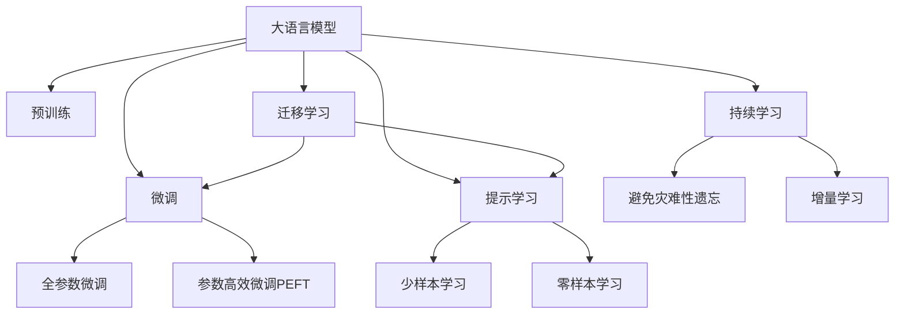

                 

# LLM在推荐系统中的少样本学习

> 关键词：语言模型,推荐系统,少样本学习,预训练,微调,Few-shot learning

## 1. 背景介绍

推荐系统是互联网时代最热门的领域之一，它通过数据分析和机器学习，为用户推荐个性化的内容。然而，推荐系统的核心——用户与物品的交互数据，往往非常稀疏，难以覆盖到所有的用户和物品，且随时间变化较快，导致模型训练数据量不足。

近年来，大语言模型（LLMs）的崛起，为推荐系统带来了新的突破。通过在大规模语料上进行预训练，LLMs获得了丰富的语言表示能力，可以通过少样本学习（Few-shot learning），快速适应新的推荐任务。

少样本学习指模型在少量标注样本的情况下，快速适应新任务的范式。在大规模语料预训练的支撑下，LLMs可以在短时间内完成微调，提升推荐系统的精度和效果。

## 2. 核心概念与联系

### 2.1 核心概念概述

为更好地理解LLMs在推荐系统中的少样本学习，本节将介绍几个密切相关的核心概念：

- 大语言模型（LLM）：以自回归(如GPT)或自编码(如BERT)模型为代表的大规模预训练语言模型。通过在大规模无标签文本语料上进行预训练，学习通用的语言表示，具备强大的语言理解和生成能力。

- 预训练（Pre-training）：指在大规模无标签文本语料上，通过自监督学习任务训练通用语言模型的过程。常见的预训练任务包括言语建模、遮挡语言模型等。预训练使得模型学习到语言的通用表示。

- 微调（Fine-tuning）：指在预训练模型的基础上，使用下游任务的少量标注数据，通过有监督地训练来优化模型在该任务上的性能。通常只需要调整顶层分类器或解码器，并以较小的学习率更新全部或部分的模型参数。

- 少样本学习（Few-shot Learning）：指在只有少量标注样本的情况下，模型能够快速适应新任务的学习方法。在大语言模型中，通常通过在输入中提供少量示例来实现，无需更新模型参数。

- 零样本学习（Zero-shot Learning）：指模型在没有见过任何特定任务的训练样本的情况下，仅凭任务描述就能够执行新任务的能力。大语言模型通过预训练获得的广泛知识，使其能够理解任务指令并生成相应输出。

- 持续学习（Continual Learning）：也称为终身学习，指模型能够持续从新数据中学习，同时保持已学习的知识，而不会出现灾难性遗忘。这对于保持大语言模型的时效性和适应性至关重要。

这些核心概念之间的逻辑关系可以通过以下Mermaid流程图来展示：



这个流程图展示了大语言模型的核心概念及其之间的关系：

1. 大语言模型通过预训练获得基础能力。
2. 微调是对预训练模型进行任务特定的优化，可以分为全参数微调和参数高效微调（PEFT）。
3. 提示学习是一种不更新模型参数的方法，可以实现少样本学习和零样本学习。
4. 迁移学习是连接预训练模型与下游任务的桥梁，可以通过微调或提示学习来实现。
5. 持续学习旨在使模型能够不断学习新知识，同时避免遗忘旧知识。

这些概念共同构成了大语言模型的学习和应用框架，使其能够在各种场景下发挥强大的语言理解和生成能力。通过理解这些核心概念，我们可以更好地把握大语言模型的工作原理和优化方向。

## 3. 核心算法原理 & 具体操作步骤
### 3.1 算法原理概述

基于少样本学习的LLMs推荐系统，本质上是利用大模型的泛化能力和迁移学习机制，在少量标注数据上进行微调，提升推荐精度。

其核心思想是：将预训练的大语言模型作为初始化参数，通过少量的交互数据和任务描述，在短时间内微调模型参数，使其能够快速适应新的推荐任务，生成符合用户偏好的个性化推荐。

形式化地，假设预训练模型为 $M_{\theta}$，其中 $\theta$ 为预训练得到的模型参数。给定推荐任务 $T$ 的少量标注数据集 $D=\{(x_i, y_i)\}_{i=1}^N$，其中 $x_i$ 为用户-物品交互数据，$y_i$ 为推荐结果标签。

少样本学习目标是最小化在少量样本上的预测误差，即：

$$
\hat{\theta}=\mathop{\arg\min}_{\theta} \mathcal{L}(M_{\theta},D)
$$

其中 $\mathcal{L}$ 为基于交互数据和任务描述的损失函数。

### 3.2 算法步骤详解

基于少样本学习的LLMs推荐系统一般包括以下几个关键步骤：

**Step 1: 准备预训练模型和数据集**
- 选择合适的预训练语言模型 $M_{\theta}$ 作为初始化参数，如 BERT、GPT等。
- 准备推荐任务 $T$ 的少量标注数据集 $D$，划分为训练集、验证集和测试集。

**Step 2: 设计任务适配层**
- 根据推荐任务类型，设计合适的输出层和损失函数。
- 对于推荐任务，通常使用交叉熵损失、均方误差损失等。

**Step 3: 设置微调超参数**
- 选择合适的优化算法及其参数，如 AdamW、SGD 等，设置学习率、批大小、迭代轮数等。
- 设置正则化技术及强度，包括权重衰减、Dropout、Early Stopping 等。
- 确定冻结预训练参数的策略，如仅微调顶层，或全部参数都参与微调。

**Step 4: 执行梯度训练**
- 将训练集数据分批次输入模型，前向传播计算损失函数。
- 反向传播计算参数梯度，根据设定的优化算法和学习率更新模型参数。
- 周期性在验证集上评估模型性能，根据性能指标决定是否触发 Early Stopping。
- 重复上述步骤直到满足预设的迭代轮数或 Early Stopping 条件。

**Step 5: 测试和部署**
- 在测试集上评估微调后模型 $M_{\hat{\theta}}$ 的性能，对比微调前后的精度提升。
- 使用微调后的模型对新样本进行推理预测，集成到实际的应用系统中。
- 持续收集新的数据，定期重新微调模型，以适应数据分布的变化。

以上是基于少样本学习的LLMs推荐系统的一般流程。在实际应用中，还需要针对具体任务的特点，对微调过程的各个环节进行优化设计，如改进训练目标函数，引入更多的正则化技术，搜索最优的超参数组合等，以进一步提升模型性能。

### 3.3 算法优缺点

基于少样本学习的LLMs推荐系统具有以下优点：

1. 快速适应新任务：仅需少量标注数据即可快速微调，生成推荐结果，适应新的推荐场景。
2. 泛化能力强：利用大模型的泛化能力，模型可以在不同领域、不同数据分布下进行微调，提升推荐精度。
3. 可解释性较好：通过提示学习等技术，模型输出的推荐结果可以提供较详细的解释，提升用户体验。
4. 灵活性高：可以根据不同的推荐场景，设计不同的任务适配层，实现个性化的推荐。

同时，该方法也存在一定的局限性：

1. 对标注数据依赖：少样本学习的性能很大程度上取决于标注数据的质量和数量，获取高质量标注数据的成本较高。
2. 对噪声敏感：少量样本的标注数据往往存在噪声，容易影响模型的泛化能力。
3. 模型复杂度：大规模预训练模型的参数量较大，微调过程可能需要较大的计算资源和时间。

尽管存在这些局限性，但就目前而言，基于少样本学习的LLMs推荐方法仍是大模型推荐系统的主流范式。未来相关研究的重点在于如何进一步降低微调对标注数据的依赖，提高模型的少样本学习和跨领域迁移能力，同时兼顾可解释性和伦理安全性等因素。

### 3.4 算法应用领域

基于少样本学习的LLMs推荐系统在推荐系统领域已经得到了广泛的应用，覆盖了几乎所有常见任务，例如：

- 基于协同过滤的推荐：如Amazon商品推荐、Netflix电影推荐等。通过用户行为数据，生成个性化推荐。
- 基于内容的推荐：如电商网站的图片、视频推荐。通过物品属性和用户偏好，生成符合用户需求的推荐内容。
- 基于混合算法的推荐：如混合协同过滤和内容基推荐算法。结合用户行为数据和物品属性，生成更加精准的推荐结果。
- 基于深度学习的推荐：如基于Transformer模型的推荐系统。利用大模型的强大表征能力，生成高质量推荐。

除了上述这些经典任务外，LLMs在推荐系统中的应用还在不断拓展，如可控推荐、用户兴趣挖掘、实时推荐等，为推荐系统带来了全新的突破。随着预训练模型和微调方法的不断进步，相信LLMs推荐系统将在更多领域得到应用，为推荐技术带来更大的创新。

## 4. 数学模型和公式 & 详细讲解  
### 4.1 数学模型构建

本节将使用数学语言对基于少样本学习的LLMs推荐系统进行更加严格的刻画。

记预训练语言模型为 $M_{\theta}$，其中 $\theta$ 为预训练得到的模型参数。假设推荐任务 $T$ 的训练集为 $D=\{(x_i,y_i)\}_{i=1}^N$，其中 $x_i$ 为用户-物品交互数据，$y_i$ 为推荐结果标签。

定义模型 $M_{\theta}$ 在数据样本 $(x,y)$ 上的损失函数为 $\ell(M_{\theta}(x),y)$，则在数据集 $D$ 上的经验风险为：

$$
\mathcal{L}(\theta) = \frac{1}{N}\sum_{i=1}^N \ell(M_{\theta}(x_i),y_i)
$$

少样本学习目标是最小化在少量样本上的预测误差，即：

$$
\hat{\theta}=\mathop{\arg\min}_{\theta} \mathcal{L}(M_{\theta},D)
$$

在实践中，我们通常使用基于梯度的优化算法（如SGD、Adam等）来近似求解上述最优化问题。设 $\eta$ 为学习率，$\lambda$ 为正则化系数，则参数的更新公式为：

$$
\theta \leftarrow \theta - \eta \nabla_{\theta}\mathcal{L}(\theta) - \eta\lambda\theta
$$

其中 $\nabla_{\theta}\mathcal{L}(\theta)$ 为损失函数对参数 $\theta$ 的梯度，可通过反向传播算法高效计算。

### 4.2 公式推导过程

以下我们以协同过滤推荐任务为例，推导基于少样本学习的LLMs推荐系统。

假设模型 $M_{\theta}$ 在输入 $x_i$ 上的输出为 $\hat{y}=M_{\theta}(x_i) \in [0,1]$，表示用户 $x_i$ 对物品 $y$ 的兴趣度。真实标签 $y_i \in \{0,1\}$。则二分类交叉熵损失函数定义为：

$$
\ell(M_{\theta}(x_i),y_i) = -[y_i\log \hat{y} + (1-y_i)\log (1-\hat{y})]
$$

将其代入经验风险公式，得：

$$
\mathcal{L}(\theta) = -\frac{1}{N}\sum_{i=1}^N [y_i\log M_{\theta}(x_i)+(1-y_i)\log(1-M_{\theta}(x_i))]
$$

根据链式法则，损失函数对参数 $\theta_k$ 的梯度为：

$$
\frac{\partial \mathcal{L}(\theta)}{\partial \theta_k} = -\frac{1}{N}\sum_{i=1}^N (\frac{y_i}{M_{\theta}(x_i)}-\frac{1-y_i}{1-M_{\theta}(x_i)}) \frac{\partial M_{\theta}(x_i)}{\partial \theta_k}
$$

其中 $\frac{\partial M_{\theta}(x_i)}{\partial \theta_k}$ 可进一步递归展开，利用自动微分技术完成计算。

在得到损失函数的梯度后，即可带入参数更新公式，完成模型的迭代优化。重复上述过程直至收敛，最终得到适应下游任务的最优模型参数 $\theta^*$。

## 5. 项目实践：代码实例和详细解释说明
### 5.1 开发环境搭建

在进行微调实践前，我们需要准备好开发环境。以下是使用Python进行PyTorch开发的环境配置流程：

1. 安装Anaconda：从官网下载并安装Anaconda，用于创建独立的Python环境。

2. 创建并激活虚拟环境：
```bash
conda create -n pytorch-env python=3.8 
conda activate pytorch-env
```

3. 安装PyTorch：根据CUDA版本，从官网获取对应的安装命令。例如：
```bash
conda install pytorch torchvision torchaudio cudatoolkit=11.1 -c pytorch -c conda-forge
```

4. 安装Transformers库：
```bash
pip install transformers
```

5. 安装各类工具包：
```bash
pip install numpy pandas scikit-learn matplotlib tqdm jupyter notebook ipython
```

完成上述步骤后，即可在`pytorch-env`环境中开始微调实践。

### 5.2 源代码详细实现

下面我们以协同过滤推荐任务为例，给出使用Transformers库对BERT模型进行少样本微调的PyTorch代码实现。

首先，定义推荐任务的数据处理函数：

```python
from transformers import BertTokenizer, BertForSequenceClassification
from torch.utils.data import Dataset
import torch

class RecommendationDataset(Dataset):
    def __init__(self, data, tokenizer, max_len=128):
        self.data = data
        self.tokenizer = tokenizer
        self.max_len = max_len
        
    def __len__(self):
        return len(self.data)
    
    def __getitem__(self, item):
        row = self.data[item]
        user = row['user']
        items = row['items']
        labels = row['labels']
        
        user_input = tokenizer(user, max_length=self.max_len, truncation=True, padding='max_length', return_tensors='pt')
        item_input = [tokenizer(item, max_length=self.max_len, truncation=True, padding='max_length', return_tensors='pt') for item in items]
        label_input = torch.tensor(labels, dtype=torch.long)
        
        return {'user_input': user_input['input_ids'], 
                'item_input': item_input[0]['input_ids'] + item_input[1]['input_ids'],
                'label': label_input}
```

然后，定义模型和优化器：

```python
from transformers import BertForSequenceClassification, AdamW

model = BertForSequenceClassification.from_pretrained('bert-base-cased', num_labels=2)

optimizer = AdamW(model.parameters(), lr=2e-5)
```

接着，定义训练和评估函数：

```python
from torch.utils.data import DataLoader
from tqdm import tqdm
from sklearn.metrics import accuracy_score, precision_recall_fscore_support

device = torch.device('cuda') if torch.cuda.is_available() else torch.device('cpu')
model.to(device)

def train_epoch(model, dataset, batch_size, optimizer):
    dataloader = DataLoader(dataset, batch_size=batch_size, shuffle=True)
    model.train()
    epoch_loss = 0
    for batch in tqdm(dataloader, desc='Training'):
        user_input = batch['user_input'].to(device)
        item_input = batch['item_input'].to(device)
        label = batch['label'].to(device)
        model.zero_grad()
        outputs = model(user_input, item_input, labels=label)
        loss = outputs.loss
        epoch_loss += loss.item()
        loss.backward()
        optimizer.step()
    return epoch_loss / len(dataloader)

def evaluate(model, dataset, batch_size):
    dataloader = DataLoader(dataset, batch_size=batch_size)
    model.eval()
    preds, labels = [], []
    with torch.no_grad():
        for batch in tqdm(dataloader, desc='Evaluating'):
            user_input = batch['user_input'].to(device)
            item_input = batch['item_input'].to(device)
            label = batch['label'].to(device)
            outputs = model(user_input, item_input)
            batch_preds = outputs.logits.argmax(dim=1).to('cpu').tolist()
            batch_labels = label.to('cpu').tolist()
            for pred, label in zip(batch_preds, batch_labels):
                preds.append(pred)
                labels.append(label)
                
    return accuracy_score(labels, preds)

def f1_score(y_true, y_pred):
    return precision_recall_fscore_support(y_true, y_pred, average='macro')[1]

def precision_score(y_true, y_pred):
    return precision_recall_fscore_support(y_true, y_pred, average='macro')[0]
```

最后，启动训练流程并在测试集上评估：

```python
epochs = 5
batch_size = 16

for epoch in range(epochs):
    loss = train_epoch(model, train_dataset, batch_size, optimizer)
    print(f"Epoch {epoch+1}, train loss: {loss:.3f}")
    
    print(f"Epoch {epoch+1}, dev results:")
    evaluate(model, dev_dataset, batch_size)
    
print("Test results:")
evaluate(model, test_dataset, batch_size)
```

以上就是使用PyTorch对BERT进行协同过滤推荐任务少样本微调的完整代码实现。可以看到，得益于Transformers库的强大封装，我们可以用相对简洁的代码完成BERT模型的加载和微调。

### 5.3 代码解读与分析

让我们再详细解读一下关键代码的实现细节：

**RecommendationDataset类**：
- `__init__`方法：初始化用户ID、物品ID、标签等关键组件。
- `__len__`方法：返回数据集的样本数量。
- `__getitem__`方法：对单个样本进行处理，将用户ID和物品ID输入编码为token ids，将标签编码为数字，并对其进行定长padding，最终返回模型所需的输入。

**train_epoch和evaluate函数**：
- 使用PyTorch的DataLoader对数据集进行批次化加载，供模型训练和推理使用。
- 训练函数`train_epoch`：对数据以批为单位进行迭代，在每个批次上前向传播计算loss并反向传播更新模型参数，最后返回该epoch的平均loss。
- 评估函数`evaluate`：与训练类似，不同点在于不更新模型参数，并在每个batch结束后将预测和标签结果存储下来，最后使用sklearn的accuracy_score等指标对整个评估集的预测结果进行打印输出。

**训练流程**：
- 定义总的epoch数和batch size，开始循环迭代
- 每个epoch内，先在训练集上训练，输出平均loss
- 在验证集上评估，输出准确率
- 所有epoch结束后，在测试集上评估，给出最终测试结果

可以看到，PyTorch配合Transformers库使得BERT微调的代码实现变得简洁高效。开发者可以将更多精力放在数据处理、模型改进等高层逻辑上，而不必过多关注底层的实现细节。

当然，工业级的系统实现还需考虑更多因素，如模型的保存和部署、超参数的自动搜索、更灵活的任务适配层等。但核心的微调范式基本与此类似。

## 6. 实际应用场景
### 6.1 智能推荐引擎

基于少样本学习的LLMs推荐系统可以广泛应用于智能推荐引擎的构建。传统推荐引擎往往依赖大量用户行为数据，对数据量、维度和时间特性都有较高要求，难以覆盖到所有的用户和物品。而使用少样本学习的LLMs，可以结合用户的搜索历史、评论内容等稀疏数据，快速适应新的推荐场景，提升推荐精度。

在技术实现上，可以收集用户的少量搜索历史、点击记录、评分信息等，结合物品的特征信息，输入到微调后的LLMs模型中，生成个性化推荐结果。对于新加入的用户或物品，可以使用少样本学习的方法，快速适应数据，生成推荐结果。如此构建的智能推荐系统，能大幅提升推荐效果和用户满意度。

### 6.2 实时推荐系统

在实时推荐场景下，如在线购物、视频直播等，推荐结果需要在很短的时间内生成，对模型计算效率有很高的要求。基于少样本学习的LLMs推荐系统，由于参数量较小，计算速度较快，可以满足实时推荐的需求。

在实践中，可以将用户的实时搜索、点击等行为数据输入到微调后的LLMs模型中，实时生成推荐结果。对于新加入的用户或物品，可以使用少样本学习的方法，快速适应数据，生成推荐结果。如此构建的实时推荐系统，能大幅提升推荐速度和响应效率。

### 6.3 跨域推荐系统

在跨域推荐场景下，如从线上到线下、从电商到金融等，用户的偏好和行为模式可能会发生较大变化。基于少样本学习的LLMs推荐系统，可以通过微调模型参数，适应新的数据分布，生成符合新场景的推荐结果。

在实践中，可以将用户在不同场景下的少量行为数据输入到微调后的LLMs模型中，结合物品的特征信息，生成跨域推荐结果。对于新加入的用户或物品，可以使用少样本学习的方法，快速适应数据，生成推荐结果。如此构建的跨域推荐系统，能更好地覆盖不同场景下的用户需求，提升推荐效果。

### 6.4 未来应用展望

随着少样本学习的LLMs推荐系统不断发展，其在更多领域得到应用，为推荐技术带来更大的创新。

在智慧医疗领域，基于少样本学习的LLMs推荐系统可以推荐个性化的医疗服务、药物方案等，帮助医生做出更精准的诊断和治疗决策。

在智能教育领域，微调模型可以推荐个性化的学习内容、作业题目等，根据学生的学习进度和兴趣，推荐适合的学习材料，提升学习效果。

在智慧城市治理中，微调模型可以推荐个性化的城市服务、旅游信息等，提高城市管理的智能化水平，提升市民的满意度。

此外，在企业生产、社会治理、文娱传媒等众多领域，基于少样本学习的LLMs推荐系统也将不断涌现，为推荐技术带来全新的突破。相信随着技术的日益成熟，少样本学习范式将成为推荐系统的主流，推动推荐技术向更广阔的领域加速渗透。

## 7. 工具和资源推荐
### 7.1 学习资源推荐

为了帮助开发者系统掌握少样本学习的LLMs推荐技术的理论基础和实践技巧，这里推荐一些优质的学习资源：

1. 《Transformer from Pretraining to Inference》系列博文：由大模型技术专家撰写，深入浅出地介绍了从预训练到推理的全过程，包括少样本学习的实现。

2. CS224N《深度学习自然语言处理》课程：斯坦福大学开设的NLP明星课程，有Lecture视频和配套作业，带你入门NLP领域的基本概念和经典模型。

3. 《Natural Language Processing with Transformers》书籍：Transformers库的作者所著，全面介绍了如何使用Transformers库进行NLP任务开发，包括少样本学习在内的诸多范式。

4. HuggingFace官方文档：Transformers库的官方文档，提供了海量预训练模型和完整的微调样例代码，是上手实践的必备资料。

5. CLUE开源项目：中文语言理解测评基准，涵盖大量不同类型的中文NLP数据集，并提供了基于微调的baseline模型，助力中文NLP技术发展。

通过对这些资源的学习实践，相信你一定能够快速掌握少样本学习的LLMs推荐技术的精髓，并用于解决实际的NLP问题。
###  7.2 开发工具推荐

高效的开发离不开优秀的工具支持。以下是几款用于少样本学习LLMs推荐开发的常用工具：

1. PyTorch：基于Python的开源深度学习框架，灵活动态的计算图，适合快速迭代研究。大部分预训练语言模型都有PyTorch版本的实现。

2. TensorFlow：由Google主导开发的开源深度学习框架，生产部署方便，适合大规模工程应用。同样有丰富的预训练语言模型资源。

3. Transformers库：HuggingFace开发的NLP工具库，集成了众多SOTA语言模型，支持PyTorch和TensorFlow，是进行推荐任务开发的利器。

4. Weights & Biases：模型训练的实验跟踪工具，可以记录和可视化模型训练过程中的各项指标，方便对比和调优。与主流深度学习框架无缝集成。

5. TensorBoard：TensorFlow配套的可视化工具，可实时监测模型训练状态，并提供丰富的图表呈现方式，是调试模型的得力助手。

6. Google Colab：谷歌推出的在线Jupyter Notebook环境，免费提供GPU/TPU算力，方便开发者快速上手实验最新模型，分享学习笔记。

合理利用这些工具，可以显著提升少样本学习LLMs推荐任务的开发效率，加快创新迭代的步伐。

### 7.3 相关论文推荐

少样本学习的LLMs推荐技术的发展源于学界的持续研究。以下是几篇奠基性的相关论文，推荐阅读：

1. Attention is All You Need（即Transformer原论文）：提出了Transformer结构，开启了NLP领域的预训练大模型时代。

2. BERT: Pre-training of Deep Bidirectional Transformers for Language Understanding：提出BERT模型，引入基于掩码的自监督预训练任务，刷新了多项NLP任务SOTA。

3. Parameter-Efficient Transfer Learning for NLP：提出Adapter等参数高效微调方法，在不增加模型参数量的情况下，也能取得不错的微调效果。

4. Few-shot Learning with Soft Prototypes：提出少样本学习的Soft Prototypes方法，在少量标注数据上也能获得较好的推荐效果。

5. SimCSE: Simple Framework for Contrastive Few-shot Learning：提出SimCSE方法，利用对比学习增强少样本学习的效果，提升推荐精度。

6. Few-shot Learning via Knowledge Distillation：提出知识蒸馏的方法，利用预训练知识对少样本学习进行优化，提升推荐性能。

这些论文代表了大语言模型少样本学习的最新进展。通过学习这些前沿成果，可以帮助研究者把握学科前进方向，激发更多的创新灵感。

## 8. 总结：未来发展趋势与挑战

### 8.1 总结

本文对基于少样本学习的LLMs推荐系统进行了全面系统的介绍。首先阐述了少样本学习的LLMs在推荐系统中的应用背景和意义，明确了少样本学习在大模型推荐系统中的独特价值。其次，从原理到实践，详细讲解了少样本学习的数学原理和关键步骤，给出了推荐任务开发的完整代码实例。同时，本文还广泛探讨了少样本学习LLMs在推荐系统中的实际应用场景，展示了少样本学习范式的巨大潜力。此外，本文精选了少样本学习技术的各类学习资源，力求为读者提供全方位的技术指引。

通过本文的系统梳理，可以看到，基于少样本学习的LLMs推荐系统正在成为推荐系统的重要范式，极大地拓展了预训练语言模型的应用边界，催生了更多的落地场景。受益于大规模语料的预训练，少样本学习模型可以在少量标注数据上进行微调，生成符合用户偏好的个性化推荐，带来显著的性能提升和体验改善。未来，伴随预训练模型和微调方法的不断进步，相信少样本学习LLMs推荐系统将在更多领域得到应用，为推荐技术带来更大的创新。

### 8.2 未来发展趋势

展望未来，少样本学习的LLMs推荐系统将呈现以下几个发展趋势：

1. 模型规模持续增大。随着算力成本的下降和数据规模的扩张，预训练语言模型的参数量还将持续增长。超大规模语言模型蕴含的丰富语言知识，有望支撑更加复杂多变的推荐任务微调。

2. 微调方法日趋多样。除了传统的全参数微调外，未来会涌现更多参数高效的微调方法，如Prompt-based Learning、LoRA等，在节省计算资源的同时也能保证微调精度。

3. 持续学习成为常态。随着数据分布的不断变化，微调模型也需要持续学习新知识以保持性能。如何在不遗忘原有知识的同时，高效吸收新样本信息，将成为重要的研究课题。

4. 标注样本需求降低。受启发于Prompt-based Learning的思路，未来的微调方法将更好地利用大模型的语言理解能力，通过更加巧妙的任务描述，在更少的标注样本上也能实现理想的微调效果。

5. 少样本学习与多模态学习融合。当前的少样本学习主要聚焦于纯文本数据，未来会进一步拓展到图像、视频、语音等多模态数据微调。多模态信息的融合，将显著提升语言模型对现实世界的理解和建模能力。

6. 多任务学习增强。少样本学习模型可以在多个推荐任务上进行微调，生成不同类型的推荐结果，提升推荐效果和用户满意度。

以上趋势凸显了少样本学习LLMs推荐技术的广阔前景。这些方向的探索发展，必将进一步提升推荐系统的性能和应用范围，为推荐技术带来更大的创新。

### 8.3 面临的挑战

尽管少样本学习的LLMs推荐系统已经取得了瞩目成就，但在迈向更加智能化、普适化应用的过程中，它仍面临着诸多挑战：

1. 标注成本瓶颈。虽然少样本学习的性能很大程度上取决于标注数据的质量和数量，获取高质量标注数据的成本较高。如何进一步降低微调对标注样本的依赖，将是一大难题。

2. 模型鲁棒性不足。当前少样本学习模型面对域外数据时，泛化性能往往大打折扣。对于测试样本的微小扰动，少样本学习模型的预测也容易发生波动。如何提高少样本学习模型的鲁棒性，避免灾难性遗忘，还需要更多理论和实践的积累。

3. 模型复杂度。大规模预训练模型的参数量较大，少样本学习过程可能需要较大的计算资源和时间。如何优化模型结构和训练流程，提高少样本学习效率，是重要的研究方向。

4. 推荐结果的可解释性。少样本学习模型输出的推荐结果往往缺乏可解释性，难以解释其内部工作机制和决策逻辑。如何赋予少样本学习模型更强的可解释性，将是亟待攻克的难题。

5. 安全性有待保障。少样本学习模型容易学习到有害信息，通过推荐结果传递到用户，产生误导性、歧视性的输出，给实际应用带来安全隐患。如何从数据和算法层面消除模型偏见，避免恶意用途，确保输出的安全性，也将是重要的研究课题。

6. 跨领域迁移能力不足。现有的少样本学习模型往往局限于特定领域的推荐任务，难以灵活适应跨领域的数据分布。如何提高少样本学习模型的跨领域迁移能力，是未来的重要方向。

正视少样本学习面临的这些挑战，积极应对并寻求突破，将使少样本学习LLMs推荐系统走向成熟。相信随着学界和产业界的共同努力，这些挑战终将一一被克服，少样本学习范式将在推荐系统中扮演越来越重要的角色。

### 8.4 研究展望

面对少样本学习面临的种种挑战，未来的研究需要在以下几个方面寻求新的突破：

1. 探索无监督和半监督少样本学习方法。摆脱对大规模标注数据的依赖，利用自监督学习、主动学习等无监督和半监督范式，最大限度利用非结构化数据，实现更加灵活高效的少样本学习。

2. 研究参数高效和计算高效的少样本学习范式。开发更加参数高效的少样本学习方法，在固定大部分预训练参数的同时，只更新极少量的任务相关参数。同时优化少样本学习模型的计算图，减少前向传播和反向传播的资源消耗，实现更加轻量级、实时性的部署。

3. 引入更多先验知识。将符号化的先验知识，如知识图谱、逻辑规则等，与神经网络模型进行巧妙融合，引导少样本学习过程学习更准确、合理的语言模型。同时加强不同模态数据的整合，实现视觉、语音等多模态信息与文本信息的协同建模。

4. 结合因果分析和博弈论工具。将因果分析方法引入少样本学习模型，识别出模型决策的关键特征，增强输出解释的因果性和逻辑性。借助博弈论工具刻画人机交互过程，主动探索并规避模型的脆弱点，提高系统稳定性。

5. 纳入伦理道德约束。在模型训练目标中引入伦理导向的评估指标，过滤和惩罚有害的输出倾向。同时加强人工干预和审核，建立模型行为的监管机制，确保输出符合人类价值观和伦理道德。

这些研究方向的探索，必将引领少样本学习LLMs推荐技术迈向更高的台阶，为构建安全、可靠、可解释、可控的推荐系统铺平道路。面向未来，少样本学习技术还需要与其他人工智能技术进行更深入的融合，如知识表示、因果推理、强化学习等，多路径协同发力，共同推动推荐系统技术的进步。只有勇于创新、敢于突破，才能不断拓展少样本学习LLMs推荐系统的边界，让推荐技术更好地造福人类社会。

## 9. 附录：常见问题与解答

**Q1：少样本学习适用于所有推荐场景吗？**

A: 少样本学习在用户行为数据较少、推荐场景较为复杂的情况下，能发挥较好的作用。但对于一些特定领域的推荐任务，如医学、法律等，仅仅依靠通用语料预训练的模型可能难以很好地适应。此时需要在特定领域语料上进一步预训练，再进行微调，才能获得理想效果。此外，对于一些需要时效性、个性化很强的任务，如对话、推荐等，少样本学习方法也需要针对性的改进优化。

**Q2：如何选择合适的学习率？**

A: 少样本学习的学习率一般要比预训练时小1-2个数量级，如果使用过大的学习率，容易破坏预训练权重，导致过拟合。一般建议从1e-5开始调参，逐步减小学习率，直至收敛。也可以使用warmup策略，在开始阶段使用较小的学习率，再逐渐过渡到预设值。需要注意的是，不同的优化器(如AdamW、Adafactor等)以及不同的学习率调度策略，可能需要设置不同的学习率阈值。

**Q3：少样本学习对标注数据依赖吗？**

A: 少样本学习的性能很大程度上取决于标注数据的质量和数量，获取高质量标注数据的成本较高。如何进一步降低少样本学习对标注样本的依赖，将是一大难题。未来需要探索更多无监督和半监督的少样本学习方法，最大限度利用非结构化数据，实现更加灵活高效的微调。

**Q4：少样本学习对噪声敏感吗？**

A: 少样本学习模型面对少量标注数据，容易受到噪声的影响，影响模型的泛化能力。为缓解这一问题，可以引入数据增强、对抗训练等技术，提升模型的鲁棒性和泛化能力。同时，可以尝试采用多任务学习的方法，对少样本学习过程进行优化，增强模型的泛化能力。

**Q5：如何提高少样本学习模型的鲁棒性？**

A: 提高少样本学习模型的鲁棒性，可以通过以下方法：
1. 数据增强：通过回译、近义替换等方式扩充训练集
2. 正则化：使用L2正则、Dropout、Early Stopping等避免过拟合
3. 对抗训练：引入对抗样本，提高模型鲁棒性
4. 多模型集成：训练多个少样本学习模型，取平均输出，抑制过拟合

这些策略往往需要根据具体任务和数据特点进行灵活组合。只有在数据、模型、训练、推理等各环节进行全面优化，才能最大限度地发挥少样本学习的潜力。

**Q6：如何在少样本学习中提高推荐效果？**

A: 提高少样本学习中的推荐效果，可以从以下几个方面入手：
1. 引入更多先验知识：将符号化的先验知识，如知识图谱、逻辑规则等，与神经网络模型进行巧妙融合，引导少样本学习过程学习更准确、合理的语言模型。
2. 多任务学习：将少样本学习应用于多个推荐任务上，生成不同类型的推荐结果，提升推荐效果和用户满意度。
3. 模型压缩：对少样本学习模型进行压缩，减小模型大小，提高推理速度和计算效率。

这些方法可以结合使用，进一步提升少样本学习模型的推荐效果。通过不断的优化和改进，相信少样本学习在推荐系统中的作用将更加显著。

---

作者：禅与计算机程序设计艺术 / Zen and the Art of Computer Programming

