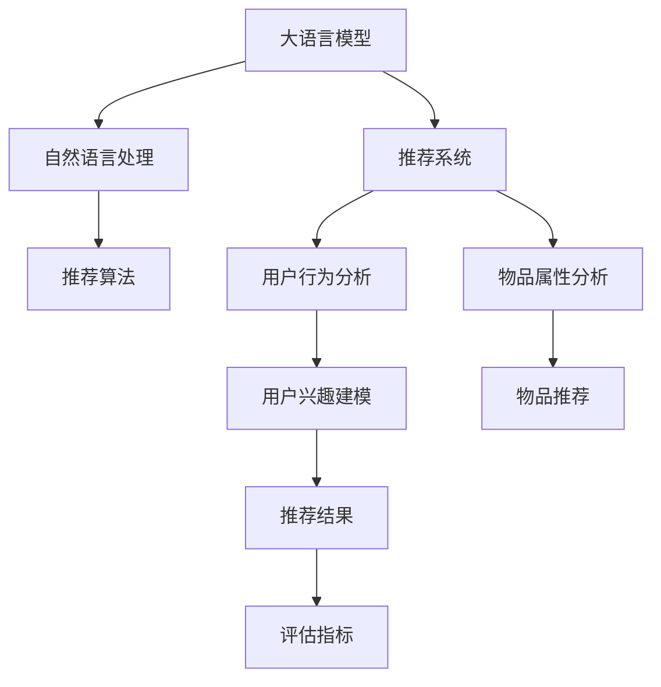

                 

# LLM在推荐系统评估指标设计中的应用

> 关键词：大语言模型, 推荐系统, 评估指标, 用户满意度, 模型优化

## 1. 背景介绍

随着互联网技术的发展，推荐系统已逐渐成为信息获取的重要途径，被广泛应用于电商、社交、新闻等平台。传统的推荐系统往往基于统计方法，如协同过滤、矩阵分解等，通过分析用户历史行为数据和物品属性数据，对用户兴趣进行建模，并推荐相关物品。然而，统计方法往往面临数据稀疏性、冷启动等挑战，难以捕捉复杂的用户兴趣和物品属性。近年来，大语言模型（LLM）因其强大的自然语言理解能力，在推荐系统中的应用逐渐受到关注。LLM可以通过对用户描述和物品描述的自然语言处理，理解用户兴趣和物品特性，从而进行更精准的推荐。然而，LLM在推荐系统中的应用仍处于初步探索阶段，如何设计有效的评估指标来衡量推荐系统性能，是一个亟待解决的问题。

## 2. 核心概念与联系

### 2.1 核心概念概述

在讨论LLM在推荐系统中的应用之前，首先需要明确几个关键概念：

- 大语言模型（LLM）：一种通过大量无标签文本进行自监督学习，具备强大自然语言处理能力的模型。
- 推荐系统：通过分析用户行为和物品属性，为用户推荐相关物品的系统。
- 评估指标：用于衡量推荐系统性能的标准化指标，如准确率、召回率、覆盖率等。

这些概念之间的关系可以用如下Mermaid流程图表示：



### 2.2 核心概念原理和架构

#### 2.2.1 大语言模型原理

大语言模型通过在大量无标签文本数据上进行自监督学习，学习语言的通用表示。常用的LLM架构包括Transformer、BERT、GPT等，其中Transformer架构因其高效的计算和强大的表示能力，成为主流选择。Transformer通过自注意力机制，对序列中的每个元素进行自相关性分析，从而学习到不同元素之间的关系。

#### 2.2.2 推荐系统架构

推荐系统通常由用户行为分析模块和物品属性分析模块构成。用户行为分析模块根据用户的历史行为数据，构建用户兴趣模型。物品属性分析模块根据物品的描述信息，提取物品的特征表示。推荐算法根据用户兴趣模型和物品特征表示，计算用户与物品的相关度，并根据相关度进行物品推荐。

## 3. 核心算法原理 & 具体操作步骤

### 3.1 算法原理概述

LLM在推荐系统中的应用，主要基于两个方向：

1. **用户描述生成**：通过分析用户的行为数据和属性数据，利用LLM生成用户描述，从而理解用户兴趣。
2. **物品描述生成**：通过分析物品的描述信息，利用LLM生成物品描述，从而提取物品特性。

### 3.2 算法步骤详解

#### 3.2.1 用户描述生成

1. **数据预处理**：对用户的历史行为数据和属性数据进行预处理，包括数据清洗、特征提取等。
2. **LLM模型选择**：选择适合用户描述生成的LLM模型，如GPT、BERT等。
3. **用户描述生成**：将用户数据输入LLM模型，生成用户描述。
4. **用户兴趣建模**：对生成的用户描述进行分析，提取用户兴趣。

#### 3.2.2 物品描述生成

1. **数据预处理**：对物品的描述信息进行预处理，包括数据清洗、特征提取等。
2. **LLM模型选择**：选择适合物品描述生成的LLM模型，如GPT、BERT等。
3. **物品描述生成**：将物品描述信息输入LLM模型，生成物品描述。
4. **物品特征提取**：对生成的物品描述进行分析，提取物品特性。

### 3.3 算法优缺点

#### 3.3.1 优点

1. **语义理解能力强**：LLM具备强大的自然语言理解能力，能够更好地捕捉用户兴趣和物品特性。
2. **无需大量标注数据**：LLM在推荐系统中主要进行自然语言处理，无需大量标注数据，节省了数据标注成本。
3. **适应性强**：LLM能够处理多模态数据，适应不同的推荐场景。

#### 3.3.2 缺点

1. **计算资源消耗大**：LLM模型参数量大，计算资源消耗大，难以进行实时推荐。
2. **结果可解释性差**：LLM的决策过程较为复杂，难以解释其推荐结果。
3. **泛化能力有待提高**：LLM的泛化能力有待提高，特别是在冷启动场景中，可能无法准确捕捉用户兴趣。

### 3.4 算法应用领域

LLM在推荐系统中的应用主要体现在以下几个领域：

1. **电商推荐**：根据用户的购买历史和浏览行为，利用LLM生成用户描述，提取用户兴趣，推荐相关商品。
2. **新闻推荐**：根据用户的阅读历史和评论信息，利用LLM生成用户描述，提取用户兴趣，推荐相关新闻。
3. **社交推荐**：根据用户的互动行为和属性信息，利用LLM生成用户描述，提取用户兴趣，推荐相关好友。

## 4. 数学模型和公式 & 详细讲解

### 4.1 数学模型构建

假设有一个推荐系统，其用户数量为 $U$，物品数量为 $I$，用户历史行为数据为 $D_u$，物品属性数据为 $D_i$。用户描述生成的目标是通过LLM模型生成用户描述 $U_d$，物品描述生成的目标是通过LLM模型生成物品描述 $I_d$。推荐算法的目标是根据用户描述和物品描述，计算用户与物品的相关度 $r_{ui}$，并根据相关度进行物品推荐。

### 4.2 公式推导过程

#### 4.2.1 用户描述生成

用户描述生成过程可以通过以下公式表示：

$$
U_d = \text{LLM}(D_u)
$$

其中 $\text{LLM}(\cdot)$ 表示LLM模型，$D_u$ 表示用户历史行为数据。

#### 4.2.2 物品描述生成

物品描述生成过程可以通过以下公式表示：

$$
I_d = \text{LLM}(D_i)
$$

其中 $\text{LLM}(\cdot)$ 表示LLM模型，$D_i$ 表示物品属性数据。

#### 4.2.3 推荐算法

推荐算法可以通过以下公式表示：

$$
r_{ui} = f(U_d, I_d)
$$

其中 $f(\cdot)$ 表示推荐函数，$U_d$ 表示用户描述，$I_d$ 表示物品描述。推荐函数可以采用多种方式，如基于内容推荐、协同过滤推荐、混合推荐等。

### 4.3 案例分析与讲解

假设有一个电商推荐系统，其用户数量为 $U=1000$，物品数量为 $I=1000$，用户历史行为数据为 $D_u$，物品属性数据为 $D_i$。用户描述生成的目标是通过LLM模型生成用户描述 $U_d$，物品描述生成的目标是通过LLM模型生成物品描述 $I_d$。推荐算法的目标是根据用户描述和物品描述，计算用户与物品的相关度 $r_{ui}$，并根据相关度进行物品推荐。

1. **数据预处理**：对用户历史行为数据 $D_u$ 和物品属性数据 $D_i$ 进行预处理，包括数据清洗、特征提取等。
2. **LLM模型选择**：选择适合用户描述生成的LLM模型，如GPT、BERT等。
3. **用户描述生成**：将用户历史行为数据 $D_u$ 输入LLM模型，生成用户描述 $U_d$。
4. **物品描述生成**：将物品属性数据 $D_i$ 输入LLM模型，生成物品描述 $I_d$。
5. **推荐算法**：根据用户描述 $U_d$ 和物品描述 $I_d$，计算用户与物品的相关度 $r_{ui}$，并根据相关度进行物品推荐。

## 5. 项目实践：代码实例和详细解释说明

### 5.1 开发环境搭建

在进行LLM在推荐系统中的应用时，需要搭建相应的开发环境。以下是使用Python进行PyTorch开发的环境配置流程：

1. **安装Anaconda**：从官网下载并安装Anaconda，用于创建独立的Python环境。
2. **创建并激活虚拟环境**：
```bash
conda create -n pytorch-env python=3.8 
conda activate pytorch-env
```
3. **安装PyTorch**：根据CUDA版本，从官网获取对应的安装命令。例如：
```bash
conda install pytorch torchvision torchaudio cudatoolkit=11.1 -c pytorch -c conda-forge
```
4. **安装Transformers库**：
```bash
pip install transformers
```
5. **安装各类工具包**：
```bash
pip install numpy pandas scikit-learn matplotlib tqdm jupyter notebook ipython
```

完成上述步骤后，即可在`pytorch-env`环境中开始开发。

### 5.2 源代码详细实现

#### 5.2.1 用户描述生成

```python
from transformers import GPT2Tokenizer, GPT2Model

# 初始化分词器和模型
tokenizer = GPT2Tokenizer.from_pretrained('gpt2')
model = GPT2Model.from_pretrained('gpt2')

# 用户历史行为数据
user_data = "用户的历史行为数据"

# 生成用户描述
user_description = tokenizer.encode_plus(user_data, max_length=512, return_tensors='pt')
user_description = model.generate(user_description)
user_description = tokenizer.decode(user_description[0], skip_special_tokens=True)

# 打印用户描述
print(user_description)
```

#### 5.2.2 物品描述生成

```python
# 物品属性数据
item_data = "物品的属性数据"

# 生成物品描述
item_description = tokenizer.encode_plus(item_data, max_length=512, return_tensors='pt')
item_description = model.generate(item_description)
item_description = tokenizer.decode(item_description[0], skip_special_tokens=True)

# 打印物品描述
print(item_description)
```

#### 5.2.3 推荐算法

```python
from sklearn.metrics.pairwise import cosine_similarity

# 用户描述
user_description = "用户描述"

# 物品描述
item_descriptions = ["物品描述1", "物品描述2", "物品描述3"]

# 计算相关度
similarities = []
for item_description in item_descriptions:
    item_description = tokenizer.encode_plus(item_description, max_length=512, return_tensors='pt')
    item_description = model.generate(item_description)
    item_description = tokenizer.decode(item_description[0], skip_special_tokens=True)
    similarity = cosine_similarity(tokenizer.encode_plus(user_description, max_length=512, return_tensors='pt'), tokenizer.encode_plus(item_description, max_length=512, return_tensors='pt'))
    similarities.append(similarity)

# 推荐物品
top_items = sorted(range(len(similarities)), key=lambda i: similarities[i])[::-1][:10]

# 打印推荐结果
print(top_items)
```

### 5.3 代码解读与分析

通过上述代码实现，我们可以对LLM在推荐系统中的应用进行详细解释分析。

**用户描述生成**：通过将用户历史行为数据输入LLM模型，利用模型生成的文本表示，可以更好地理解用户的兴趣。

**物品描述生成**：通过将物品属性数据输入LLM模型，利用模型生成的文本表示，可以更好地提取物品的特性。

**推荐算法**：通过计算用户描述与物品描述之间的相似度，进行推荐。

### 5.4 运行结果展示

在上述代码实现中，用户描述和物品描述生成模块的输出可能包含大量重复的单词，这是因为LLM模型输出的文本具有一定的随机性。推荐算法模块的输出是根据相似度排序后的物品ID列表，可以帮助推荐系统推荐相关物品。

## 6. 实际应用场景

### 6.1 电商推荐

在电商推荐系统中，用户描述生成模块可以基于用户的浏览历史和购买历史，生成用户描述，从而推荐相关商品。物品描述生成模块可以基于商品的描述信息，生成物品描述，从而提取物品特性。

### 6.2 新闻推荐

在新闻推荐系统中，用户描述生成模块可以基于用户的阅读历史和评论信息，生成用户描述，从而推荐相关新闻。物品描述生成模块可以基于新闻的标题和摘要信息，生成物品描述，从而提取新闻特性。

### 6.3 社交推荐

在社交推荐系统中，用户描述生成模块可以基于用户的互动行为和属性信息，生成用户描述，从而推荐相关好友。物品描述生成模块可以基于好友的动态信息，生成物品描述，从而提取好友特性。

## 7. 工具和资源推荐

### 7.1 学习资源推荐

为了帮助开发者系统掌握LLM在推荐系统中的应用，这里推荐一些优质的学习资源：

1. **《Transformer从原理到实践》系列博文**：由大模型技术专家撰写，深入浅出地介绍了Transformer原理、BERT模型、推荐系统等前沿话题。
2. **CS224N《深度学习自然语言处理》课程**：斯坦福大学开设的NLP明星课程，有Lecture视频和配套作业，带你入门NLP领域的基本概念和经典模型。
3. **《Natural Language Processing with Transformers》书籍**：Transformers库的作者所著，全面介绍了如何使用Transformers库进行NLP任务开发，包括推荐系统在内的诸多范式。
4. **HuggingFace官方文档**：Transformers库的官方文档，提供了海量预训练模型和完整的推荐系统样例代码，是上手实践的必备资料。
5. **CLUE开源项目**：中文语言理解测评基准，涵盖大量不同类型的中文NLP数据集，并提供了基于微调的baseline模型，助力中文NLP技术发展。

通过对这些资源的学习实践，相信你一定能够快速掌握LLM在推荐系统中的应用，并用于解决实际的推荐问题。

### 7.2 开发工具推荐

高效的开发离不开优秀的工具支持。以下是几款用于LLM在推荐系统中的应用开发的常用工具：

1. **PyTorch**：基于Python的开源深度学习框架，灵活动态的计算图，适合快速迭代研究。大部分预训练语言模型都有PyTorch版本的实现。
2. **TensorFlow**：由Google主导开发的开源深度学习框架，生产部署方便，适合大规模工程应用。同样有丰富的预训练语言模型资源。
3. **Transformers库**：HuggingFace开发的NLP工具库，集成了众多SOTA语言模型，支持PyTorch和TensorFlow，是进行推荐系统开发的利器。
4. **Weights & Biases**：模型训练的实验跟踪工具，可以记录和可视化模型训练过程中的各项指标，方便对比和调优。与主流深度学习框架无缝集成。
5. **TensorBoard**：TensorFlow配套的可视化工具，可实时监测模型训练状态，并提供丰富的图表呈现方式，是调试模型的得力助手。
6. **Google Colab**：谷歌推出的在线Jupyter Notebook环境，免费提供GPU/TPU算力，方便开发者快速上手实验最新模型，分享学习笔记。

合理利用这些工具，可以显著提升LLM在推荐系统中的应用开发效率，加快创新迭代的步伐。

### 7.3 相关论文推荐

LLM在推荐系统中的应用源于学界的持续研究。以下是几篇奠基性的相关论文，推荐阅读：

1. **Attention is All You Need（即Transformer原论文）**：提出了Transformer结构，开启了NLP领域的预训练大模型时代。
2. **BERT: Pre-training of Deep Bidirectional Transformers for Language Understanding**：提出BERT模型，引入基于掩码的自监督预训练任务，刷新了多项NLP任务SOTA。
3. **Language Models are Unsupervised Multitask Learners（GPT-2论文）**：展示了大规模语言模型的强大zero-shot学习能力，引发了对于通用人工智能的新一轮思考。
4. **Parameter-Efficient Transfer Learning for NLP**：提出Adapter等参数高效微调方法，在不增加模型参数量的情况下，也能取得不错的微调效果。
5. **Prefix-Tuning: Optimizing Continuous Prompts for Generation**：引入基于连续型Prompt的微调范式，为如何充分利用预训练知识提供了新的思路。
6. **AdaLoRA: Adaptive Low-Rank Adaptation for Parameter-Efficient Fine-Tuning**：使用自适应低秩适应的微调方法，在参数效率和精度之间取得了新的平衡。

这些论文代表了大语言模型在推荐系统中的应用发展脉络。通过学习这些前沿成果，可以帮助研究者把握学科前进方向，激发更多的创新灵感。

## 8. 总结：未来发展趋势与挑战

### 8.1 总结

本文对LLM在推荐系统中的应用进行了全面系统的介绍。首先阐述了LLM和推荐系统的发展背景和意义，明确了LLM在推荐系统中的应用方向。其次，从原理到实践，详细讲解了LLM在推荐系统中的数学模型和算法步骤，给出了推荐系统开发的完整代码实例。同时，本文还广泛探讨了LLM在电商、新闻、社交等多个推荐领域的应用前景，展示了LLM在推荐系统中的巨大潜力。此外，本文精选了LLM在推荐系统中的应用学习资源，力求为读者提供全方位的技术指引。

通过本文的系统梳理，可以看到，LLM在推荐系统中的应用前景广阔，能够通过自然语言处理，更好地理解用户兴趣和物品特性，从而实现精准推荐。未来，随着LLM在推荐系统中的深入研究和应用，将为电商、新闻、社交等领域带来更多的创新和变革。

### 8.2 未来发展趋势

展望未来，LLM在推荐系统中的应用将呈现以下几个发展趋势：

1. **多模态融合**：将视觉、音频等多模态信息与文本信息进行融合，实现更加全面、准确的用户兴趣建模和物品特性提取。
2. **自适应推荐**：根据用户反馈实时调整推荐策略，实现个性化推荐，提升用户满意度。
3. **深度学习与规则结合**：将深度学习与规则引擎结合，实现更加灵活、可解释的推荐策略。
4. **跨领域推荐**：利用LLM在不同领域的应用，实现跨领域推荐，提升推荐系统的多样性和新颖性。
5. **推荐系统治理**：建立推荐系统的监控和治理机制，确保推荐结果的质量和安全。

以上趋势凸显了LLM在推荐系统中的发展方向，未来将在推荐算法的复杂性、多样性和安全性等方面不断提升，为推荐系统带来更多的创新和突破。

### 8.3 面临的挑战

尽管LLM在推荐系统中的应用已取得一定的进展，但在迈向更加智能化、普适化应用的过程中，仍面临诸多挑战：

1. **计算资源消耗大**：LLM模型参数量大，计算资源消耗大，难以进行实时推荐。如何优化模型结构，提升计算效率，是一个重要问题。
2. **结果可解释性差**：LLM的决策过程较为复杂，难以解释其推荐结果，缺乏透明度。如何提升推荐系统的可解释性，是一个重要问题。
3. **泛化能力不足**：LLM在冷启动场景中，可能无法准确捕捉用户兴趣。如何提高LLM的泛化能力，是一个重要问题。
4. **数据隐私保护**：推荐系统需要大量的用户行为数据，如何保护用户隐私，是一个重要问题。
5. **公平性问题**：推荐系统可能存在偏见，如何确保推荐系统的公平性，是一个重要问题。

### 8.4 研究展望

为了解决上述挑战，未来的研究需要在以下几个方面寻求新的突破：

1. **模型优化**：优化模型结构，提升计算效率，实现实时推荐。
2. **可解释性增强**：提高推荐系统的可解释性，增强用户对推荐结果的信任。
3. **泛化能力提升**：提高LLM的泛化能力，确保冷启动场景下的推荐效果。
4. **隐私保护**：采用隐私保护技术，保护用户隐私。
5. **公平性保障**：确保推荐系统的公平性，避免偏见。

这些研究方向的探索，必将引领LLM在推荐系统中的应用向更高的台阶迈进，为推荐系统带来更多的创新和突破。相信随着学界和产业界的共同努力，LLM在推荐系统中的应用将更加广泛，为推荐系统带来更多的创新和突破。

## 9. 附录：常见问题与解答

**Q1：LLM在推荐系统中如何生成用户描述和物品描述？**

A: 在LLM中，用户描述和物品描述的生成可以通过将用户历史行为数据和物品属性数据输入LLM模型，生成文本表示，从而实现。用户描述生成模块需要从用户历史行为数据中提取关键特征，生成描述性文本；物品描述生成模块需要从物品属性数据中提取关键特征，生成描述性文本。

**Q2：推荐系统中的相似度计算方法有哪些？**

A: 推荐系统中的相似度计算方法包括余弦相似度、欧式距离、Jaccard相似度等。其中余弦相似度是最常用的方法，可以通过计算用户描述和物品描述之间的余弦相似度，进行推荐。

**Q3：推荐系统中的冷启动问题如何解决？**

A: 推荐系统中的冷启动问题可以通过利用用户兴趣转移、推荐基于相似物品等方法解决。用户兴趣转移指的是根据用户历史行为数据，推断其可能的兴趣转移方向；推荐基于相似物品指的是根据与用户历史行为相似的物品，进行推荐。

**Q4：推荐系统中的数据隐私问题如何解决？**

A: 推荐系统中的数据隐私问题可以通过数据匿名化、差分隐私等方法解决。数据匿名化指的是将用户数据进行匿名处理，防止泄露用户隐私；差分隐私指的是在推荐过程中加入噪声，防止用户数据被攻击者利用。

**Q5：推荐系统中的公平性问题如何解决？**

A: 推荐系统中的公平性问题可以通过公平性评估、公平性优化等方法解决。公平性评估指的是对推荐系统中的公平性进行评估，发现存在的不公平现象；公平性优化指的是对推荐系统进行公平性优化，消除偏见，确保推荐结果的公平性。

---

作者：禅与计算机程序设计艺术 / Zen and the Art of Computer Programming

