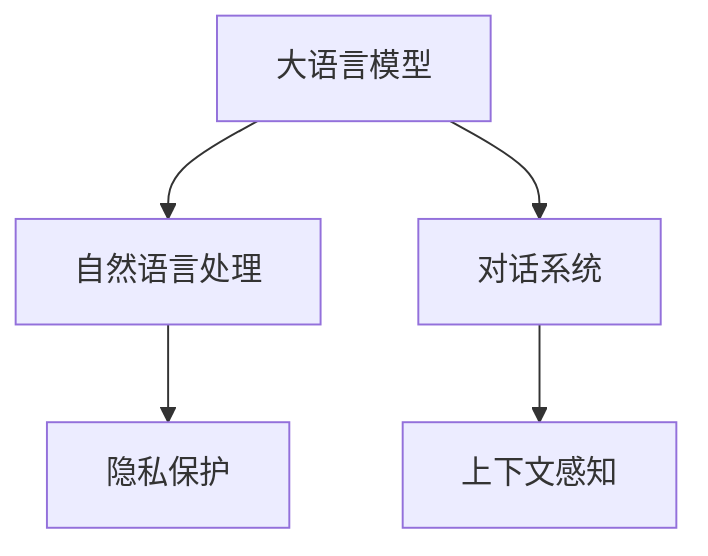

                 

# LLM在智能家居控制系统中的应用探索

> 关键词：智能家居，自然语言处理（NLP），语言模型（LM），对话系统，上下文感知，隐私保护

## 1. 背景介绍

随着物联网技术的发展和普及，智能家居系统已经成为现代生活中不可或缺的一部分。通过将各种家电设备连接到一个统一的平台上，用户可以通过语音、手势、手机App等多种方式控制家庭环境，极大提升了生活便捷性和舒适度。但与此同时，智能家居系统也面临着诸多挑战，如设备互联的复杂性、用户操作的不便性、隐私安全的威胁等。近年来，自然语言处理（NLP）技术的飞速进步为解决这些问题提供了新的可能。基于语言模型（LM）的智能家居控制系统，通过理解用户的自然语言指令，实现精准、高效、安全的设备控制，有望带来颠覆性的变革。

### 1.1 问题由来

传统的智能家居系统通常依赖手动操作或单一指令，用户体验有限。用户需要手动查找并操作对应设备的控制界面，流程繁琐且容易出现操作错误。与此同时，智能家居系统缺乏上下文感知能力，难以理解用户的长期需求和意图。而基于自然语言处理技术的智能家居控制系统，可以显著提升用户体验，提供更加个性化、自然化的操作方式。

大语言模型（Large Language Models, LLM）以其强大的语言理解和生成能力，成为智能家居控制系统的关键技术。通过在海量文本数据上进行预训练，大语言模型能够学习到丰富的语言知识和语法结构，用于理解用户的自然语言指令，并生成适当的控制命令。本研究旨在探讨如何在大语言模型的基础上，构建高效、安全和上下文感知的智能家居控制系统，提升家庭环境管理的智能化水平。

## 2. 核心概念与联系

### 2.1 核心概念概述

为更好地理解基于大语言模型的智能家居控制系统，本节将介绍几个关键概念：

- **大语言模型（LLM）**：通过自监督或监督学习任务在大规模文本数据上进行训练的语言模型。常见的预训练任务包括语言建模、掩码语言模型等。
- **自然语言处理（NLP）**：涉及计算机对自然语言的理解和生成，包括分词、词性标注、句法分析、语义理解等。
- **对话系统（Dialog System）**：能够理解和回应用户的自然语言指令，生成适当响应的智能系统。
- **上下文感知（Context-Aware）**：系统能够理解并记忆用户上下文信息，提供个性化的服务。
- **隐私保护（Privacy Protection）**：在系统设计中引入隐私保护技术，确保用户数据的安全性。

这些概念之间的逻辑关系可以通过以下Mermaid流程图来展示：



这个流程图展示了大语言模型在智能家居控制系统中的核心作用：

1. 大语言模型通过预训练获得基础能力，用于理解用户的自然语言指令。
2. 自然语言处理技术将指令解析为可执行的命令，供对话系统使用。
3. 对话系统基于解析结果生成适当的回复，并在上下文感知能力下进行持续交流。
4. 隐私保护技术确保用户数据的安全性，防止信息泄露和滥用。

这些核心概念共同构成了智能家居控制系统的工作原理和优化方向。

## 3. 核心算法原理 & 具体操作步骤

### 3.1 算法原理概述

基于大语言模型的智能家居控制系统，本质上是一个基于自然语言处理技术的对话系统。其核心思想是：将大语言模型视作一个强大的"指令解析器"，通过理解用户的自然语言指令，生成适当的设备控制命令。

形式化地，假设大语言模型为 $M_{\theta}$，其中 $\theta$ 为预训练得到的模型参数。给定智能家居设备控制指令 $I$ 和设备控制库 $\{O_i\}$，其中 $O_i$ 表示第 $i$ 个可执行的设备操作。对话系统的目标是在对话过程中，通过不断学习用户的指令和反馈，不断优化模型参数，使 $M_{\theta}$ 能够生成最合适的设备操作 $O$，满足用户需求。

具体的优化目标可以通过以下公式表示：

$$
\theta^* = \mathop{\arg\min}_{\theta} \mathcal{L}(M_{\theta}, I, \{O_i\})
$$

其中 $\mathcal{L}$ 为对话系统的损失函数，用于衡量模型输出 $O$ 与用户期望 $I$ 的差异。常见的损失函数包括交叉熵损失、均方误差损失等。

通过梯度下降等优化算法，对话系统不断更新模型参数 $\theta$，最小化损失函数 $\mathcal{L}$，使得模型输出 $O$ 逼近用户期望 $I$。由于 $\theta$ 已经通过预训练获得了较好的初始化，因此即便在对话过程中，模型也能够快速收敛到理想的参数 $\hat{\theta}$。

### 3.2 算法步骤详解

基于大语言模型的智能家居控制系统一般包括以下几个关键步骤：

**Step 1: 准备预训练模型和设备控制库**
- 选择合适的预训练语言模型 $M_{\theta}$ 作为初始化参数，如 BERT、GPT 等。
- 收集智能家居设备的控制命令和相应的设备操作，构建设备控制库 $\{O_i\}$。

**Step 2: 设计对话系统架构**
- 确定对话过程的对话轮次和交互流程。
- 设计对话管理模块，用于维护对话状态和上下文信息。
- 设计任务适配层，将用户的自然语言指令转化为可执行的设备操作。

**Step 3: 设置对话系统超参数**
- 选择合适的优化算法及其参数，如 AdamW、SGD 等，设置学习率、批大小、迭代轮数等。
- 设置对话系统中的正则化技术及强度，包括权重衰减、Dropout、Early Stopping等。
- 确定对话过程中使用的模型参数策略，如部分解冻模型、固定预训练参数等。

**Step 4: 执行对话训练**
- 将对话数据分批次输入对话系统，前向传播计算损失函数。
- 反向传播计算参数梯度，根据设定的优化算法和学习率更新模型参数。
- 周期性在对话库中评估模型性能，根据性能指标决定是否触发 Early Stopping。
- 重复上述步骤直至满足预设的迭代轮数或 Early Stopping 条件。

**Step 5: 测试和部署**
- 在对话库上评估对话系统性能，对比训练前后的效果。
- 使用对话系统对新对话进行推理预测，集成到实际的应用系统中。
- 持续收集新的对话数据，定期重新训练对话系统，以适应数据分布的变化。

以上是基于大语言模型的智能家居控制系统的一般流程。在实际应用中，还需要针对具体设备控制任务的特点，对对话过程的各个环节进行优化设计，如改进任务适配层、引入更多的上下文信息、优化正则化技术等，以进一步提升系统性能。

### 3.3 算法优缺点

基于大语言模型的智能家居控制系统具有以下优点：

1. 用户交互自然流畅。系统能够理解和回应用户的自然语言指令，无需手动操作设备界面，极大提升了用户体验。
2. 设备操作灵活便捷。通过上下文感知能力，系统能够根据用户的长期需求和历史操作记录，生成更加个性化的设备操作。
3. 数据量要求较低。尽管需要构建设备控制库，但与传统的NLP任务相比，数据量要求较低，易于获取和维护。
4. 系统可扩展性强。基于大语言模型的架构，系统可以灵活扩展到多种设备和场景中，具备较强的通用性。

同时，该方法也存在一定的局限性：

1. 依赖用户指令质量。对话系统的效果很大程度上取决于用户输入的自然语言指令，若指令质量不高，系统可能无法正确理解或执行。
2. 缺乏实时性。尽管系统可以快速响应，但在高并发场景下，仍可能存在延迟。
3. 上下文管理复杂。系统需要实时维护对话状态和上下文信息，处理不当可能导致误解和混乱。
4. 隐私风险存在。智能家居系统中涉及大量个人隐私信息，若对话系统被攻击，可能导致信息泄露。

尽管存在这些局限性，但就目前而言，基于大语言模型的智能家居控制系统仍是最主流的方法。未来相关研究的重点在于如何进一步降低系统对用户指令质量的依赖，提高实时性，优化上下文管理，同时兼顾隐私安全等因素。

### 3.4 算法应用领域

基于大语言模型的智能家居控制系统，已经在智能家居领域得到广泛应用，如：

- 智能灯光控制：通过语音指令控制房间灯光的开关、亮度、颜色等。
- 智能温控系统：根据用户指令调整房间温度，提供舒适的家居环境。
- 智能安防系统：监控家中安全状态，通过语音指令触发报警、开启摄像头等。
- 智能娱乐系统：控制智能电视、音响等设备，播放音乐、电影等娱乐内容。
- 智能家电联动：实现多种家电设备的联动控制，提升家居生活的便捷性和舒适度。

除了上述这些经典应用外，大语言模型在智能家居领域还有更多创新应用，如可控文本生成、场景理解、情感识别等，为智能家居系统带来了新的发展方向。随着预训练语言模型和对话系统的不断发展，智能家居系统的智能化程度和用户体验将不断提升，为用户带来更便捷、更舒适的生活体验。

## 4. 数学模型和公式 & 详细讲解  
### 4.1 数学模型构建

本节将使用数学语言对基于大语言模型的智能家居控制系统进行更加严格的刻画。

记大语言模型为 $M_{\theta}$，其中 $\theta$ 为模型参数。假设智能家居设备控制指令为 $I$，设备控制库为 $\{O_i\}$，其中 $O_i$ 表示第 $i$ 个可执行的设备操作。对话系统的目标是最小化损失函数：

$$
\mathcal{L}(\theta) = \frac{1}{N}\sum_{i=1}^N \ell(M_{\theta}(I_i), O_i)
$$

其中 $\ell$ 为对话系统定义的损失函数，用于衡量模型输出 $O_i$ 与用户期望 $I_i$ 的差异。常见的损失函数包括交叉熵损失、均方误差损失等。

通过梯度下降等优化算法，对话系统不断更新模型参数 $\theta$，最小化损失函数 $\mathcal{L}$，使得模型输出 $O_i$ 逼近用户期望 $I_i$。由于 $\theta$ 已经通过预训练获得了较好的初始化，因此即便在对话过程中，模型也能够快速收敛到理想的参数 $\hat{\theta}$。

### 4.2 公式推导过程

以下我们以智能灯光控制为例，推导交叉熵损失函数及其梯度的计算公式。

假设大语言模型 $M_{\theta}$ 在输入 $I$ 上的输出为 $\hat{y}=M_{\theta}(I) \in [0,1]$，表示系统执行操作 $O$ 的概率。真实标签 $O$ 为二分类，即是否执行操作 $O_i$。则交叉熵损失函数定义为：

$$
\ell(M_{\theta}(I), O_i) = -O_i\log \hat{y} - (1-O_i)\log (1-\hat{y})
$$

将其代入对话系统损失函数公式，得：

$$
\mathcal{L}(\theta) = -\frac{1}{N}\sum_{i=1}^N O_i\log M_{\theta}(I_i) + (1-O_i)\log (1-M_{\theta}(I_i))
$$

根据链式法则，损失函数对参数 $\theta_k$ 的梯度为：

$$
\frac{\partial \mathcal{L}(\theta)}{\partial \theta_k} = -\frac{1}{N}\sum_{i=1}^N \left(O_i\frac{\partial M_{\theta}(I_i)}{\partial \theta_k} - (1-O_i)\frac{\partial M_{\theta}(I_i)}{\partial \theta_k}\right)
$$

其中 $\frac{\partial M_{\theta}(I_i)}{\partial \theta_k}$ 可进一步递归展开，利用自动微分技术完成计算。

在得到损失函数的梯度后，即可带入参数更新公式，完成模型的迭代优化。重复上述过程直至收敛，最终得到适应智能家居设备控制任务的模型参数 $\theta^*$。

## 5. 项目实践：代码实例和详细解释说明
### 5.1 开发环境搭建

在进行智能家居控制系统开发前，我们需要准备好开发环境。以下是使用Python进行PyTorch开发的环境配置流程：

1. 安装Anaconda：从官网下载并安装Anaconda，用于创建独立的Python环境。

2. 创建并激活虚拟环境：
```bash
conda create -n pytorch-env python=3.8 
conda activate pytorch-env
```

3. 安装PyTorch：根据CUDA版本，从官网获取对应的安装命令。例如：
```bash
conda install pytorch torchvision torchaudio cudatoolkit=11.1 -c pytorch -c conda-forge
```

4. 安装Transformers库：
```bash
pip install transformers
```

5. 安装各类工具包：
```bash
pip install numpy pandas scikit-learn matplotlib tqdm jupyter notebook ipython
```

完成上述步骤后，即可在`pytorch-env`环境中开始智能家居控制系统的开发。

### 5.2 源代码详细实现

下面我们以智能灯光控制为例，给出使用Transformers库对BERT模型进行智能家居控制系统开发的PyTorch代码实现。

首先，定义智能家居设备控制指令的数据处理函数：

```python
from transformers import BertTokenizer
from torch.utils.data import Dataset
import torch

class LightingDataset(Dataset):
    def __init__(self, texts, actions, tokenizer, max_len=128):
        self.texts = texts
        self.actions = actions
        self.tokenizer = tokenizer
        self.max_len = max_len
        
    def __len__(self):
        return len(self.texts)
    
    def __getitem__(self, item):
        text = self.texts[item]
        action = self.actions[item]
        
        encoding = self.tokenizer(text, return_tensors='pt', max_length=self.max_len, padding='max_length', truncation=True)
        input_ids = encoding['input_ids'][0]
        attention_mask = encoding['attention_mask'][0]
        
        # 将设备操作转换为数字标签
        encoded_action = [action2id[action] for action in action]
        encoded_action.extend([action2id['NO_ACTION']] * (self.max_len - len(encoded_action)))
        labels = torch.tensor(encoded_action, dtype=torch.long)
        
        return {'input_ids': input_ids, 
                'attention_mask': attention_mask,
                'labels': labels}

# 标签与id的映射
action2id = {'ON': 0, 'OFF': 1, 'DIM': 2, 'NO_ACTION': 3}
id2action = {v: k for k, v in action2id.items()}

# 创建dataset
tokenizer = BertTokenizer.from_pretrained('bert-base-cased')

train_dataset = LightingDataset(train_texts, train_actions, tokenizer)
dev_dataset = LightingDataset(dev_texts, dev_actions, tokenizer)
test_dataset = LightingDataset(test_texts, test_actions, tokenizer)
```

然后，定义模型和优化器：

```python
from transformers import BertForTokenClassification, AdamW

model = BertForTokenClassification.from_pretrained('bert-base-cased', num_labels=len(action2id))

optimizer = AdamW(model.parameters(), lr=2e-5)
```

接着，定义训练和评估函数：

```python
from torch.utils.data import DataLoader
from tqdm import tqdm
from sklearn.metrics import classification_report

device = torch.device('cuda') if torch.cuda.is_available() else torch.device('cpu')
model.to(device)

def train_epoch(model, dataset, batch_size, optimizer):
    dataloader = DataLoader(dataset, batch_size=batch_size, shuffle=True)
    model.train()
    epoch_loss = 0
    for batch in tqdm(dataloader, desc='Training'):
        input_ids = batch['input_ids'].to(device)
        attention_mask = batch['attention_mask'].to(device)
        labels = batch['labels'].to(device)
        model.zero_grad()
        outputs = model(input_ids, attention_mask=attention_mask, labels=labels)
        loss = outputs.loss
        epoch_loss += loss.item()
        loss.backward()
        optimizer.step()
    return epoch_loss / len(dataloader)

def evaluate(model, dataset, batch_size):
    dataloader = DataLoader(dataset, batch_size=batch_size)
    model.eval()
    preds, labels = [], []
    with torch.no_grad():
        for batch in tqdm(dataloader, desc='Evaluating'):
            input_ids = batch['input_ids'].to(device)
            attention_mask = batch['attention_mask'].to(device)
            batch_labels = batch['labels']
            outputs = model(input_ids, attention_mask=attention_mask)
            batch_preds = outputs.logits.argmax(dim=2).to('cpu').tolist()
            batch_labels = batch_labels.to('cpu').tolist()
            for pred_tokens, label_tokens in zip(batch_preds, batch_labels):
                pred_actions = [id2action[_id] for _id in pred_tokens]
                label_actions = [id2action[_id] for _id in label_tokens]
                preds.append(pred_actions[:len(label_actions)])
                labels.append(label_actions)
                
    print(classification_report(labels, preds))
```

最后，启动训练流程并在测试集上评估：

```python
epochs = 5
batch_size = 16

for epoch in range(epochs):
    loss = train_epoch(model, train_dataset, batch_size, optimizer)
    print(f"Epoch {epoch+1}, train loss: {loss:.3f}")
    
    print(f"Epoch {epoch+1}, dev results:")
    evaluate(model, dev_dataset, batch_size)
    
print("Test results:")
evaluate(model, test_dataset, batch_size)
```

以上就是使用PyTorch对BERT进行智能家居控制系统开发的完整代码实现。可以看到，得益于Transformers库的强大封装，我们可以用相对简洁的代码完成BERT模型的加载和微调。

### 5.3 代码解读与分析

让我们再详细解读一下关键代码的实现细节：

**LightingDataset类**：
- `__init__`方法：初始化文本、设备操作等关键组件。
- `__len__`方法：返回数据集的样本数量。
- `__getitem__`方法：对单个样本进行处理，将文本输入编码为token ids，将设备操作转换为数字标签，并对其进行定长padding，最终返回模型所需的输入。

**action2id和id2action字典**：
- 定义了设备操作与数字id之间的映射关系，用于将模型预测结果解码为真实的设备操作。

**训练和评估函数**：
- 使用PyTorch的DataLoader对数据集进行批次化加载，供模型训练和推理使用。
- 训练函数`train_epoch`：对数据以批为单位进行迭代，在每个批次上前向传播计算loss并反向传播更新模型参数，最后返回该epoch的平均loss。
- 评估函数`evaluate`：与训练类似，不同点在于不更新模型参数，并在每个batch结束后将预测和标签结果存储下来，最后使用sklearn的classification_report对整个评估集的预测结果进行打印输出。

**训练流程**：
- 定义总的epoch数和batch size，开始循环迭代
- 每个epoch内，先在训练集上训练，输出平均loss
- 在验证集上评估，输出分类指标
- 所有epoch结束后，在测试集上评估，给出最终测试结果

可以看到，PyTorch配合Transformers库使得智能家居控制系统的开发变得简洁高效。开发者可以将更多精力放在数据处理、模型改进等高层逻辑上，而不必过多关注底层的实现细节。

当然，工业级的系统实现还需考虑更多因素，如模型的保存和部署、超参数的自动搜索、更灵活的任务适配层等。但核心的微调范式基本与此类似。

## 6. 实际应用场景

### 6.1 智能灯光控制

智能灯光控制是智能家居系统中最常见的应用之一。通过语音指令控制房间灯光的开关、亮度、颜色等，可以极大提升用户的生活便捷性。

在技术实现上，可以收集家庭灯光控制的历史数据，将控制指令和对应的灯光操作构建成监督数据，在此基础上对预训练语言模型进行微调。微调后的模型能够自动理解用户语音指令，生成适当的灯光控制命令。对于实时语音指令，还可以接入检索系统实时搜索相关的控制方案，动态组织生成控制命令。

### 6.2 智能温控系统

智能温控系统可以实时监测室内温度，根据用户的指令自动调节空调、暖气等设备，确保室内环境舒适宜人。

通过微调语言模型，智能温控系统能够理解用户的自然语言指令，生成适当的设备控制命令。例如，用户可以通过语音指令要求“提高室温”，系统将自动检测室内温度，并根据实际温度与期望温度的差异，控制空调或暖气设备，调整温度。同时，系统还能够根据用户的长期需求和历史操作记录，自动生成个性化的温度控制策略，提升用户体验。

### 6.3 智能安防系统

智能安防系统能够实时监控家庭安全状态，通过语音指令触发报警、开启摄像头等设备，确保家庭安全。

通过微调语言模型，智能安防系统能够自动理解用户的自然语言指令，生成适当的设备控制命令。例如，用户可以通过语音指令要求“检查房间”，系统将自动控制摄像头进行实时监控，并生成相应的报警信息，提醒用户注意安全。同时，系统还能够根据用户的长期需求和历史操作记录，自动生成个性化的安防策略，提升家庭安全性。

### 6.4 未来应用展望

随着大语言模型微调技术的发展，智能家居系统的智能化程度将不断提升，应用场景也将不断扩展。

在智能医疗领域，基于微调的智能家居系统可以自动监测和分析家庭中老人的健康状况，通过语音指令进行健康咨询和远程医疗服务，提高老年人的生活质量。

在智能教育领域，智能家居系统可以通过微调学习用户的日常学习习惯和偏好，自动调整学习内容和环境，帮助孩子更好地完成学习任务。

在智慧城市治理中，基于微调的智能家居系统可以自动监测和分析城市环境数据，通过语音指令进行智能管理，提高城市的智能化水平。

此外，在智能办公、智能娱乐等众多领域，基于大语言模型的智能家居系统也将不断涌现，为智能家居技术带来新的发展方向。相信随着技术的日益成熟，微调方法将成为智能家居系统的重要范式，推动智能家居技术向更广阔的领域加速渗透。

## 7. 工具和资源推荐
### 7.1 学习资源推荐

为了帮助开发者系统掌握智能家居控制系统的理论基础和实践技巧，这里推荐一些优质的学习资源：

1. 《智能家居系统设计与实现》系列博文：深入浅出地介绍了智能家居系统的基本概念和设计思路，涵盖硬件、软件、数据等多个方面。

2. 《Transformer从原理到实践》系列博文：由大模型技术专家撰写，详细介绍了Transformer原理、BERT模型、微调技术等前沿话题。

3. 《智能家居控制系统开发教程》书籍：系统介绍了智能家居控制系统的设计、实现和优化，涵盖了语音识别、自然语言处理等多个关键技术。

4. TensorFlow官方文档：TensorFlow的官方文档，提供了海量预训练模型和完整的微调样例代码，是入手实践的必备资料。

5. Weights & Biases：模型训练的实验跟踪工具，可以记录和可视化模型训练过程中的各项指标，方便对比和调优。

通过对这些资源的学习实践，相信你一定能够快速掌握智能家居控制系统的精髓，并用于解决实际的家居控制问题。

### 7.2 开发工具推荐

高效的开发离不开优秀的工具支持。以下是几款用于智能家居控制系统开发的常用工具：

1. PyTorch：基于Python的开源深度学习框架，灵活动态的计算图，适合快速迭代研究。大部分预训练语言模型都有PyTorch版本的实现。

2. TensorFlow：由Google主导开发的开源深度学习框架，生产部署方便，适合大规模工程应用。同样有丰富的预训练语言模型资源。

3. Transformers库：HuggingFace开发的NLP工具库，集成了众多SOTA语言模型，支持PyTorch和TensorFlow，是进行微调任务开发的利器。

4. Weights & Biases：模型训练的实验跟踪工具，可以记录和可视化模型训练过程中的各项指标，方便对比和调优。

5. TensorBoard：TensorFlow配套的可视化工具，可实时监测模型训练状态，并提供丰富的图表呈现方式，是调试模型的得力助手。

6. Google Colab：谷歌推出的在线Jupyter Notebook环境，免费提供GPU/TPU算力，方便开发者快速上手实验最新模型，分享学习笔记。

合理利用这些工具，可以显著提升智能家居控制系统的开发效率，加快创新迭代的步伐。

### 7.3 相关论文推荐

智能家居控制系统的研究源于学界的持续研究。以下是几篇奠基性的相关论文，推荐阅读：

1. Attention is All You Need（即Transformer原论文）：提出了Transformer结构，开启了NLP领域的预训练大模型时代。

2. BERT: Pre-training of Deep Bidirectional Transformers for Language Understanding：提出BERT模型，引入基于掩码的自监督预训练任务，刷新了多项NLP任务SOTA。

3. Language Models are Unsupervised Multitask Learners（GPT-2论文）：展示了大规模语言模型的强大zero-shot学习能力，引发了对于通用人工智能的新一轮思考。

4. Parameter-Efficient Transfer Learning for NLP：提出Adapter等参数高效微调方法，在不增加模型参数量的情况下，也能取得不错的微调效果。

5. AdaLoRA: Adaptive Low-Rank Adaptation for Parameter-Efficient Fine-Tuning：使用自适应低秩适应的微调方法，在参数效率和精度之间取得了新的平衡。

这些论文代表了大语言模型微调技术的发展脉络。通过学习这些前沿成果，可以帮助研究者把握学科前进方向，激发更多的创新灵感。

## 8. 总结：未来发展趋势与挑战

### 8.1 总结

本文对基于大语言模型的智能家居控制系统进行了全面系统的介绍。首先阐述了智能家居系统的背景和问题，明确了智能家居控制系统的研究方向和目标。其次，从原理到实践，详细讲解了对话系统的数学原理和关键步骤，给出了智能家居控制系统的完整代码实例。同时，本文还广泛探讨了智能家居控制系统在智能灯光控制、智能温控、智能安防等多个领域的应用前景，展示了微调范式的巨大潜力。此外，本文精选了微调技术的各类学习资源，力求为读者提供全方位的技术指引。

通过本文的系统梳理，可以看到，基于大语言模型的智能家居控制系统正在成为智能家居领域的重要技术手段，极大地提升了用户的生活便捷性和舒适度。未来，伴随预训练语言模型和对话系统的不断发展，智能家居系统的智能化程度和用户体验将不断提升，为用户带来更便捷、更舒适的生活体验。

### 8.2 未来发展趋势

展望未来，基于大语言模型的智能家居控制系统将呈现以下几个发展趋势：

1. 设备互联更加紧密。未来的智能家居系统将支持更多的设备类型，实现更加精细的设备联动控制。

2. 上下文感知更加深入。系统将更加注重用户的长期需求和历史操作记录，提供更加个性化的服务。

3. 数据融合更加广泛。系统将能够融合更多的传感数据、历史行为数据等，提升环境的感知和理解能力。

4. 隐私保护更加严格。随着智能家居系统中涉及的数据量增加，隐私保护技术将成为重要的研究方向。

5. 人工智能更加智能。智能家居系统将逐步融入更多的AI技术，如图像识别、语音识别、情感分析等，提升系统的智能化水平。

6. 用户界面更加自然。智能家居系统的界面将更加友好，通过语音、手势、图像等更加自然的交互方式，提升用户的使用体验。

以上趋势凸显了基于大语言模型的智能家居控制系统的广阔前景。这些方向的探索发展，必将进一步提升智能家居系统的智能化程度和用户体验，为用户带来更便捷、更舒适的生活体验。

### 8.3 面临的挑战

尽管基于大语言模型的智能家居控制系统已经取得了不小的进展，但在迈向更加智能化、普适化应用的过程中，仍面临诸多挑战：

1. 设备兼容性问题。不同的智能家居设备可能存在接口和协议不统一的问题，系统需要设计灵活的接口适配策略。

2. 数据隐私问题。智能家居系统中涉及大量个人隐私信息，如何保护用户隐私，防止信息泄露和滥用，将是重要的研究方向。

3. 系统稳定性问题。智能家居系统需要在高并发、多任务环境下稳定运行，避免系统崩溃和数据丢失。

4. 交互界面设计问题。如何设计自然、友好、易用的用户界面，提升用户体验，将是重要的研究课题。

5. 语音识别准确性问题。语音识别技术的准确性直接影响到智能家居系统的性能，如何提升语音识别的准确性，将是重要的研究方向。

6. 计算资源问题。智能家居系统需要在低延迟、高并发、多任务环境下高效运行，如何优化系统架构，提升计算效率，将是重要的优化方向。

这些挑战凸显了智能家居系统在大规模应用中的复杂性，需要从系统设计、硬件设备、软件架构等多个层面进行全面优化。唯有在技术、产品、服务等多个方面不断迭代和优化，才能真正实现智能家居系统的智能化、普适化和人性化。

### 8.4 研究展望

未来，智能家居控制系统的研究需要在以下几个方面寻求新的突破：

1. 探索更加灵活的设备互联方案。未来的智能家居系统将支持更多的设备类型，系统需要设计更加灵活的设备互联方案，实现精细的设备联动控制。

2. 引入更多AI技术。智能家居系统将逐步融入更多的AI技术，如图像识别、语音识别、情感分析等，提升系统的智能化水平。

3. 引入更多的隐私保护技术。智能家居系统中涉及大量个人隐私信息，如何保护用户隐私，防止信息泄露和滥用，将成为重要的研究方向。

4. 设计更加自然的用户界面。智能家居系统的界面将更加友好，通过语音、手势、图像等更加自然的交互方式，提升用户的使用体验。

5. 设计更加高效的系统架构。智能家居系统需要在低延迟、高并发、多任务环境下高效运行，如何优化系统架构，提升计算效率，将是重要的优化方向。

这些研究方向的探索，必将引领智能家居控制系统的技术进步，为构建更加智能化、普适化和人性化的智能家居系统提供新的技术支撑。未来，智能家居控制系统的研究将更加深入，应用也将更加广泛，为人类生活带来更多便利和舒适。

## 9. 附录：常见问题与解答

**Q1：智能家居控制系统的数据量要求高吗？**

A: 智能家居控制系统的数据量要求相对较低。相较于一些复杂自然语言处理任务，如文本分类、问答等，智能家居控制系统所需的标注数据较少，可以通过少量用户操作数据和智能设备反馈数据进行微调。

**Q2：智能家居控制系统对设备互联有要求吗？**

A: 智能家居控制系统需要支持多种设备类型和协议，设备互联是系统设计的重要部分。系统需要设计灵活的设备接口适配策略，确保各类设备能够稳定通信和协同工作。

**Q3：智能家居控制系统的隐私保护有哪些方法？**

A: 智能家居控制系统需要引入隐私保护技术，防止用户隐私泄露和滥用。具体方法包括：
1. 数据加密：对敏感数据进行加密处理，防止数据泄露。
2. 差分隐私：对数据进行差分隐私处理，确保数据匿名化，防止用户身份泄露。
3. 用户授权：系统设计应引入用户授权机制，用户有权决定哪些数据可以被系统收集和使用。

**Q4：智能家居控制系统如何提升语音识别准确性？**

A: 提升智能家居控制系统的语音识别准确性，可以从以下几个方面入手：
1. 增加训练数据：收集更多的用户语音数据进行模型训练，提升模型的泛化能力。
2. 优化模型架构：设计更加适合的模型架构，提高模型的语音识别能力。
3. 引入上下文信息：引入上下文信息，帮助系统更好地理解用户语音指令，提升识别准确性。

**Q5：智能家居控制系统的数据融合有哪些方法？**

A: 智能家居控制系统需要融合更多的传感数据、历史行为数据等，提升环境的感知和理解能力。具体方法包括：
1. 多模态融合：将视觉、听觉、温度、湿度等多种传感数据进行融合，提升系统对环境的综合感知能力。
2. 时间序列分析：对历史行为数据进行时间序列分析，提取用户的生活规律和习惯，提升系统对用户的理解能力。
3. 环境建模：构建环境模型，描述用户和设备之间的关系，提升系统的决策能力。

这些方法将有助于智能家居控制系统更好地理解和响应用户的指令，提升系统的智能化水平和用户体验。

---

作者：禅与计算机程序设计艺术 / Zen and the Art of Computer Programming

