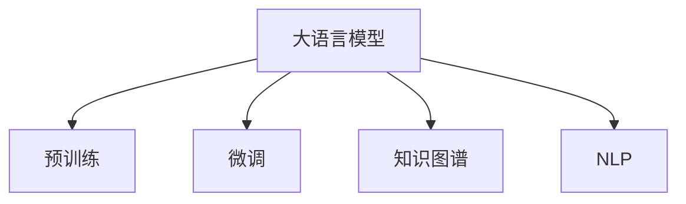

                 

# LLM在智能风控系统中的潜力

> 关键词：大语言模型,风控系统,风险评估,智能决策,文本分析,信用评分,反欺诈检测,金融科技

## 1. 背景介绍

### 1.1 问题由来
随着金融科技的蓬勃发展，金融风险防范已成为金融机构的核心业务之一。传统的金融风控依赖于定性的规则和历史数据分析，容易出现规则滞后和数据孤岛等问题。如何更有效地识别和防范风险，成为金融机构亟待解决的问题。

近年来，随着人工智能技术的成熟，大语言模型（Large Language Models, LLMs）在金融领域的应用逐渐兴起。LLMs通过在海量数据上进行预训练，具备了强大的自然语言理解和生成能力，能够从大量非结构化文本数据中提取关键信息，进行深度分析，为风控决策提供有力支持。本文将探讨LLM在智能风控系统中的应用潜力，并详细阐述其实现原理和技术细节。

### 1.2 问题核心关键点
大语言模型在智能风控系统中的应用，主要集中在以下几个方面：

1. **风险评估**：利用LLM进行文本分析，自动提取风险特征，生成信用评分或风险等级。
2. **智能决策**：结合历史数据和实时文本信息，动态调整风控策略，实现实时风险评估和决策。
3. **反欺诈检测**：识别异常交易文本，判断是否存在欺诈行为，提高反欺诈能力。
4. **客户画像**：分析客户多维数据，建立动态的客户画像，提升风控模型的精准度。
5. **合规监控**：监控金融活动中的合规性文本，防范合规风险，保障金融稳定。

本文将聚焦于LLM在风控系统的应用潜力，详细阐述其技术原理和实施细节，同时展望未来的应用前景。

## 2. 核心概念与联系

### 2.1 核心概念概述

为更好地理解LLM在智能风控系统中的应用，本节将介绍几个关键概念：

- **大语言模型（LLM）**：以Transformer等架构为基础，通过在海量无标签文本语料上进行预训练，学习到丰富的语言知识和常识，具备强大的语言理解和生成能力。

- **预训练（Pre-training）**：指在大规模无标签文本数据上，通过自监督学习任务训练通用语言模型的过程。常见的预训练任务包括语言建模、掩码语言模型等。

- **微调（Fine-tuning）**：指在预训练模型的基础上，使用特定任务的有标签数据，通过有监督地训练优化模型在该任务上的性能。

- **知识图谱（Knowledge Graph）**：将结构化数据和非结构化数据整合并建立联系，形成语义网络，帮助LLM更好地理解和推理。

- **自然语言处理（NLP）**：处理和分析自然语言文本的计算机技术，涉及语言理解、文本分类、信息抽取等。

这些概念之间的关系可以通过以下Mermaid流程图来展示：



这个流程图展示了LLM的核心概念及其之间的联系：

1. LLM通过预训练学习到语言表示。
2. 微调使模型更好地适应特定任务。
3. 知识图谱帮助模型理解更广泛的知识。
4. NLP技术为模型提供了处理和分析文本的能力。

## 3. 核心算法原理 & 具体操作步骤
### 3.1 算法原理概述

基于大语言模型在智能风控系统中的应用，主要利用LLM的预训练知识，通过微调进行任务适配。其核心思想是：

1. 使用大规模无标签文本数据进行预训练，学习到通用的语言表示。
2. 在特定风控任务的标注数据上进行微调，使模型能够自动提取风险特征，生成信用评分或风险等级。
3. 结合知识图谱和实时文本信息，进行动态的风险评估和决策。

### 3.2 算法步骤详解

基于LLM在智能风控系统中的应用，其具体实现步骤包括：

1. **准备数据集**：收集和清洗与风控相关的文本数据，如贷款申请、信用卡交易记录等，同时收集标注数据，用于模型微调。

2. **数据预处理**：对文本数据进行分词、去噪、归一化等预处理，同时对标注数据进行编码处理，方便模型训练。

3. **模型选择与适配**：选择合适的预训练模型（如BERT、GPT等），并根据风控任务的需求进行适配，添加适当的输出层和损失函数。

4. **微调训练**：在标注数据上使用微调算法（如AdamW、SGD等）进行训练，优化模型参数，使其能够自动提取和分析风险特征。

5. **测试与评估**：在测试数据集上评估微调后的模型性能，对比微调前后的效果提升。

6. **应用部署**：将微调后的模型部署到实际风控系统中，进行实时风险评估和决策。

### 3.3 算法优缺点

使用LLM进行智能风控系统微调，具有以下优点：

1. **高效性**：相比从头训练，微调所需的标注数据量较小，且训练时间较短，能够快速适应特定风控任务。
2. **通用性**：预训练的通用语言知识可以应用于各种风控场景，如信用评分、反欺诈检测等。
3. **自适应性**：LLM具备自适应能力，能够根据实时文本信息动态调整风险评估结果，提高模型的鲁棒性。
4. **灵活性**：结合知识图谱和NLP技术，LLM能够灵活处理多维数据，提升风控模型的精度和可靠性。

同时，LLM在风控系统中的应用也存在一些缺点：

1. **依赖数据**：模型性能依赖于标注数据的质量和数量，数据偏差可能导致模型输出错误。
2. **模型复杂**：大语言模型参数量庞大，对硬件资源要求较高，可能需要大量的计算资源进行训练和推理。
3. **解释性不足**：LLM的决策过程缺乏可解释性，难以理解其内部推理逻辑，影响模型的可信度。
4. **伦理风险**：LLM可能会学习到有偏见或有害的信息，导致模型输出不公正或有误导性。

### 3.4 算法应用领域

基于大语言模型的智能风控系统，在金融、互联网、物流等多个领域得到了广泛应用，具体包括：

1. **金融信贷**：利用LLM进行信用评分、风险评估和反欺诈检测，提升信贷审批效率和准确性。
2. **信用卡风控**：结合交易文本和用户行为数据，实时识别异常交易，防范信用卡欺诈。
3. **供应链金融**：分析供应链合同、交易记录等文本，评估供应链风险，提供动态风险管理建议。
4. **电商风控**：通过分析商品描述、用户评论等文本，识别欺诈行为，保障电商平台安全。
5. **物流风险管理**：结合物流单据、客服记录等文本，评估物流风险，优化物流管理策略。

## 4. 数学模型和公式 & 详细讲解  
### 4.1 数学模型构建

以信用评分为例，假设有标注数据集 $D = \{(x_i, y_i)\}_{i=1}^N$，其中 $x_i$ 为贷款申请文本，$y_i$ 为信用评分标签。定义模型 $M_{\theta}$ 为LLM，其中 $\theta$ 为模型参数。

1. **预训练模型**：在无标签数据集 $D_{pre}$ 上进行预训练，学习到通用的语言表示。
2. **微调模型**：在标注数据集 $D$ 上进行微调，生成信用评分 $y_i$。

数学模型构建如下：

$$
M_{\theta}(x) = F(x; \theta)
$$

其中 $F(x; \theta)$ 为LLM的预训练编码器，通过微调训练生成信用评分 $y_i$。

### 4.2 公式推导过程

以信用评分为例，推导LLM在微调过程中的关键公式：

1. **预训练损失函数**：
   $$
   \mathcal{L}_{pre} = -\frac{1}{N_{pre}} \sum_{i=1}^{N_{pre}} \log P(x_i; \theta)
   $$

   其中 $P(x_i; \theta)$ 为预训练时的概率分布，$N_{pre}$ 为无标签数据集大小。

2. **微调损失函数**：
   $$
   \mathcal{L}_{fin} = \frac{1}{N} \sum_{i=1}^N \ell(M_{\theta}(x_i), y_i)
   $$

   其中 $\ell$ 为损失函数，$\ell$ 可以是交叉熵、均方误差等。

3. **微调目标**：
   $$
   \theta^* = \mathop{\arg\min}_{\theta} \mathcal{L}_{fin} + \lambda \mathcal{L}_{pre}
   $$

   其中 $\lambda$ 为正则化系数，平衡预训练和微调的重要性。

### 4.3 案例分析与讲解

以信用卡欺诈检测为例，分析LLM在实时交易文本分析中的应用：

1. **数据准备**：收集信用卡交易记录，标记出异常交易，如高额交易、异地交易等。

2. **模型微调**：在标注数据集上微调预训练模型，生成每个交易的欺诈概率。

3. **实时检测**：对实时交易文本进行编码，输入微调后的LLM，生成欺诈概率。

4. **风险评估**：根据设定的阈值，判断是否为欺诈交易，进行相应的风险控制。

## 5. 项目实践：代码实例和详细解释说明
### 5.1 开发环境搭建

在进行风控系统微调开发前，我们需要准备好开发环境。以下是使用Python进行PyTorch开发的环境配置流程：

1. 安装Anaconda：从官网下载并安装Anaconda，用于创建独立的Python环境。

2. 创建并激活虚拟环境：
```bash
conda create -n pytorch-env python=3.8 
conda activate pytorch-env
```

3. 安装PyTorch：根据CUDA版本，从官网获取对应的安装命令。例如：
```bash
conda install pytorch torchvision torchaudio cudatoolkit=11.1 -c pytorch -c conda-forge
```

4. 安装Transformers库：
```bash
pip install transformers
```

5. 安装各类工具包：
```bash
pip install numpy pandas scikit-learn matplotlib tqdm jupyter notebook ipython
```

完成上述步骤后，即可在`pytorch-env`环境中开始风控系统微调实践。

### 5.2 源代码详细实现

以下是使用PyTorch和Transformers库进行信用评分微调的代码实现：

```python
from transformers import BertForSequenceClassification, BertTokenizer, AdamW
import torch
import torch.nn as nn
import torch.optim as optim

# 定义模型结构
class Model(nn.Module):
    def __init__(self, num_labels):
        super(Model, self).__init__()
        self.bert = BertForSequenceClassification.from_pretrained('bert-base-cased', num_labels=num_labels)
        self.dropout = nn.Dropout(0.1)
        self.out = nn.Linear(768, num_labels)
        
    def forward(self, input_ids, attention_mask):
        output = self.bert(input_ids, attention_mask=attention_mask)
        output = self.dropout(output)
        output = self.out(output.pooler_output)
        return output

# 加载预训练模型和分词器
model = Model(2)  # 二分类任务，标签数为2
tokenizer = BertTokenizer.from_pretrained('bert-base-cased')

# 定义损失函数和优化器
loss_fn = nn.CrossEntropyLoss()
optimizer = AdamW(model.parameters(), lr=2e-5)

# 准备训练数据
train_data = ...
dev_data = ...
test_data = ...

# 训练模型
epochs = 5
batch_size = 16
device = torch.device('cuda') if torch.cuda.is_available() else torch.device('cpu')
model.to(device)

for epoch in range(epochs):
    model.train()
    train_loss = 0
    train_correct = 0
    train_total = 0
    for batch in tqdm(train_data, desc='Training'):
        input_ids = batch['input_ids'].to(device)
        attention_mask = batch['attention_mask'].to(device)
        labels = batch['labels'].to(device)
        model.zero_grad()
        output = model(input_ids, attention_mask=attention_mask)
        loss = loss_fn(output, labels)
        train_loss += loss.item()
        train_correct += (output.argmax(1) == labels).sum().item()
        train_total += labels.size(0)
        loss.backward()
        optimizer.step()
        if (epoch+1) % 1 == 0:
            model.eval()
            dev_loss = 0
            dev_correct = 0
            dev_total = 0
            with torch.no_grad():
                for batch in tqdm(dev_data, desc='Evaluating'):
                    input_ids = batch['input_ids'].to(device)
                    attention_mask = batch['attention_mask'].to(device)
                    labels = batch['labels'].to(device)
                    output = model(input_ids, attention_mask=attention_mask)
                    loss = loss_fn(output, labels)
                    dev_loss += loss.item()
                    dev_correct += (output.argmax(1) == labels).sum().item()
                    dev_total += labels.size(0)
            print(f'Epoch {epoch+1}, train loss: {train_loss/len(train_data):.4f}, train acc: {train_correct/train_total:.4f}, dev loss: {dev_loss/len(dev_data):.4f}, dev acc: {dev_correct/dev_total:.4f}')
```

### 5.3 代码解读与分析

让我们再详细解读一下关键代码的实现细节：

**Model类**：
- `__init__`方法：初始化模型结构，包括预训练BERT模型和线性分类器等。
- `forward`方法：定义前向传播过程，计算模型输出。

**数据准备**：
- `train_data`, `dev_data`, `test_data`：分别为训练集、验证集、测试集，需要进行加载和预处理。

**模型训练**：
- `epochs`和`batch_size`：分别为训练轮数和批次大小。
- `device`：指定使用GPU或CPU进行训练。
- `model.to(device)`：将模型迁移到指定设备。
- `model.train()`和`model.eval()`：控制模型训练和评估模式。
- `optimizer`：定义优化器，如AdamW等。
- `train_loss`, `train_correct`, `train_total`, `dev_loss`, `dev_correct`, `dev_total`：记录训练和验证过程中的损失和准确率。
- `loss_fn`：定义损失函数，如交叉熵损失等。
- `loss.backward()`和`optimizer.step()`：反向传播和优化器更新。

**运行结果展示**：
- 在训练和验证过程中输出损失和准确率，及时调整模型和超参数。
- 最终在测试集上评估模型性能，对比微调前后的效果提升。

## 6. 实际应用场景
### 6.1 智能信贷审批

在智能信贷审批中，利用LLM进行信用评分和风险评估，可以大幅提升审批效率和准确性。具体实现如下：

1. **数据准备**：收集和清洗贷款申请文本数据，提取风险特征。
2. **模型微调**：在标注数据集上微调预训练模型，生成信用评分。
3. **审批决策**：根据生成的信用评分和设定的阈值，自动审批贷款申请。

### 6.2 信用卡反欺诈检测

信用卡反欺诈检测是金融风控的重要环节。利用LLM进行实时交易文本分析，可以准确识别异常交易，有效防范信用卡欺诈。具体实现如下：

1. **数据准备**：收集和清洗信用卡交易记录，标注异常交易。
2. **模型微调**：在标注数据集上微调预训练模型，生成每个交易的欺诈概率。
3. **实时检测**：对实时交易文本进行编码，输入微调后的LLM，生成欺诈概率。
4. **风险评估**：根据设定的阈值，判断是否为欺诈交易，进行相应的风险控制。

### 6.3 供应链金融风险管理

在供应链金融中，利用LLM进行合同文本分析和交易记录分析，可以实时评估供应链风险，提供动态风险管理建议。具体实现如下：

1. **数据准备**：收集供应链合同和交易记录，提取关键信息。
2. **模型微调**：在标注数据集上微调预训练模型，生成供应链风险评估结果。
3. **风险管理**：根据评估结果，动态调整供应链管理策略，防范风险。

## 7. 工具和资源推荐
### 7.1 学习资源推荐

为了帮助开发者系统掌握LLM在风控系统中的应用，这里推荐一些优质的学习资源：

1. **《Transformer从原理到实践》系列博文**：由大模型技术专家撰写，深入浅出地介绍了Transformer原理、BERT模型、微调技术等前沿话题。

2. **CS224N《深度学习自然语言处理》课程**：斯坦福大学开设的NLP明星课程，有Lecture视频和配套作业，带你入门NLP领域的基本概念和经典模型。

3. **《Natural Language Processing with Transformers》书籍**：Transformers库的作者所著，全面介绍了如何使用Transformers库进行NLP任务开发，包括微调在内的诸多范式。

4. **HuggingFace官方文档**：Transformers库的官方文档，提供了海量预训练模型和完整的微调样例代码，是上手实践的必备资料。

5. **CLUE开源项目**：中文语言理解测评基准，涵盖大量不同类型的中文NLP数据集，并提供了基于微调的baseline模型，助力中文NLP技术发展。

通过对这些资源的学习实践，相信你一定能够快速掌握LLM在风控系统中的应用精髓，并用于解决实际的金融风控问题。

### 7.2 开发工具推荐

高效的开发离不开优秀的工具支持。以下是几款用于LLM风控系统微调开发的常用工具：

1. **PyTorch**：基于Python的开源深度学习框架，灵活动态的计算图，适合快速迭代研究。大部分预训练语言模型都有PyTorch版本的实现。

2. **TensorFlow**：由Google主导开发的开源深度学习框架，生产部署方便，适合大规模工程应用。同样有丰富的预训练语言模型资源。

3. **Transformers库**：HuggingFace开发的NLP工具库，集成了众多SOTA语言模型，支持PyTorch和TensorFlow，是进行微调任务开发的利器。

4. **Weights & Biases**：模型训练的实验跟踪工具，可以记录和可视化模型训练过程中的各项指标，方便对比和调优。与主流深度学习框架无缝集成。

5. **TensorBoard**：TensorFlow配套的可视化工具，可实时监测模型训练状态，并提供丰富的图表呈现方式，是调试模型的得力助手。

6. **Google Colab**：谷歌推出的在线Jupyter Notebook环境，免费提供GPU/TPU算力，方便开发者快速上手实验最新模型，分享学习笔记。

合理利用这些工具，可以显著提升LLM风控系统微调任务的开发效率，加快创新迭代的步伐。

### 7.3 相关论文推荐

LLM在金融风控系统中的应用源于学界的持续研究。以下是几篇奠基性的相关论文，推荐阅读：

1. **Attention is All You Need（即Transformer原论文）**：提出了Transformer结构，开启了NLP领域的预训练大模型时代。

2. **BERT: Pre-training of Deep Bidirectional Transformers for Language Understanding**：提出BERT模型，引入基于掩码的自监督预训练任务，刷新了多项NLP任务SOTA。

3. **Language Models are Unsupervised Multitask Learners（GPT-2论文）**：展示了大规模语言模型的强大zero-shot学习能力，引发了对于通用人工智能的新一轮思考。

4. **Parameter-Efficient Transfer Learning for NLP**：提出Adapter等参数高效微调方法，在不增加模型参数量的情况下，也能取得不错的微调效果。

5. **Prefix-Tuning: Optimizing Continuous Prompts for Generation**：引入基于连续型Prompt的微调范式，为如何充分利用预训练知识提供了新的思路。

6. **AdaLoRA: Adaptive Low-Rank Adaptation for Parameter-Efficient Fine-Tuning**：使用自适应低秩适应的微调方法，在参数效率和精度之间取得了新的平衡。

这些论文代表了大语言模型微调技术的发展脉络。通过学习这些前沿成果，可以帮助研究者把握学科前进方向，激发更多的创新灵感。

## 8. 总结：未来发展趋势与挑战

### 8.1 研究成果总结

本文对基于大语言模型的智能风控系统进行了全面系统的介绍。首先阐述了LLM在金融风控系统中的应用潜力，明确了微调在提升金融风险管理水平、提升审批效率和准确性方面的独特价值。其次，从原理到实践，详细讲解了LLM在微调过程中的数学模型和算法步骤，给出了微调任务开发的完整代码实例。同时，本文还广泛探讨了LLM在金融风控系统中的应用场景，展示了其巨大潜力。

通过本文的系统梳理，可以看到，基于大语言模型的风控系统微调技术在金融、互联网、物流等多个领域得到了广泛应用，为提升金融风控水平、保障金融安全提供了新的解决方案。受益于大规模语料的预训练和微调方法的不断进步，LLM有望在金融科技领域大放异彩，为构建更智能、更安全的金融体系带来革命性影响。

### 8.2 未来发展趋势

展望未来，LLM在风控系统中的应用将呈现以下几个发展趋势：

1. **多模态融合**：结合文本、语音、图像等多模态数据，提升风控系统的综合分析能力，增强模型的鲁棒性和泛化性。

2. **实时风控**：利用LLM进行实时文本分析，动态调整风控策略，实现实时风险评估和决策。

3. **可解释性提升**：通过引入因果推断、对比学习等技术，提升模型的可解释性和可信度。

4. **自适应学习**：利用增量学习、在线学习等技术，使模型能够持续学习新知识，保持模型的时效性和适应性。

5. **伦理道德保障**：在模型训练目标中引入伦理导向的评估指标，过滤和惩罚有偏见、有害的输出倾向，保障模型的公平性和安全性。

这些趋势凸显了LLM在风控系统中的应用前景，相信随着学界和产业界的共同努力，这些趋势将进一步推动金融科技的创新和发展。

### 8.3 面临的挑战

尽管LLM在风控系统中的应用已经取得了一定的进展，但在迈向更加智能化、普适化应用的过程中，它仍面临着诸多挑战：

1. **数据依赖**：模型性能依赖于标注数据的质量和数量，数据偏差可能导致模型输出错误。如何进一步降低对标注样本的依赖，将是一大难题。

2. **模型鲁棒性**：当前LLM面对域外数据时，泛化性能往往大打折扣。对于测试样本的微小扰动，模型输出也容易发生波动。如何提高模型的鲁棒性，避免灾难性遗忘，还需要更多理论和实践的积累。

3. **推理效率**：大规模语言模型虽然精度高，但在实际部署时往往面临推理速度慢、内存占用大等效率问题。如何在保证性能的同时，简化模型结构，提升推理速度，优化资源占用，将是重要的优化方向。

4. **可解释性**：LLM的决策过程缺乏可解释性，难以理解其内部推理逻辑，影响模型的可信度。如何赋予模型更强的可解释性，将是亟待攻克的难题。

5. **伦理风险**：预训练语言模型难免会学习到有偏见、有害的信息，导致模型输出不公正或有误导性。如何从数据和算法层面消除模型偏见，避免恶意用途，确保输出的安全性，也将是重要的研究课题。

6. **知识整合**：现有的LLM往往局限于任务内数据，难以灵活吸收和运用更广泛的先验知识。如何让模型更好地整合外部知识，形成更加全面、准确的信息整合能力，还有很大的想象空间。

正视LLM在风控系统应用中面临的这些挑战，积极应对并寻求突破，将是大语言模型风控系统走向成熟的必由之路。

### 8.4 研究展望

面对LLM在风控系统应用中面临的种种挑战，未来的研究需要在以下几个方面寻求新的突破：

1. **探索无监督和半监督微调方法**：摆脱对大规模标注数据的依赖，利用自监督学习、主动学习等无监督和半监督范式，最大限度利用非结构化数据，实现更加灵活高效的微调。

2. **研究参数高效和计算高效的微调范式**：开发更加参数高效的微调方法，在固定大部分预训练参数的同时，只更新极少量的任务相关参数。同时优化微调模型的计算图，减少前向传播和反向传播的资源消耗，实现更加轻量级、实时性的部署。

3. **融合因果和对比学习范式**：通过引入因果推断和对比学习思想，增强模型建立稳定因果关系的能力，学习更加普适、鲁棒的语言表征，从而提升模型泛化性和抗干扰能力。

4. **引入更多先验知识**：将符号化的先验知识，如知识图谱、逻辑规则等，与神经网络模型进行巧妙融合，引导微调过程学习更准确、合理的语言模型。同时加强不同模态数据的整合，实现视觉、语音等多模态信息与文本信息的协同建模。

5. **结合因果分析和博弈论工具**：将因果分析方法引入微调模型，识别出模型决策的关键特征，增强输出解释的因果性和逻辑性。借助博弈论工具刻画人机交互过程，主动探索并规避模型的脆弱点，提高系统稳定性。

6. **纳入伦理道德约束**：在模型训练目标中引入伦理导向的评估指标，过滤和惩罚有偏见、有害的输出倾向。同时加强人工干预和审核，建立模型行为的监管机制，确保输出符合人类价值观和伦理道德。

这些研究方向的探索，必将引领LLM风控系统技术迈向更高的台阶，为构建安全、可靠、可解释、可控的智能系统铺平道路。面向未来，LLM在风控系统中的研究和应用还需与其他人工智能技术进行更深入的融合，如知识表示、因果推理、强化学习等，多路径协同发力，共同推动金融风控系统的进步。只有勇于创新、敢于突破，才能不断拓展语言模型的边界，让智能技术更好地造福金融行业。

## 9. 附录：常见问题与解答

**Q1：大语言模型在风控系统中如何处理数据？**

A: 大语言模型在风控系统中主要处理文本数据。数据预处理通常包括分词、去噪、归一化等步骤。对于标注数据，还需要进行编码处理，方便模型训练。具体实现可以使用NLTK、spaCy等自然语言处理工具库。

**Q2：在微调过程中如何选择合适的学习率？**

A: 在风控系统中，微调的学习率一般要比预训练时小1-2个数量级。可以使用warmup策略，在开始阶段使用较小的学习率，再逐渐过渡到预设值。同时，不同的优化器（如AdamW、Adafactor等）以及不同的学习率调度策略，可能需要设置不同的学习率阈值。

**Q3：微调模型在实际应用中需要注意哪些问题？**

A: 微调模型在实际应用中需要注意以下几个问题：
1. **数据偏差**：模型性能依赖于标注数据的质量和数量，数据偏差可能导致模型输出错误。需要定期评估模型性能，及时调整数据集。
2. **模型鲁棒性**：面对域外数据时，模型的泛化性能可能降低。可以通过对抗训练等技术，提高模型的鲁棒性。
3. **推理效率**：大规模语言模型推理速度较慢，内存占用较大。需要优化模型结构和推理算法，提升效率。
4. **可解释性**：模型的决策过程缺乏可解释性，难以理解其内部推理逻辑。可以通过引入因果推断、对比学习等技术，提升模型的可解释性。

**Q4：如何构建一个有效的风控系统？**

A: 构建一个有效的风控系统，需要以下几个步骤：
1. **数据准备**：收集和清洗与风控相关的文本数据，提取风险特征。
2. **模型选择与适配**：选择合适的预训练模型，并根据风控任务的需求进行适配，添加适当的输出层和损失函数。
3. **微调训练**：在标注数据集上使用微调算法进行训练，优化模型参数，使其能够自动提取和分析风险特征。
4. **测试与评估**：在测试数据集上评估微调后的模型性能，对比微调前后的效果提升。
5. **应用部署**：将微调后的模型部署到实际风控系统中，进行实时风险评估和决策。

**Q5：在风控系统中如何保护用户隐私？**

A: 在风控系统中，保护用户隐私是至关重要的。可以通过以下措施来保护用户隐私：
1. **数据匿名化**：在处理用户数据前，进行数据匿名化处理，去除敏感信息。
2. **差分隐私**：采用差分隐私技术，保证模型训练过程中不泄露用户隐私。
3. **数据隔离**：将用户数据与模型训练数据隔离，避免模型训练过程中泄露用户隐私。
4. **访问控制**：对用户数据进行严格的访问控制，确保只有授权人员才能访问敏感信息。

---

作者：禅与计算机程序设计艺术 / Zen and the Art of Computer Programming

