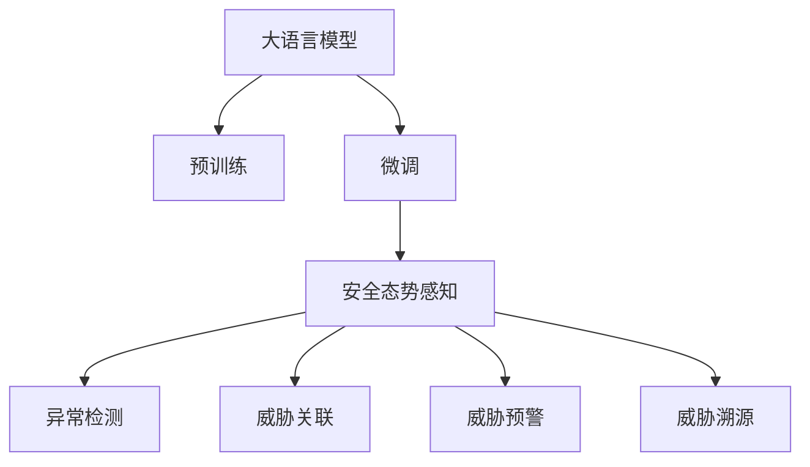

                 

# LLM在网络安全中的应用：智能威胁检测

> 关键词：网络安全,威胁检测,大语言模型,安全态势感知,机器学习,数据挖掘

## 1. 背景介绍

### 1.1 问题由来

随着信息技术的高速发展，网络安全问题日益严峻。从金融系统到政府机关，从电信企业到互联网公司，无处不在的网络攻击和威胁正在威胁着各个行业的信息安全。面对日益复杂多变的威胁环境，传统的网络安全防护措施（如防火墙、入侵检测系统）已经难以应对。

与此同时，人工智能技术的快速发展为网络安全带来了新的思路和可能性。大语言模型（LLM）通过在大量文本数据上进行预训练，学习到了丰富的语言知识和模式，具备了强大的自然语言理解和生成能力。借助LLM的智能能力，网络安全领域也开始探索和应用智能威胁检测技术，以提高威胁检测的准确性和效率。

### 1.2 问题核心关键点

智能威胁检测的本质是一种基于深度学习的数据挖掘和模式识别任务。其核心思想是利用大语言模型在自然语言文本上的强大处理能力，对网络安全相关的日志、通信、事件等数据进行分析，自动识别潜在的网络威胁，并实时告警。

智能威胁检测的关键在于如何有效利用大语言模型的智能能力，结合网络安全知识，构建出能够准确识别各种威胁的模型。常用的方法包括：
- 基于大语言模型的文本分类和实体识别
- 基于大语言模型的异常检测和行为分析
- 基于大语言模型的威胁关联和溯源
- 基于大语言模型的威胁预警和应急响应

这些方法各自侧重于威胁检测的不同环节，如威胁源识别、行为特征提取、威胁关联推理等，通过多种技术的融合和协作，构建起智能化的威胁检测体系。

## 2. 核心概念与联系

### 2.1 核心概念概述

为更好地理解基于大语言模型的智能威胁检测方法，本节将介绍几个密切相关的核心概念：

- 大语言模型（LLM）：以自回归（如GPT）或自编码（如BERT）模型为代表的大规模预训练语言模型。通过在大规模无标签文本语料上进行预训练，学习通用的语言表示，具备强大的语言理解和生成能力。

- 预训练：指在大规模无标签文本语料上，通过自监督学习任务训练通用语言模型的过程。常见的预训练任务包括言语建模、遮挡语言模型等。预训练使得模型学习到语言的通用表示。

- 微调（Fine-tuning）：指在预训练模型的基础上，使用下游任务的少量标注数据，通过有监督地训练来优化模型在该任务上的性能。通常只需要调整顶层分类器或解码器，并以较小的学习率更新全部或部分的模型参数。

- 安全态势感知（Security Situational Awareness, SSA）：指通过多维度的数据融合和分析，实时监测网络环境的安全状态，及时发现和响应威胁。安全态势感知系统通常包含数据收集、数据分析、威胁检测、告警和响应等多个模块。

- 异常检测（Anomaly Detection）：指通过分析网络流量、日志等数据，自动识别出与正常行为显著不同的异常行为或事件，是智能威胁检测的重要环节。

- 威胁关联（Threat Correlation）：指通过分析不同安全事件之间的关系，构建威胁链条，识别更复杂的网络攻击行为。威胁关联分析通常需要结合行为分析、时间序列分析等技术。

- 威胁预警（Threat预警）：指根据威胁检测结果，提前向安全管理员或系统自动发送告警信息，以便及时采取应对措施。

- 威胁溯源（Threat Attribution）：指通过反向分析攻击行为、工具、来源等，确定攻击者身份和攻击路径，为后续的应急响应和法律追究提供依据。

这些核心概念之间的逻辑关系可以通过以下Mermaid流程图来展示：



这个流程图展示了大语言模型的核心概念及其之间的关系：

1. 大语言模型通过预训练获得基础能力。
2. 微调是对预训练模型进行任务特定的优化，可以提高威胁检测的准确性。
3. 安全态势感知系统融合多源数据，实时监测威胁情况。
4. 异常检测和行为分析是威胁识别的关键步骤。
5. 威胁关联和溯源可以揭示攻击链条和来源，进一步提高威胁检测和响应能力。

## 3. 核心算法原理 & 具体操作步骤

### 3.1 算法原理概述

基于大语言模型的智能威胁检测，本质上是一种有监督学习的模式识别任务。其核心思想是：将大语言模型视作一个强大的特征提取器，通过分析网络安全相关数据，学习出威胁特征的模式，并将其应用于实际威胁检测任务。

形式化地，假设大语言模型为 $M_{\theta}$，其中 $\theta$ 为预训练得到的模型参数。给定威胁检测任务 $T$ 的训练数据集 $D=\{(x_i, y_i)\}_{i=1}^N, x_i \in \mathcal{X}, y_i \in \{0,1\}$，其中 $y_i=1$ 表示 $x_i$ 为潜在威胁。微调的目标是找到新的模型参数 $\hat{\theta}$，使得：

$$
\hat{\theta}=\mathop{\arg\min}_{\theta} \mathcal{L}(M_{\theta},D)
$$

其中 $\mathcal{L}$ 为针对任务 $T$ 设计的损失函数，用于衡量模型预测输出与真实标签之间的差异。常用的损失函数包括交叉熵损失、均方误差损失等。

通过梯度下降等优化算法，微调过程不断更新模型参数 $\theta$，最小化损失函数 $\mathcal{L}$，使得模型输出逼近真实标签。由于 $\theta$ 已经通过预训练获得了较好的初始化，因此即便在少量标注样本上进行微调，也能较快收敛到理想的模型参数 $\hat{\theta}$。

### 3.2 算法步骤详解

基于大语言模型的智能威胁检测一般包括以下几个关键步骤：

**Step 1: 准备预训练模型和数据集**
- 选择合适的预训练语言模型 $M_{\theta}$ 作为初始化参数，如 BERT、GPT 等。
- 准备威胁检测任务 $T$ 的标注数据集 $D$，划分为训练集、验证集和测试集。通常需要结合网络日志、通信数据、事件记录等各类数据。

**Step 2: 设计任务适配层**
- 根据任务需求，在预训练模型顶层设计合适的输出层和损失函数。
- 对于威胁检测任务，通常使用二分类损失函数，将异常行为标记为 1，正常行为标记为 0。
- 对于威胁关联任务，可采用多标签分类或序列标注等形式。

**Step 3: 设置微调超参数**
- 选择合适的优化算法及其参数，如 AdamW、SGD 等，设置学习率、批大小、迭代轮数等。
- 设置正则化技术及强度，包括权重衰减、Dropout、Early Stopping 等。
- 确定冻结预训练参数的策略，如仅微调顶层，或全部参数都参与微调。

**Step 4: 执行梯度训练**
- 将训练集数据分批次输入模型，前向传播计算损失函数。
- 反向传播计算参数梯度，根据设定的优化算法和学习率更新模型参数。
- 周期性在验证集上评估模型性能，根据性能指标决定是否触发 Early Stopping。
- 重复上述步骤直到满足预设的迭代轮数或 Early Stopping 条件。

**Step 5: 测试和部署**
- 在测试集上评估微调后模型 $M_{\hat{\theta}}$ 的性能，对比微调前后的精度提升。
- 使用微调后的模型对实时数据进行推理预测，集成到实际的安全态势感知系统中。
- 持续收集新的数据，定期重新微调模型，以适应数据分布的变化。

以上是基于大语言模型的智能威胁检测的一般流程。在实际应用中，还需要针对具体威胁检测任务的特点，对微调过程的各个环节进行优化设计，如改进训练目标函数，引入更多的正则化技术，搜索最优的超参数组合等，以进一步提升模型性能。

### 3.3 算法优缺点

基于大语言模型的智能威胁检测方法具有以下优点：
1. 高效准确：利用大语言模型的强大智能能力，能够在少量标注数据的情况下快速实现高质量的威胁检测。
2. 灵活可扩展：可以根据不同威胁类型，设计不同的任务适配层，灵活应对各种网络安全场景。
3. 自动化程度高：通过自动化的模型训练和推理，减少了人工干预，提高了威胁检测的效率。
4. 实时响应：基于实时数据进行威胁检测，能够快速发现和响应新出现的威胁。
5. 多源数据融合：可以融合多维度的安全数据，提高威胁检测的全面性和鲁棒性。

同时，该方法也存在一定的局限性：
1. 数据依赖：对标注数据的依赖较高，高质量标注数据的获取成本较大。
2. 泛化能力有限：当目标威胁与预训练数据的分布差异较大时，微调的效果可能不佳。
3. 安全漏洞：大语言模型可能存在潜在的安全漏洞，如对抗样本攻击、偏见传递等，需要额外的设计和验证。
4. 计算资源需求高：大规模预训练和微调需要大量的计算资源，可能对系统硬件和网络带宽提出较高要求。
5. 可解释性不足：模型的决策过程难以解释，缺乏透明性和可理解性。

尽管存在这些局限性，但就目前而言，基于大语言模型的智能威胁检测方法仍然是大规模网络安全防御的重要手段。未来相关研究的重点在于如何进一步降低对标注数据的依赖，提高模型的泛化能力，同时兼顾模型的安全性和可解释性等因素。

### 3.4 算法应用领域

基于大语言模型的智能威胁检测方法，已经在网络安全领域得到了广泛应用，覆盖了从异常检测到威胁关联、从预警响应到溯源取证等多个环节，具体包括：

- 异常检测：通过分析网络流量、日志等数据，自动识别出异常行为和事件。
- 威胁关联：通过多源数据融合，构建威胁链条，识别更复杂的网络攻击行为。
- 威胁预警：根据威胁检测结果，提前向安全管理员或系统自动发送告警信息。
- 威胁溯源：通过反向分析攻击行为、工具、来源等，确定攻击者身份和攻击路径。
- 威胁情报分析：对已检测到的威胁进行分析，生成威胁情报报告，为行业提供参考。

除了这些核心应用场景外，智能威胁检测技术还在自动化运维、恶意代码分析、漏洞扫描等任务中发挥了重要作用，为网络安全防御提供了新的技术手段。

## 4. 数学模型和公式 & 详细讲解 & 举例说明

### 4.1 数学模型构建

本节将使用数学语言对基于大语言模型的智能威胁检测过程进行更加严格的刻画。

记大语言模型为 $M_{\theta}$，其中 $\theta$ 为预训练得到的模型参数。假设威胁检测任务为二分类任务，训练集为 $D=\{(x_i,y_i)\}_{i=1}^N, x_i \in \mathcal{X}, y_i \in \{0,1\}$。

定义模型 $M_{\theta}$ 在输入 $x$ 上的损失函数为 $\ell(M_{\theta}(x),y)$，则在数据集 $D$ 上的经验风险为：

$$
\mathcal{L}(\theta) = \frac{1}{N}\sum_{i=1}^N \ell(M_{\theta}(x_i),y_i)
$$

微调的优化目标是最小化经验风险，即找到最优参数：

$$
\theta^* = \mathop{\arg\min}_{\theta} \mathcal{L}(\theta)
$$

在实践中，我们通常使用基于梯度的优化算法（如SGD、Adam等）来近似求解上述最优化问题。设 $\eta$ 为学习率，$\lambda$ 为正则化系数，则参数的更新公式为：

$$
\theta \leftarrow \theta - \eta \nabla_{\theta}\mathcal{L}(\theta) - \eta\lambda\theta
$$

其中 $\nabla_{\theta}\mathcal{L}(\theta)$ 为损失函数对参数 $\theta$ 的梯度，可通过反向传播算法高效计算。

### 4.2 公式推导过程

以下我们以二分类任务为例，推导交叉熵损失函数及其梯度的计算公式。

假设模型 $M_{\theta}$ 在输入 $x$ 上的输出为 $\hat{y}=M_{\theta}(x) \in [0,1]$，表示样本属于正类的概率。真实标签 $y \in \{0,1\}$。则二分类交叉熵损失函数定义为：

$$
\ell(M_{\theta}(x),y) = -[y\log \hat{y} + (1-y)\log (1-\hat{y})]
$$

将其代入经验风险公式，得：

$$
\mathcal{L}(\theta) = -\frac{1}{N}\sum_{i=1}^N [y_i\log M_{\theta}(x_i)+(1-y_i)\log(1-M_{\theta}(x_i))]
$$

根据链式法则，损失函数对参数 $\theta_k$ 的梯度为：

$$
\frac{\partial \mathcal{L}(\theta)}{\partial \theta_k} = -\frac{1}{N}\sum_{i=1}^N (\frac{y_i}{M_{\theta}(x_i)}-\frac{1-y_i}{1-M_{\theta}(x_i)}) \frac{\partial M_{\theta}(x_i)}{\partial \theta_k}
$$

其中 $\frac{\partial M_{\theta}(x_i)}{\partial \theta_k}$ 可进一步递归展开，利用自动微分技术完成计算。

在得到损失函数的梯度后，即可带入参数更新公式，完成模型的迭代优化。重复上述过程直至收敛，最终得到适应威胁检测任务的最优模型参数 $\theta^*$。

## 5. 项目实践：代码实例和详细解释说明

### 5.1 开发环境搭建

在进行智能威胁检测项目实践前，我们需要准备好开发环境。以下是使用Python进行PyTorch开发的环境配置流程：

1. 安装Anaconda：从官网下载并安装Anaconda，用于创建独立的Python环境。

2. 创建并激活虚拟环境：
```bash
conda create -n pytorch-env python=3.8 
conda activate pytorch-env
```

3. 安装PyTorch：根据CUDA版本，从官网获取对应的安装命令。例如：
```bash
conda install pytorch torchvision torchaudio cudatoolkit=11.1 -c pytorch -c conda-forge
```

4. 安装Transformers库：
```bash
pip install transformers
```

5. 安装各类工具包：
```bash
pip install numpy pandas scikit-learn matplotlib tqdm jupyter notebook ipython
```

完成上述步骤后，即可在`pytorch-env`环境中开始智能威胁检测实践。

### 5.2 源代码详细实现

下面我们以异常检测任务为例，给出使用Transformers库对BERT模型进行智能威胁检测的PyTorch代码实现。

首先，定义异常检测任务的数据处理函数：

```python
from transformers import BertTokenizer
from torch.utils.data import Dataset
import torch

class AnomalyDetectionDataset(Dataset):
    def __init__(self, texts, labels, tokenizer, max_len=128):
        self.texts = texts
        self.labels = labels
        self.tokenizer = tokenizer
        self.max_len = max_len
        
    def __len__(self):
        return len(self.texts)
    
    def __getitem__(self, item):
        text = self.texts[item]
        label = self.labels[item]
        
        encoding = self.tokenizer(text, return_tensors='pt', max_length=self.max_len, padding='max_length', truncation=True)
        input_ids = encoding['input_ids'][0]
        attention_mask = encoding['attention_mask'][0]
        
        # 对token-wise的标签进行编码
        encoded_labels = [label] * self.max_len
        labels = torch.tensor(encoded_labels, dtype=torch.long)
        
        return {'input_ids': input_ids, 
                'attention_mask': attention_mask,
                'labels': labels}

# 标签为异常行为标记为1，正常行为标记为0
train_dataset = AnomalyDetectionDataset(train_texts, train_labels, tokenizer)
dev_dataset = AnomalyDetectionDataset(dev_texts, dev_labels, tokenizer)
test_dataset = AnomalyDetectionDataset(test_texts, test_labels, tokenizer)
```

然后，定义模型和优化器：

```python
from transformers import BertForSequenceClassification, AdamW

model = BertForSequenceClassification.from_pretrained('bert-base-cased', num_labels=2)

optimizer = AdamW(model.parameters(), lr=2e-5)
```

接着，定义训练和评估函数：

```python
from torch.utils.data import DataLoader
from tqdm import tqdm
from sklearn.metrics import accuracy_score

device = torch.device('cuda') if torch.cuda.is_available() else torch.device('cpu')
model.to(device)

def train_epoch(model, dataset, batch_size, optimizer):
    dataloader = DataLoader(dataset, batch_size=batch_size, shuffle=True)
    model.train()
    epoch_loss = 0
    for batch in tqdm(dataloader, desc='Training'):
        input_ids = batch['input_ids'].to(device)
        attention_mask = batch['attention_mask'].to(device)
        labels = batch['labels'].to(device)
        model.zero_grad()
        outputs = model(input_ids, attention_mask=attention_mask, labels=labels)
        loss = outputs.loss
        epoch_loss += loss.item()
        loss.backward()
        optimizer.step()
    return epoch_loss / len(dataloader)

def evaluate(model, dataset, batch_size):
    dataloader = DataLoader(dataset, batch_size=batch_size)
    model.eval()
    preds, labels = [], []
    with torch.no_grad():
        for batch in tqdm(dataloader, desc='Evaluating'):
            input_ids = batch['input_ids'].to(device)
            attention_mask = batch['attention_mask'].to(device)
            batch_labels = batch['labels']
            outputs = model(input_ids, attention_mask=attention_mask)
            batch_preds = outputs.logits.argmax(dim=2).to('cpu').tolist()
            batch_labels = batch_labels.to('cpu').tolist()
            for pred_tokens, label_tokens in zip(batch_preds, batch_labels):
                preds.append(pred_tokens[:len(label_tokens)])
                labels.append(label_tokens)
                
    print(accuracy_score(labels, preds))
```

最后，启动训练流程并在测试集上评估：

```python
epochs = 5
batch_size = 16

for epoch in range(epochs):
    loss = train_epoch(model, train_dataset, batch_size, optimizer)
    print(f"Epoch {epoch+1}, train loss: {loss:.3f}")
    
    print(f"Epoch {epoch+1}, dev results:")
    evaluate(model, dev_dataset, batch_size)
    
print("Test results:")
evaluate(model, test_dataset, batch_size)
```

以上就是使用PyTorch对BERT进行智能威胁检测任务的微调实践。可以看到，得益于Transformers库的强大封装，我们可以用相对简洁的代码完成BERT模型的加载和微调。

### 5.3 代码解读与分析

让我们再详细解读一下关键代码的实现细节：

**AnomalyDetectionDataset类**：
- `__init__`方法：初始化文本、标签、分词器等关键组件。
- `__len__`方法：返回数据集的样本数量。
- `__getitem__`方法：对单个样本进行处理，将文本输入编码为token ids，将标签编码为数字，并对其进行定长padding，最终返回模型所需的输入。

**模型和优化器**：
- `BertForSequenceClassification`：用于二分类任务的BERT模型，可以处理不定长的输入序列。
- `AdamW`：优化算法，用于调整模型参数以最小化损失函数。

**训练和评估函数**：
- 使用PyTorch的DataLoader对数据集进行批次化加载，供模型训练和推理使用。
- 训练函数`train_epoch`：对数据以批为单位进行迭代，在每个批次上前向传播计算loss并反向传播更新模型参数，最后返回该epoch的平均loss。
- 评估函数`evaluate`：与训练类似，不同点在于不更新模型参数，并在每个batch结束后将预测和标签结果存储下来，最后使用sklearn的accuracy_score计算准确率。

**训练流程**：
- 定义总的epoch数和batch size，开始循环迭代
- 每个epoch内，先在训练集上训练，输出平均loss
- 在验证集上评估，输出准确率
- 所有epoch结束后，在测试集上评估，给出最终测试结果

可以看到，PyTorch配合Transformers库使得BERT微调的代码实现变得简洁高效。开发者可以将更多精力放在数据处理、模型改进等高层逻辑上，而不必过多关注底层的实现细节。

当然，工业级的系统实现还需考虑更多因素，如模型的保存和部署、超参数的自动搜索、更灵活的任务适配层等。但核心的微调范式基本与此类似。

## 6. 实际应用场景

### 6.1 智能入侵检测

智能入侵检测是网络安全防护中重要的环节。传统的入侵检测系统（IDS）依赖规则匹配和特征签名，难以应对新型攻击手段。而利用大语言模型，可以从原始网络流量和日志数据中提取高层次的行为特征，构建更灵活、高效的入侵检测模型。

智能入侵检测系统通常由以下几个模块构成：
- 数据收集：从网络设备、日志系统等采集原始数据。
- 数据预处理：对数据进行清洗、归一化、标准化等处理。
- 特征提取：利用大语言模型提取网络流量、日志、行为等特征。
- 威胁检测：通过训练好的智能模型，检测异常行为。
- 告警响应：根据检测结果，自动生成告警信息并发送给安全管理员或系统。

以DDoS攻击检测为例，智能入侵检测系统可以实时分析网络流量，检测出异常的连接数、请求速率等指标，并识别出可能的DDoS攻击行为，及时向安全管理员发出告警。

### 6.2 恶意代码分析

恶意代码分析是网络安全中重要的研究方向，旨在识别和分析恶意软件的特征和行为。传统的恶意代码分析依赖于静态或动态分析技术，需要耗费大量时间和资源。利用大语言模型，可以从恶意代码的文本描述、代码特征、行为模式等多个维度进行智能分析，提高分析效率和准确性。

智能恶意代码分析系统通常由以下几个模块构成：
- 数据收集：从恶意代码样本库、网络监控等获取恶意代码样本。
- 数据预处理：对代码进行语法分析、反编译等处理。
- 特征提取：利用大语言模型提取恶意代码的文本特征、行为特征等。
- 威胁检测：通过训练好的智能模型，检测恶意代码。
- 告警响应：根据检测结果，自动生成告警信息并发送给安全管理员或系统。

以APT攻击检测为例，智能恶意代码分析系统可以从攻击者的行为轨迹、使用的工具和技术等多个维度进行综合分析，识别出复杂的APT攻击行为，并及时拦截和响应。

### 6.3 威胁情报分析

威胁情报分析是网络安全防护中重要的支撑环节，旨在通过收集和分析网络威胁信息，为安全防御和应急响应提供数据支撑。传统的威胁情报分析依赖于人工分析，效率低、成本高。利用大语言模型，可以从大规模的威胁情报数据中自动化提取有用信息，提高情报分析的效率和准确性。

威胁情报分析系统通常由以下几个模块构成：
- 数据收集：从威胁情报数据库、公开情报源等收集威胁情报数据。
- 数据预处理：对情报数据进行清洗、归一化、标准化等处理。
- 威胁分析：利用大语言模型分析情报数据，识别威胁类型和特征。
- 情报生成：根据威胁分析结果，生成威胁情报报告。
- 情报共享：将生成的威胁情报共享给行业内的安全防护系统，提高整体安全防护水平。

以DDoS攻击情报分析为例，智能威胁情报分析系统可以从大规模的DDoS攻击数据中，自动提取攻击特征、攻击来源、攻击手法等信息，生成威胁情报报告，为行业内的安全防护系统提供支撑。

## 7. 工具和资源推荐

### 7.1 学习资源推荐

为了帮助开发者系统掌握基于大语言模型的智能威胁检测理论基础和实践技巧，这里推荐一些优质的学习资源：

1. 《深度学习与网络安全》系列博文：由网络安全领域的专家撰写，系统介绍了深度学习在网络安全中的应用，包括智能威胁检测、恶意代码分析等。

2. 《网络安全大语言模型》课程：斯坦福大学开设的网络安全与人工智能交叉课程，深入讲解了利用大语言模型进行威胁检测、恶意代码分析、威胁情报分析等技术。

3. 《大语言模型在网络安全中的应用》书籍：全面介绍了大语言模型在网络安全中的应用，包括智能威胁检测、恶意代码分析、威胁情报分析等。

4. HuggingFace官方文档：Transformers库的官方文档，提供了海量预训练模型和完整的智能威胁检测样例代码，是上手实践的必备资料。

5. Kaggle智能威胁检测竞赛：提供了大量的数据集和评估指标，是检验智能威胁检测模型效果的好机会。

通过对这些资源的学习实践，相信你一定能够快速掌握基于大语言模型的智能威胁检测技术，并用于解决实际的网络安全问题。

### 7.2 开发工具推荐

高效的开发离不开优秀的工具支持。以下是几款用于智能威胁检测开发的常用工具：

1. PyTorch：基于Python的开源深度学习框架，灵活动态的计算图，适合快速迭代研究。大部分预训练语言模型都有PyTorch版本的实现。

2. TensorFlow：由Google主导开发的开源深度学习框架，生产部署方便，适合大规模工程应用。同样有丰富的预训练语言模型资源。

3. Transformers库：HuggingFace开发的NLP工具库，集成了众多SOTA语言模型，支持PyTorch和TensorFlow，是进行智能威胁检测开发的利器。

4. Weights & Biases：模型训练的实验跟踪工具，可以记录和可视化模型训练过程中的各项指标，方便对比和调优。与主流深度学习框架无缝集成。

5. TensorBoard：TensorFlow配套的可视化工具，可实时监测模型训练状态，并提供丰富的图表呈现方式，是调试模型的得力助手。

6. Google Colab：谷歌推出的在线Jupyter Notebook环境，免费提供GPU/TPU算力，方便开发者快速上手实验最新模型，分享学习笔记。

合理利用这些工具，可以显著提升智能威胁检测任务的开发效率，加快创新迭代的步伐。

### 7.3 相关论文推荐

智能威胁检测技术的发展源于学界的持续研究。以下是几篇奠基性的相关论文，推荐阅读：

1. Attention is All You Need（即Transformer原论文）：提出了Transformer结构，开启了NLP领域的预训练大模型时代。

2. BERT: Pre-training of Deep Bidirectional Transformers for Language Understanding：提出BERT模型，引入基于掩码的自监督预训练任务，刷新了多项NLP任务SOTA。

3. Cyber Threat Intelligence for a Robust and Resilient Cybersecurity Ecosystem：提出基于大语言模型的威胁情报分析方法，大幅提高了威胁情报的生成效率。

4. Deep Learning for Cyber Threat Analysis: A Survey：综述了深度学习在网络安全中的应用，包括智能威胁检测、恶意代码分析等。

5. Anomaly Detection and Characterization of Cyber Threats Using Deep Learning: A Survey：系统介绍了深度学习在网络威胁检测中的应用，包括异常检测、行为分析等。

这些论文代表了大语言模型在网络安全领域的应用发展。通过学习这些前沿成果，可以帮助研究者把握学科前进方向，激发更多的创新灵感。

## 8. 总结：未来发展趋势与挑战

### 8.1 总结

本文对基于大语言模型的智能威胁检测方法进行了全面系统的介绍。首先阐述了智能威胁检测的背景和意义，明确了智能威胁检测在网络安全防护中的重要地位。其次，从原理到实践，详细讲解了智能威胁检测的数学原理和关键步骤，给出了智能威胁检测任务开发的完整代码实例。同时，本文还广泛探讨了智能威胁检测方法在网络安全中的实际应用场景，展示了智能威胁检测技术的广阔前景。此外，本文精选了智能威胁检测技术的各类学习资源，力求为读者提供全方位的技术指引。

通过本文的系统梳理，可以看到，基于大语言模型的智能威胁检测方法正在成为网络安全防御的重要手段，极大地提升了网络安全防护的智能化水平。智能威胁检测技术通过结合大语言模型的强大智能能力，能够实现多源数据融合、实时威胁检测、自动化告警响应等功能，为网络安全防护带来了新的思路和方法。未来，伴随预训练语言模型和智能威胁检测方法的持续演进，相信网络安全防护系统将更加智能、高效、安全，为信息时代的网络安全保驾护航。

### 8.2 未来发展趋势

展望未来，智能威胁检测技术将呈现以下几个发展趋势：

1. 模型规模持续增大。随着算力成本的下降和数据规模的扩张，预训练语言模型的参数量还将持续增长。超大规模语言模型蕴含的丰富语言知识，有望支撑更加复杂多变的威胁检测任务。

2. 智能协同增强。智能威胁检测系统将与AI运维、威胁情报、安全分析等系统进行更紧密的协同，提升整体安全防御水平。

3. 多模态融合。智能威胁检测将融合多维度的安全数据，包括文本、图像、音频、视频等，提升威胁检测的全面性和准确性。

4. 实时分析与响应。智能威胁检测将实现实时数据处理和告警响应，提高应急响应效率。

5. 威胁情报生成。利用大语言模型从大规模威胁数据中自动化提取有用信息，生成威胁情报报告，为安全防护提供支撑。

6. 模型可解释性加强。为提升智能威胁检测的可解释性，开发更透明、更可解释的模型，方便安全分析师理解模型决策过程。

以上趋势凸显了智能威胁检测技术的广阔前景。这些方向的探索发展，必将进一步提升智能威胁检测系统的性能和应用范围，为信息时代的网络安全保驾护航。

### 8.3 面临的挑战

尽管智能威胁检测技术已经取得了瞩目成就，但在迈向更加智能化、普适化应用的过程中，它仍面临着诸多挑战：

1. 标注成本瓶颈。尽管智能威胁检测对标注数据的依赖较传统方法少，但在一些特定领域（如DDoS攻击、APT攻击等），高质量标注数据的获取成本较高。如何降低对标注数据的依赖，成为未来的重要研究方向。

2. 泛化能力有限。当目标威胁与预训练数据的分布差异较大时，智能威胁检测的效果可能不佳。未来需要开发更普适的预训练模型，增强模型的泛化能力。

3. 安全漏洞。智能威胁检测模型的安全性问题不容忽视，如对抗样本攻击、偏见传递等，需要额外的设计和验证。

4. 计算资源需求高。大规模预训练和微调需要大量的计算资源，可能对系统硬件和网络带宽提出较高要求。如何降低计算成本，提高模型训练效率，是一个重要研究方向。

5. 可解释性不足。智能威胁检测模型的决策过程难以解释，缺乏透明性和可理解性。未来需要开发更透明、更可解释的模型，方便安全分析师理解模型决策过程。

尽管存在这些挑战，但智能威胁检测技术仍是大规模网络安全防御的重要手段。未来研究需要在以下几个方面寻求新的突破：

1. 探索无监督和半监督威胁检测方法。摆脱对大规模标注数据的依赖，利用自监督学习、主动学习等无监督和半监督范式，最大限度利用非结构化数据，实现更加灵活高效的威胁检测。

2. 研究参数高效和计算高效的威胁检测范式。开发更加参数高效的威胁检测方法，在固定大部分预训练参数的同时，只更新极少量的任务相关参数。同时优化威胁检测模型的计算图，减少前向传播和反向传播的资源消耗，实现更加轻量级、实时性的部署。

3. 引入更多先验知识。将符号化的先验知识，如知识图谱、逻辑规则等，与神经网络模型进行巧妙融合，引导威胁检测过程学习更准确、合理的语言模型。同时加强不同模态数据的整合，实现视觉、语音等多模态信息与文本信息的协同建模。

4. 纳入伦理道德约束。在威胁检测目标中引入伦理导向的评估指标，过滤和惩罚有害的输出倾向。同时加强人工干预和审核，建立威胁检测行为的监管机制，确保输出符合人类价值观和伦理道德。

这些研究方向的探索，必将引领智能威胁检测技术迈向更高的台阶，为构建安全、可靠、可解释、可控的智能系统铺平道路。面向未来，智能威胁检测技术还需要与其他人工智能技术进行更深入的融合，如知识表示、因果推理、强化学习等，多路径协同发力，共同推动智能威胁检测技术的进步。只有勇于创新、敢于突破，才能不断拓展网络安全防御的边界，让智能技术更好地服务于信息时代的网络安全。

### 8.4 研究展望

面向未来，智能威胁检测技术的研究方向和应用前景如下：

1. 基于大语言模型的智能威胁检测将继续深化，通过引入更多先验知识、优化模型结构、提升计算效率，进一步提高威胁检测的准确性和实时性。

2. 多模态融合将成为一个重要趋势，智能威胁检测将融合文本、图像、音频、视频等多种模态的数据，提升威胁检测的全面性和准确性。

3. 威胁情报分析将得到更广泛的应用，智能威胁检测系统将自动生成威胁情报报告，为安全防护提供数据支撑。

4. 威胁关联和溯源技术将得到发展，智能威胁检测系统将能够识别威胁链条和攻击来源，提高应急响应能力。

5. 智能威胁检测将与其他安全技术进行更紧密的协同，构建更全面、更智能的安全防护体系。

总之，智能威胁检测技术作为网络安全防御的重要工具，将在未来发挥更加重要的作用。通过结合大语言模型的强大智能能力，智能威胁检测技术将能够实现实时威胁检测、多源数据融合、威胁情报生成等功能，为信息时代的网络安全保驾护航。只有不断创新、突破，才能应对日益复杂的网络安全威胁，确保信息系统的安全稳定运行。

## 9. 附录：常见问题与解答

**Q1：智能威胁检测对标注数据的需求是否很多？**

A: 相对于传统的基于规则的入侵检测系统，智能威胁检测对标注数据的需求较低。尤其是在异常检测等任务中，仅需少量标注数据即可训练出高质量的模型。但在特定领域（如DDoS攻击、APT攻击等），高质量标注数据的获取成本较高，需要额外投入。

**Q2：智能威胁检测的准确性和鲁棒性如何？**

A: 智能威胁检测系统的准确性和鲁棒性主要取决于模型设计和训练过程。通过合理设计任务适配层、选择合适的优化算法、应用正则化技术、引入多源数据融合等方法，可以显著提高模型的准确性和鲁棒性。但需要注意，当目标威胁与预训练数据的分布差异较大时，模型效果可能不佳。

**Q3：智能威胁检测的系统架构是怎样的？**

A: 智能威胁检测系统通常由以下几个模块构成：
- 数据收集：从网络设备、日志系统等采集原始数据。
- 数据预处理：对数据进行清洗、归一化、标准化等处理。
- 特征提取：利用大语言模型提取网络流量、日志、行为等特征。
- 威胁检测：通过训练好的智能模型，检测异常行为。
- 告警响应：根据检测结果，自动生成告警信息并发送给安全管理员或系统。

**Q4：智能威胁检测的计算成本如何？**

A: 智能威胁检测的计算成本主要取决于预训练和微调模型的规模以及训练数据的大小。随着模型规模和数据量的增长，计算成本也会相应增加。但通过合理设计模型结构和优化算法，可以降低计算成本。

**Q5：智能威胁检测的可解释性如何？**

A: 智能威胁检测模型的可解释性较差，其决策过程难以解释。但可以通过引入可解释的特征提取方法、应用规则驱动的决策逻辑、建立模型透明的监控机制等方式，提升模型的可解释性。

总之，智能威胁检测技术作为网络安全防御的重要手段，将在未来发挥更加重要的作用。通过结合大语言模型的强大智能能力，智能威胁检测技术将能够实现实时威胁检测、多源数据融合、威胁情报生成等功能，为信息时代的网络安全保驾护航。但需要在标注数据、模型设计、计算成本、可解释性等方面进行优化，进一步提升智能威胁检测系统的性能和应用范围。

