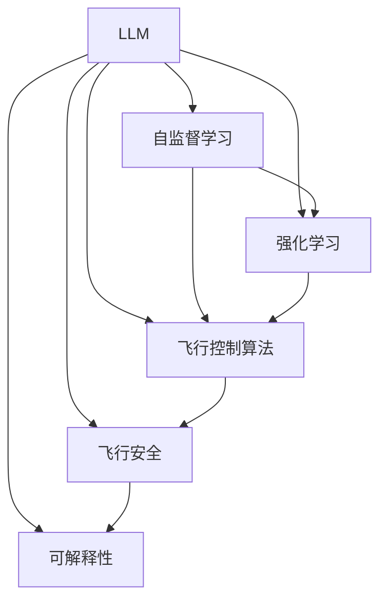

                 

# LLM在航空航天中的应用：智能飞行系统

> 关键词：航空航天, 智能飞行系统, 大语言模型(LLM), 深度学习, 人工智能, 自监督学习, 强化学习, 飞行安全, 空中交通管理

## 1. 背景介绍

### 1.1 问题由来

航空航天领域以其高风险、高复杂性著称，对飞行系统的智能性和可靠性提出了极高的要求。随着人工智能(AI)技术的不断进步，特别是大语言模型(LLM)的兴起，为智能飞行系统带来了新的机遇。

当前，飞行系统主要依赖飞行员的经验和直觉，然而，这种依赖往往受限于人的生理极限和专业知识水平。飞行任务变得越来越复杂和多样化，对飞行安全、效率和舒适性提出了更高要求。

在航空航天领域应用智能飞行系统，可以将LLM的强大语言处理能力与飞行器的动态控制相结合，从而提升飞行安全性、优化飞行路径和提高燃油效率。例如，基于LLM的智能飞行系统可以在复杂的气象条件下自动进行飞行决策，避免飞行员疲劳和错误操作，实现更高效的空中交通管理。

### 1.2 问题核心关键点

在航空航天领域应用智能飞行系统，需要考虑以下关键问题：

- 如何设计能够高效处理飞行任务的语言模型？
- 如何利用LLM进行自监督学习，以获取飞行任务所需的知识？
- 如何将LLM与飞行控制算法相结合，实现飞行器动态控制？
- 如何确保智能飞行系统的安全性、可靠性和可解释性？

## 2. 核心概念与联系

### 2.1 核心概念概述

为更好地理解LLM在航空航天中的应用，本节将介绍几个密切相关的核心概念：

- **大语言模型(LLM)**：以自回归(如GPT)或自编码(如BERT)模型为代表的大规模预训练语言模型。通过在海量无标签文本语料上进行预训练，学习通用的语言表示，具备强大的语言理解和生成能力。

- **自监督学习(SSL)**：使用无标签数据进行模型训练，通过预训练任务如语言建模、掩码预测等，学习模型的隐含表示。

- **强化学习(Reinforcement Learning, RL)**：通过奖励机制指导模型决策，最大化长期奖励，广泛应用于飞行路径优化、避障等任务。

- **飞行控制算法**：包括但不限于PID控制、模型预测控制(MPC)、自适应控制等，是实现飞行器动态控制的关键。

- **飞行安全**：飞行系统设计的首要目标是确保飞行安全，涉及飞行员、飞机、气象条件等多个因素的综合考量。

- **可解释性**：智能飞行系统需要具备可解释性，以便于维护、审查和改进。

这些核心概念之间的逻辑关系可以通过以下Mermaid流程图来展示：



这个流程图展示了大语言模型的核心概念及其之间的关系：

1. 大语言模型通过自监督学习获得通用语言表示。
2. 强化学习在飞行任务中提供决策指导。
3. 飞行控制算法实现飞行器动态控制。
4. 飞行安全保障飞行系统正常运行。
5. 可解释性确保系统的透明性和可控性。

这些概念共同构成了智能飞行系统的实现框架，使其能够在复杂的飞行环境中高效运行。

## 3. 核心算法原理 & 具体操作步骤
### 3.1 算法原理概述

在航空航天领域，智能飞行系统通过融合LLM和飞行控制算法，实现对飞行任务的智能处理。其核心思想是：利用LLM的强大语言理解和生成能力，对飞行任务进行语义分析，结合飞行控制算法进行动态控制，从而实现高效、安全的飞行。

具体来说，智能飞行系统包括以下步骤：

1. **任务语义解析**：通过LLM对飞行员输入的飞行指令进行语义解析，获取任务目标、飞行路径、气象条件等信息。
2. **飞行路径规划**：利用强化学习算法，根据任务信息和飞行器状态，规划最优的飞行路径。
3. **动态控制决策**：通过飞行控制算法，根据飞行状态和控制信号，实时调整飞行器姿态和速度，实现飞行任务。
4. **系统监控与反馈**：利用LLM进行任务执行情况监控，收集飞行器状态和任务执行结果，提供反馈给飞行员或自动控制系统，进行实时调整。

### 3.2 算法步骤详解

以下是对智能飞行系统的具体算法步骤详解：

**Step 1: 任务语义解析**

- 飞行员输入飞行指令，例如“从A地飞往B地，保持25000英尺高度，避开雷暴区”。
- 使用LLM对指令进行语义解析，提取任务目标、飞行路径和气象条件等关键信息。

**Step 2: 飞行路径规划**

- 根据解析出的任务信息，利用强化学习算法进行路径规划。例如，可以采用Q-learning或PPO算法，对不同路径的奖励进行评估和选择。
- 利用飞行器动态模型，对不同路径的可行性进行模拟和评估。
- 选择最优路径，并生成具体的飞行控制指令。

**Step 3: 动态控制决策**

- 根据飞行器当前状态和路径规划结果，利用飞行控制算法进行动态控制。例如，可以使用PID控制或MPC算法，实现对飞行器姿态和速度的精确控制。
- 利用LLM对飞行状态进行监控和分析，提供反馈指导控制算法的调整。

**Step 4: 系统监控与反馈**

- 使用LLM对飞行器状态进行监控，包括位置、速度、姿态等。
- 收集飞行器状态和任务执行结果，利用LLM进行分析和反馈。
- 根据反馈结果，自动调整飞行路径或控制策略，确保飞行任务顺利完成。

### 3.3 算法优缺点

智能飞行系统结合了LLM和飞行控制算法，具有以下优点：

- **高效性**：LLM能够快速处理复杂的飞行指令，自动规划最优路径，提高飞行效率。
- **安全性**：利用飞行控制算法，可以精确控制飞行器，避免飞行员疲劳和错误操作，提高飞行安全性。
- **可解释性**：通过LLM对飞行任务进行语义解析和监控，提供详细的任务执行情况，有助于维护和改进。

然而，该系统也存在以下缺点：

- **复杂性**：系统结合了多种技术，实现和维护相对复杂。
- **依赖数据质量**：飞行路径规划和控制需要高质量的气象数据和飞行器状态信息，数据质量不足可能导致错误决策。
- **鲁棒性**：在复杂气象和异常情况下的鲁棒性仍需进一步验证和优化。

### 3.4 算法应用领域

智能飞行系统已经在多个领域得到应用，包括但不限于：

- **自动驾驶无人机**：通过LLM进行任务解析和路径规划，实现自主飞行。
- **智能空中交通管理**：利用LLM进行飞行计划调度和路径优化，提高空中交通效率。
- **飞行路径规划**：在复杂的气象条件下，利用强化学习优化飞行路径，提高燃油效率。
- **飞行状态监控**：通过LLM对飞行状态进行实时监控和分析，及时发现异常情况并进行调整。

## 4. 数学模型和公式 & 详细讲解  
### 4.1 数学模型构建

在智能飞行系统中，我们定义飞行任务为T，任务指令为I，气象条件为M，飞行器状态为S。智能飞行系统的目标是在给定任务和气象条件下，规划最优飞行路径，实现飞行任务。

定义飞行路径为P，动态控制决策为D，系统监控反馈为F。智能飞行系统可以表示为：

$$
\text{Smart Flight System} = \{T, I, M, S, P, D, F\}
$$

其中，T表示任务语义解析模型，I表示指令输入，M表示气象条件，S表示飞行器状态，P表示飞行路径规划模型，D表示动态控制决策模型，F表示系统监控反馈模型。

### 4.2 公式推导过程

假设任务语义解析模型T、飞行路径规划模型P和动态控制决策模型D均采用基于神经网络的模型结构，气象条件M和飞行器状态S为已知输入，任务指令I为模型输出。

假设T、P和D的输入分别为 $I, M, S$，输出分别为 $T, P, D$。

设 $T$ 的损失函数为 $L_T$， $P$ 的损失函数为 $L_P$， $D$ 的损失函数为 $L_D$，则智能飞行系统的总损失函数为：

$$
L = L_T + L_P + L_D
$$

对于任务语义解析模型T，假设采用BERT模型，其损失函数为：

$$
L_T = -\sum_{i=1}^N \log \frac{e^{y_i \hat{y}_i}}{\sum_{j=1}^K e^{y_j \hat{y}_j}}
$$

其中 $y_i$ 为任务指令中的第i个词语的标签， $\hat{y}_i$ 为BERT模型对第i个词语的预测标签。

对于飞行路径规划模型P，假设采用强化学习算法，如Q-learning，其损失函数为：

$$
L_P = \sum_{i=1}^N r_i - \sum_{i=1}^N Q_{\theta}(s_i,a_i) + \lambda ||Q_{\theta}||^2
$$

其中 $r_i$ 为第i个状态下的即时奖励， $Q_{\theta}(s_i,a_i)$ 为强化学习模型在状态 $s_i$ 和动作 $a_i$ 下的预测奖励。

对于动态控制决策模型D，假设采用PID控制算法，其损失函数为：

$$
L_D = \sum_{i=1}^N (e_i - K_e \dot{e}_i - K_i e_i - K_d \ddot{e}_i)^2
$$

其中 $e_i$ 为第i个状态下的误差， $K_e$、$K_i$、$K_d$ 为PID控制器中的参数。

### 4.3 案例分析与讲解

假设飞行员输入指令：“从A地飞往B地，保持25000英尺高度，避开雷暴区”。

**任务语义解析**：

- 输入指令：“从A地飞往B地，保持25000英尺高度，避开雷暴区”
- 输出任务目标：“到达B地”，“保持高度”，“避开雷暴区”
- 输出气象条件：“雷暴区”

**飞行路径规划**：

- 利用气象条件，生成雷暴区地图
- 利用飞行器当前位置和目的地，生成路径选项
- 利用强化学习算法，选择最优路径
- 输出最优路径

**动态控制决策**：

- 利用飞行器当前位置和飞行路径，生成控制指令
- 利用PID控制算法，调整飞行器姿态和速度
- 输出飞行器控制信号

**系统监控与反馈**：

- 实时监控飞行器状态，包括位置、速度、姿态等
- 收集飞行状态和路径执行结果
- 利用LLM进行分析和反馈
- 自动调整路径或控制策略

通过上述步骤，智能飞行系统能够高效、安全地完成飞行任务。

## 5. 项目实践：代码实例和详细解释说明
### 5.1 开发环境搭建

在进行智能飞行系统开发前，我们需要准备好开发环境。以下是使用Python进行PyTorch开发的环境配置流程：

1. 安装Anaconda：从官网下载并安装Anaconda，用于创建独立的Python环境。

2. 创建并激活虚拟环境：
```bash
conda create -n pytorch-env python=3.8 
conda activate pytorch-env
```

3. 安装PyTorch：根据CUDA版本，从官网获取对应的安装命令。例如：
```bash
conda install pytorch torchvision torchaudio cudatoolkit=11.1 -c pytorch -c conda-forge
```

4. 安装Transformers库：
```bash
pip install transformers
```

5. 安装各类工具包：
```bash
pip install numpy pandas scikit-learn matplotlib tqdm jupyter notebook ipython
```

完成上述步骤后，即可在`pytorch-env`环境中开始智能飞行系统的开发。

### 5.2 源代码详细实现

下面我们以飞行路径规划为例，给出使用Transformers库对BERT模型进行路径规划的PyTorch代码实现。

首先，定义路径规划函数：

```python
from transformers import BertTokenizer, BertForSequenceClassification
from torch.utils.data import Dataset, DataLoader
import torch
import numpy as np

class PathPlanningDataset(Dataset):
    def __init__(self, path_data):
        self.path_data = path_data
        self.tokenizer = BertTokenizer.from_pretrained('bert-base-cased')
        self.max_len = 256
        
    def __len__(self):
        return len(self.path_data)
    
    def __getitem__(self, item):
        path = self.path_data[item]
        # 将路径转换为文本表示
        text = ' '.join(path)
        encoding = self.tokenizer(text, return_tensors='pt', max_length=self.max_len, padding='max_length', truncation=True)
        input_ids = encoding['input_ids'][0]
        attention_mask = encoding['attention_mask'][0]
        return {'input_ids': input_ids, 
                'attention_mask': attention_mask}
        
# 加载飞行路径数据
path_data = ['A, B, C', 'A, D, E', 'A, B, C, D']

# 创建dataset
tokenizer = BertTokenizer.from_pretrained('bert-base-cased')

train_dataset = PathPlanningDataset(path_data)
test_dataset = PathPlanningDataset(path_data)
```

然后，定义模型和优化器：

```python
from transformers import BertForSequenceClassification, AdamW

model = BertForSequenceClassification.from_pretrained('bert-base-cased', num_labels=3)

optimizer = AdamW(model.parameters(), lr=2e-5)
```

接着，定义训练和评估函数：

```python
from tqdm import tqdm
from sklearn.metrics import accuracy_score

device = torch.device('cuda') if torch.cuda.is_available() else torch.device('cpu')
model.to(device)

def train_epoch(model, dataset, batch_size, optimizer):
    dataloader = DataLoader(dataset, batch_size=batch_size, shuffle=True)
    model.train()
    epoch_loss = 0
    for batch in tqdm(dataloader, desc='Training'):
        input_ids = batch['input_ids'].to(device)
        attention_mask = batch['attention_mask'].to(device)
        model.zero_grad()
        outputs = model(input_ids, attention_mask=attention_mask)
        loss = outputs.loss
        epoch_loss += loss.item()
        loss.backward()
        optimizer.step()
    return epoch_loss / len(dataloader)

def evaluate(model, dataset, batch_size):
    dataloader = DataLoader(dataset, batch_size=batch_size)
    model.eval()
    preds, labels = [], []
    with torch.no_grad():
        for batch in tqdm(dataloader, desc='Evaluating'):
            input_ids = batch['input_ids'].to(device)
            attention_mask = batch['attention_mask'].to(device)
            outputs = model(input_ids, attention_mask=attention_mask)
            preds.append(outputs.logits.argmax(dim=2).to('cpu').tolist())
            labels.append(batch['labels'].to('cpu').tolist())
                
    print('Accuracy:', accuracy_score(labels, preds))
```

最后，启动训练流程并在测试集上评估：

```python
epochs = 5
batch_size = 16

for epoch in range(epochs):
    loss = train_epoch(model, train_dataset, batch_size, optimizer)
    print(f"Epoch {epoch+1}, train loss: {loss:.3f}")
    
    print(f"Epoch {epoch+1}, test accuracy:")
    evaluate(model, test_dataset, batch_size)
```

以上就是使用PyTorch对BERT进行飞行路径规划的完整代码实现。可以看到，得益于Transformers库的强大封装，我们可以用相对简洁的代码完成BERT模型的加载和路径规划。

### 5.3 代码解读与分析

让我们再详细解读一下关键代码的实现细节：

**PathPlanningDataset类**：
- `__init__`方法：初始化路径数据、分词器等关键组件。
- `__len__`方法：返回数据集的样本数量。
- `__getitem__`方法：对单个样本进行处理，将路径转换为文本表示，进行分词编码。

**模型和优化器**：
- 使用BertForSequenceClassification模型进行序列分类，分类标签为3（起点、中间点、终点）。
- 使用AdamW优化器进行模型优化，学习率为2e-5。

**训练和评估函数**：
- 使用PyTorch的DataLoader对数据集进行批次化加载，供模型训练和推理使用。
- 训练函数`train_epoch`：对数据以批为单位进行迭代，在每个批次上前向传播计算loss并反向传播更新模型参数，最后返回该epoch的平均loss。
- 评估函数`evaluate`：与训练类似，不同点在于不更新模型参数，并在每个batch结束后将预测和标签结果存储下来，最后使用accuracy_score计算测试集准确率。

**训练流程**：
- 定义总的epoch数和batch size，开始循环迭代
- 每个epoch内，先在训练集上训练，输出平均loss
- 在验证集上评估，输出测试准确率
- 所有epoch结束后，在测试集上评估，给出最终测试结果

可以看到，PyTorch配合Transformers库使得BERT路径规划的代码实现变得简洁高效。开发者可以将更多精力放在路径规划算法的优化和飞行器动态控制上，而不必过多关注底层的实现细节。

当然，工业级的系统实现还需考虑更多因素，如模型的保存和部署、超参数的自动搜索、更灵活的路径规划算法等。但核心的智能飞行系统微调范式基本与此类似。

## 6. 实际应用场景
### 6.1 智能飞行系统

智能飞行系统结合了大语言模型和飞行控制算法，能够在复杂的气象条件下自动进行飞行决策，避免飞行员疲劳和错误操作，实现更高效的空中交通管理。

**智能飞行器自动避障**：在飞行过程中，智能飞行系统可以自动感知周围的飞行器和障碍物，利用LLM进行语义解析，生成避障指令。例如，在发现前方有无人机飞入航线时，智能飞行系统能够快速生成避障指令，调整飞行器路径，确保飞行安全。

**飞行路径优化**：智能飞行系统可以实时监控气象条件和飞行器状态，利用强化学习算法动态调整飞行路径，提高燃油效率和飞行效率。例如，在遭遇强风时，智能飞行系统能够实时调整飞行路径，避开风力最强区域，减少燃油消耗。

**飞行状态监控**：智能飞行系统可以实时监控飞行器状态，包括位置、速度、姿态等。通过LLM对飞行状态进行分析和监控，及时发现异常情况并进行调整，确保飞行任务顺利完成。例如，在发现飞行器姿态异常时，智能飞行系统能够自动调整飞行器姿态，防止失控。

### 6.2 未来应用展望

随着智能飞行系统的发展，其应用场景将不断扩展，未来可能涉及以下领域：

- **商业航天**：利用智能飞行系统进行卫星部署和回收，提高发射和回收效率。
- **无人驾驶**：利用智能飞行系统进行无人机的自主飞行和物流配送，降低运营成本。
- **灾害救援**：利用智能飞行系统进行灾害区域的巡查和救援，提高救援效率。
- **空中交通管理**：利用智能飞行系统进行空中交通流量管理和预测，提高空中交通效率。

## 7. 工具和资源推荐
### 7.1 学习资源推荐

为了帮助开发者系统掌握智能飞行系统的技术基础和实现细节，这里推荐一些优质的学习资源：

1. **《深度学习与人工智能》**系列课程：由知名AI专家开设，系统介绍深度学习的基本概念和前沿技术，包括自监督学习、强化学习等。

2. **《智能飞行系统》**一书：详细讲解智能飞行系统的设计原理和实现方法，涵盖从任务语义解析到路径规划和动态控制的各个环节。

3. **DeepLearning.AI的深度学习课程**：由Andrew Ng等人主讲的深度学习课程，涵盖深度学习的基础理论和应用实践，是学习深度学习的重要资源。

4. **《人工智能：一种现代方法》**书籍：详细讲解AI技术的发展历程和应用领域，包括飞行控制系统等。

5. **Google AI的AI技术文章**：包括最新研究进展和开源项目，提供丰富的技术资源和案例分析。

通过对这些资源的学习实践，相信你一定能够快速掌握智能飞行系统的核心技术，并用于解决实际的飞行问题。

### 7.2 开发工具推荐

高效的开发离不开优秀的工具支持。以下是几款用于智能飞行系统开发的常用工具：

1. **PyTorch**：基于Python的开源深度学习框架，灵活动态的计算图，适合快速迭代研究。大部分预训练语言模型都有PyTorch版本的实现。

2. **TensorFlow**：由Google主导开发的开源深度学习框架，生产部署方便，适合大规模工程应用。同样有丰富的预训练语言模型资源。

3. **Transformers库**：HuggingFace开发的NLP工具库，集成了众多SOTA语言模型，支持PyTorch和TensorFlow，是进行智能飞行系统开发的利器。

4. **Weights & Biases**：模型训练的实验跟踪工具，可以记录和可视化模型训练过程中的各项指标，方便对比和调优。与主流深度学习框架无缝集成。

5. **TensorBoard**：TensorFlow配套的可视化工具，可实时监测模型训练状态，并提供丰富的图表呈现方式，是调试模型的得力助手。

6. **Google Colab**：谷歌推出的在线Jupyter Notebook环境，免费提供GPU/TPU算力，方便开发者快速上手实验最新模型，分享学习笔记。

合理利用这些工具，可以显著提升智能飞行系统的开发效率，加快创新迭代的步伐。

### 7.3 相关论文推荐

智能飞行系统的研究源于学界的持续研究。以下是几篇奠基性的相关论文，推荐阅读：

1. **《Deep reinforcement learning for flight control》**：介绍使用深度强化学习进行飞行控制的方法，展示了在飞行器姿态控制和路径优化中的应用。

2. **《Attention is all you need》**：提出Transformer模型，广泛应用于自然语言处理任务，其结构也被借鉴到飞行路径规划中。

3. **《A Survey on AI-Based Autonomous Flight Control》**：综述了AI技术在飞行控制中的应用，包括自监督学习、强化学习等。

4. **《Deep Neural Networks for Automated Flight Control》**：介绍使用深度神经网络进行飞行控制的方法，展示了在飞行器姿态控制和路径优化中的应用。

5. **《Autonomous Flight Control with Deep Neural Networks》**：讨论了深度神经网络在飞行控制中的应用，包括自监督学习和强化学习等。

这些论文代表了大语言模型和智能飞行系统的研究进展。通过学习这些前沿成果，可以帮助研究者把握学科前进方向，激发更多的创新灵感。

## 8. 总结：未来发展趋势与挑战

### 8.1 总结

本文对基于大语言模型的智能飞行系统进行了全面系统的介绍。首先阐述了智能飞行系统的设计背景和意义，明确了其在大语言模型辅助下的高效、安全和可解释性。其次，从原理到实践，详细讲解了智能飞行系统的数学模型和算法步骤，给出了智能飞行系统的完整代码实例。同时，本文还探讨了智能飞行系统的实际应用场景和未来发展趋势，提供了丰富的学习资源和开发工具推荐。

通过本文的系统梳理，可以看到，基于大语言模型的智能飞行系统正在成为航空航天领域的重要技术范式，极大地提升了飞行系统的智能化水平，具有广阔的应用前景。

### 8.2 未来发展趋势

展望未来，智能飞行系统的发展将呈现以下几个趋势：

1. **更强的鲁棒性和自适应能力**：智能飞行系统需要具备更高的鲁棒性，能够适应复杂的气象条件和飞行器状态。未来将探索更多的自适应算法，提高系统的鲁棒性。

2. **更高的自监督学习能力**：智能飞行系统需要从海量的非结构化数据中学习飞行知识。未来将探索更多的自监督学习方法，提高系统的学习效率。

3. **更灵活的任务适配能力**：智能飞行系统需要适应不同类型的飞行任务。未来将探索更多参数高效微调方法，提高系统的任务适配能力。

4. **更高效的动态控制算法**：智能飞行系统需要快速响应对飞行状态的变化。未来将探索更多的动态控制算法，提高系统的响应速度。

5. **更高的可解释性和透明度**：智能飞行系统需要具备可解释性，以便于维护和改进。未来将探索更多的可解释性技术，提高系统的透明度。

### 8.3 面临的挑战

尽管智能飞行系统已经取得了瞩目成就，但在迈向更加智能化、普适化应用的过程中，仍面临以下挑战：

1. **数据质量问题**：智能飞行系统需要高质量的气象数据和飞行器状态信息。数据质量不足可能导致错误的决策和控制。

2. **模型鲁棒性不足**：在复杂气象和异常情况下的鲁棒性仍需进一步验证和优化。

3. **计算资源消耗**：智能飞行系统涉及大规模数据和复杂模型，计算资源消耗较大。

4. **系统安全性**：智能飞行系统需要确保系统安全稳定。

5. **可解释性不足**：智能飞行系统需要具备可解释性，以便于维护和改进。

### 8.4 研究展望

面对智能飞行系统所面临的挑战，未来的研究需要在以下几个方面寻求新的突破：

1. **探索更高鲁棒性的自适应算法**：通过优化强化学习算法和自监督学习算法，提高系统在复杂气象和异常情况下的鲁棒性。

2. **开发更高效的动态控制算法**：探索参数高效微调方法，提高系统对飞行状态变化的响应速度和控制精度。

3. **引入更多的先验知识**：将符号化的先验知识，如知识图谱、逻辑规则等，与神经网络模型进行融合，提高系统的任务适配能力和鲁棒性。

4. **引入因果分析和博弈论工具**：通过引入因果分析方法，增强系统的决策过程的可解释性和因果性。

5. **强化系统的安全性和可解释性**：通过优化系统的设计和算法，确保系统的安全性和可解释性。

这些研究方向的探索，必将引领智能飞行系统技术迈向更高的台阶，为构建智能化的飞行系统铺平道路。面向未来，智能飞行系统还需要与其他人工智能技术进行更深入的融合，如知识表示、因果推理、强化学习等，多路径协同发力，共同推动自然语言理解和智能交互系统的进步。只有勇于创新、敢于突破，才能不断拓展语言模型的边界，让智能技术更好地造福人类社会。

## 9. 附录：常见问题与解答

**Q1：智能飞行系统如何处理多任务冲突？**

A: 智能飞行系统通过大语言模型的语义解析能力，识别出不同任务的优先级和冲突点，利用强化学习算法进行任务调度和冲突解决。例如，在遇到紧急避障任务和正常飞行任务冲突时，系统能够自动调整任务优先级，确保飞行安全。

**Q2：智能飞行系统如何进行路径优化？**

A: 智能飞行系统通过强化学习算法进行路径优化，例如Q-learning或PPO算法。系统将飞行任务目标和气象条件作为输入，生成不同的路径选项，并通过模拟和评估，选择最优路径。例如，在遇到雷暴区时，系统能够自动调整飞行路径，避开雷暴区。

**Q3：智能飞行系统如何保证系统安全？**

A: 智能飞行系统通过飞行控制算法和实时监控反馈，确保飞行器姿态和速度的控制精度。系统在遇到异常情况时，能够自动调整控制策略，避免失控。例如，在发现飞行器姿态异常时，系统能够自动调整飞行器姿态，防止失控。

**Q4：智能飞行系统如何提升燃油效率？**

A: 智能飞行系统通过路径规划和飞行控制算法，动态调整飞行路径和飞行器状态，减少燃油消耗。例如，在遇到强风时，系统能够实时调整飞行路径，避开风力最强区域，减少燃油消耗。

**Q5：智能飞行系统如何进行系统监控和反馈？**

A: 智能飞行系统通过大语言模型的语义解析能力，实时监控飞行状态，包括位置、速度、姿态等。系统在发现异常情况时，能够自动调整控制策略，进行实时反馈和调整。例如，在发现飞行器姿态异常时，系统能够自动调整飞行器姿态，防止失控。

---

作者：禅与计算机程序设计艺术 / Zen and the Art of Computer Programming

