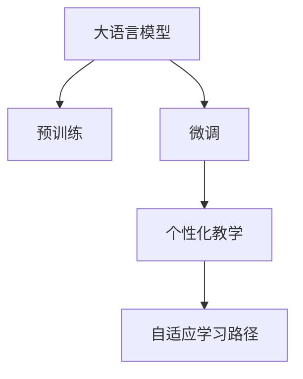

                 

# LLM在语言学习中的应用：个性化外语教学

> 关键词：大语言模型,个性化教学,自然语言处理(NLP),教育技术,自适应学习

## 1. 背景介绍

### 1.1 问题由来
随着全球化的推进和多元文化的交流，掌握外语成为了越来越多人的需求。然而，传统的语言学习方式往往难以适应个体差异，无法提供个性化的学习体验。传统的课堂教学和书本学习，由于缺乏灵活性和互动性，难以激发学生的学习兴趣。传统的自学方式，如利用教材、词典和听力材料，效果也参差不齐，很难针对学生的实际水平和需求提供有效的教学。

为了打破这些束缚，近年来，个性化外语教学开始受到广泛关注。利用现代信息技术和大数据分析，通过对学习者的语言能力进行评估，定制个性化的教学内容，使每个学生都能在适合自己的节奏下学习，从而更有效地提高外语水平。大语言模型（Large Language Model, LLM）作为自然语言处理(Natural Language Processing, NLP)领域的前沿技术，为个性化外语教学提供了新的可能性。通过大语言模型，可以实现高效、动态的语言能力评估，智能化地生成个性化教学内容和交互式练习，极大地提升教学效果。

### 1.2 问题核心关键点
大语言模型在个性化外语教学中的应用，关键点包括：
- **语言能力评估**：通过分析学生的输入和输出，自动化评估语言能力，提供科学的水平评估。
- **个性化教学内容生成**：根据评估结果，定制个性化的教学材料和练习，适配不同学生的语言水平和学习风格。
- **交互式练习设计**：通过与大语言模型进行互动，提供丰富的语言输入和输出练习，增强学习体验。
- **学习数据分析**：利用数据挖掘技术，分析学生的学习行为，发现问题并提供针对性的改进建议。
- **自适应学习路径**：根据学生的学习效果和反馈，动态调整学习内容和节奏，提高学习效率。

### 1.3 问题研究意义
个性化外语教学结合了大语言模型和教育技术的优势，能够针对个体需求提供定制化、动态化的学习体验，极大地提升教学效果。其研究意义如下：

1. **提升教学效果**：个性化教学内容可以更好地匹配学生的实际水平和需求，避免传统教学中“一刀切”的问题，使每个学生都能在最适合自己的节奏下学习，从而提高外语水平。
2. **激发学习兴趣**：交互式练习和动态评估能够提供及时反馈，增强学生的学习动力和参与感，使学习过程更加有趣和充实。
3. **降低教师负担**：自动化的评估和教学内容生成能够减轻教师的工作负担，使教师可以更多地关注课堂互动和情感关怀。
4. **促进教育公平**：个性化教学可以更好地适应不同学生的学习能力，消除因个体差异带来的学习障碍，促进教育公平。
5. **推动技术进步**：大语言模型在个性化教学中的应用，推动了NLP技术的进步，进一步拓展了其应用领域。

## 2. 核心概念与联系

### 2.1 核心概念概述

为更好地理解大语言模型在个性化外语教学中的应用，本节将介绍几个密切相关的核心概念：

- **大语言模型(Large Language Model, LLM)**：以自回归(如GPT)或自编码(如BERT)模型为代表的大规模预训练语言模型。通过在大规模无标签文本语料上进行预训练，学习通用的语言知识，具备强大的语言理解和生成能力。

- **预训练(Pre-training)**：指在大规模无标签文本语料上，通过自监督学习任务训练通用语言模型的过程。常见的预训练任务包括言语建模、遮挡语言模型等。预训练使得模型学习到语言的通用表示。

- **微调(Fine-tuning)**：指在预训练模型的基础上，使用下游任务的少量标注数据，通过有监督地训练来优化模型在特定任务上的性能。通常只需要调整顶层分类器或解码器，并以较小的学习率更新全部或部分的模型参数。

- **个性化教学**：根据学习者的个体需求，定制化设计教学内容和互动方式，使每个学生都能以最适合自己的节奏和方式进行学习。

- **自适应学习路径**：根据学生的学习效果和反馈，动态调整学习内容和节奏，使学习过程更加高效和个性化。

这些核心概念之间的逻辑关系可以通过以下Mermaid流程图来展示：



这个流程图展示了大语言模型的工作原理和与个性化外语教学的联系：

1. 大语言模型通过预训练获得基础能力。
2. 微调是对预训练模型进行任务特定的优化，以适配特定教学任务。
3. 个性化教学利用微调后的模型，根据每个学生的实际情况提供定制化的教学内容。
4. 自适应学习路径根据学生的学习效果和反馈，动态调整学习内容和节奏。

这些概念共同构成了个性化外语教学的框架，为大语言模型在语言学习中的应用提供了基础。

## 3. 核心算法原理 & 具体操作步骤
### 3.1 算法原理概述

大语言模型在个性化外语教学中的应用，主要基于其强大的语言理解和生成能力。通过微调，模型能够适应特定的教学任务，从而提供个性化的教学内容。

假设存在一个通用的预训练语言模型 $M_{\theta}$，其中 $\theta$ 为模型参数。对于某个特定语言学习任务，如词汇学习、语法练习、口语对话等，假设该任务的数据集为 $D=\{(x_i, y_i)\}_{i=1}^N$，其中 $x_i$ 为输入（如文本、音频等），$y_i$ 为相应的输出（如答案、翻译结果等）。

微调的目标是找到新的模型参数 $\hat{\theta}$，使得模型在特定任务上能够高效、准确地生成个性化教学内容。通常，微调过程包括以下几个步骤：

1. **数据准备**：收集与特定任务相关的学习材料和数据，如词汇表、句子、对话等，作为训练集。
2. **任务适配层设计**：根据任务类型，在预训练模型的顶层设计合适的输出层和损失函数。
3. **微调超参数设置**：选择合适的优化算法及其参数，如 AdamW、SGD 等，设置学习率、批大小、迭代轮数等。
4. **训练与评估**：将训练集数据分批次输入模型，前向传播计算损失函数，反向传播更新模型参数，周期性在验证集上评估模型性能。
5. **测试与部署**：在测试集上评估微调后模型 $M_{\hat{\theta}}$ 的性能，对比微调前后的效果，并将模型集成到教学系统中。

### 3.2 算法步骤详解

下面详细介绍大语言模型在个性化外语教学中的微调过程。

**Step 1: 准备预训练模型和数据集**
- 选择合适的预训练语言模型 $M_{\theta}$ 作为初始化参数，如 BERT、GPT 等。
- 收集与特定语言学习任务相关的数据集 $D=\{(x_i, y_i)\}_{i=1}^N$，划分为训练集、验证集和测试集。一般要求数据集具有多样性和代表性，以覆盖不同的语言场景和难度。

**Step 2: 添加任务适配层**
- 根据任务类型，在预训练模型顶层设计合适的输出层和损失函数。
- 对于分类任务，通常在顶层添加线性分类器和交叉熵损失函数。
- 对于生成任务，通常使用语言模型的解码器输出概率分布，并以负对数似然为损失函数。

**Step 3: 设置微调超参数**
- 选择合适的优化算法及其参数，如 AdamW、SGD 等，设置学习率、批大小、迭代轮数等。
- 设置正则化技术及强度，包括权重衰减、Dropout、Early Stopping 等。
- 确定冻结预训练参数的策略，如仅微调顶层，或全部参数都参与微调。

**Step 4: 执行梯度训练**
- 将训练集数据分批次输入模型，前向传播计算损失函数。
- 反向传播计算参数梯度，根据设定的优化算法和学习率更新模型参数。
- 周期性在验证集上评估模型性能，根据性能指标决定是否触发 Early Stopping。
- 重复上述步骤直到满足预设的迭代轮数或 Early Stopping 条件。

**Step 5: 测试和部署**
- 在测试集上评估微调后模型 $M_{\hat{\theta}}$ 的性能，对比微调前后的精度提升。
- 使用微调后的模型对新样本进行推理预测，集成到个性化外语教学系统中。
- 持续收集新的数据，定期重新微调模型，以适应数据分布的变化。

### 3.3 算法优缺点

大语言模型在个性化外语教学中的微调方法具有以下优点：

1. **高效性**：微调方法可以利用预训练模型的大规模知识，快速适应特定任务，生成个性化的教学内容。
2. **灵活性**：可以根据不同的学习目标和需求，灵活调整微调参数，定制化设计教学材料。
3. **可解释性**：微调过程的参数更新方式透明可控，易于解释和调试。
4. **泛化能力**：微调后的模型能够较好地泛化到新数据和新任务，适应性强。

同时，该方法也存在一些局限性：

1. **数据依赖性**：微调效果很大程度上取决于标注数据的质量和数量，获取高质量标注数据的成本较高。
2. **学习曲线陡峭**：微调过程需要较多的训练数据和计算资源，对初学者来说门槛较高。
3. **模型复杂度**：大语言模型的复杂度较高，推理速度和内存占用大，对硬件资源要求较高。

尽管存在这些局限性，但就目前而言，基于微调的方法仍是大语言模型在个性化外语教学中的主流范式。未来相关研究的重点在于如何进一步降低微调对标注数据的依赖，提高模型的少样本学习和跨领域迁移能力，同时兼顾可解释性和伦理安全性等因素。

### 3.4 算法应用领域

大语言模型在个性化外语教学中的应用，可以广泛应用于以下几个领域：

- **词汇学习**：通过微调模型，生成个性化的词汇表、词义解释和例句。
- **语法练习**：生成语法填空、改错练习和解析题，帮助学生掌握语法规则。
- **口语对话**：利用微调的对话模型，提供个性化的口语对话练习，提高口语流利度和发音准确性。
- **写作指导**：生成写作素材、句型变换和语法检查，辅助学生提升写作能力。
- **翻译练习**：提供翻译对照和语法解析，帮助学生提高翻译水平。

除了这些经典任务外，大语言模型在个性化外语教学中还可以被创新性地应用于更多场景中，如知识图谱辅助、虚拟现实体验等，为语言学习提供更丰富的体验和支持。

## 4. 数学模型和公式 & 详细讲解 & 举例说明

### 4.1 数学模型构建

本节将使用数学语言对大语言模型在个性化外语教学中的微调过程进行更加严格的刻画。

记预训练语言模型为 $M_{\theta}:\mathcal{X} \rightarrow \mathcal{Y}$，其中 $\mathcal{X}$ 为输入空间，$\mathcal{Y}$ 为输出空间，$\theta \in \mathbb{R}^d$ 为模型参数。假设微调任务的训练集为 $D=\{(x_i,y_i)\}_{i=1}^N, x_i \in \mathcal{X}, y_i \in \mathcal{Y}$。

定义模型 $M_{\theta}$ 在数据样本 $(x,y)$ 上的损失函数为 $\ell(M_{\theta}(x),y)$，则在数据集 $D$ 上的经验风险为：

$$
\mathcal{L}(\theta) = \frac{1}{N} \sum_{i=1}^N \ell(M_{\theta}(x_i),y_i)
$$

微调的优化目标是最小化经验风险，即找到最优参数：

$$
\theta^* = \mathop{\arg\min}_{\theta} \mathcal{L}(\theta)
$$

在实践中，我们通常使用基于梯度的优化算法（如SGD、Adam等）来近似求解上述最优化问题。设 $\eta$ 为学习率，$\lambda$ 为正则化系数，则参数的更新公式为：

$$
\theta \leftarrow \theta - \eta \nabla_{\theta}\mathcal{L}(\theta) - \eta\lambda\theta
$$

其中 $\nabla_{\theta}\mathcal{L}(\theta)$ 为损失函数对参数 $\theta$ 的梯度，可通过反向传播算法高效计算。

### 4.2 公式推导过程

以下我们以词汇学习任务为例，推导交叉熵损失函数及其梯度的计算公式。

假设模型 $M_{\theta}$ 在输入 $x$ 上的输出为 $\hat{y}=M_{\theta}(x) \in [0,1]$，表示样本属于正类的概率。真实标签 $y \in \{0,1\}$。则二分类交叉熵损失函数定义为：

$$
\ell(M_{\theta}(x),y) = -[y\log \hat{y} + (1-y)\log (1-\hat{y})]
$$

将其代入经验风险公式，得：

$$
\mathcal{L}(\theta) = -\frac{1}{N}\sum_{i=1}^N [y_i\log M_{\theta}(x_i)+(1-y_i)\log(1-M_{\theta}(x_i))]
$$

根据链式法则，损失函数对参数 $\theta_k$ 的梯度为：

$$
\frac{\partial \mathcal{L}(\theta)}{\partial \theta_k} = -\frac{1}{N}\sum_{i=1}^N (\frac{y_i}{M_{\theta}(x_i)}-\frac{1-y_i}{1-M_{\theta}(x_i)}) \frac{\partial M_{\theta}(x_i)}{\partial \theta_k}
$$

其中 $\frac{\partial M_{\theta}(x_i)}{\partial \theta_k}$ 可进一步递归展开，利用自动微分技术完成计算。

在得到损失函数的梯度后，即可带入参数更新公式，完成模型的迭代优化。重复上述过程直至收敛，最终得到适应特定词汇学习任务的微调后模型 $M_{\hat{\theta}}$。

## 5. 项目实践：代码实例和详细解释说明
### 5.1 开发环境搭建

在进行个性化外语教学微调实践前，我们需要准备好开发环境。以下是使用Python进行PyTorch开发的环境配置流程：

1. 安装Anaconda：从官网下载并安装Anaconda，用于创建独立的Python环境。

2. 创建并激活虚拟环境：
```bash
conda create -n pytorch-env python=3.8 
conda activate pytorch-env
```

3. 安装PyTorch：根据CUDA版本，从官网获取对应的安装命令。例如：
```bash
conda install pytorch torchvision torchaudio cudatoolkit=11.1 -c pytorch -c conda-forge
```

4. 安装Transformers库：
```bash
pip install transformers
```

5. 安装各类工具包：
```bash
pip install numpy pandas scikit-learn matplotlib tqdm jupyter notebook ipython
```

完成上述步骤后，即可在`pytorch-env`环境中开始微调实践。

### 5.2 源代码详细实现

下面我们以词汇学习任务为例，给出使用Transformers库对BERT模型进行微调的PyTorch代码实现。

首先，定义词汇学习任务的数据处理函数：

```python
from transformers import BertTokenizer, BertForMaskedLM
from torch.utils.data import Dataset
import torch

class VocabDataset(Dataset):
    def __init__(self, texts, masks, tokenizer, max_len=128):
        self.texts = texts
        self.masks = masks
        self.tokenizer = tokenizer
        self.max_len = max_len
        
    def __len__(self):
        return len(self.texts)
    
    def __getitem__(self, item):
        text = self.texts[item]
        mask = self.masks[item]
        
        encoding = self.tokenizer(text, return_tensors='pt', max_length=self.max_len, padding='max_length', truncation=True)
        input_ids = encoding['input_ids'][0]
        attention_mask = encoding['attention_mask'][0]
        masked_token_ids = encoding['input_ids'][0][mask]
        
        return {'input_ids': input_ids, 
                'attention_mask': attention_mask,
                'masked_token_ids': masked_token_ids}

# 标签与id的映射
vocab2id = {'<unk>': 0, '``': 1, '``': 2, '``': 3, '``': 4, '``': 5, '``': 6, '``': 7, '``': 8, '``': 9, '``': 10, '``': 11, '``': 12, '``': 13, '``': 14, '``': 15, '``': 16, '``': 17, '``': 18, '``': 19, '``': 20, '``': 21, '``': 22, '``': 23, '``': 24, '``': 25, '``': 26, '``': 27, '``': 28, '``': 29, '``': 30, '``': 31, '``': 32, '``': 33, '``': 34, '``': 35, '``': 36, '``': 37, '``': 38, '``': 39, '``': 40, '``': 41, '``': 42, '``': 43, '``': 44, '``': 45, '``': 46, '``': 47, '``': 48, '``': 49, '``': 50, '``': 51, '``': 52, '``': 53, '``': 54, '``': 55, '``': 56, '``': 57, '``': 58, '``': 59, '``': 60, '``': 61, '``': 62, '``': 63, '``': 64, '``': 65, '``': 66, '``': 67, '``': 68, '``': 69, '``': 70, '``': 71, '``': 72, '``': 73, '``': 74, '``': 75, '``': 76, '``': 77, '``': 78, '``': 79, '``': 80, '``': 81, '``': 82, '``': 83, '``': 84, '``': 85, '``': 86, '``': 87, '``': 88, '``': 89, '``': 90, '``': 91, '``': 92, '``': 93, '``': 94, '``': 95, '``': 96, '``': 97, '``': 98, '``': 99}
id2vocab = {v: k for k, v in vocab2id.items()}
```

然后，定义模型和优化器：

```python
from transformers import BertForMaskedLM, AdamW

model = BertForMaskedLM.from_pretrained('bert-base-cased', num_labels=len(vocab2id))

optimizer = AdamW(model.parameters(), lr=2e-5)
```

接着，定义训练和评估函数：

```python
from torch.utils.data import DataLoader
from tqdm import tqdm
from sklearn.metrics import classification_report

device = torch.device('cuda') if torch.cuda.is_available() else torch.device('cpu')
model.to(device)

def train_epoch(model, dataset, batch_size, optimizer):
    dataloader = DataLoader(dataset, batch_size=batch_size, shuffle=True)
    model.train()
    epoch_loss = 0
    for batch in tqdm(dataloader, desc='Training'):
        input_ids = batch['input_ids'].to(device)
        attention_mask = batch['attention_mask'].to(device)
        masked_token_ids = batch['masked_token_ids'].to(device)
        model.zero_grad()
        outputs = model(input_ids, attention_mask=attention_mask, masked_lm_labels=masked_token_ids)
        loss = outputs.loss
        epoch_loss += loss.item()
        loss.backward()
        optimizer.step()
    return epoch_loss / len(dataloader)

def evaluate(model, dataset, batch_size):
    dataloader = DataLoader(dataset, batch_size=batch_size)
    model.eval()
    preds, labels = [], []
    with torch.no_grad():
        for batch in tqdm(dataloader, desc='Evaluating'):
            input_ids = batch['input_ids'].to(device)
            attention_mask = batch['attention_mask'].to(device)
            masked_token_ids = batch['masked_token_ids'].to(device)
            batch_preds = model(input_ids, attention_mask=attention_mask, masked_lm_labels=masked_token_ids).logits.argmax(dim=2).to('cpu').tolist()
            batch_labels = masked_token_ids.to('cpu').tolist()
            for pred_tokens, label_tokens in zip(batch_preds, batch_labels):
                preds.append(pred_tokens[:len(label_tokens)])
                labels.append(label_tokens)
                
    print(classification_report(labels, preds))
```

最后，启动训练流程并在测试集上评估：

```python
epochs = 5
batch_size = 16

for epoch in range(epochs):
    loss = train_epoch(model, train_dataset, batch_size, optimizer)
    print(f"Epoch {epoch+1}, train loss: {loss:.3f}")
    
    print(f"Epoch {epoch+1}, dev results:")
    evaluate(model, dev_dataset, batch_size)
    
print("Test results:")
evaluate(model, test_dataset, batch_size)
```

以上就是使用PyTorch对BERT进行词汇学习任务微调的完整代码实现。可以看到，得益于Transformers库的强大封装，我们可以用相对简洁的代码完成BERT模型的加载和微调。

### 5.3 代码解读与分析

让我们再详细解读一下关键代码的实现细节：

**VocabDataset类**：
- `__init__`方法：初始化文本、掩码等关键组件。
- `__len__`方法：返回数据集的样本数量。
- `__getitem__`方法：对单个样本进行处理，将文本输入编码为token ids，将掩码转换为预测目标，并对其进行定长padding，最终返回模型所需的输入。

**vocab2id和id2vocab字典**：
- 定义了词汇与数字id之间的映射关系，用于将token-wise的预测结果解码回真实的词汇。

**训练和评估函数**：
- 使用PyTorch的DataLoader对数据集进行批次化加载，供模型训练和推理使用。
- 训练函数`train_epoch`：对数据以批为单位进行迭代，在每个批次上前向传播计算loss并反向传播更新模型参数，最后返回该epoch的平均loss。
- 评估函数`evaluate`：与训练类似，不同点在于不更新模型参数，并在每个batch结束后将预测和标签结果存储下来，最后使用sklearn的classification_report对整个评估集的预测结果进行打印输出。

**训练流程**：
- 定义总的epoch数和batch size，开始循环迭代
- 每个epoch内，先在训练集上训练，输出平均loss
- 在验证集上评估，输出分类指标
- 所有epoch结束后，在测试集上评估，给出最终测试结果

可以看到，PyTorch配合Transformers库使得BERT微调的代码实现变得简洁高效。开发者可以将更多精力放在数据处理、模型改进等高层逻辑上，而不必过多关注底层的实现细节。

当然，工业级的系统实现还需考虑更多因素，如模型的保存和部署、超参数的自动搜索、更灵活的任务适配层等。但核心的微调范式基本与此类似。

## 6. 实际应用场景
### 6.1 智能外语学习系统

基于大语言模型微调的个性化外语教学系统，可以广泛应用于智能外语学习系统的构建。传统外语学习系统往往难以适应个体差异，无法提供个性化的学习体验。通过智能外语学习系统，可以根据学生的学习情况和需求，动态调整学习内容和节奏，使每个学生都能以最适合自己的节奏进行学习，从而更有效地提高外语水平。

在技术实现上，可以收集学生的历史学习数据，如学习进度、正确率、反馈等，作为监督数据，在此基础上对预训练语言模型进行微调。微调后的模型能够根据学生的学习效果，动态生成个性化学习材料和练习，提升学生的学习效果。同时，还可以引入智能答疑、语音评测等功能，增强系统的互动性和实用性。

### 6.2 外语教育辅助工具

在实际教学中，教师往往需要花费大量时间和精力进行备课和批改作业。基于大语言模型微调的个性化外语教学系统，可以显著减轻教师的工作负担。通过自动化的评估和反馈，系统可以实时监控学生的学习情况，并提供个性化的改进建议。教师只需关注课堂互动和情感关怀，更多地关注学生的成长和进步，提高教学效果。

### 6.3 在线语言交流平台

在线语言交流平台需要提供实时、互动的交流体验。基于大语言模型微调的个性化外语教学系统，可以提供智能化的对话体验，帮助用户进行语言交流和练习。系统可以根据用户的语言水平和学习需求，动态生成对话材料和回复，提高用户的学习效率。同时，还可以通过情感分析等技术，分析用户的情感状态，提供更加个性化的支持和建议。

### 6.4 未来应用展望

随着大语言模型和微调方法的不断发展，基于微调范式将在更多领域得到应用，为语言学习提供新的可能性。

在智慧教育领域，基于微调的个性化外语教学系统可以进一步结合AI技术和教育心理学，提供更科学、高效的学习方法。通过分析学生的学习行为和心理特征，系统可以动态调整教学策略，使每个学生都能获得最佳的学习体验。

在语言培训领域，基于微调的个性化外语教学系统可以提供定制化的课程和教材，帮助学生系统地掌握语言知识，提升语言能力。同时，还可以通过模拟真实场景，提供情境化的语言练习，增强学习效果。

在跨文化交流领域，基于微调的个性化外语教学系统可以提供多样化的语言学习资源，帮助用户快速掌握外语。通过与全球语言的实时交流，系统可以提供实时反馈和纠正，提升用户的外语水平。

未来，随着技术不断进步，基于大语言模型的个性化外语教学系统将更广泛地应用于各种场景，为全球语言教育提供更高效、更灵活的解决方案。

## 7. 工具和资源推荐
### 7.1 学习资源推荐

为了帮助开发者系统掌握大语言模型微调的理论基础和实践技巧，这里推荐一些优质的学习资源：

1. 《Transformer from NLP to Deep Learning》系列博文：由大模型技术专家撰写，深入浅出地介绍了Transformer原理、BERT模型、微调技术等前沿话题。

2. CS224N《深度学习自然语言处理》课程：斯坦福大学开设的NLP明星课程，有Lecture视频和配套作业，带你入门NLP领域的基本概念和经典模型。

3. 《Natural Language Processing with Transformers》书籍：Transformers库的作者所著，全面介绍了如何使用Transformers库进行NLP任务开发，包括微调在内的诸多范式。

4. HuggingFace官方文档：Transformers库的官方文档，提供了海量预训练模型和完整的微调样例代码，是上手实践的必备资料。

5. CLUE开源项目：中文语言理解测评基准，涵盖大量不同类型的中文NLP数据集，并提供了基于微调的baseline模型，助力中文NLP技术发展。

通过对这些资源的学习实践，相信你一定能够快速掌握大语言模型微调的精髓，并用于解决实际的NLP问题。
###  7.2 开发工具推荐

高效的开发离不开优秀的工具支持。以下是几款用于大语言模型微调开发的常用工具：

1. PyTorch：基于Python的开源深度学习框架，灵活动态的计算图，适合快速迭代研究。大部分预训练语言模型都有PyTorch版本的实现。

2. TensorFlow：由Google主导开发的开源深度学习框架，生产部署方便，适合大规模工程应用。同样有丰富的预训练语言模型资源。

3. Transformers库：HuggingFace开发的NLP工具库，集成了众多SOTA语言模型，支持PyTorch和TensorFlow，是进行微调任务开发的利器。

4. Weights & Biases：模型训练的实验跟踪工具，可以记录和可视化模型训练过程中的各项指标，方便对比和调优。与主流深度学习框架无缝集成。

5. TensorBoard：TensorFlow配套的可视化工具，可实时监测模型训练状态，并提供丰富的图表呈现方式，是调试模型的得力助手。

6. Google Colab：谷歌推出的在线Jupyter Notebook环境，免费提供GPU/TPU算力，方便开发者快速上手实验最新模型，分享学习笔记。

合理利用这些工具，可以显著提升大语言模型微调任务的开发效率，加快创新迭代的步伐。

### 7.3 相关论文推荐

大语言模型和微调技术的发展源于学界的持续研究。以下是几篇奠基性的相关论文，推荐阅读：

1. Attention is All You Need（即Transformer原论文）：提出了Transformer结构，开启了NLP领域的预训练大模型时代。

2. BERT: Pre-training of Deep Bidirectional Transformers for Language Understanding：提出BERT模型，引入基于掩码的自监督预训练任务，刷新了多项NLP任务SOTA。

3. Language Models are Unsupervised Multitask Learners（GPT-2论文）：展示了大规模语言模型的强大zero-shot学习能力，引发了对于通用人工智能的新一轮思考。

4. Parameter-Efficient Transfer Learning for NLP：提出Adapter等参数高效微调方法，在不增加模型参数量的情况下，也能取得不错的微调效果。

5. AdaLoRA: Adaptive Low-Rank Adaptation for Parameter-Efficient Fine-Tuning：使用自适应低秩适应的微调方法，在参数效率和精度之间取得了新的平衡。

这些论文代表了大语言模型微调技术的发展脉络。通过学习这些前沿成果，可以帮助研究者把握学科前进方向，激发更多的创新灵感。

## 8. 总结：未来发展趋势与挑战

### 8.1 总结

本文对基于大语言模型的个性化外语教学进行了全面系统的介绍。首先阐述了个性化外语教学的挑战和意义，明确了微调在提升教学效果、激发学习兴趣、降低教师负担等方面的独特价值。其次，从原理到实践，详细讲解了微调的数学原理和关键步骤，给出了微调任务开发的完整代码实例。同时，本文还广泛探讨了微调方法在智能外语学习系统、外语教育辅助工具、在线语言交流平台等领域的实际应用前景，展示了微调范式的巨大潜力。

通过本文的系统梳理，可以看到，基于大语言模型的微调方法正在成为个性化外语教学的重要范式，极大地提升教学效果。未来，伴随预训练语言模型和微调方法的不断进步，基于微调的方法必将在更多领域得到应用，为语言教育提供新的可能性。

### 8.2 未来发展趋势

展望未来，大语言模型微调技术将呈现以下几个发展趋势：

1. **技术融合创新**：结合知识图谱、逻辑规则等外部知识库，提高模型的泛化能力和自适应性。
2. **个性化路径定制**：根据学生的学习效果和反馈，动态调整学习内容和节奏，提升学习效率。
3. **多模态教学**：结合视觉、音频等多模态数据，提供更丰富的教学资源，增强学习体验。
4. **无监督学习**：利用自监督和半监督学习技术，降低对标注数据的依赖，提高模型的泛化能力。
5. **交互式学习**：通过与大语言模型的互动，提供个性化的练习和反馈，增强学习效果。
6. **在线交流平台**：提供智能化的对话体验，帮助用户进行语言交流和练习，提升语言水平。

以上趋势凸显了大语言模型微调技术的广阔前景。这些方向的探索发展，必将进一步提升个性化外语教学的科学性和高效性，为语言学习提供新的路径。

### 8.3 面临的挑战

尽管大语言模型微调技术已经取得了瞩目成就，但在迈向更加智能化、普适化应用的过程中，它仍面临着诸多挑战：

1. **数据依赖**：微调效果很大程度上取决于标注数据的质量和数量，获取高质量标注数据的成本较高。
2. **模型鲁棒性**：面对域外数据时，泛化性能往往大打折扣。
3. **硬件资源**：超大批次的训练和推理对硬件资源要求较高。
4. **学习曲线**：微调过程需要较多的训练数据和计算资源，对初学者来说门槛较高。
5. **模型复杂性**：大语言模型的复杂度较高，推理速度和内存占用大。

尽管存在这些局限性，但就目前而言，基于微调的方法仍是大语言模型在个性化外语教学中的主流范式。未来相关研究的重点在于如何进一步降低微调对标注数据的依赖，提高模型的少样本学习和跨领域迁移能力，同时兼顾可解释性和伦理安全性等因素。

### 8.4 研究展望

面对大语言模型微调所面临的种种挑战，未来的研究需要在以下几个方面寻求新的突破：

1. **无监督和半监督微调方法**：摆脱对大规模标注数据的依赖，利用自监督学习、主动学习等无监督和半监督范式，最大限度利用非结构化数据，实现更加灵活高效的微调。
2. **参数高效和计算高效的微调范式**：开发更加参数高效的微调方法，在固定大部分预训练参数的同时，只更新极少量的任务相关参数。同时优化微调模型的计算图，减少前向传播和反向传播的资源消耗，实现更加轻量级、实时性的部署。
3. **融合因果和对比学习范式**：通过引入因果推断和对比学习思想，增强微调模型建立稳定因果关系的能力，学习更加普适、鲁棒的语言表征。
4. **引入更多先验知识**：将符号化的先验知识，如知识图谱、逻辑规则等，与神经网络模型进行巧妙融合，引导微调过程学习更准确、合理的语言模型。
5. **结合因果分析和博弈论工具**：将因果分析方法引入微调模型，识别出模型决策的关键特征，增强输出解释的因果性和逻辑性。借助博弈论工具刻画人机交互过程，主动探索并规避模型的脆弱点，提高系统稳定性。
6. **纳入伦理道德约束**：在模型训练目标中引入伦理导向的评估指标，过滤和惩罚有偏见、有害的输出倾向。同时加强人工干预和审核，建立模型行为的监管机制，确保输出符合人类价值观和伦理道德。

这些研究方向的探索，必将引领大语言模型微调技术迈向更高的台阶，为构建安全、可靠、可解释、可控的智能系统铺平道路。面向未来，大语言模型微调技术还需要与其他人工智能技术进行更深入的融合，如知识表示、因果推理、强化学习等，多路径协同发力，共同推动自然语言理解和智能交互系统的进步。只有勇于创新、敢于突破，才能不断拓展语言模型的边界，让智能技术更好地造福人类社会。

## 9. 附录：常见问题与解答

**Q1：大语言模型微调是否适用于所有外语教学场景？**

A: 大语言模型微调在大多数外语教学场景上都能取得不错的效果，特别是对于数据量较小的任务。但对于一些特定领域的任务，如医学、法律等，仅仅依靠通用语料预训练的模型可能难以很好地适应。此时需要在特定领域语料上进一步预训练，再进行微调，才能获得理想效果。此外，对于一些需要时效性、个性化很强的任务，如对话、推荐等，微调方法也需要针对性的改进优化。

**Q2：微调过程中如何选择合适的学习率？**

A: 微调的学习率一般要比预训练时小1-2个数量级，如果使用过大的学习率，容易破坏预训练权重，导致过拟合。一般建议从1e-5开始调参，逐步减小学习率，直至收敛。也可以使用warmup策略，在开始阶段使用较小的学习率，再逐渐过渡到预设值。需要注意的是，不同的优化器(如AdamW、Adafactor等)以及不同的学习率调度策略，可能需要设置不同的学习率阈值。

**Q3：采用大模型微调时会面临哪些资源瓶颈？**

A: 目前主流的预训练大模型动辄以亿计的参数规模，对算力、内存、存储都提出了很高的要求。GPU/TPU等高性能设备是必不可少的，但即便如此，超大批次的训练和推理也可能遇到显存不足的问题。因此需要采用一些资源优化技术，如梯度积累、混合精度训练、模型并行等，来突破硬件瓶颈。同时，模型的存储和读取也可能占用大量时间和空间，需要采用模型压缩、稀疏化存储等方法进行优化。

**Q4：如何缓解微调过程中的过拟合问题？**

A: 过拟合是微调面临的主要挑战，尤其是在标注数据不足的情况下。常见的缓解策略包括：
1. 数据增强：通过回译、近义替换等方式扩充训练集
2. 正则化：使用L2正则、Dropout、Early Stopping 等避免过拟合
3. 对抗训练：引入对抗样本，提高模型鲁棒性
4. 参数高效微调：只调整少量参数(如Adapter、Prefix等)，减小过拟合风险
5. 多模型集成：训练多个微调模型，取平均输出，抑制过拟合

这些策略往往需要根据具体任务和数据特点进行灵活组合。只有在数据、模型、训练、推理等各环节进行全面优化，才能最大限度地发挥大模型微调的威力。

**Q5：微调模型在落地部署时需要注意哪些问题？**

A: 将微调模型转化为实际应用，还需要考虑以下因素：
1. 模型裁剪：去除不必要的层和参数，减小模型尺寸，加快推理速度
2. 量化加速：将浮点模型转为定点模型，压缩存储空间，提高计算效率
3. 服务化封装：将模型封装为标准化服务接口，便于集成调用
4. 弹性伸缩：根据请求流量动态调整资源配置，平衡服务质量和成本
5. 监控告警：实时采集系统指标，设置异常告警阈值，确保服务稳定性
6. 安全防护：采用访问鉴权、数据脱敏等措施，保障数据和模型安全

大语言模型微调为外语教学提供了新的可能性，但如何将强大的性能转化为稳定、高效、安全的业务价值，还需要工程实践的不断打磨。只有从数据、算法、工程、业务等多个维度协同发力，才能真正实现人工智能技术在外语教育中的落地应用。总之，微调需要开发者根据具体任务，不断迭代和优化模型、数据和算法，方能得到理想的效果。

---

作者：禅与计算机程序设计艺术 / Zen and the Art of Computer Programming

