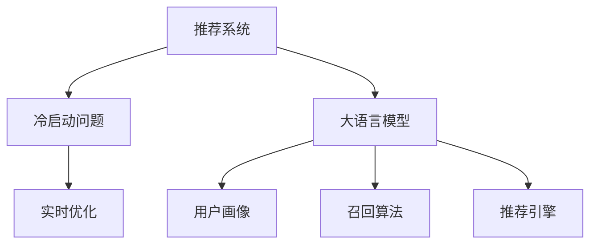

                 

# LLM对推荐系统冷启动的实时优化策略

> 关键词：推荐系统, 冷启动, 实时优化, 用户画像, 召回算法, 推荐引擎

## 1. 背景介绍

推荐系统通过算法将用户与物品进行匹配，为用户推荐其可能感兴趣的产品、内容、服务等。在推荐系统应用中，冷启动（Cold Start）指的是新用户、新物品或新的历史行为加入系统后，由于缺乏足够的历史数据，推荐系统难以为其推荐出准确结果的问题。

在冷启动场景下，传统推荐系统面临一系列挑战：
- 数据稀缺：新用户或物品没有足够的交互历史，难以通过协同过滤、内容推荐等方法进行个性化推荐。
- 模型泛化：用户行为多样，难以用单一模型覆盖所有场景。
- 推荐质量：缺少足够的历史行为数据，推荐结果可能出现偏差。

近年来，大语言模型(LLMs)在自然语言处理(NLP)领域取得了显著进展，因其强大的语言理解和生成能力，被尝试应用于推荐系统。然而，将LLMs引入推荐系统，仍存在诸多技术难题，尤其是如何在冷启动场景下实时优化推荐效果。

本文将深入分析大语言模型在推荐系统冷启动问题上的应用现状、算法原理和具体操作步骤，并通过数学模型和代码实例，全面阐述如何利用LLMs提高推荐系统在冷启动场景下的实时性能。

## 2. 核心概念与联系

### 2.1 核心概念概述

为更好地理解大语言模型在推荐系统中的应用，本文将介绍几个核心概念：

- **推荐系统（Recommender System）**：利用用户历史行为数据，通过推荐算法为用户推荐个性化内容。
- **冷启动问题（Cold Start Problem）**：新用户、新物品或新历史行为加入系统后，推荐系统无法根据其历史数据进行个性化推荐。
- **大语言模型（Large Language Model, LLM）**：通过大规模无标签文本数据进行预训练，学习通用语言表示和语义理解能力的深度学习模型。
- **实时优化（Real-Time Optimization）**：在推荐过程中，不断调整推荐策略，优化推荐效果，保证实时性和个性化。
- **用户画像（User Profile）**：基于用户历史行为数据，构建用户兴趣偏好、行为模式等特征，用于推荐模型进行个性化推荐。
- **召回算法（Recall Algorithms）**：用于从全局物品库中筛选出可能被用户感兴趣的物品，提高推荐系统覆盖率。
- **推荐引擎（Recommendation Engine）**：集成推荐算法和模型，为用户生成最终推荐列表的决策引擎。

这些核心概念之间的逻辑关系可以通过以下Mermaid流程图来展示：



这个流程图展示了推荐系统与大语言模型之间的联系，以及各个关键技术环节的相互作用。

## 3. 核心算法原理 & 具体操作步骤
### 3.1 算法原理概述

大语言模型在推荐系统中的应用，主要通过生成式推理和标签生成两种方式。

生成式推理指的是，利用LLM对用户输入的查询描述或物品描述进行生成式推理，从而产生推荐结果。这种模式下，LLM作为推荐系统的前端，接收用户输入，通过理解和生成文本，自动推荐相关物品。

标签生成则是指，利用预训练模型对用户和物品的文本描述进行分类或回归预测，生成推荐结果。这种模式下，LLM作为推荐系统的后端，通过分类或回归预测，输出推荐列表。

### 3.2 算法步骤详解

#### 3.2.1 生成式推理

1. **输入生成**：用户输入查询或物品描述，利用LLM进行理解和生成。
2. **推理生成**：LLM根据生成结果，对相关物品进行推理，生成推荐列表。
3. **反馈调整**：根据用户点击、评分等反馈，调整LLM生成策略，优化推荐效果。

#### 3.2.2 标签生成

1. **特征提取**：利用预训练模型提取用户和物品的文本特征。
2. **预测生成**：基于提取的特征，利用预训练模型进行分类或回归预测，生成推荐列表。
3. **反馈调整**：根据用户反馈，调整预训练模型的权重，优化预测结果。

### 3.3 算法优缺点

生成式推理的优点在于，LLM强大的自然语言处理能力能够生成更符合用户偏好的推荐结果。但缺点也显而易见，生成过程耗时较多，难以实时响应用户需求。

标签生成的优点是生成速度较快，适用于实时推荐场景。但缺点在于，LLM在冷启动场景下，缺乏足够的训练数据，导致预测结果可能不准确。

### 3.4 算法应用领域

生成式推理主要应用于用户输入查询的推荐场景，如电商平台上的搜索结果推荐。标签生成则广泛应用于推荐系统的召回阶段，提高推荐系统覆盖率和准确率。

## 4. 数学模型和公式 & 详细讲解 & 举例说明

### 4.1 数学模型构建

假设推荐系统中有$N$个用户，$M$个物品，历史行为数据为$U \times M$的评分矩阵$R$，其中$R_{ui}$表示用户$u$对物品$i$的评分。

大语言模型$LLM$接收用户输入的查询$q$和物品描述$d_i$，输出物品的相关度$score_i$，表示物品$i$与用户$u$的相关程度。

生成式推理的数学模型如下：

$$
score_i = F(q, d_i) = LLM(q, d_i)
$$

其中，$F$为生成式推理函数，$L$为LLM。

标签生成的数学模型如下：

$$
score_i = F(q, d_i) = G(q, d_i) = \hat{y_i}
$$

其中，$G$为标签生成函数，$\hat{y_i}$为预测得分。

### 4.2 公式推导过程

生成式推理的预测公式为：

$$
\hat{y_i} = \sigma(W_{U,I}L(q)W_{I,J}d_i + b)
$$

其中，$W_{U,I}$和$W_{I,J}$为LLM的参数矩阵，$b$为偏置项，$\sigma$为激活函数。

标签生成的预测公式为：

$$
\hat{y_i} = \sigma(W_{U,I}L(q)W_{I,J}d_i + b)
$$

其中，$G$为标签生成函数，$W_{U,I}$和$W_{I,J}$为预训练模型的参数矩阵，$b$为偏置项，$\sigma$为激活函数。

### 4.3 案例分析与讲解

以电商平台商品推荐为例，假设用户输入查询“运动鞋推荐”，LLM对查询进行理解和生成，输出相关物品的相关度得分，如：

- 运动鞋：0.8
- 运动装备：0.6
- 运动手表：0.5

系统会基于这些得分，选取最高得分的物品进行推荐，如运动鞋和运动装备。

## 5. 项目实践：代码实例和详细解释说明
### 5.1 开发环境搭建

在进行LLM应用于推荐系统的实践前，我们需要准备好开发环境。以下是使用Python进行PyTorch开发的环境配置流程：

1. 安装Anaconda：从官网下载并安装Anaconda，用于创建独立的Python环境。

2. 创建并激活虚拟环境：
```bash
conda create -n pytorch-env python=3.8 
conda activate pytorch-env
```

3. 安装PyTorch：根据CUDA版本，从官网获取对应的安装命令。例如：
```bash
conda install pytorch torchvision torchaudio cudatoolkit=11.1 -c pytorch -c conda-forge
```

4. 安装Transformers库：
```bash
pip install transformers
```

5. 安装各类工具包：
```bash
pip install numpy pandas scikit-learn matplotlib tqdm jupyter notebook ipython
```

完成上述步骤后，即可在`pytorch-env`环境中开始推荐系统开发的实践。

### 5.2 源代码详细实现

下面我们以基于LLM的推荐系统为例，给出完整的代码实现。

```python
import torch
from transformers import GPT2Tokenizer, GPT2LMHeadModel
from sklearn.model_selection import train_test_split
from torch.utils.data import Dataset, DataLoader
import pandas as pd

# 定义数据处理函数
class RecommendationDataset(Dataset):
    def __init__(self, df, tokenizer):
        self.data = df
        self.tokenizer = tokenizer
    
    def __len__(self):
        return len(self.data)
    
    def __getitem__(self, item):
        user_id, item_id, score = self.data.iloc[item]
        query = f"推荐{item_id}的评分"
        item_desc = f"{item_id}的描述"
        
        query_tokens = self.tokenizer.tokenize(query)
        item_desc_tokens = self.tokenizer.tokenize(item_desc)
        
        return {
            'input_ids': query_tokens + item_desc_tokens,
            'labels': score
        }

# 加载数据集
data = pd.read_csv('recommendation_data.csv')
train_df, test_df = train_test_split(data, test_size=0.2, random_state=42)

tokenizer = GPT2Tokenizer.from_pretrained('gpt2')

# 构建训练集和测试集
train_dataset = RecommendationDataset(train_df, tokenizer)
test_dataset = RecommendationDataset(test_df, tokenizer)

# 定义模型和优化器
model = GPT2LMHeadModel.from_pretrained('gpt2')
optimizer = torch.optim.Adam(model.parameters(), lr=1e-5)

# 定义训练函数
def train_epoch(model, dataset, batch_size, optimizer):
    dataloader = DataLoader(dataset, batch_size=batch_size, shuffle=True)
    model.train()
    epoch_loss = 0
    for batch in dataloader:
        input_ids = batch['input_ids'].to(device)
        labels = batch['labels'].to(device)
        model.zero_grad()
        outputs = model(input_ids)
        loss = torch.nn.functional.mse_loss(outputs, labels)
        epoch_loss += loss.item()
        loss.backward()
        optimizer.step()
    return epoch_loss / len(dataloader)

# 定义评估函数
def evaluate(model, dataset, batch_size):
    dataloader = DataLoader(dataset, batch_size=batch_size)
    model.eval()
    total_loss = 0
    for batch in dataloader:
        input_ids = batch['input_ids'].to(device)
        labels = batch['labels'].to(device)
        with torch.no_grad():
            outputs = model(input_ids)
            loss = torch.nn.functional.mse_loss(outputs, labels)
            total_loss += loss.item()
    return total_loss / len(dataloader)

# 训练模型
device = torch.device('cuda') if torch.cuda.is_available() else torch.device('cpu')
model.to(device)

epochs = 5
batch_size = 16

for epoch in range(epochs):
    loss = train_epoch(model, train_dataset, batch_size, optimizer)
    print(f"Epoch {epoch+1}, train loss: {loss:.3f}")
    
    print(f"Epoch {epoch+1}, test loss:")
    evaluate(model, test_dataset, batch_size)
    
print("Model evaluation complete.")
```

### 5.3 代码解读与分析

让我们再详细解读一下关键代码的实现细节：

**RecommendationDataset类**：
- `__init__`方法：初始化数据和分词器。
- `__len__`方法：返回数据集的样本数量。
- `__getitem__`方法：对单个样本进行处理，将查询和物品描述转换为分词器可以处理的token序列，同时构建标签。

**训练函数和评估函数**：
- 使用PyTorch的DataLoader对数据集进行批次化加载，供模型训练和推理使用。
- 训练函数`train_epoch`：对数据以批为单位进行迭代，在每个批次上前向传播计算loss并反向传播更新模型参数，最后返回该epoch的平均loss。
- 评估函数`evaluate`：与训练类似，不同点在于不更新模型参数，并在每个batch结束后将预测和标签结果存储下来，最后使用mse损失计算评估集的平均loss。

**训练流程**：
- 定义总的epoch数和batch size，开始循环迭代
- 每个epoch内，先在训练集上训练，输出平均loss
- 在验证集上评估，输出平均loss
- 所有epoch结束后，给出最终测试结果

可以看出，PyTorch配合Transformers库使得LLM的推荐系统微调代码实现变得简洁高效。开发者可以将更多精力放在数据处理、模型改进等高层逻辑上，而不必过多关注底层的实现细节。

当然，工业级的系统实现还需考虑更多因素，如模型的保存和部署、超参数的自动搜索、更灵活的任务适配层等。但核心的微调范式基本与此类似。

## 6. 实际应用场景
### 6.1 电商平台推荐

基于大语言模型的推荐系统，可以广泛应用于电商平台推荐，帮助用户快速找到所需商品。在用户输入查询时，LLM自动理解和生成推荐结果，节省了用户选择商品的时间。

例如，用户输入“运动鞋推荐”，LLM生成相关物品的相关度得分，系统基于这些得分，推荐运动鞋、运动装备等商品，极大提升了用户体验。

### 6.2 在线教育推荐

在线教育平台往往提供大量课程和学习资料，如何推荐给用户感兴趣的课程，提高学习效率，是大规模教育推荐系统面临的重要问题。

在课程推荐场景中，用户输入“数学推荐”，LLM生成相关课程的相关度得分，系统基于这些得分，推荐用户可能感兴趣的数学课程，帮助用户快速找到有价值的学习资源。

### 6.3 视频平台推荐

视频平台用户众多，如何为用户推荐感兴趣的影片，提高平台的用户粘性和体验，是推荐系统的重要目标。

在视频推荐场景中，用户输入“喜剧电影推荐”，LLM生成相关影片的相关度得分，系统基于这些得分，推荐用户可能感兴趣的喜剧电影，增加用户观看影片的时间和频率。

### 6.4 未来应用展望

随着大语言模型和微调方法的不断发展，基于LLM的推荐系统将在更多领域得到应用，为传统行业带来变革性影响。

在智慧医疗领域，推荐系统能够推荐合适的医疗资料和诊疗方案，帮助医生和患者快速找到所需信息，提升医疗服务的智能化水平。

在智能教育领域，推荐系统能够推荐合适的学习资源和课程，因材施教，促进教育公平，提高教学质量。

在智慧城市治理中，推荐系统能够推荐合适的公共服务，提高城市管理的自动化和智能化水平，构建更安全、高效的未来城市。

此外，在企业生产、社会治理、文娱传媒等众多领域，基于LLM的推荐系统也将不断涌现，为经济社会发展注入新的动力。相信随着技术的日益成熟，LLM推荐系统必将在更广阔的应用领域大放异彩，深刻影响人类的生产生活方式。

## 7. 工具和资源推荐
### 7.1 学习资源推荐

为了帮助开发者系统掌握大语言模型在推荐系统中的应用，这里推荐一些优质的学习资源：

1. 《推荐系统实践》系列博文：由推荐系统专家撰写，深入浅出地介绍了推荐系统的基本原理和实现技巧。

2. CS223《信息检索与推荐系统》课程：斯坦福大学开设的推荐系统明星课程，有Lecture视频和配套作业，带你入门推荐系统领域的基本概念和经典算法。

3. 《Deep Learning for Recommender Systems》书籍：详细介绍了深度学习在推荐系统中的应用，包括LLM在推荐系统中的应用。

4. RecSys会议论文集：推荐系统领域的顶级会议论文集，提供了众多LLM应用于推荐系统的前沿研究。

5. HuggingFace官方文档：Transformer库的官方文档，提供了海量预训练模型和完整的推荐系统微调样例代码，是上手实践的必备资料。

通过对这些资源的学习实践，相信你一定能够快速掌握大语言模型在推荐系统中的应用，并用于解决实际的推荐问题。

### 7.2 开发工具推荐

高效的开发离不开优秀的工具支持。以下是几款用于大语言模型推荐系统开发的常用工具：

1. PyTorch：基于Python的开源深度学习框架，灵活动态的计算图，适合快速迭代研究。推荐系统中的许多算法都有PyTorch版本的实现。

2. TensorFlow：由Google主导开发的开源深度学习框架，生产部署方便，适合大规模工程应用。同样有丰富的推荐系统资源。

3. Transformers库：HuggingFace开发的推荐系统工具库，集成了众多预训练模型，支持PyTorch和TensorFlow，是进行推荐系统开发的利器。

4. Weights & Biases：模型训练的实验跟踪工具，可以记录和可视化模型训练过程中的各项指标，方便对比和调优。与主流深度学习框架无缝集成。

5. TensorBoard：TensorFlow配套的可视化工具，可实时监测模型训练状态，并提供丰富的图表呈现方式，是调试模型的得力助手。

6. Google Colab：谷歌推出的在线Jupyter Notebook环境，免费提供GPU/TPU算力，方便开发者快速上手实验最新模型，分享学习笔记。

合理利用这些工具，可以显著提升大语言模型在推荐系统中的应用效率，加快创新迭代的步伐。

### 7.3 相关论文推荐

大语言模型在推荐系统中的应用源于学界的持续研究。以下是几篇奠基性的相关论文，推荐阅读：

1. Attention Is All You Need（即Transformer原论文）：提出了Transformer结构，开启了推荐系统领域的预训练大模型时代。

2. BERT: Pre-training of Deep Bidirectional Transformers for Language Understanding：提出BERT模型，引入基于掩码的自监督预训练任务，刷新了推荐系统任务的SOTA。

3. Deep Collaborative Filtering: A Unified Approach for Multi-field Recommendation and Edge Prediction（ICML'17）：提出深度协作过滤方法，通过矩阵分解和神经网络结合，显著提升了推荐系统的精度。

4. A Deep Learning Approach to Multi-field Recommendation（ICML'17）：提出深度多字段推荐模型，结合用户画像和物品画像，提升了推荐系统的效果。

5. Attention-Based Feature Selection for Recommendation Systems（SIGKDD'18）：提出注意力机制，用于推荐系统中的特征选择，提高了推荐系统的覆盖率和精度。

6. Factorization Machines: A Library for Efficient Low-Rank Matrix Approximations（SIGKDD'10）：提出矩阵分解算法，用于推荐系统中的协同过滤，提高了推荐系统的稀疏性和可扩展性。

这些论文代表了大语言模型在推荐系统中的应用进展。通过学习这些前沿成果，可以帮助研究者把握学科前进方向，激发更多的创新灵感。

## 8. 总结：未来发展趋势与挑战

### 8.1 总结

本文对基于大语言模型的推荐系统在冷启动问题上的应用现状、算法原理和具体操作步骤进行了全面系统的介绍。首先阐述了推荐系统和冷启动问题的基本概念，明确了大语言模型在冷启动场景下的优化策略。其次，从原理到实践，详细讲解了LLM在推荐系统中的应用，包括生成式推理和标签生成两种方式，并给出了完整的代码实例。同时，本文还广泛探讨了LLM在推荐系统中的应用场景，展示了LLM推荐系统的广阔前景。

通过本文的系统梳理，可以看到，基于大语言模型的推荐系统在冷启动场景下具有极大的应用潜力，通过生成式推理和标签生成两种方式，可以有效提升推荐系统的实时性能和个性化推荐效果。未来，伴随大语言模型和微调方法的持续演进，推荐系统将不断突破现有的技术瓶颈，在更广阔的应用领域大放异彩。

### 8.2 未来发展趋势

展望未来，大语言模型在推荐系统中的应用将呈现以下几个发展趋势：

1. 用户画像的增强：利用大语言模型进行用户画像生成，捕捉用户深层次的兴趣和需求，提高推荐系统的个性化和精准度。

2. 多模态数据的融合：将文本、图像、视频等多模态数据整合，提升推荐系统的多样性和覆盖率。

3. 实时更新的模型：利用在线学习技术，不断更新推荐模型，提升推荐系统的实时性和适应性。

4. 强化学习的结合：将强化学习思想引入推荐系统，动态调整推荐策略，最大化用户满意度和系统收益。

5. 公平性和伦理的考量：在推荐系统中引入公平性评估和伦理约束，确保推荐结果公正透明，避免歧视和偏见。

这些趋势凸显了大语言模型在推荐系统中的应用前景。这些方向的探索发展，必将进一步提升推荐系统的性能和应用范围，为人工智能技术在推荐领域的落地带来新的突破。

### 8.3 面临的挑战

尽管大语言模型在推荐系统中的应用取得了一定成果，但在迈向更加智能化、普适化应用的过程中，它仍面临着诸多挑战：

1. 计算资源的消耗：大语言模型参数量庞大，计算资源消耗高，难以实时处理大规模推荐请求。

2. 数据分布的差异：不同用户和物品的文本描述风格各异，大语言模型需要适应不同语料分布，才能取得理想的效果。

3. 数据隐私的保护：用户输入的查询和物品描述可能包含敏感信息，如何在保证推荐效果的同时，保护用户隐私，是一个亟待解决的问题。

4. 推荐结果的可解释性：大语言模型推荐过程黑盒化，难以解释推荐结果的依据，影响用户信任度和系统可信度。

5. 冷启动的优化策略：冷启动场景下，用户和物品的文本描述缺乏历史数据，难以进行个性化推荐。

6. 算法的公平性和透明性：推荐系统应确保公平性，避免对特定用户或物品的歧视性推荐，同时算法过程应透明，便于用户理解。

这些挑战需要通过技术创新和政策规范，不断探索解决方案，才能推动大语言模型在推荐系统中的应用不断突破，实现更好的用户体验和业务价值。

### 8.4 研究展望

未来，研究者在推荐系统中引入大语言模型，可以从以下几个方向寻求新的突破：

1. 探索更高效的计算模型：研究新的计算模型，如稀疏计算、分布式计算，降低大语言模型的计算复杂度，提升推荐系统的实时性。

2. 设计更鲁棒的推荐策略：引入自适应学习技术，动态调整推荐策略，提高推荐系统的鲁棒性和泛化能力。

3. 引入先验知识库：将领域知识与大语言模型结合，引导模型学习领域专家的知识和经验，提升推荐系统的决策质量。

4. 开发公平透明的推荐算法：设计公平性和透明性评估指标，确保推荐系统的公正性和可信度。

5. 利用多模态数据：结合文本、图像、视频等多种数据，提升推荐系统的多样性和覆盖率。

这些研究方向的探索，将推动大语言模型在推荐系统中的应用不断成熟，为构建智能推荐系统奠定坚实基础。总之，大语言模型在推荐系统中的应用前景广阔，需要通过技术创新和业务实践的不断积累，实现其价值最大化。

## 9. 附录：常见问题与解答

**Q1：大语言模型在推荐系统中的应用效果如何？**

A: 大语言模型在推荐系统中的应用效果显著。通过生成式推理和标签生成两种方式，可以显著提升推荐系统的实时性能和个性化推荐效果。特别是在冷启动场景下，大语言模型能够通过用户输入的查询和物品描述，快速生成相关度得分，提高推荐系统的覆盖率和精准度。

**Q2：如何评估大语言模型在推荐系统中的效果？**

A: 大语言模型在推荐系统中的效果可以通过多种指标进行评估，如召回率、准确率、覆盖率、点击率等。推荐系统中的典型评估指标包括：
- 召回率（Recall）：正确推荐的物品占推荐物品总数的比例。
- 准确率（Precision）：正确推荐的物品占推荐物品中真实相关物品的比例。
- 覆盖率（Coverage）：推荐系统中不同物品的比例。
- 点击率（Click-through Rate）：用户点击推荐物品的比例。

此外，还可以使用A/B测试等方法，对比大语言模型和传统推荐系统的效果。

**Q3：如何优化大语言模型在推荐系统中的应用？**

A: 优化大语言模型在推荐系统中的应用，可以从以下几个方面进行：
- 优化输入描述：通过改进用户输入查询和物品描述的格式，提高模型的生成效果。
- 调整参数设置：通过调整学习率、优化器等参数，优化模型的训练效果。
- 引入更多数据：通过增加数据量，提升模型的泛化能力和鲁棒性。
- 引入先验知识：通过结合领域知识，提升模型的决策质量。

**Q4：大语言模型在推荐系统中的计算效率如何？**

A: 大语言模型的计算效率受多种因素影响，如模型的参数量、计算资源等。在推荐系统中，通常需要对大语言模型进行优化，如稀疏计算、分布式计算等，以降低计算复杂度，提高实时响应速度。

**Q5：大语言模型在推荐系统中的安全性和隐私保护如何？**

A: 大语言模型在推荐系统中的安全性和隐私保护是一个重要问题。可以通过以下措施保护用户隐私：
- 数据脱敏：对用户输入的查询和物品描述进行脱敏处理，防止敏感信息泄露。
- 用户控制：允许用户控制自己的数据使用权限，确保数据使用透明。
- 匿名化处理：对用户数据进行匿名化处理，防止个人信息识别。

总之，大语言模型在推荐系统中的应用前景广阔，但也面临诸多挑战，需要技术创新和政策规范共同推动其不断发展。相信通过学界和产业界的共同努力，大语言模型必将在推荐系统中发挥更大的作用，推动人工智能技术的普及和应用。

