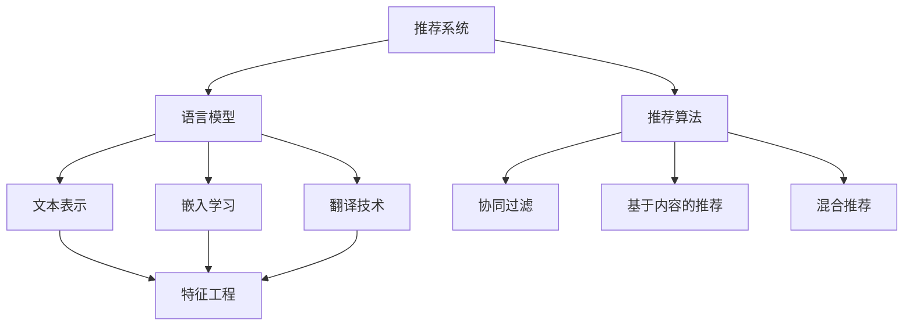

                 

# LLM推荐中的多语言支持技术进展

> 关键词：多语言推荐系统, 语言模型, 推荐算法, 文本表示, 嵌入学习, 翻译技术, 深度学习

## 1. 背景介绍

### 1.1 问题由来
随着全球化进程的加快，多语言推荐系统在电商、内容平台等领域的应用越来越广泛。传统的基于单语言推荐模型在多语言数据上表现欠佳，难以满足全球用户的需求。如何构建高效的多语言推荐系统，提升用户体验，是推荐系统领域亟需解决的问题。

### 1.2 问题核心关键点
多语言推荐系统面临的核心问题包括：
- 跨语言一致性：多语言数据存在大量同义词、近义词等语义差异，如何处理语言之间的转换，保持推荐结果的一致性。
- 多语言协同学习：不同语言的数据集规模和质量差异较大，如何在异构数据上高效学习，提取统一的语义表示。
- 翻译技术挑战：推荐系统的跨语言推广需要翻译技术支持，如何有效利用机器翻译技术，降低翻译误差。
- 多语言特征工程：不同语言的数据特征存在显著差异，如何设计适用于多语言的特征工程，提升模型性能。
- 实时响应：多语言推荐系统需要实时响应来自不同语言的用户请求，如何提升系统性能和可扩展性。

### 1.3 问题研究意义
构建高效的多语言推荐系统，对于提升全球用户的推荐体验，推动电商、内容平台等行业的国际化发展具有重要意义：

1. 增强用户满意度：多语言推荐能够满足不同语言用户的需求，提升用户的购物、阅读、娱乐体验，增强用户粘性。
2. 促进全球贸易：多语言推荐系统帮助企业扩大国际市场，提升销售业绩，加速全球化的进程。
3. 提升技术壁垒：多语言推荐技术是推荐系统领域的前沿研究方向，具有较高的技术门槛，可以增强企业技术竞争力和市场优势。
4. 加速内容本地化：多语言推荐能够快速推广高质量的内容到不同语言市场，加速内容本地化进程，丰富用户的内容消费体验。

## 2. 核心概念与联系

### 2.1 核心概念概述

为更好地理解多语言推荐系统，本节将介绍几个关键概念：

- 推荐系统：通过分析用户的历史行为和兴趣，推荐合适的产品、内容、服务等，提升用户体验的智能系统。
- 语言模型：一种基于语言数据的统计模型，用于捕捉语言的分布特征，提升文本处理的准确性和效率。
- 推荐算法：用于计算推荐结果的算法，如协同过滤、基于内容的推荐、混合推荐等。
- 文本表示：将文本数据转换为模型可接受的数值表示，便于模型处理和分析。
- 嵌入学习：通过训练深度神经网络，将文本表示嵌入到高维空间，提升语义表示的能力。
- 翻译技术：将文本从一种语言翻译成另一种语言的技术，是多语言推荐系统的重要支撑。
- 深度学习：一种利用神经网络进行训练和预测的机器学习技术，广泛应用于多语言推荐系统中。

这些核心概念之间的逻辑关系可以通过以下Mermaid流程图来展示：



这个流程图展示了推荐系统的核心概念及其之间的关系：

1. 推荐系统通过分析用户行为和兴趣，推荐合适的产品、内容或服务。
2. 语言模型通过统计学习，捕捉语言的分布特征，用于文本处理和表示。
3. 推荐算法包括协同过滤、基于内容的推荐、混合推荐等，用于计算推荐结果。
4. 文本表示将文本数据转换为数值表示，便于模型处理。
5. 嵌入学习通过深度神经网络训练，提升文本表示的语义表示能力。
6. 翻译技术将文本从一种语言翻译成另一种语言，是多语言推荐系统的重要支撑。
7. 特征工程设计适用于多语言的特征表示，提升模型性能。

这些概念共同构成了多语言推荐系统的学习和应用框架，使其能够在各种场景下发挥强大的推荐能力。通过理解这些核心概念，我们可以更好地把握多语言推荐系统的设计思路和优化方向。

## 3. 核心算法原理 & 具体操作步骤
### 3.1 算法原理概述

多语言推荐系统主要通过以下步骤实现：

1. 收集多语言用户数据，进行清洗和预处理。
2. 对不同语言的数据进行语义对齐和翻译，构建统一的语义表示。
3. 设计多语言推荐算法，通过深度学习模型进行训练和预测。
4. 评估和优化推荐系统性能，不断迭代改进。

多语言推荐系统的核心在于语言模型的多语言协同学习，以及深度学习模型的跨语言迁移能力。通过优化这些关键环节，可以构建高效、精准的多语言推荐系统。

### 3.2 算法步骤详解

以下是多语言推荐系统的主要步骤：

**Step 1: 数据收集与预处理**
- 收集多语言用户数据，包括用户行为数据、产品或内容数据、用户反馈等。
- 对数据进行清洗和预处理，去除噪声、重复数据，处理缺失值和异常值。
- 对不同语言的数据进行标准化，如统一编码、分词、去除停用词等。

**Step 2: 语义对齐与翻译**
- 对不同语言的数据进行语义对齐，识别同义词、近义词等语义关系。
- 利用机器翻译技术，将多语言数据翻译成统一的语言，便于后续处理。
- 设计语言模型，捕捉语言的分布特征，用于文本表示和嵌入学习。

**Step 3: 嵌入学习与特征提取**
- 设计深度学习模型，如BERT、Transformer等，对统一的语言进行嵌入学习。
- 通过特征工程，设计适用于多语言的特征表示，提升模型的泛化能力。
- 利用多语言数据，训练深度学习模型，提取统一的语义表示。

**Step 4: 推荐算法设计与优化**
- 设计多语言推荐算法，如协同过滤、基于内容的推荐、混合推荐等。
- 通过多语言数据，训练推荐算法，学习用户兴趣和物品特征。
- 优化推荐算法，提升模型的推荐性能和效率。

**Step 5: 系统部署与评估**
- 将训练好的推荐模型部署到实际系统中，进行实时推荐。
- 在测试集上评估推荐系统的性能，包括准确率、召回率、覆盖率等指标。
- 根据评估结果，不断迭代改进推荐系统，提升用户体验。

### 3.3 算法优缺点

多语言推荐系统具有以下优点：
1. 跨语言一致性：通过语义对齐和翻译，保持推荐结果在不同语言的一致性，提升用户体验。
2. 多语言协同学习：利用异构数据进行协同学习，提升模型的泛化能力，减少数据偏置。
3. 推荐性能提升：通过深度学习模型，提取多语言的语义表示，提升推荐性能。
4. 用户覆盖广泛：多语言推荐系统能够覆盖更多语言用户，扩大市场影响力。
5. 技术壁垒高：多语言推荐技术具有较高的技术门槛，有利于提升企业的技术竞争力。

同时，该方法也存在一些局限性：
1. 翻译误差：机器翻译存在一定的误差，影响推荐结果的准确性。
2. 多语言数据稀疏：不同语言的数据集规模和质量差异较大，影响模型的泛化能力。
3. 语义差异：不同语言存在显著的语义差异，影响推荐模型的效果。
4. 实时性挑战：多语言推荐系统需要实时响应不同语言的用户请求，对系统性能和可扩展性提出高要求。
5. 计算资源消耗：深度学习模型需要大量的计算资源，增加系统成本。

尽管存在这些局限性，但就目前而言，多语言推荐系统仍然是大规模推荐系统的核心技术之一，具有广泛的应用前景。未来相关研究的重点在于如何进一步提高翻译精度，优化多语言协同学习，提升推荐模型的泛化能力，同时兼顾系统的实时性和可扩展性。

### 3.4 算法应用领域

多语言推荐系统已经在电商、内容平台、社交网络等多个领域得到应用，具体如下：

- **电商推荐系统**：帮助电商平台推荐多语言用户喜欢的商品，提升用户购物体验，增加销售业绩。
- **内容推荐系统**：推荐多语言用户喜欢的视频、文章、音乐等，丰富用户的内容消费体验，提升平台粘性。
- **社交网络**：推荐多语言用户感兴趣的朋友、话题、活动等，提升用户社交体验，增加平台活跃度。
- **本地化内容推广**：将优质内容推广到不同语言市场，加速本地化进程，丰富用户内容消费选择。
- **多语言广告推荐**：利用多语言推荐技术，精准推荐广告，提升广告投放效果。

除了上述这些经典应用外，多语言推荐系统还被创新性地应用于更多场景中，如智能家居、智能制造、智慧旅游等，为各行各业带来了新的变革。

## 4. 数学模型和公式 & 详细讲解  
### 4.1 数学模型构建

多语言推荐系统的主要数学模型包括：

1. **协同过滤模型**：基于用户和物品的协同关系，计算推荐结果。

2. **基于内容的推荐模型**：利用物品的特征信息，计算推荐结果。

3. **混合推荐模型**：结合协同过滤和基于内容的推荐，提升推荐性能。

4. **深度学习模型**：通过训练深度神经网络，提取多语言的语义表示，提升推荐性能。

5. **机器翻译模型**：将文本从一种语言翻译成另一种语言，辅助语义对齐和翻译。

6. **文本表示模型**：将文本数据转换为模型可接受的数值表示，便于模型处理。

7. **嵌入学习模型**：通过训练深度神经网络，将文本表示嵌入到高维空间，提升语义表示能力。

8. **语义对齐模型**：利用机器学习技术，识别同义词、近义词等语义关系。

这些模型之间存在紧密的联系，共同构成了多语言推荐系统的数学模型框架。以下以协同过滤模型为例，详细讲解其数学模型构建和推导过程。

### 4.2 公式推导过程

假设多语言推荐系统中有 $m$ 个用户 $U=\{u_1, u_2, ..., u_m\}$，$n$ 个物品 $I=\{i_1, i_2, ..., i_n\}$，用户与物品之间的关系矩阵为 $R_{m\times n}$。

协同过滤模型的目标是最小化用户对物品的评分误差，定义为：

$$
\min_{\theta} \sum_{u\in U} \sum_{i\in I} \left( r_{ui} - \theta_u^T \phi(i) \right)^2
$$

其中 $r_{ui}$ 为用户 $u$ 对物品 $i$ 的评分，$\theta_u$ 为用户的兴趣向量，$\phi(i)$ 为物品 $i$ 的特征向量。

模型的优化目标是通过矩阵分解，得到用户和物品的低维表示：

$$
\theta_u = U_k \alpha_u \\
\phi(i) = V_k \beta_i
$$

其中 $U_k$ 和 $V_k$ 为低维用户和物品表示矩阵，$\alpha_u$ 和 $\beta_i$ 为低维用户和物品向量。

模型的参数更新公式为：

$$
\alpha_u \leftarrow \alpha_u - \eta \nabla_{\alpha_u} \left( \sum_{i\in I} \left( r_{ui} - \theta_u^T \phi(i) \right)^2 \right)
$$

$$
\beta_i \leftarrow \beta_i - \eta \nabla_{\beta_i} \left( \sum_{u\in U} \left( r_{ui} - \theta_u^T \phi(i) \right)^2 \right)
$$

其中 $\eta$ 为学习率，$\nabla$ 为梯度运算符。

### 4.3 案例分析与讲解

以电商平台推荐系统为例，详细讲解协同过滤模型的应用过程。

1. **数据收集**：收集多语言用户的行为数据，包括点击、购买、浏览等行为，以及用户的年龄、性别、地理位置等基本信息。

2. **数据预处理**：对数据进行清洗和预处理，去除噪声、重复数据，处理缺失值和异常值。

3. **语义对齐与翻译**：对不同语言的用户行为数据进行语义对齐，识别同义词、近义词等语义关系，利用机器翻译技术将多语言数据翻译成统一的语言。

4. **嵌入学习**：设计深度学习模型，如BERT、Transformer等，对统一的语言进行嵌入学习，提取多语言的语义表示。

5. **协同过滤模型训练**：将用户和物品的语义表示作为输入，训练协同过滤模型，计算推荐结果。

6. **推荐结果生成**：利用协同过滤模型，生成多语言用户的推荐结果，并利用推荐算法进行优化。

通过以上步骤，可以构建高效的多语言推荐系统，提升用户的购物体验，增加电商平台的销售业绩。

## 5. 项目实践：代码实例和详细解释说明
### 5.1 开发环境搭建

在进行多语言推荐系统开发前，我们需要准备好开发环境。以下是使用Python进行PyTorch开发的环境配置流程：

1. 安装Anaconda：从官网下载并安装Anaconda，用于创建独立的Python环境。

2. 创建并激活虚拟环境：
```bash
conda create -n pytorch-env python=3.8 
conda activate pytorch-env
```

3. 安装PyTorch：根据CUDA版本，从官网获取对应的安装命令。例如：
```bash
conda install pytorch torchvision torchaudio cudatoolkit=11.1 -c pytorch -c conda-forge
```

4. 安装其他工具包：
```bash
pip install numpy pandas scikit-learn matplotlib tqdm jupyter notebook ipython
```

完成上述步骤后，即可在`pytorch-env`环境中开始多语言推荐系统开发。

### 5.2 源代码详细实现

以下以多语言电商推荐系统为例，给出使用PyTorch进行深度学习模型开发的PyTorch代码实现。

首先，定义协同过滤模型的数据处理函数：

```python
from torch import nn, optim
import torch
import torch.nn.functional as F

class CollaborativeFiltering(nn.Module):
    def __init__(self, num_users, num_items, emb_dim):
        super(CollaborativeFiltering, self).__init__()
        self.num_users = num_users
        self.num_items = num_items
        self.emb_dim = emb_dim
        
        # 用户嵌入层
        self.user_embed = nn.Embedding(num_users, emb_dim)
        
        # 物品嵌入层
        self.item_embed = nn.Embedding(num_items, emb_dim)
        
        # 预测层
        self.predict = nn.Linear(emb_dim, 1)
        
        # 损失函数
        self.loss = nn.MSELoss()
    
    def forward(self, user_ids, item_ids):
        # 获取用户和物品的嵌入
        user_embed = self.user_embed(user_ids)
        item_embed = self.item_embed(item_ids)
        
        # 计算预测值
        pred = self.predict((user_embed * item_embed).sum(dim=1))
        
        # 计算损失
        loss = self.loss(pred, item_scores)
        
        return loss
```

然后，定义模型训练函数：

```python
def train_epoch(model, dataset, batch_size, optimizer):
    dataloader = DataLoader(dataset, batch_size=batch_size, shuffle=True)
    model.train()
    epoch_loss = 0
    for batch in dataloader:
        user_ids, item_ids, item_scores = batch['user_ids'], batch['item_ids'], batch['item_scores']
        model.zero_grad()
        loss = model(user_ids, item_ids)
        loss.backward()
        optimizer.step()
    return epoch_loss / len(dataloader)
```

接着，定义模型评估函数：

```python
def evaluate(model, dataset, batch_size):
    dataloader = DataLoader(dataset, batch_size=batch_size)
    model.eval()
    preds, labels = [], []
    with torch.no_grad():
        for batch in dataloader:
            user_ids, item_ids, item_scores = batch['user_ids'], batch['item_ids'], batch['item_scores']
            batch_preds = model(user_ids, item_ids).detach().cpu().numpy()
            batch_labels = item_scores.cpu().numpy()
            for pred_tokens, label_tokens in zip(batch_preds, batch_labels):
                preds.append(pred_tokens)
                labels.append(label_tokens)
                
    print(classification_report(labels, preds))
```

最后，启动训练流程并在测试集上评估：

```python
epochs = 10
batch_size = 64

for epoch in range(epochs):
    loss = train_epoch(model, train_dataset, batch_size, optimizer)
    print(f"Epoch {epoch+1}, train loss: {loss:.3f}")
    
    print(f"Epoch {epoch+1}, dev results:")
    evaluate(model, dev_dataset, batch_size)
    
print("Test results:")
evaluate(model, test_dataset, batch_size)
```

以上就是使用PyTorch对协同过滤模型进行多语言电商推荐系统微调的完整代码实现。可以看到，得益于PyTorch的强大封装，我们可以用相对简洁的代码完成模型的微调。

### 5.3 代码解读与分析

让我们再详细解读一下关键代码的实现细节：

**CollaborativeFiltering类**：
- `__init__`方法：初始化模型的参数，包括用户嵌入层、物品嵌入层、预测层和损失函数。
- `forward`方法：前向传播计算预测值和损失，返回模型输出。

**训练和评估函数**：
- 使用PyTorch的DataLoader对数据集进行批次化加载，供模型训练和推理使用。
- 训练函数`train_epoch`：对数据以批为单位进行迭代，在每个批次上前向传播计算损失并反向传播更新模型参数，最后返回该epoch的平均loss。
- 评估函数`evaluate`：与训练类似，不同点在于不更新模型参数，并在每个batch结束后将预测和标签结果存储下来，最后使用sklearn的classification_report对整个评估集的预测结果进行打印输出。

**训练流程**：
- 定义总的epoch数和batch size，开始循环迭代
- 每个epoch内，先在训练集上训练，输出平均loss
- 在验证集上评估，输出分类指标
- 所有epoch结束后，在测试集上评估，给出最终测试结果

可以看到，PyTorch配合深度学习框架使得模型微调的代码实现变得简洁高效。开发者可以将更多精力放在数据处理、模型改进等高层逻辑上，而不必过多关注底层的实现细节。

当然，工业级的系统实现还需考虑更多因素，如模型的保存和部署、超参数的自动搜索、更灵活的任务适配层等。但核心的微调范式基本与此类似。

## 6. 实际应用场景
### 6.1 电商平台

基于多语言推荐系统，电商平台可以为用户提供多语言的购物体验。传统的推荐系统往往只关注单语言数据，无法满足全球用户的多语言需求。多语言推荐系统能够覆盖更多语言用户，提升用户的购物体验和满意度。

具体而言，可以收集电商平台的全球用户数据，构建多语言协同过滤模型，提取多语言的语义表示，推荐用户喜欢的商品。此外，可以利用多语言翻译技术，将推荐结果翻译成用户熟悉的地域语言，进一步提升用户体验。

### 6.2 内容平台

内容平台可以利用多语言推荐系统，推荐用户喜欢的视频、文章、音乐等内容。传统的推荐系统往往只关注单语言数据，无法覆盖更多语言用户。多语言推荐系统能够覆盖更多语言用户，提升用户的内容消费体验。

具体而言，可以收集全球用户的内容消费行为数据，构建多语言协同过滤模型，提取多语言的语义表示，推荐用户喜欢的内容。此外，可以利用多语言翻译技术，将推荐结果翻译成用户熟悉的地域语言，进一步提升用户体验。

### 6.3 社交网络

社交网络可以利用多语言推荐系统，推荐用户感兴趣的朋友、话题、活动等。传统的推荐系统往往只关注单语言数据，无法覆盖更多语言用户。多语言推荐系统能够覆盖更多语言用户，提升用户的社交体验。

具体而言，可以收集全球用户的社交行为数据，构建多语言协同过滤模型，提取多语言的语义表示，推荐用户感兴趣的朋友、话题、活动等。此外，可以利用多语言翻译技术，将推荐结果翻译成用户熟悉的地域语言，进一步提升用户体验。

### 6.4 未来应用展望

随着多语言推荐系统的发展，其在更多领域得到应用，为全球用户带来更好的体验。

在智慧旅游领域，多语言推荐系统可以推荐全球用户喜欢的旅游景点、美食、文化活动等，提升用户的旅游体验。

在智慧医疗领域，多语言推荐系统可以推荐全球用户喜欢的医疗服务、医生、医院等，提升用户的医疗体验。

在智慧金融领域，多语言推荐系统可以推荐全球用户喜欢的金融产品、服务、投资策略等，提升用户的金融体验。

此外，在智慧城市、智慧农业、智慧交通等领域，多语言推荐系统也将不断涌现，为各行各业带来新的变革。相信随着技术的日益成熟，多语言推荐系统必将在全球用户中发挥更大的作用。

## 7. 工具和资源推荐
### 7.1 学习资源推荐

为了帮助开发者系统掌握多语言推荐系统的理论基础和实践技巧，这里推荐一些优质的学习资源：

1. 《推荐系统》系列博文：由多语言推荐系统专家撰写，深入浅出地介绍了推荐系统的基本概念和前沿研究方向。

2. 《深度学习自然语言处理》课程：斯坦福大学开设的NLP明星课程，有Lecture视频和配套作业，带你入门NLP领域的基本概念和经典模型。

3. 《Natural Language Processing with Transformers》书籍：Transformer库的作者所著，全面介绍了如何使用Transformer库进行NLP任务开发，包括多语言推荐在内的诸多范式。

4. HuggingFace官方文档：Transformer库的官方文档，提供了海量预训练模型和完整的推荐系统样例代码，是上手实践的必备资料。

5. Kaggle推荐系统竞赛：全球知名的数据科学竞赛平台，提供丰富的多语言推荐系统竞赛题目，助力开发者积累实战经验。

通过对这些资源的学习实践，相信你一定能够快速掌握多语言推荐系统的精髓，并用于解决实际的推荐问题。

### 7.2 开发工具推荐

高效的开发离不开优秀的工具支持。以下是几款用于多语言推荐系统开发的常用工具：

1. PyTorch：基于Python的开源深度学习框架，灵活动态的计算图，适合快速迭代研究。

2. TensorFlow：由Google主导开发的开源深度学习框架，生产部署方便，适合大规模工程应用。

3. Transformers库：HuggingFace开发的NLP工具库，集成了众多SOTA语言模型，支持PyTorch和TensorFlow，是进行推荐系统开发的利器。

4. Weights & Biases：模型训练的实验跟踪工具，可以记录和可视化模型训练过程中的各项指标，方便对比和调优。

5. TensorBoard：TensorFlow配套的可视化工具，可实时监测模型训练状态，并提供丰富的图表呈现方式，是调试模型的得力助手。

6. Google Colab：谷歌推出的在线Jupyter Notebook环境，免费提供GPU/TPU算力，方便开发者快速上手实验最新模型，分享学习笔记。

合理利用这些工具，可以显著提升多语言推荐系统的开发效率，加快创新迭代的步伐。

### 7.3 相关论文推荐

多语言推荐系统的发展得益于学界的持续研究。以下是几篇奠基性的相关论文，推荐阅读：

1. Recommender Systems Handbook：由多位推荐系统专家共同编写的经典书籍，系统介绍了推荐系统的发展历程和前沿研究方向。

2. Factorization Machines for Recommender Systems：提出FM模型，结合协同过滤和基于内容的推荐，提升推荐性能。

3. Deep Collaborative Filtering with Masked User-Item Features：提出DFN模型，结合深度学习和协同过滤，提升推荐性能。

4. Multi-Task Learning for Recommendation：提出MTL模型，利用多任务学习提升推荐性能。

5. Attention-Based Recommender Systems：提出基于注意力机制的推荐模型，提升推荐性能。

6. Personalized Web Search：提出个性化搜索引擎，利用推荐技术提升搜索体验。

这些论文代表了大语言推荐系统的研究发展脉络。通过学习这些前沿成果，可以帮助研究者把握学科前进方向，激发更多的创新灵感。

## 8. 总结：未来发展趋势与挑战

### 8.1 总结

本文对多语言推荐系统的构建与优化进行了全面系统的介绍。首先阐述了多语言推荐系统的背景和意义，明确了其提升全球用户推荐体验的独特价值。其次，从原理到实践，详细讲解了多语言推荐系统的数学模型和算法实现，给出了多语言电商推荐系统的完整代码实例。同时，本文还广泛探讨了多语言推荐系统在电商、内容平台、社交网络等多个领域的应用前景，展示了多语言推荐系统的广泛应用价值。

通过本文的系统梳理，可以看到，多语言推荐系统是大规模推荐系统的核心技术之一，具有广阔的应用前景。得益于深度学习模型的强大能力和多语言数据的海量支持，多语言推荐系统能够覆盖全球用户，提升用户的推荐体验，推动电商、内容平台、社交网络等领域的国际化发展。

### 8.2 未来发展趋势

展望未来，多语言推荐系统的发展趋势如下：

1. 多语言协同学习：通过异构数据进行协同学习，提升模型的泛化能力，减少数据偏置。
2. 深度学习模型的改进：优化深度学习模型架构，提升模型的准确性和效率。
3. 多语言特征工程：设计适用于多语言的特征表示，提升模型性能。
4. 跨语言迁移学习：利用预训练语言模型，提升跨语言的迁移能力，减少翻译误差。
5. 实时响应技术：利用分布式计算、流计算等技术，提升推荐系统的实时响应能力。
6. 用户行为分析：利用用户行为数据进行个性化推荐，提升推荐精准度。

以上趋势凸显了多语言推荐系统的广阔前景。这些方向的探索发展，必将进一步提升推荐系统的性能和应用范围，为全球用户带来更好的推荐体验。

### 8.3 面临的挑战

尽管多语言推荐系统已经取得了不小的成就，但在迈向更加智能化、普适化应用的过程中，仍面临诸多挑战：

1. 数据稀疏性：不同语言的数据集规模和质量差异较大，影响模型的泛化能力。
2. 翻译误差：机器翻译存在一定的误差，影响推荐结果的准确性。
3. 语义差异：不同语言存在显著的语义差异，影响推荐模型的效果。
4. 实时性挑战：多语言推荐系统需要实时响应不同语言的用户请求，对系统性能和可扩展性提出高要求。
5. 计算资源消耗：深度学习模型需要大量的计算资源，增加系统成本。

尽管存在这些挑战，但通过不断优化算法、改进模型、提升数据质量，相信多语言推荐系统必将在全球推荐领域发挥更大的作用。

### 8.4 研究展望

面对多语言推荐系统所面临的挑战，未来的研究需要在以下几个方面寻求新的突破：

1. 数据增强技术：通过数据增强技术，提升数据集的质量和数量，减少数据偏置。
2. 跨语言迁移学习：利用预训练语言模型，提升跨语言的迁移能力，减少翻译误差。
3. 语义对齐技术：利用机器学习技术，识别同义词、近义词等语义关系，提升语义表示能力。
4. 实时响应技术：利用分布式计算、流计算等技术，提升推荐系统的实时响应能力。
5. 用户行为分析：利用用户行为数据进行个性化推荐，提升推荐精准度。
6. 用户反馈机制：引入用户反馈机制，动态调整推荐算法，提升推荐效果。

这些研究方向将引领多语言推荐系统的发展方向，为全球用户带来更好的推荐体验。只有勇于创新、敢于突破，才能不断拓展多语言推荐系统的边界，推动推荐系统向更加智能化、普适化的方向发展。

## 9. 附录：常见问题与解答

**Q1：多语言推荐系统如何处理不同语言的语义差异？**

A: 多语言推荐系统通过语义对齐技术，识别同义词、近义词等语义关系，将不同语言的语义映射到统一的语义空间。具体方法包括：
1. 使用Word2Vec、GloVe等词向量模型，捕捉词义相似度。
2. 利用机器翻译技术，将不同语言的语义进行对齐。
3. 引入语义向量模型，如BERT、GPT等，捕捉语言的分布特征，提升语义表示能力。

通过这些方法，多语言推荐系统能够有效地处理不同语言的语义差异，提升推荐性能。

**Q2：如何提高多语言推荐系统的实时响应能力？**

A: 多语言推荐系统需要实时响应不同语言的用户请求，对系统性能和可扩展性提出高要求。具体方法包括：
1. 利用分布式计算技术，如Hadoop、Spark等，进行数据并行处理，提升系统处理能力。
2. 采用流计算技术，如Apache Kafka、Apache Flink等，实时处理用户请求，提升系统实时响应能力。
3. 使用缓存技术，如Redis、Memcached等，缓存热门推荐结果，提升系统响应速度。
4. 优化模型结构，采用压缩算法、剪枝技术等，减小模型大小，提升推理速度。

通过这些方法，多语言推荐系统能够实现高效、实时的推荐服务，满足全球用户的需求。

**Q3：多语言推荐系统如何优化跨语言迁移能力？**

A: 多语言推荐系统需要提升跨语言的迁移能力，减少翻译误差。具体方法包括：
1. 利用预训练语言模型，如BERT、GPT等，提升语言的通用表示能力。
2. 引入多任务学习技术，利用不同语言的数据进行协同学习，提升模型的泛化能力。
3. 使用掩码语言模型等自监督学习任务，提升语言模型的表示能力。
4. 引入语义向量模型，捕捉语言的分布特征，提升语义表示能力。

通过这些方法，多语言推荐系统能够提升跨语言的迁移能力，减少翻译误差，提升推荐性能。

**Q4：多语言推荐系统如何处理多语言数据稀疏性问题？**

A: 多语言推荐系统面临数据稀疏性问题，不同语言的数据集规模和质量差异较大，影响模型的泛化能力。具体方法包括：
1. 利用数据增强技术，如回译、近义替换等，扩充训练集，提升数据多样性。
2. 引入自监督学习任务，如掩码语言模型、预训练等，提升模型的泛化能力。
3. 利用多语言协同学习，通过异构数据进行协同学习，提升模型的泛化能力。
4. 采用深度学习模型，如GAN、VAE等，生成更多模拟数据，提升数据多样性。

通过这些方法，多语言推荐系统能够有效处理多语言数据稀疏性问题，提升模型的泛化能力，提高推荐性能。

**Q5：多语言推荐系统如何优化推荐算法的性能？**

A: 多语言推荐系统需要优化推荐算法的性能，提升推荐效果。具体方法包括：
1. 引入深度学习模型，如协同过滤、基于内容的推荐、混合推荐等，提升推荐性能。
2. 利用多任务学习技术，利用不同任务的数据进行协同学习，提升推荐性能。
3. 引入注意力机制，利用用户和物品的注意力关系，提升推荐效果。
4. 利用用户行为数据进行个性化推荐，提升推荐精准度。

通过这些方法，多语言推荐系统能够优化推荐算法的性能，提升推荐效果，满足全球用户的需求。

**Q6：多语言推荐系统如何提高推荐模型的可解释性？**

A: 多语言推荐系统需要提高推荐模型的可解释性，提升系统的透明性和可信度。具体方法包括：
1. 引入可解释性算法，如LIME、SHAP等，解释模型的决策过程。
2. 利用特征重要性分析，分析模型对不同特征的依赖程度，提高模型的可解释性。
3. 引入符号化的先验知识，如知识图谱、逻辑规则等，引导模型的决策过程，提升模型的可解释性。
4. 引入对抗样本分析，检测和修复模型的脆弱点，提高模型的鲁棒性和可解释性。

通过这些方法，多语言推荐系统能够提高推荐模型的可解释性，提升系统的透明性和可信度。

综上所述，多语言推荐系统是大规模推荐系统的核心技术之一，具有广阔的应用前景。得益于深度学习模型的强大能力和多语言数据的海量支持，多语言推荐系统能够覆盖全球用户，提升用户的推荐体验，推动电商、内容平台、社交网络等领域的国际化发展。然而，多语言推荐系统仍面临诸多挑战，需要进一步优化算法、改进模型、提升数据质量，才能实现高效、实时的推荐服务。

