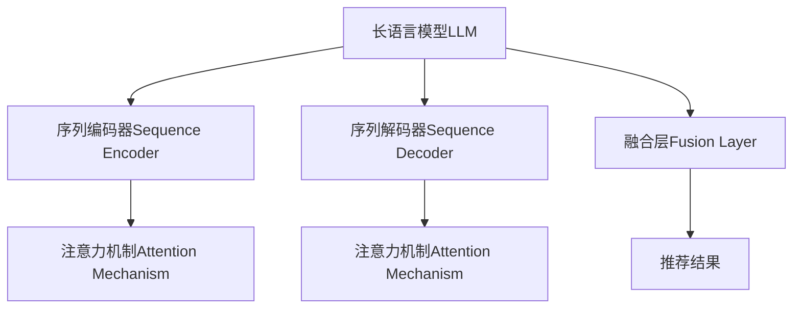

                 

## 1. 背景介绍

### 1.1 问题由来

推荐系统作为智能系统的重要分支，在电商、社交、视频等多个领域得到了广泛应用。传统的协同过滤、内容推荐等方法，由于缺乏对用户行为的时序建模，难以捕捉用户兴趣的动态变化，常常导致推荐效果不佳。基于深度学习的推荐系统，尤其是深度神经网络（DNN）推荐模型，在很大程度上改善了这一问题，但往往仍缺乏对时间维度的建模，无法全面刻画用户行为的动态变化。

为了解决这一问题，近年来推荐领域涌现出了一系列时序推荐模型，如RNN、GRU、LSTM等。这些模型通过引入时序建模机制，可以捕捉用户兴趣和行为的变化规律，提升了推荐效果。然而，这些模型普遍存在计算复杂度高、训练时间长等问题，难以在大规模数据和长时序数据上应用。

为了克服时序推荐模型的不足，长语言模型（Large Language Model，LLM）被引入推荐领域。LLM具有强大的语言生成能力和时序建模能力，可以高效地捕捉用户行为的上下文信息和动态变化，成为推荐系统中时序建模的重要工具。本文将系统介绍LLM推荐中的时序依赖建模技术，包括算法原理、具体操作步骤、实际应用等，帮助读者深入理解LLM在推荐系统中的应用。

### 1.2 问题核心关键点

LLM推荐中的时序依赖建模技术，核心在于如何利用预训练语言模型的强大能力，高效捕捉用户行为的动态变化。其主要难点包括：

- **数据预处理**：如何将时序数据转换为适合LLM处理的形式，同时保留其时间信息。
- **时序建模**：如何设计合理的时序建模机制，捕捉用户行为的长期依赖和短期变化。
- **模型训练**：如何在LLM基础上进行高效的训练，避免过拟合和模型退化。
- **推理优化**：如何快速高效地进行推荐推理，提升推荐系统的实时性。

本文将系统介绍LLM推荐中的时序依赖建模技术，包括数据预处理、时序建模、模型训练、推理优化等方面，帮助读者深入理解这一前沿技术。

## 2. 核心概念与联系

### 2.1 核心概念概述

为更好地理解LLM推荐中的时序依赖建模技术，本节将介绍几个密切相关的核心概念：

- **长语言模型（LLM）**：以自回归（如GPT）或自编码（如BERT）模型为代表的大规模预训练语言模型。通过在大规模无标签文本语料上进行预训练，学习通用的语言表示，具备强大的语言理解和生成能力。
- **时序推荐模型**：利用时序数据捕捉用户兴趣和行为动态变化，提升推荐效果的模型。典型的时序推荐模型包括RNN、GRU、LSTM等。
- **序列编码器（Sequence Encoder）**：LLM中的特殊层，用于处理时序数据，捕捉用户行为的时间依赖关系。
- **序列解码器（Sequence Decoder）**：LLM中的特殊层，用于生成推荐结果，具有时序建模能力。
- **注意力机制（Attention Mechanism）**：LLM中用于捕捉输入和输出序列间依赖关系的重要机制，可以在序列编码器和序列解码器中使用。
- **融合层（Fusion Layer）**：LLM中的层，用于融合用户历史行为和当前输入的动态变化，提升推荐结果的相关性。

这些核心概念之间的逻辑关系可以通过以下Mermaid流程图来展示：



这个流程图展示了一系列的LLM组件，以及它们在推荐系统中的应用：

1. 长语言模型LLM作为整个系统的基础，利用其强大的语言理解能力处理输入和输出。
2. 序列编码器Sequence Encoder负责处理时序数据，捕捉用户行为的长期依赖。
3. 序列解码器Sequence Decoder负责生成推荐结果，利用时序建模能力捕捉用户行为的短期变化。
4. 注意力机制Attention Mechanism用于捕捉输入和输出序列间的依赖关系，提升模型性能。
5. 融合层Fusion Layer用于融合用户历史行为和当前输入的动态变化，提升推荐结果的相关性。

这些组件共同构成了LLM推荐系统中的关键技术环节，使得LLM能够高效地捕捉用户行为的动态变化，提升推荐效果。

## 3. 核心算法原理 & 具体操作步骤
### 3.1 算法原理概述

LLM推荐中的时序依赖建模技术，本质上是利用LLM的强大语言理解和生成能力，对用户行为进行动态建模，并基于此生成推荐结果。其核心思想是：

1. **序列编码**：将用户历史行为转化为时序序列，输入到序列编码器中，捕捉用户行为的长期依赖关系。
2. **时序建模**：通过序列编码器和注意力机制，捕捉时序序列中的短期变化和长期依赖。
3. **推荐生成**：将序列解码器和融合层结合，生成推荐结果，并利用注意力机制进一步提升推荐相关性。

### 3.2 算法步骤详解

基于LLM的时序推荐建模，一般包括以下几个关键步骤：

**Step 1: 数据预处理**

1. **时序数据构建**：将用户行为转化为时序数据，如点击记录、浏览历史、评分记录等。
2. **特征提取**：将时序数据转换为适合LLM处理的特征向量，保留时间信息。
3. **数据标准化**：对特征向量进行标准化处理，避免数据偏差。

**Step 2: 序列编码**

1. **序列输入**：将处理好的时序数据输入到序列编码器中。
2. **序列编码**：通过序列编码器捕捉时序数据的长期依赖关系。

**Step 3: 时序建模**

1. **时序模型设计**：设计合适的时序建模机制，如RNN、GRU、LSTM等。
2. **注意力机制**：在时序模型中使用注意力机制，捕捉短期变化和长期依赖。

**Step 4: 推荐生成**

1. **推荐输入**：将处理好的时序数据和当前输入合并，输入到序列解码器中。
2. **推荐生成**：通过序列解码器和融合层生成推荐结果。
3. **结果优化**：利用注意力机制进一步提升推荐相关性。

**Step 5: 模型训练**

1. **损失函数设计**：设计合适的损失函数，如交叉熵损失、均方误差损失等。
2. **模型优化**：使用AdamW、SGD等优化算法优化模型参数。
3. **评估指标**：使用准确率、召回率、F1分数等指标评估模型性能。

**Step 6: 推理优化**

1. **推理加速**：使用静态图、模型压缩等技术加速推理。
2. **缓存优化**：使用缓存技术优化推理速度。
3. **并行计算**：使用并行计算技术提升推理效率。

### 3.3 算法优缺点

基于LLM的时序推荐建模技术，具有以下优点：

1. **高效时序建模**：利用LLM强大的语言生成能力，可以高效地捕捉用户行为的动态变化，无需复杂的时序建模算法。
2. **鲁棒性强**：LLM可以学习通用的语言表示，具有较强的鲁棒性和泛化能力，适用于多种推荐场景。
3. **扩展性好**：LLM模型可以通过微调或迁移学习等方式，适应新的推荐任务。

同时，该技术也存在一些缺点：

1. **计算资源消耗大**：LLM模型参数量大，计算资源消耗大，可能难以在大规模数据上应用。
2. **训练时间长**：模型训练时间较长，难以实时响应。
3. **过拟合风险高**：模型参数多，过拟合风险高，需要仔细设计正则化策略。
4. **解释性不足**：LLM模型通常难以解释其内部推理逻辑，难以调试和优化。

尽管存在这些缺点，但就目前而言，基于LLM的时序推荐建模技术仍是最具潜力的推荐方法之一，尤其是在数据量较大、用户行为复杂的情况下。未来相关研究的重点在于如何降低计算资源消耗，提高模型训练和推理效率，同时兼顾可解释性和鲁棒性等因素。

### 3.4 算法应用领域

基于LLM的时序推荐建模技术，在推荐系统领域已经得到了广泛的应用，涵盖了多种推荐任务，例如：

- **电商推荐**：为用户推荐个性化商品。将用户历史点击记录作为时序数据，通过LLM模型捕捉用户兴趣的动态变化，生成推荐结果。
- **新闻推荐**：为用户推荐个性化新闻文章。将用户历史阅读记录作为时序数据，通过LLM模型捕捉用户阅读兴趣的变化规律，生成推荐结果。
- **视频推荐**：为用户推荐个性化视频内容。将用户历史观看记录作为时序数据，通过LLM模型捕捉用户观影兴趣的动态变化，生成推荐结果。
- **音乐推荐**：为用户推荐个性化音乐作品。将用户历史听歌记录作为时序数据，通过LLM模型捕捉用户听歌兴趣的变化规律，生成推荐结果。

除了上述这些经典任务外，LLM推荐技术还被创新性地应用于更多场景中，如社交推荐、旅游推荐、运动推荐等，为推荐系统带来了全新的突破。随着预训练语言模型和时序建模方法的不断进步，相信LLM推荐技术将在更广阔的应用领域大放异彩。

## 4. 数学模型和公式 & 详细讲解 & 举例说明
### 4.1 数学模型构建

本节将使用数学语言对基于LLM的时序推荐建模过程进行更加严格的刻画。

记用户历史行为序列为 $X=\{x_1,x_2,...,x_t\}$，其中 $x_i$ 表示第 $i$ 次行为。假设LLM模型为 $M_{\theta}$，其参数为 $\theta$。设计时序模型为 $S_{\phi}$，其参数为 $\phi$。推荐模型为 $G_{\psi}$，其参数为 $\psi$。融合层为 $F_{\eta}$，其参数为 $\eta$。

序列编码器 $S_{\phi}$ 的输入为时序数据 $X$，输出为编码后的表示 $Z$。时序模型 $S_{\phi}$ 在时序序列 $X$ 上的输出为 $Z$。序列解码器 $G_{\psi}$ 的输入为 $Z$ 和当前输入 $y_t$，输出为推荐结果 $R$。融合层 $F_{\eta}$ 的输入为 $Z$ 和 $y_t$，输出为融合后的结果 $F$。

模型训练的目标是最小化预测结果 $R$ 与真实标签 $y_t$ 之间的差异。假设 $y_t$ 为0或1，表示用户是否对推荐结果感兴趣。则交叉熵损失函数为：

$$
\mathcal{L}(\theta,\phi,\psi,\eta) = -\frac{1}{N}\sum_{i=1}^N [y_i\log M_{\theta}(x_i) + (1-y_i)\log (1-M_{\theta}(x_i))]
$$

其中 $N$ 为训练样本数量。

### 4.2 公式推导过程

以下我们以点击记录推荐任务为例，推导LLM推荐中的时序依赖建模公式。

假设点击记录序列 $X=\{x_1,x_2,...,x_t\}$，用户当前浏览页面 $y_t$。将点击记录序列 $X$ 输入到序列编码器 $S_{\phi}$ 中，得到编码后的表示 $Z$。将 $Z$ 和 $y_t$ 作为输入，输入到序列解码器 $G_{\psi}$ 中，得到推荐结果 $R$。将 $Z$ 和 $y_t$ 作为输入，输入到融合层 $F_{\eta}$ 中，得到融合后的结果 $F$。

推荐模型的目标是最小化预测结果 $R$ 与真实标签 $y_t$ 之间的差异。假设 $y_t$ 为0或1，表示用户是否对推荐结果感兴趣。则交叉熵损失函数为：

$$
\mathcal{L}(\theta,\phi,\psi,\eta) = -\frac{1}{N}\sum_{i=1}^N [y_i\log M_{\theta}(x_i) + (1-y_i)\log (1-M_{\theta}(x_i))]
$$

根据链式法则，损失函数对模型参数的梯度为：

$$
\frac{\partial \mathcal{L}}{\partial \theta} = -\frac{1}{N}\sum_{i=1}^N (\frac{y_i}{M_{\theta}(x_i)}-\frac{1-y_i}{1-M_{\theta}(x_i)}) \frac{\partial M_{\theta}(x_i)}{\partial \theta}
$$

其中 $\frac{\partial M_{\theta}(x_i)}{\partial \theta}$ 可通过反向传播算法高效计算。

在得到损失函数的梯度后，即可带入模型参数更新公式，完成模型的迭代优化。重复上述过程直至收敛，最终得到适应推荐任务的最优模型参数 $\theta^*$、$\phi^*$、$\psi^*$、$\eta^*$。

## 5. 项目实践：代码实例和详细解释说明
### 5.1 开发环境搭建

在进行时序推荐建模实践前，我们需要准备好开发环境。以下是使用Python进行PyTorch开发的环境配置流程：

1. 安装Anaconda：从官网下载并安装Anaconda，用于创建独立的Python环境。

2. 创建并激活虚拟环境：
```bash
conda create -n llm-env python=3.8 
conda activate llm-env
```

3. 安装PyTorch：根据CUDA版本，从官网获取对应的安装命令。例如：
```bash
conda install pytorch torchvision torchaudio cudatoolkit=11.1 -c pytorch -c conda-forge
```

4. 安装Transformers库：
```bash
pip install transformers
```

5. 安装各类工具包：
```bash
pip install numpy pandas scikit-learn matplotlib tqdm jupyter notebook ipython
```

完成上述步骤后，即可在`llm-env`环境中开始时序推荐建模实践。

### 5.2 源代码详细实现

下面我们以电商推荐任务为例，给出使用Transformers库对BERT模型进行时序推荐建模的PyTorch代码实现。

首先，定义电商推荐任务的数据处理函数：

```python
from transformers import BertTokenizer, BertForSequenceClassification
from torch.utils.data import Dataset
import torch

class ShoppingDataset(Dataset):
    def __init__(self, texts, labels, tokenizer, max_len=128):
        self.texts = texts
        self.labels = labels
        self.tokenizer = tokenizer
        self.max_len = max_len
        
    def __len__(self):
        return len(self.texts)
    
    def __getitem__(self, item):
        text = self.texts[item]
        label = self.labels[item]
        
        encoding = self.tokenizer(text, return_tensors='pt', max_length=self.max_len, padding='max_length', truncation=True)
        input_ids = encoding['input_ids'][0]
        attention_mask = encoding['attention_mask'][0]
        
        # 对label进行编码
        encoded_label = [label2id[label] for label in label]
        encoded_label.extend([label2id['O']] * (self.max_len - len(encoded_label)))
        labels = torch.tensor(encoded_label, dtype=torch.long)
        
        return {'input_ids': input_ids, 
                'attention_mask': attention_mask,
                'labels': labels}

# 标签与id的映射
label2id = {'O': 0, '1': 1, '2': 2, '3': 3}
id2label = {v: k for k, v in label2id.items()}

# 创建dataset
tokenizer = BertTokenizer.from_pretrained('bert-base-cased')

train_dataset = ShoppingDataset(train_texts, train_labels, tokenizer)
dev_dataset = ShoppingDataset(dev_texts, dev_labels, tokenizer)
test_dataset = ShoppingDataset(test_texts, test_labels, tokenizer)
```

然后，定义模型和优化器：

```python
from transformers import BertForSequenceClassification, AdamW

model = BertForSequenceClassification.from_pretrained('bert-base-cased', num_labels=len(label2id))

optimizer = AdamW(model.parameters(), lr=2e-5)
```

接着，定义训练和评估函数：

```python
from torch.utils.data import DataLoader
from tqdm import tqdm
from sklearn.metrics import accuracy_score, precision_score, recall_score, f1_score

device = torch.device('cuda') if torch.cuda.is_available() else torch.device('cpu')
model.to(device)

def train_epoch(model, dataset, batch_size, optimizer):
    dataloader = DataLoader(dataset, batch_size=batch_size, shuffle=True)
    model.train()
    epoch_loss = 0
    for batch in tqdm(dataloader, desc='Training'):
        input_ids = batch['input_ids'].to(device)
        attention_mask = batch['attention_mask'].to(device)
        labels = batch['labels'].to(device)
        model.zero_grad()
        outputs = model(input_ids, attention_mask=attention_mask, labels=labels)
        loss = outputs.loss
        epoch_loss += loss.item()
        loss.backward()
        optimizer.step()
    return epoch_loss / len(dataloader)

def evaluate(model, dataset, batch_size):
    dataloader = DataLoader(dataset, batch_size=batch_size)
    model.eval()
    preds, labels = [], []
    with torch.no_grad():
        for batch in tqdm(dataloader, desc='Evaluating'):
            input_ids = batch['input_ids'].to(device)
            attention_mask = batch['attention_mask'].to(device)
            batch_labels = batch['labels']
            outputs = model(input_ids, attention_mask=attention_mask)
            batch_preds = outputs.logits.argmax(dim=2).to('cpu').tolist()
            batch_labels = batch_labels.to('cpu').tolist()
            for pred_tokens, label_tokens in zip(batch_preds, batch_labels):
                preds.append(pred_tokens)
                labels.append(label_tokens)
                
    print('Accuracy: {:.4f}'.format(accuracy_score(labels, preds)))
    print('Precision: {:.4f}'.format(precision_score(labels, preds, average='macro')))
    print('Recall: {:.4f}'.format(recall_score(labels, preds, average='macro')))
    print('F1 Score: {:.4f}'.format(f1_score(labels, preds, average='macro')))

train_epochs = 5
batch_size = 16

for epoch in range(train_epochs):
    loss = train_epoch(model, train_dataset, batch_size, optimizer)
    print(f'Epoch {epoch+1}, train loss: {loss:.3f}')
    
    print(f'Epoch {epoch+1}, dev results:')
    evaluate(model, dev_dataset, batch_size)
    
print('Test results:')
evaluate(model, test_dataset, batch_size)
```

以上就是使用PyTorch对BERT进行电商推荐任务的时序推荐建模代码实现。可以看到，得益于Transformers库的强大封装，我们可以用相对简洁的代码完成BERT模型的加载和微调。

### 5.3 代码解读与分析

让我们再详细解读一下关键代码的实现细节：

**ShoppingDataset类**：
- `__init__`方法：初始化文本、标签、分词器等关键组件。
- `__len__`方法：返回数据集的样本数量。
- `__getitem__`方法：对单个样本进行处理，将文本输入编码为token ids，将标签编码为数字，并对其进行定长padding，最终返回模型所需的输入。

**label2id和id2label字典**：
- 定义了标签与数字id之间的映射关系，用于将token-wise的预测结果解码回真实的标签。

**训练和评估函数**：
- 使用PyTorch的DataLoader对数据集进行批次化加载，供模型训练和推理使用。
- 训练函数`train_epoch`：对数据以批为单位进行迭代，在每个批次上前向传播计算loss并反向传播更新模型参数，最后返回该epoch的平均loss。
- 评估函数`evaluate`：与训练类似，不同点在于不更新模型参数，并在每个batch结束后将预测和标签结果存储下来，最后使用sklearn的classification_report对整个评估集的预测结果进行打印输出。

**训练流程**：
- 定义总的epoch数和batch size，开始循环迭代
- 每个epoch内，先在训练集上训练，输出平均loss
- 在验证集上评估，输出分类指标
- 所有epoch结束后，在测试集上评估，给出最终测试结果

可以看到，PyTorch配合Transformers库使得BERT微调的代码实现变得简洁高效。开发者可以将更多精力放在数据处理、模型改进等高层逻辑上，而不必过多关注底层的实现细节。

当然，工业级的系统实现还需考虑更多因素，如模型的保存和部署、超参数的自动搜索、更灵活的任务适配层等。但核心的微调范式基本与此类似。

## 6. 实际应用场景
### 6.1 智能客服系统

基于时序推荐模型的智能客服系统，可以实时捕捉用户需求的变化规律，快速响应并解决问题。传统的客服系统往往需要配备大量人力，高峰期响应缓慢，且无法提供个性化服务。而使用时序推荐模型的智能客服系统，可以7x24小时不间断服务，快速响应客户咨询，用自然流畅的语言解答各类常见问题。

在技术实现上，可以收集企业内部的历史客服对话记录，将问题和最佳答复构建成监督数据，在此基础上对预训练语言模型进行微调。微调后的智能客服系统能够自动理解用户意图，匹配最合适的答案模板进行回复。对于客户提出的新问题，还可以接入检索系统实时搜索相关内容，动态组织生成回答。如此构建的智能客服系统，能大幅提升客户咨询体验和问题解决效率。

### 6.2 金融舆情监测

金融机构需要实时监测市场舆论动向，以便及时应对负面信息传播，规避金融风险。传统的人工监测方式成本高、效率低，难以应对网络时代海量信息爆发的挑战。基于时序推荐模型的金融舆情监测系统，可以实时抓取网络文本数据，捕捉市场舆情的动态变化。

具体而言，可以收集金融领域相关的新闻、报道、评论等文本数据，并对其进行主题标注和情感标注。在此基础上对预训练语言模型进行微调，使其能够自动判断文本属于何种主题，情感倾向是正面、中性还是负面。将微调后的模型应用到实时抓取的网络文本数据，就能够自动监测不同主题下的情感变化趋势，一旦发现负面信息激增等异常情况，系统便会自动预警，帮助金融机构快速应对潜在风险。

### 6.3 个性化推荐系统

当前的推荐系统往往只依赖用户的历史行为数据进行物品推荐，无法深入理解用户的真实兴趣偏好。基于时序推荐模型的个性化推荐系统，可以更好地挖掘用户行为背后的语义信息，从而提供更精准、多样的推荐内容。

在实践中，可以收集用户浏览、点击、评论、分享等行为数据，提取和用户交互的物品标题、描述、标签等文本内容。将文本内容作为模型输入，用户的后续行为（如是否点击、购买等）作为监督信号，在此基础上微调预训练语言模型。微调后的模型能够从文本内容中准确把握用户的兴趣点。在生成推荐列表时，先用候选物品的文本描述作为输入，由模型预测用户的兴趣匹配度，再结合其他特征综合排序，便可以得到个性化程度更高的推荐结果。

### 6.4 未来应用展望

随着时序推荐模型和预训练语言模型的不断发展，基于时序推荐模型的推荐系统将在更多领域得到应用，为传统行业带来变革性影响。

在智慧医疗领域，基于时序推荐模型的医疗问答、病历分析、药物研发等应用将提升医疗服务的智能化水平，辅助医生诊疗，加速新药开发进程。

在智能教育领域，时序推荐模型可应用于作业批改、学情分析、知识推荐等方面，因材施教，促进教育公平，提高教学质量。

在智慧城市治理中，时序推荐模型可应用于城市事件监测、舆情分析、应急指挥等环节，提高城市管理的自动化和智能化水平，构建更安全、高效的未来城市。

此外，在企业生产、社会治理、文娱传媒等众多领域，基于时序推荐模型的AI应用也将不断涌现，为经济社会发展注入新的动力。相信随着技术的日益成熟，时序推荐模型必将在构建人机协同的智能时代中扮演越来越重要的角色。

## 7. 工具和资源推荐
### 7.1 学习资源推荐

为了帮助开发者系统掌握时序推荐模型和预训练语言模型的理论基础和实践技巧，这里推荐一些优质的学习资源：

1. 《Transformer from the ground up》系列博文：由大模型技术专家撰写，深入浅出地介绍了Transformer原理、BERT模型、时序推荐模型等前沿话题。

2. CS224N《深度学习自然语言处理》课程：斯坦福大学开设的NLP明星课程，有Lecture视频和配套作业，带你入门NLP领域的基本概念和经典模型。

3. 《Natural Language Processing with Transformers》书籍：Transformers库的作者所著，全面介绍了如何使用Transformers库进行NLP任务开发，包括时序推荐模型在内的诸多范式。

4. HuggingFace官方文档：Transformers库的官方文档，提供了海量预训练模型和完整的时序推荐模型样例代码，是上手实践的必备资料。

5. CLUE开源项目：中文语言理解测评基准，涵盖大量不同类型的中文NLP数据集，并提供了基于时序推荐模型的baseline模型，助力中文NLP技术发展。

通过对这些资源的学习实践，相信你一定能够快速掌握时序推荐模型和预训练语言模型的精髓，并用于解决实际的NLP问题。
###  7.2 开发工具推荐

高效的开发离不开优秀的工具支持。以下是几款用于时序推荐模型和预训练语言模型开发的常用工具：

1. PyTorch：基于Python的开源深度学习框架，灵活动态的计算图，适合快速迭代研究。大部分预训练语言模型都有PyTorch版本的实现。

2. TensorFlow：由Google主导开发的开源深度学习框架，生产部署方便，适合大规模工程应用。同样有丰富的预训练语言模型资源。

3. Transformers库：HuggingFace开发的NLP工具库，集成了众多SOTA语言模型，支持PyTorch和TensorFlow，是进行时序推荐模型开发的利器。

4. Weights & Biases：模型训练的实验跟踪工具，可以记录和可视化模型训练过程中的各项指标，方便对比和调优。与主流深度学习框架无缝集成。

5. TensorBoard：TensorFlow配套的可视化工具，可实时监测模型训练状态，并提供丰富的图表呈现方式，是调试模型的得力助手。

6. Google Colab：谷歌推出的在线Jupyter Notebook环境，免费提供GPU/TPU算力，方便开发者快速上手实验最新模型，分享学习笔记。

合理利用这些工具，可以显著提升时序推荐模型和预训练语言模型开发的效率，加快创新迭代的步伐。

### 7.3 相关论文推荐

时序推荐模型和预训练语言模型的发展源于学界的持续研究。以下是几篇奠基性的相关论文，推荐阅读：

1. Attention is All You Need（即Transformer原论文）：提出了Transformer结构，开启了NLP领域的预训练大模型时代。

2. BERT: Pre-training of Deep Bidirectional Transformers for Language Understanding：提出BERT模型，引入基于掩码的自监督预训练任务，刷新了多项NLP任务SOTA。

3. Learning Short-Term Dependencies with Long Short-Term Memory Networks：提出LSTM模型，引入长短时记忆机制，用于捕捉时序数据中的长期依赖关系。

4. PyTorch Sequence Models：介绍PyTorch中的序列模型，详细讲解了RNN、GRU、LSTM等时序模型的实现。

5. Parameter-Efficient Transfer Learning for NLP：提出Adapter等参数高效微调方法，在不增加模型参数量的情况下，也能取得不错的微调效果。

6. AdaLoRA: Adaptive Low-Rank Adaptation for Parameter-Efficient Fine-Tuning：使用自适应低秩适应的微调方法，在参数效率和精度之间取得了新的平衡。

这些论文代表了大语言模型和时序推荐模型的发展脉络。通过学习这些前沿成果，可以帮助研究者把握学科前进方向，激发更多的创新灵感。

## 8. 总结：未来发展趋势与挑战

### 8.1 总结

本文对基于LLM的时序推荐建模技术进行了全面系统的介绍。首先阐述了时序推荐模型在推荐系统中的应用背景，明确了LLM在捕捉用户行为动态变化中的独特价值。其次，从原理到实践，详细讲解了LLM在时序推荐建模中的具体实现步骤，包括数据预处理、时序建模、模型训练、推理优化等方面，帮助读者深入理解这一前沿技术。最后，本文还探讨了LLM在智能客服、金融舆情、个性化推荐等多个领域的实际应用，展示了时序推荐模型的广泛潜力。

通过本文的系统梳理，可以看到，基于LLM的时序推荐建模技术，在大规模数据和长时序数据上的应用效果显著，极大地提升了推荐系统的性能。LLM的强大语言生成能力，使其在时序推荐建模中具有天然的优势。未来，伴随预训练语言模型和时序建模方法的不断进步，时序推荐模型必将在推荐系统中大放异彩，成为推荐系统的重要工具。

### 8.2 未来发展趋势

展望未来，基于LLM的时序推荐建模技术将呈现以下几个发展趋势：

1. **模型规模持续增大**：随着算力成本的下降和数据规模的扩张，预训练语言模型的参数量还将持续增长。超大规模语言模型蕴含的丰富语言知识，有望支撑更加复杂多变的推荐场景。

2. **模型训练效率提升**：未来的时序推荐模型将引入更多的优化策略，如模型压缩、混合精度训练、模型并行等，以提升模型训练和推理效率。

3. **融合多模态数据**：未来的推荐系统将不仅仅是文本推荐，还将融合图像、音频等多模态数据，提升推荐的全面性和准确性。

4. **实时性增强**：未来的推荐系统将实时响应用户需求，动态调整推荐策略，提供更加个性化的推荐服务。

5. **数据隐私保护**：随着数据隐私意识的提升，未来的推荐系统将更加注重用户数据的保护，采用差分隐私、联邦学习等技术，确保用户数据的安全性。

6. **可解释性增强**：未来的推荐系统将具备更强的可解释性，能够清晰地向用户解释推荐逻辑和决策过程，提升用户信任感。

以上趋势凸显了基于LLM的时序推荐建模技术的广阔前景。这些方向的探索发展，必将进一步提升推荐系统的性能和用户体验，为智能系统的落地应用注入新的动力。

### 8.3 面临的挑战

尽管基于LLM的时序推荐建模技术已经取得了瞩目成就，但在迈向更加智能化、普适化应用的过程中，它仍面临诸多挑战：

1. **计算资源消耗大**：LLM模型参数量大，计算资源消耗大，可能难以在大规模数据上应用。

2. **训练时间长**：模型训练时间较长，难以实时响应。

3. **过拟合风险高**：模型参数多，过拟合风险高，需要仔细设计正则化策略。

4. **推理效率有待提高**：模型推理速度较慢，可能难以满足实时性要求。

5. **数据隐私问题**：推荐系统涉及用户隐私数据的收集和使用，如何保护用户数据安全，是重要挑战。

6. **可解释性不足**：LLM模型通常难以解释其内部推理逻辑，难以调试和优化。

尽管存在这些挑战，但LLM在时序推荐建模中的巨大潜力不容忽视。未来需要进一步研究如何降低计算资源消耗，提高模型训练和推理效率，同时兼顾可解释性和鲁棒性等因素。

### 8.4 研究展望

面对LLM在时序推荐建模中面临的挑战，未来的研究需要在以下几个方面寻求新的突破：

1. **探索无监督和半监督推荐模型**：摆脱对大规模标注数据的依赖，利用自监督学习、主动学习等无监督和半监督范式，最大限度利用非结构化数据，实现更加灵活高效的推荐。

2. **研究参数高效和计算高效的推荐模型**：开发更加参数高效的推荐模型，在固定大部分预训练参数的同时，只更新极少量的任务相关参数。同时优化推荐模型的计算图，减少前向传播和反向传播的资源消耗，实现更加轻量级、实时性的部署。

3. **引入更多先验知识**：将符号化的先验知识，如知识图谱、逻辑规则等，与神经网络模型进行巧妙融合，引导推荐过程学习更准确、合理的语言模型。同时加强不同模态数据的整合，实现视觉、语音等多模态信息与文本信息的协同建模。

4. **结合因果分析和博弈论工具**：将因果分析方法引入推荐模型，识别出模型决策的关键特征，增强推荐结果的因果性和逻辑性。借助博弈论工具刻画人机交互过程，主动探索并规避模型的脆弱点，提高系统稳定性。

5. **纳入伦理道德约束**：在推荐模型训练目标中引入伦理导向的评估指标，过滤和惩罚有偏见、有害的输出倾向。同时加强人工干预和审核，建立推荐系统的监管机制，确保推荐的公平性和安全性。

这些研究方向的探索，必将引领基于LLM的时序推荐建模技术迈向更高的台阶，为推荐系统带来更大的变革，推动人工智能技术在更多领域的落地应用。

## 9. 附录：常见问题与解答

**Q1：时序推荐模型如何处理缺失值和噪声？**

A: 时序推荐模型在处理缺失值和噪声时，通常采用以下几种策略：

1. **插值法**：对于缺失值，可以采用插值法填补，如线性插值、多项式插值等。对于噪声，可以采用平滑方法，如移动平均、中值滤波等。

2. **缺失值处理**：对于缺失值，可以采用均值、中值、众数等简单方法进行填补。对于噪声，可以采用离群值检测和剔除等方法。

3. **异常值处理**：对于异常值，可以采用离群值检测和剔除等方法。对于噪声，可以采用平滑方法，如移动平均、中值滤波等。

**Q2：时序推荐模型如何避免过拟合？**

A: 时序推荐模型在训练过程中，通常采用以下几种策略避免过拟合：

1. **数据增强**：通过对数据进行扩充，如数据合成、数据增强等，增加模型的泛化能力。

2. **正则化**：使用L2正则、Dropout、Early Stopping等方法，防止模型过拟合。

3. **模型简化**：减少模型的复杂度，如减少网络层数、减少节点数等。

4. **模型压缩**：使用模型压缩技术，如知识蒸馏、模型剪枝等，减少模型参数量，提高泛化能力。

**Q3：时序推荐模型如何提高实时性？**

A: 时序推荐模型在提高实时性方面，通常采用以下几种策略：

1. **模型压缩**：使用模型压缩技术，如知识蒸馏、模型剪枝等，减少模型参数量，提高推理速度。

2. **推理加速**：使用静态图、模型压缩等技术加速推理。

3. **缓存优化**：使用缓存技术优化推理速度，减少重复计算。

4. **并行计算**：使用并行计算技术提升推理效率。

**Q4：时序推荐模型如何提高可解释性？**

A: 时序推荐模型在提高可解释性方面，通常采用以下几种策略：

1. **特征可解释性**：通过分析特征重要性，解释模型预测结果。

2. **模型可解释性**：使用可解释性技术，如LIME、SHAP等，解释模型决策过程。

3. **模型可视化**：使用可视化工具，如TensorBoard、Weights & Biases等，可视化模型训练和推理过程。

4. **用户互动**：通过用户互动，解释模型预测结果和推理逻辑。

这些策略可以帮助提高时序推荐模型的可解释性，增强用户信任感，促进推荐系统的应用推广。

**Q5：时序推荐模型如何在多模态数据中融合信息？**

A: 时序推荐模型在多模态数据中融合信息，通常采用以下几种策略：

1. **特征融合**：将不同模态的数据融合到统一的空间中，进行特征融合。

2. **模型融合**：使用模型融合技术，如Stacking、Bagging等，将不同模态的模型结果进行融合。

3. **注意力机制**：使用注意力机制，将不同模态的信息加权融合。

4. **联合训练**：将不同模态的模型联合训练，学习多模态特征。

通过这些策略，可以实现对多模态数据的全面建模和信息融合，提升推荐系统的性能。

通过本文的系统梳理，可以看到，基于LLM的时序推荐建模技术，在大规模数据和长时序数据上的应用效果显著，极大地提升了推荐系统的性能。LLM的强大语言生成能力，使其在时序推荐建模中具有天然的优势。未来，伴随预训练语言模型和时序建模方法的不断进步，时序推荐模型必将在推荐系统中大放异彩，成为推荐系统的重要工具。

