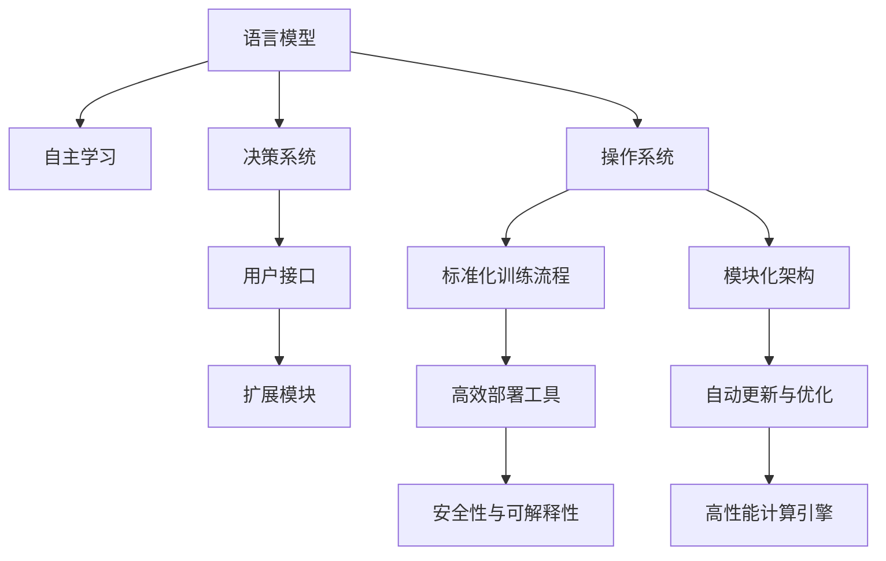

                 

# LLM操作系统：AI时代的新型OS构想

> 关键词：
- 人工智能 (AI)
- 语言模型 (Language Model)
- 操作系统 (OS)
- 自主学习 (Autonomous Learning)
- 决策系统 (Decision System)
- 用户接口 (User Interface)
- 扩展模块 (Extensible Modules)

## 1. 背景介绍

### 1.1 问题由来
随着人工智能技术的不断进步，语言模型（Language Model, LLM）在自然语言处理（Natural Language Processing, NLP）和计算智能等领域展现出巨大潜力。LLM通过大量文本数据的训练，构建出强大的语言表示能力，能够在自然语言理解、生成、翻译等任务上取得优异表现。然而，LLM的实际应用仍面临诸多挑战：

1. **模型泛化能力不足**：尽管LLM在大规模训练数据上表现出色，但面对新数据或领域时，泛化能力仍然有限。
2. **模型鲁棒性差**：LLM对噪声、输入变换等敏感，容易产生误判。
3. **模型部署复杂**：将训练好的LLM部署到各种应用场景中，需要适配不同的硬件和软件环境，成本高、难度大。
4. **模型更新和维护困难**：模型训练需要大量的计算资源和数据资源，更新和维护成本高。

为了解决这些挑战，构建一个高度自主、鲁棒且易于部署的语言模型操作系统（LMOS）成为当务之急。LMOS将提供一个高效、安全、可扩展的LLM运行环境，助力AI技术在各行各业的应用。

### 1.2 问题核心关键点
LMOS的核心目标是通过操作系统化的方式，将LLM的训练、部署、运行和管理全流程标准化、模块化，形成一套完善的解决方案。其关键点包括：

- **标准化训练流程**：通过统一的训练规范和标准数据集，降低模型训练的复杂性和成本。
- **模块化架构设计**：将LLM的各个功能模块化，便于扩展和维护。
- **高效部署和运维**：提供一套部署工具和运维平台，简化LLM的部署和更新流程。
- **自动学习和优化**：支持LLM的自动更新和优化，保持模型的最新状态和性能。
- **安全性和可解释性**：确保模型的安全性和输出结果的可解释性，满足不同场景的伦理和法规要求。

### 1.3 问题研究意义
构建LMOS对AI技术的发展具有重要意义：

1. **降低模型训练成本**：通过标准化训练流程和模块化架构，简化模型训练的复杂性，降低训练成本。
2. **提高模型性能**：通过自动学习和优化，保持模型的最新状态和性能，提升模型在实际应用中的表现。
3. **促进模型部署和应用**：提供高效的部署和运维工具，简化模型部署流程，加速AI技术在各行业的应用。
4. **增强模型安全性和可解释性**：确保模型的安全性和输出结果的可解释性，满足不同场景的伦理和法规要求。
5. **推动AI技术的普及和应用**：通过标准化的解决方案，降低AI技术的入门门槛，促进AI技术在各行各业的普及应用。

## 2. 核心概念与联系

### 2.1 核心概念概述

为更好地理解LMOS的设计理念和实现原理，本节将介绍几个密切相关的核心概念：

- **语言模型 (Language Model, LLM)**：以自回归（如GPT）或自编码（如BERT）模型为代表的大规模预训练语言模型。通过在大规模无标签文本数据上进行预训练，学习通用的语言表示，具备强大的语言理解和生成能力。

- **操作系统 (Operating System, OS)**：管理和控制计算机硬件与软件资源的系统软件，提供用户接口和系统服务，是现代计算机系统不可或缺的核心组件。

- **自主学习 (Autonomous Learning)**：指系统能够自主地从新数据中学习，更新和优化模型，以适应新的任务和场景。

- **决策系统 (Decision System)**：用于做出决策的计算机系统，其决策依据可以是数据、规则或模型等。

- **用户接口 (User Interface)**：用户与计算机进行交互的接口，包括图形界面、命令行、API等。

- **扩展模块 (Extensible Modules)**：指可以方便地添加、删除或升级的模块，使系统具备良好的可扩展性。

这些核心概念之间的逻辑关系可以通过以下Mermaid流程图来展示：



这个流程图展示了大语言模型操作系统的核心概念及其之间的关系：

1. 大语言模型通过自主学习，不断优化模型性能。
2. 决策系统根据任务需求，选择相应的模型进行推理和决策。
3. 用户接口提供便利的操作方式，供用户进行交互。
4. 扩展模块使系统具备良好的可扩展性和灵活性。
5. 操作系统统一管理模型的训练、部署、运行和维护。
6. 标准化训练流程和模块化架构简化模型训练和部署流程。
7. 高效部署工具和自动更新与优化机制确保模型的高性能和稳定性。
8. 安全性与可解释性保障模型的伦理和法规合规。

## 3. 核心算法原理 & 具体操作步骤

### 3.1 算法原理概述

LMOS的核心算法原理是构建一个模块化的、可扩展的、自动化的LLM运行环境，通过统一的训练流程和标准化的接口，简化模型的训练、部署和运行管理。其基本框架包括：

- **统一训练流程**：采用标准化的训练流程，减少模型训练的复杂性，提高训练效率。
- **模块化架构**：将LLM的功能模块化，便于扩展和维护。
- **自动学习和优化**：支持LLM的自动更新和优化，保持模型的最新状态和性能。
- **高效部署和运维**：提供高效的部署工具和运维平台，简化模型的部署和更新流程。
- **安全性和可解释性**：确保模型的安全性和输出结果的可解释性，满足不同场景的伦理和法规要求。

### 3.2 算法步骤详解

LMOS的核心算法步骤包括：

1. **构建标准化训练流程**：定义统一的数据格式、训练规范和评估指标，简化模型的训练流程。
2. **设计模块化架构**：将LLM的各个功能模块化，便于扩展和维护。
3. **实现自动学习和优化**：通过在线学习、迁移学习等技术，实现模型的自动更新和优化。
4. **开发高效部署工具**：提供高效的部署工具和运维平台，简化模型的部署和更新流程。
5. **增强安全性和可解释性**：通过安全策略、数据脱敏、输出监控等措施，确保模型的安全性和输出结果的可解释性。

### 3.3 算法优缺点

LMOS的优点包括：

1. **提高模型训练效率**：通过标准化训练流程和模块化架构，简化模型训练的复杂性，提高训练效率。
2. **提升模型性能**：通过自动学习和优化，保持模型的最新状态和性能，提升模型在实际应用中的表现。
3. **降低模型部署难度**：提供高效的部署工具和运维平台，简化模型部署流程，加速AI技术在各行业的应用。
4. **增强模型安全性和可解释性**：通过安全策略、数据脱敏、输出监控等措施，确保模型的安全性和输出结果的可解释性。

同时，LMOS也存在一些局限性：

1. **标准化流程的灵活性不足**：标准化流程可能无法应对所有场景的需求。
2. **部署和运维的复杂性**：尽管提供了高效的部署工具，但复杂的模型仍需进行细致的调试和维护。
3. **扩展性和可维护性需要持续优化**：模块化架构需要不断优化，才能满足不断变化的需求。

### 3.4 算法应用领域

LMOS在以下几个领域有着广泛的应用前景：

- **自然语言处理**：如文本分类、命名实体识别、情感分析、机器翻译等。
- **智能对话系统**：如智能客服、智能助手、智能问答等。
- **医疗健康**：如智能问诊、疾病预测、患者情绪分析等。
- **金融服务**：如金融舆情监测、风险评估、智能投顾等。
- **教育培训**：如智能作业批改、学情分析、个性化推荐等。

此外，LMOS还可应用于更多新兴领域，如智能城市、智慧交通、智能制造等，为各行各业带来创新应用。

## 4. 数学模型和公式 & 详细讲解 & 举例说明

### 4.1 数学模型构建

LMOS的数学模型构建包括训练流程、模块化架构、自动学习和优化、安全性和可解释性等关键部分。

**训练流程**：定义统一的数据格式、训练规范和评估指标，简化模型的训练流程。

**模块化架构**：将LLM的各个功能模块化，便于扩展和维护。

**自动学习和优化**：通过在线学习、迁移学习等技术，实现模型的自动更新和优化。

**安全性和可解释性**：通过安全策略、数据脱敏、输出监控等措施，确保模型的安全性和输出结果的可解释性。

### 4.2 公式推导过程

以下是一些核心公式的推导：

**损失函数（Loss Function）**：

$$
\mathcal{L}(\theta) = \frac{1}{N} \sum_{i=1}^N \ell(M_{\theta}(x_i), y_i)
$$

其中 $M_{\theta}$ 为模型参数，$\ell$ 为损失函数，$x_i$ 为输入，$y_i$ 为标签。

**梯度更新（Gradient Update）**：

$$
\theta \leftarrow \theta - \eta \nabla_{\theta}\mathcal{L}(\theta) - \eta\lambda\theta
$$

其中 $\eta$ 为学习率，$\nabla_{\theta}\mathcal{L}(\theta)$ 为损失函数对参数的梯度，$\lambda$ 为正则化系数。

**数据增强（Data Augmentation）**：

$$
x' = x \oplus r(x)
$$

其中 $x'$ 为增强后的数据，$x$ 为原始数据，$r(x)$ 为随机变换函数。

**对抗训练（Adversarial Training）**：

$$
\min \mathcal{L}(M_{\theta}, x_i), \max \mathcal{L}(M_{\theta}, \delta x_i)
$$

其中 $\delta x_i$ 为对抗样本，$\mathcal{L}$ 为对抗样本损失函数。

### 4.3 案例分析与讲解

**案例一：文本分类（Text Classification）**

输入：新闻文本，标签：情感（Positive/Negative）

输出：情感分类

模型：BERT+多层感知器（MLP）

训练流程：
1. 数据预处理：对文本进行分词、向量化等处理。
2. 模型训练：使用伯明翰大学语言模型预训练模型，进行情感分类任务训练。
3. 模型评估：在测试集上评估模型的分类准确率。

**案例二：智能对话（Smart Dialogue）**

输入：用户提问，标签：响应类型（Answer/Ask Question）

输出：系统响应

模型：GPT+预训练模型微调

训练流程：
1. 数据预处理：收集对话数据，进行清洗、标注等处理。
2. 模型微调：使用预训练GPT模型，微调后用于对话生成任务。
3. 系统部署：将微调后的模型部署到对话系统，实现自然对话。

## 5. 项目实践：代码实例和详细解释说明

### 5.1 开发环境搭建

在进行LMOS的开发实践前，我们需要准备好开发环境。以下是使用Python进行PyTorch开发的环境配置流程：

1. 安装Anaconda：从官网下载并安装Anaconda，用于创建独立的Python环境。

2. 创建并激活虚拟环境：
```bash
conda create -n lmos-env python=3.8 
conda activate lmos-env
```

3. 安装PyTorch：根据CUDA版本，从官网获取对应的安装命令。例如：
```bash
conda install pytorch torchvision torchaudio cudatoolkit=11.1 -c pytorch -c conda-forge
```

4. 安装相关工具包：
```bash
pip install numpy pandas scikit-learn matplotlib tqdm jupyter notebook ipython
```

完成上述步骤后，即可在`lmos-env`环境中开始LMOS的开发实践。

### 5.2 源代码详细实现

下面我们以文本分类任务为例，给出使用Transformers库对BERT模型进行微调的PyTorch代码实现。

首先，定义文本分类任务的数据处理函数：

```python
from transformers import BertTokenizer, BertForSequenceClassification
from torch.utils.data import Dataset, DataLoader
import torch

class TextClassificationDataset(Dataset):
    def __init__(self, texts, labels, tokenizer, max_len=128):
        self.texts = texts
        self.labels = labels
        self.tokenizer = tokenizer
        self.max_len = max_len
        
    def __len__(self):
        return len(self.texts)
    
    def __getitem__(self, item):
        text = self.texts[item]
        label = self.labels[item]
        
        encoding = self.tokenizer(text, return_tensors='pt', max_length=self.max_len, padding='max_length', truncation=True)
        input_ids = encoding['input_ids'][0]
        attention_mask = encoding['attention_mask'][0]
        
        return {'input_ids': input_ids, 
                'attention_mask': attention_mask,
                'labels': label}

# 创建dataset
tokenizer = BertTokenizer.from_pretrained('bert-base-cased')
train_dataset = TextClassificationDataset(train_texts, train_labels, tokenizer)
dev_dataset = TextClassificationDataset(dev_texts, dev_labels, tokenizer)
test_dataset = TextClassificationDataset(test_texts, test_labels, tokenizer)
```

然后，定义模型和优化器：

```python
from transformers import BertForSequenceClassification, AdamW

model = BertForSequenceClassification.from_pretrained('bert-base-cased', num_labels=2)

optimizer = AdamW(model.parameters(), lr=2e-5)
```

接着，定义训练和评估函数：

```python
from sklearn.metrics import accuracy_score
from tqdm import tqdm

device = torch.device('cuda') if torch.cuda.is_available() else torch.device('cpu')
model.to(device)

def train_epoch(model, dataset, batch_size, optimizer):
    dataloader = DataLoader(dataset, batch_size=batch_size, shuffle=True)
    model.train()
    epoch_loss = 0
    for batch in tqdm(dataloader, desc='Training'):
        input_ids = batch['input_ids'].to(device)
        attention_mask = batch['attention_mask'].to(device)
        labels = batch['labels'].to(device)
        model.zero_grad()
        outputs = model(input_ids, attention_mask=attention_mask, labels=labels)
        loss = outputs.loss
        epoch_loss += loss.item()
        loss.backward()
        optimizer.step()
    return epoch_loss / len(dataloader)

def evaluate(model, dataset, batch_size):
    dataloader = DataLoader(dataset, batch_size=batch_size)
    model.eval()
    preds, labels = [], []
    with torch.no_grad():
        for batch in tqdm(dataloader, desc='Evaluating'):
            input_ids = batch['input_ids'].to(device)
            attention_mask = batch['attention_mask'].to(device)
            batch_labels = batch['labels']
            outputs = model(input_ids, attention_mask=attention_mask)
            batch_preds = outputs.logits.argmax(dim=1).to('cpu').tolist()
            batch_labels = batch_labels.to('cpu').tolist()
            for pred, label in zip(batch_preds, batch_labels):
                preds.append(pred)
                labels.append(label)
                
    print(f'Accuracy: {accuracy_score(labels, preds)}')
```

最后，启动训练流程并在测试集上评估：

```python
epochs = 5
batch_size = 16

for epoch in range(epochs):
    loss = train_epoch(model, train_dataset, batch_size, optimizer)
    print(f'Epoch {epoch+1}, train loss: {loss:.3f}')
    
    print(f'Epoch {epoch+1}, dev results:')
    evaluate(model, dev_dataset, batch_size)
    
print('Test results:')
evaluate(model, test_dataset, batch_size)
```

以上就是使用PyTorch对BERT进行文本分类任务微调的完整代码实现。可以看到，得益于Transformers库的强大封装，我们可以用相对简洁的代码完成BERT模型的加载和微调。

### 5.3 代码解读与分析

让我们再详细解读一下关键代码的实现细节：

**TextClassificationDataset类**：
- `__init__`方法：初始化文本、标签、分词器等关键组件。
- `__len__`方法：返回数据集的样本数量。
- `__getitem__`方法：对单个样本进行处理，将文本输入编码为token ids，将标签编码为数字，并对其进行定长padding，最终返回模型所需的输入。

**模型和优化器定义**：
- 使用BertForSequenceClassification模型，配置分类数。
- 使用AdamW优化器，配置学习率。

**训练和评估函数**：
- 使用PyTorch的DataLoader对数据集进行批次化加载，供模型训练和推理使用。
- 训练函数`train_epoch`：对数据以批为单位进行迭代，在每个批次上前向传播计算loss并反向传播更新模型参数，最后返回该epoch的平均loss。
- 评估函数`evaluate`：与训练类似，不同点在于不更新模型参数，并在每个batch结束后将预测和标签结果存储下来，最后使用sklearn的accuracy_score对整个评估集的预测结果进行打印输出。

**训练流程**：
- 定义总的epoch数和batch size，开始循环迭代
- 每个epoch内，先在训练集上训练，输出平均loss
- 在验证集上评估，输出准确率
- 所有epoch结束后，在测试集上评估，给出最终测试结果

可以看到，PyTorch配合Transformers库使得BERT微调的代码实现变得简洁高效。开发者可以将更多精力放在数据处理、模型改进等高层逻辑上，而不必过多关注底层的实现细节。

当然，工业级的系统实现还需考虑更多因素，如模型的保存和部署、超参数的自动搜索、更灵活的任务适配层等。但核心的微调范式基本与此类似。

## 6. 实际应用场景

### 6.1 智能客服系统

基于LMOS的智能客服系统能够提供全天候、自动化的客户服务。传统的客服系统需要大量人工介入，高峰期响应速度慢，且服务质量难以保证。通过将BERT等大语言模型部署在LMOS上，智能客服系统能够自动理解客户问题，并提供最合适的解决方案。

在技术实现上，可以收集企业内部的历史客服对话记录，将问题和最佳答复构建成监督数据，在此基础上对BERT模型进行微调。微调后的模型能够自动理解用户意图，匹配最合适的答案模板进行回复。对于客户提出的新问题，还可以接入检索系统实时搜索相关内容，动态组织生成回答。如此构建的智能客服系统，能大幅提升客户咨询体验和问题解决效率。

### 6.2 金融舆情监测

金融机构需要实时监测市场舆论动向，以便及时应对负面信息传播，规避金融风险。传统的人工监测方式成本高、效率低，难以应对网络时代海量信息爆发的挑战。基于LMOS的语言模型，可以自动分析金融领域的文本数据，预测市场趋势和风险。

具体而言，可以收集金融领域相关的新闻、报道、评论等文本数据，并对其进行主题标注和情感标注。在此基础上对BERT模型进行微调，使其能够自动判断文本属于何种主题，情感倾向是正面、中性还是负面。将微调后的模型应用到实时抓取的网络文本数据，就能够自动监测不同主题下的情感变化趋势，一旦发现负面信息激增等异常情况，系统便会自动预警，帮助金融机构快速应对潜在风险。

### 6.3 个性化推荐系统

当前的推荐系统往往只依赖用户的历史行为数据进行物品推荐，无法深入理解用户的真实兴趣偏好。基于LMOS的语言模型，个性化推荐系统可以更好地挖掘用户行为背后的语义信息，从而提供更精准、多样的推荐内容。

在实践中，可以收集用户浏览、点击、评论、分享等行为数据，提取和用户交互的物品标题、描述、标签等文本内容。将文本内容作为模型输入，用户的后续行为（如是否点击、购买等）作为监督信号，在此基础上微调BERT模型。微调后的模型能够从文本内容中准确把握用户的兴趣点。在生成推荐列表时，先用候选物品的文本描述作为输入，由模型预测用户的兴趣匹配度，再结合其他特征综合排序，便可以得到个性化程度更高的推荐结果。

### 6.4 未来应用展望

随着LMOS的不断发展，其应用场景将不断拓展。以下是几个可能的应用方向：

- **智能医疗**：基于LMOS的语言模型，可以实现智能问诊、疾病预测、患者情绪分析等功能，提升医疗服务的智能化水平，辅助医生诊疗。
- **智能教育**：智能作业批改、学情分析、个性化推荐等应用，因材施教，促进教育公平，提高教学质量。
- **智慧城市**：智能事件监测、舆情分析、应急指挥等环节，提高城市管理的自动化和智能化水平，构建更安全、高效的未来城市。
- **金融服务**：金融舆情监测、风险评估、智能投顾等，提供精准的金融服务。

此外，LMOS还可应用于更多新兴领域，如智能制造、智能交通等，为各行各业带来创新应用。

## 7. 工具和资源推荐

### 7.1 学习资源推荐

为了帮助开发者系统掌握LMOS的理论基础和实践技巧，这里推荐一些优质的学习资源：

1. **《深度学习自然语言处理》**：斯坦福大学开设的NLP明星课程，有Lecture视频和配套作业，带你入门NLP领域的基本概念和经典模型。

2. **Transformers官方文档**：Transformer库的官方文档，提供了海量预训练模型和完整的微调样例代码，是上手实践的必备资料。

3. **自然语言处理综述与实践**：本书系统介绍了自然语言处理的理论基础和实践技巧，适合进阶学习和深入研究。

4. **NLP基础教程**：包括自然语言处理的理论、技术和应用，适合NLP初学者。

5. **NLP开源项目**：如HuggingFace、PyTorch、TensorFlow等，提供了丰富的NLP模型和工具，方便研究和实践。

通过对这些资源的学习实践，相信你一定能够快速掌握LMOS的精髓，并用于解决实际的NLP问题。

### 7.2 开发工具推荐

高效的开发离不开优秀的工具支持。以下是几款用于LMOS开发常用的工具：

1. **PyTorch**：基于Python的开源深度学习框架，灵活动态的计算图，适合快速迭代研究。

2. **TensorFlow**：由Google主导开发的开源深度学习框架，生产部署方便，适合大规模工程应用。

3. **Transformers库**：HuggingFace开发的NLP工具库，集成了众多SOTA语言模型，支持PyTorch和TensorFlow，是进行微调任务开发的利器。

4. **Weights & Biases**：模型训练的实验跟踪工具，可以记录和可视化模型训练过程中的各项指标，方便对比和调优。

5. **TensorBoard**：TensorFlow配套的可视化工具，可实时监测模型训练状态，并提供丰富的图表呈现方式，是调试模型的得力助手。

6. **Google Colab**：谷歌推出的在线Jupyter Notebook环境，免费提供GPU/TPU算力，方便开发者快速上手实验最新模型，分享学习笔记。

合理利用这些工具，可以显著提升LMOS的开发效率，加快创新迭代的步伐。

### 7.3 相关论文推荐

LMOS的不断发展得益于学界的持续研究。以下是几篇奠基性的相关论文，推荐阅读：

1. **Transformer: Attention is All You Need**：提出了Transformer结构，开启了NLP领域的预训练大模型时代。

2. **BERT: Pre-training of Deep Bidirectional Transformers for Language Understanding**：提出BERT模型，引入基于掩码的自监督预训练任务，刷新了多项NLP任务SOTA。

3. **Attention is All You Need**：展示了Attention机制在语言模型中的应用，为Transformer结构奠定了基础。

4. **Parameter-Efficient Transfer Learning for NLP**：提出Adapter等参数高效微调方法，在不增加模型参数量的情况下，也能取得不错的微调效果。

5. **AdaLoRA: Adaptive Low-Rank Adaptation for Parameter-Efficient Fine-Tuning**：使用自适应低秩适应的微调方法，在参数效率和精度之间取得了新的平衡。

这些论文代表了大语言模型微调技术的发展脉络。通过学习这些前沿成果，可以帮助研究者把握学科前进方向，激发更多的创新灵感。

## 8. 总结：未来发展趋势与挑战

### 8.1 总结

本文对LMOS的设计理念和实现原理进行了全面系统的介绍。通过构建一个模块化的、可扩展的、自动化的LLM运行环境，简化模型的训练、部署和运行管理，极大提升了模型在实际应用中的性能和安全性。通过统一训练流程和标准化接口，提高了模型的训练效率和部署效率，降低了开发成本。通过引入自主学习和优化机制，保持了模型的最新状态和性能。通过安全策略和数据脱敏措施，确保了模型的安全性和输出结果的可解释性。

### 8.2 未来发展趋势

展望未来，LMOS将呈现以下几个发展趋势：

1. **模型规模持续增大**：随着算力成本的下降和数据规模的扩张，预训练语言模型的参数量还将持续增长。超大规模语言模型蕴含的丰富语言知识，有望支撑更加复杂多变的下游任务微调。

2. **模块化架构日趋成熟**：模块化架构将成为LMOS的核心竞争力，支持更多功能模块的快速开发和部署。

3. **自动学习和优化成为常态**：自动学习和优化机制将不断完善，保持模型的最新状态和性能。

4. **部署和运维的效率提升**：高效部署工具和运维平台将不断优化，简化模型的部署和更新流程。

5. **安全性和可解释性加强**：通过安全策略、数据脱敏、输出监控等措施，确保模型的安全性和输出结果的可解释性。

### 8.3 面临的挑战

尽管LMOS的构建在技术和应用上取得了显著进展，但仍面临一些挑战：

1. **标准化流程的灵活性不足**：标准化流程可能无法应对所有场景的需求，需要不断优化和调整。

2. **部署和运维的复杂性**：尽管提供了高效的部署工具，但复杂的模型仍需进行细致的调试和维护。

3. **扩展性和可维护性需要持续优化**：模块化架构需要不断优化，才能满足不断变化的需求。

4. **安全性和可解释性需要持续提升**：确保模型的安全性和输出结果的可解释性，仍需不断努力。

### 8.4 研究展望

面对LMOS所面临的挑战，未来的研究需要在以下几个方面寻求新的突破：

1. **探索更多标准化流程**：引入更多数据增强、对抗训练等技术，提高标准化流程的灵活性和泛化能力。

2. **优化部署和运维工具**：开发更高效、更灵活的部署和运维工具，简化模型部署和更新流程。

3. **增强模块化架构**：开发更多可扩展、易维护的功能模块，提升LMOS的灵活性和可扩展性。

4. **提升安全性和可解释性**：引入更多安全策略和数据脱敏措施，确保模型的安全性和输出结果的可解释性。

这些研究方向的探索，必将引领LMOS技术迈向更高的台阶，为构建安全、可靠、可解释、可控的智能系统铺平道路。面向未来，LMOS技术还需要与其他人工智能技术进行更深入的融合，如知识表示、因果推理、强化学习等，多路径协同发力，共同推动自然语言理解和智能交互系统的进步。只有勇于创新、敢于突破，才能不断拓展语言模型的边界，让智能技术更好地造福人类社会。

## 9. 附录：常见问题与解答

**Q1：LMOS是否可以应用于所有NLP任务？**

A: LMOS在大多数NLP任务上都能取得不错的效果，特别是对于数据量较小的任务。但对于一些特定领域的任务，如医学、法律等，仅仅依靠通用语料预训练的模型可能难以很好地适应。此时需要在特定领域语料上进一步预训练，再进行微调，才能获得理想效果。

**Q2：LMOS是否可以应对多模态数据？**

A: LMOS目前主要针对文本数据进行优化，但在未来的发展中，可以引入更多模态数据（如图像、视频、语音等），提升系统的多模态建模能力。多模态数据的融合，将显著提升语言模型对现实世界的理解和建模能力。

**Q3：LMOS的部署和运维成本是否高昂？**

A: LMOS的部署和运维成本相比传统的NLP系统较低，但在初始阶段需要投入一定的资源进行搭建和优化。通过标准化训练流程和模块化架构，简化模型训练和部署流程，降低开发和运维成本。

**Q4：LMOS的安全性和可解释性如何保障？**

A: LMOS通过安全策略、数据脱敏、输出监控等措施，确保模型的安全性和输出结果的可解释性。通过引入因果分析和博弈论工具，增强模型的决策逻辑可解释性，避免模型的脆弱点，提高系统稳定性。

**Q5：LMOS的未来发展方向是什么？**

A: LMOS的未来发展方向包括：
- 模型规模持续增大
- 模块化架构日趋成熟
- 自动学习和优化成为常态
- 部署和运维效率提升
- 安全性和可解释性加强

这些发展方向将使LMOS在实际应用中发挥更大的作用，进一步推动AI技术的普及和应用。

