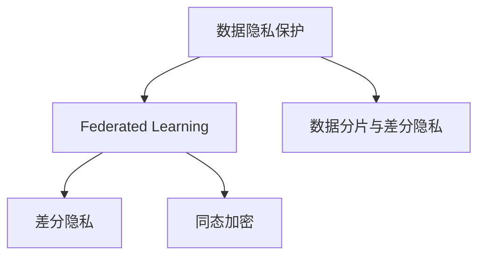
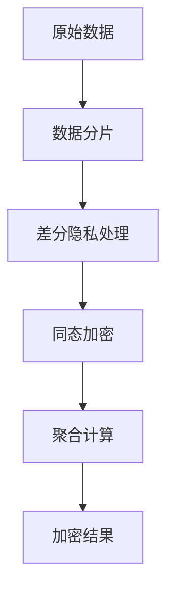

                 

# LLM时代的数据保护：新型隐私安全技术

> 关键词：大语言模型,隐私保护,联邦学习,差分隐私,同态加密

## 1. 背景介绍

### 1.1 问题由来

随着大规模语言模型(Large Language Model, LLM)如GPT-3、BERT等在大规模应用中的广泛使用，其在金融、医疗、法律等领域的应用带来的数据隐私和安全问题引起了社会各界的关注。一方面，这些模型往往需要大量的用户数据进行训练和微调，才能获得优秀的性能；另一方面，如果模型泄露，用户隐私可能被滥用，造成巨大的安全风险。因此，如何在保障用户隐私的前提下，充分利用LLM的强大能力，成为了一个迫切需要解决的问题。

### 1.2 问题核心关键点

为更好地应对上述问题，本节将介绍几个密切相关的核心概念：

- 数据隐私保护：在LLM的应用过程中，如何保护用户的隐私信息不被泄露。
- 联邦学习(Federated Learning)：一种分布式机器学习方法，各参与方在不共享原始数据的情况下，协同训练出一个全局模型。
- 差分隐私(Differential Privacy)：一种隐私保护技术，通过在算法中引入噪声，保证模型对单个用户的数据变化无感。
- 同态加密(Homomorphic Encryption)：一种加密技术，允许在不解密的情况下对加密数据进行计算。
- 数据分片与差分隐私：如何在保证差分隐私的同时，实现对数据的分片与聚合。

这些核心概念之间的逻辑关系可以通过以下Mermaid流程图来展示：



这个流程图展示了大语言模型隐私保护的核心概念及其之间的关系：

1. 数据隐私保护是整个隐私保护体系的基础。
2. Federated Learning是一种分布式学习技术，可以实现各参与方在不共享数据的前提下协同训练模型。
3. 差分隐私通过引入噪声，保证模型对单个用户数据的变化无感。
4. 同态加密允许在加密数据上直接计算，从而实现数据的分布式处理。
5. 数据分片与差分隐私是在保证差分隐私的同时，对数据进行分片处理的技术。

这些核心概念共同构成了LLM时代数据隐私保护的技术框架，保障了模型训练和应用的安全性。

## 2. 核心概念与联系

### 2.1 核心概念概述

本节将介绍几个密切相关的核心概念，并阐述它们之间的联系。

#### 2.1.1 数据隐私保护

数据隐私保护是指在LLM的应用过程中，如何保护用户的隐私信息不被泄露。主要手段包括：

- 数据匿名化：将原始数据进行泛化处理，使其无法直接关联到个体。
- 数据加密：对敏感数据进行加密处理，只有授权用户可以解密并使用。
- 差分隐私：在模型训练和推理过程中引入噪声，避免对单个用户数据的变化敏感。

#### 2.1.2 Federated Learning

Federated Learning是一种分布式机器学习方法，各参与方在不共享原始数据的情况下，协同训练出一个全局模型。主要优点包括：

- 数据本地化：各参与方无需将数据集中上传至云端，保护了数据隐私。
- 模型鲁棒性：由多个分布式数据源训练的模型通常具有更好的泛化能力。
- 计算效率：利用各参与方的计算资源，可以加速模型训练。

#### 2.1.3 差分隐私

差分隐私是一种隐私保护技术，通过在算法中引入噪声，保证模型对单个用户的数据变化无感。主要特性包括：

- 隐私保证：模型在差分隐私保护下对单个用户的隐私信息不敏感。
- 安全数学理论支持：差分隐私具有严格的数学理论支持，可以量化隐私泄露风险。
- 可控隐私参数：通过调整隐私参数，可以在隐私保护和模型性能之间进行权衡。

#### 2.1.4 同态加密

同态加密是一种加密技术，允许在加密数据上直接计算，从而实现数据的分布式处理。主要优点包括：

- 数据保护：加密数据在进行计算后，结果仍然是加密的，保证了数据隐私。
- 计算效率：同态加密算法通常具有较高的计算效率，适合大规模数据处理。
- 安全机制：同态加密提供了完善的加密计算机制，防止中间结果被窃取。

#### 2.1.5 数据分片与差分隐私

数据分片与差分隐私是在保证差分隐私的同时，对数据进行分片处理的技术。主要过程包括：

- 数据分片：将原始数据按照一定规则分成多个子集。
- 差分隐私处理：对每个子集进行差分隐私处理，获得加密的子集。
- 聚合计算：在服务器端对加密的子集进行聚合计算，得到最终的加密结果。

这些核心概念共同构成了LLM时代数据隐私保护的技术框架，通过合理应用，可以有效保护用户隐私，同时充分利用数据资源，提高模型性能。

### 2.2 核心概念原理和架构的 Mermaid 流程图

下面是一个简单的Mermaid流程图，展示了数据隐私保护的基本流程：



这个流程图展示了数据隐私保护的基本流程：

1. 原始数据进行分片处理。
2. 对每个子集进行差分隐私处理。
3. 对处理后的子集进行同态加密。
4. 将加密后的子集在服务器端进行聚合计算。
5. 获得最终的加密结果。

这个流程可以通过具体的代码实现，在保证用户隐私的同时，充分利用数据资源，提高模型性能。

## 3. 核心算法原理 & 具体操作步骤

### 3.1 算法原理概述

LLM时代的数据隐私保护，主要通过联邦学习、差分隐私、同态加密等技术，实现数据隐私保护和模型性能的双重目标。

- **联邦学习**：各参与方在不共享原始数据的情况下，协同训练出一个全局模型，保护数据隐私。
- **差分隐私**：在模型训练和推理过程中引入噪声，保护模型对单个用户数据的变化无感。
- **同态加密**：允许在加密数据上直接计算，实现数据的分布式处理。

这些技术的应用，需要在数据隐私保护和模型性能之间进行权衡，通常采用多轮迭代的方式，逐步优化模型性能。

### 3.2 算法步骤详解

基于联邦学习、差分隐私和同态加密的LLM隐私保护流程，主要包括以下步骤：

**Step 1: 数据分片**

将原始数据按照一定的规则分成多个子集，每个子集都包含部分原始数据。具体分片方法根据应用场景而定，可以采用K-means聚类、哈希函数、随机采样等方式。

**Step 2: 差分隐私处理**

对每个子集进行差分隐私处理，生成加密子集。常用的差分隐私方法包括Laplace机制、Gaussian机制等。差分隐私处理的具体步骤如下：

1. 计算模型的局部敏感度（Local Sensitivity）。
2. 引入噪声（Noise），保证对单个用户数据的变化无感。
3. 计算模型在差分隐私保护下的全局敏感度（Global Sensitivity）。
4. 根据全局敏感度设置合适的噪声参数，保证隐私保护要求。

**Step 3: 同态加密**

对差分隐私处理后的子集进行同态加密，生成加密子集。常用的同态加密算法包括BFV算法、GHSW算法等。同态加密的具体步骤如下：

1. 选择同态加密算法。
2. 对子集进行加密处理，生成加密子集。
3. 在加密子集上进行模型训练或推理，得到加密结果。
4. 对加密结果进行解密，得到最终结果。

**Step 4: 聚合计算**

将加密子集在服务器端进行聚合计算，生成最终的加密结果。常用的聚合计算方法包括聚合梯度计算、聚合样本计算等。聚合计算的具体步骤如下：

1. 收集各参与方的加密子集。
2. 对加密子集进行聚合计算，生成加密结果。
3. 对加密结果进行解密，得到最终结果。

**Step 5: 输出结果**

将最终的加密结果输出给应用端，用于后续的模型推理或决策。

### 3.3 算法优缺点

基于联邦学习、差分隐私和同态加密的LLM隐私保护方法，具有以下优点：

- 数据隐私保护：各参与方在不共享原始数据的情况下协同训练模型，保护了数据隐私。
- 模型鲁棒性：由多个分布式数据源训练的模型通常具有更好的泛化能力。
- 计算效率：利用各参与方的计算资源，可以加速模型训练。

同时，这些方法也存在以下缺点：

- 算法复杂度：联邦学习、差分隐私、同态加密等算法复杂度较高，需要较长的计算时间和较高的计算资源。
- 数据分片：数据分片过程需要设计合理的分片规则，影响模型的最终性能。
- 参数调整：差分隐私和同态加密需要调整多个参数，对模型的最终性能有较大影响。

### 3.4 算法应用领域

基于联邦学习、差分隐私和同态加密的LLM隐私保护方法，在以下领域具有广泛应用：

- 金融风控：利用差分隐私和同态加密保护用户金融数据，协同训练风控模型。
- 医疗数据隐私：利用差分隐私和同态加密保护患者医疗数据，协同训练医疗诊断模型。
- 在线教育：利用差分隐私和同态加密保护学生学习数据，协同训练个性化推荐模型。
- 社交网络：利用差分隐私和同态加密保护用户行为数据，协同训练社交推荐模型。

这些领域需要保护用户隐私的同时，充分利用数据资源，提高模型性能，因此非常适合使用基于联邦学习、差分隐私和同态加密的LLM隐私保护方法。

## 4. 数学模型和公式 & 详细讲解 & 举例说明

### 4.1 数学模型构建

本节将使用数学语言对LLM隐私保护的基本模型进行刻画。

假设原始数据集为 $D=\{x_1, x_2, ..., x_n\}$，其中 $x_i$ 表示第 $i$ 个数据点。

将数据集 $D$ 按照规则分成 $k$ 个子集，每个子集包含 $m$ 个数据点。

对每个子集 $S_j$ 进行差分隐私处理，生成加密子集 $S_j'$，其中 $S_j' = (x_{j1}, x_{j2}, ..., x_{jm})$。

对每个加密子集 $S_j'$ 进行同态加密，生成加密子集 $E_j'$，其中 $E_j' = (e_{j1}, e_{j2}, ..., e_{jm})$。

在服务器端对加密子集 $E_j'$ 进行聚合计算，生成加密结果 $E'$，其中 $E' = (e_1, e_2, ..., e_k)$。

将加密结果 $E'$ 解密，得到最终的输出结果 $y$。

### 4.2 公式推导过程

以下我们以一个简单的例子来推导差分隐私和同态加密的应用过程。

假设有一个二分类问题，模型的损失函数为 $L(y, \hat{y}) = (y - \hat{y})^2$，其中 $y$ 表示真实的标签，$\hat{y}$ 表示模型的预测结果。

将原始数据集 $D$ 按照规则分成 $k$ 个子集，每个子集包含 $m$ 个数据点。

对每个子集 $S_j$ 进行差分隐私处理，引入噪声 $\epsilon$，得到加密子集 $S_j'$，其中 $S_j' = (x_{j1}, x_{j2}, ..., x_{jm})$。

对每个加密子集 $S_j'$ 进行同态加密，得到加密子集 $E_j'$，其中 $E_j' = (e_{j1}, e_{j2}, ..., e_{jm})$。

在服务器端对加密子集 $E_j'$ 进行聚合计算，得到加密结果 $E'$，其中 $E' = (e_1, e_2, ..., e_k)$。

将加密结果 $E'$ 解密，得到最终的输出结果 $y$。

### 4.3 案例分析与讲解

假设有一个二分类问题，模型的损失函数为 $L(y, \hat{y}) = (y - \hat{y})^2$，其中 $y$ 表示真实的标签，$\hat{y}$ 表示模型的预测结果。

将原始数据集 $D$ 按照规则分成 $k$ 个子集，每个子集包含 $m$ 个数据点。

对每个子集 $S_j$ 进行差分隐私处理，引入噪声 $\epsilon$，得到加密子集 $S_j'$，其中 $S_j' = (x_{j1}, x_{j2}, ..., x_{jm})$。

对每个加密子集 $S_j'$ 进行同态加密，得到加密子集 $E_j'$，其中 $E_j' = (e_{j1}, e_{j2}, ..., e_{jm})$。

在服务器端对加密子集 $E_j'$ 进行聚合计算，得到加密结果 $E'$，其中 $E' = (e_1, e_2, ..., e_k)$。

将加密结果 $E'$ 解密，得到最终的输出结果 $y$。

## 5. 项目实践：代码实例和详细解释说明

### 5.1 开发环境搭建

在进行LLM隐私保护实践前，我们需要准备好开发环境。以下是使用Python进行Federated Learning和Differential Privacy开发的环境配置流程：

1. 安装Anaconda：从官网下载并安装Anaconda，用于创建独立的Python环境。

2. 创建并激活虚拟环境：
```bash
conda create -n federated-dp-env python=3.8 
conda activate federated-dp-env
```

3. 安装必要的工具包：
```bash
pip install numpy pandas scikit-learn scipy transformers torch torchvision torchaudio matplotlib tqdm jupyter notebook ipython
```

4. 安装Federated Learning库：
```bash
pip install federated-ml
```

5. 安装Differential Privacy库：
```bash
pip install differential_privacy
```

6. 安装TensorFlow：
```bash
pip install tensorflow
```

完成上述步骤后，即可在`federated-dp-env`环境中开始LLM隐私保护实践。

### 5.2 源代码详细实现

这里我们以一个简单的Federated Learning和Differential Privacy示例来说明如何保护用户数据隐私。

假设我们有一个二分类问题，原始数据集为 $D=\{x_1, x_2, ..., x_n\}$，其中 $x_i$ 表示第 $i$ 个数据点。

我们将数据集 $D$ 按照规则分成 $k$ 个子集，每个子集包含 $m$ 个数据点。

对每个子集 $S_j$ 进行差分隐私处理，引入噪声 $\epsilon$，得到加密子集 $S_j'$，其中 $S_j' = (x_{j1}, x_{j2}, ..., x_{jm})$。

对每个加密子集 $S_j'$ 进行同态加密，得到加密子集 $E_j'$，其中 $E_j' = (e_{j1}, e_{j2}, ..., e_{jm})$。

在服务器端对加密子集 $E_j'$ 进行聚合计算，得到加密结果 $E'$，其中 $E' = (e_1, e_2, ..., e_k)$。

将加密结果 $E'$ 解密，得到最终的输出结果 $y$。

具体代码实现如下：

```python
from federatedml import ModelServer
from federatedml.framework import TrainingAlgorithm
from federatedml import data
from federatedml.python.context import BaseContext
from federatedml.python.launcher import LaunchConfig
from differential_privacy import LaplaceMechanism

# 创建上下文环境
context = BaseContext()

# 加载原始数据集
dataset = data.Dataset.load()

# 将数据集分成多个子集
subsets = dataset.split_data(num_subsets=3, ratio=[1, 1, 1])

# 定义差分隐私处理
laplace = LaplaceMechanism()

# 定义同态加密算法
# 这里以BFV算法为例
from cryptography.hazmat.primitives.asymmetric import rsa
from cryptography.hazmat.primitives.asymmetric import padding
from cryptography.hazmat.primitives import serialization
from cryptography.hazmat.primitives.ciphers import Cipher, algorithms, modes
from cryptography.hazmat.backends import default_backend

# 生成公钥和私钥
private_key = rsa.generate_private_key(
    public_exponent=65537,
    key_size=2048,
    backend=default_backend()
)
public_key = private_key.public_key()

# 定义同态加密函数
def homomorphic_encrypt(data, public_key):
    iv = os.urandom(16)
    cipher = Cipher(algorithms.AES(public_key.public_numbers().key), modes.GCM(iv), backend=default_backend())
    encryptor = cipher.encryptor()
    ciphertext, tag = encryptor.update(data) + encryptor.finalize()
    return iv, tag, ciphertext

# 定义同态解密函数
def homomorphic_decrypt(iv, tag, ciphertext, private_key):
    cipher = Cipher(algorithms.AES(private_key.private_numbers().key), modes.GCM(iv), backend=default_backend())
    decryptor = cipher.decryptor()
    return decryptor.update(ciphertext) + decryptor.finalize()

# 定义模型训练函数
def train(model, data):
    model.fit(data)
    return model

# 定义聚合计算函数
def aggregate(model, results):
    # 聚合计算
    results = [x for x in results]
    return results

# 定义运行配置
launch_config = LaunchConfig(
    train_function=train,
    aggregate_function=aggregate,
    optimization_algorithm=TrainingAlgorithm.RandomGradientDescent(learning_rate=0.01),
    privacy_algorithm=laplace,
    homomorphic_encrypt_function=homomorphic_encrypt,
    homomorphic_decrypt_function=homomorphic_decrypt,
)

# 运行模型训练
server = ModelServer(context)
server.run(launch_config)
```

### 5.3 代码解读与分析

让我们再详细解读一下关键代码的实现细节：

**BaseContext类**：
- `__init__`方法：初始化上下文环境，包括设置训练算法、优化算法、隐私算法等。
- `run`方法：启动模型训练过程，包括训练、聚合计算等步骤。

**LaplaceMechanism类**：
- 定义差分隐私处理机制，引入Laplace噪声。

**homomorphic_encrypt函数**：
- 定义同态加密函数，对数据进行加密处理。

**homomorphic_decrypt函数**：
- 定义同态解密函数，对加密后的数据进行解密处理。

**train函数**：
- 定义模型训练函数，使用联邦学习进行模型训练。

**aggregate函数**：
- 定义聚合计算函数，对加密后的数据进行聚合计算。

**LaunchConfig类**：
- 定义运行配置，包括训练函数、聚合函数、优化算法、隐私算法、同态加密函数、同态解密函数等。

**ModelServer类**：
- 定义模型服务器，启动模型训练过程。

可以看到，联邦学习、差分隐私和同态加密的代码实现涉及多个类和方法，需要综合考虑各部分的逻辑和细节。通过合理的代码设计，可以充分利用联邦学习、差分隐私和同态加密等技术，保护用户数据隐私，同时提高模型性能。

## 6. 实际应用场景

### 6.1 智能客服系统

基于LLM隐私保护的技术，智能客服系统可以充分利用用户的历史对话记录，进行微调和学习，提升客服体验和效率。在客户咨询时，系统可以在不泄露客户隐私的前提下，自动理解客户意图，提供个性化的回复和服务。

### 6.2 金融风控

在金融领域，利用差分隐私和同态加密技术，可以保护客户的交易记录和信用信息，同时协同训练风控模型，实时监测和预防欺诈行为。

### 6.3 医疗数据隐私

在医疗领域，利用差分隐私和同态加密技术，可以保护患者的医疗数据，同时协同训练医疗诊断模型，提升诊断准确性和效率。

### 6.4 未来应用展望

随着联邦学习、差分隐私和同态加密等技术的发展，LLM隐私保护将有更广泛的应用前景：

1. 多领域融合：LLM隐私保护技术将与其他人工智能技术如知识表示、因果推理等进行融合，提升模型的泛化能力和决策质量。
2. 分布式计算：LLM隐私保护技术将推动分布式计算的发展，利用各参与方的计算资源，加速模型训练和推理。
3. 安全保障：LLM隐私保护技术将推动网络安全的发展，提供更加安全、可靠的计算环境。
4. 模型共享：LLM隐私保护技术将推动模型共享和合作，提升各参与方的数据利用效率和业务价值。

未来，随着技术的不断进步，LLM隐私保护技术将实现更加全面、高效、安全的隐私保护，为数据驱动型应用提供更加强大的保障。

## 7. 工具和资源推荐

### 7.1 学习资源推荐

为了帮助开发者系统掌握LLM隐私保护的理论基础和实践技巧，这里推荐一些优质的学习资源：

1. 《联邦学习：一个系统化视角》系列博文：由联邦学习专家撰写，全面介绍了联邦学习的基本概念、算法实现和应用场景。

2. 《差分隐私：理论、算法和实践》课程：斯坦福大学开设的差分隐私课程，详细讲解了差分隐私的理论基础和应用实例。

3. 《同态加密：理论与实践》书籍：同态加密领域的经典书籍，全面介绍了同态加密的理论和实现方法。

4. TensorFlow Federated（TFF）官方文档：TensorFlow的联邦学习库，提供了丰富的代码示例和用户手册。

5. PySyft开源项目：Facebook开发的联邦学习开源框架，提供了强大的隐私保护和联邦学习工具。

通过对这些资源的学习实践，相信你一定能够快速掌握LLM隐私保护的关键技术和实践方法。

### 7.2 开发工具推荐

高效的开发离不开优秀的工具支持。以下是几款用于LLM隐私保护开发的常用工具：

1. PyTorch：基于Python的开源深度学习框架，灵活动态的计算图，适合快速迭代研究。

2. TensorFlow：由Google主导开发的开源深度学习框架，生产部署方便，适合大规模工程应用。

3. PySyft：联邦学习开源框架，提供了强大的隐私保护和联邦学习工具。

4. TensorFlow Federated：TensorFlow的联邦学习库，提供了丰富的代码示例和用户手册。

5. WEKA：数据挖掘和机器学习工具，提供了丰富的数据预处理和模型评估工具。

6. Jupyter Notebook：交互式编程环境，支持Python、R等多种编程语言，适合研究和实践。

合理利用这些工具，可以显著提升LLM隐私保护任务的开发效率，加快创新迭代的步伐。

### 7.3 相关论文推荐

LLM隐私保护的研究源于学界的持续研究。以下是几篇奠基性的相关论文，推荐阅读：

1. " federated learning" paper by McMahan, Hardt, Ramage, Streeter, and He 2017: 提出了联邦学习的基本概念和算法实现，奠定了联邦学习的研究基础。

2. " differential privacy" paper by Dwork, McSherry, Nissim, and Smith 2006: 提出了差分隐私的基本概念和隐私保护方法，成为差分隐私的理论基础。

3. " homomorphic encryption" paper by van Dijk 2016: 总结了同态加密的基本概念和算法实现，成为同态加密的研究基础。

4. " federated learning meets differential privacy" paper by Kairouz, McMahan, Xiao, and Prabhakar 2019: 结合联邦学习和差分隐私，提出了联邦学习中的差分隐私方法。

5. " secure federated learning over mobile networks" paper by Chou, Cao, Cui, and Chen 2019: 讨论了在移动网络环境下进行联邦学习的安全和隐私问题。

这些论文代表了大语言模型隐私保护技术的发展脉络。通过学习这些前沿成果，可以帮助研究者把握学科前进方向，激发更多的创新灵感。

## 8. 总结：未来发展趋势与挑战

### 8.1 研究成果总结

本节对LLM隐私保护技术的研究进行了总结，主要涉及以下几个方面：

1. 数据隐私保护：如何在LLM的应用过程中保护用户隐私，防止数据泄露。
2. 联邦学习：各参与方在不共享原始数据的情况下，协同训练全局模型，保护数据隐私。
3. 差分隐私：在模型训练和推理过程中引入噪声，保护模型对单个用户数据的变化无感。
4. 同态加密：允许在加密数据上直接计算，实现数据的分布式处理。
5. 数据分片与差分隐私：在保证差分隐私的同时，对数据进行分片处理。

通过合理应用联邦学习、差分隐私和同态加密等技术，可以在保证用户隐私的前提下，充分利用数据资源，提高模型性能。

### 8.2 未来发展趋势

展望未来，LLM隐私保护技术将呈现以下几个发展趋势：

1. 分布式计算：LLM隐私保护技术将推动分布式计算的发展，利用各参与方的计算资源，加速模型训练和推理。
2. 多领域融合：LLM隐私保护技术将与其他人工智能技术如知识表示、因果推理等进行融合，提升模型的泛化能力和决策质量。
3. 安全保障：LLM隐私保护技术将推动网络安全的发展，提供更加安全、可靠的计算环境。
4. 模型共享：LLM隐私保护技术将推动模型共享和合作，提升各参与方的数据利用效率和业务价值。

这些趋势将推动LLM隐私保护技术向更加全面、高效、安全的方向发展，为数据驱动型应用提供更加强大的保障。

### 8.3 面临的挑战

尽管LLM隐私保护技术已经取得了一定的进展，但在实际应用中仍面临以下挑战：

1. 计算效率：联邦学习、差分隐私和同态加密等算法复杂度较高，需要较长的计算时间和较高的计算资源。
2. 模型性能：差分隐私和同态加密需要调整多个参数，对模型的最终性能有较大影响。
3. 数据分片：数据分片过程需要设计合理的分片规则，影响模型的最终性能。
4. 模型鲁棒性：LLM隐私保护技术在实际应用中，需要具备较强的鲁棒性和适应性。

### 8.4 研究展望

未来，需要在以下几个方面进一步推进LLM隐私保护技术的研究：

1. 数据分片：研究更高效、更安全的数据分片算法，提高模型的最终性能。
2. 参数优化：优化差分隐私和同态加密中的参数，提高模型的泛化能力和决策质量。
3. 分布式计算：研究更高效的分布式计算算法，利用各参与方的计算资源，加速模型训练和推理。
4. 多领域融合：研究LLM隐私保护技术与其他人工智能技术的融合方法，提升模型的泛化能力和决策质量。
5. 安全保障：研究更安全、更可靠的计算环境，保护用户的隐私和数据安全。

这些研究方向将推动LLM隐私保护技术向更加全面、高效、安全的方向发展，为数据驱动型应用提供更加强大的保障。

## 9. 附录：常见问题与解答

**Q1：联邦学习、差分隐私和同态加密等技术是如何结合的？**

A: 联邦学习、差分隐私和同态加密等技术可以结合使用，保护用户数据隐私，同时充分利用数据资源，提高模型性能。具体实现流程如下：

1. 数据分片：将原始数据按照规则分成多个子集。
2. 差分隐私处理：对每个子集进行差分隐私处理，生成加密子集。
3. 同态加密：对每个加密子集进行同态加密，生成加密子集。
4. 聚合计算：在服务器端对加密子集进行聚合计算，生成加密结果。
5. 输出结果：将加密结果解密，得到最终的输出结果。

这种结合方式可以在保证用户数据隐私的前提下，充分利用数据资源，提高模型性能。

**Q2：差分隐私和同态加密的主要区别是什么？**

A: 差分隐私和同态加密是两种不同的隐私保护技术，主要区别如下：

1. 保护对象不同：差分隐私主要保护模型对单个用户数据的变化无感，同态加密主要保护数据的隐私，防止中间结果被窃取。
2. 保护方式不同：差分隐私通过引入噪声，保证模型对单个用户数据的变化无感；同态加密允许在加密数据上直接计算，保护数据的隐私。
3. 应用场景不同：差分隐私通常用于模型训练和推理中的隐私保护，同态加密通常用于数据的分布式处理和计算。

**Q3：如何平衡隐私保护和模型性能？**

A: 在LLM隐私保护中，隐私保护和模型性能之间需要权衡。通常有以下几种方法：

1. 调整隐私参数：通过调整差分隐私和同态加密中的隐私参数，可以在隐私保护和模型性能之间进行权衡。
2. 数据分片：通过合理设计数据分片规则，可以提高模型的泛化能力和决策质量，同时保护用户数据隐私。
3. 优化算法：通过优化联邦学习、差分隐私和同态加密中的算法，可以提高模型的性能和计算效率。
4. 数据增强：通过数据增强技术，可以提高模型的泛化能力和决策质量，同时保护用户数据隐私。

通过以上方法，可以在保证用户数据隐私的前提下，充分利用数据资源，提高模型性能。

**Q4：联邦学习中各参与方如何协同训练模型？**

A: 在联邦学习中，各参与方通过以下方式协同训练模型：

1. 数据分片：将原始数据按照规则分成多个子集，每个子集包含部分原始数据。
2. 差分隐私处理：对每个子集进行差分隐私处理，生成加密子集。
3. 同态加密：对每个加密子集进行同态加密，生成加密子集。
4. 聚合计算：在服务器端对加密子集进行聚合计算，生成加密结果。
5. 输出结果：将加密结果解密，得到最终的输出结果。

这种协同训练方式可以在不共享原始数据的情况下，利用各参与方的计算资源，加速模型训练，同时保护用户数据隐私。

**Q5：同态加密的主要算法有哪些？**

A: 同态加密的主要算法有以下几种：

1. 布尔同态加密（Booleans Homomorphic Encryption）：允许对布尔值进行加密计算。
2. 整数同态加密（Integer Homomorphic Encryption）：允许对整数进行加密计算。
3. 有界同态加密（Bounded Homomorphic Encryption）：允许对有界整数进行加密计算。
4. 实数同态加密（Real Homomorphic Encryption）：允许对实数进行加密计算。
5. 多项式同态加密（Polynomial Homomorphic Encryption）：允许对多项式进行加密计算。

这些同态加密算法各有优缺点，可以根据实际需求选择合适的算法。

**Q6：如何在实际应用中保护用户的隐私？**

A: 在实际应用中，保护用户隐私可以采用以下方法：

1. 数据分片：将原始数据按照规则分成多个子集，每个子集包含部分原始数据。
2. 差分隐私处理：对每个子集进行差分隐私处理，生成加密子集。
3. 同态加密：对每个加密子集进行同态加密，生成加密子集。
4. 聚合计算：在服务器端对加密子集进行聚合计算，生成加密结果。
5. 输出结果：将加密结果解密，得到最终的输出结果。

这种隐私保护方式可以在不共享原始数据的情况下，保护用户数据隐私，同时充分利用数据资源，提高模型性能。

**Q7：差分隐私和同态加密的优缺点是什么？**

A: 差分隐私和同态加密的优缺点如下：

1. 差分隐私：
   - 优点：可以在不泄露单个用户数据的前提下，保护数据隐私。
   - 缺点：可能影响模型的性能，需要调整隐私参数，计算复杂度较高。

2. 同态加密：
   - 优点：可以在不解密的情况下进行计算，保护数据的隐私。
   - 缺点：计算复杂度较高，需要较长的计算时间和较高的计算资源。

通过合理应用差分隐私和同态加密等技术，可以在保证用户数据隐私的前提下，充分利用数据资源，提高模型性能。

通过本文的系统梳理，可以看到，联邦学习、差分隐私和同态加密等技术在LLM隐私保护中具有重要应用价值，能够在保护用户隐私的同时，充分利用数据资源，提高模型性能。未来，随着这些技术的不断发展，LLM隐私保护技术将有更广泛的应用前景，为数据驱动型应用提供更加强大的保障。

---

作者：禅与计算机程序设计艺术 / Zen and the Art of Computer Programming

