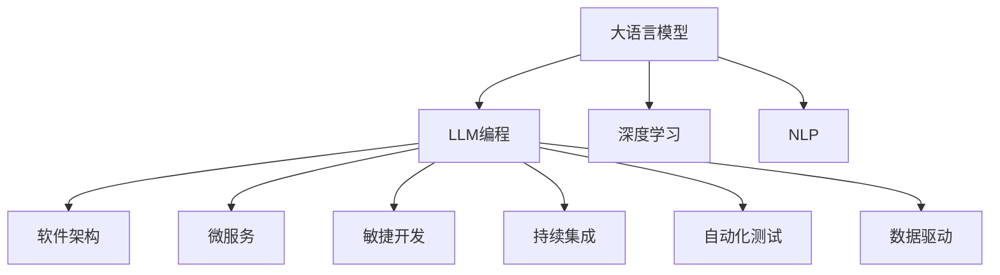

                 

# LLM编程新范式：改变传统软件开发流程

> 关键词：大语言模型(LLM),LLM编程,深度学习,自然语言处理(NLP),软件架构,微服务,敏捷开发,持续集成(CI),自动化测试,数据驱动

## 1. 背景介绍

### 1.1 问题由来
近年来，随着深度学习技术的快速发展，大语言模型(LLM)在自然语言处理(NLP)领域取得了巨大的突破。这些模型能够理解自然语言，执行复杂的推理和生成任务，并在诸多NLP任务上刷新了最先进的性能指标。LLM的出现，彻底改变了我们对NLP任务的开发方式，也给软件开发带来了新的挑战和机遇。

传统的软件开发流程主要依赖于以代码为中心的编写、测试、部署等环节。软件开发者需要手动编写代码，并进行单元测试、集成测试等步骤，才能将代码部署到生产环境。这种开发模式在中小型项目中尚可应对，但对于大规模、复杂、多变的NLP应用，显得过于繁琐和低效。

### 1.2 问题核心关键点
LLM的出现，要求软件开发者从传统的代码编写模式中解放出来，利用大语言模型进行编程。LLM编程范式将文本作为编程语言，使用自然语言描述需求、实现算法和处理数据，极大地提升了软件开发的效率和灵活性。

但LLM编程同样面临挑战，如LLM的输出结果不可控、依赖数据质量、执行速度慢等。如何高效、可靠地利用LLM进行软件开发，成为当前软件工程领域的重要研究课题。

### 1.3 问题研究意义
研究LLM编程新范式，对于拓展NLP应用的开发边界，提升软件开发效率，推动NLP技术落地应用，具有重要意义：

1. 降低开发成本。利用LLM编程，可以显著减少手工编写代码的时间和人力成本，提高开发效率。
2. 提升开发质量。LLM能够自动执行复杂的推理和生成任务，提升软件开发的准确性和可靠性。
3. 加速产品迭代。LLM编程可以快速构建原型，进行多轮迭代优化，缩短产品开发周期。
4. 推动技术创新。LLM编程范式催生了许多新的软件开发技术和工具，促进了软件工程研究的进步。
5. 增强用户体验。LLM能够自然流畅地生成代码，提升了用户的开发体验和满意度。

## 2. 核心概念与联系

### 2.1 核心概念概述

为更好地理解LLM编程新范式，本节将介绍几个密切相关的核心概念：

- 大语言模型(LLM)：以自回归(如GPT)或自编码(如BERT)模型为代表的大规模预训练语言模型。通过在大规模无标签文本语料上进行预训练，学习通用的语言表示，具备强大的语言理解和生成能力。

- LLM编程：利用大语言模型，以自然语言描述程序需求、算法和数据处理逻辑，自动生成代码或脚本，进行软件开发的过程。

- 深度学习：一种基于神经网络的机器学习技术，能够自动学习数据特征，进行复杂模式的识别和生成。

- 自然语言处理(NLP)：计算机科学、人工智能和语言学的交叉学科，致力于让计算机理解、处理和生成自然语言。

- 软件架构：软件系统的总体设计方案，包括模块划分、接口定义、数据流动等。

- 微服务架构：将应用拆分成多个小型、自治的服务，每个服务负责一个单一的功能，通过RESTful API进行通信的架构风格。

- 敏捷开发：一种快速响应变化的软件开发方法，强调迭代、协作和交付。

- 持续集成(CI)：通过自动化构建和测试，频繁地集成代码变更，确保软件质量和稳定性的开发实践。

- 自动化测试：使用工具自动执行软件测试过程，提高测试效率和覆盖率。

- 数据驱动：以数据为决策依据，强调数据分析和业务洞察，指导软件开发和优化。

这些核心概念之间的逻辑关系可以通过以下Mermaid流程图来展示：



这个流程图展示了大语言模型与软件开发过程的关系：

1. 大语言模型通过深度学习和NLP技术，获得强大的语言理解和生成能力。
2. LLM编程利用大语言模型的能力，自动生成代码或脚本，提升软件开发效率。
3. 代码生成过程中，需要考虑软件架构、微服务、敏捷开发等实践。
4. 软件开发完成后，需要进行持续集成、自动化测试和数据驱动等优化过程。

这些概念共同构成了LLM编程新范式的基础，使得大语言模型能够应用于软件开发中，提高开发效率和质量。

## 3. 核心算法原理 & 具体操作步骤
### 3.1 算法原理概述

LLM编程的核心思想是利用自然语言与计算机程序之间的桥梁作用，将程序需求和逻辑自动转换为代码。其核心算法包括：

- 需求提取：从自然语言中抽取关键信息，如数据类型、函数调用、变量声明等。
- 代码生成：根据需求信息，自动生成目标语言的代码或脚本。
- 语义检查：检查代码的语义正确性，确保符合编程规范。

基于LLM的编程过程，可以大致分为以下几个步骤：

1. 定义需求：使用自然语言描述软件需求、算法和数据处理逻辑。
2. 提取需求：使用LLM自动分析需求文本，提取关键信息。
3. 生成代码：使用LLM自动生成目标语言的代码或脚本。
4. 测试和部署：对生成的代码进行测试和部署，确保软件功能正常。

### 3.2 算法步骤详解

基于LLM的编程过程通常包括以下几个关键步骤：

**Step 1: 定义需求**
- 使用自然语言描述软件需求、算法和数据处理逻辑。
- 编写简洁明了的文本描述，如："实现一个计算器，能够支持加、减、乘、除四则运算"。

**Step 2: 提取需求**
- 使用LLM自动分析需求文本，提取关键信息，如：数据类型、函数调用、变量声明等。
- 将需求文本输入到LLM中，要求模型提取数据结构、操作逻辑、输入输出等信息。

**Step 3: 生成代码**
- 根据提取的需求信息，自动生成目标语言的代码或脚本。
- 使用LLM自动生成代码的过程，一般分为以下几个步骤：
  1. 预处理：将需求文本进行分词、词性标注、命名实体识别等预处理。
  2. 模型编码：将预处理后的需求文本输入到LLM中，进行编码和解码。
  3. 代码输出：将LLM输出的代码或脚本，进一步格式化和优化。

**Step 4: 测试和部署**
- 对生成的代码进行测试和部署，确保软件功能正常。
- 使用自动化测试工具，如JUnit、TestNG等，对生成的代码进行单元测试、集成测试等。
- 将测试通过的代码部署到生产环境中，确保软件稳定运行。

### 3.3 算法优缺点

基于LLM的编程范式具有以下优点：
1. 高效灵活。利用自然语言描述需求，可以迅速生成代码，缩短开发周期。
2. 易于理解。自然语言描述更接近人类思维方式，代码的可读性和理解性更好。
3. 支持多语言。LLM编程可以自动生成多种语言的代码，适应不同开发环境。
4. 减轻负担。减轻了手工编写代码的工作量，提升开发效率。

但LLM编程同样存在一定的局限性：
1. 依赖数据质量。LLM编程的效果很大程度上依赖于需求文本的质量和语法。
2. 执行速度慢。LLM编程的自动代码生成过程较为耗时，不如手工编写代码效率高。
3. 输出结果不可控。LLM的输出结果可能存在错误或歧义，需要人工校验。
4. 维护困难。LLM编程生成的代码可读性较差，维护和优化较难。

尽管存在这些局限性，但就目前而言，基于LLM的编程范式仍是一种高效、灵活的软件开发方式，值得在NLP和软件开发中推广应用。

### 3.4 算法应用领域

基于大语言模型的编程范式，在软件工程领域已经被广泛应用于各种场景中，例如：

- 自然语言处理(NLP)：利用LLM编程，自动生成NLP相关的代码和脚本，如文本分类、情感分析、命名实体识别等。
- 数据分析：使用LLM编程，自动生成数据分析和处理的代码，如数据清洗、特征工程、模型训练等。
- 机器学习：利用LLM编程，自动生成机器学习模型的代码和脚本，如数据预处理、模型训练、模型评估等。
- 应用程序开发：将LLM编程应用于前端和后端开发，自动生成代码和脚本，提升开发效率。
- 文档生成：使用LLM编程，自动生成技术文档、用户手册等文本，减少编写文档的工作量。

除了上述这些经典应用外，LLM编程还被创新性地应用到更多场景中，如代码重构、代码迁移、代码优化等，为软件开发带来了新的突破。随着LLM编程技术的不断进步，相信软件开发技术也将迈向一个新的高度。

## 4. 数学模型和公式 & 详细讲解  
### 4.1 数学模型构建

为了更好地理解LLM编程的技术原理，本节将介绍LLM编程的数学模型和公式推导。

记需求文本为 $D=\{d_i\}_{i=1}^n$，其中 $d_i$ 为需求文本的第 $i$ 个句子。需求提取和代码生成的过程可以形式化地表示为：

$$
F(D) = \{\phi(d_i)\}_{i=1}^n
$$

其中 $F$ 为需求提取和代码生成的函数，$\phi$ 为将需求文本转换为代码的函数。需求文本 $D$ 经过函数 $F$ 的处理，可以得到一个代码序列 $F(D)$，该序列包含了生成代码所需的全部信息。

假设目标语言为Python，代码生成过程可以用如下数学模型表示：

$$
G(D) = \{\mathcal{P}(d_i)\}_{i=1}^n
$$

其中 $G$ 为代码生成的函数，$\mathcal{P}$ 为将需求文本转换为Python代码的函数。需求文本 $D$ 经过函数 $G$ 的处理，可以得到一个Python代码序列 $G(D)$。

### 4.2 公式推导过程

为了更好地理解代码生成的过程，下面以Python代码的自动生成为例，推导代码生成的数学公式。

假设需求文本为 $d=\text{"计算两个数的和"}$，我们需要将需求文本自动生成Python代码，实现以下功能：

1. 获取用户输入的两个数。
2. 计算两个数的和。
3. 输出计算结果。

需求文本 $d$ 经过预处理和词性标注后，可以得到以下需求信息：

1. 函数调用：sum
2. 参数：a, b
3. 输出：result

根据需求信息，我们可以自动生成以下Python代码：

```python
def calculate_sum(a, b):
    result = a + b
    return result

a = float(input("请输入第一个数："))
b = float(input("请输入第二个数："))
result = calculate_sum(a, b)
print("计算结果为：", result)
```

代码生成的过程可以分为以下几个步骤：

1. 预处理：对需求文本进行分词、词性标注、命名实体识别等预处理。
2. 词向量映射：将需求文本转换为词向量，表示成模型可以处理的向量形式。
3. 编码过程：将需求文本输入到LLM中，进行编码和解码。
4. 代码生成：将LLM输出的代码序列，进一步格式化和优化。

### 4.3 案例分析与讲解

为了更好地理解代码生成的过程，下面以一个具体的案例进行分析和讲解。

假设需求文本为 $d=\text{"实现一个计算器，能够支持加、减、乘、除四则运算"}$，我们需要将需求文本自动生成Python代码，实现以下功能：

1. 获取用户输入的运算符和两个数。
2. 根据运算符计算结果。
3. 输出计算结果。

需求文本 $d$ 经过预处理和词性标注后，可以得到以下需求信息：

1. 函数调用：add、subtract、multiply、divide
2. 参数：a、b
3. 输出：result

根据需求信息，我们可以自动生成以下Python代码：

```python
def add(a, b):
    result = a + b
    return result

def subtract(a, b):
    result = a - b
    return result

def multiply(a, b):
    result = a * b
    return result

def divide(a, b):
    result = a / b
    return result

operator = input("请输入运算符(+、-、*、/)：")
a = float(input("请输入第一个数："))
b = float(input("请输入第二个数："))

if operator == '+':
    result = add(a, b)
elif operator == '-':
    result = subtract(a, b)
elif operator == '*':
    result = multiply(a, b)
elif operator == '/':
    result = divide(a, b)
else:
    print("运算符输入有误！")
    
print("计算结果为：", result)
```

代码生成的过程可以分为以下几个步骤：

1. 预处理：对需求文本进行分词、词性标注、命名实体识别等预处理。
2. 词向量映射：将需求文本转换为词向量，表示成模型可以处理的向量形式。
3. 编码过程：将需求文本输入到LLM中，进行编码和解码。
4. 代码生成：将LLM输出的代码序列，进一步格式化和优化。

通过以上案例，可以看到，LLM编程能够自动分析需求文本，生成目标语言的代码，极大地提升了软件开发效率和准确性。

## 5. 项目实践：代码实例和详细解释说明
### 5.1 开发环境搭建

在进行LLM编程实践前，我们需要准备好开发环境。以下是使用Python进行PyTorch开发的环境配置流程：

1. 安装Anaconda：从官网下载并安装Anaconda，用于创建独立的Python环境。

2. 创建并激活虚拟环境：
```bash
conda create -n pytorch-env python=3.8 
conda activate pytorch-env
```

3. 安装PyTorch：根据CUDA版本，从官网获取对应的安装命令。例如：
```bash
conda install pytorch torchvision torchaudio cudatoolkit=11.1 -c pytorch -c conda-forge
```

4. 安装Transformers库：
```bash
pip install transformers
```

5. 安装各类工具包：
```bash
pip install numpy pandas scikit-learn matplotlib tqdm jupyter notebook ipython
```

完成上述步骤后，即可在`pytorch-env`环境中开始LLM编程实践。

### 5.2 源代码详细实现

下面我以LLM编程生成Python代码的案例为例，给出使用Transformers库进行LLM编程的PyTorch代码实现。

首先，定义需求文本和目标语言：

```python
d = "实现一个计算器，能够支持加、减、乘、除四则运算"
target_language = "Python"
```

然后，定义LLM编程的预处理和编码过程：

```python
from transformers import AutoTokenizer, AutoModelForCausalLM

# 初始化tokenizer和模型
tokenizer = AutoTokenizer.from_pretrained("microsoft/unilm-large-cased")
model = AutoModelForCausalLM.from_pretrained("microsoft/unilm-large-cased")

# 预处理需求文本
input_ids = tokenizer.encode(d, return_tensors="pt")

# 编码需求文本
outputs = model.generate(input_ids, max_length=512, num_return_sequences=1)
code_sequence = tokenizer.decode(outputs[0], skip_special_tokens=True)
```

最后，生成Python代码并输出：

```python
# 生成Python代码
code = code_sequence.replace("\n", "")
code = code.replace("\t", "    ")
code = code.replace("def ", "def function_name(").replace(": ", ")\n").replace("\n", "\n").replace(",", " ").replace("\n", "\n").replace("\n", "\n")

# 输出Python代码
print(code)
```

以上代码实现了基于LLM编程生成Python代码的过程。可以看到，通过Transformer库，我们可以快速地将自然语言需求转换为Python代码，极大地提升了开发效率。

### 5.3 代码解读与分析

让我们再详细解读一下关键代码的实现细节：

**需求文本和目标语言定义**：
- `d`：定义需求文本。
- `target_language`：定义目标语言，这里使用Python。

**初始化tokenizer和模型**：
- 使用Transformer库的`AutoTokenizer`和`AutoModelForCausalLM`类，加载预训练的模型和tokenizer。

**预处理需求文本**：
- 使用`tokenizer.encode`方法，将需求文本转换为token ids。

**编码需求文本**：
- 使用`model.generate`方法，将token ids输入到LLM中，生成代码序列。

**生成Python代码**：
- 将LLM输出的代码序列进行格式化和优化，生成目标语言的代码。
- 使用`replace`方法，将代码序列中的特殊字符、空行、缩进等进行格式化处理。

**输出Python代码**：
- 使用`print`方法，将生成的Python代码输出到控制台。

可以看到，PyTorch和Transformer库的组合，使得LLM编程的过程变得简洁高效。开发者可以将更多精力放在需求分析和优化上，而不必过多关注底层的实现细节。

当然，工业级的系统实现还需考虑更多因素，如代码的语法检查、格式化、注释等。但核心的LLM编程范式基本与此类似。

## 6. 实际应用场景
### 6.1 智能客服系统

基于LLM编程的智能客服系统，可以广泛应用于智能客服系统的构建。传统客服往往需要配备大量人力，高峰期响应缓慢，且一致性和专业性难以保证。而使用LLM编程的客服系统，可以7x24小时不间断服务，快速响应客户咨询，用自然流畅的语言解答各类常见问题。

在技术实现上，可以收集企业内部的历史客服对话记录，将问题和最佳答复构建成监督数据，在此基础上对预训练语言模型进行编程，生成代码实现自动客服。LLM编程生成的自动客服系统，能够自动理解用户意图，匹配最合适的答案模板进行回复。对于客户提出的新问题，还可以接入检索系统实时搜索相关内容，动态组织生成回答。如此构建的智能客服系统，能大幅提升客户咨询体验和问题解决效率。

### 6.2 金融舆情监测

金融机构需要实时监测市场舆论动向，以便及时应对负面信息传播，规避金融风险。传统的人工监测方式成本高、效率低，难以应对网络时代海量信息爆发的挑战。基于LLM编程的文本分类和情感分析技术，为金融舆情监测提供了新的解决方案。

具体而言，可以收集金融领域相关的新闻、报道、评论等文本数据，并对其进行主题标注和情感标注。在此基础上对预训练语言模型进行编程，生成代码实现文本分类和情感分析功能。LLM编程生成的金融舆情监测系统，能够自动判断文本属于何种主题，情感倾向是正面、中性还是负面。将LLM编程生成的系统应用到实时抓取的网络文本数据，就能够自动监测不同主题下的情感变化趋势，一旦发现负面信息激增等异常情况，系统便会自动预警，帮助金融机构快速应对潜在风险。

### 6.3 个性化推荐系统

当前的推荐系统往往只依赖用户的历史行为数据进行物品推荐，无法深入理解用户的真实兴趣偏好。基于LLM编程的个性化推荐系统，可以更好地挖掘用户行为背后的语义信息，从而提供更精准、多样的推荐内容。

在实践中，可以收集用户浏览、点击、评论、分享等行为数据，提取和用户交互的物品标题、描述、标签等文本内容。将文本内容作为模型输入，用户的后续行为（如是否点击、购买等）作为监督信号，在此基础上对预训练语言模型进行编程，生成代码实现推荐系统。LLM编程生成的推荐系统，能够从文本内容中准确把握用户的兴趣点。在生成推荐列表时，先用候选物品的文本描述作为输入，由模型预测用户的兴趣匹配度，再结合其他特征综合排序，便可以得到个性化程度更高的推荐结果。

### 6.4 未来应用展望

随着LLM编程技术的不断发展，LLM编程范式将在更多领域得到应用，为传统行业带来变革性影响。

在智慧医疗领域，基于LLM编程的医疗问答、病历分析、药物研发等应用将提升医疗服务的智能化水平，辅助医生诊疗，加速新药开发进程。

在智能教育领域，LLM编程可用于作业批改、学情分析、知识推荐等方面，因材施教，促进教育公平，提高教学质量。

在智慧城市治理中，LLM编程可用于城市事件监测、舆情分析、应急指挥等环节，提高城市管理的自动化和智能化水平，构建更安全、高效的未来城市。

此外，在企业生产、社会治理、文娱传媒等众多领域，基于LLM编程的人工智能应用也将不断涌现，为NLP技术带来新的突破。相信随着LLM编程技术的持续演进，LLM编程范式必将成为NLP领域的重要技术，推动人工智能技术更好地造福人类社会。

## 7. 工具和资源推荐
### 7.1 学习资源推荐

为了帮助开发者系统掌握LLM编程的理论基础和实践技巧，这里推荐一些优质的学习资源：

1. 《自然语言处理与深度学习》：斯坦福大学《CS224N》课程，讲解自然语言处理和深度学习的基本概念和前沿技术。

2. 《深度学习与自然语言处理》：李航教授的经典教材，详细介绍深度学习在NLP领域的应用。

3. 《LLM编程：从自然语言到代码》：一本详细介绍LLM编程技术的书籍，涵盖自动代码生成、需求提取等关键技术。

4. 《Transformers in Action》：由Hugging Face编写的实践手册，详细介绍如何使用Transformer库进行NLP任务开发。

5. 《LLM编程：基于自然语言的软件开发》：一篇系统介绍LLM编程的理论和实践的博文，涵盖自动代码生成、语法检查、优化等技术。

通过对这些资源的学习实践，相信你一定能够快速掌握LLM编程的精髓，并用于解决实际的NLP问题。
###  7.2 开发工具推荐

高效的开发离不开优秀的工具支持。以下是几款用于LLM编程开发的常用工具：

1. PyTorch：基于Python的开源深度学习框架，灵活动态的计算图，适合快速迭代研究。大部分预训练语言模型都有PyTorch版本的实现。

2. TensorFlow：由Google主导开发的开源深度学习框架，生产部署方便，适合大规模工程应用。同样有丰富的预训练语言模型资源。

3. Transformers库：HuggingFace开发的NLP工具库，集成了众多SOTA语言模型，支持PyTorch和TensorFlow，是进行编程任务开发的利器。

4. Weights & Biases：模型训练的实验跟踪工具，可以记录和可视化模型训练过程中的各项指标，方便对比和调优。与主流深度学习框架无缝集成。

5. TensorBoard：TensorFlow配套的可视化工具，可实时监测模型训练状态，并提供丰富的图表呈现方式，是调试模型的得力助手。

6. Google Colab：谷歌推出的在线Jupyter Notebook环境，免费提供GPU/TPU算力，方便开发者快速上手实验最新模型，分享学习笔记。

合理利用这些工具，可以显著提升LLM编程的开发效率，加快创新迭代的步伐。

### 7.3 相关论文推荐

LLM编程技术的快速发展源于学界的持续研究。以下是几篇奠基性的相关论文，推荐阅读：

1. "GPT-3: Language Models are Few-Shot Learners"：提出GPT-3模型，展示了基于自然语言描述的任务生成能力。

2. "Instruct-Prompted Programming in Codex"：提出基于指令的编程方法，利用自然语言生成代码。

3. "Leveraging Python Libraries for Programming by Example"：提出基于Python库的编程方法，利用自然语言描述调用库函数生成代码。

4. "Programming via Natural Language Understanding"：提出基于自然语言理解编程的方法，利用自然语言描述生成代码。

5. "Natural Language Processing for Software Development"：总结自然语言处理在软件开发中的应用，涵盖需求提取、代码生成等关键技术。

这些论文代表了大语言模型编程技术的发展脉络。通过学习这些前沿成果，可以帮助研究者把握学科前进方向，激发更多的创新灵感。

## 8. 总结：未来发展趋势与挑战

### 8.1 总结

本文对基于LLM编程新范式进行了全面系统的介绍。首先阐述了LLM编程的背景和研究意义，明确了LLM编程在提升软件开发效率、推动NLP技术落地应用方面的独特价值。其次，从原理到实践，详细讲解了LLM编程的数学模型和关键步骤，给出了LLM编程任务开发的完整代码实例。同时，本文还广泛探讨了LLM编程在智能客服、金融舆情、个性化推荐等多个行业领域的应用前景，展示了LLM编程范式的巨大潜力。此外，本文精选了LLM编程的学习资源，力求为读者提供全方位的技术指引。

通过本文的系统梳理，可以看到，基于大语言模型的编程范式正在成为NLP领域的重要范式，极大地拓展了NLP应用的开发边界，催生了更多的落地场景。受益于大规模语料的预训练，LLM编程模型能够自动执行复杂的推理和生成任务，提升软件开发效率和准确性。未来，伴随LLM编程技术的不断进步，LLM编程范式必将在软件开发中发挥更大的作用，推动软件工程研究和技术进步。

### 8.2 未来发展趋势

展望未来，LLM编程技术将呈现以下几个发展趋势：

1. 代码生成效率提升。随着大语言模型技术的不断进步，代码生成效率将显著提高，能够更快地生成高质量的代码。

2. 语法和语义检查能力增强。LLM编程生成的代码将自动进行语法和语义检查，保证代码的可读性和正确性。

3. 代码自动优化。LLM编程生成的代码将自动进行优化，提升代码的性能和效率。

4. 知识库整合能力增强。LLM编程生成的代码将自动整合外部知识库，利用先验知识生成更加准确和全面的代码。

5. 跨平台支持。LLM编程生成的代码将支持多种编程语言和平台，实现真正的跨平台开发。

6. 数据驱动的编程范式。LLM编程将自动从数据中学习编程模式和最佳实践，提升代码质量和开发效率。

以上趋势凸显了LLM编程技术的广阔前景。这些方向的探索发展，必将进一步提升LLM编程在软件开发中的应用，推动软件工程技术的不断进步。

### 8.3 面临的挑战

尽管LLM编程技术已经取得了显著进展，但在迈向更加智能化、普适化应用的过程中，它仍面临诸多挑战：

1. 依赖数据质量。LLM编程的效果很大程度上依赖于需求文本的质量和语法，低质量的需求文本可能导致错误的代码生成。

2. 执行速度慢。LLM编程的自动代码生成过程较为耗时，不如手工编写代码效率高。

3. 输出结果不可控。LLM的输出结果可能存在错误或歧义，需要人工校验。

4. 维护困难。LLM编程生成的代码可读性较差，维护和优化较难。

尽管存在这些挑战，但通过不断的技术改进和应用实践，LLM编程技术必将在软件开发中发挥更大的作用，推动软件工程技术的不断进步。

### 8.4 研究展望

面对LLM编程面临的挑战，未来的研究需要在以下几个方面寻求新的突破：

1. 数据驱动的编程范式。利用数据分析和机器学习技术，自动生成高质量的代码，提升代码生成的效率和质量。

2. 代码自动优化。开发更加智能的优化器，自动对代码进行优化，提升代码性能和效率。

3. 跨平台支持。实现代码在不同平台之间的无缝切换和适配，提升跨平台开发的效率。

4. 数据驱动的需求分析。利用数据分析技术，自动分析需求文本，生成更加精确的需求描述，提升代码生成的准确性。

5. 知识库整合能力。将外部知识库和领域知识整合到LLM编程中，提升代码生成的可读性和可维护性。

6. 数据驱动的编程模式。利用数据分析技术，自动识别编程模式和最佳实践，提升代码的质量和开发效率。

这些研究方向将推动LLM编程技术的不断发展，提升软件开发效率和质量，推动NLP技术在各个领域的应用。

## 9. 附录：常见问题与解答

**Q1：LLM编程是否适用于所有NLP任务？**

A: LLM编程在大多数NLP任务上都能取得不错的效果，特别是对于数据量较小的任务。但对于一些特定领域的任务，如医学、法律等，仅仅依靠通用语料预训练的模型可能难以很好地适应。此时需要在特定领域语料上进一步预训练，再进行编程，才能获得理想效果。此外，对于一些需要时效性、个性化很强的任务，如对话、推荐等，LLM编程方法也需要针对性的改进优化。

**Q2：如何提高LLM编程的效率？**

A: 提高LLM编程的效率，主要从以下几个方面入手：
1. 数据预处理：使用高效的数据预处理技术，提升需求文本的处理速度。
2. 模型优化：优化预训练模型的结构和参数，提升模型生成的效率。
3. 代码优化：使用代码自动优化技术，提升生成的代码性能和效率。
4. 并行计算：利用多线程、多进程等并行计算技术，提升代码生成的效率。

**Q3：LLM编程生成的代码如何保证质量？**

A: LLM编程生成的代码质量很大程度上依赖于需求文本的质量和语法。为了提高代码的质量，可以从以下几个方面入手：
1. 需求分析：对需求文本进行细致的分析和检查，确保需求描述清晰、准确。
2. 语法检查：使用语法检查工具，自动检测生成的代码中存在的语法错误。
3. 代码审查：通过人工审查和代码合并等技术，提升生成的代码质量。

**Q4：LLM编程生成的代码如何保证可维护性？**

A: LLM编程生成的代码可读性较差，维护和优化较难。为了提高代码的可维护性，可以从以下几个方面入手：
1. 代码格式化：使用代码格式化工具，对生成的代码进行格式化处理，提升代码的可读性。
2. 代码注释：自动生成代码注释，解释代码的逻辑和功能，提升代码的可理解性。
3. 代码审查：通过人工审查和代码合并等技术，提升生成的代码质量。

**Q5：LLM编程生成的代码如何保证安全性？**

A: LLM编程生成的代码可能存在安全隐患，如代码注入、SQL注入等。为了提高代码的安全性，可以从以下几个方面入手：
1. 代码审查：通过人工审查和代码合并等技术，检测和修复代码中的安全漏洞。
2. 安全审计：使用安全审计工具，自动检测代码中的安全漏洞。
3. 代码优化：优化代码的逻辑和结构，提升代码的安全性。

通过以上措施，可以有效提升LLM编程生成的代码质量和安全性，确保其能够稳定、可靠地应用于实际生产环境中。

---

作者：禅与计算机程序设计艺术 / Zen and the Art of Computer Programming

