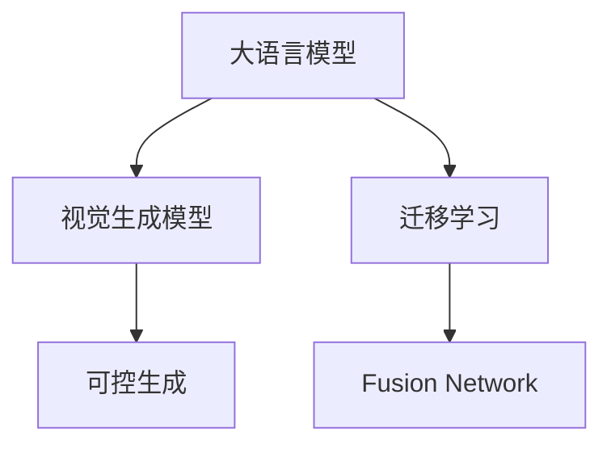

                 

## 1. 背景介绍

随着人工智能技术的快速发展，图像生成领域也迎来了革命性的变革。深度学习技术的进步使得大语言模型（Large Language Model，简称LLM）与图像生成模型的结合成为可能。基于大语言模型的视觉生成（Visual Generation）技术，不仅能够生成高质量的图像，还能通过自然语言引导生成过程，实现动态、可控的图像生成。这一技术的应用，将为视觉智能时代带来新的机遇和挑战。

### 1.1 问题由来

传统的图像生成技术多依赖于手工设计模板、规则或使用生成对抗网络（Generative Adversarial Networks，GANs）进行无监督学习。尽管这些方法在某些特定领域取得了显著进展，但它们存在以下问题：
- 生成过程缺乏可解释性，难以控制生成的图像细节。
- 对数据和计算资源的依赖较大，生成过程耗时长，成本高。
- 生成的图像风格、内容等具有随机性，难以满足特定需求。

相比之下，基于大语言模型的视觉生成技术具有以下优势：
- 通过自然语言描述生成图像，具有高度可解释性和可控性。
- 利用大语言模型丰富的语言知识，能够生成符合语义描述的图像，更具灵活性和多样性。
- 无需大规模无监督数据，只需少量有标签数据即可进行微调，生成效果更稳定。

因此，结合大语言模型与视觉生成技术，成为新一代图像智能的重要方向。

### 1.2 问题核心关键点

视觉生成技术结合大语言模型，关键点在于如何通过自然语言描述，控制图像生成过程，生成符合预期要求的图像。具体包括：
- 如何将自然语言描述转换为图像生成器可接受的输入格式。
- 如何设计有效的模型架构，将语言与视觉生成任务结合。
- 如何优化模型训练和推理过程，提升生成图像的质量和多样性。
- 如何构建良好的用户体验，使得用户能够轻松地生成和编辑图像。

这些核心问题需要跨领域的协作，融合自然语言处理（NLP）、计算机视觉（CV）、深度学习等技术，才能实现理想的效果。

### 1.3 问题研究意义

结合大语言模型的视觉生成技术，具有以下重要意义：
- 提升图像生成质量和可控性。通过自然语言描述，生成符合语义要求的图像，满足特定应用场景的需求。
- 降低图像生成的门槛和成本。利用大语言模型的迁移学习能力，无需大量无监督数据和计算资源，即可生成高质量图像。
- 推动视觉智能技术在更广泛领域的应用。例如医疗影像分析、艺术创作、虚拟现实等，为这些领域带来新的解决方案。

总之，基于大语言模型的视觉生成技术，有望开启图像智能的新时代，为人类认知智能的进化提供新的突破口。

## 2. 核心概念与联系

### 2.1 核心概念概述

为更好地理解大语言模型与视觉生成技术的结合，本节将介绍几个密切相关的核心概念：

- 大语言模型（LLM）：以自回归或自编码模型为代表的大规模预训练语言模型。通过在大规模无标签文本语料上进行预训练，学习通用的语言知识和常识。
- 视觉生成模型：如GANs、变分自编码器（Variational Autoencoder，VAE）、PixelCNN等，用于生成高质量图像。
- 迁移学习（Transfer Learning）：指将一个领域学习到的知识，迁移应用到另一个不同但相关的领域的学习范式。
- 融合网络（Fusion Network）：结合大语言模型与视觉生成模型的网络结构，将自然语言描述转化为图像生成的参数。
- 可控生成（Controllable Generation）：通过自然语言描述，控制图像生成的细节、风格、内容等，提升生成过程的可控性和灵活性。

这些核心概念之间的逻辑关系可以通过以下Mermaid流程图来展示：



这个流程图展示了大语言模型与视觉生成技术的核心概念及其之间的关系：

1. 大语言模型通过预训练获得基础能力。
2. 视觉生成模型用于生成高质量图像。
3. 迁移学习将大语言模型的知识迁移到视觉生成任务中。
4. Fusion Network将自然语言描述转化为图像生成器可接受的参数。
5. 可控生成通过自然语言描述，提升图像生成过程的灵活性和可控性。

这些概念共同构成了大语言模型与视觉生成技术的融合框架，使得模型能够根据自然语言描述生成多样化的图像。

## 3. 核心算法原理 & 具体操作步骤
### 3.1 算法原理概述

基于大语言模型的视觉生成技术，本质上是一个图像生成与自然语言处理（NLP）结合的迁移学习过程。其核心思想是：将大语言模型看作"指令生成器"，通过自然语言描述生成对应的图像生成指令，再将指令转化为图像生成器的输入参数，从而生成符合要求的图像。

形式化地，假设大语言模型为 $M_{\text{LLM}}$，其参数为 $\theta_{\text{LLM}}$；视觉生成模型为 $M_{\text{IMG}}$，其参数为 $\theta_{\text{IMG}}$。给定图像生成任务 $T$ 的描述 $d$，微调的目标是找到新的参数 $\hat{\theta}_{\text{IMG}}$，使得：

$$
\hat{\theta}_{\text{IMG}}=\mathop{\arg\min}_{\theta_{\text{IMG}}} \mathcal{L}(M_{\text{IMG}},d)
$$

其中 $\mathcal{L}$ 为针对任务 $T$ 设计的损失函数，用于衡量生成图像与期望输出之间的差异。常见的损失函数包括均方误差（MSE）、像素级交叉熵（Pixel-wise Cross Entropy）等。

通过梯度下降等优化算法，微调过程不断更新模型参数 $\theta_{\text{IMG}}$，最小化损失函数 $\mathcal{L}$，使得生成图像逼近期望输出。由于 $\theta_{\text{IMG}}$ 已经通过迁移学习获得了大语言模型的一些知识，因此即便是在少量有标签数据上进行微调，也能较快收敛到理想的模型参数 $\hat{\theta}_{\text{IMG}}$。

### 3.2 算法步骤详解

基于大语言模型的视觉生成技术的一般流程包括以下几个关键步骤：

**Step 1: 准备预训练模型和数据集**
- 选择合适的大语言模型 $M_{\text{LLM}}$ 作为指令生成器，如 GPT、BERT 等。
- 准备图像生成任务 $T$ 的描述数据集 $D=\{(d_i,y_i)\}_{i=1}^N$，其中 $d_i$ 为自然语言描述，$y_i$ 为对应的图像。

**Step 2: 添加任务适配层**
- 根据任务类型，在语言模型顶层设计合适的输出层和损失函数。
- 对于图像生成任务，通常使用语言模型的解码器输出概率分布，并以交叉熵为损失函数。

**Step 3: 设置微调超参数**
- 选择合适的优化算法及其参数，如 Adam、SGD 等，设置学习率、批大小、迭代轮数等。
- 设置正则化技术及强度，包括权重衰减、Dropout、Early Stopping 等。
- 确定冻结预训练参数的策略，如仅微调顶层，或全部参数都参与微调。

**Step 4: 执行梯度训练**
- 将描述数据分批次输入模型，前向传播计算损失函数。
- 反向传播计算参数梯度，根据设定的优化算法和学习率更新模型参数。
- 周期性在验证集上评估模型性能，根据性能指标决定是否触发 Early Stopping。
- 重复上述步骤直至满足预设的迭代轮数或 Early Stopping 条件。

**Step 5: 测试和部署**
- 在测试集上评估微调后模型 $M_{\hat{\theta}_{\text{IMG}}}$ 的性能，对比微调前后的生成图像质量。
- 使用微调后的模型对新描述进行推理生成，集成到实际的应用系统中。
- 持续收集新的数据，定期重新微调模型，以适应数据分布的变化。

以上是基于大语言模型的视觉生成技术的一般流程。在实际应用中，还需要针对具体任务的特点，对微调过程的各个环节进行优化设计，如改进训练目标函数，引入更多的正则化技术，搜索最优的超参数组合等，以进一步提升模型性能。

### 3.3 算法优缺点

基于大语言模型的视觉生成技术具有以下优点：
1. 生成图像的灵活性和可控性高。通过自然语言描述，可以灵活调整图像的风格、内容、细节等，满足特定应用场景的需求。
2. 模型训练和推理效率高。利用大语言模型的迁移学习能力，可以在少量有标签数据上快速训练出高质量生成模型。
3. 可解释性强。自然语言描述作为中间环节，使得生成过程具有高度可解释性，便于调试和优化。

同时，该方法也存在一定的局限性：
1. 生成图像质量受限于描述的质量。描述中语言表达不当或模糊，可能导致生成图像质量不高。
2. 依赖于大规模语料预训练。大语言模型和视觉生成模型都需要大规模语料进行预训练，预训练成本较高。
3. 生成过程可能存在安全隐患。生成的图像可能包含有害内容或误导信息，需加强内容审查。

尽管存在这些局限性，但就目前而言，基于大语言模型的视觉生成技术仍然是大规模图像智能的重要方向，具有广泛的应用前景。

### 3.4 算法应用领域

基于大语言模型的视觉生成技术已经在多个领域得到应用，例如：

- 艺术创作：通过描述性的自然语言，生成各种风格的艺术作品。艺术家可以通过设计文本，指导生成器的生成过程。
- 虚拟现实：生成符合用户期望的虚拟场景和角色，提供沉浸式体验。用户可以输入简短描述，生成定制化的虚拟环境。
- 医学影像分析：生成高质量的医学图像，帮助医生进行疾病诊断和治疗方案设计。
- 图像编辑：通过对图像描述进行修改，实现图像内容的智能编辑和修复。例如自动修复破损照片，改变人物表情等。
- 产品设计：生成符合用户需求的设计草图或产品原型，加速设计过程。

除了上述这些领域外，大语言模型与视觉生成技术的结合，还在不断拓展新的应用场景，为图像智能技术的落地带来新的可能。

## 4. 数学模型和公式 & 详细讲解  
### 4.1 数学模型构建

本节将使用数学语言对基于大语言模型的视觉生成过程进行更加严格的刻画。

记大语言模型为 $M_{\text{LLM}}$，其参数为 $\theta_{\text{LLM}}$。记视觉生成模型为 $M_{\text{IMG}}$，其参数为 $\theta_{\text{IMG}}$。假设图像生成任务 $T$ 的描述为 $d$，对应的图像为 $y$。

定义模型 $M_{\text{LLM}}$ 在描述 $d$ 上的输出为 $\hat{p}(d)$，表示生成器对描述 $d$ 的概率分布；定义模型 $M_{\text{IMG}}$ 在图像 $y$ 上的输出为 $\hat{p}(y|d)$，表示在描述 $d$ 的指导下生成图像 $y$ 的概率。

微调的优化目标是最小化生成图像与期望输出之间的差异，即：

$$
\mathcal{L}(\theta_{\text{IMG}}) = \mathop{\arg\min}_{\theta_{\text{IMG}}} \mathbb{E}_{d,y}\left[\mathcal{L}(y|\hat{p}(d),y)\right]
$$

其中 $\mathcal{L}(y|\hat{p}(d),y)$ 为给定描述 $d$ 下生成图像 $y$ 的损失函数，常用的有均方误差（MSE）、像素级交叉熵（Pixel-wise Cross Entropy）等。

### 4.2 公式推导过程

以下我们以像素级交叉熵（Pixel-wise Cross Entropy）为例，推导生成图像的损失函数及其梯度的计算公式。

假设模型 $M_{\text{LLM}}$ 在描述 $d$ 上的输出为 $\hat{p}(d)$，表示生成器对描述 $d$ 的概率分布；模型 $M_{\text{IMG}}$ 在图像 $y$ 上的输出为 $\hat{p}(y|d)$，表示在描述 $d$ 的指导下生成图像 $y$ 的概率。

生成图像的像素级交叉熵损失函数定义为：

$$
\mathcal{L}(y|\hat{p}(d),y) = -\frac{1}{N}\sum_{i=1}^N \sum_{j=1}^N \hat{p}_{ij}(d,y) \log y_{ij}
$$

其中 $y_{ij}$ 为图像 $y$ 在像素 $i$ 和 $j$ 上的值，$\hat{p}_{ij}(d,y)$ 为生成器在描述 $d$ 的指导下，生成像素 $i$ 和 $j$ 为 $y$ 的概率。

将其代入期望值公式，得：

$$
\mathcal{L}(\theta_{\text{IMG}}) = -\frac{1}{N}\sum_{i=1}^N \sum_{j=1}^N \mathbb{E}_{d}\left[\hat{p}_{ij}(d,y)\right] \log y_{ij}
$$

根据链式法则，损失函数对参数 $\theta_{\text{IMG}}$ 的梯度为：

$$
\frac{\partial \mathcal{L}(\theta_{\text{IMG}})}{\partial \theta_{\text{IMG}}} = -\frac{1}{N}\sum_{i=1}^N \sum_{j=1}^N \mathbb{E}_{d}\left[\frac{\partial \hat{p}_{ij}(d,y)}{\partial \theta_{\text{IMG}}} \log y_{ij}\right]
$$

其中 $\frac{\partial \hat{p}_{ij}(d,y)}{\partial \theta_{\text{IMG}}}$ 为生成器在描述 $d$ 的指导下，生成像素 $i$ 和 $j$ 为 $y$ 的梯度，可通过自动微分技术高效计算。

在得到损失函数的梯度后，即可带入参数更新公式，完成模型的迭代优化。重复上述过程直至收敛，最终得到适应描述任务的优化模型参数 $\hat{\theta}_{\text{IMG}}$。

## 5. 项目实践：代码实例和详细解释说明
### 5.1 开发环境搭建

在进行视觉生成实践前，我们需要准备好开发环境。以下是使用Python进行PyTorch开发的环境配置流程：

1. 安装Anaconda：从官网下载并安装Anaconda，用于创建独立的Python环境。

2. 创建并激活虚拟环境：
```bash
conda create -n pytorch-env python=3.8 
conda activate pytorch-env
```

3. 安装PyTorch：根据CUDA版本，从官网获取对应的安装命令。例如：
```bash
conda install pytorch torchvision torchaudio cudatoolkit=11.1 -c pytorch -c conda-forge
```

4. 安装Transformers库：
```bash
pip install transformers
```

5. 安装各类工具包：
```bash
pip install numpy pandas scikit-learn matplotlib tqdm jupyter notebook ipython
```

完成上述步骤后，即可在`pytorch-env`环境中开始视觉生成实践。

### 5.2 源代码详细实现

下面我们以图像生成任务为例，给出使用Transformers库对大语言模型进行图像生成微调的PyTorch代码实现。

首先，定义图像生成任务的数据处理函数：

```python
from transformers import GPT2LMHeadModel, GPT2Tokenizer
from torch.utils.data import Dataset
import torch

class ImageDataset(Dataset):
    def __init__(self, descriptions, images, tokenizer):
        self.descriptions = descriptions
        self.images = images
        self.tokenizer = tokenizer
        
    def __len__(self):
        return len(self.descriptions)
    
    def __getitem__(self, item):
        description = self.descriptions[item]
        image = self.images[item]
        
        encoding = self.tokenizer(description, return_tensors='pt')
        input_ids = encoding['input_ids'][0]
        attention_mask = encoding['attention_mask'][0]
        
        return {'input_ids': input_ids, 
                'attention_mask': attention_mask,
                'image': image}
```

然后，定义模型和优化器：

```python
from transformers import GPT2ForCausalLM, AdamW

model = GPT2ForCausalLM.from_pretrained('gpt2', num_labels=len(tag2id))

optimizer = AdamW(model.parameters(), lr=2e-5)
```

接着，定义训练和评估函数：

```python
from torch.utils.data import DataLoader
from tqdm import tqdm
from sklearn.metrics import classification_report

device = torch.device('cuda') if torch.cuda.is_available() else torch.device('cpu')
model.to(device)

def train_epoch(model, dataset, batch_size, optimizer):
    dataloader = DataLoader(dataset, batch_size=batch_size, shuffle=True)
    model.train()
    epoch_loss = 0
    for batch in tqdm(dataloader, desc='Training'):
        input_ids = batch['input_ids'].to(device)
        attention_mask = batch['attention_mask'].to(device)
        images = batch['image'].to(device)
        model.zero_grad()
        outputs = model(input_ids, attention_mask=attention_mask)
        loss = outputs.loss
        epoch_loss += loss.item()
        loss.backward()
        optimizer.step()
    return epoch_loss / len(dataloader)

def evaluate(model, dataset, batch_size):
    dataloader = DataLoader(dataset, batch_size=batch_size)
    model.eval()
    preds, labels = [], []
    with torch.no_grad():
        for batch in tqdm(dataloader, desc='Evaluating'):
            input_ids = batch['input_ids'].to(device)
            attention_mask = batch['attention_mask'].to(device)
            images = batch['image'].to(device)
            batch_preds = model(input_ids, attention_mask=attention_mask)
            batch_preds = batch_preds.argmax(dim=2).to('cpu').tolist()
            batch_labels = batch['image'].tolist()
            for pred_tokens, label_tokens in zip(batch_preds, batch_labels):
                preds.append(pred_tokens[:len(label_tokens)])
                labels.append(label_tokens)
                
    print(classification_report(labels, preds))
```

最后，启动训练流程并在测试集上评估：

```python
epochs = 5
batch_size = 16

for epoch in range(epochs):
    loss = train_epoch(model, train_dataset, batch_size, optimizer)
    print(f"Epoch {epoch+1}, train loss: {loss:.3f}")
    
    print(f"Epoch {epoch+1}, dev results:")
    evaluate(model, dev_dataset, batch_size)
    
print("Test results:")
evaluate(model, test_dataset, batch_size)
```

以上就是使用PyTorch对大语言模型进行图像生成任务微调的完整代码实现。可以看到，得益于Transformers库的强大封装，我们可以用相对简洁的代码完成GPT2模型的加载和微调。

### 5.3 代码解读与分析

让我们再详细解读一下关键代码的实现细节：

**ImageDataset类**：
- `__init__`方法：初始化文本、图像、分词器等关键组件。
- `__len__`方法：返回数据集的样本数量。
- `__getitem__`方法：对单个样本进行处理，将文本输入编码为token ids，将图像存储在DataLoader中，供模型训练和推理使用。

**tag2id和id2tag字典**：
- 定义了标签与数字id之间的映射关系，用于将token-wise的预测结果解码回真实的标签。

**训练和评估函数**：
- 使用PyTorch的DataLoader对数据集进行批次化加载，供模型训练和推理使用。
- 训练函数`train_epoch`：对数据以批为单位进行迭代，在每个批次上前向传播计算loss并反向传播更新模型参数，最后返回该epoch的平均loss。
- 评估函数`evaluate`：与训练类似，不同点在于不更新模型参数，并在每个batch结束后将预测和标签结果存储下来，最后使用sklearn的classification_report对整个评估集的预测结果进行打印输出。

**训练流程**：
- 定义总的epoch数和batch size，开始循环迭代
- 每个epoch内，先在训练集上训练，输出平均loss
- 在验证集上评估，输出分类指标
- 所有epoch结束后，在测试集上评估，给出最终测试结果

可以看到，PyTorch配合Transformers库使得图像生成任务的微调代码实现变得简洁高效。开发者可以将更多精力放在数据处理、模型改进等高层逻辑上，而不必过多关注底层的实现细节。

当然，工业级的系统实现还需考虑更多因素，如模型的保存和部署、超参数的自动搜索、更灵活的任务适配层等。但核心的微调范式基本与此类似。

## 6. 实际应用场景
### 6.1 艺术创作

结合大语言模型的视觉生成技术，艺术家可以通过自然语言描述，生成各种风格的艺术作品。例如，输入简单的文本描述"一幅印象派风格的风景画，有可爱的小狗和温暖的阳光"，即可生成符合描述的艺术作品。

这种技术不仅能够提升艺术创作的效率，还能探索和发现新的艺术风格，激发艺术家的创意灵感。未来，艺术创作领域的智能化程度将进一步提升，为人类艺术的传承和发展带来新的机遇。

### 6.2 虚拟现实

视觉生成技术在虚拟现实领域也有广泛应用。例如，虚拟现实游戏中的虚拟角色和场景生成，可以通过自然语言描述实现。用户可以输入简短的描述，生成定制化的虚拟环境，体验更加逼真、个性化的游戏场景。

这种技术不仅提升了用户体验，还降低了虚拟现实内容的创作门槛，使得更多人能够参与到虚拟现实内容的开发中。未来，虚拟现实内容的制作将更加高效、多样，带来更沉浸式的用户体验。

### 6.3 医学影像分析

在医学影像分析中，大语言模型的视觉生成技术可以用于生成高质量的医学图像，帮助医生进行疾病诊断和治疗方案设计。例如，输入描述"一个肺部的CT扫描图像，需要清晰显示肺结节的位置和大小"，即可生成符合要求的医学图像。

这种技术不仅提高了医学影像的诊断效率，还能帮助医生理解复杂的医学图像，提升诊断的准确性和一致性。未来，医学影像分析将更加智能化，为医疗健康事业的发展带来新的突破。

### 6.4 未来应用展望

随着大语言模型与视觉生成技术的不断进步，结合这两者的应用场景将不断拓展，为各个领域带来新的解决方案。

在教育领域，学生可以通过描述性文本生成自己的学习笔记或模拟实验场景，提升学习效果。在娱乐领域，艺术家可以通过描述性文本创作自己的音乐、电影等作品，提升创作效率和质量。

总之，大语言模型与视觉生成技术的结合，将开启图像智能的新时代，为人类社会的各个领域带来深远的影响。未来，这一技术将继续演进，推动人类认知智能的进化，为人工智能技术的全面落地提供新的突破口。

## 7. 工具和资源推荐
### 7.1 学习资源推荐

为了帮助开发者系统掌握大语言模型与视觉生成技术，这里推荐一些优质的学习资源：

1. 《Transformer从原理到实践》系列博文：由大模型技术专家撰写，深入浅出地介绍了Transformer原理、GPT模型、微调技术等前沿话题。

2. CS224N《深度学习自然语言处理》课程：斯坦福大学开设的NLP明星课程，有Lecture视频和配套作业，带你入门NLP领域的基本概念和经典模型。

3. 《Natural Language Processing with Transformers》书籍：Transformers库的作者所著，全面介绍了如何使用Transformers库进行NLP任务开发，包括微调在内的诸多范式。

4. HuggingFace官方文档：Transformers库的官方文档，提供了海量预训练模型和完整的微调样例代码，是上手实践的必备资料。

5. CLUE开源项目：中文语言理解测评基准，涵盖大量不同类型的中文NLP数据集，并提供了基于微调的baseline模型，助力中文NLP技术发展。

通过对这些资源的学习实践，相信你一定能够快速掌握大语言模型与视觉生成技术的精髓，并用于解决实际的NLP问题。
###  7.2 开发工具推荐

高效的开发离不开优秀的工具支持。以下是几款用于大语言模型与视觉生成技术开发常用的工具：

1. PyTorch：基于Python的开源深度学习框架，灵活动态的计算图，适合快速迭代研究。大部分预训练语言模型都有PyTorch版本的实现。

2. TensorFlow：由Google主导开发的开源深度学习框架，生产部署方便，适合大规模工程应用。同样有丰富的预训练语言模型资源。

3. Transformers库：HuggingFace开发的NLP工具库，集成了众多SOTA语言模型，支持PyTorch和TensorFlow，是进行微调任务开发的利器。

4. Weights & Biases：模型训练的实验跟踪工具，可以记录和可视化模型训练过程中的各项指标，方便对比和调优。与主流深度学习框架无缝集成。

5. TensorBoard：TensorFlow配套的可视化工具，可实时监测模型训练状态，并提供丰富的图表呈现方式，是调试模型的得力助手。

6. Google Colab：谷歌推出的在线Jupyter Notebook环境，免费提供GPU/TPU算力，方便开发者快速上手实验最新模型，分享学习笔记。

合理利用这些工具，可以显著提升大语言模型与视觉生成技术的开发效率，加快创新迭代的步伐。

### 7.3 相关论文推荐

大语言模型与视觉生成技术的发展源于学界的持续研究。以下是几篇奠基性的相关论文，推荐阅读：

1. Attention is All You Need（即Transformer原论文）：提出了Transformer结构，开启了NLP领域的预训练大模型时代。

2. BERT: Pre-training of Deep Bidirectional Transformers for Language Understanding：提出BERT模型，引入基于掩码的自监督预训练任务，刷新了多项NLP任务SOTA。

3. Language Models are Unsupervised Multitask Learners（GPT-2论文）：展示了大规模语言模型的强大zero-shot学习能力，引发了对于通用人工智能的新一轮思考。

4. Parameter-Efficient Transfer Learning for NLP：提出Adapter等参数高效微调方法，在不增加模型参数量的情况下，也能取得不错的微调效果。

5. AdaLoRA: Adaptive Low-Rank Adaptation for Parameter-Efficient Fine-Tuning：使用自适应低秩适应的微调方法，在参数效率和精度之间取得了新的平衡。

这些论文代表了大语言模型与视觉生成技术的发展脉络。通过学习这些前沿成果，可以帮助研究者把握学科前进方向，激发更多的创新灵感。

## 8. 总结：未来发展趋势与挑战

### 8.1 总结

本文对基于大语言模型的视觉生成技术进行了全面系统的介绍。首先阐述了大语言模型与视觉生成技术的研究背景和意义，明确了视觉生成技术在NLP和CV领域的融合趋势。其次，从原理到实践，详细讲解了基于大语言模型的视觉生成过程，给出了微调任务开发的完整代码实例。同时，本文还广泛探讨了视觉生成技术在艺术创作、虚拟现实、医学影像分析等多个领域的应用前景，展示了视觉生成技术的巨大潜力。

通过本文的系统梳理，可以看到，大语言模型与视觉生成技术的结合，正在开启图像智能的新时代，为视觉智能技术的发展提供了新的方向。未来，随着技术的不断演进，结合这两者的应用场景将进一步拓展，为各个领域带来新的解决方案。

### 8.2 未来发展趋势

展望未来，大语言模型与视觉生成技术将呈现以下几个发展趋势：

1. 模型规模持续增大。随着算力成本的下降和数据规模的扩张，预训练语言模型和视觉生成模型的参数量还将持续增长。超大批次的训练和推理也可能遇到显存不足的问题，需要采用一些资源优化技术。

2. 微调方法日趋多样。除了传统的全参数微调外，未来会涌现更多参数高效的微调方法，如Adapter、LoRA等，在节省计算资源的同时也能保证微调精度。

3. 持续学习成为常态。随着数据分布的不断变化，微调模型也需要持续学习新知识以保持性能。如何在不遗忘原有知识的同时，高效吸收新样本信息，将成为重要的研究课题。

4. 标注样本需求降低。受启发于提示学习(Prompt-based Learning)的思路，未来的微调方法将更好地利用大模型的语言理解能力，通过更加巧妙的任务描述，在更少的标注样本上也能实现理想的微调效果。

5. 融合因果和对比学习范式。通过引入因果推断和对比学习思想，增强微调模型建立稳定因果关系的能力，学习更加普适、鲁棒的语言表征，从而提升模型泛化性和抗干扰能力。

6. 结合因果分析和博弈论工具。将因果分析方法引入微调模型，识别出模型决策的关键特征，增强输出解释的因果性和逻辑性。借助博弈论工具刻画人机交互过程，主动探索并规避模型的脆弱点，提高系统稳定性。

以上趋势凸显了大语言模型与视觉生成技术的广阔前景。这些方向的探索发展，必将进一步提升视觉生成系统的性能和应用范围，为人工智能技术的发展带来新的突破。

### 8.3 面临的挑战

尽管大语言模型与视觉生成技术已经取得了瞩目成就，但在迈向更加智能化、普适化应用的过程中，仍面临诸多挑战：

1. 标注成本瓶颈。尽管微调降低了对标注数据的依赖，但对于长尾应用场景，难以获得充足的高质量标注数据，成为制约微调性能的瓶颈。如何进一步降低微调对标注样本的依赖，将是一大难题。

2. 模型鲁棒性不足。当前微调模型面对域外数据时，泛化性能往往大打折扣。对于测试样本的微小扰动，微调模型的预测也容易发生波动。如何提高微调模型的鲁棒性，避免灾难性遗忘，还需要更多理论和实践的积累。

3. 推理效率有待提高。大规模语言模型和视觉生成模型虽然精度高，但在实际部署时往往面临推理速度慢、内存占用大等效率问题。如何在保证性能的同时，简化模型结构，提升推理速度，优化资源占用，将是重要的优化方向。

4. 可解释性亟需加强。当前微调模型更像是"黑盒"系统，难以解释其内部工作机制和决策逻辑。对于医疗、金融等高风险应用，算法的可解释性和可审计性尤为重要。如何赋予微调模型更强的可解释性，将是亟待攻克的难题。

5. 安全性有待保障。预训练语言模型难免会学习到有偏见、有害的信息，通过微调传递到下游任务，产生误导性、歧视性的输出，给实际应用带来安全隐患。如何从数据和算法层面消除模型偏见，避免恶意用途，确保输出的安全性，也将是重要的研究课题。

6. 知识整合能力不足。现有的微调模型往往局限于任务内数据，难以灵活吸收和运用更广泛的先验知识。如何让微调过程更好地与外部知识库、规则库等专家知识结合，形成更加全面、准确的信息整合能力，还有很大的想象空间。

正视微调面临的这些挑战，积极应对并寻求突破，将是大语言模型与视觉生成技术走向成熟的必由之路。相信随着学界和产业界的共同努力，这些挑战终将一一被克服，大语言模型与视觉生成技术必将在构建人机协同的智能时代中扮演越来越重要的角色。

### 8.4 研究展望

面向未来，大语言模型与视觉生成技术的研究需要在以下几个方面寻求新的突破：

1. 探索无监督和半监督微调方法。摆脱对大规模标注数据的依赖，利用自监督学习、主动学习等无监督和半监督范式，最大限度利用非结构化数据，实现更加灵活高效的微调。

2. 研究参数高效和计算高效的微调范式。开发更加参数高效的微调方法，在固定大部分预训练参数的同时，只更新极少量的任务相关参数。同时优化微调模型的计算图，减少前向传播和反向传播的资源消耗，实现更加轻量级、实时性的部署。

3. 融合因果和对比学习范式。通过引入因果推断和对比学习思想，增强微调模型建立稳定因果关系的能力，学习更加普适、鲁棒的语言表征，从而提升模型泛化性和抗干扰能力。

4. 引入更多先验知识。将符号化的先验知识，如知识图谱、逻辑规则等，与神经网络模型进行巧妙融合，引导微调过程学习更准确、合理的语言模型。同时加强不同模态数据的整合，实现视觉、语音等多模态信息与文本信息的协同建模。

5. 结合因果分析和博弈论工具。将因果分析方法引入微调模型，识别出模型决策的关键特征，增强输出解释的因果性和逻辑性。借助博弈论工具刻画人机交互过程，主动探索并规避模型的脆弱点，提高系统稳定性。

6. 纳入伦理道德约束。在模型训练目标中引入伦理导向的评估指标，过滤和惩罚有偏见、有害的输出倾向。同时加强人工干预和审核，建立模型行为的监管机制，确保输出符合人类价值观和伦理道德。

这些研究方向的探索，必将引领大语言模型与视觉生成技术迈向更高的台阶，为构建安全、可靠、可解释、可控的智能系统铺平道路。面向未来，大语言模型与视觉生成技术还需要与其他人工智能技术进行更深入的融合，如知识表示、因果推理、强化学习等，多路径协同发力，共同推动自然语言理解和智能交互系统的进步。只有勇于创新、敢于突破，才能不断拓展语言模型的边界，让智能技术更好地造福人类社会。

## 9. 附录：常见问题与解答

**Q1：大语言模型与视觉生成技术是否适用于所有图像生成任务？**

A: 大语言模型与视觉生成技术的适用性取决于描述的语义准确性和清晰性。对于描述性任务，如艺术创作、虚拟现实等，具有较大的灵活性和可控性。但对于需要精确判断和处理的任务，如医学影像分析、工业检测等，需要仔细设计和优化模型，才能取得理想的生成效果。

**Q2：如何提升大语言模型与视觉生成技术的性能？**

A: 提升性能的关键在于优化模型架构和训练过程。具体包括：
1. 选择合适的预训练模型和微调方法，如GPT、BERT、LoRA等。
2. 设计合适的任务适配层，优化损失函数，引入正则化技术，如L2正则、Dropout、Early Stopping等。
3. 使用数据增强、对抗训练等技术，丰富训练集多样性，提升模型鲁棒性。
4. 优化模型推理过程，采用高效计算图、混合精度训练等技术，提升推理速度和资源利用效率。

**Q3：大语言模型与视觉生成技术的未来发展方向是什么？**

A: 大语言模型与视觉生成技术的发展方向包括：
1. 融合更多模态数据，如视觉、语音、文本等，实现多模态智能。
2. 引入因果推理、博弈论等高级理论，提升生成过程的可解释性和可控性。
3. 构建更加普适的智能系统，实现跨领域的通用性。
4. 引入更多先验知识，如知识图谱、逻辑规则等，提升系统的智能水平。

总之，未来的发展方向是多模态智能、因果推理、通用智能和知识整合能力的提升。

**Q4：大语言模型与视觉生成技术的开发工具和资源有哪些？**

A: 大语言模型与视觉生成技术的开发工具和资源包括：
1. PyTorch和TensorFlow，用于深度学习模型的开发和训练。
2. Transformers库，提供预训练模型和微调样例代码。
3. Weights & Biases和TensorBoard，用于模型训练的实验跟踪和可视化。
4. HuggingFace官方文档，提供模型训练和微调的详细指南。
5. CLUE开源项目，提供丰富的中文NLP数据集和微调baseline。

合理利用这些工具和资源，可以显著提升大语言模型与视觉生成技术的开发效率，加快创新迭代的步伐。

通过本文的系统梳理，可以看到，大语言模型与视觉生成技术的结合，正在开启图像智能的新时代，为视觉智能技术的发展提供了新的方向。未来，随着技术的不断演进，结合这两者的应用场景将进一步拓展，为各个领域带来新的解决方案。

