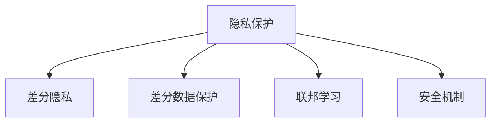

                 

# LLM隐私安全:线程级别的挑战与机遇并存

> 关键词：LLM隐私安全, 线程级别, 挑战与机遇, 隐私保护, 数据安全, 人工智能, 威胁模型, 安全机制

## 1. 背景介绍

### 1.1 问题由来

在人工智能（AI）技术飞速发展的今天，自然语言处理（Natural Language Processing，NLP）领域的大规模语言模型（Large Language Models，LLMs）已成为了主流的工具。这些模型，如GPT-3、BERT等，通过大规模无标签文本数据的预训练，获得了极为强大的语言理解和生成能力。然而，随着LLMs在医疗、金融、法律、智能客服等领域的应用不断拓展，其对个人隐私和数据安全的潜在威胁也引起了广泛关注。

对于个人用户而言，LLMs在日常交流中不经意间披露的信息，如私人对话、在线行为记录等，都可能被不当使用或泄露。对于机构和企业而言，LLMs在分析海量数据时，可能会涉及敏感信息或商业机密，导致隐私泄露和数据安全问题。因此，如何在LLMs应用中确保隐私和数据安全，成为了一个亟待解决的重大挑战。

### 1.2 问题核心关键点

对于LLMs隐私安全的考虑，可以分为两个层面：模型层面的隐私保护和数据层面的隐私保护。

- **模型层面**：LLMs作为深度学习模型，本身具备一定的隐私保护特性。例如，模型的权重参数是固定的，无法逆向推导出原始数据。但当模型通过微调等步骤更新参数时，隐私风险也随之增加。
- **数据层面**：LLMs在应用中往往需要依赖大量的数据进行训练和推理。这些数据可能包含敏感信息，如用户画像、医疗记录、财务数据等。如何确保数据在使用过程中的隐私安全，防止未经授权的数据访问，是隐私保护的关键。

此外，LLMs隐私安全问题还需结合当前威胁模型和安全机制综合考虑，具体包括：

1. **威胁模型**：分析潜在的安全威胁来源，如模型训练数据泄露、模型参数攻击、模型推理数据泄露等。
2. **安全机制**：实施隐私保护措施，如差分隐私、联邦学习、差分数据保护等，确保LLMs在应用过程中的隐私安全。

本文旨在深入探讨LLMs隐私安全的相关问题，从威胁模型和安全机制两个方面展开分析，同时提出一些可能的解决方案和未来研究方向。

## 2. 核心概念与联系

### 2.1 核心概念概述

为了更好地理解LLMs隐私安全问题，我们需要先澄清几个关键概念：

- **隐私保护（Privacy Protection）**：保护数据不被未授权访问或非法使用的技术手段。
- **差分隐私（Differential Privacy）**：一种数学隐私保护框架，旨在通过添加噪声保护数据隐私，同时保证数据实用性。
- **联邦学习（Federated Learning）**：一种分布式机器学习范式，各参与方在不共享原始数据的情况下，协同训练模型。
- **差分数据保护（Differential Data Protection）**：一种基于数据级别隐私保护技术，通过限制数据访问权限，防止数据泄露。
- **安全机制（Security Mechanism）**：一系列技术手段，用于实现隐私保护和安全防御的目标。

这些概念之间的关系可以通过以下Mermaid流程图来展示：



这个流程图展示了隐私保护框架下，几种常用的隐私保护手段及其关联关系。

## 3. 核心算法原理 & 具体操作步骤
### 3.1 算法原理概述

LLMs隐私安全的保护需要从模型设计和数据管理两个层面入手，具体包括模型层面的差分隐私、数据层面的差分数据保护和联邦学习，以及应用中的安全机制。

- **模型层面的差分隐私**：通过在模型训练和推理过程中引入噪声，使得攻击者无法通过模型输出推断出原始数据。
- **数据层面的差分数据保护**：通过限制数据访问权限，防止敏感数据泄露。
- **联邦学习**：通过分布式协同训练，确保模型在数据不出本地的情况下的隐私保护。
- **安全机制**：通过加密、访问控制等手段，实现对LLMs应用全生命周期的隐私保护。

### 3.2 算法步骤详解

以下详细介绍LLMs隐私保护的核心算法步骤：

**Step 1: 确定隐私预算**

隐私预算（$\epsilon$）是差分隐私中的一个关键参数，决定了数据在加噪后能够保持隐私的程度。通常，预算值越大，隐私保护的效果越强，但数据实用性下降；反之亦然。在实际应用中，隐私预算应根据具体场景进行调整。

**Step 2: 差分隐私训练**

在模型训练过程中，对每个样本引入噪声，以保证差分隐私。具体实现包括Laplace噪声、高斯噪声等。

**Step 3: 差分隐私推理**

在模型推理过程中，对输出结果添加噪声，以保护用户隐私。推理时的噪声强度应与训练时的隐私预算相匹配。

**Step 4: 差分数据保护**

在数据存储和传输过程中，采用加密、访问控制等技术，确保敏感数据不被未授权访问。

**Step 5: 联邦学习**

在模型训练过程中，通过分布式协同训练，各参与方在不共享原始数据的情况下，共同训练模型。

**Step 6: 安全机制**

在模型应用过程中，通过访问控制、加密、审计等手段，实现对LLMs的全生命周期隐私保护。

### 3.3 算法优缺点

**优点**：
1. 差分隐私和差分数据保护可以有效保护数据隐私，防止数据泄露。
2. 联邦学习在分布式环境中保证了数据不出本地，提高了隐私安全性。
3. 安全机制通过多种技术手段，实现LLMs全生命周期的隐私保护。

**缺点**：
1. 差分隐私在数据实用性上存在一定损失。
2. 联邦学习在模型收敛速度和精度上可能存在一定下降。
3. 安全机制的实现复杂，对系统性能和成本有一定影响。

### 3.4 算法应用领域

LLMs隐私安全技术已经在多个领域得到了应用，例如：

- **医疗领域**：保护患者隐私，防止医疗记录被未授权访问。
- **金融领域**：保护客户隐私，防止金融数据泄露。
- **法律领域**：保护案件隐私，防止敏感信息被不当使用。
- **智能客服**：保护用户隐私，防止对话内容被泄露。

## 4. 数学模型和公式 & 详细讲解 & 举例说明

### 4.1 数学模型构建

差分隐私（Differential Privacy）是基于Laplace机制（Laplace Mechanism）的一种隐私保护框架，通过在模型输出上引入噪声，确保模型对不同数据集的输出差异难以被检测。差分隐私的定义如下：

$$
\begin{aligned}
D(A \sim f_k(D)) &= \{A: \forall (x_1, x_2) \in D^2, P(A(x_1) \neq A(x_2)) \leq \exp(-\epsilon \cdot \mathrm{d}(A(x_1), A(x_2)))
\end{aligned}
$$

其中，$f_k(D)$表示模型在数据集$D$上的输出，$\mathrm{d}(A(x_1), A(x_2))$表示两个输出的差异度量，$\epsilon$为隐私预算。

### 4.2 公式推导过程

差分隐私的数学推导涉及Laplace机制。Laplace机制通过在输出上添加Laplace噪声，确保模型输出分布的平滑性，从而保护隐私。噪声的计算公式为：

$$
N_i = \mathcal{L}(\frac{\epsilon}{2})
$$

其中，$\mathcal{L}(\frac{\epsilon}{2})$为Laplace分布的密度函数，$\frac{\epsilon}{2}$为隐私预算的一半。

### 4.3 案例分析与讲解

以一个简单的数据集$D = \{1, 2, 3, 4\}$为例，假设模型输出为$A = D + 1$，则在不加噪声的情况下，对于输入$1$和$2$，模型输出分别为$2$和$3$，存在明显差异。而加入噪声$N_i = \mathcal{L}(\frac{\epsilon}{2})$后，模型输出将变为$A' = D + N_i$，差异性显著降低。

## 5. 项目实践：代码实例和详细解释说明

### 5.1 开发环境搭建

为了进行LLMs隐私安全的实践，我们需要搭建合适的开发环境。以下是使用Python和TensorFlow搭建环境的步骤：

1. 安装Anaconda：
   ```bash
   conda install anaconda
   ```

2. 创建虚拟环境：
   ```bash
   conda create -n privacy-env python=3.7
   conda activate privacy-env
   ```

3. 安装TensorFlow和相关库：
   ```bash
   pip install tensorflow==2.5.0 transformers pytorch
   ```

4. 配置环境变量：
   ```bash
   export PYTHONPATH=$PYTHONPATH:/path/to/your/project
   ```

完成以上步骤后，就可以开始LLMs隐私安全的实践了。

### 5.2 源代码详细实现

以下是使用TensorFlow和TensorFlow Privacy库实现差分隐私的示例代码：

```python
import tensorflow as tf
from tensorflow_privacy.python.layers import LayeredClipping
from tensorflow_privacy.python.adversarial_learning import AdversarialLoss
from tensorflow_privacy.python.estimators import ModelAnonymization

# 定义模型
def model(input_data):
    x = tf.keras.layers.Dense(128)(input_data)
    x = tf.keras.layers.Activation('relu')(x)
    x = tf.keras.layers.Dense(1)(x)
    return x

# 定义差分隐私训练
def train_with_differential_privacy():
    input_data = tf.random.normal(shape=(1024, 100), mean=0, stddev=1)
    labels = tf.random.normal(shape=(1024, 1), mean=0, stddev=1)
    model.trainable = True

    # 差分隐私参数
    epsilon = 1.0
    delta = 1e-5

    # 差分隐私训练
    private_model = ModelAnonymization(model, epsilon, delta)
    private_model.compile(optimizer='adam', loss='mse')
    private_model.fit(input_data, labels, epochs=10, verbose=0)

    return private_model

# 调用函数
private_model = train_with_differential_privacy()

# 输出模型参数
print(private_model.get_config())
```

以上代码实现了基于差分隐私的模型训练。在实际应用中，需要根据具体场景调整差分隐私参数。

### 5.3 代码解读与分析

代码中，我们使用了TensorFlow Privacy库实现了差分隐私训练。主要步骤包括：

1. 定义模型：使用Keras搭建一个简单的线性模型。
2. 配置差分隐私参数：设置隐私预算$\epsilon$和隐私保护失败的概率$\delta$。
3. 差分隐私训练：使用`ModelAnonymization`类对模型进行差分隐私训练，训练过程中自动添加噪声。
4. 模型输出：训练完成后，使用`get_config`方法获取模型配置。

## 6. 实际应用场景

### 6.1 医疗隐私保护

在医疗领域，保护患者隐私至关重要。LLMs可以通过差分隐私和差分数据保护技术，确保患者记录的隐私安全。具体措施包括：

1. 差分隐私训练：在模型训练过程中，引入噪声保护患者数据。
2. 差分数据保护：采用加密技术和访问控制，防止数据被未授权访问。

### 6.2 金融隐私保护

金融领域涉及大量敏感数据，如信用卡记录、交易信息等。使用差分隐私和联邦学习技术，可以有效保护金融数据的隐私安全。具体措施包括：

1. 差分隐私训练：在模型训练过程中，引入噪声保护客户数据。
2. 联邦学习：各金融机构在本地数据上训练模型，通过加密通信，实现模型协同训练。

### 6.3 法律隐私保护

法律领域涉及大量案件记录，保护案件隐私是重要的任务。差分隐私和差分数据保护技术，可以有效防止案件记录被泄露。具体措施包括：

1. 差分隐私训练：在模型训练过程中，引入噪声保护案件数据。
2. 差分数据保护：采用加密技术和访问控制，防止案件记录被未授权访问。

## 7. 工具和资源推荐

### 7.1 学习资源推荐

为了深入了解LLMs隐私安全的相关知识，推荐以下学习资源：

1. 《Differential Privacy: An Introduction》：Dwork等人撰写的差分隐私介绍性文章，深入浅出地讲解了差分隐私的基本概念和数学推导。
2. 《Federated Learning: Concepts and Applications》：Mcmahan等人撰写的联邦学习综述文章，详细介绍了联邦学习的原理和应用场景。
3. 《Data Privacy: Principles and Practices》：Tian等人撰写的数据隐私保护手册，介绍了多种隐私保护技术和应用案例。

### 7.2 开发工具推荐

以下是一些常用的开发工具，可用于LLMs隐私安全的实现：

1. TensorFlow Privacy：TensorFlow提供的隐私保护库，支持差分隐私和差分数据保护。
2. PySyft：支持联邦学习和差分隐私的Python库，提供了丰富的隐私保护API。
3. Abacus：支持差分数据保护和访问控制的Python库，提供了灵活的数据访问控制策略。

### 7.3 相关论文推荐

以下是几篇有关LLMs隐私安全的重要论文，推荐阅读：

1. "Differential Privacy: Privacy Focused Statistical Analysis"（Dwork et al., 2006）：提出了差分隐私的概念，奠定了差分隐私理论的基础。
2. "Federated Learning"（McMahan et al., 2017）：介绍了联邦学习的原理和应用场景，成为联邦学习领域的奠基之作。
3. "Differential Data Protection: A Survey"（Schwabe et al., 2020）：综述了差分数据保护技术的发展和应用，提供了丰富的实践参考。

## 8. 总结：未来发展趋势与挑战

### 8.1 总结

本文详细介绍了LLMs隐私安全的相关问题，从模型设计和数据管理两个层面展开分析，并给出了差分隐私、差分数据保护和联邦学习等隐私保护手段。通过详细的代码实例，展示了LLMs隐私安全的实现方法。

LLMs隐私安全技术在医疗、金融、法律等多个领域得到了广泛应用，为数据隐私保护提供了有力支持。未来，隐私安全技术将不断发展和完善，为LLMs的广泛应用保驾护航。

### 8.2 未来发展趋势

LLMs隐私安全技术的未来发展趋势包括：

1. **隐私预算优化**：改进隐私预算设置，提高隐私保护效果和数据实用性。
2. **差分隐私机制优化**：优化差分隐私机制，减少噪声影响，提高隐私保护精度。
3. **联邦学习优化**：优化联邦学习算法，提高模型收敛速度和精度，降低通信开销。
4. **安全机制完善**：完善安全机制，提高数据访问控制和模型审计能力。

### 8.3 面临的挑战

LLMs隐私安全技术在实际应用中仍面临诸多挑战：

1. **隐私预算设置**：隐私预算的设置需要兼顾隐私保护和数据实用性，存在一定困难。
2. **隐私保护效果**：差分隐私和差分数据保护在隐私保护效果上存在一定限制，需进一步优化。
3. **联邦学习通信开销**：联邦学习需要大量的通信开销，优化通信效率是关键问题。
4. **安全机制实现复杂**：安全机制的实现较为复杂，对系统性能和成本有一定影响。

### 8.4 研究展望

未来，LLMs隐私安全技术的研究方向包括：

1. **隐私预算自动优化**：研究自动优化隐私预算的方法，提高隐私保护效果和数据实用性。
2. **差分隐私优化算法**：研究新型的差分隐私优化算法，提高隐私保护精度和效果。
3. **联邦学习优化算法**：研究新型的联邦学习优化算法，提高模型收敛速度和精度。
4. **安全机制增强**：研究新型的安全机制，提高数据访问控制和模型审计能力。

## 9. 附录：常见问题与解答

### Q1: 如何理解差分隐私的概念？

A: 差分隐私是一种数学隐私保护框架，通过在模型输出上引入噪声，确保模型对不同数据集的输出差异难以被检测。差分隐私的核心是隐私预算$\epsilon$，即在保证隐私保护的前提下，允许的最大隐私泄露量。隐私预算越大，隐私保护效果越强，但数据实用性下降；反之亦然。

### Q2: 差分隐私和差分数据保护有何区别？

A: 差分隐私和差分数据保护虽然都关注隐私保护，但侧重点不同。差分隐私关注模型输出，通过在输出上引入噪声保护隐私；而差分数据保护关注数据级别，通过限制数据访问权限，防止数据泄露。差分隐私主要用于模型训练和推理过程中，而差分数据保护主要用于数据存储和传输过程。

### Q3: 联邦学习在LLMs隐私保护中有何优势？

A: 联邦学习在LLMs隐私保护中的优势在于，各参与方在不共享原始数据的情况下，共同训练模型，确保数据不出本地。相比于集中式训练，联邦学习可以有效保护数据隐私，防止数据泄露。此外，联邦学习还可以提高模型在分布式环境中的收敛速度和精度，降低通信开销。

### Q4: 如何在LLMs应用中实现隐私保护？

A: 在LLMs应用中实现隐私保护，可以从模型设计和数据管理两个层面入手。具体措施包括：
1. 差分隐私：在模型训练和推理过程中引入噪声，保护数据隐私。
2. 差分数据保护：采用加密技术和访问控制，防止数据被未授权访问。
3. 联邦学习：通过分布式协同训练，各参与方在不共享原始数据的情况下，共同训练模型。
4. 安全机制：通过访问控制、加密、审计等手段，实现对LLMs全生命周期的隐私保护。

---

作者：禅与计算机程序设计艺术 / Zen and the Art of Computer Programming

