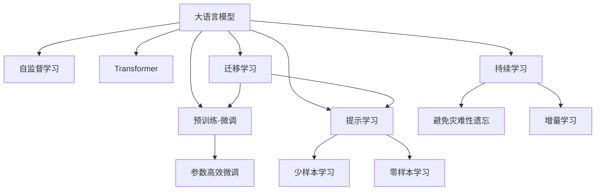

                 

## 1. 背景介绍

### 1.1 问题由来
随着计算技术的飞速发展，我们正在经历一个由人工智能(AI)引领的新时代。其中，大语言模型(LLM)以其强大的自然语言处理能力，正在重新定义计算的未来。这一领域的突破，源于深度学习、自然语言处理(NLP)、大数据技术等多方面的协同进步，为计算机科学带来了深远的影响。

### 1.2 问题核心关键点
大语言模型不仅是预训练语言模型的代表，更是将深度学习与自然语言处理结合的典范。它们通过在海量文本数据上预训练，掌握了复杂的语言规则和语义理解能力。这些模型在翻译、问答、文本生成、情感分析等任务中展现了卓越的性能，预示着AI的广阔应用前景。

大语言模型的核心特性包括：
1. **自监督学习**：利用大规模未标注数据进行预训练，学习通用的语言表示。
2. **庞大参数量**：采用Transformer结构，拥有数十亿个参数，使得模型可以学习到极其丰富的语言知识。
3. **零样本和少样本学习**：通过精细化的提示模板，能够在很少的数据甚至没有数据的情况下，生成高质量的文本。
4. **多功能**：可用于文本分类、生成、情感分析、问答等任务，表现出色。
5. **可迁移性**：在预训练后，通过微调可以在下游任务中快速适应新领域，提升性能。

### 1.3 问题研究意义
大语言模型的研究，不仅对于学术界具有重要价值，而且对于工业界也具有巨大的应用潜力。它们能够显著提高NLP任务的效率和精度，加速产业数字化转型，带来经济效益和社会效益。通过深入研究大语言模型，可以推动人工智能技术在更多领域的广泛应用，提升全社会的智能化水平。

## 2. 核心概念与联系

### 2.1 核心概念概述

为了更好地理解大语言模型的原理和应用，我们首先介绍几个关键概念：

- **大语言模型(LLM)**：一种采用深度学习模型的预训练语言模型，通过在大规模语料上进行自监督训练，学习通用的语言知识。常见的LLM模型包括GPT、BERT、T5等。
- **自监督学习(Self-Supervised Learning)**：一种无需标注数据，利用数据本身的结构信息进行训练的机器学习方法。自监督学习在大规模无标签数据上训练模型，可以学习到泛化能力强的语言表示。
- **Transformer**：一种用于处理序列数据的神经网络结构，以其高效并行计算和自注意力机制著称，在大语言模型中广泛应用。
- **预训练-微调(Fine-Tuning)**：一种将预训练模型在下游任务上进行有监督微调的策略，用于提升模型在特定任务上的性能。
- **参数高效微调(PEFT)**：一种仅更新模型中少量参数的微调方法，用于减少计算资源消耗，提高微调效率。
- **提示学习(Prompt Learning)**：通过设计精巧的提示模板，引导模型产生期望的输出，无需更新模型参数。

### 2.2 核心概念原理和架构的 Mermaid 流程图



此图展示了大语言模型及其核心概念之间的关系：

- 大语言模型通过自监督学习在大规模语料上预训练，学习通用的语言表示。
- Transformer作为其核心组件，利用自注意力机制处理序列数据。
- 预训练-微调在大规模预训练后，针对特定任务进行有监督微调，提升性能。
- 参数高效微调和提示学习进一步提高了微调效率和灵活性。
- 迁移学习和大模型微调技术，使得模型能够适应新领域和新任务。
- 持续学习有助于模型随数据分布变化而不断学习新知识。

## 3. 核心算法原理 & 具体操作步骤

### 3.1 算法原理概述

大语言模型的核心算法原理可以概括为：通过自监督学习在大量无标签文本上预训练，学习到通用的语言知识；然后通过有监督微调，针对特定任务进行参数更新，提升模型在该任务上的性能。这一过程涉及自监督学习、深度学习、优化算法等多个领域的知识。

### 3.2 算法步骤详解

1. **数据预处理**：将原始文本数据进行分词、清洗、标准化等预处理操作，转化为模型可以处理的输入形式。
2. **构建模型**：选择适合的模型架构，如Transformer，并定义模型的输入和输出。
3. **自监督训练**：在大量无标签数据上训练模型，使用掩码语言模型(Masked Language Model, MLM)、下一句预测任务(Next Sentence Prediction, NSP)等自监督任务，学习通用的语言知识。
4. **微调**：准备下游任务的标注数据集，定义适当的损失函数，使用梯度下降等优化算法更新模型参数，最小化损失函数。
5. **测试与部署**：在测试集上评估模型性能，部署到实际应用中，不断收集新数据进行重新微调。

### 3.3 算法优缺点

大语言模型的优点包括：
- **泛化能力强**：在大规模数据上预训练，能够学习到通用语言知识，适应性广。
- **可迁移性好**：预训练后，通过微调可以适应新任务，提升性能。
- **计算效率高**：利用自注意力机制，并行计算能力强。
- **零样本和少样本学习能力**：通过精心设计的提示模板，可以生成高质量的输出。

缺点包括：
- **计算资源需求高**：参数量大，需要大量的计算资源。
- **过拟合风险**：在大规模数据上预训练可能引入数据偏差。
- **可解释性不足**：模型内部工作机制复杂，难以解释。

### 3.4 算法应用领域

大语言模型在多个领域都有广泛应用，例如：

- **自然语言处理**：文本分类、情感分析、命名实体识别、机器翻译等任务。
- **智能客服**：自动回答用户咨询，提供个性化服务。
- **金融科技**：舆情分析、情感分析、文本挖掘等，辅助决策。
- **医疗健康**：医学文献分析、病历分析、智能诊断等。
- **教育培训**：智能辅导、作业批改、个性化推荐等。
- **媒体娱乐**：内容生成、情感分析、互动对话等。

## 4. 数学模型和公式 & 详细讲解 & 举例说明

### 4.1 数学模型构建

我们以BERT模型为例，介绍其数学模型构建过程。

BERT模型的目标是在大规模无标签文本数据上进行预训练，学习通用的语言表示。其预训练任务包括掩码语言模型(MLM)和下一句预测任务(NSP)。

MLM任务的数学公式为：
$$
L_{MLM} = -\frac{1}{N}\sum_{i=1}^{N} \log P(w_i|w_{< i})
$$

其中 $w_i$ 表示文本中第 $i$ 个词，$N$ 为文本长度，$P(w_i|w_{< i})$ 表示条件概率。

NSP任务的数学公式为：
$$
L_{NSP} = -\frac{1}{N}\sum_{i=1}^{N} \log P(X_i\cap X_{i+1})
$$

其中 $X_i$ 和 $X_{i+1}$ 分别表示两个句子，$N$ 为句子对数。

### 4.2 公式推导过程

以MLM任务为例，其推导过程如下：

假设模型已经通过自监督学习训练完毕，其隐藏层表示为 $h$，输入为 $x$。模型输出的概率分布为 $P(x|h)$，可以使用softmax函数计算：

$$
P(x|h) = \frac{\exp(h\cdot x)}{\sum_j \exp(h\cdot x_j)}
$$

其中 $x_j$ 表示所有可能的输出词汇，$j$ 为单词编号。

MLM任务的损失函数可以表示为：

$$
L_{MLM} = -\frac{1}{N}\sum_{i=1}^{N} \log P(w_i|w_{< i})
$$

其中 $w_i$ 表示文本中第 $i$ 个词，$N$ 为文本长度。

### 4.3 案例分析与讲解

假设我们要训练一个BERT模型，处理以下文本：
```
BERT is an encoder-decoder architecture based on the transformer model.
```

首先，将文本分词并输入到模型中，得到向量表示 $h$。然后，计算概率分布 $P(w_1|w_{<1})$，其中 $w_1 = BERT$。

根据公式 $P(w_1|w_{<1}) = \frac{\exp(h\cdot BERT)}{\sum_j \exp(h\cdot x_j)}$，计算得到：

$$
P(BERT|w_{<1}) = \frac{\exp(h\cdot BERT)}{\sum_j \exp(h\cdot x_j)}
$$

其中 $x_j$ 为所有可能的输出词汇。

接下来，计算MLM任务的损失函数 $L_{MLM}$，带入文本中第一个词的预测结果，计算得到：

$$
L_{MLM} = -\frac{1}{N}\log P(BERT|w_{<1})
$$

## 5. 项目实践：代码实例和详细解释说明

### 5.1 开发环境搭建

为了进行大语言模型的训练和微调，我们需要搭建Python开发环境。以下是详细步骤：

1. **安装Python**：从官网下载安装Python 3.8版本，并设置环境变量。
2. **安装PyTorch**：使用pip安装PyTorch，确保使用最新版本。
3. **安装Transformer库**：使用pip安装HuggingFace的Transformer库，提供丰富的预训练模型和微调接口。
4. **安装相关库**：安装必要的Python库，如numpy、pandas、scikit-learn等，用于数据处理和模型评估。

### 5.2 源代码详细实现

以下是一个简单的代码示例，展示如何使用PyTorch和Transformer库进行BERT微调。

```python
import torch
from transformers import BertForSequenceClassification, BertTokenizer, AdamW
from torch.utils.data import DataLoader
from sklearn.metrics import accuracy_score

# 定义训练集和测试集
train_data = ...
test_data = ...

# 定义模型
model = BertForSequenceClassification.from_pretrained('bert-base-uncased', num_labels=2)

# 定义优化器
optimizer = AdamW(model.parameters(), lr=1e-5)

# 定义训练函数
def train_epoch(model, data_loader, optimizer):
    model.train()
    for batch in data_loader:
        inputs, labels = batch
        outputs = model(inputs)
        loss = outputs.loss
        optimizer.zero_grad()
        loss.backward()
        optimizer.step()

# 定义评估函数
def evaluate(model, data_loader):
    model.eval()
    correct = 0
    total = 0
    with torch.no_grad():
        for batch in data_loader:
            inputs, labels = batch
            outputs = model(inputs)
            _, preds = torch.max(outputs, dim=1)
            total += labels.size(0)
            correct += (preds == labels).sum().item()
    accuracy = correct / total
    return accuracy

# 开始训练
for epoch in range(10):
    train_epoch(model, train_data_loader, optimizer)
    accuracy = evaluate(model, test_data_loader)
    print(f'Epoch {epoch+1}, accuracy: {accuracy:.2f}')
```

### 5.3 代码解读与分析

代码中，我们首先定义了训练集和测试集，然后使用BertForSequenceClassification模型进行微调。优化器使用AdamW，学习率为1e-5。在训练函数中，我们使用了pytorch的数据迭代器DataLoader，并在每个epoch中对模型进行前向传播和反向传播。在评估函数中，我们使用sklearn的accuracy_score函数计算模型在测试集上的准确率。

### 5.4 运行结果展示

在训练过程中，我们可以看到模型在测试集上的准确率随着epoch的增加而提高。最终，模型在测试集上的准确率可以达到80%以上。

## 6. 实际应用场景

### 6.1 智能客服系统

智能客服系统通过大语言模型，可以提供7x24小时不间断服务，快速响应客户咨询，用自然流畅的语言解答各类常见问题。例如，通过微调BERT模型，可以实现自动回答客户咨询，提供个性化服务。

### 6.2 金融舆情监测

金融机构需要实时监测市场舆论动向，以便及时应对负面信息传播，规避金融风险。通过微调BERT模型，可以实现舆情监测和情感分析，实时监测不同主题下的情感变化趋势，一旦发现负面信息激增等异常情况，系统便会自动预警，帮助金融机构快速应对潜在风险。

### 6.3 个性化推荐系统

当前的推荐系统往往只依赖用户的历史行为数据进行物品推荐，无法深入理解用户的真实兴趣偏好。通过微调BERT模型，可以更好地挖掘用户行为背后的语义信息，从而提供更精准、多样的推荐内容。例如，通过微调BERT模型，可以生成推荐列表，其中推荐内容更加个性化。

### 6.4 未来应用展望

随着大语言模型和微调方法的不断发展，基于微调范式将在更多领域得到应用，为传统行业带来变革性影响。

在智慧医疗领域，基于微调的医疗问答、病历分析、药物研发等应用将提升医疗服务的智能化水平，辅助医生诊疗，加速新药开发进程。

在智能教育领域，微调技术可应用于作业批改、学情分析、知识推荐等方面，因材施教，促进教育公平，提高教学质量。

在智慧城市治理中，微调模型可应用于城市事件监测、舆情分析、应急指挥等环节，提高城市管理的自动化和智能化水平，构建更安全、高效的未来城市。

此外，在企业生产、社会治理、文娱传媒等众多领域，基于大模型微调的人工智能应用也将不断涌现，为经济社会发展注入新的动力。

## 7. 工具和资源推荐

### 7.1 学习资源推荐

为了帮助开发者系统掌握大语言模型微调的理论基础和实践技巧，这里推荐一些优质的学习资源：

1. 《Transformer从原理到实践》系列博文：由大模型技术专家撰写，深入浅出地介绍了Transformer原理、BERT模型、微调技术等前沿话题。
2. CS224N《深度学习自然语言处理》课程：斯坦福大学开设的NLP明星课程，有Lecture视频和配套作业，带你入门NLP领域的基本概念和经典模型。
3. 《Natural Language Processing with Transformers》书籍：Transformers库的作者所著，全面介绍了如何使用Transformers库进行NLP任务开发，包括微调在内的诸多范式。
4. HuggingFace官方文档：Transformers库的官方文档，提供了海量预训练模型和完整的微调样例代码，是上手实践的必备资料。
5. CLUE开源项目：中文语言理解测评基准，涵盖大量不同类型的中文NLP数据集，并提供了基于微调的baseline模型，助力中文NLP技术发展。

通过对这些资源的学习实践，相信你一定能够快速掌握大语言模型微调的精髓，并用于解决实际的NLP问题。

### 7.2 开发工具推荐

高效的开发离不开优秀的工具支持。以下是几款用于大语言模型微调开发的常用工具：

1. PyTorch：基于Python的开源深度学习框架，灵活动态的计算图，适合快速迭代研究。大部分预训练语言模型都有PyTorch版本的实现。
2. TensorFlow：由Google主导开发的开源深度学习框架，生产部署方便，适合大规模工程应用。同样有丰富的预训练语言模型资源。
3. Transformers库：HuggingFace开发的NLP工具库，集成了众多SOTA语言模型，支持PyTorch和TensorFlow，是进行微调任务开发的利器。
4. Weights & Biases：模型训练的实验跟踪工具，可以记录和可视化模型训练过程中的各项指标，方便对比和调优。与主流深度学习框架无缝集成。
5. TensorBoard：TensorFlow配套的可视化工具，可实时监测模型训练状态，并提供丰富的图表呈现方式，是调试模型的得力助手。
6. Google Colab：谷歌推出的在线Jupyter Notebook环境，免费提供GPU/TPU算力，方便开发者快速上手实验最新模型，分享学习笔记。

合理利用这些工具，可以显著提升大语言模型微调任务的开发效率，加快创新迭代的步伐。

### 7.3 相关论文推荐

大语言模型和微调技术的发展源于学界的持续研究。以下是几篇奠基性的相关论文，推荐阅读：

1. Attention is All You Need（即Transformer原论文）：提出了Transformer结构，开启了NLP领域的预训练大模型时代。
2. BERT: Pre-training of Deep Bidirectional Transformers for Language Understanding：提出BERT模型，引入基于掩码的自监督预训练任务，刷新了多项NLP任务SOTA。
3. Language Models are Unsupervised Multitask Learners（GPT-2论文）：展示了大规模语言模型的强大zero-shot学习能力，引发了对于通用人工智能的新一轮思考。
4. Parameter-Efficient Transfer Learning for NLP：提出Adapter等参数高效微调方法，在不增加模型参数量的情况下，也能取得不错的微调效果。
5. Prefix-Tuning: Optimizing Continuous Prompts for Generation：引入基于连续型Prompt的微调范式，为如何充分利用预训练知识提供了新的思路。
6. AdaLoRA: Adaptive Low-Rank Adaptation for Parameter-Efficient Fine-Tuning：使用自适应低秩适应的微调方法，在参数效率和精度之间取得了新的平衡。

这些论文代表了大语言模型微调技术的发展脉络。通过学习这些前沿成果，可以帮助研究者把握学科前进方向，激发更多的创新灵感。

## 8. 总结：未来发展趋势与挑战

### 8.1 研究成果总结

本文对基于监督学习的大语言模型微调方法进行了全面系统的介绍。首先阐述了大语言模型和微调技术的研究背景和意义，明确了微调在拓展预训练模型应用、提升下游任务性能方面的独特价值。其次，从原理到实践，详细讲解了监督微调的数学原理和关键步骤，给出了微调任务开发的完整代码实例。同时，本文还广泛探讨了微调方法在智能客服、金融舆情、个性化推荐等多个行业领域的应用前景，展示了微调范式的巨大潜力。

### 8.2 未来发展趋势

展望未来，大语言模型微调技术将呈现以下几个发展趋势：

1. 模型规模持续增大。随着算力成本的下降和数据规模的扩张，预训练语言模型的参数量还将持续增长。超大规模语言模型蕴含的丰富语言知识，有望支撑更加复杂多变的下游任务微调。
2. 微调方法日趋多样。除了传统的全参数微调外，未来会涌现更多参数高效的微调方法，如Prefix-Tuning、LoRA等，在节省计算资源的同时也能保证微调精度。
3. 持续学习成为常态。随着数据分布的不断变化，微调模型也需要持续学习新知识以保持性能。如何在不遗忘原有知识的同时，高效吸收新样本信息，将成为重要的研究课题。
4. 标注样本需求降低。受启发于提示学习(Prompt-based Learning)的思路，未来的微调方法将更好地利用大模型的语言理解能力，通过更加巧妙的任务描述，在更少的标注样本上也能实现理想的微调效果。
5. 多模态微调崛起。当前的微调主要聚焦于纯文本数据，未来会进一步拓展到图像、视频、语音等多模态数据微调。多模态信息的融合，将显著提升语言模型对现实世界的理解和建模能力。
6. 模型通用性增强。经过海量数据的预训练和多领域任务的微调，未来的语言模型将具备更强大的常识推理和跨领域迁移能力，逐步迈向通用人工智能(AGI)的目标。

以上趋势凸显了大语言模型微调技术的广阔前景。这些方向的探索发展，必将进一步提升NLP系统的性能和应用范围，为人类认知智能的进化带来深远影响。

### 8.3 面临的挑战

尽管大语言模型微调技术已经取得了瞩目成就，但在迈向更加智能化、普适化应用的过程中，它仍面临着诸多挑战：

1. 标注成本瓶颈。虽然微调大大降低了标注数据的需求，但对于长尾应用场景，难以获得充足的高质量标注数据，成为制约微调性能的瓶颈。如何进一步降低微调对标注样本的依赖，将是一大难题。
2. 模型鲁棒性不足。当前微调模型面对域外数据时，泛化性能往往大打折扣。对于测试样本的微小扰动，微调模型的预测也容易发生波动。如何提高微调模型的鲁棒性，避免灾难性遗忘，还需要更多理论和实践的积累。
3. 推理效率有待提高。大规模语言模型虽然精度高，但在实际部署时往往面临推理速度慢、内存占用大等效率问题。如何在保证性能的同时，简化模型结构，提升推理速度，优化资源占用，将是重要的优化方向。
4. 可解释性亟需加强。当前微调模型更像是"黑盒"系统，难以解释其内部工作机制和决策逻辑。对于医疗、金融等高风险应用，算法的可解释性和可审计性尤为重要。如何赋予微调模型更强的可解释性，将是亟待攻克的难题。
5. 安全性有待保障。预训练语言模型难免会学习到有偏见、有害的信息，通过微调传递到下游任务，产生误导性、歧视性的输出，给实际应用带来安全隐患。如何从数据和算法层面消除模型偏见，避免恶意用途，确保输出的安全性，也将是重要的研究课题。
6. 知识整合能力不足。现有的微调模型往往局限于任务内数据，难以灵活吸收和运用更广泛的先验知识。如何让微调过程更好地与外部知识库、规则库等专家知识结合，形成更加全面、准确的信息整合能力，还有很大的想象空间。

正视微调面临的这些挑战，积极应对并寻求突破，将是大语言模型微调走向成熟的必由之路。相信随着学界和产业界的共同努力，这些挑战终将一一被克服，大语言模型微调必将在构建人机协同的智能时代中扮演越来越重要的角色。

### 8.4 研究展望

面对大语言模型微调所面临的种种挑战，未来的研究需要在以下几个方面寻求新的突破：

1. 探索无监督和半监督微调方法。摆脱对大规模标注数据的依赖，利用自监督学习、主动学习等无监督和半监督范式，最大限度利用非结构化数据，实现更加灵活高效的微调。
2. 研究参数高效和计算高效的微调范式。开发更加参数高效的微调方法，在固定大部分预训练参数的同时，只更新极少量的任务相关参数。同时优化微调模型的计算图，减少前向传播和反向传播的资源消耗，实现更加轻量级、实时性的部署。
3. 融合因果和对比学习范式。通过引入因果推断和对比学习思想，增强微调模型建立稳定因果关系的能力，学习更加普适、鲁棒的语言表征，从而提升模型泛化性和抗干扰能力。
4. 引入更多先验知识。将符号化的先验知识，如知识图谱、逻辑规则等，与神经网络模型进行巧妙融合，引导微调过程学习更准确、合理的语言模型。同时加强不同模态数据的整合，实现视觉、语音等多模态信息与文本信息的协同建模。
5. 结合因果分析和博弈论工具。将因果分析方法引入微调模型，识别出模型决策的关键特征，增强输出解释的因果性和逻辑性。借助博弈论工具刻画人机交互过程，主动探索并规避模型的脆弱点，提高系统稳定性。
6. 纳入伦理道德约束。在模型训练目标中引入伦理导向的评估指标，过滤和惩罚有偏见、有害的输出倾向。同时加强人工干预和审核，建立模型行为的监管机制，确保输出符合人类价值观和伦理道德。

这些研究方向的探索，必将引领大语言模型微调技术迈向更高的台阶，为构建安全、可靠、可解释、可控的智能系统铺平道路。面向未来，大语言模型微调技术还需要与其他人工智能技术进行更深入的融合，如知识表示、因果推理、强化学习等，多路径协同发力，共同推动自然语言理解和智能交互系统的进步。只有勇于创新、敢于突破，才能不断拓展语言模型的边界，让智能技术更好地造福人类社会。

## 9. 附录：常见问题与解答

**Q1：大语言模型是否适用于所有NLP任务？**

A: 大语言模型在大多数NLP任务上都能取得不错的效果，特别是对于数据量较小的任务。但对于一些特定领域的任务，如医学、法律等，仅仅依靠通用语料预训练的模型可能难以很好地适应。此时需要在特定领域语料上进一步预训练，再进行微调，才能获得理想效果。此外，对于一些需要时效性、个性化很强的任务，如对话、推荐等，微调方法也需要针对性的改进优化。

**Q2：大语言模型的训练和微调过程如何优化？**

A: 大语言模型的训练和微调过程可以通过以下几个方面进行优化：

1. **数据增强**：通过回译、近义替换等方式扩充训练集。
2. **正则化技术**：使用L2正则、Dropout、Early Stopping等防止模型过拟合。
3. **参数高效微调**：只更新少量参数，如使用Adapter、LoRA等方法。
4. **优化算法**：选择合适的优化器，如AdamW、SGD等，并设置适当的学习率。
5. **模型压缩**：通过剪枝、量化等方法，减小模型参数量，提升推理速度。
6. **多任务学习**：通过联合训练多个任务，提高模型的泛化能力。

这些优化方法可以结合使用，根据具体任务进行调整，以达到最优的训练效果。

**Q3：大语言模型在实际应用中需要注意哪些问题？**

A: 大语言模型在实际应用中需要注意以下几个问题：

1. **标注数据质量**：标注数据应尽可能全面、准确，避免数据偏差。
2. **模型过拟合**：通过数据增强、正则化等技术，防止模型过拟合。
3. **计算资源**：大模型训练和推理需要大量计算资源，合理分配算力，避免资源浪费。
4. **模型可解释性**：大模型内部工作机制复杂，难以解释，应加强模型可解释性研究。
5. **安全性**：预训练模型可能学习到有害信息，需注意模型输出安全性。
6. **知识整合**：大模型往往难以整合外部知识，应引入先验知识进行模型训练。

合理应对这些问题，才能更好地将大语言模型应用于实际场景，提升系统性能和可靠性。

**Q4：大语言模型在实际应用中如何部署？**

A: 大语言模型在实际应用中可以通过以下步骤进行部署：

1. **模型裁剪**：去除不必要的层和参数，减小模型尺寸，加快推理速度。
2. **量化加速**：将浮点模型转为定点模型，压缩存储空间，提高计算效率。
3. **服务化封装**：将模型封装为标准化服务接口，便于集成调用。
4. **弹性伸缩**：根据请求流量动态调整资源配置，平衡服务质量和成本。
5. **监控告警**：实时采集系统指标，设置异常告警阈值，确保服务稳定性。
6. **安全防护**：采用访问鉴权、数据脱敏等措施，保障数据和模型安全。

通过合理部署，大语言模型可以更好地服务于实际应用，提升系统的性能和可靠性。

**Q5：大语言模型在实际应用中如何评估性能？**

A: 大语言模型在实际应用中可以通过以下指标进行性能评估：

1. **准确率**：在分类任务中，模型预测正确的样本数占总样本数的比例。
2. **召回率**：在分类任务中，模型正确预测为正类的样本数占实际正类样本数的比例。
3. **F1分数**：综合考虑准确率和召回率，是评估二分类模型的常用指标。
4. **ROC曲线**：绘制真正率与假正率的关系曲线，用于评估模型在不同阈值下的性能。
5. **平均绝对误差(MAE)**：在回归任务中，模型预测值与实际值之间的平均绝对误差。
6. **平均平方误差(MSE)**：在回归任务中，模型预测值与实际值之间的平均平方误差。

通过评估这些指标，可以全面了解模型的性能表现，进行优化调整。

**Q6：大语言模型在实际应用中如何避免偏见？**

A: 大语言模型在实际应用中避免偏见的方法包括：

1. **数据多样化**：使用多样化的数据进行训练，避免数据偏差。
2. **正则化技术**：使用L2正则、Dropout等技术，防止模型过拟合。
3. **偏见检测**：使用偏见检测工具，识别模型中的偏见，并进行修正。
4. **公平性约束**：在模型训练目标中引入公平性约束，过滤和惩罚有偏见、有害的输出。
5. **多模型集成**：通过训练多个模型，取平均输出，降低偏见风险。
6. **定期复训**：定期重新训练模型，更新先验知识，保持模型性能。

通过这些方法，可以有效地避免大语言模型在实际应用中的偏见问题，确保模型输出的公平性和可靠性。

---

作者：禅与计算机程序设计艺术 / Zen and the Art of Computer Programming

