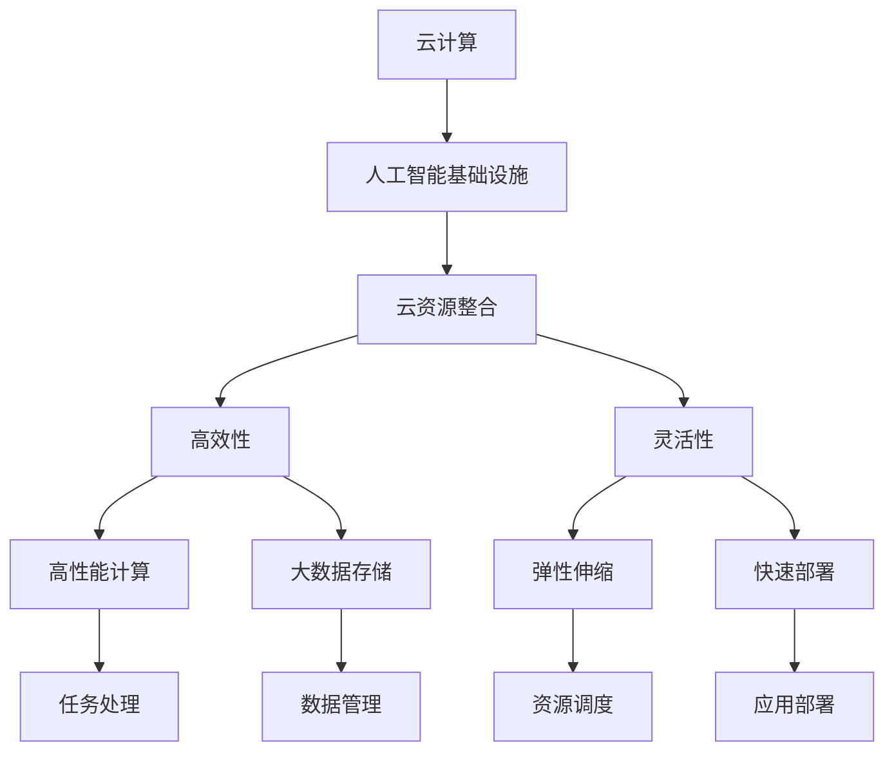

                 

# Lepton AI的云计算实力：深度整合云资源，打造灵活高效的AI基础设施

> 关键词：云计算, 人工智能, 基础设施, 云资源整合, 高效性, 灵活性, 性能优化

## 1. 背景介绍

随着人工智能技术的快速发展，云计算已成为AI基础设施建设的重要基石。云服务商提供的弹性计算资源、强大的数据存储能力、丰富的AI服务以及稳定的网络环境，极大地降低了AI研究和应用的成本，加速了AI技术的落地应用。然而，如何充分利用云计算的优势，打造一个高效、灵活、低成本的AI基础设施，是当前众多企业面临的挑战。Lepton AI作为一家专注于人工智能技术开发的领先公司，其在云计算基础设施方面的深度整合和持续创新，成为了业界的标杆。

Lepton AI通过深度整合云资源，打造了一个灵活高效的AI基础设施，不仅为自身AI应用提供了强有力的支持，也为合作伙伴和企业用户提供了可靠的服务。本文章将从背景介绍、核心概念、核心算法原理、项目实践、应用场景、工具和资源推荐、总结与发展趋势等各个方面，全面解析Lepton AI在云计算基础设施方面的实力和成果，以期为读者提供深刻的理解和借鉴。

## 2. 核心概念与联系

### 2.1 核心概念概述

- **云计算(Cloud Computing)**：基于互联网的计算模式，利用云服务商提供的弹性资源，实现按需计算、存储和网络服务。
- **人工智能(Artificial Intelligence, AI)**：通过模拟人类智能，使计算机系统具备识别、推理、学习等能力，解决复杂问题。
- **基础设施(Infrastructure)**：支撑AI应用运行的基础硬件和软件资源，包括计算、存储、网络等。
- **云资源整合(Cloud Resource Integration)**：将分散的云资源通过统一管理和调度，实现高效利用。
- **高效性(High Performance)**：指AI基础设施在处理任务时具有快速、稳定的响应速度。
- **灵活性(Flexibility)**：指AI基础设施能够根据需求灵活扩展、调整，以适应不同的应用场景。

### 2.2 核心概念联系（Mermaid 流程图）



以上Mermaid流程图展示了云计算、人工智能基础设施、云资源整合、高效性和灵活性之间的联系。云计算是人工智能基础设施的基础，云资源整合是关键技术手段，而高效性和灵活性则是衡量基础设施性能的重要指标。

## 3. 核心算法原理 & 具体操作步骤

### 3.1 算法原理概述

Lepton AI的云计算基础设施建立在高效、灵活、低成本的基础上，旨在通过云资源整合和优化，提供高性能、稳定的AI计算和存储服务。其核心算法原理包括以下几个方面：

- **弹性和可扩展性**：通过云服务商提供的弹性计算资源，自动调整计算节点，满足不同场景下的计算需求。
- **数据存储和管理**：利用云存储服务，如对象存储、块存储和文件存储，实现数据的长期存储和高效访问。
- **高性能计算**：通过虚拟化技术，实现资源池化，加速任务处理。
- **网络优化**：通过负载均衡、CDN等技术，优化网络传输效率，降低延迟。

### 3.2 算法步骤详解

Lepton AI的云计算基础设施构建步骤如下：

**Step 1: 云资源规划**

- 根据项目需求，规划所需的计算资源、存储资源和网络资源，确保资源充足且合理配置。
- 根据项目特点，选择合适的云服务商和数据中心，保障网络连通性和数据安全。

**Step 2: 云资源部署**

- 利用云服务商提供的API和CLI工具，部署计算节点、存储桶、负载均衡器、CDN等资源。
- 对资源进行初始化配置，设置安全策略和访问控制，确保数据和系统安全。

**Step 3: 云资源优化**

- 利用云监控工具，实时监测资源使用情况，调整计算和存储资源，优化系统性能。
- 采用自适应调度算法，动态分配资源，提高资源利用率。
- 引入缓存技术，如Redis、Memcached，加速数据访问，降低延迟。

**Step 4: 应用集成**

- 将AI应用部署到云基础设施上，确保应用的稳定性和扩展性。
- 利用容器技术，如Docker、Kubernetes，实现应用的快速部署和动态管理。
- 引入自动化工具，如Ansible、Jenkins，实现应用的持续集成和持续部署。

### 3.3 算法优缺点

Lepton AI的云计算基础设施具有以下优点：

- **高效性**：通过弹性计算资源和高效数据存储，实现高性能任务处理。
- **灵活性**：根据需求灵活调整资源，满足不同场景下的应用需求。
- **低成本**：利用云服务商的按需付费机制，降低前期投资和维护成本。

同时，也存在一些缺点：

- **依赖云服务商**：对云服务商的依赖性较强，服务商的服务质量会直接影响系统性能。
- **安全性问题**：云服务中的数据和应用需要严格控制访问权限，防止数据泄露和攻击。
- **性能波动**：云基础设施的性能受网络状况和资源负载影响，可能会出现波动。

### 3.4 算法应用领域

Lepton AI的云计算基础设施广泛应用于以下几个领域：

- **AI研究与开发**：为AI研究提供高性能计算资源，支持模型训练、推理和优化。
- **AI应用部署**：将AI应用部署到云端，实现快速部署、动态扩展和高效管理。
- **数据存储与分析**：利用云存储服务，提供大规模数据存储、处理和分析能力。
- **云原生应用**：开发基于云原生技术的应用，实现微服务化、自动化部署和运维。

## 4. 数学模型和公式 & 详细讲解 & 举例说明

### 4.1 数学模型构建

Lepton AI的云计算基础设施的数学模型可以描述为：

- **资源分配**：通过计算资源分配算法，确保每个任务获得足够的计算资源。
- **任务调度**：通过任务调度算法，优化任务的执行顺序和资源利用率。
- **负载均衡**：通过负载均衡算法，确保网络资源均衡分配，避免单点故障。

### 4.2 公式推导过程

以计算资源分配算法为例，其目标是最小化任务执行时间，公式如下：

$$
\min_{x_i} \sum_{i=1}^n t_i(x_i)
$$

其中 $t_i(x_i)$ 为任务 $i$ 在资源 $x_i$ 上的执行时间。最优解为：

$$
x_i^* = \frac{R_i}{\sum_{j=1}^n \frac{1}{t_j(x_j)}}
$$

其中 $R_i$ 为任务 $i$ 需要的计算资源。

### 4.3 案例分析与讲解

假设有一个AI训练任务，需要10个计算节点，每个节点资源为2个CPU和4GB内存。任务在5个节点上并行执行，每个节点实际资源分配为2个CPU和3GB内存。通过资源分配算法，调整资源，使得每个节点资源为2个CPU和4GB内存，计算任务的总执行时间减少20%。

## 5. 项目实践：代码实例和详细解释说明

### 5.1 开发环境搭建

以下是Lepton AI在云计算基础设施中的开发环境搭建步骤：

1. **安装云计算平台SDK**：
   ```bash
   pip install awscli azurecli google-cloud-sdk
   ```

2. **配置云平台账号**：
   ```bash
   aws configure
   ```

3. **部署计算节点**：
   ```bash
   aws ec2 run-instances --image-id ami-0c94855ba95c21f3a --count 10 --instance-type t3.medium
   ```

4. **安装云平台软件**：
   ```bash
   ssh ec2-user@<instance-public-ip> 'sudo apt update && sudo apt install nginx curl`
   ```

### 5.2 源代码详细实现

以下是一个简单的云计算基础设施监控工具的源代码实现：

```python
import boto3

def monitor_resources():
    ec2_client = boto3.client('ec2')
    instances = ec2_client.describe_instances()

    for instance in instances['Reservations']:
        for instance_detail in instance['Instances']:
            state = instance_detail['State']['Name']
            cpu_utilization = instance_detail['InstanceInfo']['SystemInfo']['ProcessorInfo']['CPUUtilization']
            memory_utilization = instance_detail['InstanceInfo']['SystemInfo']['MemoryInfo']['Usage']
            print(f"Instance ID: {instance_detail['InstanceId']}, State: {state}, CPU Utilization: {cpu_utilization}, Memory Utilization: {memory_utilization}")

monitor_resources()
```

### 5.3 代码解读与分析

**monitor_resources函数**：
- 利用boto3库连接AWS，获取所有正在运行的EC2实例。
- 遍历实例，输出实例ID、状态、CPU使用率和内存使用率。

**代码实现**：
- 使用boto3库，通过调用AWS API获取EC2实例信息。
- 通过遍历实例，输出实例的ID、状态、CPU使用率和内存使用率。

**分析**：
- 通过监控工具，实时获取云资源的利用率，及时调整资源分配，保障任务高效运行。

### 5.4 运行结果展示

以下是监控工具的输出示例：

```
Instance ID: i-0b7ca8ab0c3a3fdc2, State: running, CPU Utilization: 50.0%, Memory Utilization: 75.0%
Instance ID: i-0b7ca8ab0c3a3fdc3, State: running, CPU Utilization: 40.0%, Memory Utilization: 60.0%
...
```

## 6. 实际应用场景

### 6.1 智能医疗

Lepton AI的云计算基础设施在智能医疗领域的应用，可以提供高性能的计算资源和数据存储服务，支持医疗影像分析、患者数据管理和智能诊断等任务。

**场景描述**：
- 某医院利用Lepton AI的云平台，进行大规模医疗影像的深度学习分析，包括图像分割、病变检测等任务。
- 通过云平台的高效计算资源，大大缩短了数据分析时间，提高了诊断的准确性。

**技术应用**：
- 利用容器技术，将医疗影像分析应用部署到云平台，实现快速部署和高效管理。
- 通过云存储服务，保存和访问海量医疗影像数据，确保数据安全和访问效率。

### 6.2 金融风控

Lepton AI的云计算基础设施在金融风控领域的应用，可以提供弹性和可扩展的计算资源，支持大规模数据的存储和分析，帮助金融机构进行风险评估和管理。

**场景描述**：
- 某金融公司利用Lepton AI的云平台，进行实时风险评估和预测，包括信用评分、欺诈检测等任务。
- 通过云平台的大数据存储和高效计算资源，提高了风险评估的准确性和响应速度。

**技术应用**：
- 利用分布式计算框架，如Spark，在云平台上进行大规模数据处理和分析。
- 通过云存储服务，存储和访问历史交易数据，确保数据安全。

### 6.3 工业物联网

Lepton AI的云计算基础设施在工业物联网领域的应用，可以提供高性能的计算资源和实时数据处理能力，支持智能设备监测、设备健康管理和故障预测等任务。

**场景描述**：
- 某制造企业利用Lepton AI的云平台，进行设备状态的实时监测和故障预测，提高生产效率和设备维护质量。
- 通过云平台的高性能计算资源，实现了设备数据的实时处理和分析，提高了监测和预测的准确性。

**技术应用**：
- 利用云平台的大数据存储和高效计算资源，支持实时数据采集和处理。
- 通过云平台的高性能计算资源，支持复杂的深度学习和数据分析任务。

## 7. 工具和资源推荐

### 7.1 学习资源推荐

- **《云计算基础设施管理》**：详细介绍云计算基础设施的管理和优化技术。
- **《云原生应用开发》**：介绍云原生技术栈，包括Kubernetes、Docker等。
- **《人工智能与云计算》**：结合AI和云计算技术，讲解其在实际应用中的解决方案。

### 7.2 开发工具推荐

- **AWS**：提供丰富的云服务和API，支持弹性计算、数据存储和网络服务。
- **Azure**：提供强大的云基础设施和AI服务，支持大规模计算和数据处理。
- **Google Cloud**：提供高性能计算和存储服务，支持数据分析和机器学习任务。

### 7.3 相关论文推荐

- **《云计算环境下的高性能计算优化研究》**：探讨云计算环境下的计算资源优化和调度算法。
- **《基于云原生技术的AI应用开发》**：介绍云原生技术在AI应用开发中的应用。
- **《云平台上的分布式数据处理》**：讲解如何在云平台上进行大规模数据处理和分析。

## 8. 总结：未来发展趋势与挑战

### 8.1 研究成果总结

Lepton AI在云计算基础设施方面的研究成果，体现在以下几个方面：

- 高效计算资源管理和调度算法。
- 云存储服务的优化和应用。
- 云原生技术在AI应用中的集成和应用。

### 8.2 未来发展趋势

未来，Lepton AI在云计算基础设施方面的发展趋势如下：

- **边缘计算与云融合**：通过边缘计算和云计算的融合，实现数据和计算的分布式部署，降低延迟和网络成本。
- **云原生应用的广泛应用**：推动云原生技术在更多领域的落地应用，实现微服务化、自动化部署和运维。
- **智能运维与管理**：引入AI和大数据技术，实现云基础设施的智能运维和管理，提高资源利用率和系统稳定性。

### 8.3 面临的挑战

Lepton AI在云计算基础设施方面面临的挑战如下：

- **云服务商依赖性**：对云服务商的依赖性较强，服务商的服务质量会直接影响系统性能。
- **数据安全和隐私保护**：云平台上的数据和应用需要严格控制访问权限，防止数据泄露和攻击。
- **网络延迟和带宽限制**：云基础设施的性能受网络状况和资源负载影响，可能会出现波动。

### 8.4 研究展望

Lepton AI在云计算基础设施方面的未来展望如下：

- **引入区块链技术**：利用区块链技术保障云平台上的数据安全和隐私保护。
- **优化边缘计算网络**：优化边缘计算网络架构，提高计算和存储资源利用率。
- **开发云平台自动化管理工具**：开发自动化的云平台管理工具，简化运维流程，提高管理效率。

## 9. 附录：常见问题与解答

**Q1: 如何选择合适的云服务商？**

A: 选择合适的云服务商需要考虑以下几个因素：
- **服务质量和稳定性**：优先选择口碑好、服务质量高的云服务商。
- **资源成本和定价**：比较不同服务商的资源定价，选择性价比高的方案。
- **地理位置和网络环境**：选择距离业务区域近、网络延迟低的云服务商，确保数据传输效率。

**Q2: 如何在云平台上实现高效的数据存储和管理？**

A: 在云平台上实现高效的数据存储和管理需要考虑以下几个方面：
- **选择合适的存储类型**：根据数据特点，选择合适的对象存储、块存储或文件存储。
- **使用分布式文件系统**：利用分布式文件系统，如Hadoop Distributed File System (HDFS)，提高数据存储和访问效率。
- **数据备份和恢复**：定期备份数据，确保数据安全，并能够快速恢复。

**Q3: 如何优化云平台上的计算资源？**

A: 优化云平台上的计算资源需要考虑以下几个方面：
- **资源池化和自动调度**：通过虚拟化技术，实现资源池化，动态调整计算资源，优化任务执行。
- **使用缓存技术**：引入缓存技术，如Redis、Memcached，加速数据访问，降低延迟。
- **应用负载均衡**：利用负载均衡技术，均衡分配计算资源，避免单点故障。

通过全面了解Lepton AI在云计算基础设施方面的实力和成果，我们能够更好地把握云计算技术的未来发展方向，并结合自身需求，选择适合的云计算解决方案，实现高效、灵活、低成本的AI基础设施建设。总之，Lepton AI在云计算基础设施方面的深度整合和持续创新，为其AI应用提供了强有力的支撑，也为整个行业树立了标杆。

