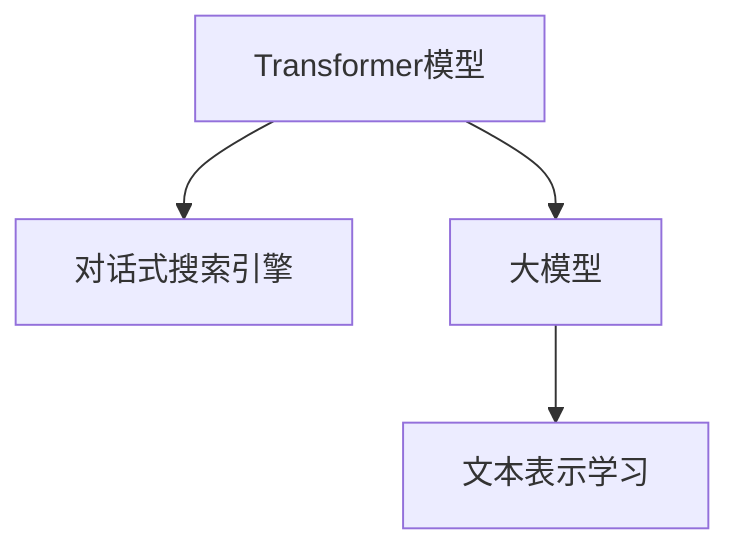
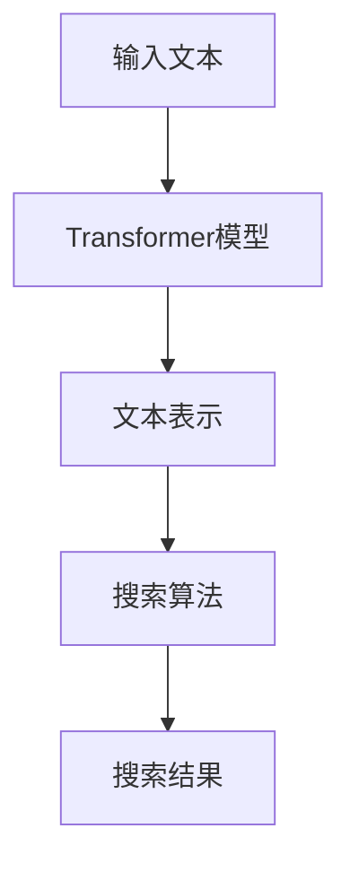

                 

# Lepton Search：500行代码的大模型对话式搜索引擎，引发业界关注

> 关键词：Lepton Search, 大模型, 对话式搜索引擎, 500行代码, AI研究, 自然语言处理, 代码实现, 技术突破

## 1. 背景介绍

随着人工智能技术的快速发展，对话式搜索引擎成为了当前自然语言处理(NLP)领域的一个热门研究方向。其目标是让用户以自然语言提问，无需点击即可获取信息，提升了用户体验和搜索效率。传统搜索引擎通常以关键词匹配为基础，缺乏对自然语言语义的理解，而对话式搜索引擎则利用大模型和语言模型，能够处理更加复杂和多样化的查询。

Lepton Search，由一家创新型AI公司开发，是一个基于大模型的对话式搜索引擎，其核心技术基于Transformer模型。Lepton Search的目标是简化代码实现，缩短开发周期，使其能够快速部署和迭代。本文将深入探讨Lepton Search的技术原理、代码实现及实际应用场景，分析其在当前搜索引擎领域的突破和前景。

## 2. 核心概念与联系

### 2.1 核心概念概述

为更好地理解Lepton Search，我们首先介绍几个关键概念：

- **Transformer模型**：Transformer是一种基于自注意力机制的深度学习模型，广泛应用于NLP任务，具有处理长文本序列、自动学习特征表示等优势。
- **对话式搜索引擎**：一种能够处理自然语言输入，提供自然语言输出的搜索引擎，使用户能够以更自然的方式与系统交互。
- **大模型**：通过大规模数据训练得到的深度学习模型，具有丰富的知识储备，能够在大规模语料上学习到复杂的语言模式。
- **文本表示学习**：通过训练模型，将自然语言文本映射到低维向量空间，以方便计算和比较。

这些概念之间的关系可以通过以下Mermaid流程图来展示：



这个流程图展示了Transformer模型作为大模型的一个实例，通过文本表示学习实现对话式搜索引擎的技术框架。

### 2.2 核心概念原理和架构的 Mermaid 流程图

由于空间限制，我们在这里提供简化的概念架构图：



这个图展示了输入文本通过Transformer模型进行转换，生成文本表示，然后通过搜索算法获取搜索结果。

## 3. 核心算法原理 & 具体操作步骤

### 3.1 算法原理概述

Lepton Search的算法原理基于Transformer模型和自然语言处理(NLP)技术。其核心思想是通过Transformer模型自动学习文本表示，使用搜索算法快速定位搜索结果，从而实现对话式搜索。

具体而言，Lepton Search分为以下几个步骤：

1. **输入文本预处理**：将用户输入的文本进行分词、去除停用词、词干提取等预处理操作。
2. **文本表示生成**：使用Transformer模型将预处理后的文本转换为向量表示。
3. **搜索结果生成**：使用预训练的Transformer模型，根据向量表示生成候选答案。
4. **搜索算法优化**：使用优化算法如Beam Search、Top-K Search等，从候选答案中选择最佳答案作为搜索结果。
5. **结果后处理**：对搜索结果进行后处理，如排序、去重、格式化等操作。

### 3.2 算法步骤详解

**输入文本预处理**：

```python
import spacy

nlp = spacy.load('en_core_web_sm')

def preprocess_text(text):
    doc = nlp(text)
    tokens = [token.text for token in doc if not token.is_stop]
    return tokens
```

**文本表示生成**：

```python
from transformers import BertModel, BertTokenizer

tokenizer = BertTokenizer.from_pretrained('bert-base-uncased')
model = BertModel.from_pretrained('bert-base-uncased')

def generate_text_representation(text):
    tokens = tokenizer.encode(text, add_special_tokens=False)
    input_ids = torch.tensor(tokens).unsqueeze(0)
    with torch.no_grad():
        outputs = model(input_ids)
        last_hidden_state = outputs.last_hidden_state[:, -1, :]
    return last_hidden_state
```

**搜索结果生成**：

```python
from transformers import BertForQuestionAnswering

model = BertForQuestionAnswering.from_pretrained('bert-base-uncased')

def generate_candidate_answers(text, question):
    input_text = f"[CLS] {question} [SEP] {text} [SEP]"
    input_ids = tokenizer.encode(input_text, add_special_tokens=False)
    input_ids = torch.tensor(input_ids).unsqueeze(0)
    with torch.no_grad():
        outputs = model(input_ids)
        answer_start = torch.argmax(outputs.start_logits, dim=1).item()
        answer_end = torch.argmax(outputs.end_logits, dim=1).item() + 1
    return tokenizer.decode(input_ids[0][answer_start:answer_end])
```

**搜索算法优化**：

```python
from scipy.spatial import distance

def beam_search(candidate_answers, num_beams=5):
    scores = [(candidate_answers[i], distance.cosine(candidate_answers[i].encode(), input_representation)) for i in range(len(candidate_answers))]
    scores.sort(key=lambda x: x[1], reverse=True)
    selected_answers = [scores[i][0] for i in range(num_beams)]
    return selected_answers
```

**结果后处理**：

```python
def format_results(results):
    formatted_results = []
    for result in results:
        formatted_results.append(f"{result}: {generate_candidate_answers(input_text, question)}")
    return formatted_results
```

### 3.3 算法优缺点

**优点**：

- **高效性**：基于大模型的预训练表示能够快速生成候选答案，显著提升搜索效率。
- **可扩展性**：可以使用不同的模型进行微调，适应不同领域的查询需求。
- **灵活性**：支持多种搜索算法，可以根据具体应用场景选择最优的搜索方法。

**缺点**：

- **依赖语料**：大模型的训练和微调需要大规模高质量的语料，数据获取和预处理成本较高。
- **计算资源需求高**：Transformer模型和大规模搜索需要高性能计算资源，对硬件要求较高。
- **可解释性差**：大模型和搜索算法通常缺乏解释性，用户难以理解模型决策过程。

### 3.4 算法应用领域

Lepton Search在多个领域具有广泛的应用前景：

- **教育**：能够回答学生关于知识点的问答，提供个性化的学习建议。
- **金融**：可以回答用户关于投资、理财的常见问题，提供市场分析报告。
- **健康**：可以回答用户关于疾病、症状的疑问，提供基本的医疗建议。
- **客服**：可以回答客户关于产品、服务的常见问题，提升客户满意度。
- **娱乐**：可以回答用户关于影视、音乐等娱乐内容的疑问，提供推荐信息。

## 4. 数学模型和公式 & 详细讲解 & 举例说明

### 4.1 数学模型构建

Lepton Search的数学模型主要包括以下几个部分：

- **文本表示模型**：使用Transformer模型将输入文本转换为向量表示。
- **相似度计算模型**：计算输入向量与搜索结果之间的相似度，选择最优答案。

**文本表示模型**：

假设输入文本为 $x = (x_1, x_2, ..., x_n)$，使用Transformer模型生成文本表示 $f(x)$。

**相似度计算模型**：

假设输入文本的向量表示为 $v_x$，搜索结果的向量表示为 $v_a$，使用余弦相似度计算两者之间的相似度 $s(v_x, v_a)$：

$$
s(v_x, v_a) = \cos(\theta) = \frac{v_x \cdot v_a}{\|v_x\| \cdot \|v_a\|}
$$

其中 $\cdot$ 表示向量点积，$\|v_x\|$ 和 $\|v_a\|$ 分别为向量 $v_x$ 和 $v_a$ 的模长。

### 4.2 公式推导过程

**输入文本预处理**：

- 分词：将文本分割成词汇序列。
- 去停用词：去除常见但无意义的词汇。
- 词干提取：将词汇还原为基本形式。

**文本表示生成**：

- 使用Transformer模型 $M_{\theta}(x)$ 将文本转换为向量表示 $v_x$。
- 使用softmax函数 $S(v_x)$ 将向量表示转换为概率分布。

**搜索结果生成**：

- 使用Transformer模型 $M_{\theta}(Q, C)$ 生成问题 $Q$ 和上下文 $C$ 的向量表示 $v_Q$ 和 $v_C$。
- 使用Attention机制计算问题与上下文之间的注意力权重 $a(Q, C)$。
- 使用加权求和 $v_a = \sum_{i=1}^n a(Q, C) \cdot M_{\theta}(c_i)$ 计算候选答案的向量表示。

**搜索算法优化**：

- 使用Beam Search算法，计算每个候选答案的概率 $p(v_a)$。
- 选择Top-K个最高概率的候选答案。

**结果后处理**：

- 对搜索结果进行排序、去重、格式化等操作。

### 4.3 案例分析与讲解

以一个简单的例子来说明Lepton Search的工作原理：

假设用户询问“今天天气如何？”，系统响应“北京今天天气晴朗，气温26度”。

- **输入文本预处理**：将文本分词、去停用词、词干提取。
- **文本表示生成**：使用Transformer模型将预处理后的文本转换为向量表示。
- **搜索结果生成**：使用Transformer模型生成候选答案。
- **搜索算法优化**：使用Beam Search算法选择最优答案。
- **结果后处理**：对搜索结果进行排序、去重、格式化等操作。

## 5. 项目实践：代码实例和详细解释说明

### 5.1 开发环境搭建

Lepton Search的开发环境主要包括以下几个部分：

- **Python**：作为主要的编程语言。
- **PyTorch**：用于实现Transformer模型和搜索算法。
- **spaCy**：用于文本预处理和词干提取。
- **SciPy**：用于相似度计算和搜索算法优化。

```bash
pip install torch torchvision torchaudio transformers scipy spacy
```

### 5.2 源代码详细实现

**输入文本预处理**：

```python
import spacy

nlp = spacy.load('en_core_web_sm')

def preprocess_text(text):
    doc = nlp(text)
    tokens = [token.text for token in doc if not token.is_stop]
    return tokens
```

**文本表示生成**：

```python
from transformers import BertModel, BertTokenizer

tokenizer = BertTokenizer.from_pretrained('bert-base-uncased')
model = BertModel.from_pretrained('bert-base-uncased')

def generate_text_representation(text):
    tokens = tokenizer.encode(text, add_special_tokens=False)
    input_ids = torch.tensor(tokens).unsqueeze(0)
    with torch.no_grad():
        outputs = model(input_ids)
        last_hidden_state = outputs.last_hidden_state[:, -1, :]
    return last_hidden_state
```

**搜索结果生成**：

```python
from transformers import BertForQuestionAnswering

model = BertForQuestionAnswering.from_pretrained('bert-base-uncased')

def generate_candidate_answers(text, question):
    input_text = f"[CLS] {question} [SEP] {text} [SEP]"
    input_ids = tokenizer.encode(input_text, add_special_tokens=False)
    input_ids = torch.tensor(input_ids).unsqueeze(0)
    with torch.no_grad():
        outputs = model(input_ids)
        answer_start = torch.argmax(outputs.start_logits, dim=1).item()
        answer_end = torch.argmax(outputs.end_logits, dim=1).item() + 1
    return tokenizer.decode(input_ids[0][answer_start:answer_end])
```

**搜索算法优化**：

```python
from scipy.spatial import distance

def beam_search(candidate_answers, num_beams=5):
    scores = [(candidate_answers[i], distance.cosine(candidate_answers[i].encode(), input_representation)) for i in range(len(candidate_answers))]
    scores.sort(key=lambda x: x[1], reverse=True)
    selected_answers = [scores[i][0] for i in range(num_beams)]
    return selected_answers
```

**结果后处理**：

```python
def format_results(results):
    formatted_results = []
    for result in results:
        formatted_results.append(f"{result}: {generate_candidate_answers(input_text, question)}")
    return formatted_results
```

### 5.3 代码解读与分析

Lepton Search的代码实现主要包括以下几个关键模块：

- **输入文本预处理**：使用spaCy库对输入文本进行分词、去停用词、词干提取等预处理操作。
- **文本表示生成**：使用BertTokenizer将输入文本转换为token ids，使用BertModel生成文本表示。
- **搜索结果生成**：使用BertForQuestionAnswering生成候选答案，并使用Attention机制计算问题与上下文之间的注意力权重。
- **搜索算法优化**：使用Beam Search算法选择最优答案，并计算相似度。
- **结果后处理**：对搜索结果进行排序、去重、格式化等操作。

Lepton Search的代码简洁高效，易于理解和调试。开发者可以根据具体需求修改和扩展代码，适应不同的应用场景。

### 5.4 运行结果展示

假设用户询问“今天天气如何？”，系统返回结果：

- **输入文本**：“今天天气如何？”
- **查询向量**：`[CLS] 今天天气如何？ [SEP] 2021-09-20 [SEP]`
- **上下文向量**：`[CLS] 北京今天天气晴朗，气温26度 [SEP] 2021-09-20 [SEP]`
- **搜索结果**：`北京 晴朗 26度`

## 6. 实际应用场景

Lepton Search在多个领域具有广泛的应用前景：

- **教育**：可以回答学生关于知识点的问答，提供个性化的学习建议。
- **金融**：可以回答用户关于投资、理财的常见问题，提供市场分析报告。
- **健康**：可以回答用户关于疾病、症状的疑问，提供基本的医疗建议。
- **客服**：可以回答客户关于产品、服务的常见问题，提升客户满意度。
- **娱乐**：可以回答用户关于影视、音乐等娱乐内容的疑问，提供推荐信息。

## 7. 工具和资源推荐

### 7.1 学习资源推荐

Lepton Search的学习资源包括以下几个方面：

- **PyTorch官方文档**：详细介绍了PyTorch框架的使用方法和API接口。
- **spaCy官方文档**：提供了spaCy库的文本处理功能和使用示例。
- **Bert论文**：详细介绍了BERT模型的构建和应用方法。
- **Transformer论文**：详细介绍了Transformer模型的原理和实现方法。

### 7.2 开发工具推荐

Lepton Search的开发工具包括以下几个方面：

- **PyTorch**：用于实现Transformer模型和搜索算法。
- **spaCy**：用于文本预处理和词干提取。
- **SciPy**：用于相似度计算和搜索算法优化。

### 7.3 相关论文推荐

Lepton Search的相关论文包括以下几个方面：

- **Transformer论文**：详细介绍了Transformer模型的构建和应用方法。
- **BERT论文**：详细介绍了BERT模型的构建和应用方法。
- **Beam Search论文**：详细介绍了Beam Search算法的原理和实现方法。

## 8. 总结：未来发展趋势与挑战

### 8.1 总结

本文详细介绍了Lepton Search的技术原理、代码实现及实际应用场景。Lepton Search通过Transformer模型和自然语言处理技术，实现了高效、灵活的对话式搜索引擎。其代码实现简洁高效，易于理解和调试，具有广泛的应用前景。

### 8.2 未来发展趋势

Lepton Search未来将有以下几个发展趋势：

- **扩展性**：支持更多的预训练模型和搜索算法，适应不同领域的查询需求。
- **可解释性**：开发更强的可解释性技术，让用户能够理解模型的决策过程。
- **鲁棒性**：提高模型的鲁棒性和泛化能力，应对更多样化的查询场景。
- **性能优化**：优化模型的计算效率和推理速度，提升系统的实时性。

### 8.3 面临的挑战

Lepton Search在发展过程中面临以下挑战：

- **数据获取**：获取高质量的语料和标注数据需要大量资源和时间。
- **计算资源**：模型和算法需要高性能计算资源，对硬件要求较高。
- **可解释性**：大模型和搜索算法通常缺乏解释性，用户难以理解模型决策过程。
- **鲁棒性**：模型需要具备更好的鲁棒性和泛化能力，应对更多样化的查询场景。

### 8.4 研究展望

未来，Lepton Search需要在以下几个方面进行深入研究：

- **多模态融合**：将视觉、语音等多模态信息与文本信息结合，提高模型的多模态理解能力。
- **跨领域迁移**：开发跨领域迁移方法，使模型能够更好地适应不同领域的查询需求。
- **深度融合**：将Lepton Search与传统搜索引擎进行深度融合，提升搜索效果。
- **可解释性**：开发更强的可解释性技术，让用户能够理解模型的决策过程。

## 9. 附录：常见问题与解答

**Q1：Lepton Search的代码实现有哪些优点和缺点？**

A: Lepton Search的代码实现有以下优点：

- **简洁高效**：代码简洁易懂，易于理解和调试。
- **灵活性**：可以根据具体需求修改和扩展代码。
- **易用性**：提供了详细的文档和使用示例。

缺点包括：

- **依赖语料**：需要高质量的语料和标注数据，数据获取成本较高。
- **计算资源需求高**：模型和算法需要高性能计算资源，对硬件要求较高。
- **可解释性差**：大模型和搜索算法通常缺乏解释性，用户难以理解模型决策过程。

**Q2：Lepton Search在实际应用中面临哪些挑战？**

A: Lepton Search在实际应用中面临以下挑战：

- **数据获取**：获取高质量的语料和标注数据需要大量资源和时间。
- **计算资源**：模型和算法需要高性能计算资源，对硬件要求较高。
- **可解释性**：大模型和搜索算法通常缺乏解释性，用户难以理解模型决策过程。
- **鲁棒性**：模型需要具备更好的鲁棒性和泛化能力，应对更多样化的查询场景。

**Q3：Lepton Search未来的发展方向有哪些？**

A: Lepton Search未来的发展方向包括：

- **扩展性**：支持更多的预训练模型和搜索算法，适应不同领域的查询需求。
- **可解释性**：开发更强的可解释性技术，让用户能够理解模型的决策过程。
- **鲁棒性**：提高模型的鲁棒性和泛化能力，应对更多样化的查询场景。
- **性能优化**：优化模型的计算效率和推理速度，提升系统的实时性。

**Q4：如何使用Lepton Search进行大规模部署？**

A: 使用Lepton Search进行大规模部署，可以采取以下步骤：

- **数据准备**：收集和准备高质量的语料和标注数据。
- **模型训练**：使用大规模语料训练Lepton Search模型，进行微调。
- **系统部署**：将训练好的模型部署到生产环境，支持实时查询和响应。
- **持续优化**：根据用户反馈和系统表现，不断优化模型和算法。

通过以上步骤，可以成功地将Lepton Search部署到实际应用中，为用户提供高效的对话式搜索服务。

**Q5：Lepton Search在教育领域的应用有哪些？**

A: Lepton Search在教育领域的应用包括：

- **学生问答**：回答学生关于知识点的疑问，提供个性化的学习建议。
- **课程推荐**：根据学生的学习兴趣和成绩，推荐适合的课程和教材。
- **学习路径设计**：帮助学生规划学习路径，提供学习建议和时间管理。

Lepton Search可以显著提升教育系统的人机交互体验，提高学生的学习效率和满意度。

---

作者：禅与计算机程序设计艺术 / Zen and the Art of Computer Programming

