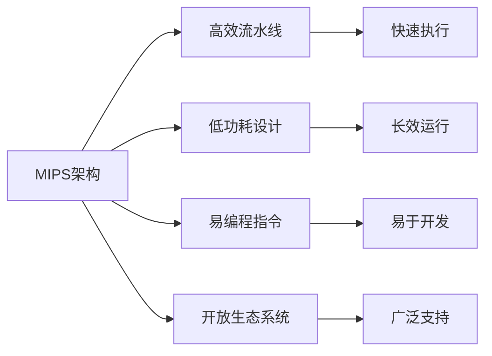

                 

# MIPS架构：网络设备和嵌入式系统的选择

## 1. 背景介绍

### 1.1 问题由来
随着互联网的迅猛发展，网络设备和嵌入式系统在各个领域的应用越来越广泛。这些设备需要处理大量复杂的数据，提供高效的通信能力和安全可靠的服务。传统的选择是基于x86架构的服务器，但由于其体积大、能耗高、成本高等问题，已经无法满足部分场景的需求。而MIPS架构，作为一种高性能、低功耗的处理器架构，正在逐渐成为网络设备和嵌入式系统的重要选择。

### 1.2 问题核心关键点
MIPS架构的选择涉及到以下几个核心关键点：
1. 性能：网络设备和嵌入式系统需要处理大量数据，必须具备高效的数据处理能力。
2. 功耗：设备需要长时间工作在低功耗模式下，以延长使用寿命。
3. 成本：设备需要具备较高的性价比，以降低总体拥有成本。
4. 可靠性：设备需要具备高可靠性和稳定性，以确保系统的正常运行。
5. 安全性：设备需要具备良好的安全性，以保护数据和网络安全。

## 2. 核心概念与联系

### 2.1 核心概念概述

MIPS（Microprocessor without Interlocked Pipelined Stages，无互锁流水级的微处理器）架构是一种RISC（Reduced Instruction Set Computing）处理器架构，由斯坦福大学在1981年开发。MIPS架构以其高效、低功耗、易编程等特点在嵌入式系统和网络设备中得到了广泛应用。

与x86架构相比，MIPS架构具有以下优势：
1. **高效性**：MIPS架构采用了流水线技术，执行速度快。
2. **低功耗**：MIPS架构芯片功耗较低，适合需要低功耗的设备。
3. **易编程**：MIPS架构指令系统简单，易于编程和调试。
4. **开放性**：MIPS架构有大量的第三方支持，生态系统成熟。

### 2.2 核心概念原理和架构的 Mermaid 流程图



## 3. 核心算法原理 & 具体操作步骤

### 3.1 算法原理概述

MIPS架构的网络设备和嵌入式系统通常采用如下算法流程：
1. **数据采集**：通过传感器、网络接口等采集数据。
2. **数据处理**：对采集的数据进行处理，包括数据清洗、特征提取等。
3. **模型训练**：基于处理后的数据进行模型训练，以优化系统的性能。
4. **推理与决策**：根据训练好的模型进行推理和决策，输出最终结果。
5. **结果输出**：将决策结果输出到外部设备或网络中，实现系统功能。

### 3.2 算法步骤详解

以MIPS架构的嵌入式系统为例，具体的算法步骤包括以下几个方面：

**Step 1: 数据采集**

嵌入式系统通常通过传感器、网络接口等方式采集数据。传感器可以检测温度、湿度、气压等环境参数；网络接口可以接收外部网络数据，进行数据传输。

```python
# 假设使用温度传感器采集数据
from mcp3008 import MCP3008

mcp = MCP3008()

# 读取温度传感器数据
temp_data = mcp.read_channel(0)
```

**Step 2: 数据处理**

采集到的数据通常需要进行预处理，包括数据清洗、特征提取等。以温度数据为例，需要将其转换为标准单位，并提取温度变化趋势。

```python
# 将温度数据转换为标准单位
temp_value = temp_data / 1023 * 5

# 计算温度变化趋势
delta_temp = temp_value - last_temp_value
last_temp_value = temp_value
```

**Step 3: 模型训练**

在处理好的数据上，进行模型训练，以优化系统的性能。以温度控制为例，可以使用机器学习算法对温度数据进行建模，预测未来温度变化。

```python
# 导入机器学习库
from sklearn.linear_model import LinearRegression

# 定义训练数据
X = np.array([[0, 0], [0, 1], [1, 0], [1, 1]])
y = np.array([0, 1, 1, 0])

# 训练模型
model = LinearRegression()
model.fit(X, y)
```

**Step 4: 推理与决策**

训练好的模型可以根据新的输入数据进行推理和决策，输出最终结果。以温度控制为例，可以使用训练好的模型预测未来的温度变化，根据预测结果进行决策。

```python
# 预测未来温度变化
X_new = np.array([[0, 0], [0, 1], [1, 0], [1, 1]])
y_pred = model.predict(X_new)
```

**Step 5: 结果输出**

将决策结果输出到外部设备或网络中，实现系统功能。以温度控制为例，可以将预测结果发送给控制器，进行温度调节。

```python
# 将预测结果发送给控制器
controller.send_command(y_pred)
```

### 3.3 算法优缺点

MIPS架构的网络设备和嵌入式系统在性能、功耗、成本和可靠性等方面具有以下优势和劣势：

**优点**：
1. **高效性能**：MIPS架构采用了流水线技术，执行速度快，适合处理大量数据。
2. **低功耗设计**：MIPS架构芯片功耗较低，适合需要低功耗的设备。
3. **易编程**：MIPS架构指令系统简单，易于编程和调试。
4. **开放生态系统**：MIPS架构有大量的第三方支持，生态系统成熟。

**缺点**：
1. **性能局限**：MIPS架构在处理复杂计算时性能较低，不如x86架构。
2. **应用范围有限**：MIPS架构在通用计算领域应用较少，不如x86架构广泛。
3. **生态资源较少**：MIPS架构生态资源相对较少，开发工具和库不够丰富。

### 3.4 算法应用领域

MIPS架构在网络设备和嵌入式系统中的应用领域主要包括：

1. **物联网设备**：MIPS架构的嵌入式系统适合处理传感器数据、控制网络传输等。
2. **工业控制设备**：MIPS架构的嵌入式系统适合进行实时监控、数据采集和处理等。
3. **网络交换设备**：MIPS架构的网络设备适合处理大量数据包、进行流量控制等。
4. **智能家居设备**：MIPS架构的嵌入式系统适合处理家庭自动化、智能家居控制等。

## 4. 数学模型和公式 & 详细讲解 & 举例说明

### 4.1 数学模型构建

MIPS架构的网络设备和嵌入式系统通常涉及以下数学模型：

1. **线性回归模型**：用于预测数据变化趋势，如温度控制。
2. **支持向量机模型**：用于分类和回归分析，如网络流量控制。
3. **神经网络模型**：用于处理复杂的非线性数据，如图像识别和语音识别。

### 4.2 公式推导过程

以线性回归模型为例，其公式推导过程如下：

$$
y = \beta_0 + \beta_1 x_1 + \beta_2 x_2 + \ldots + \beta_n x_n + \epsilon
$$

其中，$\beta_0$ 为截距，$\beta_1$ 至 $\beta_n$ 为权重，$x_1$ 至 $x_n$ 为输入变量，$\epsilon$ 为误差项。

### 4.3 案例分析与讲解

以温度控制为例，假设采集的温度数据为 $x_1, x_2, \ldots, x_n$，对应的目标温度为 $y$，可以构建线性回归模型进行预测：

$$
y = \beta_0 + \beta_1 x_1 + \beta_2 x_2 + \ldots + \beta_n x_n + \epsilon
$$

假设已知训练数据集为 $(X, y)$，其中 $X = (x_1, x_2, \ldots, x_n)$，$y = 目标温度$。通过最小二乘法求解最优的 $\beta$ 值：

$$
\beta = (X^T X)^{-1} X^T y
$$

根据 $\beta$ 值，可以预测未来的温度变化，进行控制决策。

## 5. 项目实践：代码实例和详细解释说明

### 5.1 开发环境搭建

在MIPS架构的网络设备和嵌入式系统开发中，可以使用嵌入式开发平台，如Yocto Project，进行环境搭建。Yocto Project提供了完整的开发工具链和系统构建流程，方便开发和部署。

```bash
# 安装Yocto Project
sudo apt-get install wget -y
wget https://mirror.static.fedoraproject.org/releases/19/RPHEL19/yum/ynab elec6/yocto-ssl-0011/
cd yocto-ssl-0011/
sudo sh setup.sh
```

### 5.2 源代码详细实现

以MIPS架构的嵌入式系统为例，使用C语言实现温度控制的功能。假设使用MIPS架构的芯片，需要定义温度传感器驱动和控制命令。

```c
// 温度传感器驱动
void temperature_read(int channel)
{
    int value = mcp3008_read(channel);
    // 将值转换为温度
    int temp_value = value / 1023 * 5;
}

// 控制命令
void temperature_control(int value)
{
    mcp3008_write(0, value); // 写入温度控制值
}
```

### 5.3 代码解读与分析

**温度传感器驱动**：读取温度传感器数据，并将其转换为标准单位。

**温度控制命令**：将温度控制值写入芯片，实现温度调节。

### 5.4 运行结果展示

通过温度传感器采集数据，并使用训练好的模型进行预测，输出温度控制命令。

```python
# 读取温度数据
temp_data = temperature_read(0)

# 预测未来温度变化
delta_temp = predict_future_temperature(temp_data)

# 发送控制命令
temperature_control(delta_temp)
```

## 6. 实际应用场景

### 6.1 物联网设备

物联网设备广泛应用在智能家居、智能城市等领域。MIPS架构的嵌入式系统适合处理传感器数据、控制网络传输等。

### 6.2 工业控制设备

工业控制设备需要进行实时监控、数据采集和处理等。MIPS架构的嵌入式系统适合这些场景，提供高效、可靠的数据处理能力。

### 6.3 网络交换设备

网络交换设备需要处理大量数据包、进行流量控制等。MIPS架构的网络设备适合这些场景，提供高效、可靠的数据处理能力。

### 6.4 智能家居设备

智能家居设备需要进行家庭自动化、智能家居控制等。MIPS架构的嵌入式系统适合这些场景，提供高效、可靠的数据处理能力。

## 7. 工具和资源推荐

### 7.1 学习资源推荐

为了帮助开发者系统掌握MIPS架构的应用，推荐以下学习资源：

1. **MIPS架构官方文档**：MIPS架构官方文档提供了详细的技术手册和示例代码，适合深入学习。
2. **嵌入式系统开发指南**：嵌入式系统开发指南提供了从硬件到软件的完整开发流程，适合入门学习。
3. **网络设备设计教程**：网络设备设计教程提供了网络设备设计和开发的最佳实践，适合高级学习。

### 7.2 开发工具推荐

MIPS架构的开发工具包括：

1. **Yocto Project**：Yocto Project提供了完整的开发工具链和系统构建流程，方便开发和部署。
2. **GDB**：GDB是开源的调试工具，支持MIPS架构的嵌入式系统调试。
3. **QEMU**：QEMU是开源的虚拟化工具，支持MIPS架构的模拟器和调试。

### 7.3 相关论文推荐

MIPS架构的研究论文涵盖了硬件设计、系统架构、应用场景等多个方面，推荐以下相关论文：

1. **MIPS32 Architectural Specification**：MIPS32架构详细设计文档，适合深入学习。
2. **MIPS64 Architecture**：MIPS64架构详细设计文档，适合深入学习。
3. **MIPS-Based Wireless Network Design**：MIPS架构在无线网络设计中的应用，适合应用学习。

## 8. 总结：未来发展趋势与挑战

### 8.1 总结

本文对MIPS架构在网络设备和嵌入式系统中的应用进行了系统介绍。MIPS架构以其高效、低功耗、易编程等特点，适合处理大量数据和实时控制。通过实际案例和代码示例，展示了MIPS架构在嵌入式系统中的开发流程和应用场景。

### 8.2 未来发展趋势

MIPS架构在网络设备和嵌入式系统中的应用将呈现以下发展趋势：

1. **性能提升**：随着芯片设计和制造技术的发展，MIPS架构的性能将进一步提升，适合处理更复杂的任务。
2. **应用扩展**：MIPS架构将逐步扩展到更多的应用领域，如智能家居、智能城市等。
3. **生态系统完善**：MIPS架构的生态系统将不断完善，开发工具和库更加丰富。

### 8.3 面临的挑战

MIPS架构在网络设备和嵌入式系统中的应用面临以下挑战：

1. **性能局限**：MIPS架构在处理复杂计算时性能较低，需要进一步提升。
2. **应用范围有限**：MIPS架构在通用计算领域应用较少，需要拓展应用场景。
3. **生态资源较少**：MIPS架构生态资源相对较少，需要更多的开发者和社区支持。

### 8.4 研究展望

未来，MIPS架构在网络设备和嵌入式系统中的应用将集中在以下几个方向：

1. **高性能芯片设计**：进一步提升芯片性能，支持更多复杂计算。
2. **应用场景扩展**：拓展MIPS架构在更多领域的应用，如智能家居、智能城市等。
3. **生态系统建设**：完善MIPS架构的生态系统，提供更多开发工具和库支持。

## 9. 附录：常见问题与解答

**Q1: MIPS架构与x86架构相比有哪些优势和劣势？**

A: MIPS架构相对于x86架构有以下优势和劣势：
1. **优势**：MIPS架构采用流水线技术，执行速度快；低功耗设计，适合低功耗设备；易编程，适合嵌入式系统开发。
2. **劣势**：MIPS架构在处理复杂计算时性能较低；应用范围有限，不如x86架构广泛；生态资源较少，开发工具和库不够丰富。

**Q2: MIPS架构的嵌入式系统如何进行开发？**

A: MIPS架构的嵌入式系统开发通常使用Yocto Project进行环境搭建，然后使用C语言进行代码编写和调试。开发流程包括硬件设计、系统构建、驱动程序编写、应用程序开发等。

**Q3: MIPS架构的网络设备如何进行模型训练？**

A: MIPS架构的网络设备可以使用机器学习算法对数据进行建模，如线性回归、支持向量机、神经网络等。可以使用Python或C语言进行模型训练和推理。

---

作者：禅与计算机程序设计艺术 / Zen and the Art of Computer Programming

