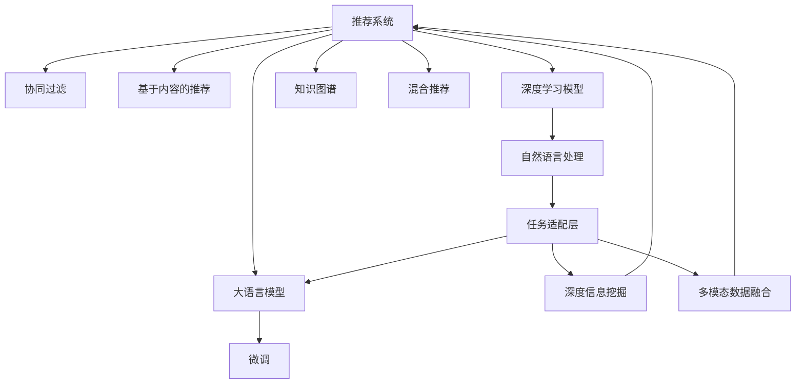

                 

# NLP技术在推荐系统的应用：大模型的潜力

> 关键词：推荐系统,自然语言处理(NLP),大语言模型,知识图谱,混合推荐,深度学习,模型融合

## 1. 背景介绍

### 1.1 问题由来

推荐系统是电子商务、在线视频、社交网络等领域广泛应用的核心技术。通过分析用户的兴趣、历史行为等数据，推荐系统能够预测用户可能感兴趣的物品，提高用户体验，驱动用户消费。然而，传统的协同过滤、基于内容的推荐等方法往往难以应对多模态、动态变化、稀疏数据等复杂场景，亟需新范式的推荐技术。

近年来，随着自然语言处理(NLP)技术的快速发展，大语言模型被引入推荐系统中，成为推荐系统新一轮升级的重要推动力。大语言模型通过大规模无标签文本语料的预训练，学习到了丰富的语言知识，可以更好地捕捉用户的自然语言表达，从而提升推荐系统的效果。

### 1.2 问题核心关键点

将大语言模型引入推荐系统，涉及以下几个核心关键点：
1. 如何通过微调和大模型对预训练模型进行知识增强。
2. 如何设计高效的任务适配层以实现任务特定的推荐功能。
3. 如何利用大模型的语言理解能力进行深度信息挖掘。
4. 如何结合多模态数据构建更全面、准确的用户画像。
5. 如何优化推理计算，提升推荐系统响应速度。

这些关键点构成了一个完整的推荐系统框架，使得大语言模型能够充分发挥其语言处理能力，辅助推荐系统实现更好的效果。

### 1.3 问题研究意义

将NLP技术引入推荐系统，可以带来以下几个方面的显著提升：

1. **提高推荐质量**：大语言模型能够理解自然语言描述，提取更丰富的用户需求和物品属性信息，从而提升推荐质量。
2. **拓展推荐边界**：推荐系统可以处理更多场景的推荐需求，如文本推荐、多模态推荐等，不再局限于传统的图片、视频推荐。
3. **增强系统可解释性**：大语言模型可以提供推荐结果的解释，增强系统的透明性和可信度。
4. **提升用户满意度**：通过理解用户自然语言反馈，推荐系统可以更加贴近用户需求，提高用户满意度。
5. **降低运营成本**：大语言模型可以自动化处理自然语言数据，减轻人工标注、处理的工作量，降低运营成本。

## 2. 核心概念与联系

### 2.1 核心概念概述

为更好地理解NLP技术在推荐系统中的应用，本节将介绍几个关键概念：

- **推荐系统(Recommender System)**：通过分析用户行为数据，预测用户可能感兴趣的商品、内容等，辅助用户决策的系统。
- **协同过滤(Collaborative Filtering)**：基于用户的历史行为数据和物品特征进行推荐，适用于用户行为稀疏的情况。
- **基于内容的推荐(Content-based Recommendation)**：通过分析物品的描述、标签等信息，与用户兴趣进行匹配推荐。
- **深度学习模型(Deep Learning Model)**：利用神经网络模型进行推荐，可以处理非结构化数据，适用于复杂推荐场景。
- **知识图谱(Knowledge Graph)**：通过结构化的知识表示，关联不同数据源，提升推荐系统的全面性和准确性。
- **混合推荐(Mixed Recommendation)**：结合多种推荐算法，综合多维信息进行推荐，提升推荐效果。
- **大语言模型(Large Language Model)**：通过大规模无标签文本数据预训练，具备丰富的语言知识和表示能力。
- **微调(Fine-tuning)**：在预训练模型基础上，通过下游任务数据进行微调，优化模型在该任务上的性能。

这些核心概念之间的逻辑关系可以通过以下Mermaid流程图来展示：



这个流程图展示了大语言模型在推荐系统中的应用框架：

1. 推荐系统可以基于多种推荐算法构建，包括协同过滤、内容推荐等。
2. 深度学习模型是其中一种重要技术，通过神经网络进行推荐。
3. 自然语言处理技术可以处理非结构化文本数据，抽取用户兴趣和物品属性。
4. 大语言模型通过预训练学习广泛的语言知识，提供更为全面、准确的自然语言理解。
5. 微调技术可以将大语言模型的语言知识与推荐任务相结合，提升推荐效果。
6. 任务适配层设计了特定的推荐输出，如多模态数据融合、深度信息挖掘等。
7. 最终，多维度信息通过混合推荐系统进行综合，完成推荐。

这些概念共同构成了推荐系统的基本框架，使得大语言模型能够更好地应用于推荐场景中。

## 3. 核心算法原理 & 具体操作步骤
### 3.1 算法原理概述

大语言模型在推荐系统中的应用，主要基于微调技术。其核心思想是：将预训练的大语言模型作为特征提取器，通过微调优化模型输出，以更好地适应推荐任务。

具体而言，推荐系统通常包括两个关键部分：
1. **用户画像建模**：通过分析用户行为、反馈等数据，构建用户兴趣和偏好的模型。
2. **物品推荐**：根据用户画像模型和物品属性特征，预测用户可能感兴趣的物品。

在用户画像建模部分，大语言模型可以用于处理用户自然语言反馈，提取更全面的用户需求。例如，用户可以在推荐系统中输入自然语言描述自己的需求，大语言模型能够理解这些描述，抽取关键信息，构建用户画像。

在物品推荐部分，大语言模型可以用于处理物品描述、标签等信息，抽取物品特征。例如，对于推荐新闻文章的系统，大语言模型可以分析文章标题、摘要等文本信息，提取文章的主题、风格、作者等信息，与用户画像进行匹配，预测用户可能感兴趣的文章。

### 3.2 算法步骤详解

基于大语言模型的推荐系统通常包括以下几个关键步骤：

**Step 1: 准备数据集**
- 收集用户的自然语言反馈和物品属性特征。
- 将自然语言反馈转化为结构化数据，以便大语言模型处理。
- 准备物品的属性特征，如标签、作者、主题等。

**Step 2: 构建预训练模型**
- 选择合适的预训练语言模型，如BERT、GPT等。
- 在大量无标签文本语料上进行预训练，学习语言的通用表示。

**Step 3: 微调任务适配层**
- 根据推荐任务，设计合适的输出层和损失函数。
- 对于分类任务，通常使用交叉熵损失。
- 对于生成任务，通常使用负对数似然损失。

**Step 4: 微调模型参数**
- 使用训练集数据进行微调，最小化损失函数。
- 设置合适的学习率和优化算法，如AdamW、SGD等。
- 使用正则化技术，如L2正则、Dropout等，避免过拟合。
- 考虑参数高效微调(PEFT)，只更新与推荐任务相关的参数。

**Step 5: 测试和评估**
- 在验证集和测试集上评估微调后的推荐模型性能。
- 使用AUC、P@K等指标评估模型效果。
- 根据评估结果调整模型超参数和微调策略。

**Step 6: 部署与优化**
- 将微调后的模型集成到推荐系统中，进行实时推荐。
- 考虑模型的推理效率，进行模型裁剪、量化加速等优化。
- 持续收集新数据，定期重新微调模型，以适应数据分布的变化。

以上是基于大语言模型的推荐系统微调的一般流程。在实际应用中，还需要根据具体任务的特点，对微调过程进行优化设计，如改进训练目标函数、引入更多的正则化技术等，以进一步提升模型性能。

### 3.3 算法优缺点

基于大语言模型的推荐系统具有以下优点：
1. **处理非结构化数据**：大语言模型能够处理自然语言数据，提升推荐系统对复杂语义的捕捉能力。
2. **捕捉用户深度需求**：通过自然语言处理，大语言模型可以理解用户的自然语言描述，抽取更全面的用户需求。
3. **适应多模态数据**：结合图像、视频等多模态数据，提升推荐系统的全面性和准确性。
4. **支持个性化推荐**：通过深度学习模型，大语言模型可以处理非结构化数据，提升推荐系统的个性化程度。

同时，该方法也存在一定的局限性：
1. **数据获取难度大**：自然语言数据和物品属性特征的获取难度较大，尤其是在大规模推荐系统上。
2. **模型训练复杂**：大语言模型的参数量较大，训练复杂度较高，需要高性能计算资源。
3. **鲁棒性有待提高**：大语言模型对输入噪声、数据分布变化敏感，需要进一步提升鲁棒性。
4. **可解释性不足**：推荐结果的解释性不足，难以理解模型的决策机制。
5. **公平性问题**：推荐系统可能存在公平性问题，如推荐偏向某一类用户或物品。

尽管存在这些局限性，但就目前而言，基于大语言模型的推荐系统仍是推荐技术发展的重要方向。未来相关研究的重点在于如何进一步降低数据获取成本，提高模型鲁棒性，增强系统的可解释性和公平性，从而推动推荐系统向更加智能化、普适化方向发展。

### 3.4 算法应用领域

基于大语言模型的推荐系统在多个领域得到了广泛应用，例如：

- **电商推荐**：电商平台使用大语言模型分析用户评价、商品描述等文本信息，进行商品推荐。
- **新闻推荐**：新闻聚合应用使用大语言模型分析新闻标题、摘要等文本信息，推荐相关文章。
- **视频推荐**：视频平台使用大语言模型分析视频描述、标签等信息，推荐相关视频。
- **社交网络**：社交媒体使用大语言模型分析用户评论、内容等信息，推荐相关帖子。
- **音乐推荐**：音乐平台使用大语言模型分析歌词、歌手信息等文本数据，推荐音乐作品。

除了这些经典应用外，大语言模型还被创新性地应用于更多场景中，如可控文本生成、多模态推荐、动态内容推荐等，为推荐系统带来了新的突破。随着大语言模型的不断演进，相信推荐系统将会在更广泛的领域得到应用，提升用户体验，驱动消费增长。

## 4. 数学模型和公式 & 详细讲解  
### 4.1 数学模型构建

本节将使用数学语言对基于大语言模型的推荐系统进行更加严格的刻画。

记推荐系统中的用户画像模型为 $U_{\theta}$，物品属性特征为 $I_{\phi}$，其中 $\theta$ 和 $\phi$ 为模型参数。假设推荐任务为二分类任务，即预测用户是否会点击物品。则推荐系统可以表示为：

$$
Y = U_{\theta} \otimes I_{\phi}
$$

其中 $\otimes$ 表示模型的综合输出，可以是一个点积、相似度、加权和等形式的组合。

定义推荐系统在训练集上的经验风险为：

$$
\mathcal{L}(\theta, \phi) = -\frac{1}{N}\sum_{i=1}^N \log \sigma(Y_i)
$$

其中 $Y_i$ 表示第 $i$ 个样本的预测结果，$\sigma$ 为sigmoid函数，$\frac{1}{N}$ 为平均损失。

微调的优化目标是最小化经验风险，即找到最优参数：

$$
(\theta^*, \phi^*) = \mathop{\arg\min}_{\theta, \phi} \mathcal{L}(\theta, \phi)
$$

在得到损失函数后，即可带入优化算法进行模型训练，优化参数 $\theta$ 和 $\phi$。

### 4.2 公式推导过程

以下我们以新闻推荐为例，推导交叉熵损失函数及其梯度的计算公式。

假设推荐系统使用大语言模型处理新闻标题，输出用户点击的概率。假设模型在输入新闻标题 $x_i$ 上的输出为 $\hat{y}_i=M_{\theta}(x_i)$，表示用户点击新闻的概率。真实标签 $y_i \in \{0,1\}$。则二分类交叉熵损失函数定义为：

$$
\ell(M_{\theta}(x_i),y_i) = -[y_i\log \hat{y}_i + (1-y_i)\log (1-\hat{y}_i)]
$$

将其代入经验风险公式，得：

$$
\mathcal{L}(\theta) = -\frac{1}{N}\sum_{i=1}^N [y_i\log M_{\theta}(x_i)+(1-y_i)\log(1-M_{\theta}(x_i))]
$$

根据链式法则，损失函数对参数 $\theta_k$ 的梯度为：

$$
\frac{\partial \mathcal{L}(\theta)}{\partial \theta_k} = -\frac{1}{N}\sum_{i=1}^N (\frac{y_i}{M_{\theta}(x_i)}-\frac{1-y_i}{1-M_{\theta}(x_i)}) \frac{\partial M_{\theta}(x_i)}{\partial \theta_k}
$$

其中 $\frac{\partial M_{\theta}(x_i)}{\partial \theta_k}$ 可进一步递归展开，利用自动微分技术完成计算。

在得到损失函数的梯度后，即可带入优化算法进行模型训练，优化参数 $\theta$。重复上述过程直至收敛，最终得到适应新闻推荐任务的最优模型参数 $\theta^*$。

## 5. 项目实践：代码实例和详细解释说明
### 5.1 开发环境搭建

在进行推荐系统开发前，我们需要准备好开发环境。以下是使用Python进行TensorFlow开发的环境配置流程：

1. 安装Anaconda：从官网下载并安装Anaconda，用于创建独立的Python环境。

2. 创建并激活虚拟环境：
```bash
conda create -n tf-env python=3.8 
conda activate tf-env
```

3. 安装TensorFlow：根据CUDA版本，从官网获取对应的安装命令。例如：
```bash
conda install tensorflow -c pytorch -c conda-forge
```

4. 安装各类工具包：
```bash
pip install numpy pandas scikit-learn matplotlib tqdm jupyter notebook ipython
```

完成上述步骤后，即可在`tf-env`环境中开始推荐系统开发。

### 5.2 源代码详细实现

下面我们以新闻推荐为例，给出使用TensorFlow进行推荐系统微调的代码实现。

首先，定义新闻推荐的任务适配层：

```python
import tensorflow as tf

class NewsRecommender(tf.keras.Model):
    def __init__(self, vocab_size, embedding_dim, hidden_units, output_dim):
        super(NewsRecommender, self).__init__()
        self.embedding = tf.keras.layers.Embedding(vocab_size, embedding_dim)
        self.fc1 = tf.keras.layers.Dense(hidden_units, activation='relu')
        self.fc2 = tf.keras.layers.Dense(output_dim, activation='sigmoid')

    def call(self, inputs):
        x = self.embedding(inputs)
        x = self.fc1(x)
        x = self.fc2(x)
        return x
```

然后，定义推荐模型的训练函数：

```python
def train_model(model, train_dataset, epochs, batch_size):
    model.compile(optimizer='adam', loss='binary_crossentropy', metrics=['accuracy'])
    model.fit(train_dataset, epochs=epochs, batch_size=batch_size, validation_data=val_dataset)
    return model
```

最后，启动训练流程并在测试集上评估：

```python
vocab_size = 10000
embedding_dim = 100
hidden_units = 128
output_dim = 1
model = NewsRecommender(vocab_size, embedding_dim, hidden_units, output_dim)

train_dataset = preprocess(train_data)
val_dataset = preprocess(val_data)
test_dataset = preprocess(test_data)

model = train_model(model, train_dataset, epochs=10, batch_size=32)
test_loss, test_acc = model.evaluate(test_dataset)
print(f'Test loss: {test_loss:.4f}, Test accuracy: {test_acc:.4f}')
```

以上就是使用TensorFlow对新闻推荐系统进行微调的完整代码实现。可以看到，TensorFlow提供了丰富的层和优化器，可以方便地构建推荐系统模型并进行微调。

### 5.3 代码解读与分析

让我们再详细解读一下关键代码的实现细节：

**NewsRecommender类**：
- `__init__`方法：初始化模型的嵌入层、全连接层和输出层。
- `call`方法：定义模型的前向传播过程。首先通过嵌入层将输入转换为向量表示，然后通过全连接层进行特征提取，最后通过输出层得到最终的预测概率。

**train_model函数**：
- `compile`方法：配置模型的优化器、损失函数和评价指标。
- `fit`方法：在训练集上训练模型，并使用验证集评估模型性能。

**训练流程**：
- 定义模型的参数，如词汇表大小、嵌入维度、隐藏单元数、输出维度等。
- 使用`NewsRecommender`类构建推荐模型。
- 对训练数据和验证数据进行预处理，使用`preprocess`函数将文本转化为模型可接受的输入格式。
- 使用`train_model`函数训练模型，并设置训练轮数和批量大小。
- 在测试集上评估模型性能，输出损失和准确率。

可以看到，TensorFlow提供了一个非常灵活的框架，使得推荐系统的微调实现变得简洁高效。开发者可以根据具体任务需求，灵活调整模型的层数、参数等超参数，进行模型优化。

当然，工业级的系统实现还需考虑更多因素，如模型的保存和部署、超参数的自动搜索、更灵活的任务适配层等。但核心的微调范式基本与此类似。

## 6. 实际应用场景
### 6.1 智能推荐系统

基于大语言模型的推荐系统，已经广泛应用于各大电商平台的商品推荐、新闻聚合平台的文章推荐等场景。这些推荐系统通过大语言模型的自然语言处理能力，能够处理用户自然语言反馈，抽取更全面的用户需求和物品属性，从而提升推荐质量。

在技术实现上，大语言模型可以用于分析用户评价、商品描述等文本信息，提取关键词和情感倾向，构建用户画像。同时，大语言模型可以分析物品的标题、摘要等文本信息，提取物品特征，与用户画像进行匹配，进行推荐。如此构建的推荐系统，可以更好地理解用户需求，推荐更符合用户期望的商品和内容。

### 6.2 多模态推荐系统

多模态推荐系统结合了文本、图片、视频等多模态数据，能够更好地捕捉用户的全面需求。在大语言模型的帮助下，多模态推荐系统可以从多种数据源中提取信息，提升推荐的全面性和准确性。

例如，对于推荐视频系统，大语言模型可以分析视频描述、标签等信息，抽取视频主题、风格等信息，与用户画像进行匹配，推荐相关视频。同时，大语言模型还可以处理视频评论、用户评分等文本数据，分析用户的情感倾向和偏好，进一步提升推荐效果。

### 6.3 个性化推荐系统

个性化推荐系统通过分析用户的浏览、点击、评分等行为数据，推荐用户可能感兴趣的商品或内容。在大语言模型的帮助下，个性化推荐系统可以更全面地理解用户需求，推荐更符合用户期望的商品或内容。

例如，对于推荐图书系统，大语言模型可以分析书籍的摘要、章节、作者等信息，抽取书籍主题、风格等信息，与用户画像进行匹配，推荐相关书籍。同时，大语言模型还可以处理用户的阅读反馈、评论等文本数据，分析用户的偏好和需求，进一步提升推荐效果。

### 6.4 未来应用展望

随着大语言模型的不断演进，基于大语言模型的推荐系统将呈现以下几个发展趋势：

1. **处理更多模态数据**：推荐系统将越来越多地处理文本、图片、视频等多模态数据，提升推荐系统的全面性和准确性。
2. **结合知识图谱**：推荐系统将结合结构化的知识表示，关联不同数据源，提升推荐系统的全面性和准确性。
3. **引入因果推断**：推荐系统将引入因果推断方法，理解用户行为背后的因果关系，提升推荐的可信性和可解释性。
4. **支持多任务学习**：推荐系统将支持多任务学习，同时优化多个推荐任务，提升推荐系统的综合性能。
5. **实现实时推荐**：推荐系统将实现实时推荐，根据用户实时行为数据进行动态推荐，提升用户体验。
6. **引入对抗学习**：推荐系统将引入对抗学习，增强模型的鲁棒性和泛化能力，提升推荐系统的稳定性和安全性。

以上趋势凸显了大语言模型在推荐系统中的巨大潜力。这些方向的探索发展，必将进一步提升推荐系统的性能和应用范围，为用户带来更好的服务体验。

## 7. 工具和资源推荐
### 7.1 学习资源推荐

为了帮助开发者系统掌握大语言模型在推荐系统中的应用，这里推荐一些优质的学习资源：

1. 《深度学习推荐系统》课程：斯坦福大学开设的深度学习推荐系统课程，涵盖推荐系统的基本概念、经典算法和深度学习应用。

2. 《Recommender Systems in Industry》书籍：亚马逊和Netflix等公司合作的书籍，详细介绍了推荐系统在工业界的应用和实践。

3. 《Neural Recommendation Systems》书籍：谷歌出版的深度学习推荐系统书籍，介绍了基于深度学习推荐系统的设计与实现。

4. 《Recommender Systems: An Introduction》书籍：经典的推荐系统教材，介绍了推荐系统的基本概念、算法和应用。

5. Weights & Biases：模型训练的实验跟踪工具，可以记录和可视化模型训练过程中的各项指标，方便对比和调优。

6. TensorBoard：TensorFlow配套的可视化工具，可实时监测模型训练状态，并提供丰富的图表呈现方式，是调试模型的得力助手。

通过对这些资源的学习实践，相信你一定能够快速掌握大语言模型在推荐系统中的应用，并用于解决实际的推荐问题。

### 7.2 开发工具推荐

高效的开发离不开优秀的工具支持。以下是几款用于推荐系统开发的常用工具：

1. TensorFlow：基于Python的开源深度学习框架，灵活动态的计算图，适合快速迭代研究。同样有丰富的推荐系统资源。

2. PyTorch：基于Python的开源深度学习框架，灵活性高，适合科研和生产部署。

3. Scikit-learn：简单易用的机器学习库，提供了多种算法实现，适合数据处理和特征提取。

4. Hadoop/Spark：分布式计算框架，可以处理大规模数据，适合大规模推荐系统开发。

5. Elasticsearch：搜索引擎，可以高效处理文本数据，适合实时推荐系统构建。

6. Redis：内存数据库，可以高效处理实时数据，适合实时推荐系统构建。

合理利用这些工具，可以显著提升推荐系统的开发效率，加快创新迭代的步伐。

### 7.3 相关论文推荐

大语言模型在推荐系统中的应用源于学界的持续研究。以下是几篇奠基性的相关论文，推荐阅读：

1. Dive into Deep Learning for Recommender Systems（深度学习在推荐系统中的应用）：介绍了基于深度学习的推荐系统，包括全连接网络、卷积神经网络、循环神经网络等架构。

2. A Neural Attention Model for Dynamic Textual Recommendations（基于注意力的动态文本推荐模型）：提出基于注意力机制的推荐模型，可以处理动态文本数据，提升推荐效果。

3. Hierarchical Attention Networks for Document Recommendation（文档推荐中的层次化注意力网络）：提出层次化注意力网络，用于处理文档推荐任务，提升了推荐的准确性和可解释性。

4. Cross-domain Knowledge Graph Embedding for Recommendation Systems（跨领域的知识图谱嵌入推荐系统）：提出跨领域的知识图谱嵌入方法，用于处理跨领域推荐任务，提升了推荐的全面性和准确性。

5. Attention-based Recommender System with Controllable Contexts（基于注意力机制的推荐系统）：提出基于注意力机制的推荐系统，可以处理多模态数据，提升推荐的全面性和准确性。

这些论文代表了大语言模型在推荐系统中的发展脉络。通过学习这些前沿成果，可以帮助研究者把握学科前进方向，激发更多的创新灵感。

## 8. 总结：未来发展趋势与挑战

### 8.1 总结

本文对基于大语言模型的推荐系统进行了全面系统的介绍。首先阐述了大语言模型和推荐系统研究的背景和意义，明确了微调在拓展预训练模型应用、提升推荐系统性能方面的独特价值。其次，从原理到实践，详细讲解了推荐系统的数学模型和微调方法，给出了推荐系统开发的完整代码实例。同时，本文还广泛探讨了推荐系统在电商、新闻、视频等多个领域的应用前景，展示了微调范式的巨大潜力。最后，本文精选了推荐系统的学习资源、开发工具和相关论文，力求为开发者提供全方位的技术指引。

通过本文的系统梳理，可以看到，基于大语言模型的推荐系统正在成为推荐技术发展的重要方向，极大地拓展了推荐系统的应用边界，催生了更多的落地场景。得益于大规模语料的预训练，推荐系统能够更好地理解用户需求，推荐更符合用户期望的商品或内容，为用户的消费体验和满意度提供了有力保障。未来，伴随大语言模型和微调方法的持续演进，相信推荐系统必将在更广泛的领域得到应用，为电子商务、在线娱乐、社交网络等行业带来变革性影响。

### 8.2 未来发展趋势

展望未来，基于大语言模型的推荐系统将呈现以下几个发展趋势：

1. **处理更多模态数据**：推荐系统将越来越多地处理文本、图片、视频等多模态数据，提升推荐系统的全面性和准确性。
2. **结合知识图谱**：推荐系统将结合结构化的知识表示，关联不同数据源，提升推荐系统的全面性和准确性。
3. **引入因果推断**：推荐系统将引入因果推断方法，理解用户行为背后的因果关系，提升推荐的可信性和可解释性。
4. **支持多任务学习**：推荐系统将支持多任务学习，同时优化多个推荐任务，提升推荐系统的综合性能。
5. **实现实时推荐**：推荐系统将实现实时推荐，根据用户实时行为数据进行动态推荐，提升用户体验。
6. **引入对抗学习**：推荐系统将引入对抗学习，增强模型的鲁棒性和泛化能力，提升推荐系统的稳定性和安全性。

以上趋势凸显了大语言模型在推荐系统中的巨大潜力。这些方向的探索发展，必将进一步提升推荐系统的性能和应用范围，为用户带来更好的服务体验。

### 8.3 面临的挑战

尽管基于大语言模型的推荐系统已经取得了瞩目成就，但在迈向更加智能化、普适化应用的过程中，它仍面临着诸多挑战：

1. **数据获取难度大**：推荐系统需要处理大量的文本数据，获取这些数据成本较高。尤其是大规模推荐系统，数据量更加庞大，数据获取难度更大。

2. **模型训练复杂**：大语言模型的参数量较大，训练复杂度较高，需要高性能计算资源。模型裁剪、量化加速等技术虽然可以提高推理效率，但增加了模型部署的复杂度。

3. **鲁棒性有待提高**：大语言模型对输入噪声、数据分布变化敏感，需要进一步提升鲁棒性。对抗学习等技术虽然可以增强模型的鲁棒性，但模型训练和部署的复杂度也会增加。

4. **可解释性不足**：推荐结果的解释性不足，难以理解模型的决策机制。虽然自然语言处理技术可以提升模型解释性，但解释性仍然有限。

5. **公平性问题**：推荐系统可能存在公平性问题，如推荐偏向某一类用户或物品。推荐算法偏见等问题亟需解决。

6. **用户隐私保护**：推荐系统需要处理用户的敏感数据，如何保护用户隐私成为一大挑战。

这些挑战凸显了推荐系统在大规模应用中仍需解决的问题。未来，需要通过更高效的数据获取、更灵活的模型训练、更稳定的模型部署等多方面的努力，才能进一步推动推荐系统向更加智能化、普适化方向发展。

### 8.4 研究展望

面对推荐系统面临的挑战，未来的研究需要在以下几个方面寻求新的突破：

1. **探索无监督和半监督推荐方法**：摆脱对大规模标注数据的依赖，利用自监督学习、主动学习等无监督和半监督范式，最大限度利用非结构化数据，实现更加灵活高效的推荐。

2. **研究参数高效和计算高效的推荐范式**：开发更加参数高效的推荐方法，在固定大部分预训练参数的同时，只更新极少量的推荐任务相关参数。同时优化推理计算，提升推荐系统响应速度。

3. **融合因果分析和博弈论工具**：将因果分析方法引入推荐系统，识别出模型决策的关键特征，增强推荐结果的因果性和逻辑性。借助博弈论工具刻画人机交互过程，主动探索并规避模型的脆弱点，提高系统稳定性。

4. **纳入伦理道德约束**：在推荐模型训练目标中引入伦理导向的评估指标，过滤和惩罚有偏见、有害的输出倾向。同时加强人工干预和审核，建立推荐系统的监管机制，确保输出符合人类价值观和伦理道德。

这些研究方向的探索，必将引领推荐系统向更高的台阶，为构建安全、可靠、可解释、可控的智能推荐系统铺平道路。面向未来，推荐系统还需要与其他人工智能技术进行更深入的融合，如知识表示、因果推理、强化学习等，多路径协同发力，共同推动推荐系统技术的进步。只有勇于创新、敢于突破，才能不断拓展推荐系统的边界，为用户带来更好的服务体验。

## 9. 附录：常见问题与解答

**Q1：大语言模型在推荐系统中应用的优势有哪些？**

A: 大语言模型在推荐系统中的应用主要具有以下几个优势：

1. **处理非结构化数据**：大语言模型能够处理自然语言数据，提升推荐系统对复杂语义的捕捉能力。
2. **捕捉用户深度需求**：通过自然语言处理，大语言模型可以理解用户的自然语言描述，抽取更全面的用户需求。
3. **适应多模态数据**：结合图像、视频等多模态数据，提升推荐系统的全面性和准确性。
4. **支持个性化推荐**：通过深度学习模型，大语言模型可以处理非结构化数据，提升推荐系统的个性化程度。

这些优势使得大语言模型在推荐系统中的应用能够更好地理解用户需求，推荐更符合用户期望的商品或内容，提升推荐系统的质量和用户体验。

**Q2：推荐系统中的深度学习模型是如何工作的？**

A: 推荐系统中的深度学习模型通常由多个神经网络层组成，每一层都可以学习不同的特征表示。模型的训练过程包括前向传播和反向传播两个步骤：

1. **前向传播**：将输入数据输入模型，依次通过每一层，最终得到模型的预测结果。
2. **反向传播**：根据模型的预测结果和真实标签计算损失，使用梯度下降等优化算法更新模型参数。

深度学习模型通过不断迭代训练，逐渐学习到数据的特征表示，从而提升推荐的准确性和泛化能力。模型的层次结构越深，可以学习到的特征表示越复杂，推荐效果越好。

**Q3：推荐系统中如何利用大语言模型进行知识整合？**

A: 推荐系统可以利用大语言模型进行知识整合，主要通过以下几个步骤：

1. **知识图谱构建**：使用知识抽取技术，从文本数据中提取实体、关系等信息，构建知识图谱。
2. **知识图谱嵌入**：使用知识图谱嵌入技术，将知识图谱中的实体和关系转化为向量表示，方便模型进行处理。
3. **推荐特征提取**：将推荐系统中用户的画像、物品的特征等与知识图谱进行融合，提取更全面的推荐特征。
4. **推荐模型训练**：使用融合了知识图谱嵌入的推荐模型，进行推荐特征提取和用户画像匹配，生成推荐结果。

通过知识图谱的引入，推荐系统可以更好地理解和整合多源异构数据，提升推荐的全面性和准确性。

**Q4：推荐系统中的对抗学习有何作用？**

A: 推荐系统中的对抗学习主要通过以下方式提升推荐系统的稳定性和安全性：

1. **提升鲁棒性**：对抗学习可以训练模型对对抗样本的鲁棒性，减少模型在数据分布变化时的泛化误差。
2. **防止过拟合**：对抗学习可以防止模型在特定数据上过拟合，提升模型的泛化能力。
3. **保护隐私**：对抗学习可以通过数据扰动等方法保护用户隐私，减少模型对敏感数据的依赖。

对抗学习可以通过生成对抗网络(GAN)等技术实现，可以在推荐系统中发挥重要的作用。

**Q5：推荐系统中如何优化模型的推理效率？**

A: 推荐系统中可以通过以下几种方式优化模型的推理效率：

1. **模型裁剪**：去除不必要的层和参数，减小模型尺寸，加快推理速度。
2. **量化加速**：将浮点模型转为定点模型，压缩存储空间，提高计算效率。
3. **模型并行**：将模型进行并行化，使用多个GPU或TPU进行推理，提高计算速度。
4. **缓存优化**：使用缓存技术，减少模型在推理过程中的重复计算，提升推理效率。
5. **网络优化**：优化模型的计算图，减少前向传播和反向传播的资源消耗，提高推理速度。

这些技术手段可以显著提升推荐系统的推理效率，减少计算资源消耗，提高用户体验。

---

作者：禅与计算机程序设计艺术 / Zen and the Art of Computer Programming

