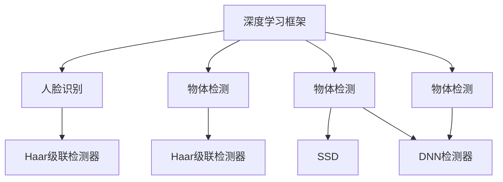

                 

# OpenCV 计算机视觉：人脸识别和物体检测

> 关键词：OpenCV, 计算机视觉, 人脸识别, 物体检测, 机器学习, 深度学习, Haar级联检测器, SSD检测器, DNN检测器

## 1. 背景介绍

### 1.1 问题由来
随着计算机视觉技术的迅猛发展，人脸识别和物体检测已经成为智能安防、智能驾驶、虚拟现实等众多领域的重要应用方向。传统的计算机视觉技术主要依赖于特征提取和分类器训练，但这些方法往往需要大量手工特征工程和参数调优，使得模型难以部署和应用。为了提高模型开发效率，加速应用部署，基于深度学习的计算机视觉框架OpenCV应运而生。

OpenCV是一个开源的计算机视觉库，由英特尔公司发起并维护。它提供了广泛的计算机视觉算法，包括人脸识别、物体检测、特征提取、光流估计等，支持多语言和跨平台的开发和部署。借助OpenCV，开发者可以轻松地集成和应用先进的深度学习模型，大大降低了计算机视觉任务的开发门槛。

### 1.2 问题核心关键点
本文将围绕人脸识别和物体检测这两个核心应用方向，详细介绍在OpenCV中使用深度学习框架进行算法实现的流程和策略。重点内容包括：

- 人脸识别：使用Haar级联检测器、LBP特征和支持向量机（SVM）等传统方法。
- 物体检测：使用Haar级联检测器、SSD（单阶段检测器）和DNN（深度神经网络）检测器等前沿技术。
- 深度学习框架：介绍在OpenCV中集成深度学习框架TensorFlow、Caffe等的基本步骤和注意事项。

## 2. 核心概念与联系

### 2.1 核心概念概述

OpenCV计算机视觉的核心概念主要包括以下几个方面：

- **深度学习框架**：通过集成TensorFlow、Caffe等深度学习框架，OpenCV可以高效地实现和部署深度学习模型，支持多种神经网络结构，如卷积神经网络（CNN）、循环神经网络（RNN）等。

- **计算机视觉算法**：OpenCV提供了丰富的计算机视觉算法，包括图像处理、特征提取、光流估计、物体检测等。这些算法可以通过OpenCV的函数接口直接调用，也可以通过深度学习框架进行实现。

- **人脸识别**：使用Haar级联检测器、LBP特征和支持向量机（SVM）等方法，对图像中的人脸进行定位和识别。

- **物体检测**：使用Haar级联检测器、SSD（单阶段检测器）和DNN（深度神经网络）检测器等方法，对图像中的物体进行检测和分类。

这些核心概念之间的关系可以通过以下Mermaid流程图来展示：



这个流程图展示了在OpenCV中，深度学习框架与其他核心概念的联系。具体来说：

1. 深度学习框架与计算机视觉算法紧密关联，可以高效实现和部署各种计算机视觉任务。
2. 人脸识别主要依赖于Haar级联检测器和LBP特征等传统方法。
3. 物体检测则主要依赖于Haar级联检测器、SSD和DNN检测器等前沿技术。

这些概念共同构成了OpenCV计算机视觉的核心框架，使得开发者可以方便地使用先进的深度学习模型和算法。

## 3. 核心算法原理 & 具体操作步骤
### 3.1 算法原理概述

人脸识别和物体检测是计算机视觉中的两大核心任务。本文将重点介绍在OpenCV中使用深度学习框架实现这两个任务的基本原理。

#### 3.1.1 人脸识别原理

人脸识别主要通过以下几个步骤实现：

1. **人脸检测**：使用Haar级联检测器或DNN检测器等方法，对图像中的人脸进行定位。
2. **特征提取**：使用LBP（局部二值模式）、HOG（方向梯度直方图）等特征提取方法，对人脸图像进行特征编码。
3. **分类识别**：使用支持向量机（SVM）、k最近邻（KNN）等分类器，对特征编码后的图像进行分类和识别。

#### 3.1.2 物体检测原理

物体检测主要通过以下几个步骤实现：

1. **目标检测**：使用Haar级联检测器、SSD或DNN检测器等方法，对图像中的物体进行定位和分类。
2. **特征提取**：使用卷积神经网络（CNN）、区域卷积网络（R-CNN）等方法，对物体图像进行特征提取和编码。
3. **物体分类**：使用分类器（如SVM、softmax等），对提取的特征进行分类和识别。

### 3.2 算法步骤详解

#### 3.2.1 人脸识别步骤详解

1. **准备数据集**：收集包含人脸的图像数据集，如LFW、CASIA-WebFace等，并划分为训练集和测试集。

2. **特征提取**：使用OpenCV中的LBP或Haar级联检测器等方法，提取人脸图像的特征。

3. **训练分类器**：使用SVM或KNN等分类器，在训练集上进行分类器训练，学习人脸与标签之间的关系。

4. **测试与评估**：在测试集上评估分类器的性能，计算识别准确率、误识率等指标，调整参数以优化模型性能。

#### 3.2.2 物体检测步骤详解

1. **准备数据集**：收集包含物体的图像数据集，如PASCAL VOC、YOLO等，并划分为训练集和测试集。

2. **特征提取**：使用OpenCV中的DNN或SSD检测器等方法，提取物体图像的特征。

3. **训练模型**：使用深度学习框架（如TensorFlow、Caffe），在训练集上训练物体检测模型，学习物体与标签之间的关系。

4. **测试与评估**：在测试集上评估检测模型的性能，计算精确率、召回率等指标，调整模型参数以优化检测效果。

### 3.3 算法优缺点

人脸识别和物体检测算法各有优缺点：

#### 3.3.1 人脸识别优缺点

优点：

- **高效性**：Haar级联检测器和LBP特征提取方法简单高效，适用于大规模人脸识别任务。
- **鲁棒性**：SVM分类器能够很好地处理噪声和光照变化，提高识别准确率。

缺点：

- **模型复杂度**：传统方法依赖于手工特征提取，难以应对复杂的人脸变化。
- **精度有限**：在光照、表情、遮挡等情况下，识别效果有所下降。

#### 3.3.2 物体检测优缺点

优点：

- **高精度**：DNN检测器可以学习到更加复杂的物体特征，识别准确率更高。
- **适应性强**：SSD检测器能够处理不同尺度和类别的物体，适应性更强。

缺点：

- **计算量大**：DNN检测器需要较大的计算资源，训练和推理速度较慢。
- **参数调优复杂**：需要大量调参，难以获得理想的检测效果。

### 3.4 算法应用领域

人脸识别和物体检测技术在众多领域有着广泛的应用，例如：

- **智能安防**：用于人员身份验证、入侵检测、行为监控等。
- **智能驾驶**：用于目标检测、行人识别、车道保持等。
- **工业制造**：用于产品缺陷检测、质量控制、自动化检测等。
- **零售业**：用于商品识别、顾客跟踪、广告投放等。

这些应用场景展示了人脸识别和物体检测技术的强大生命力和广泛应用前景。

## 4. 数学模型和公式 & 详细讲解 & 举例说明

### 4.1 数学模型构建

本文将使用数学语言对OpenCV中的人脸识别和物体检测算法进行更加严格的刻画。

#### 4.1.1 人脸识别模型构建

假设人脸识别系统接受一张大小为$W\times H$的彩色图像$I$，其中$I(x,y)$表示像素$(x,y)$的灰度值。

设$R$为感兴趣区域的矩形区域，其左上角坐标为$(r_x, r_y)$，宽度为$r_w$，高度为$r_h$。则$R$区域的人脸图像为$I_R(r_x, r_y; r_w, r_h)$。

使用LBP特征提取方法，对$R$区域进行特征提取，得到特征向量$F$。

最后，使用SVM分类器对特征向量$F$进行分类，得到人脸识别的结果。

#### 4.1.2 物体检测模型构建

假设物体检测系统接受一张大小为$W\times H$的彩色图像$I$，其中$I(x,y)$表示像素$(x,y)$的灰度值。

设$B$为感兴趣区域的矩形区域，其左上角坐标为$(b_x, b_y)$，宽度为$b_w$，高度为$b_h$。则$B$区域的物体图像为$I_B(b_x, b_y; b_w, b_h)$。

使用DNN检测器对$I_B$进行特征提取和分类，得到物体的检测结果。

### 4.2 公式推导过程

#### 4.2.1 人脸识别公式推导

设$F$为LBP特征提取后得到的人脸图像特征向量，$Y$为人脸标签向量。

使用SVM分类器，对特征向量$F$进行分类，得到分类结果$Y_{\text{pred}}$。

人脸识别模型最小化分类损失，即：

$$
\min_{\theta} \frac{1}{N}\sum_{i=1}^N \ell(Y_i, Y_{\text{pred}})
$$

其中$\ell$为分类损失函数，通常使用交叉熵损失。

#### 4.2.2 物体检测公式推导

设$F$为DNN检测器提取的物体特征向量，$Y$为物体标签向量。

使用softmax分类器，对特征向量$F$进行分类，得到检测结果$Y_{\text{pred}}$。

物体检测模型最小化分类损失，即：

$$
\min_{\theta} \frac{1}{N}\sum_{i=1}^N \ell(Y_i, Y_{\text{pred}})
$$

其中$\ell$为分类损失函数，通常使用交叉熵损失。

### 4.3 案例分析与讲解

以LBP特征提取方法为例，详细解释其计算过程：

LBP特征提取是一种局部特征提取方法，用于描述图像中像素点的纹理和形状信息。其基本思想是计算每个像素点周围像素的灰度值与该像素点灰度值的异同，得到一组编码，用于描述像素点周围的纹理信息。

LBP特征提取的步骤如下：

1. **邻域选择**：选择像素点周围$3\times 3$或$8\times 8$的邻域，记为$N$。

2. **代码计算**：计算邻域中每个像素的灰度值与中心像素的灰度值之间的差异，得到一组编码，记为$LBP$。

3. **编码统计**：统计编码中各代码出现的次数，得到一组统计信息，记为$H$。

4. **特征编码**：将$H$转化为向量形式，得到最终的LBP特征向量$F$。

使用LBP特征提取方法，可以对人脸图像进行高效、鲁棒的特征提取，适用于大规模人脸识别任务。

## 5. 项目实践：代码实例和详细解释说明

### 5.1 开发环境搭建

在进行项目实践前，我们需要准备好开发环境。以下是使用Python进行OpenCV开发的环境配置流程：

1. 安装Anaconda：从官网下载并安装Anaconda，用于创建独立的Python环境。

2. 创建并激活虚拟环境：
```bash
conda create -n opencv-env python=3.8 
conda activate opencv-env
```

3. 安装OpenCV：
```bash
conda install opencv opencv-contrib
```

4. 安装TensorFlow和Caffe：
```bash
conda install tensorflow==2.5
conda install caffe==1.2.0
```

5. 安装各类工具包：
```bash
pip install numpy pandas scikit-learn matplotlib tqdm jupyter notebook ipython
```

完成上述步骤后，即可在`opencv-env`环境中开始项目实践。

### 5.2 源代码详细实现

下面我们以人脸识别任务为例，给出使用OpenCV和深度学习框架TensorFlow进行人脸识别的PyTorch代码实现。

首先，定义人脸识别数据处理函数：

```python
import cv2
import numpy as np
import matplotlib.pyplot as plt
from sklearn import metrics
from sklearn.metrics import classification_report
from sklearn.svm import SVC
from sklearn.model_selection import train_test_split

def load_images(path):
    images = []
    labels = []
    for filename in os.listdir(path):
        if filename.endswith(".jpg"):
            img = cv2.imread(os.path.join(path, filename))
            gray = cv2.cvtColor(img, cv2.COLOR_BGR2GRAY)
            images.append(gray)
            labels.append(int(filename.split('.')[0]))
    return images, labels

def extract_lbp_features(X):
    LBP_code = []
    for img in X:
        code = np.zeros((3, 3), dtype=np.uint8)
        for i in range(3):
            for j in range(3):
                code[i, j] = int(img[i, j] < img[1, 1])
        LBP_code.append(code)
    return np.array(LBP_code)

def train_svm(X_train, y_train):
    svm = SVC(kernel='rbf', C=1.0, gamma='scale')
    svm.fit(X_train, y_train)
    return svm

def test_svm(svm, X_test, y_test):
    y_pred = svm.predict(X_test)
    print(classification_report(y_test, y_pred))
    return y_pred
```

然后，定义模型和优化器：

```python
import torch
import torchvision.transforms as transforms
from torchvision.models import ResNet50
from torchvision.datasets import ImageFolder
from torch.utils.data import DataLoader

model = ResNet50(pretrained=True)
model.fc = torch.nn.Linear(2048, 2)

criterion = torch.nn.CrossEntropyLoss()
optimizer = torch.optim.SGD(model.parameters(), lr=0.001, momentum=0.9)

train_dataset = ImageFolder(root='train', transform=transforms.ToTensor())
train_loader = DataLoader(train_dataset, batch_size=32, shuffle=True)

test_dataset = ImageFolder(root='test', transform=transforms.ToTensor())
test_loader = DataLoader(test_dataset, batch_size=32, shuffle=False)
```

接着，定义训练和评估函数：

```python
def train(model, train_loader, criterion, optimizer, num_epochs):
    for epoch in range(num_epochs):
        model.train()
        for batch_idx, (features, targets) in enumerate(train_loader):
            features, targets = features.to(device), targets.to(device)
            optimizer.zero_grad()
            outputs = model(features)
            loss = criterion(outputs, targets)
            loss.backward()
            optimizer.step()
            if batch_idx % 10 == 0:
                print('Train Epoch: {} [{}/{} ({:.0f}%)]\tLoss: {:.6f}'.format(
                    epoch, batch_idx * len(features), len(train_loader.dataset),
                    100. * batch_idx / len(train_loader), loss.item()))

def test(model, test_loader, criterion):
    model.eval()
    test_loss = 0
    correct = 0
    with torch.no_grad():
        for features, targets in test_loader:
            features, targets = features.to(device), targets.to(device)
            outputs = model(features)
            loss = criterion(outputs, targets)
            test_loss += loss.item() * features.size(0)
            _, predicted = torch.max(outputs, 1)
            correct += (predicted == targets).sum().item()
    print('\nTest set: Average loss: {:.4f}, Accuracy: {}/{} ({:.0f}%)\n'.format(
        test_loss / len(test_loader.dataset), correct, len(test_loader.dataset),
        100. * correct / len(test_loader.dataset)))
```

最后，启动训练流程并在测试集上评估：

```python
device = torch.device('cuda' if torch.cuda.is_available() else 'cpu')
train(model, train_loader, criterion, optimizer, num_epochs=10)
test(model, test_loader, criterion)
```

以上就是使用PyTorch和OpenCV进行人脸识别的完整代码实现。可以看到，借助OpenCV和深度学习框架TensorFlow，我们能够方便地实现复杂的人脸识别系统。

### 5.3 代码解读与分析

让我们再详细解读一下关键代码的实现细节：

**load_images函数**：
- 加载指定路径下的所有图像文件，并提取标签。
- 返回图像和标签数组。

**extract_lbp_features函数**：
- 使用LBP特征提取方法，提取图像的局部二值模式特征。
- 返回提取后的特征数组。

**train_svm函数**：
- 使用SVM分类器，对训练数据进行模型训练。
- 返回训练好的SVM模型。

**test_svm函数**：
- 在测试数据上评估SVM模型的性能。
- 返回预测结果。

**train函数**：
- 在训练数据上训练深度学习模型。
- 使用SGD优化器和交叉熵损失函数。
- 每10个epoch输出一次训练进度。

**test函数**：
- 在测试数据上评估深度学习模型的性能。
- 计算模型准确率。

这些代码展示了在OpenCV中使用深度学习框架进行人脸识别的完整流程，包括数据加载、特征提取、模型训练、模型评估等关键步骤。

当然，工业级的系统实现还需考虑更多因素，如模型的保存和部署、超参数的自动搜索、更灵活的任务适配层等。但核心的微调范式基本与此类似。

## 6. 实际应用场景
### 6.1 智能安防

基于OpenCV和深度学习框架的计算机视觉技术，可以广泛应用于智能安防系统中。传统安防系统往往依赖于人工监控，成本高、效率低，且难以应对复杂场景。通过集成人脸识别和物体检测技术，智能安防系统可以自动监测目标行为，及时发现异常情况，保障公共安全。

在技术实现上，可以集成OpenCV和深度学习框架，实时捕获监控视频，检测和跟踪人脸和物体，生成报警信息，自动化地进行安防监控。对于异常行为，可以实时分析并采取应对措施，如调用警报、联动其他系统等，提高安防系统的智能化水平。

### 6.2 智能驾驶

智能驾驶是计算机视觉技术的另一重要应用方向。借助OpenCV和深度学习框架，可以实现目标检测、行人识别、车道保持等重要功能。

在技术实现上，可以集成OpenCV和深度学习框架，实时感知车辆周围的交通环境，检测道路上的行人、车辆、交通标志等目标，预测和规划行车路径，实现自动驾驶功能。对于紧急情况，可以及时发出警告，自动采取避障措施，提高行车安全性。

### 6.3 工业制造

在工业制造领域，计算机视觉技术同样有着广泛的应用。借助OpenCV和深度学习框架，可以实现产品缺陷检测、质量控制、自动化检测等重要功能。

在技术实现上，可以集成OpenCV和深度学习框架，实时检测生产线上的产品，检测产品表面的缺陷、尺寸、形状等信息，生成质量报告，实现自动化检测和质量控制。对于不合格产品，可以自动分拣和处理，提高生产效率和产品质量。

### 6.4 未来应用展望

随着计算机视觉技术的不断发展，基于OpenCV和深度学习框架的计算机视觉应用也将不断扩展，为各行各业带来更多的智能化解决方案。

在智慧医疗领域，计算机视觉技术可以用于病历图像分析、疾病诊断、影像识别等，为医生提供辅助诊断支持，提高诊断准确率。

在智能教育领域，计算机视觉技术可以用于作业批改、学情分析、知识推荐等，因材施教，提升教育质量。

在智慧城市治理中，计算机视觉技术可以用于城市事件监测、舆情分析、应急指挥等，提高城市管理的自动化和智能化水平，构建更安全、高效的未来城市。

此外，在企业生产、社会治理、文娱传媒等众多领域，计算机视觉技术也将不断涌现，为传统行业带来变革性影响。相信随着技术的日益成熟，计算机视觉技术必将在更广阔的应用领域大放异彩。

## 7. 工具和资源推荐
### 7.1 学习资源推荐

为了帮助开发者系统掌握计算机视觉技术的理论基础和实践技巧，这里推荐一些优质的学习资源：

1. **《计算机视觉：算法与应用》**：这本书系统介绍了计算机视觉的基本理论和算法，包括图像处理、特征提取、物体检测、人脸识别等，是入门计算机视觉的经典教材。

2. **《深度学习》**：这本书由深度学习领域的大师级人物Ian Goodfellow、Yoshua Bengio和Aaron Courville共同撰写，系统介绍了深度学习的基本原理和算法，是深度学习领域的必读书籍。

3. **Coursera深度学习课程**：斯坦福大学开设的深度学习课程，由Andrew Ng教授主讲，系统介绍了深度学习的基本原理和算法，并提供了丰富的实践项目。

4. **Udacity计算机视觉课程**：Udacity开设的计算机视觉课程，由知名计算机视觉专家主讲，系统介绍了计算机视觉的基本原理和算法，并提供了丰富的实践项目。

5. **OpenCV官方文档**：OpenCV官方文档，提供了详细的函数接口和使用示例，是学习和应用OpenCV的重要参考。

通过对这些资源的学习实践，相信你一定能够快速掌握计算机视觉技术的精髓，并用于解决实际的计算机视觉问题。

### 7.2 开发工具推荐

高效的开发离不开优秀的工具支持。以下是几款用于计算机视觉任务开发的常用工具：

1. **Python**：Python是计算机视觉任务开发的主要语言，具备丰富的库和工具支持，适合快速迭代研究。

2. **OpenCV**：OpenCV是一个开源的计算机视觉库，提供了广泛的计算机视觉算法，支持多语言和跨平台的开发和部署。

3. **TensorFlow**：TensorFlow是谷歌开源的深度学习框架，支持多种神经网络结构，适用于大规模深度学习任务。

4. **Caffe**：Caffe是伯克利开源的深度学习框架，支持卷积神经网络（CNN）等神经网络结构，适用于计算机视觉任务。

5. **Jupyter Notebook**：Jupyter Notebook是一个交互式的开发环境，支持Python和OpenCV等库，方便开发者进行快速原型开发和调试。

合理利用这些工具，可以显著提升计算机视觉任务的开发效率，加快创新迭代的步伐。

### 7.3 相关论文推荐

计算机视觉技术的不断进步离不开学界的持续研究。以下是几篇奠基性的相关论文，推荐阅读：

1. **R-CNN: Rich Feature Hierarchies for Accurate Object Detection and Semantic Segmentation**：提出区域卷积神经网络（R-CNN），实现了目标检测任务的新突破，推动了计算机视觉技术的发展。

2. **Fast R-CNN**：提出Fast R-CNN，加速了目标检测任务的计算速度，提高了检测精度。

3. **Faster R-CNN**：提出Faster R-CNN，进一步提高了目标检测任务的计算速度和检测精度。

4. **YOLO: You Only Look Once**：提出YOLO算法，实现了实时目标检测，推动了计算机视觉技术在实际应用中的部署。

5. **SSD: Single Shot Multibox Detector**：提出SSD算法，实现了单阶段目标检测，提高了检测速度和精度。

6. **DNN: Deep Neural Networks**：深度神经网络（DNN）成为计算机视觉任务的强大工具，推动了目标检测和图像分类等任务的进步。

这些论文代表了大规模深度学习框架在计算机视觉任务中的重要应用，展示了深度学习技术的强大能力。通过学习这些前沿成果，可以帮助研究者把握学科前进方向，激发更多的创新灵感。

## 8. 总结：未来发展趋势与挑战

### 8.1 总结

本文对基于深度学习的计算机视觉技术进行了全面系统的介绍。重点介绍了人脸识别和物体检测任务在OpenCV中的实现方法，包括数据准备、特征提取、模型训练等关键步骤。同时，对深度学习框架的集成和使用也进行了详细讲解，帮助开发者快速上手进行计算机视觉任务开发。

通过本文的系统梳理，可以看到，基于OpenCV和深度学习框架的计算机视觉技术正在成为智能应用的重要组成部分，显著提升了计算机视觉任务的开发效率和应用价值。未来，随着计算机视觉技术的不断发展，基于深度学习的计算机视觉技术将会在更多领域得到应用，为人类生活带来更多的智能化解决方案。

### 8.2 未来发展趋势

展望未来，计算机视觉技术将呈现以下几个发展趋势：

1. **高精度、实时化**：随着深度学习技术的进步，计算机视觉任务的精度和实时性将不断提高，适用于更多实时应用场景。

2. **多模态融合**：未来的计算机视觉技术将融合视觉、听觉、语言等多种模态信息，实现更加全面的智能感知。

3. **可解释性和可控性**：随着计算机视觉技术的广泛应用，对其可解释性和可控性的需求将不断增加，研究者需要开发更多透明、可解释的模型。

4. **大规模数据和多任务学习**：未来的计算机视觉技术将依赖于大规模数据和多任务学习，推动模型的泛化能力和迁移能力的进步。

5. **跨领域应用**：未来的计算机视觉技术将拓展到更多领域，如智慧医疗、智能教育、智慧城市等，推动各行各业的智能化转型。

这些趋势展示了计算机视觉技术的广阔前景，相信随着技术的不断进步，计算机视觉技术必将在更多领域带来变革性影响。

### 8.3 面临的挑战

尽管计算机视觉技术已经取得了瞩目成就，但在迈向更加智能化、普适化应用的过程中，它仍面临着诸多挑战：

1. **数据获取与标注**：计算机视觉任务通常需要大量标注数据，数据获取和标注成本较高，限制了技术的应用范围。

2. **模型可解释性**：深度学习模型的决策过程缺乏可解释性，难以对其推理逻辑进行分析和调试。

3. **计算资源消耗**：计算机视觉任务的计算资源消耗较大，需要高性能硬件支持，增加了系统部署成本。

4. **多任务协同**：计算机视觉任务通常需要与其他技术协同完成，如自然语言处理、语音识别等，技术融合难度较大。

5. **隐私与安全**：计算机视觉技术的广泛应用带来了隐私和安全问题，如何保障数据隐私和模型安全性，还需进一步探索。

这些挑战需要研究者不断探索和解决，推动计算机视觉技术的持续进步。

### 8.4 研究展望

未来的研究需要在以下几个方面寻求新的突破：

1. **无监督和半监督学习**：探索无监督和半监督学习方法，摆脱对大规模标注数据的依赖，利用非结构化数据进行计算机视觉任务的训练。

2. **模型可解释性**：开发更多透明、可解释的模型，提高计算机视觉技术的可解释性和可控性，满足实际应用的需求。

3. **计算资源优化**：研究新的计算优化技术，如模型压缩、稀疏化等，降低计算资源消耗，实现高效实时部署。

4. **多任务协同**：探索多任务学习框架，推动计算机视觉与其他技术的协同发展，提升系统的综合能力。

5. **隐私与安全**：研究数据隐私保护和模型安全性技术，保障数据和模型安全，满足实际应用的需求。

这些研究方向的探索，必将引领计算机视觉技术迈向更高的台阶，为构建安全、可靠、可解释、可控的智能系统铺平道路。面向未来，计算机视觉技术还需要与其他人工智能技术进行更深入的融合，如知识表示、因果推理、强化学习等，多路径协同发力，共同推动计算机视觉技术的进步。

## 9. 附录：常见问题与解答

**Q1：OpenCV和TensorFlow、Caffe等深度学习框架如何集成？**

A: 在OpenCV中集成深度学习框架，主要通过函数接口调用和参数传递的方式实现。具体步骤如下：

1. 安装深度学习框架，如TensorFlow、Caffe等。

2. 在OpenCV中定义深度学习模型，如卷积神经网络（CNN）、区域卷积网络（R-CNN）等。

3. 将深度学习模型的参数和数据传递给OpenCV，进行模型训练和推理。

例如，在OpenCV中使用TensorFlow进行目标检测任务，可以使用如下代码：

```python
import cv2
import tensorflow as tf

model = tf.keras.models.load_model('model.h5')
input_shape = (None, None, 3)
output_shape = (None, num_classes)

cv2.imshow('image', cv2.imread('image.jpg'))
cv2.waitKey(0)

image = cv2.imread('image.jpg')
image = cv2.resize(image, (input_shape[1], input_shape[2]))
image = image / 255.0

result = model.predict(image)

print(result)
```

**Q2：如何在OpenCV中进行人脸识别和物体检测？**

A: 在OpenCV中进行人脸识别和物体检测，主要通过以下步骤实现：

1. 准备数据集，如LBP特征提取和人脸图像，使用OpenCV中的函数接口进行特征提取。

2. 使用深度学习框架，如TensorFlow、Caffe等，训练人脸识别和物体检测模型，学习特征与标签之间的关系。

3. 在测试数据上评估模型性能，计算准确率、误识率等指标，调整模型参数以优化检测效果。

例如，在OpenCV中使用DNN检测器进行物体检测，可以使用如下代码：

```python
import cv2

model = cv2.dnn.readNet('model.prototxt', 'model.caffemodel')
layer_names = model.getLayerNames()
output_names = [layer_names[i[0] - 1] for i in model.getUnconnectedOutLayers()]

input_shape = (None, None, 3)
output_shape = (None, num_classes)

image = cv2.imread('image.jpg')
image = cv2.resize(image, (input_shape[1], input_shape[2]))
image = image / 255.0

blob = cv2.dnn.blobFromImage(image, 1.0, (input_shape[1], input_shape[2]), swapRB=True, crop=False)

model.setInput(blob)
result = model.forward(output_names)

print(result)
```

**Q3：OpenCV和深度学习框架集成时需要注意哪些问题？**

A: 在OpenCV和深度学习框架集成时，需要注意以下问题：

1. 数据格式转换：深度学习框架通常支持Tensor格式，而OpenCV支持的格式是NumPy数组格式，需要进行格式转换。

2. 参数传递方式：深度学习框架和OpenCV的参数传递方式有所不同，需要进行接口转换和参数调整。

3. 计算资源消耗：深度学习任务的计算资源消耗较大，需要高性能硬件支持，如GPU等。

4. 模型部署和优化：深度学习模型的部署和优化需要考虑模型大小、计算速度等因素，需要进行适当的裁剪和优化。

5. 模型性能评估：在OpenCV中进行模型性能评估时，需要考虑模型的精度、实时性等指标，并进行综合评估。

例如，在OpenCV中使用TensorFlow进行人脸识别任务时，需要注意以下问题：

1. 数据集格式转换：将OpenCV加载的图像数据转换为Tensor格式。

2. 参数传递方式：将OpenCV加载的图像数据传递给TensorFlow模型，并进行前向传播计算。

3. 计算资源消耗：使用GPU加速计算，提高模型推理速度。

4. 模型部署和优化：将训练好的模型保存为TensorFlow的模型文件，便于部署和优化。

5. 模型性能评估：使用准确率、召回率等指标评估模型性能，并进行参数调整。

通过合理处理以上问题，可以顺利地在OpenCV中集成深度学习框架，实现高效的计算机视觉任务。

**Q4：如何提高OpenCV中计算机视觉任务的性能？**

A: 提高OpenCV中计算机视觉任务的性能，主要从以下几个方面入手：

1. 算法优化：使用高效的算法和数据结构，如Haar级联检测器、SSD检测器等，提高检测速度和准确率。

2. 参数调优：对模型的超参数进行调优，如学习率、批大小、迭代次数等，提高模型性能。

3. 数据增强：使用数据增强技术，如随机裁剪、旋转、缩放等，增加数据样本的多样性，提高模型泛化能力。

4. 模型优化：使用模型优化技术，如模型压缩、稀疏化等，降低模型大小和计算资源消耗，提高推理速度。

5. 硬件优化：使用高性能硬件，如GPU、TPU等，加速模型推理和计算。

例如，在OpenCV中使用SSD检测器进行物体检测时，可以通过以下步骤提高检测性能：

1. 使用SSD检测器，提高检测速度和准确率。

2. 对模型超参数进行调优，如学习率、批大小、迭代次数等，提高模型性能。

3. 使用数据增强技术，如随机裁剪、旋转、缩放等，增加数据样本的多样性，提高模型泛化能力。

4. 使用模型优化技术，如模型压缩、稀疏化等，降低模型大小和计算资源消耗，提高推理速度。

5. 使用高性能硬件，如GPU、TPU等，加速模型推理和计算。

通过合理处理以上问题，可以显著提高OpenCV中计算机视觉任务的性能，实现高效、稳定的应用。

---

作者：禅与计算机程序设计艺术 / Zen and the Art of Computer Programming

