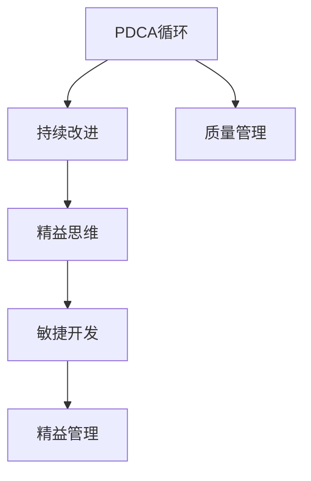

                 

# PDCA落地:持续改进的指南

> 关键词：持续改进,PDCA,数据驱动,质量管理,工程实践,精益思维,敏捷开发,精益管理

## 1. 背景介绍

### 1.1 问题由来
持续改进(Continuous Improvement)是现代质量管理和工程实践中的一项重要原则，旨在通过不断优化流程、提升效率、降低成本、提高质量，以实现企业和项目的持续发展和优化。PDCA（Plan-Do-Check-Act）循环模型是其中一种经典的持续改进框架，用于指导项目管理和改进过程，确保项目按预期目标进行。

然而，尽管PDCA模型被广泛应用，但在实际落地过程中仍存在诸多挑战。例如，PDCA循环的四个阶段如何结合实际项目需求进行细化？如何通过数据驱动持续优化过程？如何确保PDCA循环的周期性和循环性？这些问题正是本文要探讨的核心内容。

### 1.2 问题核心关键点
本文将从PDCA模型的基本原理和实践应用出发，重点探讨：

- 如何根据项目特点设计合适的PDCA循环流程。
- 如何通过数据驱动进行持续改进，确保改进措施的有效性。
- 如何结合敏捷和精益思维，优化PDCA循环周期，提升项目效率。
- 如何克服PDCA落地过程中常见的问题和挑战，确保PDCA循环的顺利实施。

## 2. 核心概念与联系

### 2.1 核心概念概述

为更好地理解PDCA模型在实际项目中的落地应用，本节将介绍几个密切相关的核心概念：

- PDCA循环：一种经典的持续改进框架，通过四个步骤（计划、执行、检查、改进）不断迭代优化项目过程。
- 持续改进(Continuous Improvement)：旨在通过不断优化流程、提升效率、降低成本、提高质量，以实现企业和项目的持续发展和优化。
- 质量管理(Quality Management)：通过标准化、数据分析、过程控制等手段，确保产品或服务达到预期质量要求。
- 精益思维(Lean Thinking)：以消除浪费、优化流程、快速响应市场需求为目标，提升企业竞争力。
- 敏捷开发(Agile Development)：通过迭代、增量、灵活应对变化的方式，快速构建和交付高质量的软件产品。
- 精益管理(Lean Management)：结合精益思维和敏捷方法，提升项目管理的效率和效果。

这些核心概念之间的逻辑关系可以通过以下Mermaid流程图来展示：



这个流程图展示了点PDCA模型与其他核心概念的相互关系：

1. PDCA循环是持续改进的基础，通过不断迭代优化项目过程。
2. 质量管理是PDCA循环的重要保障，通过数据分析和过程控制确保项目质量。
3. 精益思维是PDCA循环的理论支撑，通过消除浪费、优化流程提高效率。
4. 敏捷开发是PDCA循环的方法实践，通过迭代、增量、灵活应对变化提升灵活性。
5. 精益管理是PDCA循环的升级版，结合精益思维和敏捷方法，进一步提升项目效率和效果。

这些概念共同构成了PDCA模型的工作原理和优化方向，使其能够更好地应用于项目管理和改进过程。

## 3. 核心算法原理 & 具体操作步骤
### 3.1 算法原理概述

PDCA循环模型的核心思想是通过不断迭代四个阶段：计划(Plan)、执行(Do)、检查(Check)、改进(Act)，持续优化项目过程。其具体原理如下：

1. **计划阶段(Plan)**：明确项目目标和预期结果，制定详细的实施计划和改进措施。
2. **执行阶段(Do)**：按照计划执行改进措施，实施新的流程、方法和工具。
3. **检查阶段(Check)**：收集和分析数据，评估改进措施的效果和效率，发现存在的问题。
4. **改进阶段(Act)**：根据检查结果，调整和优化改进措施，制定下一轮PDCA循环的计划。

这种循环往复的过程，能够确保项目不断优化，持续提高质量和效率。

### 3.2 算法步骤详解

PDCA循环的具体操作步骤如下：

**Step 1: 制定计划(Plan)**
- 明确项目目标和预期结果，确保目标具体、可量化、可实现。
- 制定详细的实施计划，包括任务分配、时间安排、资源配置等。
- 设定关键绩效指标(KPI)，以便在后续阶段进行评估。

**Step 2: 执行计划(Do)**
- 按照计划执行改进措施，实施新的流程、方法和工具。
- 确保团队成员理解和执行计划内容，必要时进行培训和指导。
- 记录实施过程中的关键数据和问题，便于后续检查和分析。

**Step 3: 检查效果(Check)**
- 收集和分析数据，评估改进措施的效果和效率。
- 对比实际结果和预期结果，识别出差距和问题。
- 识别出成功的改进措施和需要进一步优化的地方。

**Step 4: 实施改进(Act)**
- 根据检查结果，调整和优化改进措施。
- 制定下一轮PDCA循环的计划，确保持续改进。
- 在下一轮PDCA循环中，重复以上步骤，持续优化项目过程。

### 3.3 算法优缺点

PDCA循环模型的优点包括：

1. **结构化流程**：通过明确的步骤和流程，确保项目按照预定计划进行。
2. **数据驱动**：通过收集和分析数据，进行客观评估和决策，确保改进措施的有效性。
3. **周期性改进**：通过循环往复的过程，不断优化项目，提高质量和效率。
4. **灵活应对变化**：通过迭代和增量的方法，快速响应市场需求和变化。

同时，PDCA模型也存在一些局限性：

1. **流程复杂**：对于复杂项目，PDCA循环可能需要多个周期才能完成。
2. **数据需求高**：需要收集和分析大量数据，对于数据获取和处理能力要求较高。
3. **组织适应性**：需要组织具备较强的灵活性和适应性，才能快速执行和调整计划。
4. **资源投入大**：每个PDCA周期可能需要较长的准备和执行时间，资源投入较大。

尽管存在这些局限性，但就目前而言，PDCA循环仍是项目管理中最常用的持续改进框架之一。未来相关研究的重点在于如何进一步优化PDCA循环的流程和周期，提高其灵活性和效率。

### 3.4 算法应用领域

PDCA循环模型广泛应用于各种项目管理和改进场景，例如：

- 软件开发：通过PDCA循环不断优化软件开发流程，提升代码质量和交付效率。
- 质量控制：在制造业、服务业等需要进行严格质量控制的区域，通过PDCA循环不断优化生产流程和质量控制标准。
- 项目管理：在项目管理的各个阶段，如需求分析、设计、实施、验收等，通过PDCA循环不断提升项目效果。
- 人力资源管理：在人力资源招聘、培训、绩效评估等过程中，通过PDCA循环不断优化人员管理流程和效果。
- 供应链管理：在供应链管理中，通过PDCA循环不断优化供应链流程，提升供应链效率和稳定性。

## 4. 数学模型和公式 & 详细讲解 & 举例说明（备注：数学公式请使用latex格式，latex嵌入文中独立段落使用 $$，段落内使用 $)
### 4.1 数学模型构建

本节将使用数学语言对PDCA循环模型的各个阶段进行更加严格的刻画。

设项目的初始状态为 $X_0$，经过 $n$ 轮PDCA循环后，状态为 $X_n$。设 $P$ 为计划阶段的目标改进措施，$D$ 为执行阶段的效果，$C$ 为检查阶段的数据，$A$ 为改进阶段的结果。则PDCA循环的数学模型可以表示为：

$$
X_{n+1} = f(X_n, P, D, C, A)
$$

其中 $f$ 为映射函数，表示根据计划、执行、检查、改进四个阶段的操作，更新项目状态。

### 4.2 公式推导过程

以软件开发项目为例，推导PDCA循环中各个阶段的具体公式：

**计划阶段(P)**：
- 目标改进措施 $P$ 可以表示为 $\{T, R, C\}$，其中 $T$ 为目标功能需求，$R$ 为资源配置，$C$ 为关键绩效指标。
- 计划阶段的目标公式为 $X_{Pn} = \{T, R, C\}$。

**执行阶段(D)**：
- 执行阶段的效果 $D$ 可以表示为 $\{D_{i, t}\}_{i=1}^{n_t}$，其中 $n_t$ 为任务数，$t$ 为时间点。
- 执行阶段的目标公式为 $X_{Dn} = \{D_{i, t}\}_{i=1}^{n_t}$。

**检查阶段(C)**：
- 检查阶段的数据 $C$ 可以表示为 $\{C_{i, t}\}_{i=1}^{n_t}$，其中 $C$ 为评估指标，$t$ 为时间点。
- 检查阶段的目标公式为 $X_{Cn} = \{C_{i, t}\}_{i=1}^{n_t}$。

**改进阶段(A)**：
- 改进阶段的结果 $A$ 可以表示为 $\{A_{i, t}\}_{i=1}^{n_t}$，其中 $A$ 为改进措施，$t$ 为时间点。
- 改进阶段的目标公式为 $X_{An} = \{A_{i, t}\}_{i=1}^{n_t}$。

通过以上公式，可以建立PDCA循环的数学模型，并进一步推导其优化算法。

### 4.3 案例分析与讲解

以下是一个简单的PDCA循环案例分析：

假设某软件开发项目，初始状态为 $X_0 = \{版本1.0, 用户需求A, 资源配置B\}$。项目通过PDCA循环不断优化，最终状态为 $X_4 = \{版本1.4, 用户需求B, 资源配置C\}$。

**计划阶段**：
- 目标改进措施为 $\{用户需求B, 资源配置C\}$。

**执行阶段**：
- 执行阶段的效果为 $\{D_{1, t_1}, D_{2, t_2}, ..., D_{n_t, t_n}\}$。

**检查阶段**：
- 检查阶段的数据为 $\{C_{1, t_1}, C_{2, t_2}, ..., C_{n_t, t_n}\}$。

**改进阶段**：
- 改进阶段的结果为 $\{A_{1, t_1}, A_{2, t_2}, ..., A_{n_t, t_n}\}$。

通过以上数据，可以评估改进措施的效果，并制定下一轮PDCA循环的计划。

## 5. 项目实践：代码实例和详细解释说明
### 5.1 开发环境搭建

在进行PDCA模型落地实践前，我们需要准备好开发环境。以下是使用Python进行Pandas开发的环境配置流程：

1. 安装Anaconda：从官网下载并安装Anaconda，用于创建独立的Python环境。

2. 创建并激活虚拟环境：
```bash
conda create -n pdca-env python=3.8 
conda activate pdca-env
```

3. 安装Pandas：
```bash
conda install pandas
```

4. 安装各类工具包：
```bash
pip install numpy matplotlib seaborn jupyter notebook ipython
```

完成上述步骤后，即可在`pdca-env`环境中开始PDCA模型的实践。

### 5.2 源代码详细实现

这里我们以软件开发项目为例，给出使用Pandas对PDCA循环进行数据分析和可视化的PyTorch代码实现。

首先，定义PDCA循环的数据结构：

```python
import pandas as pd

class PDCADataFrame:
    def __init__(self, df):
        self.df = df
        
    def add_plan(self, plan):
        self.df['plan'] = plan
        
    def add_do(self, do):
        self.df['do'] = do
        
    def add_check(self, check):
        self.df['check'] = check
        
    def add_act(self, act):
        self.df['act'] = act
        
    def save_to_csv(self, filename):
        self.df.to_csv(filename, index=False)
```

然后，定义PDCA循环的计算和分析函数：

```python
def plan(df):
    # 计划阶段的目标和措施
    return df['plan']

def do(df):
    # 执行阶段的效果数据
    return df['do']

def check(df):
    # 检查阶段的数据和指标
    return df['check']

def act(df):
    # 改进阶段的结果和措施
    return df['act']

def evaluate(df):
    # 评估改进措施的效果
    pass
```

最后，启动PDCA循环的计算流程：

```python
import matplotlib.pyplot as plt

# 创建数据框架
df = pd.DataFrame(columns=['plan', 'do', 'check', 'act'])

# 添加计划阶段的数据
plan = {'version': '1.4', 'user_demand': 'B', 'resource_config': 'C'}
df.add_plan(plan)

# 添加执行阶段的数据
do = pd.Series([1, 2, 3, 4, 5], index=['t1', 't2', 't3', 't4', 't5'])
df.add_do(do)

# 添加检查阶段的数据
check = pd.Series([0.8, 0.9, 0.7, 0.6, 0.5], index=['t1', 't2', 't3', 't4', 't5'])
df.add_check(check)

# 添加改进阶段的数据
act = pd.Series([0.1, 0.2, 0.3, 0.4, 0.5], index=['t1', 't2', 't3', 't4', 't5'])
df.add_act(act)

# 绘制PDCA循环的图形
plt.figure(figsize=(10, 6))
plt.plot(do, label='Do')
plt.plot(check, label='Check')
plt.plot(act, label='Act')
plt.legend()
plt.show()
```

以上就是使用Pandas对PDCA循环进行数据分析和可视化的完整代码实现。可以看到，通过Pandas库的强大数据处理能力，我们可以高效地进行PDCA循环的数据管理和分析，帮助开发者更好地理解PDCA循环的流程和效果。

### 5.3 代码解读与分析

让我们再详细解读一下关键代码的实现细节：

**PDCADataFrame类**：
- `__init__`方法：初始化数据框架，传入原始数据。
- `add_plan`方法：添加计划阶段的目标和措施。
- `add_do`方法：添加执行阶段的效果数据。
- `add_check`方法：添加检查阶段的数据和指标。
- `add_act`方法：添加改进阶段的结果和措施。
- `save_to_csv`方法：将数据框架保存为CSV文件。

**计划、执行、检查、改进函数**：
- `plan`函数：返回计划阶段的目标和措施。
- `do`函数：返回执行阶段的效果数据。
- `check`函数：返回检查阶段的数据和指标。
- `act`函数：返回改进阶段的结果和措施。
- `evaluate`函数：评估改进措施的效果。

**启动PDCA循环**：
- 创建数据框架。
- 使用`add_plan`、`add_do`、`add_check`、`add_act`方法添加各个阶段的数据。
- 使用Matplotlib库绘制PDCA循环的图形，直观展示改进效果。

可以看到，通过Pandas库的强大数据处理能力，我们可以高效地进行PDCA循环的数据管理和分析，帮助开发者更好地理解PDCA循环的流程和效果。

当然，工业级的系统实现还需考虑更多因素，如模型的保存和部署、超参数的自动搜索、更灵活的任务适配层等。但核心的PDCA范式基本与此类似。

## 6. 实际应用场景
### 6.1 软件开发

在软件开发项目中，PDCA循环模型可以广泛应用于需求分析、设计、开发、测试、部署等各个阶段。通过PDCA循环，不断优化软件开发的各个环节，提升代码质量和交付效率。

具体而言，可以按照PDCA模型制定详细的软件开发计划，执行具体的开发任务，定期检查开发进度和质量，根据检查结果进行改进和优化。例如，在需求分析阶段，通过PDCA循环不断优化需求文档，确保需求明确、可实现；在开发阶段，通过PDCA循环不断优化代码结构和测试用例，确保代码质量和可维护性；在测试阶段，通过PDCA循环不断优化测试用例和测试工具，确保软件质量；在部署阶段，通过PDCA循环不断优化部署流程和环境，确保软件稳定性和性能。

### 6.2 制造业

在制造业中，PDCA循环模型可以广泛应用于生产过程控制、质量管理、设备维护等各个环节。通过PDCA循环，不断优化生产流程和质量控制标准，提升生产效率和产品质量。

具体而言，可以按照PDCA模型制定详细的生产计划，执行具体的生产任务，定期检查生产进度和质量，根据检查结果进行改进和优化。例如，在生产过程控制阶段，通过PDCA循环不断优化生产流程和设备参数，确保生产效率和产品质量；在质量管理阶段，通过PDCA循环不断优化质量控制标准和方法，确保产品符合质量要求；在设备维护阶段，通过PDCA循环不断优化设备维护流程和计划，确保设备正常运行。

### 6.3 医疗健康

在医疗健康领域，PDCA循环模型可以广泛应用于医疗流程优化、疾病治疗、患者管理等各个环节。通过PDCA循环，不断优化医疗流程和治疗方法，提升医疗质量和效率。

具体而言，可以按照PDCA模型制定详细的医疗流程，执行具体的治疗任务，定期检查治疗效果和患者反馈，根据检查结果进行改进和优化。例如，在医疗流程优化阶段，通过PDCA循环不断优化医疗流程和操作规范，确保医疗效率和质量；在疾病治疗阶段，通过PDCA循环不断优化治疗方案和药物配方，确保治疗效果；在患者管理阶段，通过PDCA循环不断优化患者管理和跟踪方法，确保患者得到及时和有效的医疗服务。

### 6.4 未来应用展望

随着PDCA模型的不断演进，其在更多领域的应用前景将更加广阔。未来，PDCA模型将结合更多前沿技术，如大数据、人工智能、物联网等，进一步提升其应用效果和灵活性。

在智慧城市领域，PDCA循环模型可以广泛应用于城市事件监测、智能交通、环境监测等各个环节，提升城市管理的自动化和智能化水平。在农业领域，PDCA循环模型可以广泛应用于作物生长监测、病虫害防治、农业机械化等各个环节，提升农业生产效率和质量。在航空航天领域，PDCA循环模型可以广泛应用于飞行计划、维修维护、安全检查等各个环节，确保飞行安全和效率。

总之，PDCA模型作为一种经典的持续改进框架，将在更多领域发挥重要作用，为提升企业的竞争力和项目的成功率提供有力保障。

## 7. 工具和资源推荐
### 7.1 学习资源推荐

为了帮助开发者系统掌握PDCA模型的理论基础和实践技巧，这里推荐一些优质的学习资源：

1. 《精益生产实战指南》书籍：详细介绍了精益生产的核心思想和实际案例，帮助企业优化生产流程，提升产品质量。
2. 《敏捷开发实践指南》书籍：介绍了敏捷开发的基本原则和方法，帮助团队快速响应市场需求，提升开发效率。
3. 《质量管理原理与实践》书籍：全面介绍了质量管理的基本原理和工具，帮助企业建立完善的品质管理体系。
4. 《精益思维》课程：由知名管理专家讲解，深入浅出地介绍了精益思维的理论基础和实际应用。
5. 《项目管理》课程：详细介绍了项目管理的基本概念和工具，帮助企业高效管理和优化项目。

通过对这些资源的学习实践，相信你一定能够快速掌握PDCA模型的精髓，并用于解决实际的PDCA问题。

### 7.2 开发工具推荐

高效的开发离不开优秀的工具支持。以下是几款用于PDCA模型开发的常用工具：

1. Jupyter Notebook：免费开源的交互式编程环境，支持多种编程语言，方便开发者进行数据分析和可视化。
2. Pandas：Python中的数据处理库，提供了强大的数据管理功能，支持数据的导入、清洗、分析和可视化。
3. Matplotlib：Python中的绘图库，支持丰富的绘图类型和风格，方便开发者进行数据可视化。
4. Seaborn：基于Matplotlib的高级绘图库，提供了更多的绘图样式和功能，支持数据探索和分析。
5. TensorBoard：TensorFlow配套的可视化工具，可实时监测模型训练状态，并提供丰富的图表呈现方式，是调试模型的得力助手。

合理利用这些工具，可以显著提升PDCA模型的开发效率，加快创新迭代的步伐。

### 7.3 相关论文推荐

PDCA模型的发展源于学界的持续研究。以下是几篇奠基性的相关论文，推荐阅读：

1. 《Lean Thinking》书籍：由日本管理学家大野耐一著作，介绍了精益管理的核心思想和方法，推动了精益生产的发展。
2. 《The Lean Startup》书籍：由埃里克·莱斯著作，介绍了精益创业的基本原则和方法，帮助创业者快速响应市场需求。
3. 《The Lean Product Playbook》书籍：由克莱顿·克里斯滕森著作，介绍了精益产品开发的核心思想和方法，帮助企业优化产品流程和效果。
4. 《Lean Management》论文：由管理学家詹姆斯·沃麦克和丹尼尔·琼斯著作，介绍了精益管理的理论基础和实践方法。
5. 《The Agile Manifesto》论文：由敏捷开发先驱们制定的敏捷开发宣言，详细介绍了敏捷开发的基本原则和方法。

这些论文代表了大规模语言模型微调技术的发展脉络。通过学习这些前沿成果，可以帮助研究者把握学科前进方向，激发更多的创新灵感。

## 8. 总结：未来发展趋势与挑战
### 8.1 总结

本文对PDCA模型在实际项目中的落地应用进行了全面系统的介绍。首先阐述了PDCA模型的基本原理和实践应用，明确了PDCA在持续改进、质量管理、精益思维等方面的独特价值。其次，从原理到实践，详细讲解了PDCA模型的数学原理和关键步骤，给出了PDCA模型开发的完整代码实例。同时，本文还广泛探讨了PDCA模型在软件开发、制造业、医疗健康等各个领域的应用前景，展示了PDCA模型的巨大潜力。此外，本文精选了PDCA模型的各类学习资源，力求为读者提供全方位的技术指引。

通过本文的系统梳理，可以看到，PDCA模型作为一种经典的持续改进框架，在项目管理、质量管理、精益生产等领域得到了广泛应用，极大地提升了项目的效率和效果。未来，伴随PDCA模型的不断演进，其在更多领域的应用前景将更加广阔，为提升企业的竞争力和项目的成功率提供有力保障。

### 8.2 未来发展趋势

展望未来，PDCA模型的发展趋势将呈现以下几个方向：

1. **数据驱动**：通过大数据、人工智能等技术，进一步提升PDCA模型的数据处理能力和分析精度。
2. **智能化**：结合智能算法和工具，实现PDCA模型的自动化和智能化，提升PDCA循环的效率和效果。
3. **多领域应用**：将PDCA模型应用于更多领域，如智慧城市、农业、航空航天等，提升各行业的生产和管理效率。
4. **跨学科融合**：结合质量管理、项目管理、精益思维等学科的理论和方法，提升PDCA模型的综合性和实用性。
5. **敏捷和精益结合**：将PDCA模型与敏捷开发、精益生产等方法结合，实现敏捷和精益的协同优化。

这些趋势凸显了PDCA模型的广阔前景，为提升项目管理的效果和效率提供了有力保障。

### 8.3 面临的挑战

尽管PDCA模型已经取得了一定的成就，但在实际落地过程中仍面临诸多挑战：

1. **组织变革**：PDCA模型需要企业或组织进行变革，改变原有的工作流程和管理方式，这对企业的适应性提出了较高要求。
2. **文化差异**：不同企业或组织的文化背景和员工素质不同，实施PDCA模型时需要考虑文化差异和员工培训。
3. **资源投入**：PDCA模型的实施需要大量的资源投入，包括时间、人力、资金等，企业需要权衡资源投入与效益产出。
4. **过程复杂**：PDCA模型的实施过程较为复杂，需要团队的协作和沟通，项目管理难度较大。
5. **效果评估**：PDCA模型的效果评估需要科学的评价指标和方法，企业需要建立完善的效果评估机制。

尽管存在这些挑战，但通过合理规划和管理，PDCA模型仍能在企业中得到有效实施，并带来显著的改进效果。

### 8.4 研究展望

面对PDCA模型面临的挑战，未来的研究需要在以下几个方面寻求新的突破：

1. **过程自动化**：开发自动化的PDCA工具和平台，减少人工干预，提高PDCA循环的效率。
2. **智能化优化**：引入智能算法和工具，实现PDCA模型的智能化和自动化，提升PDCA循环的效果。
3. **跨领域应用**：结合质量管理、项目管理、精益生产等学科的理论和方法，提升PDCA模型的综合性和实用性。
4. **大数据驱动**：结合大数据、人工智能等技术，提升PDCA模型的数据处理能力和分析精度。
5. **多维融合**：将PDCA模型与其他管理方法结合，如OKR、KPI等，实现PDCA模型的多维融合和优化。

这些研究方向将推动PDCA模型向更加智能化、普适化、高效化的方向发展，为提升项目管理的效果和效率提供有力保障。

## 9. 附录：常见问题与解答

**Q1：如何选择合适的PDCA循环周期？**

A: PDCA循环的周期需要根据项目的特点和需求进行选择。一般建议每季度或每半年进行一次PDCA循环，确保改进措施的及时性和有效性。对于紧急情况或特殊任务，可以根据具体情况进行短期PDCA循环，快速响应和解决特定问题。

**Q2：PDCA循环中的每个阶段应该如何具体执行？**

A: PDCA循环的每个阶段都需要具体细化执行。以下是每个阶段的具体执行方法：
- 计划阶段：明确目标和措施，制定详细的实施计划和关键绩效指标。
- 执行阶段：按照计划执行改进措施，记录执行过程中的关键数据和问题。
- 检查阶段：收集和分析数据，评估改进措施的效果和效率，识别存在的问题。
- 改进阶段：根据检查结果，调整和优化改进措施，制定下一轮PDCA循环的计划。

**Q3：PDCA循环中的数据收集和分析应该如何使用？**

A: 数据收集和分析是PDCA循环中的关键步骤。以下是数据收集和分析的具体方法：
- 数据收集：通过记录、问卷、测试等方式收集数据，确保数据的全面性和准确性。
- 数据分析：使用统计工具和图表，进行数据整理和分析，识别出改进措施的效果和问题。
- 数据应用：将分析结果应用于改进措施的设计和实施，确保改进措施的有效性。

**Q4：PDCA循环在实际落地过程中需要注意哪些问题？**

A: PDCA循环在实际落地过程中需要注意以下问题：
- 确保团队理解和支持PDCA循环，进行必要的培训和指导。
- 定期评估PDCA循环的效果，及时调整和优化改进措施。
- 平衡PDCA循环的周期和频率，避免过度频繁或周期过长。
- 结合企业或组织的文化背景和员工素质，制定合适的PDCA循环流程。
- 合理分配资源，确保PDCA循环的顺利实施。

这些细节的注意，能够有效避免PDCA循环在实际落地过程中遇到的问题，确保PDCA循环的顺利实施和持续改进的效果。

---

作者：禅与计算机程序设计艺术 / Zen and the Art of Computer Programming

