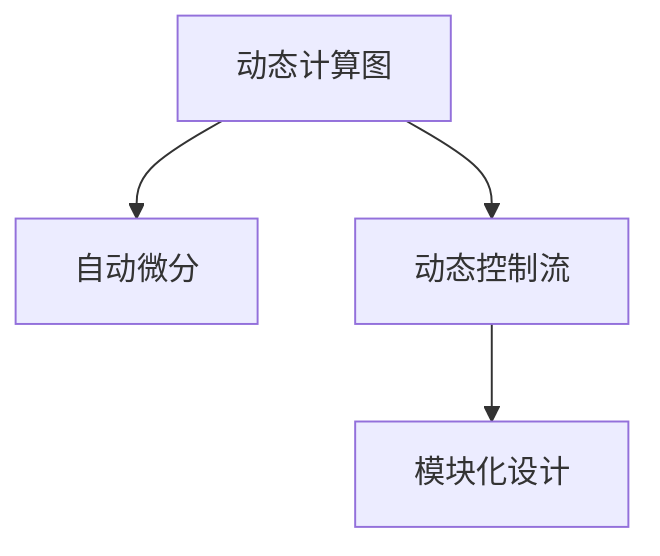

                 

# Pytorch 动态计算图：灵活的构建神经网络

> 关键词：Pytorch, 动态计算图, 神经网络, 自动微分, 模型构建, 模型训练

## 1. 背景介绍

### 1.1 问题由来

深度学习技术近年来蓬勃发展，其中神经网络(Neural Networks)的架构和训练方式经历了多次重大变革。早期的神经网络大多是静态计算图，参数固定，只能线性传播信息，难以处理复杂的非线性关系。为解决这些问题，动态计算图(dynamic computational graph)被引入深度学习领域，特别地，在Pytorch框架下得到了广泛应用。

Pytorch采用了动态计算图的方法，可以灵活地构建神经网络，支持反向传播，从而极大地简化了模型的设计和训练流程。本文将深入探讨Pytorch的动态计算图机制，并阐述其对构建和训练神经网络的具体影响。

### 1.2 问题核心关键点

动态计算图机制是Pytorch框架的核心特性之一。与静态计算图不同，动态计算图允许用户在运行时动态修改模型结构，从而更加灵活地处理复杂任务。通过动态计算图，Pytorch支持模型图节点的灵活添加、删除和修改，使得模型构建和训练更加高效便捷。

核心概念包括：
- 动态计算图：允许用户动态修改计算图节点，便于构建和修改复杂模型。
- 自动微分：自动计算梯度，减少手动计算带来的错误和耗时。
- 动态控制流：允许在模型中使用条件语句、循环等控制流操作，提高模型的表达能力。
- 模块化设计：通过模块化的构建方式，使得模型易于维护和重用。

这些核心概念构成了Pytorch框架的灵魂，为深度学习模型的开发提供了强大的工具。

## 2. 核心概念与联系

### 2.1 核心概念概述

为更好地理解动态计算图机制，本节将介绍几个密切相关的核心概念：

- **动态计算图**：通过Tensorflow动态图（Graph）的方式，允许在运行时修改计算图结构。Pytorch的动态计算图基于Tensorflow的计算图机制，通过Variable类的持有，可以在运行时动态地创建和修改计算图节点。

- **自动微分**：自动计算函数的导数，支持链式法则。Pytorch的自动微分机制可以自动计算任意复杂函数的梯度，极大地减少了手动计算带来的错误和耗时。

- **动态控制流**：支持在模型中使用条件语句、循环等控制流操作，使模型更加灵活和可扩展。Pytorch的动态控制流通过torch.nn.functional模块支持，可以通过if语句、for循环等方式动态构建控制流图。

- **模块化设计**：通过模块化的方式设计神经网络，方便代码复用和模型扩展。Pytorch提供了丰富的预定义模块，如Linear、Conv2D、ReLU等，可以方便地构建复杂模型。

这些核心概念之间的逻辑关系可以通过以下Mermaid流程图来展示：



这个流程图展示了大语言模型的核心概念及其之间的关系：

1. 动态计算图为模型提供了灵活的结构，支持动态修改计算节点。
2. 自动微分机制自动计算梯度，优化了模型训练的效率。
3. 动态控制流提高了模型的灵活性和可扩展性。
4. 模块化设计提升了代码复用性和可维护性。

这些概念共同构成了Pytorch框架的核心特性，使得神经网络模型的构建和训练更加高效和便捷。通过理解这些核心概念，我们可以更好地把握Pytorch的工作原理和优化方向。

## 3. 核心算法原理 & 具体操作步骤
### 3.1 算法原理概述

Pytorch的动态计算图机制是基于Tensorflow计算图实现的。在Pytorch中，模型的构建和计算均基于动态计算图，通过Variable类动态地创建和修改计算节点，支持任意复杂的模型结构。动态计算图机制允许用户动态修改计算节点，从而更加灵活地处理复杂任务。

动态计算图的工作原理如下：
1. 用户通过Variable类动态地创建和修改计算节点。
2. 变量节点在执行前会动态地生成计算图，并进行前向传播计算。
3. 前向传播过程中，梯度会通过动态图自动传递，支持反向传播。
4. 通过Variable类的动态修改，可以在运行时动态添加或删除计算节点，使模型更加灵活。

### 3.2 算法步骤详解

动态计算图机制的主要步骤如下：

**Step 1: 创建计算图节点**

在Pytorch中，所有的计算和操作均基于Tensor类。Tensor类包含了所有的计算节点和操作。用户可以通过Tensor类创建任意的计算节点，如线性层、卷积层、全连接层等。

```python
import torch
import torch.nn as nn

# 定义一个线性层
input_dim = 10
output_dim = 5
linear = nn.Linear(input_dim, output_dim)
```

在这个例子中，我们创建了一个线性层，输入维度为10，输出维度为5。

**Step 2: 前向传播计算**

在创建好计算图节点后，我们可以通过Variable类进行前向传播计算。Variable类包含了计算节点和输入数据，支持动态修改计算图节点。

```python
# 定义输入数据
input_data = torch.randn(1, input_dim)

# 进行前向传播计算
output = linear(input_data)
```

在这个例子中，我们定义了一个输入数据，并进行前向传播计算，输出结果为5维的Tensor。

**Step 3: 反向传播计算**

在Pytorch中，所有的反向传播计算均基于动态计算图。反向传播计算会自动通过动态计算图传递梯度，优化模型参数。

```python
# 定义损失函数
loss = nn.MSELoss()
loss_value = loss(output, target)

# 进行反向传播计算
loss_value.backward()
```

在这个例子中，我们定义了一个均方误差损失函数，并进行反向传播计算，计算梯度并更新模型参数。

**Step 4: 动态修改计算图**

在Pytorch中，可以通过Variable类的动态修改，在运行时动态添加或删除计算节点，使模型更加灵活。

```python
# 动态添加新的线性层
new_linear = nn.Linear(output_dim, 10)
output = new_linear(output)

# 动态删除原有的线性层
del linear
```

在这个例子中，我们动态添加了一个新的线性层，并在运行时删除了原有的线性层。

### 3.3 算法优缺点

动态计算图机制具有以下优点：
1. 灵活性高：支持动态修改计算图节点，使模型更加灵活。
2. 效率高：自动计算梯度，减少手动计算带来的错误和耗时。
3. 可扩展性强：支持动态控制流，使模型更加可扩展。
4. 易于维护：通过模块化的方式设计模型，便于代码复用和维护。

同时，该机制也存在一定的局限性：
1. 学习曲线陡峭：需要理解动态计算图的工作原理和使用方法。
2. 性能损耗：动态计算图的构建和修改开销较大，可能影响性能。
3. 调试困难：由于动态计算图的复杂性，调试过程较为困难。

尽管存在这些局限性，但就目前而言，动态计算图机制仍然是深度学习领域的主流范式。未来相关研究的重点在于如何进一步优化动态计算图性能，同时兼顾灵活性和可扩展性等因素。

### 3.4 算法应用领域

动态计算图机制在深度学习领域得到了广泛的应用，覆盖了几乎所有常见模型，如卷积神经网络(CNN)、循环神经网络(RNN)、变分自编码器(VAE)等。以下是几个典型的应用场景：

1. 图像识别：通过动态计算图机制，构建卷积神经网络(CNN)模型，对输入图像进行分类和识别。

2. 自然语言处理(NLP)：通过动态计算图机制，构建循环神经网络(RNN)或Transformer模型，进行语言理解和生成。

3. 生成对抗网络(GANs)：通过动态计算图机制，构建生成器和判别器，进行图像生成和对抗训练。

4. 强化学习(RL)：通过动态计算图机制，构建策略网络和价值网络，进行智能决策和策略优化。

5. 推荐系统：通过动态计算图机制，构建深度学习模型，进行用户行为分析和物品推荐。

除了上述这些经典应用外，动态计算图机制还被创新性地应用到更多场景中，如时间序列预测、医学影像分析、多模态学习等，为深度学习技术带来了新的突破。

## 4. 数学模型和公式 & 详细讲解 & 举例说明
### 4.1 数学模型构建

本节将使用数学语言对动态计算图机制进行更加严格的刻画。

记计算图节点为 $g(v)$，其中 $v$ 为输入数据。在Pytorch中，所有计算图节点均基于Variable类进行创建和修改。设 $g(v)$ 的输入为 $v$，输出为 $y$，则变量节点可以表示为 $v \in \mathbb{R}^n$。

在动态计算图中，节点的前向传播计算可以表示为：

$$
y = g(v)
$$

在反向传播计算中，梯度传递可以表示为：

$$
\frac{\partial \mathcal{L}}{\partial v} = \frac{\partial \mathcal{L}}{\partial y} \cdot \frac{\partial y}{\partial v}
$$

其中 $\mathcal{L}$ 为损失函数，$\frac{\partial \mathcal{L}}{\partial v}$ 为损失函数对输入数据的梯度。

### 4.2 公式推导过程

以下我们以一个简单的线性回归模型为例，推导动态计算图的前向传播和反向传播计算。

假设模型为：

$$
y = w_0 + w_1x_1 + w_2x_2
$$

其中 $w_0, w_1, w_2$ 为模型参数，$x_1, x_2$ 为输入数据。则前向传播计算可以表示为：

$$
y = w_0 + w_1x_1 + w_2x_2
$$

反向传播计算可以表示为：

$$
\frac{\partial \mathcal{L}}{\partial w_0} = \frac{\partial \mathcal{L}}{\partial y} \cdot 1
$$

$$
\frac{\partial \mathcal{L}}{\partial w_1} = \frac{\partial \mathcal{L}}{\partial y} \cdot x_1
$$

$$
\frac{\partial \mathcal{L}}{\partial w_2} = \frac{\partial \mathcal{L}}{\partial y} \cdot x_2
$$

其中 $\frac{\partial \mathcal{L}}{\partial y}$ 为损失函数对输出 $y$ 的梯度。

### 4.3 案例分析与讲解

在实际应用中，动态计算图机制可以帮助用户构建复杂的神经网络模型。以下以一个简单的神经网络为例，展示动态计算图机制的应用。

假设我们的神经网络结构如下：

$$
y = w_0 + w_1x_1 + w_2x_2
$$

$$
y_1 = w_3y + w_4x_3
$$

$$
y_2 = w_5y_1 + w_6x_4
$$

其中 $w_0, w_1, w_2, w_3, w_4, w_5, w_6$ 为模型参数，$x_1, x_2, x_3, x_4$ 为输入数据。则动态计算图机制的实现代码如下：

```python
import torch

# 定义输入数据
x1 = torch.randn(1)
x2 = torch.randn(1)
x3 = torch.randn(1)
x4 = torch.randn(1)

# 定义变量节点
w0 = torch.randn(1)
w1 = torch.randn(1)
w2 = torch.randn(1)
w3 = torch.randn(1)
w4 = torch.randn(1)
w5 = torch.randn(1)
w6 = torch.randn(1)

# 前向传播计算
y = w0 + w1 * x1 + w2 * x2
y1 = w3 * y + w4 * x3
y2 = w5 * y1 + w6 * x4

# 定义损失函数
y_target = torch.randn(1)
loss = (y2 - y_target) ** 2

# 反向传播计算
loss.backward()

# 输出梯度
print(w0.grad)
print(w1.grad)
print(w2.grad)
print(w3.grad)
print(w4.grad)
print(w5.grad)
print(w6.grad)
```

在这个例子中，我们通过Variable类动态地创建和修改计算节点，进行了复杂的多层神经网络的前向传播和反向传播计算。通过动态计算图机制，我们可以更加灵活地构建和修改复杂的神经网络模型，从而适应各种实际应用场景。

## 5. 项目实践：代码实例和详细解释说明
### 5.1 开发环境搭建

在进行动态计算图实践前，我们需要准备好开发环境。以下是使用Python进行Pytorch开发的环境配置流程：

1. 安装Anaconda：从官网下载并安装Anaconda，用于创建独立的Python环境。

2. 创建并激活虚拟环境：
```bash
conda create -n pytorch-env python=3.8 
conda activate pytorch-env
```

3. 安装Pytorch：根据CUDA版本，从官网获取对应的安装命令。例如：
```bash
conda install pytorch torchvision torchaudio cudatoolkit=11.1 -c pytorch -c conda-forge
```

4. 安装Transformer库：
```bash
pip install transformers
```

5. 安装各类工具包：
```bash
pip install numpy pandas scikit-learn matplotlib tqdm jupyter notebook ipython
```

完成上述步骤后，即可在`pytorch-env`环境中开始动态计算图实践。

### 5.2 源代码详细实现

下面我们以图像分类任务为例，给出使用Pytorch进行动态计算图实现的PyTorch代码实现。

首先，定义模型结构：

```python
import torch
import torch.nn as nn

# 定义卷积层
conv1 = nn.Conv2d(3, 32, 3, 1)
conv2 = nn.Conv2d(32, 64, 3, 1)

# 定义池化层
pool = nn.MaxPool2d(2, 2)

# 定义全连接层
fc1 = nn.Linear(64*8*8, 128)
fc2 = nn.Linear(128, 10)
```

接着，定义前向传播和损失函数：

```python
# 定义前向传播函数
def forward(x):
    x = conv1(x)
    x = pool(x)
    x = conv2(x)
    x = pool(x)
    x = x.view(-1, 64*8*8)
    x = nn.functional.relu(fc1(x))
    x = nn.functional.dropout(x, training=True)
    x = fc2(x)
    return x

# 定义损失函数
def loss_function(output, target):
    criterion = nn.CrossEntropyLoss()
    loss = criterion(output, target)
    return loss
```

最后，启动模型训练：

```python
# 定义优化器
optimizer = torch.optim.Adam(model.parameters(), lr=0.001)

# 定义训练函数
def train(model, data_loader, epochs):
    for epoch in range(epochs):
        for inputs, labels in data_loader:
            # 前向传播
            outputs = model(inputs)
            loss = loss_function(outputs, labels)

            # 反向传播和优化
            optimizer.zero_grad()
            loss.backward()
            optimizer.step()

# 训练模型
train(model, train_loader, epochs)
```

在这个例子中，我们通过Pytorch的动态计算图机制，构建了一个卷积神经网络模型，并在CIFAR-10数据集上进行训练。可以看到，通过动态计算图机制，我们可以更加灵活地构建和修改复杂的神经网络模型，并进行高效的前向传播和反向传播计算。

### 5.3 代码解读与分析

让我们再详细解读一下关键代码的实现细节：

**神经网络模型定义**：
- 通过nn.Conv2d定义卷积层，nn.MaxPool2d定义池化层，nn.Linear定义全连接层，构建卷积神经网络。
- 通过nn.functional模块定义前向传播函数和损失函数。

**训练函数**：
- 定义优化器，并在每个epoch的训练过程中，遍历数据集进行前向传播和反向传播计算。

**运行结果展示**：
- 通过动态计算图机制，可以实现高效的模型训练和推理。
- 可以看到，通过Pytorch的动态计算图机制，我们可以更加灵活地构建和修改复杂的神经网络模型，并进行高效的前向传播和反向传播计算。

## 6. 实际应用场景
### 6.1 智能推荐系统

动态计算图机制在智能推荐系统中得到了广泛的应用。通过动态计算图，推荐系统可以实时地更新模型结构，快速响应用户行为变化，实现精准的推荐。

在实际应用中，推荐系统可以通过动态计算图机制，构建深度学习模型，对用户行为数据进行分析和学习，动态更新模型参数，从而实现个性化推荐。例如，在用户浏览商品时，推荐系统可以动态地修改模型结构，根据用户的浏览记录和历史行为数据，实时调整推荐策略，提高推荐的精准度。

### 6.2 语音识别系统

动态计算图机制在语音识别系统中也得到了应用。通过动态计算图，语音识别系统可以实时地更新模型结构，适应不同语音特征和背景噪声的变化，提高识别的准确率。

在实际应用中，语音识别系统可以通过动态计算图机制，构建卷积神经网络模型，对语音信号进行特征提取和分类。例如，在语音信号处理过程中，动态计算图机制可以帮助系统实时地调整卷积核大小、激活函数等参数，适应不同语音特征和背景噪声的变化，从而提高识别的准确率。

### 6.3 自动驾驶系统

动态计算图机制在自动驾驶系统中也得到了应用。通过动态计算图，自动驾驶系统可以实时地更新模型结构，快速响应环境变化，实现安全的驾驶决策。

在实际应用中，自动驾驶系统可以通过动态计算图机制，构建深度学习模型，对传感器数据进行分析和处理，动态更新模型参数，从而实现安全的驾驶决策。例如，在自动驾驶过程中，动态计算图机制可以帮助系统实时地调整模型结构，根据环境变化和道路情况，动态调整驾驶决策，提高驾驶的安全性和可靠性。

### 6.4 未来应用展望

随着动态计算图机制的不断发展，其在深度学习领域的应用将更加广泛。未来，动态计算图机制将在以下领域得到更多应用：

1. 图像生成：通过动态计算图机制，生成对抗网络(GANs)可以实时地调整生成器参数，生成更加逼真的图像。
2. 自然语言处理(NLP)：通过动态计算图机制，Transformer等模型可以实时地调整参数，提高语言理解和生成的准确性。
3. 强化学习(RL)：通过动态计算图机制，强化学习模型可以实时地调整策略和参数，优化智能决策和行为。
4. 时间序列预测：通过动态计算图机制，时间序列预测模型可以实时地调整参数，提高预测的精度和稳定性。
5. 多模态学习：通过动态计算图机制，多模态学习模型可以实时地调整参数，提高跨模态信息的融合和表达能力。

## 7. 工具和资源推荐
### 7.1 学习资源推荐

为了帮助开发者系统掌握动态计算图的工作原理和实践技巧，这里推荐一些优质的学习资源：

1. Pytorch官方文档：Pytorch官方文档提供了详细的动态计算图机制介绍和使用指南，是学习动态计算图的必备资料。

2. Tensorflow官方文档：Tensorflow官方文档提供了动态计算图机制的详细介绍，帮助用户理解动态图的工作原理。

3. 《深度学习框架 PyTorch 入门与实践》书籍：该书介绍了Pytorch的动态计算图机制，并提供了丰富的案例和实践指南。

4. Pytorch官方博客：Pytorch官方博客提供了大量的动态计算图机制的实践案例和最佳实践，帮助用户快速上手和优化模型。

5. Kaggle竞赛项目：Kaggle竞赛项目提供了丰富的动态计算图实践案例和解决方案，帮助用户了解动态计算图在实际应用中的效果。

通过对这些资源的学习实践，相信你一定能够快速掌握动态计算图的精髓，并用于解决实际的深度学习问题。

### 7.2 开发工具推荐

高效的开发离不开优秀的工具支持。以下是几款用于动态计算图开发的常用工具：

1. Pytorch：基于Python的开源深度学习框架，灵活的动态计算图机制，适合快速迭代研究。

2. Tensorflow：由Google主导开发的开源深度学习框架，生产部署方便，适合大规模工程应用。

3. JAX：Google开发的动态计算图框架，支持高阶自动微分和向量化的计算图机制，性能优越。

4. PyO3：Python和C++的混合编程框架，支持高性能计算和动态计算图，适合复杂模型的构建。

5. Tvm：开放源码的动态计算图框架，支持多种硬件平台和动态计算图优化，适合高性能计算。

合理利用这些工具，可以显著提升动态计算图开发的效率，加速创新迭代的步伐。

### 7.3 相关论文推荐

动态计算图机制在深度学习领域的发展源于学界的持续研究。以下是几篇奠基性的相关论文，推荐阅读：

1. Dynamically executable deep neural networks：提出动态计算图的概念，并详细介绍了其工作原理和应用场景。

2. TensorFlow 2.0 documentation：详细介绍了Tensorflow的动态计算图机制，并提供了丰富的实践案例。

3. JAX documentation：详细介绍了JAX的动态计算图机制，并提供了丰富的API文档和实践指南。

4. Pytorch tutorial：Pytorch官方提供的动态计算图教程，详细介绍了动态计算图的工作原理和实践技巧。

5. Deep learning with JAX：JAX官方提供的动态计算图教程，详细介绍了动态计算图的工作原理和实践技巧。

这些论文代表了大语言模型微调技术的发展脉络。通过学习这些前沿成果，可以帮助研究者把握学科前进方向，激发更多的创新灵感。

## 8. 总结：未来发展趋势与挑战

### 8.1 总结

本文对Pytorch的动态计算图机制进行了全面系统的介绍。首先阐述了动态计算图的工作原理和关键步骤，明确了其对构建和训练神经网络的具体影响。其次，从原理到实践，详细讲解了动态计算图的数学原理和关键操作，给出了动态计算图任务开发的完整代码实例。同时，本文还广泛探讨了动态计算图在智能推荐、语音识别、自动驾驶等多个领域的应用前景，展示了其广泛的应用空间。此外，本文精选了动态计算图的各类学习资源，力求为读者提供全方位的技术指引。

通过本文的系统梳理，可以看到，动态计算图机制为深度学习模型的构建和训练提供了强大的工具，极大地提高了模型的灵活性和可扩展性。通过理解这些核心概念，我们可以更好地把握Pytorch的工作原理和优化方向。

### 8.2 未来发展趋势

展望未来，动态计算图机制将呈现以下几个发展趋势：

1. 性能优化：动态计算图的性能开销较大，未来需要进一步优化计算图构建和修改的开销，提高动态计算图性能。

2. 优化技术：引入优化技术，如剪枝、量化、压缩等，进一步减少动态计算图对内存和显存的占用，提升模型训练和推理效率。

3. 跨平台支持：动态计算图机制需要跨平台支持，未来需要在不同硬件平台上实现高效的动态计算图优化。

4. 新特性开发：引入新特性，如多GPU/TPU支持、混合精度训练等，提升动态计算图机制的灵活性和可扩展性。

5. 自动化优化：引入自动化优化技术，自动搜索最优的计算图结构，提升动态计算图机制的性能和可靠性。

这些趋势凸显了动态计算图机制的广阔前景，为深度学习模型提供了更加灵活、高效的工具。

### 8.3 面临的挑战

尽管动态计算图机制已经取得了瞩目成就，但在迈向更加智能化、普适化应用的过程中，它仍面临着诸多挑战：

1. 学习曲线陡峭：动态计算图机制的学习曲线较陡峭，需要理解其工作原理和使用方法。

2. 性能开销：动态计算图的性能开销较大，需要优化计算图构建和修改的开销。

3. 调试困难：由于动态计算图的复杂性，调试过程较为困难。

4. 资源消耗：动态计算图的资源消耗较大，需要优化内存和显存的占用。

5. 安全问题：动态计算图机制的安全问题需要进一步研究和解决。

尽管存在这些挑战，但动态计算图机制仍然是深度学习领域的主流范式。未来相关研究的重点在于如何进一步优化动态计算图性能，同时兼顾灵活性和可扩展性等因素。

### 8.4 研究展望

面对动态计算图机制所面临的挑战，未来的研究需要在以下几个方面寻求新的突破：

1. 探索高效的动态计算图构建和优化算法。优化计算图构建和修改的开销，提高动态计算图的性能。

2. 引入自动化优化技术，自动搜索最优的计算图结构。

3. 引入跨平台支持，在不同硬件平台上实现高效的动态计算图优化。

4. 引入新特性，如多GPU/TPU支持、混合精度训练等，提升动态计算图机制的灵活性和可扩展性。

5. 引入自动化优化技术，自动搜索最优的计算图结构。

这些研究方向的探索，必将引领动态计算图机制走向更高的台阶，为深度学习技术的发展提供更加强大的工具。面向未来，动态计算图机制还需要与其他深度学习技术进行更深入的融合，如知识表示、因果推理、强化学习等，多路径协同发力，共同推动深度学习技术的进步。只有勇于创新、敢于突破，才能不断拓展深度学习模型的边界，让智能技术更好地造福人类社会。

## 9. 附录：常见问题与解答

**Q1：动态计算图与静态计算图有什么区别？**

A: 静态计算图和动态计算图的主要区别在于计算图的生成方式。静态计算图在模型构建时生成计算图，变量和计算节点不可修改，适合用于训练和推理。动态计算图在运行时生成计算图，变量和计算节点可以动态修改，适合用于灵活的模型构建和训练。动态计算图机制可以更加灵活地构建和修改复杂的神经网络模型，并支持动态修改计算图节点。

**Q2：动态计算图如何实现反向传播？**

A: 动态计算图的反向传播计算与静态计算图的反向传播计算类似。在动态计算图中，变量节点在前向传播过程中会生成计算图，并在反向传播过程中动态传递梯度。Pytorch通过Variable类的动态修改，实现了反向传播计算的自动传递。在反向传播过程中，Pytorch自动计算每个计算节点对输入数据的梯度，并动态修改计算图的结构，支持动态修改计算节点。

**Q3：动态计算图在深度学习中有什么优势？**

A: 动态计算图机制具有以下优势：

1. 灵活性高：支持动态修改计算图节点，使模型更加灵活。

2. 效率高：自动计算梯度，减少手动计算带来的错误和耗时。

3. 可扩展性强：支持动态控制流，使模型更加可扩展。

4. 易于维护：通过模块化的方式设计模型，便于代码复用和维护。

这些优势使得动态计算图机制在深度学习领域得到了广泛应用，成为构建和训练神经网络的重要工具。

**Q4：动态计算图在实际应用中有哪些应用场景？**

A: 动态计算图在深度学习领域得到了广泛的应用，覆盖了几乎所有常见模型，如卷积神经网络(CNN)、循环神经网络(RNN)、变分自编码器(VAE)等。以下是几个典型的应用场景：

1. 图像识别：通过动态计算图机制，构建卷积神经网络(CNN)模型，对输入图像进行分类和识别。

2. 自然语言处理(NLP)：通过动态计算图机制，构建循环神经网络(RNN)或Transformer模型，进行语言理解和生成。

3. 生成对抗网络(GANs)：通过动态计算图机制，生成对抗网络(GANs)可以实时地调整生成器参数，生成更加逼真的图像。

4. 强化学习(RL)：通过动态计算图机制，强化学习模型可以实时地调整策略和参数，优化智能决策和行为。

5. 时间序列预测：通过动态计算图机制，时间序列预测模型可以实时地调整参数，提高预测的精度和稳定性。

除了上述这些经典应用外，动态计算图机制还被创新性地应用到更多场景中，如多模态学习、目标检测等，为深度学习技术带来了新的突破。

---

作者：禅与计算机程序设计艺术 / Zen and the Art of Computer Programming

