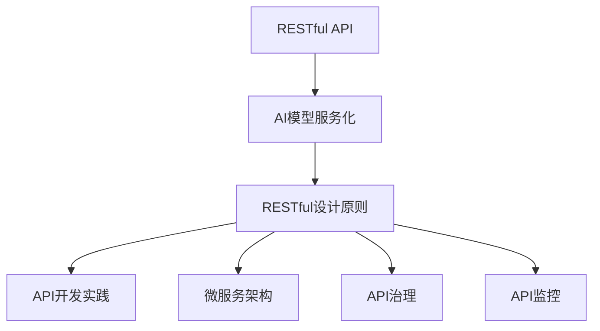

                 

# RESTful API设计：AI模型服务化的最佳实践

> 关键词：RESTful API, AI模型服务化, RESTful设计原则, API开发实践, 服务化微服务架构, API版本管理, API安全设计, AI模型部署, 微服务设计, API治理, API监控

## 1. 背景介绍

### 1.1 问题由来
随着人工智能技术的迅速发展，企业对AI模型的需求日益增加。AI模型的功能日益强大，应用场景不断扩展，对系统的要求也变得更为复杂。然而，传统的单体应用难以适应这种变化，越来越多企业开始考虑将AI模型服务化，将其部署为API，以便于后续的开发和运营。

AI模型服务化意味着将模型的预测能力封装为RESTful API接口，通过网络进行访问和使用。这种模式可以大幅提升AI模型在企业中的复用性和灵活性，让开发者能够基于模型快速构建新的应用和场景。

### 1.2 问题核心关键点
AI模型服务化不仅需要关注模型的构建和优化，还需设计合理有效的API接口，使得模型能够高效地被其他服务调用和使用。API设计的好坏直接影响模型的可用性和系统的整体性能。因此，本文将围绕RESTful API设计的最佳实践展开，确保AI模型服务化顺利进行。

## 2. 核心概念与联系

### 2.1 核心概念概述

为更好地理解RESTful API设计在AI模型服务化中的关键作用，本节将介绍几个密切相关的核心概念：

- **RESTful API**：遵循REST架构风格设计的API接口，具有简洁、一致、可缓存、易于扩展等特点，适用于各种场景下的服务访问。

- **AI模型服务化**：将AI模型封装为API接口，使模型能够被其他服务或系统通过网络进行调用，实现模型的复用和共享。

- **RESTful设计原则**：一套设计原则和约束，用于指导API设计，确保API接口的可扩展性、可维护性和可理解性。

- **API开发实践**：指API接口的开发和实现的最佳实践，涵盖API接口的设计、文档编写、版本管理等方面。

- **微服务架构**：一种软件架构模式，通过将应用拆分为多个独立运行的服务，提升系统的灵活性和可扩展性。

- **API治理**：通过统一管理和规范，确保API接口的质量、安全性和可用性，提升API整体的使用体验。

- **API监控**：对API接口的性能、稳定性和安全状态进行监控和分析，及时发现和解决问题，保障API接口的稳定运行。

这些概念之间的逻辑关系可以通过以下Mermaid流程图来展示：



这个流程图展示了大语言模型的核心概念及其之间的关系：

1. RESTful API是服务化的基础，用于封装和暴露模型功能。
2. RESTful设计原则指导API的设计，确保接口符合最佳实践。
3. API开发实践涉及接口的实现和文档编写，保证接口可用性。
4. 微服务架构用于拆分应用，提升系统的可扩展性。
5. API治理确保接口质量和安全，提升使用体验。
6. API监控保障接口稳定运行，及时发现和解决问题。

## 3. 核心算法原理 & 具体操作步骤

### 3.1 算法原理概述

RESTful API设计的核心是遵循RESTful架构风格，设计简洁、一致、易于维护的接口。其核心原则包括：

- **统一接口**：所有资源都通过唯一的资源标识符进行访问，避免使用复杂的路径。
- **无状态请求**：每个请求都是独立的，服务器不保存客户端状态，确保接口的简洁性。
- **基于资源的描述**：API接口的资源应具有清晰的含义，便于理解和维护。
- **支持多种数据格式**：支持JSON、XML等常见数据格式，提升接口的灵活性。
- **使用HTTP标准方法**：使用GET、POST、PUT、DELETE等标准的HTTP方法，便于理解和实现。

### 3.2 算法步骤详解

设计RESTful API时，一般遵循以下步骤：

**Step 1: 定义资源和操作**
- 确定API的服务范围和功能，定义核心资源及其支持的操作，如用户、订单、预测等。
- 对每个资源设计合适的资源标识符，避免复杂的路径结构。

**Step 2: 设计接口请求和响应**
- 根据资源和操作设计HTTP请求方法和路径，如GET /predict，POST /train。
- 定义请求和响应的数据格式，如JSON、XML等，确保接口灵活性。
- 设计响应数据结构，保证数据展示的清晰性和可理解性。

**Step 3: 实现接口**
- 实现API接口，包括路由、参数处理、请求处理、数据格式化、错误处理等。
- 确保接口符合RESTful设计原则，避免复杂性。
- 对API接口进行文档编写，提供清晰的API文档和示例。

**Step 4: 接口测试和验收**
- 编写测试用例，对API接口进行功能测试和性能测试。
- 进行验收测试，确保接口符合业务需求和设计原则。
- 定期更新和优化接口，保持API的可用性和稳定性。

### 3.3 算法优缺点

RESTful API设计具有以下优点：

- 简洁一致：API接口设计简洁，易于理解和实现。
- 灵活扩展：支持多种数据格式，便于扩展新功能。
- 易于维护：遵循RESTful原则，接口易于维护和优化。
- 高可扩展性：适用于多种场景，便于后续的扩展和迭代。

同时，也存在一些缺点：

- 响应时间和性能：由于RESTful接口的数据传输和网络通信，响应时间和性能可能不如其他接口。
- 复杂性：接口设计需要遵循RESTful原则，对开发者的技术要求较高。
- 安全性：API接口的设计和实现需要考虑安全问题，避免数据泄露和攻击。

尽管存在这些局限性，但RESTful API设计的优势和适用性使其成为当前主流的服务化方式，广泛应用在各种NLP应用中。

### 3.4 算法应用领域

RESTful API设计在NLP领域得到了广泛应用，覆盖了从简单的文本分析到复杂的自然语言生成等多个任务。以下是几个具体的应用场景：

- **文本分类**：将文本数据输入API接口，获取文本分类的结果。
- **情感分析**：输入文本，获取文本的情感极性（如正面、负面、中性）。
- **命名实体识别**：输入文本，获取文本中的命名实体（如人名、地名、机构名等）。
- **机器翻译**：将源语言文本输入API接口，获取目标语言的翻译结果。
- **问答系统**：输入问题，获取最佳答案的推荐。

## 4. 数学模型和公式 & 详细讲解 & 举例说明

### 4.1 数学模型构建

在AI模型服务化过程中，RESTful API的设计和实现需要依托数学模型和算法。本节将使用数学语言对RESTful API设计的数学模型进行描述。

假设有N个API接口，每个接口接受不同形式的请求，其响应结果为一个向量 $y_i$，其与输入 $x_i$ 的关系可以表示为：

$$
y_i = f(x_i; \theta)
$$

其中，$f(\cdot)$ 表示模型的预测函数，$\theta$ 为模型的参数。

定义损失函数 $L$ 为预测结果与真实标签之间的差异，常见的损失函数包括均方误差、交叉熵等。最小化损失函数 $L$ 可以表示为：

$$
\hat{\theta} = \mathop{\arg\min}_{\theta} L(y_i, \hat{y_i})
$$

其中 $\hat{\theta}$ 表示模型参数的最优解。

### 4.2 公式推导过程

假设存在一个简单的线性回归模型：

$$
y = wx + b
$$

其中 $w$ 和 $b$ 为模型参数。假设训练集为 $(x_1, y_1), (x_2, y_2), \ldots, (x_n, y_n)$，通过最小二乘法求得最优参数：

$$
\hat{w} = \frac{\sum_{i=1}^n (x_i - \bar{x})(y_i - \bar{y})}{\sum_{i=1}^n (x_i - \bar{x})^2}
$$

$$
\hat{b} = \bar{y} - \hat{w} \bar{x}
$$

其中 $\bar{x}$ 和 $\bar{y}$ 为样本均值。

### 4.3 案例分析与讲解

假设我们有一个简单的文本分类模型，输入为一句话，输出为分类结果（如新闻、体育、科技等）。模型的预测函数为：

$$
y = w_0 + \sum_{i=1}^{n-1} w_i x_i
$$

其中 $x_i$ 为输入的特征，$w_i$ 为特征权重。模型的损失函数为交叉熵损失：

$$
L(y, \hat{y}) = -\frac{1}{N} \sum_{i=1}^N y_i \log \hat{y_i} + (1-y_i) \log (1-\hat{y_i})
$$

其中 $N$ 为样本数量。通过最小化损失函数，我们可以求得最优的模型参数 $w_0, w_1, \ldots, w_n$。

## 5. 项目实践：代码实例和详细解释说明

### 5.1 开发环境搭建

在进行API接口设计和实现时，我们需要准备好开发环境。以下是使用Python进行Flask框架开发的环境配置流程：

1. 安装Flask：
```bash
pip install flask
```

2. 创建并激活虚拟环境：
```bash
conda create -n myenv python=3.8 
conda activate myenv
```

3. 创建Flask应用：
```python
from flask import Flask

app = Flask(__name__)

@app.route('/predict', methods=['POST'])
def predict():
    # API实现代码
    return jsonify({'result': result})
```

完成上述步骤后，即可在`myenv`环境中开始API接口的开发。

### 5.2 源代码详细实现

下面以一个简单的文本分类模型为例，给出使用Flask框架实现RESTful API的Python代码实现。

首先，定义API接口的URL和请求方法：

```python
from flask import Flask, request, jsonify

app = Flask(__name__)

@app.route('/predict', methods=['POST'])
def predict():
    # API实现代码
    return jsonify({'result': result})
```

然后，实现API接口的请求处理：

```python
import numpy as np
from sklearn.linear_model import LogisticRegression

model = LogisticRegression()

@app.route('/predict', methods=['POST'])
def predict():
    # 解析POST请求体
    data = request.get_json(force=True)
    text = data['text']
    
    # 将文本转换为特征向量
    vectorizer = TfidfVectorizer()
    X = vectorizer.transform([text])
    
    # 预测文本分类结果
    y = model.predict(X)
    
    # 返回预测结果
    return jsonify({'result': y})
```

最后，测试API接口的正确性：

```python
# 测试API接口的正确性
test_text = '这是一篇科技新闻'
test_vector = vectorizer.transform([test_text])
test_result = model.predict(test_vector)
print(test_result)
```

以上就是使用Flask框架对文本分类模型进行RESTful API接口开发的完整代码实现。可以看到，Flask框架提供了简洁的API实现方式，使得API接口的开发和测试变得非常简单。

### 5.3 代码解读与分析

让我们再详细解读一下关键代码的实现细节：

**Flask应用初始化**：
- `app = Flask(__name__)`：创建Flask应用对象。
- `@app.route`：装饰器定义API接口的URL和请求方法。

**API接口请求处理**：
- `request.get_json(force=True)`：解析POST请求体，获取文本数据。
- `TfidfVectorizer`：使用sklearn中的文本特征提取器，将文本转换为向量。
- `LogisticRegression`：使用sklearn中的逻辑回归模型，进行文本分类。
- `model.predict(X)`：使用训练好的模型进行预测，返回分类结果。

**API接口返回数据**：
- `jsonify`：将预测结果转换为JSON格式的响应数据。

通过上述代码，我们可以看到Flask框架在API接口开发中的强大功能和简洁性。开发者可以将更多精力放在业务逻辑和接口设计上，而不必过多关注底层的实现细节。

## 6. 实际应用场景

### 6.1 智能客服系统

基于RESTful API的智能客服系统，可以显著提升客户咨询体验和问题解决效率。传统客服往往需要配备大量人力，高峰期响应缓慢，且一致性和专业性难以保证。而使用API接口的智能客服系统，可以7x24小时不间断服务，快速响应客户咨询，用自然流畅的语言解答各类常见问题。

在技术实现上，可以设计API接口，接收客户提交的问题和上下文，调用预训练语言模型进行意图识别和实体抽取，生成最佳答案推荐，并将结果返回给客户。同时，系统可以接入知识库，动态搜索相关信息，提升回答的精准度。

### 6.2 金融舆情监测

金融机构需要实时监测市场舆论动向，以便及时应对负面信息传播，规避金融风险。传统的人工监测方式成本高、效率低，难以应对网络时代海量信息爆发的挑战。基于API接口的文本分类和情感分析技术，为金融舆情监测提供了新的解决方案。

具体而言，可以设计API接口，接收金融领域的实时数据，使用预训练语言模型进行文本分类和情感分析，判断舆情的正负面趋势，及时预警风险。同时，系统可以接入新闻报道和社交媒体，动态监测舆情变化，生成报告和建议。

### 6.3 个性化推荐系统

当前的推荐系统往往只依赖用户的历史行为数据进行物品推荐，无法深入理解用户的真实兴趣偏好。基于API接口的个性化推荐系统，可以更好地挖掘用户行为背后的语义信息，从而提供更精准、多样的推荐内容。

在实践中，可以设计API接口，接收用户的浏览、点击、评论、分享等行为数据，使用预训练语言模型进行情感分析和主题分类，提取用户兴趣点。在生成推荐列表时，先用候选物品的文本描述作为输入，由API接口调用预训练语言模型进行匹配度预测，再结合其他特征综合排序，便可以得到个性化程度更高的推荐结果。

### 6.4 未来应用展望

随着RESTful API设计和AI模型服务化的不断发展，基于微服务架构的AI应用将得到广泛应用，为各行各业带来变革性影响。

在智慧医疗领域，基于API接口的AI诊断系统，可以自动分析医疗影像、病历等数据，辅助医生诊疗，提升诊断准确性和效率。

在智能教育领域，API接口可以用于自动批改作业、分析学情、推荐学习资源，因材施教，促进教育公平，提高教学质量。

在智慧城市治理中，API接口可以用于城市事件监测、舆情分析、应急指挥等环节，提高城市管理的自动化和智能化水平，构建更安全、高效的未来城市。

## 7. 工具和资源推荐

### 7.1 学习资源推荐

为了帮助开发者系统掌握RESTful API设计和AI模型服务化的理论基础和实践技巧，这里推荐一些优质的学习资源：

1. **《RESTful Web Services》书籍**：详细介绍了RESTful API设计的原则和实践，是学习RESTful API设计的基础。
2. **《Flask Web Development》书籍**：Flask框架的官方文档，提供了详细的API接口开发指南和实例。
3. **《API Design Guide》网站**：提供了丰富的API设计资源和案例，涵盖RESTful API设计、API治理、API安全等方面。
4. **《TensorFlow APIs》文档**：TensorFlow官方文档，提供了丰富的API接口开发和部署指南。
5. **《Swagger》网站**：提供了API接口的文档编写和自动化测试工具，提升API接口的开发和维护效率。

通过对这些资源的学习实践，相信你一定能够快速掌握RESTful API设计和AI模型服务化的精髓，并用于解决实际的NLP问题。

### 7.2 开发工具推荐

高效的开发离不开优秀的工具支持。以下是几款用于RESTful API设计和AI模型服务化开发的常用工具：

1. **Flask**：基于Python的开源Web框架，支持灵活的路由设计和请求处理，适合API接口开发。
2. **Django**：基于Python的开源Web框架，提供丰富的中间件和插件，支持复杂的API接口设计。
3. **Swagger**：API接口的文档编写和自动化测试工具，帮助开发者设计、实现和测试API接口。
4. **Postman**：API接口的测试和调试工具，支持各种HTTP请求方法和数据格式。
5. **Kubernetes**：容器编排工具，支持API接口的部署和管理，提升系统的可扩展性和可用性。

合理利用这些工具，可以显著提升RESTful API设计和AI模型服务化的开发效率，加快创新迭代的步伐。

### 7.3 相关论文推荐

RESTful API设计和AI模型服务化的发展源于学界的持续研究。以下是几篇奠基性的相关论文，推荐阅读：

1. **《RESTful Web Services Architectures》论文**：介绍了RESTful API设计的原则和实践，奠定了RESTful API设计的理论基础。
2. **《RESTful APIs with Swagger》论文**：介绍了如何使用Swagger工具进行API接口的设计和文档编写，提升API接口的开发效率。
3. **《API Design Principles》论文**：详细介绍了API接口的设计原则和实践，帮助开发者设计高质量的API接口。
4. **《Microservices Architecture》论文**：介绍了微服务架构的设计和实现，提升系统的可扩展性和灵活性。
5. **《API Governance Best Practices》论文**：介绍了API接口的治理策略和最佳实践，提升API接口的质量和可用性。

这些论文代表了大语言模型微调技术的发展脉络。通过学习这些前沿成果，可以帮助研究者把握学科前进方向，激发更多的创新灵感。

## 8. 总结：未来发展趋势与挑战

### 8.1 总结

本文对RESTful API设计和AI模型服务化的最佳实践进行了全面系统的介绍。首先阐述了RESTful API设计的背景和意义，明确了RESTful API设计在AI模型服务化中的重要地位。其次，从原理到实践，详细讲解了RESTful API设计的数学模型和算法，给出了API接口开发的完整代码实例。同时，本文还广泛探讨了RESTful API设计和API接口在智能客服、金融舆情、个性化推荐等多个行业领域的应用前景，展示了API接口设计的巨大潜力。此外，本文精选了API接口设计的各类学习资源，力求为读者提供全方位的技术指引。

通过本文的系统梳理，可以看到，RESTful API设计已经成为NLP应用的重要范式，极大地提升了AI模型的复用性和灵活性，让开发者能够基于模型快速构建新的应用和场景。未来，伴随API接口设计和AI模型服务化的持续演进，相信NLP技术将在更广阔的应用领域大放异彩，深刻影响人类的生产生活方式。

### 8.2 未来发展趋势

展望未来，RESTful API设计和AI模型服务化技术将呈现以下几个发展趋势：

1. **API接口的泛化性和可扩展性**：未来的API接口将更加灵活和可扩展，支持更多的数据格式和数据源，满足更多场景的需求。
2. **API接口的安全性和可靠性**：API接口的安全性和可靠性将成为关注的重点，避免数据泄露和攻击，提升系统的稳定性。
3. **API接口的自动化和智能化**：AI技术将进一步应用于API接口的设计和实现，提升API接口的自动化和智能化水平。
4. **API接口的多模态融合**：API接口将支持多种数据格式和数据源的融合，实现多模态信息的协同建模，提升系统的理解和预测能力。
5. **API接口的持续优化和迭代**：未来的API接口将持续优化和迭代，通过反馈机制不断改进，提升系统的质量和性能。

以上趋势凸显了RESTful API设计和AI模型服务化技术的广阔前景。这些方向的探索发展，必将进一步提升NLP系统的性能和应用范围，为人类认知智能的进化带来深远影响。

### 8.3 面临的挑战

尽管RESTful API设计和AI模型服务化技术已经取得了显著进展，但在迈向更加智能化、普适化应用的过程中，它仍面临着诸多挑战：

1. **数据安全和隐私保护**：API接口的设计和实现需要考虑数据安全和隐私保护，避免数据泄露和滥用。
2. **系统复杂性和维护成本**：API接口的设计和实现需要考虑系统的复杂性和维护成本，避免过度设计和复杂性带来的问题。
3. **API接口的可用性和稳定性**：API接口的可用性和稳定性需要持续优化和维护，确保系统的可靠运行。
4. **API接口的性能和效率**：API接口的性能和效率需要不断优化，提升系统的响应速度和资源利用率。
5. **API接口的可解释性和可理解性**：API接口的设计需要考虑可解释性和可理解性，提升系统的透明度和可维护性。

这些挑战需要通过技术创新和工程实践不断解决，才能实现API接口设计的理想效果。

### 8.4 研究展望

面对RESTful API设计和AI模型服务化所面临的挑战，未来的研究需要在以下几个方面寻求新的突破：

1. **API接口的自动化设计和优化**：通过机器学习和大数据分析，自动化设计API接口，优化接口的性能和稳定性。
2. **API接口的智能化和自适应**：引入AI技术，实现API接口的智能化和自适应，提升系统的自动化和灵活性。
3. **API接口的多模态融合和协同建模**：支持多模态数据的融合和协同建模，提升系统的理解和预测能力。
4. **API接口的持续学习和反馈机制**：通过持续学习和反馈机制，不断优化和改进API接口，提升系统的质量和性能。
5. **API接口的伦理和安全保障**：在API接口的设计中引入伦理和安全保障机制，确保系统的公平性和安全性。

这些研究方向将进一步提升RESTful API设计和AI模型服务化技术的性能和应用范围，为人类认知智能的进化带来深远影响。

## 9. 附录：常见问题与解答

**Q1: RESTful API设计和API接口开发有何区别？**

A: RESTful API设计是API接口开发的基础和原则，强调接口的简洁、一致、可扩展性。API接口开发是基于RESTful API设计原则的具体实现，涉及接口的路由设计、请求处理、响应处理、数据格式转换等。

**Q2: RESTful API接口开发是否需要编写详细的API文档？**

A: 是的，详细的API文档对于接口的使用者非常重要。API文档应包括接口的URL、请求方法、请求参数、响应数据格式、返回数据格式、错误码等详细信息。Swagger等工具可以帮助开发者编写和测试API文档，提升API接口的可用性和可理解性。

**Q3: 如何设计API接口的安全机制？**

A: API接口的安全机制可以包括身份验证、授权、加密等技术。常用的身份验证机制包括OAuth2、JWT等，授权机制包括RBAC、ABAC等。API接口的数据传输应使用HTTPS等安全协议，防止数据泄露和篡改。

**Q4: 如何设计API接口的性能优化策略？**

A: API接口的性能优化策略包括使用缓存、CDN、负载均衡、分布式架构等技术。可以通过缓存中间结果和静态资源，减少网络传输和计算资源消耗。通过负载均衡和分布式架构，提升系统的并发能力和可扩展性。

**Q5: 如何设计API接口的可解释性和可理解性？**

A: API接口的可解释性和可理解性可以通过详细的API文档、清晰的接口名称、规范的请求参数和响应数据格式等方式实现。同时，可以通过提供API的使用示例和测试接口等方式，帮助用户更好地理解和使用API接口。

通过这些回答，相信你一定能够更好地理解RESTful API设计和AI模型服务化的核心概念和实践技巧，并用于解决实际的NLP问题。

---

作者：禅与计算机程序设计艺术 / Zen and the Art of Computer Programming

