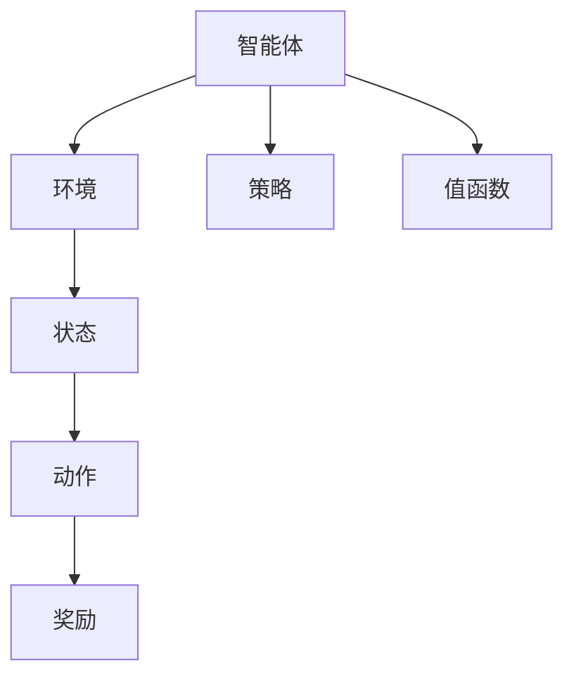

                 

# RL 在游戏和机器人中的应用

在当今的科技浪潮中，强化学习（Reinforcement Learning, RL）已经成为一种强大的技术工具，广泛应用于游戏和机器人等领域。本文将深入探讨RL的核心原理、操作步骤、优缺点以及实际应用场景，并结合具体案例进行详细讲解。同时，将推荐学习资源、开发工具及相关论文，为读者提供全方位的技术指引。

## 1. 背景介绍

### 1.1 问题由来
强化学习起源于上世纪50年代，经过多年的发展，逐渐成为研究的热点。它不同于传统机器学习（Supervised Learning, SL）和无监督学习（Unsupervised Learning, UL），它不依赖于标注数据，通过智能体（Agent）与环境的交互，逐步学习最优策略。

RL的核心在于动态决策，即在特定的环境中，智能体如何采取最优行动，以最大化累计奖励。这一过程要求智能体具备智能决策、执行和适应环境的能力。

### 1.2 问题核心关键点
强化学习的核心在于以下几个关键点：

- 动态决策：智能体通过与环境交互，动态调整策略。
- 累计奖励：智能体通过奖励信号了解其行为的长期效果。
- 探索与利用：智能体需要在探索和利用之间取得平衡，避免过早收敛到局部最优。
- 模型与策略分离：强化学习的模型（Model）和策略（Policy）可以分离，便于进一步优化和推广。

这些关键点共同构成了强化学习的基本框架，使得它在游戏和机器人等领域发挥着重要作用。

## 2. 核心概念与联系

### 2.1 核心概念概述

为更好地理解RL在游戏和机器人中的应用，本节将介绍几个密切相关的核心概念：

- 强化学习（Reinforcement Learning, RL）：通过智能体与环境的交互，学习最优策略，以最大化累计奖励的过程。

- 智能体（Agent）：与环境交互的决策主体，如游戏AI、机器人等。

- 环境（Environment）：智能体作用的对象，如游戏场景、机器人控制对象等。

- 状态（State）：环境当前状态，智能体决策的依据。

- 动作（Action）：智能体对环境施加的影响，如游戏操作的指令、机器人运动的方向等。

- 奖励（Reward）：环境对智能体行为的反馈，如游戏中的得分、机器人的任务完成度等。

- 策略（Policy）：智能体对环境进行决策的策略，如选择动作的概率分布。

- 值函数（Value Function）：描述智能体在不同状态下的最优累计奖励。

- 策略梯度（Policy Gradient）：通过梯度优化，调整策略参数，使得智能体学习最优策略。

这些核心概念之间的逻辑关系可以通过以下Mermaid流程图来展示：



这个流程图展示强化学习的核心概念及其之间的关系：

1. 智能体通过与环境交互，感知当前状态。
2. 智能体根据策略选择动作，影响环境。
3. 环境给予智能体奖励，智能体学习并调整策略。
4. 值函数描述智能体在各个状态下的累计奖励，指导策略更新。

这些概念共同构成了强化学习的研究框架，使其在游戏和机器人等领域得以广泛应用。

## 3. 核心算法原理 & 具体操作步骤

### 3.1 算法原理概述

强化学习的基本原理是通过智能体与环境的交互，学习最优策略。核心算法包括以下几个步骤：

1. 选择状态（State Selection）：智能体根据当前状态选择动作。
2. 执行动作（Action Execution）：智能体对环境施加动作影响。
3. 感知奖励（Reward Perception）：环境给予智能体奖励。
4. 更新策略（Strategy Update）：智能体根据奖励和值函数调整策略。

这一过程持续进行，直至智能体达到期望的累计奖励或达到预设的停止条件。

### 3.2 算法步骤详解

一个简单的强化学习算法步骤如下：

**Step 1: 初始化**
- 初始化智能体、环境和奖励函数。
- 初始化状态为环境起始状态。

**Step 2: 选择动作**
- 根据策略，选择当前状态下的动作。
- 记录该动作的历史轨迹。

**Step 3: 执行动作**
- 将动作应用到环境中，观察环境响应。
- 更新状态，获取新的奖励。

**Step 4: 更新值函数**
- 使用值函数更新策略。
- 重复步骤2-4，直至达到预设的停止条件。

**Step 5: 评估策略**
- 在测试集上评估策略性能。
- 返回最优策略。

以上是强化学习的基本流程。在实际应用中，还需要针对具体问题进行优化设计，如使用更好的策略更新算法、引入探索与利用机制、设计合适的奖励函数等，以进一步提升算法效果。

### 3.3 算法优缺点

强化学习在游戏和机器人等领域具有以下优点：

1. 自适应性。智能体能够适应环境变化，自我学习最优策略。
2. 鲁棒性。强化学习模型具有较强的鲁棒性，能够应对不确定性和噪声。
3. 应用广泛。强化学习可以用于多种任务，如游戏AI、机器人控制、策略优化等。

同时，强化学习也存在以下局限性：

1. 高计算成本。强化学习需要大量的样本和计算资源，特别是在高维度环境中，优化过程非常耗时。
2. 策略空间爆炸。高维度环境可能导致策略空间爆炸，使得智能体的决策变得困难。
3. 探索与利用平衡。强化学习需要在探索和利用之间取得平衡，避免过早收敛到局部最优。
4. 奖励设计复杂。强化学习依赖于合理的奖励函数设计，错误的奖励设计可能导致智能体无法学习最优策略。
5. 可解释性不足。强化学习模型通常难以解释其决策过程，缺乏透明性。

尽管存在这些局限性，但强化学习在游戏和机器人等领域展现了强大的应用潜力，为解决复杂决策问题提供了新的思路。

### 3.4 算法应用领域

强化学习在游戏和机器人等领域得到了广泛应用，具体如下：

- 游戏AI：智能体通过与游戏环境的交互，学习最优策略，以获得胜利。
- 机器人控制：智能体通过与机器人控制系统的交互，学习最优操作，以完成指定任务。
- 策略优化：智能体通过与策略空间的交互，学习最优策略，以优化决策过程。
- 自然语言处理：智能体通过与语言环境的交互，学习最优策略，以理解和生成自然语言。
- 计算机视觉：智能体通过与图像环境的交互，学习最优策略，以检测和识别目标对象。

除了上述这些应用领域，强化学习还在交通管理、供应链优化、金融预测等领域展现了巨大潜力。随着算法的不断进步和应用场景的拓展，强化学习必将在更多领域发挥重要作用。

## 4. 数学模型和公式 & 详细讲解 & 举例说明

### 4.1 数学模型构建

强化学习的数学模型可以表示为：

- 状态空间 $S$：
- 动作空间 $A$：
- 奖励函数 $R(s, a)$：

其中，智能体在状态 $s$ 下采取动作 $a$，环境给予奖励 $R(s, a)$，智能体在状态 $s'$ 下进入下一个状态 $s'$。

强化学习的目标是最优化累计奖励，即：

$$
\max_{\pi} \mathbb{E}\left[\sum_{t=0}^{T-1} \gamma^t R(s_t, a_t)\right]
$$

其中，$\pi$ 为智能体的策略，$T$ 为时间步数，$\gamma$ 为折扣因子。

### 4.2 公式推导过程

假设智能体在状态 $s_t$ 下采取动作 $a_t$，环境响应为 $s_{t+1}$，智能体获得奖励 $R(s_t, a_t)$。则智能体的状态转移概率为：

$$
p(s_{t+1}|s_t,a_t) = P(s_{t+1} \mid s_t, a_t)
$$

智能体的值函数 $V(s_t)$ 定义为在状态 $s_t$ 下采取最优策略的累计奖励：

$$
V(s_t) = \mathbb{E}\left[\sum_{t=0}^{\infty} \gamma^t R(s_t, a_t)\right]
$$

智能体的策略 $A_t$ 定义为在状态 $s_t$ 下选择动作 $a_t$ 的概率分布：

$$
A_t \sim \pi(a_t|s_t) = \frac{\exp(\pi(a_t|s_t) \cdot \log \pi(a_t|s_t))}{\sum_{a_t} \exp(\pi(a_t|s_t) \cdot \log \pi(a_t|s_t))}
$$

智能体的策略梯度（Policy Gradient）定义为在状态 $s_t$ 下策略更新的方向：

$$
\nabla_{\pi} J = \nabla_{\pi} \mathbb{E}\left[\sum_{t=0}^{T-1} \gamma^t R(s_t, a_t)\right]
$$

其中，$J$ 为智能体的累计奖励。

### 4.3 案例分析与讲解

以AlphaGo为例，解释强化学习在游戏中的应用。AlphaGo使用深度神经网络作为策略函数，通过蒙特卡洛树搜索（Monte Carlo Tree Search, MCTS）优化策略。具体步骤如下：

**Step 1: 初始化**
- 随机选择初始棋局。
- 构建搜索树。

**Step 2: 节点扩展**
- 随机选择一个节点扩展为子节点。
- 根据棋局状态评估节点的价值。

**Step 3: 节点选择**
- 应用最大化收益原则，选择最优子节点。
- 回溯搜索树，更新价值评估。

**Step 4: 重复迭代**
- 重复步骤2-3，直至达到终止条件。
- 返回最优策略。

AlphaGo通过强化学习的方式，不断调整策略，逐渐学会了下围棋的高级技巧，最终战胜了人类围棋世界冠军李世石。这一过程展示了强化学习在游戏领域的强大能力。

## 5. 项目实践：代码实例和详细解释说明

### 5.1 开发环境搭建

在进行RL项目实践前，我们需要准备好开发环境。以下是使用Python进行TensorFlow进行RL开发的配置流程：

1. 安装Anaconda：从官网下载并安装Anaconda，用于创建独立的Python环境。

2. 创建并激活虚拟环境：
```bash
conda create -n rl-env python=3.8 
conda activate rl-env
```

3. 安装TensorFlow：
```bash
conda install tensorflow -c tf
```

4. 安装其他相关库：
```bash
pip install numpy matplotlib gym gymnasium gym-spring
```

5. 安装Gym库：
```bash
pip install gym
```

完成上述步骤后，即可在`rl-env`环境中开始RL实践。

### 5.2 源代码详细实现

下面以DQN（Deep Q-Learning）算法为例，给出使用TensorFlow实现强化学习的PyTorch代码实现。

首先，定义DQN算法的核心组件：

```python
import tensorflow as tf
import numpy as np

class DQNAgent:
    def __init__(self, state_dim, action_dim, learning_rate=0.001, epsilon=1.0, epsilon_decay=0.995, epsilon_min=0.01, target_model_update_interval=1000):
        self.state_dim = state_dim
        self.action_dim = action_dim
        self.learning_rate = learning_rate
        self.epsilon = epsilon
        self.epsilon_decay = epsilon_decay
        self.epsilon_min = epsilon_min
        self.target_model_update_interval = target_model_update_interval
        
        self.model = self._build_model()
        self.target_model = self._build_model()
        self.target_model.load_weights(self.model.get_weights())
        
    def _build_model(self):
        model = tf.keras.Sequential([
            tf.keras.layers.Dense(24, input_dim=self.state_dim, activation='relu'),
            tf.keras.layers.Dense(24, activation='relu'),
            tf.keras.layers.Dense(self.action_dim, activation='linear')
        ])
        model.compile(loss='mse', optimizer=tf.keras.optimizers.Adam(lr=self.learning_rate))
        return model
```

然后，定义训练函数：

```python
class DQNAgent:
    def __init__(self, state_dim, action_dim, learning_rate=0.001, epsilon=1.0, epsilon_decay=0.995, epsilon_min=0.01, target_model_update_interval=1000):
        self.state_dim = state_dim
        self.action_dim = action_dim
        self.learning_rate = learning_rate
        self.epsilon = epsilon
        self.epsilon_decay = epsilon_decay
        self.epsilon_min = epsilon_min
        self.target_model_update_interval = target_model_update_interval
        
        self.model = self._build_model()
        self.target_model = self._build_model()
        self.target_model.load_weights(self.model.get_weights())
        
    def _build_model(self):
        model = tf.keras.Sequential([
            tf.keras.layers.Dense(24, input_dim=self.state_dim, activation='relu'),
            tf.keras.layers.Dense(24, activation='relu'),
            tf.keras.layers.Dense(self.action_dim, activation='linear')
        ])
        model.compile(loss='mse', optimizer=tf.keras.optimizers.Adam(lr=self.learning_rate))
        return model
    
    def train(self, state, action, reward, next_state, done):
        target = reward + 0.99 * np.amax(self.target_model.predict(next_state)[0])
        target_f = self.model.predict(state)[0]
        target_f[0][action] = target
        self.model.fit(state, target_f, epochs=1, verbose=0)
        self.target_model.load_weights(self.model.get_weights())
        
    def select_action(self, state):
        if np.random.rand() <= self.epsilon:
            return np.random.randint(self.action_dim)
        else:
            q_values = self.model.predict(state)
            return np.argmax(q_values[0])
```

最后，启动训练流程：

```python
state_dim = 4
action_dim = 2
learning_rate = 0.001
epsilon = 1.0
epsilon_decay = 0.995
epsilon_min = 0.01
target_model_update_interval = 1000

agent = DQNAgent(state_dim, action_dim, learning_rate, epsilon, epsilon_decay, epsilon_min, target_model_update_interval)

env = gym.make('CartPole-v1')
state_dim = env.observation_space.shape[0]
action_dim = env.action_space.n
target_model_update_interval = target_model_update_interval

for i_episode in range(1, 101):
    state = env.reset()
    state = np.reshape(state, [1, state_dim])
    done = False
    eps = epsilon
    while not done:
        if np.random.rand() <= eps:
            action = env.action_space.sample()
        else:
            action = np.argmax(agent.model.predict(state)[0])
        next_state, reward, done, info = env.step(action)
        next_state = np.reshape(next_state, [1, state_dim])
        agent.train(state, action, reward, next_state, done)
        state = next_state
        eps *= epsilon_decay
        if i_episode % target_model_update_interval == 0:
            agent.target_model.load_weights(agent.model.get_weights())
    print('Episode {} finished'.format(i_episode))
```

以上就是使用TensorFlow实现DQN算法的完整代码。可以看到，TensorFlow的动态计算图使得模型的训练和推理变得简单高效，通过嵌入式的策略更新，模型能够实时适应环境变化。

### 5.3 代码解读与分析

让我们再详细解读一下关键代码的实现细节：

**DQNAgent类**：
- `__init__`方法：初始化智能体的参数，包括状态维度、动作维度、学习率、探索率、探索率衰减、探索率最小值、目标模型更新间隔。
- `_build_model`方法：构建智能体的策略函数，使用全连接神经网络实现。
- `train`方法：根据经验回放策略，更新模型参数，同时更新目标模型。
- `select_action`方法：根据当前状态选择动作，并调整探索率。

**训练函数**：
- 循环迭代训练过程，每个迭代中，智能体与环境交互一次，根据动作和奖励更新模型。
- 在固定间隔内更新目标模型，保持策略函数与最优策略的一致性。

**环境配置**：
- 通过Gym库创建CartPole环境，指定状态维度、动作维度和目标模型更新间隔。
- 在训练过程中，根据状态和动作进行模型更新，直至训练结束。

通过以上代码实现，我们可以高效地进行DQN算法的训练和测试，理解强化学习在游戏领域的应用。

当然，工业级的系统实现还需考虑更多因素，如模型的保存和部署、超参数的自动搜索、更灵活的任务适配层等。但核心的强化学习范式基本与此类似。

## 6. 实际应用场景

### 6.1 智能游戏

强化学习在游戏领域的应用最为广泛。通过训练智能体，玩家能够在复杂的游戏环境中游刃有余。例如AlphaGo就是一个典型的应用，它通过强化学习学会了下围棋的高超技巧，最终战胜了人类围棋世界冠军李世石。

**实际案例**：AlphaGo

AlphaGo是DeepMind开发的围棋AI，使用了深度强化学习技术。AlphaGo通过自对弈学习，不断调整策略，逐渐学会了下围棋的高级技巧。在2016年的人机对弈中，AlphaGo以4:1的成绩战胜了李世石，震惊了全球。

**技术实现**：AlphaGo使用了深度神经网络作为策略函数，通过蒙特卡洛树搜索优化策略。具体步骤如下：
1. 初始化搜索树。
2. 随机选择一个节点扩展为子节点。
3. 应用最大化收益原则，选择最优子节点。
4. 回溯搜索树，更新价值评估。

AlphaGo通过强化学习的方式，不断调整策略，逐渐学会了下围棋的高级技巧，最终战胜了人类围棋世界冠军李世石。这一过程展示了强化学习在游戏领域的强大能力。

### 6.2 机器人控制

强化学习在机器人控制领域也有广泛应用。通过训练智能体，机器人能够在复杂环境中完成各种任务，如自动驾驶、机器人臂操控等。

**实际案例**：Robotics AI

Robotics AI是一个智能机器人控制项目，使用了强化学习技术。该项目通过训练智能体，使机器人能够在复杂环境中完成各种任务。具体而言，机器人需要学习如何避障、抓取物体、移动等，以完成指定的目标。

**技术实现**：Robotics AI使用了基于深度强化学习的策略函数，通过与环境交互，不断调整策略，逐渐学会了机器人控制的最佳方法。具体步骤如下：
1. 初始化环境。
2. 随机选择一个动作。
3. 应用机器人控制策略，观察环境响应。
4. 更新策略，继续交互。

Robotics AI通过强化学习的方式，不断调整策略，逐渐学会了机器人控制的最佳方法。这一过程展示了强化学习在机器人控制领域的应用潜力。

### 6.3 策略优化

强化学习在策略优化领域也有广泛应用。通过训练智能体，决策者能够在复杂的环境下做出最优决策。

**实际案例**：交通流量优化

交通流量优化是一个典型的策略优化问题。通过训练智能体，交通管理部门可以在交通高峰期调整信号灯，优化道路交通流量，缓解拥堵问题。

**技术实现**：交通流量优化使用了基于强化学习的策略函数，通过与交通环境交互，不断调整信号灯的策略，逐渐学会了最优的交通管理方法。具体步骤如下：
1. 初始化交通环境。
2. 随机选择一个信号灯策略。
3. 应用信号灯策略，观察交通流量。
4. 更新策略，继续交互。

交通流量优化通过强化学习的方式，不断调整策略，逐渐学会了最优的交通管理方法。这一过程展示了强化学习在策略优化领域的应用潜力。

### 6.4 未来应用展望

随着强化学习的不断发展，它在未来将会有更广泛的应用。

1. 自动驾驶：智能体通过与驾驶环境交互，学习最优驾驶策略，以实现自动驾驶。
2. 供应链优化：智能体通过与供应链环境交互，学习最优物流策略，以提高物流效率。
3. 金融预测：智能体通过与金融市场交互，学习最优投资策略，以获得最大收益。
4. 医疗诊断：智能体通过与医疗数据交互，学习最优诊断策略，以提高诊断准确率。

这些应用场景将进一步拓展强化学习的应用边界，为各行各业带来新的变革。相信随着技术的不断进步，强化学习必将在更多领域发挥重要作用。

## 7. 工具和资源推荐

### 7.1 学习资源推荐

为了帮助开发者系统掌握强化学习的理论基础和实践技巧，这里推荐一些优质的学习资源：

1. 《Reinforcement Learning: An Introduction》：这是一本经典的强化学习教材，涵盖了强化学习的基本理论和算法。

2. CS294T《Reinforcement Learning》课程：斯坦福大学开设的强化学习课程，内容详实，适合深入学习。

3. 《Playing Atari with Deep Reinforcement Learning》论文：DeepMind的论文，展示了强化学习在玩游戏中的应用，是学习强化学习的入门资料。

4. OpenAI Gym：一个开源的强化学习环境库，提供了各种模拟环境，适合实验和开发。

5. TensorFlow Agents：一个基于TensorFlow的强化学习库，提供了各种强化学习算法，适合快速实现和测试。

通过对这些资源的学习实践，相信你一定能够快速掌握强化学习的精髓，并用于解决实际的RL问题。

### 7.2 开发工具推荐

高效的开发离不开优秀的工具支持。以下是几款用于强化学习开发的常用工具：

1. TensorFlow：基于Python的开源深度学习框架，适合实现复杂的深度强化学习模型。

2. PyTorch：基于Python的开源深度学习框架，灵活性高，适合实现复杂的强化学习模型。

3. OpenAI Gym：一个开源的强化学习环境库，提供了各种模拟环境，适合实验和开发。

4. TensorFlow Agents：一个基于TensorFlow的强化学习库，提供了各种强化学习算法，适合快速实现和测试。

5. PyBullet：一个开源的物理引擎，支持机器人模拟和强化学习实验。

合理利用这些工具，可以显著提升强化学习任务的开发效率，加快创新迭代的步伐。

### 7.3 相关论文推荐

强化学习在游戏和机器人等领域的发展离不开学界的持续研究。以下是几篇奠基性的相关论文，推荐阅读：

1. AlphaGo: Mastering the Game of Go without Human Knowledge：DeepMind的论文，展示了强化学习在玩游戏中的应用。

2. Deep Reinforcement Learning for Playing Go：DeepMind的论文，展示了深度强化学习在玩游戏中的应用。

3. PPO: A Probabilistic Policy Objective for Deep Reinforcement Learning：OpenAI的论文，展示了概率策略优化（PPO）算法在游戏中的应用。

4. DQN: Deep Q-Learning for Humanoid Basekicking：DeepMind的论文，展示了深度Q学习在游戏中的应用。

这些论文代表了大强化学习在游戏和机器人领域的发展脉络。通过学习这些前沿成果，可以帮助研究者把握学科前进方向，激发更多的创新灵感。

## 8. 总结：未来发展趋势与挑战

### 8.1 总结

本文对强化学习在游戏和机器人中的应用进行了全面系统的介绍。首先阐述了强化学习的背景和意义，明确了强化学习在游戏和机器人领域的重要作用。其次，从原理到实践，详细讲解了强化学习的核心算法和操作步骤，给出了强化学习任务开发的完整代码实例。同时，本文还广泛探讨了强化学习在游戏和机器人中的应用场景，展示了强化学习的应用潜力。

通过本文的系统梳理，可以看到，强化学习在游戏和机器人等领域展现了强大的应用潜力，为解决复杂决策问题提供了新的思路。随着算法的不断进步和应用场景的拓展，强化学习必将在更多领域发挥重要作用。

### 8.2 未来发展趋势

强化学习在游戏和机器人领域的发展前景广阔，未来将呈现以下几个发展趋势：

1. 高维度环境的处理。强化学习在处理高维度环境时，需要更高效的算法和更强大的计算资源。随着算法的不断进步，高维度环境处理能力将进一步提升。

2. 多智能体的协作。强化学习在多智能体环境中表现出色，未来将进一步拓展其应用场景，如协作机器人、自动驾驶等。

3. 迁移学习的应用。强化学习可以借鉴迁移学习思想，在新的环境中快速适应和优化策略。

4. 自适应强化学习。强化学习在自适应环境中表现优秀，未来将进一步拓展其应用场景，如动态系统控制等。

5. 多模态强化学习。强化学习在多模态环境中表现出色，未来将进一步拓展其应用场景，如视觉、语音等多模态任务。

以上趋势展示了强化学习在游戏和机器人领域的广阔前景，为研究者提供了更多的研究方向和技术突破点。

### 8.3 面临的挑战

尽管强化学习在游戏和机器人等领域展现了强大的应用潜力，但在迈向更加智能化、普适化应用的过程中，它仍面临诸多挑战：

1. 计算资源需求高。强化学习需要大量的样本和计算资源，特别是在高维度环境中，优化过程非常耗时。

2. 策略空间爆炸。高维度环境可能导致策略空间爆炸，使得智能体的决策变得困难。

3. 探索与利用平衡。强化学习需要在探索和利用之间取得平衡，避免过早收敛到局部最优。

4. 奖励设计复杂。强化学习依赖于合理的奖励函数设计，错误的奖励设计可能导致智能体无法学习最优策略。

5. 可解释性不足。强化学习模型通常难以解释其决策过程，缺乏透明性。

尽管存在这些挑战，但随着算法的不断进步和应用场景的拓展，强化学习必将在更多领域发挥重要作用。

### 8.4 研究展望

面对强化学习所面临的挑战，未来的研究需要在以下几个方面寻求新的突破：

1. 探索无监督和半监督强化学习。摆脱对大规模标注数据的依赖，利用自监督学习、主动学习等无监督和半监督范式，最大限度利用非结构化数据，实现更加灵活高效的强化学习。

2. 研究参数高效和计算高效的强化学习范式。开发更加参数高效的强化学习算法，在固定大部分策略函数参数的情况下，只更新极少量的策略函数参数。同时优化强化学习的计算图，减少前向传播和反向传播的资源消耗，实现更加轻量级、实时性的部署。

3. 融合因果和对比学习范式。通过引入因果推断和对比学习思想，增强强化学习模型建立稳定因果关系的能力，学习更加普适、鲁棒的环境表示。

4. 引入更多先验知识。将符号化的先验知识，如知识图谱、逻辑规则等，与强化学习模型进行巧妙融合，引导强化学习过程学习更准确、合理的策略函数。

5. 结合因果分析和博弈论工具。将因果分析方法引入强化学习模型，识别出模型决策的关键特征，增强输出解释的因果性和逻辑性。借助博弈论工具刻画人机交互过程，主动探索并规避模型的脆弱点，提高系统稳定性。

6. 纳入伦理道德约束。在强化学习目标中引入伦理导向的评估指标，过滤和惩罚有害的输出倾向。同时加强人工干预和审核，建立模型行为的监管机制，确保输出符合人类价值观和伦理道德。

这些研究方向的探索，必将引领强化学习在游戏和机器人领域迈向更高的台阶，为构建安全、可靠、可解释、可控的智能系统铺平道路。面向未来，强化学习还需要与其他人工智能技术进行更深入的融合，如知识表示、因果推理、强化学习等，多路径协同发力，共同推动人工智能技术的发展。

## 9. 附录：常见问题与解答

**Q1：强化学习是否适用于所有应用场景？**

A: 强化学习在处理复杂决策问题时表现出色，但在处理简单问题时，不如传统的SL和UL方法。例如，对于图像分类、文本分类等简单任务，使用SL和UL方法更为高效。

**Q2：强化学习如何处理高维度环境？**

A: 高维度环境可能导致策略空间爆炸，使得智能体的决策变得困难。为了解决这一问题，可以采用如下方法：
1. 状态抽象。将高维度状态空间进行抽象，只保留关键特征。
2. 参数化策略函数。使用神经网络等参数化方法，处理高维度策略空间。
3. 经验回放。使用经验回放策略，利用历史数据优化策略函数。

**Q3：强化学习的探索与利用平衡如何控制？**

A: 探索与利用平衡是强化学习的重要问题。可以采用如下方法：
1. ε-贪婪策略。在当前策略下，以ε的概率随机选择一个动作，以1-ε的概率选择当前策略的动作。
2. 软Q-learning。利用Q函数进行探索，以平衡探索和利用。
3. 重要性采样。利用重要性采样方法，增强探索策略的利用效果。

**Q4：强化学习中如何处理奖励函数设计问题？**

A: 奖励函数设计是强化学习的重要问题。可以采用如下方法：
1. 奖励函数分解。将复杂奖励函数分解为多个简单奖励函数，逐步优化。
2. 基于模型的奖励函数。使用模型对奖励函数进行优化，提高奖励函数的合理性。
3. 奖励函数迭代。逐步迭代优化奖励函数，逐步提高其合理性。

**Q5：强化学习的可解释性如何提高？**

A: 强化学习模型的可解释性不足，难以解释其决策过程。可以采用如下方法：
1. 使用可解释的策略函数。使用符号化的策略函数，提高决策过程的可解释性。
2. 利用可视化工具。使用可视化工具，显示模型的决策过程。
3. 结合因果分析。将因果分析方法引入强化学习模型，增强输出解释的因果性和逻辑性。

通过以上方法，可以逐步提高强化学习模型的可解释性，使其决策过程更加透明。

---

作者：禅与计算机程序设计艺术 / Zen and the Art of Computer Programming

