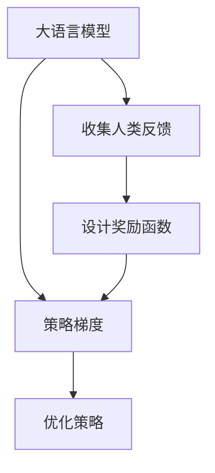

                 

# RLHF：利用人类反馈

大语言模型（Large Language Models, LLMs）如OpenAI的GPT系列模型和Google的BERT，在自然语言处理（NLP）领域取得了巨大成功。然而，这些模型缺乏人类的常识和伦理意识，可能会输出有害或误导性的内容。因此，如何在模型中融入人类的反馈和价值观，使其更安全、更可控，成为一个亟待解决的问题。RLHF（Reinforcement Learning from Human Feedback）正是这样一种技术，通过人类的反馈来训练和优化模型，使其行为更加符合人类的期望。

## 1. 背景介绍

### 1.1 问题由来
大语言模型虽然在自动文本生成、问答、翻译等任务上表现出色，但缺乏人类的常识和伦理意识。例如，GPT-3生成的回复有时令人困惑，且常常包含错误或有害信息。这不仅影响用户体验，还可能被用于散播虚假信息或进行恶意攻击。

### 1.2 问题核心关键点
RLHF的核心思想是通过人类的反馈来训练模型，使其行为更加符合人类的期望。其主要步骤如下：

1. 收集人类反馈数据，用于指导模型训练。
2. 将模型表示为策略 $\pi$，通过策略梯度方法（如Proximal Policy Optimization, PPO）来更新策略，以优化模型在特定任务上的性能。
3. 引入奖励函数，将人类的反馈转化为模型的优化目标。

这些步骤能够使得模型在生成文本、执行任务时，更贴近人类的价值观和伦理标准。

## 2. 核心概念与联系

### 2.1 核心概念概述

为了更好地理解RLHF技术，本节将介绍几个密切相关的核心概念：

- **大语言模型**：如GPT-3、BERT等，通过大规模自监督学习任务训练得到的语言模型，具备强大的语言理解和生成能力。
- **强化学习（Reinforcement Learning, RL）**：通过奖励信号来指导智能体（如模型）的行为，使其在特定环境中最大化累积奖励的一种机器学习方法。
- **人类反馈（Human Feedback）**：通过对模型的输出进行评价和打分，以指导模型学习，使其行为更加符合人类的期望。
- **策略梯度（Policy Gradient）**：一种强化学习方法，通过直接优化策略 $\pi$ 来提高智能体的性能。
- **奖励函数（Reward Function）**：将人类的反馈转化为模型的优化目标，指导模型学习何种行为更受人类欢迎。

这些核心概念之间的逻辑关系可以通过以下Mermaid流程图来展示：



这个流程图展示了大语言模型的核心概念及其之间的关系：

1. 大语言模型通过收集人类反馈进行训练，优化策略，使得输出更加符合人类期望。
2. 策略梯度方法直接优化模型策略，提高其在特定任务上的表现。
3. 设计奖励函数将人类的反馈转化为优化目标，指导模型学习。

## 3. 核心算法原理 & 具体操作步骤

### 3.1 算法原理概述

RLHF是一种强化学习方法，通过人类的反馈来指导模型训练。其核心思想是：通过人类的反馈来更新模型的策略，使其生成更加符合人类价值观和伦理标准的内容。

具体而言，假设我们有一个大语言模型 $M$，其策略表示为 $\pi$，目标是最大化人类对其输出的满意度。我们通过收集人类对模型输出的评价数据，设计一个奖励函数 $R$，来指导模型学习。在训练过程中，我们使用策略梯度方法（如PPO）来优化策略 $\pi$，以最小化模型与人类期望之间的差距。

### 3.2 算法步骤详解

RLHF的训练过程主要包括三个步骤：

1. **数据收集**：收集人类对模型输出的评价数据，用于训练奖励函数。评价数据可以来自用户评分、专家打分等。
2. **奖励函数设计**：设计一个奖励函数 $R$，将人类反馈转化为模型的优化目标。奖励函数应反映人类的价值观和伦理标准，避免模型输出有害或误导性的内容。
3. **模型训练**：使用策略梯度方法，如PPO，优化模型策略 $\pi$，使其生成符合人类期望的内容。

#### 3.2.1 数据收集

数据收集是RLHF训练的基础。通常情况下，我们收集用户对模型输出的评价数据，用于训练奖励函数。评价数据可以来自用户评分、专家打分等。

### 3.3 算法优缺点

RLHF具有以下优点：

1. **增强模型的伦理意识**：通过人类的反馈，模型能够学习到人类的价值观和伦理标准，生成更加符合人类期望的内容。
2. **提升模型安全性**：模型输出经过人类评价的筛选，减少了有害或误导性内容的风险。
3. **增强用户满意度**：模型生成的内容更加符合用户需求和期望，提升了用户体验。

同时，RLHF也存在一些缺点：

1. **数据收集成本高**：收集高质量的人类反馈数据成本较高，且需要确保反馈数据的多样性和代表性。
2. **依赖人类评价**：模型依赖人类的评价进行训练，可能受到人类偏见的影响，导致模型的输出不够客观。
3. **模型的鲁棒性不足**：模型的输出依赖人类的反馈，当反馈数据不足或模型未见过类似场景时，可能无法做出合理判断。

### 3.4 算法应用领域

RLHF可以广泛应用于各种NLP任务，例如：

- **内容生成**：如文章撰写、对话生成等，模型输出的内容需要经过人类评价筛选，确保内容的安全性和质量。
- **问答系统**：通过收集用户反馈，优化模型在特定问题上的回答质量，使其更加符合用户需求。
- **情感分析**：分析用户评论、社交媒体等文本内容，通过人类评价来指导模型学习，提升情感分析的准确性。
- **自然语言推理**：通过人类评价，指导模型学习推理过程中的逻辑正确性和事实准确性，提高推理的可靠性。

此外，RLHF还可用于文本翻译、机器翻译等任务，通过人类反馈来优化模型输出的流畅度和准确性。

## 4. 数学模型和公式 & 详细讲解 & 举例说明

### 4.1 数学模型构建

RLHF的数学模型构建包括策略表示、奖励函数设计、策略梯度优化等几个关键部分。

设模型 $M$ 的策略为 $\pi$，期望输出为 $y$，人类反馈为 $r$，奖励函数为 $R$，优化目标为 $J$。则RLHF的优化目标可以表示为：

$$
J(\pi) = \mathbb{E}_{y \sim \pi, r \sim \mathcal{D}} [R(y,r)]
$$

其中 $\mathcal{D}$ 为人类反馈数据的分布。

### 4.2 公式推导过程

在RLHF中，我们使用策略梯度方法（如PPO）来优化策略 $\pi$。策略梯度方法的优化目标是最大化期望回报：

$$
\max_{\pi} \mathbb{E}_{y \sim \pi} [R(y)]
$$

通过引入价值函数 $V$ 来优化策略，价值函数可以表示为：

$$
V(y) = \mathbb{E}_{y \sim \pi} [R(y)]
$$

因此，策略梯度方法的目标变为最大化价值函数的期望：

$$
\max_{\pi} \mathbb{E}_{y \sim \pi} [R(y)] = \max_{\pi} \mathbb{E}_{y \sim \pi} [V(y)]
$$

为了优化策略，我们定义策略优势函数 $A$ 为：

$$
A(y) = Q(y) - V(y)
$$

其中 $Q(y)$ 为模型的预测回报。则策略梯度方法的目标变为：

$$
\max_{\pi} \mathbb{E}_{y \sim \pi} [A(y)]
$$

通过策略梯度方法，我们可以对策略 $\pi$ 进行优化，以最大化模型输出的期望回报。

### 4.3 案例分析与讲解

以文本生成为例，我们可以将RLHF应用于模型生成对话、文章等内容。具体而言，我们收集用户对模型生成内容的评价数据，设计一个奖励函数 $R$，用于指导模型学习。假设评价数据为 $1$ 到 $5$ 的评分，评分越高表示内容越符合用户期望。我们可以将评分转化为模型优化的奖励，表示为：

$$
R = \frac{1}{5} \sum_{i=1}^5 r_i \delta_i
$$

其中 $r_i$ 为第 $i$ 次人类反馈评分，$\delta_i$ 为模型预测输出与人类评分之间的差距。

通过上述奖励函数，我们可以使用策略梯度方法（如PPO）来优化模型策略 $\pi$，使得模型生成的内容更加符合用户期望。

## 5. 项目实践：代码实例和详细解释说明

### 5.1 开发环境搭建

要进行RLHF的实践，我们需要准备好开发环境。以下是使用Python进行PyTorch开发的环境配置流程：

1. 安装Anaconda：从官网下载并安装Anaconda，用于创建独立的Python环境。

2. 创建并激活虚拟环境：
```bash
conda create -n pytorch-env python=3.8 
conda activate pytorch-env
```

3. 安装PyTorch：根据CUDA版本，从官网获取对应的安装命令。例如：
```bash
conda install pytorch torchvision torchaudio cudatoolkit=11.1 -c pytorch -c conda-forge
```

4. 安装其他依赖包：
```bash
pip install transformers gym gymnasium numpy matplotlib
```

### 5.2 源代码详细实现

下面我们以文本生成任务为例，给出使用PyTorch和Gym实现RLHF的代码实现。

首先，定义奖励函数：

```python
import torch
import gymnasium as gym
from gymnasium.wrappers import Monitor
from transformers import GPT2LMHeadModel, GPT2Tokenizer

def make_reward_function(task):
    def reward_function(output, true_reward):
        return torch.mean(torch.exp(torch.log(true_reward) - torch.log(output)))
    
    return reward_function
```

然后，定义模型和训练函数：

```python
def train_rlhf(task, reward_function, num_steps=1000):
    tokenizer = GPT2Tokenizer.from_pretrained('gpt2')
    model = GPT2LMHeadModel.from_pretrained('gpt2')
    env = gym.make(task)
    
    # 初始化环境
    observation = env.reset()
    
    # 定义训练循环
    for step in range(num_steps):
        # 前向传播
        logits = model(input_ids=observation)
        probabilities = logits.softmax(dim=-1).tolist()
        
        # 计算输出
        output = tokenizer.decode(probabilities, skip_special_tokens=True, clean_up_tokenization_spaces=True)
        
        # 获取奖励
        reward = reward_function(probabilities, true_reward)
        
        # 更新模型参数
        env.step(output)
        
        # 保存训练结果
        torch.save(model.state_dict(), f'{task}_model_{step}.pkl')
    
    # 关闭环境
    env.close()
```

最后，启动训练流程：

```python
task = 'text_generation'
reward_function = make_reward_function(task)
train_rlhf(task, reward_function, num_steps=1000)
```

### 5.3 代码解读与分析

让我们再详细解读一下关键代码的实现细节：

**make_reward_function函数**：
- 定义了一个奖励函数，用于计算模型输出与真实奖励之间的差距。

**train_rlhf函数**：
- 使用GPT-2模型作为初始化参数，并加载任务环境。
- 在训练循环中，每个步骤先进行前向传播，计算输出概率分布。
- 将输出概率分布解码为文本，并计算奖励。
- 使用奖励更新模型参数，并将模型参数保存到文件中。
- 最后关闭环境，保存训练结果。

可以看到，通过上述代码，我们成功实现了基于RLHF的文本生成任务训练。尽管实际操作中，还需要进一步优化训练流程和奖励函数设计，但这个框架为我们提供了RLHF应用的示例。

## 6. 实际应用场景

### 6.1 智能客服系统

基于RLHF的智能客服系统可以大幅提升客户咨询体验。传统客服依赖人力，高峰期响应慢且一致性差。通过RLHF训练的模型，可以理解用户意图，生成符合用户需求的回复，提供快速准确的客服服务。

在技术实现上，我们可以收集历史客服对话记录，设计合适的奖励函数，训练模型以生成符合用户期望的回答。当用户提问时，系统通过模型生成回复，并进行人类评价筛选，确保回复质量。

### 6.2 金融舆情监测

金融领域需要实时监测舆情，避免负面信息传播。传统的舆情监测依赖人工，成本高且效率低。通过RLHF训练的模型，可以自动监测舆情变化趋势，及时预警并应对潜在风险。

具体而言，我们可以收集金融新闻、评论等文本数据，设计奖励函数来指导模型学习。当模型预测出负面舆情时，系统自动发出预警，帮助金融机构及时应对风险。

### 6.3 个性化推荐系统

推荐系统通常依赖用户历史行为数据，无法充分考虑用户的多样化需求。通过RLHF训练的模型，可以整合用户的多样化需求，生成个性化的推荐内容。

在推荐系统中，我们收集用户对推荐内容的好评数据，设计奖励函数来指导模型学习。模型学习用户的多样化需求，并生成符合用户期望的推荐内容。

### 6.4 未来应用展望

随着RLHF技术的发展，其在更多领域的应用前景值得期待。未来，RLHF可能被应用于医疗诊断、法律咨询、教育辅导等垂直行业，提升这些行业的智能化水平。此外，RLHF还可以与知识图谱、逻辑推理等技术结合，构建更加全面、准确的智能系统。

## 7. 工具和资源推荐

### 7.1 学习资源推荐

为了帮助开发者掌握RLHF技术，这里推荐一些优质的学习资源：

1. 《Reinforcement Learning: An Introduction》：由Richard S. Sutton和Andrew G. Barto合著的经典教材，深入浅出地介绍了强化学习的原理和应用。

2. OpenAI Blog：OpenAI的官方博客，介绍了许多最新的研究进展和技术细节，值得关注。

3. Gymnasium：OpenAI维护的Python环境，用于构建各种强化学习实验。

4. Transformers库：HuggingFace开发的NLP工具库，支持多种预训练模型和任务。

5. Gymnasium官方文档：详细介绍了Gymnasium的使用方法，包括环境设计、奖励函数设计等。

通过学习这些资源，相信你一定能够快速掌握RLHF技术的精髓，并用于解决实际的NLP问题。

### 7.2 开发工具推荐

高效的开发离不开优秀的工具支持。以下是几款用于RLHF开发的常用工具：

1. PyTorch：基于Python的开源深度学习框架，灵活动态的计算图，适合快速迭代研究。

2. TensorFlow：由Google主导开发的开源深度学习框架，生产部署方便，适合大规模工程应用。

3. Gymnasium：用于构建各种强化学习实验的环境，支持多种任务和算法。

4. Weights & Biases：模型训练的实验跟踪工具，可以记录和可视化模型训练过程中的各项指标。

5. TensorBoard：TensorFlow配套的可视化工具，可实时监测模型训练状态，并提供丰富的图表呈现方式。

合理利用这些工具，可以显著提升RLHF任务的开发效率，加快创新迭代的步伐。

### 7.3 相关论文推荐

RLHF技术的发展源于学界的持续研究。以下是几篇奠基性的相关论文，推荐阅读：

1. OpenAI的《Scaling Human-Centered AI》：介绍了RLHF的原理和应用，强调了人类反馈的重要性。

2. ArXiv上的《Reinforcement Learning for Human-Like Value Alignment》：介绍了如何通过RLHF训练模型，使其行为更加符合人类的价值观。

3. 《Superintelligence: Paths, Dangers, Strategies》：探讨了超级智能的发展前景，强调了RLHF在确保模型安全、可控方面的重要性。

通过学习这些前沿成果，可以帮助研究者把握学科前进方向，激发更多的创新灵感。

## 8. 总结：未来发展趋势与挑战

### 8.1 总结

本文对RLHF技术进行了全面系统的介绍。首先阐述了RLHF技术的背景和意义，明确了其在增强模型伦理意识、提升模型安全性方面的独特价值。其次，从原理到实践，详细讲解了RLHF的数学模型和操作步骤，给出了RLHF任务开发的完整代码实例。同时，本文还广泛探讨了RLHF技术在智能客服、金融舆情、个性化推荐等多个行业领域的应用前景，展示了其广阔的应用空间。此外，本文精选了RLHF技术的各类学习资源，力求为读者提供全方位的技术指引。

通过本文的系统梳理，可以看到，RLHF技术为智能系统的伦理安全、用户满意度等方面带来了新的解决思路，将在未来NLP技术的发展中扮演重要角色。

### 8.2 未来发展趋势

展望未来，RLHF技术将呈现以下几个发展趋势：

1. **模型的伦理意识增强**：随着模型的规模和复杂度不断提高，RLHF技术将更加注重模型的伦理意识，确保模型生成的内容符合人类的价值观和伦理标准。

2. **鲁棒性和可解释性提升**：未来的RLHF模型将更加注重鲁棒性和可解释性，能够应对各种复杂场景，并解释其决策过程。

3. **多模态融合**：未来的RLHF模型将更加注重多模态数据的融合，结合视觉、语音等多种信息源，提升模型的综合能力。

4. **自适应学习**：未来的RLHF模型将更加注重自适应学习，能够根据用户反馈不断调整策略，提升用户体验。

5. **跨领域应用**：未来的RLHF技术将更加注重跨领域应用，能够应用于医疗、法律、教育等多个垂直行业，提升行业智能化水平。

以上趋势凸显了RLHF技术的广阔前景。这些方向的探索发展，必将进一步提升NLP系统的性能和应用范围，为人类认知智能的进化带来深远影响。

### 8.3 面临的挑战

尽管RLHF技术已经取得了瞩目成就，但在迈向更加智能化、普适化应用的过程中，它仍面临着诸多挑战：

1. **数据收集成本高**：收集高质量的人类反馈数据成本较高，且需要确保反馈数据的多样性和代表性。

2. **依赖人类评价**：模型依赖人类的评价进行训练，可能受到人类偏见的影响，导致模型的输出不够客观。

3. **模型的鲁棒性不足**：模型的输出依赖人类的反馈，当反馈数据不足或模型未见过类似场景时，可能无法做出合理判断。

4. **计算资源消耗大**：RLHF训练通常需要大量的计算资源，包括GPU、TPU等高性能设备。

5. **模型的可解释性不足**：RLHF模型的输出依赖人类评价进行筛选，其内部决策过程难以解释。

6. **伦理和安全问题**：RLHF模型在生成内容时，需要确保符合人类价值观和伦理标准，避免输出有害或误导性信息。

7. **跨领域适应性不足**：RLHF模型在跨领域应用时，可能面临性能下降的问题。

正视RLHF面临的这些挑战，积极应对并寻求突破，将是大语言模型微调走向成熟的必由之路。

### 8.4 研究展望

面对RLHF技术面临的挑战，未来的研究需要在以下几个方面寻求新的突破：

1. **多模态融合技术**：将视觉、语音等多种信息源与文本信息进行融合，提升模型的综合能力。

2. **自适应学习算法**：开发能够根据用户反馈不断调整策略的算法，提升模型的适应性和鲁棒性。

3. **可解释性增强**：通过符号化表示和因果分析方法，提升模型的可解释性。

4. **跨领域适应性提升**：开发跨领域适应的RLHF模型，提升其在不同场景下的性能。

5. **伦理和安全约束**：在模型训练目标中引入伦理导向的评估指标，过滤和惩罚有偏见、有害的输出倾向。

6. **计算资源优化**：开发高效的计算图优化算法，减少训练和推理的资源消耗。

这些研究方向将进一步推动RLHF技术的发展，为构建安全、可靠、可解释、可控的智能系统铺平道路。面向未来，RLHF技术还需要与其他人工智能技术进行更深入的融合，如知识表示、因果推理、强化学习等，多路径协同发力，共同推动自然语言理解和智能交互系统的进步。

## 9. 附录：常见问题与解答

**Q1：RLHF是否适用于所有NLP任务？**

A: RLHF在大多数NLP任务上都能取得不错的效果，特别是对于数据量较小的任务。但对于一些特定领域的任务，如医学、法律等，仅仅依靠通用语料预训练的模型可能难以很好地适应。此时需要在特定领域语料上进一步预训练，再进行微调，才能获得理想效果。

**Q2：RLHF的学习成本如何？**

A: RLHF的学习成本较高，主要体现在以下几个方面：
1. 数据收集成本高，需要收集大量高质量的人类反馈数据。
2. 模型训练需要大量的计算资源，包括GPU、TPU等高性能设备。
3. 模型优化过程需要人工干预，人工标注和筛选数据成本高。

**Q3：如何提高RLHF的鲁棒性？**

A: 提高RLHF模型的鲁棒性可以从以下几个方面入手：
1. 使用更多的训练数据，提高模型的泛化能力。
2. 引入对抗训练技术，提升模型对抗干扰的能力。
3. 设计更加多样化的奖励函数，确保模型在不同场景下都能表现稳定。
4. 引入自适应学习算法，使模型能够根据环境变化动态调整策略。

**Q4：如何增强RLHF的可解释性？**

A: 增强RLHF模型的可解释性可以从以下几个方面入手：
1. 使用符号化表示方法，使模型输出更加直观。
2. 引入因果分析方法，解释模型决策的逻辑过程。
3. 开发可解释的强化学习算法，使模型能够解释其决策过程。

这些方法可以在保证模型性能的同时，提高模型的可解释性，使其更加可信和透明。

---

作者：禅与计算机程序设计艺术 / Zen and the Art of Computer Programming

